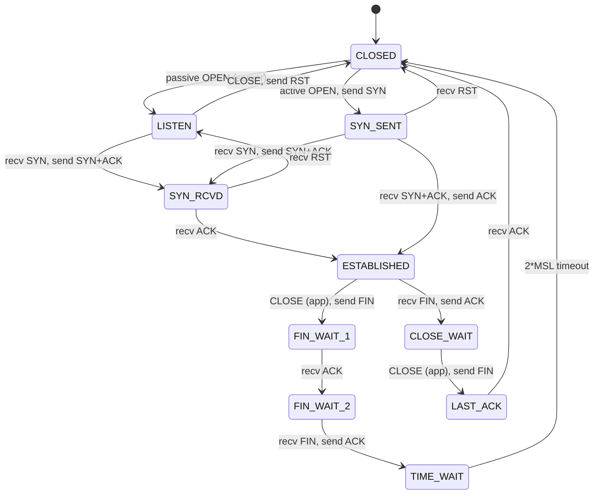

## Overview

The transport layer provides end-to-end communication services between processes on different hosts.
Two protocols dominate: TCP (reliable, connection-oriented, byte-stream) and UDP (unreliable,
connectionless, datagram). Understanding the trade-offs between them, and how TCP achieves
reliability over an unreliable network, is fundamental to systems engineering.

### The Transport Layer in Context

The transport layer is the first layer where the concept of a "connection" exists (for TCP). The
network layer (IP) delivers individual packets with no guarantees. The transport layer builds on
this unreliable foundation to provide the reliability that applications need.

The transport layer is also where **multiplexing** happens. Multiple applications on the same host
can communicate over the network simultaneously because the transport layer uses port numbers to
demultiplex incoming packets to the correct application socket. This is why you can run a web server
(port 80), a database (port 5432), and an SSH daemon (port 22) on the same machine simultaneously.

The socket API is the standard interface for transport-layer communication. Defined in BSD Unix in
the early 1980s, it provides a uniform interface for TCP, UDP, and other transport protocols. The
socket API is the de facto standard across all operating systems.

## UDP (User Datagram Protocol)

UDP (RFC 768) is the simplest transport protocol. It provides a minimal interface: applications send
and receive datagrams with no guarantees of delivery, ordering, or duplicate suppression.

### UDP Header

The UDP header is 8 bytes -- the smallest of any transport protocol:

```
 0                   1                   2                   3
 0 1 2 3 4 5 6 7 8 9 0 1 2 3 4 5 6 7 8 9 0 1 2 3 4 5 6 7 8 9 0 1
+-+-+-+-+-+-+-+-+-+-+-+-+-+-+-+-+-+-+-+-+-+-+-+-+-+-+-+-+-+-+-+-+
|          Source Port          |       Destination Port        |
+-+-+-+-+-+-+-+-+-+-+-+-+-+-+-+-+-+-+-+-+-+-+-+-+-+-+-+-+-+-+-+-+
|            Length             |           Checksum            |
+-+-+-+-+-+-+-+-+-+-+-+-+-+-+-+-+-+-+-+-+-+-+-+-+-+-+-+-+-+-+-+-+
|                    data (variable length)                    |
+-+-+-+-+-+-+-+-+-+-+-+-+-+-+-+-+-+-+-+-+-+-+-+-+-+-+-+-+-+-+-+-+
```

- **Source Port (16 bits):** Optional. Identifies the sending process. If zero, the receiver should
  not respond.
- **Destination Port (16 bits):** Required. Identifies the receiving process.
- **Length (16 bits):** Total length of the UDP header and data. Minimum is 8 (header only).
- **Checksum (16 bits):** Optional in IPv4 (zero means "not computed"), mandatory in IPv6. Covers
  the UDP header, data, and a pseudo-header (source/destination IP, protocol number, length). The
  pseudo-header binds the UDP checksum to specific IP endpoints, preventing a misdirected datagram
  from being accepted.

### UDP Characteristics

- **Connectionless:** No handshake. No connection state on either endpoint. The sender creates a
  datagram and sends it. The receiver gets it or does not. There is no setup or teardown.
- **Unreliable:** No acknowledgments, no retransmissions. Datagrams may be lost, duplicated, or
  arrive out of order. The application is responsible for handling these cases if needed.
- **Message-oriented:** Each `sendto()` call produces exactly one datagram. The receiver gets the
  exact message boundaries. This is fundamentally different from TCP's byte-stream model.
- **No flow control:** If the receiver cannot keep up, datagrams are silently dropped. The kernel's
  receive buffer fills up, and new datagrams are discarded. `ss -uanp` shows the receive queue
  depth.
- **No congestion control:** UDP sends as fast as the application produces data, which can cause
  packet loss on congested networks. This is why UDP-based protocols that send at high rates (e.g.,
  video streaming, VPNs) must implement their own congestion control.
- **Low overhead:** 8-byte header vs 20-byte minimum for TCP. No connection establishment or
  teardown latency. A single UDP datagram requires one packet in each direction, compared to TCP's
  three-way handshake (3 packets) plus data transfer.

### Maximum UDP Payload

The theoretical maximum UDP payload is 65,527 bytes (65,535 total minus 8-byte header). In practice:

- **IPv4:** The payload must fit within the path MTU minus IP header (20 bytes) and UDP header (8
  bytes). Over standard Ethernet, the safe maximum is $1500 - 20 - 8 = 1472$ bytes. Larger datagrams
  are fragmented by the source. Fragmented UDP is unreliable -- if any fragment is lost, the entire
  datagram is lost.
- **IPv6:** IPv6 requires the source to perform Path MTU Discovery. Fragmentation is only performed
  by the source, not by routers. This means UDP over IPv6 has stricter size limits and may fail
  differently than over IPv4.
- **Practical limit:** Many implementations cap UDP buffers at 8192 or 9216 bytes. Applications that
  need to send more should implement their own fragmentation.

### When to Use UDP

UDP is the right choice when:

1. **Low latency matters more than reliability.** Real-time audio/video, gaming, and live streaming
   use UDP because retransmitting a late packet makes it later. A dropped video frame is acceptable;
   a delayed video frame causes stuttering.
2. **The application implements its own reliability.** QUIC, WebRTC, and DNS (over TCP for zone
   transfers) implement reliability at the application layer, using UDP as a substrate. QUIC adds
   congestion control, reliability, and ordering on top of UDP.
3. **Multicast/broadcast delivery is required.** UDP supports multicast and broadcast addressing.
   TCP does not. Streaming protocols (IPTV), discovery protocols (mDNS, SSDP), and financial market
   data feeds use UDP multicast.
4. **Simple request-response with small payloads.** DNS queries, NTP, and SNMP use UDP because the
   overhead of TCP (3-way handshake, 20-byte header) is disproportionate for small exchanges. A DNS
   query is typically under 100 bytes; TCP's 60-byte minimum overhead for connection setup is
   wasteful.
5. **Head-of-line blocking is unacceptable.** TCP's ordered delivery means one lost packet blocks
   delivery of all subsequent packets. UDP allows the receiver to process newer data while waiting
   for retransmissions.

### UDP in Practice

```bash
# Test UDP connectivity with netcat
nc -u -v 192.168.1.100 53

# Send a DNS query over UDP
dig @8.8.8.8 example.com

# UDP-based services
# DNS (53), NTP (123), SNMP (161), syslog (514)
# QUIC (443), WireGuard (51820), mDNS (5353)
```

### UDP Server and Client Examples

```c
/* UDP server (simplified) */
int sockfd = socket(AF_INET, SOCK_DGRAM, 0);
struct sockaddr_in addr = {
    .sin_family = AF_INET,
    .sin_port = htons(8080),
    .sin_addr.s_addr = INADDR_ANY
};
bind(sockfd, (struct sockaddr *)&addr, sizeof(addr));

char buf[65535];
struct sockaddr_in client_addr;
socklen_t client_len = sizeof(client_addr);
ssize_t n = recvfrom(sockfd, buf, sizeof(buf), 0,
    (struct sockaddr *)&client_addr, &client_len);
sendto(sockfd, buf, n, 0,
    (struct sockaddr *)&client_addr, client_len);
```

```c
/* UDP client (simplified) */
int sockfd = socket(AF_INET, SOCK_DGRAM, 0);
struct sockaddr_in server_addr = {
    .sin_family = AF_INET,
    .sin_port = htons(8080),
    .sin_addr.s_addr = inet_addr("192.168.1.100")
};
sendto(sockfd, "hello", 5, 0,
    (struct sockaddr *)&server_addr, sizeof(server_addr));
```

:::warning

UDP traffic is often blocked by firewalls because there is no connection handshake to track state.
Many NAT devices have difficulty forwarding UDP traffic correctly. UDP-based protocols often
implement their own keepalive and NAT traversal mechanisms (e.g., STUN/TURN for WebRTC, WireGuard's
keepalive). UDP NAT mappings have shorter timeouts than TCP (30-60 seconds vs hours), so long-lived
UDP flows without keepalives will lose their NAT mappings.

:::

## TCP (Transmission Control Protocol)

TCP (RFC 793) provides reliable, ordered, error-checked, byte-stream delivery between two endpoints.
It is the workhorse of the Internet -- virtually every non-real-time application uses TCP.

### TCP Connection Management

#### Three-Way Handshake (Connection Establishment)

TCP uses a three-way handshake to establish a connection before data transfer begins:

```
Client                          Server
  |--- SYN (seq=x) ------------->|    Client proposes ISN=x
  |<-- SYN+ACK (seq=y,ack=x+1) -|    Server acknowledges x, proposes ISN=y
  |--- ACK (seq=x+1,ack=y+1) --->|    Client acknowledges y
  |                              |
  |==== Connection Established ==|
```

1. **SYN:** The client sends a SYN (synchronize) segment with a random Initial Sequence Number
   (ISN). The ISN is not zero -- it is randomized (RFC 6056) to prevent certain attacks (TCP blind
   injection, connection reset). The ISN is a 32-bit value generated using a cryptographically
   secure algorithm (MD5 hash of source IP, destination IP, source port, destination port, and a
   secret key, plus a counter).
2. **SYN-ACK:** The server responds with its own ISN and acknowledges the client's ISN by setting
   `ACK = x + 1`.
3. **ACK:** The client acknowledges the server's ISN. The connection is now established and both
   sides can send data.

After the handshake, both sides have exchanged and acknowledged each other's sequence numbers. The
sequence numbers are used to track byte positions in the byte stream.

**TCP Fast Open (TFO, RFC 7413):** Allows the client to include data in the SYN segment, saving one
RTT on subsequent connections. The server issues a "cookie" in the SYN-ACK, and the client includes
this cookie with data in subsequent SYNs. Requires kernel support (Linux 3.7+).

#### Four-Way Teardown (Connection Termination)

TCP uses a four-way handshake to close a connection, because each direction is closed independently:

```
Client                          Server
  |--- FIN (seq=u) ------------->|    Client: "I have no more data to send"
  |<-- ACK (seq=v,ack=u+1) ------|    Server acknowledges
  |                              |    Server may still send data
  |<-- FIN (seq=w) -------------|    Server: "I have no more data to send"
  |--- ACK (seq=u+1,ack=w+1) -->|    Client acknowledges
  |                              |
  |==== Connection Closed =======|
```

The endpoint that sends the first FIN enters the `FIN-WAIT-2` state. The endpoint that sends the
second FIN enters the `LAST-ACK` state. After sending the final ACK, the first endpoint enters
`TIME-WAIT` and waits for $2 \times \mathrm{MSL}$ (Maximum Segment Lifetime, typically 60 seconds
per MSL, so 120 seconds total) before releasing the connection.

**Why TIME-WAIT?**

1. Ensures the final ACK reaches the server. If the server retransmits its FIN, the client
   retransmits the ACK. Without TIME-WAIT, the client would have released the connection and would
   respond with RST, aborting the connection.
2. Allows old duplicate segments from the previous connection to expire, preventing them from being
   interpreted as part of a new connection with the same 4-tuple (source IP, source port,
   destination IP, destination port). The 2MSL wait ensures that any delayed segments from the old
   connection have been delivered or dropped.

:::info

The TIME-WAIT state is the source of one of the most common production networking issues. A server
that rapidly opens and closes connections (e.g., an HTTP/1.1 server without keep-alive) accumulates
connections in TIME-WAIT on the client side. If the client exhausts its ephemeral port space, new
connections fail with "address already in use." Solutions include `SO_REUSEADDR`/`SO_REUSEPORT`
socket options, the `tcp_tw_reuse` kernel parameter (Linux), or using connection pooling. The
default ephemeral port range on Linux is 32768-60999 (28,232 ports).

:::

### TCP Segment Structure

```
 0                   1                   2                   3
 0 1 2 3 4 5 6 7 8 9 0 1 2 3 4 5 6 7 8 9 0 1 2 3 4 5 6 7 8 9 0 1
+-+-+-+-+-+-+-+-+-+-+-+-+-+-+-+-+-+-+-+-+-+-+-+-+-+-+-+-+-+-+-+-+
|          Source Port          |       Destination Port        |
+-+-+-+-+-+-+-+-+-+-+-+-+-+-+-+-+-+-+-+-+-+-+-+-+-+-+-+-+-+-+-+-+
|                        Sequence Number                       |
+-+-+-+-+-+-+-+-+-+-+-+-+-+-+-+-+-+-+-+-+-+-+-+-+-+-+-+-+-+-+-+-+
|                    Acknowledgment Number                      |
+-+-+-+-+-+-+-+-+-+-+-+-+-+-+-+-+-+-+-+-+-+-+-+-+-+-+-+-+-+-+-+-+
|  Data |           |U|A|P|R|S|F|                               |
| Offset| Reserved  |R|C|S|S|Y|I|            Window             |
|       |           |G|K|H|R|N|N|                               |
+-+-+-+-+-+-+-+-+-+-+-+-+-+-+-+-+-+-+-+-+-+-+-+-+-+-+-+-+-+-+-+-+
|           Checksum            |         Urgent Pointer        |
+-+-+-+-+-+-+-+-+-+-+-+-+-+-+-+-+-+-+-+-+-+-+-+-+-+-+-+-+-+-+-+-+
|                    Options (variable)                         |
+-+-+-+-+-+-+-+-+-+-+-+-+-+-+-+-+-+-+-+-+-+-+-+-+-+-+-+-+-+-+-+-+
|                     Data (variable)                           |
+-+-+-+-+-+-+-+-+-+-+-+-+-+-+-+-+-+-+-+-+-+-+-+-+-+-+-+-+-+-+-+-+
```

**Key fields:**

| Field                   | Size         | Purpose                                                       |
| ----------------------- | ------------ | ------------------------------------------------------------- |
| Source/Destination Port | 16 bits each | Multiplexing/demultiplexing                                   |
| Sequence Number         | 32 bits      | Byte position of the first data byte in this segment          |
| Acknowledgment Number   | 32 bits      | Next expected byte from the other side                        |
| Data Offset             | 4 bits       | Size of the TCP header in 32-bit words (minimum 5 = 20 bytes) |
| Flags                   | 6 bits       | URG, ACK, PSH, RST, SYN, FIN                                  |
| Window                  | 16 bits      | Receive window size (bytes the sender is willing to accept)   |
| Checksum                | 16 bits      | Covers header, data, and pseudo-header (mandatory)            |
| Urgent Pointer          | 16 bits      | Offset from sequence number indicating urgent data            |

**TCP Flags:**

| Flag | Bit  | Purpose                                        |
| ---- | ---- | ---------------------------------------------- |
| SYN  | 0x02 | Synchronize (open connection)                  |
| ACK  | 0x10 | Acknowledgment field is valid                  |
| FIN  | 0x01 | Sender has finished sending (close connection) |
| RST  | 0x04 | Reset the connection (error, abort)            |
| PSH  | 0x08 | Push data to the application immediately       |
| URG  | 0x20 | Urgent pointer is valid                        |

### TCP Reliability Mechanisms

#### Sequence Numbers and Acknowledgments

TCP is a byte-stream protocol. Each byte in the stream is numbered. The Sequence Number in a segment
indicates the position of the first data byte. The Acknowledgment Number indicates the next byte the
receiver expects.

```
Sender sends bytes 0-1459 (1460 bytes, one full MSS segment):
  SEQ=0, LEN=1460

Receiver acknowledges:
  ACK=1460 (next expected byte)

Sender sends bytes 1460-2919:
  SEQ=1460, LEN=1460
```

The ISN is critical for security. If an attacker can predict the ISN, they can inject forged packets
into an established connection (TCP blind injection attack). Modern implementations use
cryptographically randomized ISNs (RFC 6056).

#### Selective Acknowledgment (SACK)

Without SACK, TCP uses cumulative ACKs: `ACK=3000` means "I have received all bytes up to 2999." If
segment 2 (bytes 1460-2919) is lost but segments 1, 3, and 4 arrive, the receiver can only ACK up to
byte 1459 (the last contiguous byte). The sender must retransmit segment 2 before sending new data.

With SACK (RFC 2018), the receiver can inform the sender about exactly which blocks of data have
been received:

```
ACK=1460, SACK=2920-4379, SACK=5840-7299
```

This tells the sender: "I need byte 1460, but I already have 2920-4379 and 5840-7299." The sender
retransmits only the missing segment instead of waiting or guessing.

```bash
# Check if SACK is enabled
sysctl net.ipv4.tcp_sack
# Should be 1

# Check SACK statistics
cat /proc/net/netstat | awk '{print $17, $18}' | tail -1
# TCPSACKRecovery, TCPSACKFailures
```

#### Retransmission

**Retransmission Timeout (RTO):** TCP calculates the RTO based on measured round-trip times using
the Jacobson/Karels algorithm (RFC 6298):

$$
\mathrm{RTT}_{\mathrm{srtt}} = (1 - \alpha) \times \mathrm{RTT}_{\mathrm{srtt}} + \alpha \times \mathrm{RTT}_{\mathrm{latest}}
$$

$$
\mathrm{RTT}_{\mathrm{rttvar}} = (1 - \beta) \times \mathrm{RTT}_{\mathrm{rttvar}} + \beta \times |\mathrm{RTT}_{\mathrm{srtt}} - \mathrm{RTT}_{\mathrm{latest}}|
$$

$$
\mathrm{RTO} = \mathrm{RTT}_{\mathrm{srtt}} + 4 \times \mathrm{RTT}_{\mathrm{rttvar}}
$$

Where $\alpha = 0.125$ and $\beta = 0.25$. The minimum RTO is 200 ms (RFC 6298) and the maximum is
120 seconds. The initial RTO is 1 second.

**Fast retransmit:** If the sender receives three duplicate ACKs (same ACK number), it assumes the
segment was lost and retransmits immediately, without waiting for the RTO. This is significantly
faster than waiting for the timeout.

**RTO vs fast retransmit:**

| Mechanism       | Trigger          | Response                                         | Latency                      |
| --------------- | ---------------- | ------------------------------------------------ | ---------------------------- |
| RTO             | Timer expires    | Retransmit, reset cwnd to 1 MSS, slow start      | One full RTO (200ms to 120s) |
| Fast retransmit | 3 duplicate ACKs | Retransmit, set ssthresh = cwnd/2, fast recovery | One RTT                      |

### Flow Control

Flow control prevents a fast sender from overwhelming a slow receiver. TCP uses a **sliding window**
mechanism:

- The **receive window** (`rwnd`) is advertised by the receiver in every ACK. It indicates how many
  bytes the receiver is willing to accept beyond the last acknowledged byte.
- If `rwnd = 0`, the sender must stop sending data. The sender sends a zero-window probe (1 byte)
  periodically to check if the window has reopened.
- The sender never has more than `rwnd` bytes unacknowledged in the network.

#### Window Scaling

The original TCP header has a 16-bit window field, limiting the window to 65,535 bytes. At high
bandwidth-delay products (e.g., satellite links, long-haul fiber), this limits throughput.

The **Window Scaling** option (RFC 7323) allows the window to be scaled by a factor of
$2^{\mathrm{scale}}$, where scale ranges from 0 to 14:

$$
\mathrm{Effective Window} = \mathrm{Window} \times 2^{\mathrm{scale factor}}
$$

With a scale factor of 14, the maximum window is $65,535 \times 16,384 = 1,073,725,440$ bytes (~1
GB).

The bandwidth-delay product (BDP) determines the minimum window size needed to keep the pipe full:

$$
\mathrm{BDP} = \mathrm{bandwidth} \times \mathrm{RTT}
$$

For a 10 Gbps link with 100 ms RTT: $\mathrm{BDP} = 10 \times 10^9 \times 0.1 = 10^9$ bytes (~953
MB). Without window scaling, the 65,535-byte window would limit throughput to
$65,535 / 0.1 = 655,350$ bytes/s (~5.2 Mbps) -- a 1923x underutilization.

```bash
# Check window scaling on Linux
sysctl net.ipv4.tcp_window_scaling
# Should be 1

# View TCP connection details including window size and scale
ss -ti dst example.com:443

# Check socket buffer sizes
sysctl net.ipv4.tcp_rmem    # Receive buffer (min, default, max)
sysctl net.ipv4.tcp_wmem    # Send buffer (min, default, max)
```

### Congestion Control

Congestion control prevents the sender from overwhelming the network. This is distinct from flow
control (which prevents overwhelming the receiver). TCP's congestion control is one of the most
important algorithms in networking.

#### Congestion Window (`cwnd`)

The congestion window (`cwnd`) is a sender-side variable that limits the amount of unacknowledged
data in the network. The effective sending window is:

$$
\mathrm{Window} = \min(\mathrm{rwnd}, \mathrm{cwnd})
$$

Throughput is then:

$$
\mathrm{Throughput} = \frac{\min(\mathrm{rwnd}, \mathrm{cwnd})}{\mathrm{RTT}}
$$

#### Slow Start

At connection start, `cwnd` is set to a small value (typically 10 segments, or `initcwnd` on Linux).
For each ACK received, `cwnd` increases by 1 MSS (Maximum Segment Size). This means `cwnd` doubles
every RTT -- exponential growth.

```
RTT 1: cwnd = 10 MSS,  sends 10 segments
RTT 2: cwnd = 20 MSS,  sends 20 segments
RTT 3: cwnd = 40 MSS,  sends 40 segments
RTT 4: cwnd = 80 MSS,  sends 80 segments
```

Slow start continues until `cwnd` exceeds `ssthresh` (slow start threshold) or a loss event occurs.
The initial `ssthresh` is typically set to a large value (65,535 or infinity), so slow start
transitions to congestion avoidance when loss is detected.

#### Congestion Avoidance

When `cwnd` reaches `ssthresh`, TCP switches to congestion avoidance. Instead of doubling every RTT,
`cwnd` increases by approximately 1 MSS per RTT (linear growth). For each ACK received, `cwnd`
increases by $\mathrm{MSS} \times (\mathrm{MSS} / \mathrm{cwnd})$.

This is much slower than slow start but prevents the sender from aggressively probing for available
bandwidth after the initial ramp-up.

#### Fast Retransmit and Fast Recovery

When three duplicate ACKs are received (indicating a single segment loss, not congestion collapse):

1. **Fast Retransmit:** Retransmit the missing segment immediately.
2. **Set `ssthresh = cwnd / 2`.**
3. **Fast Recovery:** Set `cwnd = ssthresh + 3 * MSS` (accounting for the three duplicate ACKs that
   have left the network). For each additional duplicate ACK, increment `cwnd` by 1 MSS. When a new
   ACK arrives (not duplicate), set `cwnd = ssthresh` and enter congestion avoidance.

#### Timeout Event

When the RTO expires (indicating more severe congestion):

1. **Set `ssthresh = cwnd / 2`.**
2. **Reset `cwnd` to 1 MSS** (or `initcwnd`).
3. **Enter slow start again.**

This is a much more aggressive response than fast recovery because a timeout likely means multiple
segments were lost.

#### BBR (Bottleneck Bandwidth and RTT)

BBR (Google, 2016, RFC 9438) is a congestion control algorithm that models the network path rather
than relying solely on packet loss as a congestion signal. Traditional algorithms (Reno, CUBIC)
treat loss as congestion and reduce `cwnd`. BBR instead estimates two parameters:

- **BtlBw (Bottleneck Bandwidth):** The maximum delivery rate observed.
- **RTprop (Round-Trip Propagation Time):** The minimum RTT observed (without queuing delay).

BBR operates in cycles between **probe bandwidth** (sending at estimated bottleneck rate to measure
BtlBw) and **probe RTT** (reducing `cwnd` to 4 segments to measure RTprop).

BBR significantly outperforms CUBIC on high-bandwidth, high-latency links and on links with random
loss (e.g., Wi-Fi). On a 100 Mbps link with 1% random loss, CUBIC achieves only ~30 Mbps while BBR
achieves ~95 Mbps. This is because CUBIC interprets random loss as congestion and reduces its
sending rate.

```bash
# Check current congestion control algorithm
sysctl net.ipv4.tcp_congestion_control

# List available algorithms
cat /proc/sys/net/ipv4/tcp_available_congestion_control

# Set to BBR
sysctl -w net.ipv4.tcp_congestion_control=bbr

# Make permanent
echo "net.ipv4.tcp_congestion_control = bbr" >> /etc/sysctl.d/99-congestion.conf
```

### TCP State Machine



### TCP Options

TCP options are carried in the header after the Urgent Pointer. They are negotiated during the
three-way handshake.

| Option         | Kind | Purpose                                                         |
| -------------- | ---- | --------------------------------------------------------------- |
| MSS            | 2    | Maximum Segment Size (payload size the sender can accept)       |
| Window Scaling | 3    | Scale factor for the window field (RFC 7323)                    |
| SACK Permitted | 4    | Enables Selective Acknowledgment (RFC 2018)                     |
| SACK           | 5    | Carries SACK blocks                                             |
| Timestamps     | 8    | RTT measurement and PAWS (Protection Against Wrapped Sequences) |
| TCP Fast Open  | 34   | Allows data in the SYN (RFC 7413)                               |

**MSS (Maximum Segment Size):** Advertised during the handshake. Each side announces the largest
segment it can receive. The effective MSS is the minimum of both ends' MSS values minus IP and TCP
header overhead. On Ethernet with no options:
$\mathrm{MSS} = 1500 - 20 (\mathrm{IP}) - 20 (\mathrm{TCP}) = 1460$ bytes.

**Timestamps:** Enable accurate RTT measurement (needed for RTTM, since only one RTT sample per
window is possible without timestamps) and PAWS (Protection Against Wrapped Sequences, which
prevents old segments from being accepted as new due to sequence number wrapping on high-speed
links).

### Port Numbers

Port numbers allow TCP and UDP to multiplex multiple connections on a single IP address. They are
16-bit values (0-65535).

| Range       | Name                      | Assignment                                       |
| ----------- | ------------------------- | ------------------------------------------------ |
| 0-1023      | Well-known (system ports) | Assigned by IANA. Require root to bind on Linux. |
| 1024-49151  | Registered (user ports)   | Assigned by IANA for specific services.          |
| 49152-65535 | Ephemeral (dynamic ports) | Assigned by the OS for outbound connections.     |

Common well-known ports:

| Port | Protocol | Service          |
| ---- | -------- | ---------------- |
| 22   | TCP      | SSH              |
| 25   | TCP      | SMTP             |
| 53   | TCP/UDP  | DNS              |
| 80   | TCP      | HTTP             |
| 123  | UDP      | NTP              |
| 443  | TCP      | HTTPS            |
| 3306 | TCP      | MySQL            |
| 5432 | TCP      | PostgreSQL       |
| 6379 | TCP      | Redis            |
| 8080 | TCP      | HTTP (alternate) |

```bash
# View active TCP connections
ss -tanp

# View listening ports
ss -tlnp

# View ephemeral port range
sysctl net.ipv4.ip_local_port_range
# Default: 32768 60999

# Count connections in TIME-WAIT
ss -tan state time-wait | wc -l

# Count connections per state
ss -tan | awk '{print $1}' | sort | uniq -c | sort -rn
```

### Multiplexing and Demultiplexing

TCP uses the **4-tuple** `(source IP, source port, destination IP, destination port)` to uniquely
identify a connection. When a packet arrives, the kernel uses the destination IP and port to
identify the receiving socket, and the source IP and port to identify the specific connection.

UDP uses the same 4-tuple but does not maintain connection state. Each datagram is processed
independently.

A single server can handle thousands of connections to the same port (e.g., a web server on
port 443) because the 4-tuple is unique for each client.

## TCP vs UDP: Decision Framework

| Criterion          | TCP                                                  | UDP                                     |
| ------------------ | ---------------------------------------------------- | --------------------------------------- |
| Reliability        | Guaranteed delivery, ordering, duplicate suppression | Best effort, no guarantees              |
| Ordering           | Byte-stream ordering                                 | No ordering                             |
| Flow control       | Sliding window                                       | None                                    |
| Congestion control | Slow start, CUBIC/BBR                                | None                                    |
| Connection         | 3-way handshake, 4-way teardown                      | None                                    |
| Header size        | 20-60 bytes                                          | 8 bytes                                 |
| Throughput         | Limited by congestion control                        | Limited only by application and network |
| Latency            | Higher (handshake, retransmission)                   | Lower                                   |
| Use cases          | Web, email, file transfer, databases                 | DNS, NTP, streaming, gaming, QUIC       |

**Use TCP when:** You need reliable, ordered delivery and the application does not want to implement
its own reliability layer. This covers the vast majority of applications.

**Use UDP when:** You need low latency and can tolerate loss, or when you are implementing your own
transport protocol on top of UDP (like QUIC or WebRTC).

## QUIC Overview

QUIC (RFC 9000) is a transport protocol built on UDP that provides reliability, ordering, and
congestion control similar to TCP, but with several improvements:

1. **0-RTT and 1-RTT connection establishment.** QUIC combines the transport and TLS handshakes,
   eliminating an RTT compared to TCP + TLS. On repeat connections with pre-shared keys, QUIC
   achieves 0-RTT data delivery.
2. **Connection migration.** QUIC uses connection IDs instead of 4-tuples, allowing connections to
   survive IP address changes (e.g., Wi-Fi to cellular handoff). TCP connections break when the IP
   changes because the 4-tuple changes and the kernel cannot match the packet to the existing
   socket.
3. **No head-of-line blocking.** QUIC delivers packets from independent streams independently. A
   lost packet in stream A does not block delivery of packets in stream B. TCP has a single
   byte-stream ordering that blocks all streams on loss.
4. **User-space implementation.** QUIC is implemented in user space (not in the kernel), allowing
   faster iteration and deployment without kernel upgrades. This is particularly important for
   protocol evolution.
5. **Built-in encryption.** All QUIC packets are encrypted (using TLS 1.3), preventing middlebox
   interference. TCP headers are in plaintext, which has led to middleboxes "optimizing" TCP in ways
   that break protocol evolution.

HTTP/3 uses QUIC as its transport layer, replacing TCP. HTTP/3 is documented in RFC 9114.

## SYN Flood Protection

A SYN flood is a denial-of-service attack that exploits the three-way handshake. The attacker sends
many SYN segments without completing the handshake. The server allocates resources (TCB --
Transmission Control Block) for each half-open connection, eventually exhausting its connection
table.

**Mitigations:**

1. **SYN cookies (RFC 4987):** The server does not allocate state for half-open connections.
   Instead, it encodes the connection state in the ISN of the SYN-ACK. When the client returns the
   ACK, the server reconstructs the state from the ACK. This trades CPU for memory and prevents
   resource exhaustion. SYN cookies have limitations: they cannot encode TCP options (MSS, window
   scaling, SACK), which reduces performance.

2. **SYN cache:** The server maintains a limited-size cache of half-open connections. When the cache
   is full, new SYNs are dropped. The cache can be much larger than the full TCB cache because
   half-open connections require less state.

3. **SYN proxy:** A firewall completes the three-way handshake on behalf of the server and only
   forwards the connection after it is established. This protects the server from SYN floods but
   requires the firewall to maintain state for half-open connections.

4. **Rate limiting:** Limit the rate of new connections per source IP. This is effective against
   distributed attacks when combined with source IP reputation.

```bash
# Enable SYN cookies on Linux
sysctl -w net.ipv4.tcp_syncookies=1

# Increase SYN backlog
sysctl -w net.ipv4.tcp_max_syn_backlog=8192

# Reduce SYN-ACK retries
sysctl -w net.ipv4.tcp_synack_retries=2

# Check SYN queue and accept queue sizes
ss -lnt | head -5
# Recv-Q is the SYN queue, Send-Q is the accept queue
```

## TCP Tuning Parameters (Linux)

```bash
# Buffer sizes (min, default, max in bytes)
sysctl net.ipv4.tcp_rmem    # 4096 87380 6291456 (default)
sysctl net.ipv4.tcp_wmem    # 4096 16384 4194304 (default)

# Congestion control
sysctl net.ipv4.tcp_congestion_control  # bbr or cubic

# Keepalive
sysctl net.ipv4.tcp_keepalive_time      # 7200 (2 hours)
sysctl net.ipv4.tcp_keepalive_intvl     # 75 (seconds)
sysctl net.ipv4.tcp_keepalive_probes    # 9 (probes)

# TIME-WAIT
sysctl net.ipv4.tcp_max_tw_buckets      # 262144 (max TIME-WAIT sockets)
sysctl net.ipv4.tcp_tw_reuse            # 0 (disable, set to 1 to enable)

# Retries
sysctl net.ipv4.tcp_retries1            # 3 (retries before giving up)
sysctl net.ipv4.tcp_retries2            # 15 (retries for established connections)
```

## Common Pitfalls

1. **Confusing TCP's byte-stream nature with message boundaries.** TCP does not preserve
   application-level message boundaries. A single `write()` may produce multiple segments, and
   multiple `write()` calls may be coalesced into a single segment. Applications must implement
   their own framing (length prefix, delimiter) if message boundaries matter.

2. **Ignoring `TIME_WAIT` accumulation.** Servers that close connections rapidly (short-lived
   HTTP/1.1 connections) accumulate `TIME_WAIT` sockets on the client. Mitigate with connection
   pooling, `tcp_tw_reuse`, or `SO_REUSEADDR`. Do not set `tcp_tw_recycle = 1` (removed in Linux
   4.12) -- it broke NAT.

3. **Setting `SO_REUSEADDR` and `SO_REUSEPORT` incorrectly.** `SO_REUSEADDR` allows binding to a
   port in `TIME_WAIT`. `SO_REUSEPORT` allows multiple sockets to bind to the same port,
   distributing incoming connections across them. They serve different purposes.

4. **Misunderstanding `cwnd` and `rwnd`.** `cwnd` limits sending based on network congestion. `rwnd`
   limits sending based on receiver buffer space. Throughput is limited by
   $\min(\mathrm{rwnd}, \mathrm{cwnd}) / \mathrm{RTT}$. A full receiver buffer (`rwnd = 0`) stops
   the sender even if the network is idle.

5. **UDP without application-level reliability.** If your UDP application needs reliable delivery,
   you must implement acknowledgment, retransmission, and ordering yourself. QUIC is a transport
   protocol that does this for you, built on top of UDP.

6. **Firewalls dropping ICMP.** Path MTU Discovery relies on ICMP "Fragmentation Needed" messages.
   If a firewall drops all ICMP, TCP connections that send packets larger than the path MTU will
   hang (the sender never learns it needs to reduce the segment size). This is the classic "black
   hole router" problem. Allow ICMP type 3 (Destination Unreachable) code 4 (Fragmentation Needed)
   through your firewall.

7. **NAT and connection tracking.** NAT devices maintain per-connection state. High connection rates
   can exhaust NAT tables. UDP "connections" have shorter timeouts in NAT tables than TCP, which can
   cause premature state expiration for long-lived UDP flows (e.g., DNS, VPN tunnels). Use
   keepalives for long-lived UDP flows.

8. **TCP_NODELAY and Nagle's algorithm.** Nagle's algorithm (enabled by default) buffers small
   writes until the previous data is acknowledged, reducing the number of small packets. This
   interacts poorly with delayed ACKs (where the receiver waits up to 200 ms before sending an ACK),
   causing up to 200 ms of latency per write. Use `TCP_NODELAY` to disable Nagle's algorithm for
   latency-sensitive applications (e.g., interactive shells, gaming).

```bash
# Disable Nagle's algorithm in Python
sock.setsockopt(socket.IPPROTO_TCP, socket.TCP_NODELAY, 1)

# Disable delayed ACKs (application-level)
sock.setsockopt(socket.IPPROTO_TCP, socket.TCP_QUICKACK, 1)
```
