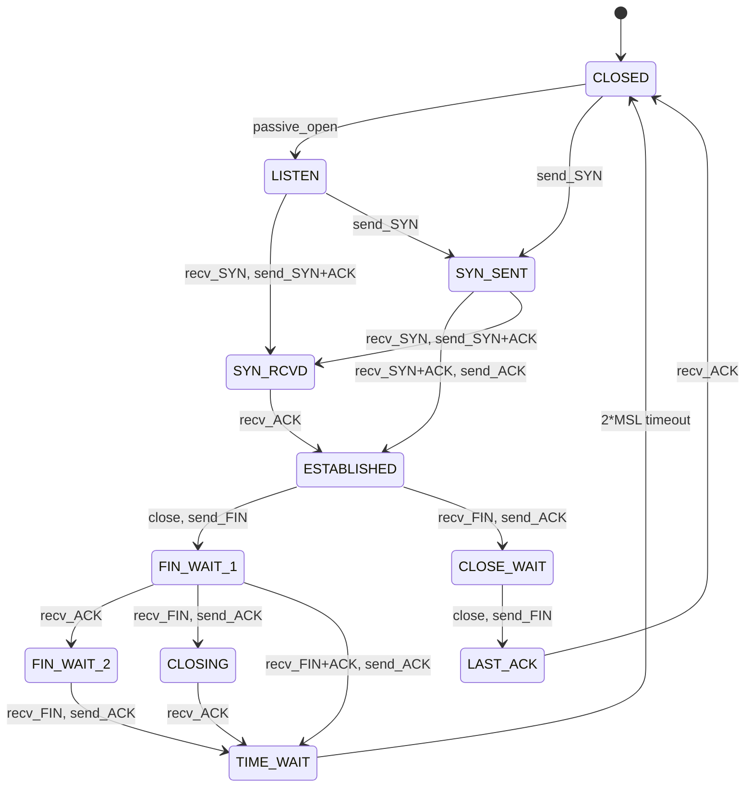

## Overview

The TCP connection state machine (defined in RFC 793, with updates in RFC 1122) is one of the most
precisely specified protocol behaviors in all of networking. Every TCP endpoint transitions through
defined states as connections are established, used, and torn down. Understanding these states is
essential for troubleshooting connection issues, writing robust network software, and operating
high-performance servers.

This document maps every state, every transition, every edge case (simultaneous open, simultaneous
close, half-open connections), and provides practical guidance for diagnosing TCP state problems in
production.

## The 11 TCP States

TCP defines 11 states. An endpoint is always in exactly one of these states:

| State       | Description                                          |
| ----------- | ---------------------------------------------------- |
| CLOSED      | No connection. Initial state.                        |
| LISTEN      | Waiting for connection requests.                     |
| SYN_SENT    | Sent SYN, waiting for response.                      |
| SYN_RCVD    | Received SYN, sent SYN+ACK, waiting for ACK.         |
| ESTABLISHED | Connection open. Data transfer in progress.          |
| FIN_WAIT_1  | Initiated close, sent FIN, waiting for ACK or FIN.   |
| FIN_WAIT_2  | Received ACK for our FIN, waiting for peer's FIN.    |
| CLOSE_WAIT  | Received peer's FIN, waiting for local close.        |
| LAST_ACK    | Sent our FIN after peer closed, waiting for ACK.     |
| TIME_WAIT   | Waited for peer's ACK after our close. 2\*MSL timer. |
| CLOSING     | Both sides sent FIN simultaneously, waiting for ACK. |

## State Diagram



## Normal Open: The Three-Way Handshake

The three-way handshake establishes both ends of the connection and synchronizes sequence numbers.
Both sides must agree on initial sequence numbers (ISNs) before any data can be exchanged.

### State Trace: Client Side

```
State: CLOSED
  |
  |--- SYN (seq=1000) ---------------->|
  State: SYN_SENT
  |
  |<-- SYN+ACK (seq=2000, ack=1001) ---|
  State: ESTABLISHED (after sending ACK)
  |
  |--- ACK (ack=2001) ---------------->|
  State: ESTABLISHED
```

### State Trace: Server Side

```
State: LISTEN
  |
  |<-- SYN (seq=1000) -----------------|
  State: SYN_RCVD
  |
  |--- SYN+ACK (seq=2000, ack=1001) -->|
  |
  |<-- ACK (ack=2001) -----------------|
  State: ESTABLISHED
```

### Why Three Messages, Not Two?

A two-way handshake would be vulnerable to stale duplicate SYNs from old connections. Consider:

1. Client sends SYN (seq=1000). Network delay causes it to arrive late.
2. Client times out, sends new SYN (seq=3000). Server responds, connection established.
3. Data exchanged, connection closed.
4. The stale SYN (seq=1000) finally arrives. Server creates a half-open connection.
5. Client receives SYN+ACK for a connection it never intended, sends RST.

The three-way handshake prevents this because the client must acknowledge the server's ISN. The
stale SYN would trigger a SYN+ACK from the server, but the client's ACK would not match, and the
client would send RST.

### ISN Generation

ISNs must be unpredictable to prevent TCP sequence prediction attacks (Blind Spoofing, RFC 6528).
Modern implementations use a cryptographically strong PRNG seeded with a combination of:

- Source and destination IP addresses and ports
- A secret key (per-boot random)
- A high-resolution timestamp

Linux uses a 64-bit counter that increments by 1 for each microsecond and by 64,000 for each new
connection, making ISN prediction computationally infeasible.

```bash
# View Linux ISN generation parameters
sysctl net.ipv4.tcp_timestamps
sysctl net.ipv4.tcp_syncookies
```

## Normal Close: The Four-Way Teardown

TCP uses a four-way (full-duplex) close because each direction of the connection must be closed
independently. This is called a "half-close" -- one side can stop sending while still receiving.

### State Trace: Active Closer (Initiator)

```
State: ESTABLISHED
  |
  |--- FIN (seq=5000) ---------------->|
  State: FIN_WAIT_1
  |
  |<-- ACK (ack=5001) -----------------|
  State: FIN_WAIT_2
  |  (waiting for peer to close its side)
  |
  |<-- FIN (seq=3000) -----------------|
  State: TIME_WAIT (after sending ACK)
  |
  |--- ACK (ack=3001) ---------------->|
  State: TIME_WAIT (wait 2*MSL)
```

### State Trace: Passive Closer

```
State: ESTABLISHED
  |
  |<-- FIN (seq=5000) -----------------|
  State: CLOSE_WAIT
  |  (application can still send data)
  |
  |--- ACK (ack=5001) ---------------->|
  State: CLOSE_WAIT (still, waiting for app to close)
  |
  |--- FIN (seq=3000) ---------------->|
  State: LAST_ACK
  |
  |<-- ACK (ack=3001) -----------------|
  State: CLOSED
```

### FIN_WAIT_2 and Application Hang

FIN_WAIT_2 is the state where the active closer has finished sending but is waiting for the peer to
finish. If the peer never sends FIN (application crash, bug, network partition), the endpoint stays
in FIN_WAIT_2 indefinitely.

Linux protects against this with `tcp_fin_timeout` (default 60 seconds). After this timeout, the
kernel forcibly closes the connection and frees the resources.

```bash
# View and adjust FIN_WAIT_2 timeout
sysctl net.ipv4.tcp_fin_timeout

# Count connections in FIN_WAIT_2 state
ss -tan state fin-wait-2 | wc -l
```

:::warning

If you see thousands of FIN_WAIT_2 connections on a server, the remote peers are not closing their
side of the connection. This is usually a client application bug (not calling `close()` or
`shutdown()`) or a firewall silently dropping the peer's FIN.

:::

## Simultaneous Open

Both sides can send SYN simultaneously. This is rare but valid. Both endpoints transition from
LISTEN or CLOSED to SYN_SENT, then to SYN_RCVD when they receive the other's SYN.

```
Client                          Server
  |                               |
  |--- SYN (seq=1000) ----------->|   Client: LISTEN -> SYN_SENT
  |<-- SYN (seq=2000) ------------|   Server: LISTEN -> SYN_SENT
  |                               |
  |--- SYN+ACK (seq=1001,ack=2001)|   Client: SYN_SENT -> SYN_RCVD
  |<-- SYN+ACK (seq=2001,ack=1001)|   Server: SYN_SENT -> SYN_RCVD
  |                               |
  |--- ACK (ack=2001) ----------->|   Client: SYN_RCVD -> ESTABLISHED
  |<-- ACK (ack=1001) ------------|   Server: SYN_RCVD -> ESTABLISHED
```

This results in a connection that is functionally identical to a normal three-way handshake. The key
difference is both sides independently chose their ISNs, and both sent SYN before seeing the
other's.

## Simultaneous Close

Both sides send FIN at approximately the same time. This puts both sides into CLOSING state, which
transitions to TIME_WAIT when the ACK arrives.

```
Client                          Server
  |                               |
  |--- FIN (seq=5000) ----------->|   Client: ESTABLISHED -> FIN_WAIT_1
  |<-- FIN (seq=3000) ------------|   Server: ESTABLISHED -> FIN_WAIT_1
  |                               |
  |--- ACK (ack=3001) ----------->|   Client: FIN_WAIT_1 -> CLOSING
  |<-- ACK (ack=5001) ------------|   Server: FIN_WAIT_1 -> CLOSING
  |                               |
  |                               |   Client: CLOSING -> TIME_WAIT (recv ACK)
  |                               |   Server: CLOSING -> TIME_WAIT (recv ACK)
```

Both sides end up in TIME_WAIT and must wait 2\*MSL before fully closing.

## TIME_WAIT

### Why 2\*MSL?

TIME_WAIT exists for two critical reasons (RFC 793 Section 3.5):

1. **To ensure the last ACK is received.** The active closer sends the final ACK and enters
   TIME_WAIT. If the passive closer never receives this ACK, it retransmits FIN. The TIME_WAIT
   endpoint must still be alive to re-ACK. Without TIME_WAIT, a new connection could receive the
   stale FIN and break.

2. **To allow stale segments to expire.** Any delayed or duplicated segments from the old connection
   must have time to arrive and be discarded before a new connection reuses the same 4-tuple (source
   IP, source port, destination IP, destination port). MSL (Maximum Segment Lifetime) is typically
   30-60 seconds, so 2\*MSL is 60-120 seconds.

### Problems at Scale

On high-traffic servers (load balancers, proxies, web servers), TIME_WAIT accumulates because the
server is usually the active closer. Each connection consumes kernel memory (struct `tcp_sock` is
approximately 1.8KB on Linux) and a file descriptor.

```bash
# Count TIME_WAIT connections
ss -tan state time-wait | wc -l

# View TIME_WAIT connections grouped by destination
ss -tan state time-wait | awk '{print $4}' | sort | uniq -c | sort -rn | head -20

# View total socket memory usage
cat /proc/net/sockstat
```

### Mitigations

**Option 1: Increase the ephemeral port range.**

```bash
# Default: 32768-60999
# Increase to: 1024-65535
sysctl -w net.ipv4.ip_local_port_range="1024 65535"
```

This gives you up to ~64K concurrent outgoing connections to each unique destination IP:port pair.

**Option 2: Enable TIME_WAIT reuse and recycling.**

```bash
# Allow new connections to reuse TIME_WAIT sockets
sysctl -w net.ipv4.tcp_tw_reuse=1

# Aggressively recycle TIME_WAIT sockets (use with caution)
sysctl -w net.ipv4.tcp_tw_recycle=1
```

:::warning

`tcp_tw_recycle=1` was removed in Linux 4.12 due to serious reliability problems. It caused packet
loss for clients behind NAT because it relied on timestamps to track per-host connection state, and
NAT multiplexed many clients onto the same source IP. Do NOT use it.

:::

**Option 3: Use SO_LINGER with timeout 0.**

Setting `SO_LINGER` with `l_onoff=1` and `l_linger=0` causes `close()` to send a RST instead of
going through the normal FIN handshake. The kernel discards the socket immediately. No TIME_WAIT.

```c
struct linger ling;
ling.l_onoff = 1;
ling.l_linger = 0;
setsockopt(fd, SOL_SOCKET, SO_LINGER, &ling, sizeof(ling));
```

:::warning

Sending RST instead of FIN means the peer never receives a graceful close indication. The peer sees
"Connection reset by peer" instead of a clean EOF. Use this only for connections where you are
certain the peer handles RST correctly, and never for connections where data integrity matters
(databases, file transfers).

:::

**Option 4: Connection pooling.**

Instead of opening and closing connections for every request, maintain a pool of persistent
connections. This is the standard approach for databases (PgBouncer, connection pools in application
frameworks), HTTP (keep-alive), and gRPC.

**Option 5: Have the client close.**

If the server never actively closes connections, the server never enters TIME_WAIT. Use
`Connection: close` on HTTP responses to signal the client to close, or set `SO_LINGER` on the
server with a short timeout.

### TIME_WAIT Sockets Per Connection

Each connection in TIME_WAIT consumes:

- Approximately 1.8KB of kernel memory (on 64-bit Linux)
- An entry in the TCP hash table (the `tcp_ehash` table)
- A reference in the per-namespace socket list

On a server handling 50,000 new connections per second with a 60-second TIME_WAIT, you accumulate 3
million TIME_WAIT sockets, consuming approximately 5.4GB of kernel memory. Plan accordingly.

## RST Handling

### Connection Reset

A RST (reset) immediately terminates a connection in any state except SYN_SENT. The recipient of
RST:

1. Discards any pending data in the receive buffer
2. Frees the socket resources
3. Returns `ECONNRESET` to the application on the next read or write

### RST on Close

When an application calls `close()` on a socket with data still in the send buffer, the kernel sends
RST instead of FIN. This happens when:

- `SO_LINGER` is set with `l_linger=0`
- The receive buffer contains unread data when close is called
- The socket is in a state where RST is appropriate (e.g., after receiving an unexpected segment)

### RST Attacks

RST injection attacks exploit the fact that TCP accepts RSTs with a valid sequence number (within
the current receive window). An attacker who can guess or observe the sequence number can send a
spoofed RST and kill the connection.

Mitigations:

- **Sequence number randomization** (RFC 6528) makes guessing ISNs infeasible
- **TCP MD5 signatures** (RFC 2385) authenticate segments between BGP peers
- **TCP-AO** (RFC 5925) provides a more modern authentication mechanism
- **Firewall filtering** that drops unexpected RSTs from outside the connection path

### RST in LISTEN State

RSTs received in LISTEN state are silently ignored. This prevents an attacker from knocking down a
listening socket by sending RSTs.

### RST in SYN_RCVD State

If a RST is received in SYN_RCVD state, the connection is aborted and the server returns to LISTEN
state. This is why SYN flood attacks (sending many SYNs and never completing the handshake) can
exhaust server resources.

## Half-Open Connections

A half-open connection occurs when one side believes the connection is established while the other
side does not. Common causes:

1. **Network partition.** One side sends data, the network goes down, the other side never receives
   it. When the network recovers, the sender still thinks the connection is alive.
2. **Application crash without close.** The crashed side's kernel does not send FIN. The other side
   has an open connection to nowhere.
3. **Firewall dropping FIN.** A stateful firewall drops the FIN packet, leaving one side in
   ESTABLISHED and the other in CLOSE_WAIT or LAST_ACK.

### Detecting Half-Open Connections

```bash
# Find connections with data in the send queue (possibly half-open)
ss -tan | awk '$3 > 0 {print}'

# Find connections that have been idle for a long time
ss -tan -o state established | awk '{print $6}' | sort | uniq -c | sort -rn | head

# TCP keepalive parameters
sysctl net.ipv4.tcp_keepalive_time     # 7200s (2 hours) - idle before first keepalive
sysctl net.ipv4.tcp_keepalive_intvl    # 75s - interval between keepalives
sysctl net.ipv4.tcp_keepalive_probes   # 9 - unanswered keepalives before dropping
```

## TCP Connection Troubleshooting

### Using ss

`ss` is the modern replacement for `netstat`. It reads directly from kernel memory via netlink,
making it much faster than `netstat` (which parses `/proc/net/tcp`).

```bash
# All TCP connections with timers
ss -tan

# Filter by state
ss -tan state established
ss -tan state time-wait
ss -tan state close-wait
ss -tan state fin-wait-1
ss -tan state fin-wait-2
ss -tan state syn-sent
ss -tan state syn-recv
ss -tan state closing
ss -tan state last-ack

# Connections to a specific port
ss -tan 'sport = :443'
ss -tan 'dport = :5432'

# Show process information (requires root)
ss -tanp

# Show memory usage per socket
ss -tanm

# Show TCP info (retransmits, RTT, congestion window)
ss -tani

# Show timer information (TIME_WAIT remaining, retransmit timers)
ss -tano

# Summary statistics
ss -s
```

### State-by-State Diagnostic Guide

| State       | Meaning                                     | Common Cause                                              |
| ----------- | ------------------------------------------- | --------------------------------------------------------- |
| ESTABLISHED | Normal data transfer                        | Healthy                                                   |
| TIME_WAIT   | Active close completed, waiting 2\*MSL      | Normal, but excessive = port exhaustion                   |
| CLOSE_WAIT  | Remote closed, local app has not closed     | Application bug -- not calling `close()` on the socket    |
| FIN_WAIT_1  | Local sent FIN, waiting for ACK or FIN      | Normal close sequence                                     |
| FIN_WAIT_2  | Local FIN ACKed, waiting for remote FIN     | Remote app not closing (crash, bug)                       |
| LAST_ACK    | Local sent FIN after remote close, wait ACK | Normal close sequence                                     |
| SYN_SENT    | Sent SYN, no response yet                   | Remote unreachable, firewall blocking, port not listening |
| SYN_RCVD    | Received SYN, waiting for ACK               | Normal handshake, or SYN flood                            |
| CLOSING     | Simultaneous close, waiting for ACK         | Rare, both sides closed at once                           |

### CLOSE_WAIT Accumulation

CLOSE_WAIT is the most dangerous state to accumulate because it indicates an application bug. The
remote side has closed the connection (sent FIN), but the local application has not called `close()`
on the socket. The kernel holds the socket open indefinitely.

```bash
# Find processes with CLOSE_WAIT sockets
ss -tanp state close-wait

# Count by process
ss -tanp state close-wait | awk '{print $6}' | sort | uniq -c | sort -rn
```

Common causes:

- Application catches an exception and forgets to close the socket in the `finally` block
- Connection pool leak -- borrowed connections never returned
- File descriptor leak -- socket created but reference lost
- Fork without exec -- child inherits parent's socket but never uses or closes it

## TCP Keepalive

### How It Works

TCP keepalive sends empty ACK probes to verify the peer is still alive. If the peer responds, the
connection is healthy. If it does not respond after `tcp_keepalive_probes` attempts at
`tcp_keepalive_intvl` intervals, the kernel closes the connection.

Default Linux parameters (conservative):

```
tcp_keepalive_time    = 7200 seconds (2 hours)
tcp_keepalive_intvl   = 75 seconds
tcp_keepalive_probes  = 9
```

Total time before detection: $7200 + 75 \times 9 = 7875$ seconds (~2.2 hours).

### Tuning for Server Environments

```bash
# Aggressive keepalive for load balancers (detect dead connections faster)
sysctl -w net.ipv4.tcp_keepalive_time=60
sysctl -w net.ipv4.tcp_keepalive_intvl=10
sysctl -w net.ipv4.tcp_keepalive_probes=6

# Detection time: 60 + 10*6 = 120 seconds
```

### Keepalive vs Application-Level Heartbeats

| Aspect          | TCP Keepalive                | Application Heartbeat     |
| --------------- | ---------------------------- | ------------------------- |
| Granularity     | Per-connection               | Per-session               |
| Detection time  | Minutes to hours (default)   | Seconds (tunable)         |
| NAT traversal   | Resets NAT timeout           | Same                      |
| Overhead        | Minimal (kernel-level)       | Application code          |
| Data path       | Does not pass to application | Application processes it  |
| Configurability | System-wide (sysctl)         | Per-connection (app code) |
| Failure signal  | `ECONNRESET` or `ETIMEDOUT`  | Application-defined       |

:::tip

Use TCP keepalive as a safety net and application-level heartbeats for timely detection. TCP
keepalone alone is too slow for most server applications. A 2-hour dead connection detection is
unacceptable for a database connection pool.

:::

## Connection Draining and Graceful Shutdown

### SO_LINGER

`SO_LINGER` controls what happens when `close()` is called on a socket with unsent data.

```c
struct linger ling;

// Option 1: Default (ling.l_onoff = 0)
// close() returns immediately. Kernel sends data in background.
// If data cannot be sent, kernel discards it after ~20 seconds (tcp_orphan_retries).

// Option 2: Linger with timeout
ling.l_onoff = 1;
ling.l_linger = 30;  // wait up to 30 seconds for data to be sent
setsockopt(fd, SOL_SOCKET, SO_LINGER, &ling, sizeof(ling));
// close() blocks until data is sent or 30 seconds elapse.
// If timeout expires, returns EWOULDBLOCK and kernel discards unsent data.

// Option 3: Hard abort
ling.l_onoff = 1;
ling.l_linger = 0;
setsockopt(fd, SOL_SOCKET, SO_LINGER, &ling, sizeof(ling));
// close() sends RST immediately. No TIME_WAIT. No graceful close.
```

### Graceful Shutdown Sequence

For a server handling persistent connections:

1. **Stop accepting new connections.** Close the listening socket.
2. **Notify existing clients.** Send a "server shutting down" message.
3. **Wait for in-flight requests to complete.** Set a timeout (e.g., 30 seconds).
4. **Close idle connections.** Connections with no pending data.
5. **Force-close remaining connections.** After the timeout, send RST for any stragglers.

```bash
# Gracefully drain connections on port 8080
# Step 1: Stop accepting new connections (nginx example)
nginx -s quit

# Step 2: Monitor remaining connections
watch -n 1 'ss -tan sport = :8080 | wc -l'
```

## TCP Options

### Window Scaling (RFC 7323)

Without window scaling, the TCP receive window is limited to 65,535 bytes (16-bit field). On
high-bandwidth, high-latency links, this severely limits throughput.

The bandwidth-delay product determines the optimal window size:

$\text{BDP} = \text{bandwidth} \times \text{RTT}$

For a 10 Gbps link with 100ms RTT:

$\text{BDP} = 10 \times 10^9 \times 0.1 = 10^9 \text{ bits} = 125,000,000 \text{ bytes}$

The default 65,535-byte window is 1907x too small. Window scaling (a shift count in the option
field, up to 14 bits, meaning the window can be scaled up to $2^{30}$ bytes) solves this.

```bash
# Check window scaling on a connection
ss -tani | grep -i wscale
```

### Timestamps (RFC 7323)

TCP timestamps serve two purposes:

1. **PAWS (Protection Against Wrapped Sequences).** At high speeds, the 32-bit sequence number wraps
   quickly. On a 10 Gbps link, the sequence space wraps in ~3.4 seconds. Timestamps allow the
   receiver to distinguish between old and new segments with the same sequence number.
2. **RTT measurement.** The sender includes a timestamp value (TSval), and the receiver echoes it
   (TSecr). This provides per-segment RTT measurement, which is critical for accurate RTT estimation
   used by congestion control.

```bash
# Check if timestamps are enabled
sysctl net.ipv4.tcp_timestamps
```

### SACK (Selective Acknowledgment, RFC 2018)

Without SACK, TCP can only acknowledge contiguous data. If segments 1, 2, 4, 5, 6 are received
(segment 3 lost), the receiver can only ACK up to segment 2. The sender retransmits segment 3, but
does not know that 4, 5, 6 were also received.

With SACK, the receiver can say "I have 1-2 and 4-6" in a SACK option. The sender knows to
retransmit only segment 3.

```bash
# Check SACK status
sysctl net.ipv4.tcp_sack
```

### MPTCP (Multipath TCP, RFC 8684)

MPTCP allows a single TCP connection to use multiple paths simultaneously. This is useful for mobile
devices that switch between WiFi and cellular, or servers with multiple network interfaces.

Key features:

- Multiple subflows over different interfaces
- Seamless handoff when one path fails
- Aggregated bandwidth from multiple paths
- Same API as regular TCP -- applications need not change

```bash
# Check MPTCP support
cat /proc/sys/net/mptcp/enabled
ip mptcp limits
```

### TCP Fast Open (RFC 7413)

TFO allows data to be sent in the SYN packet, saving one round trip for short-lived connections. The
client caches a cookie from a previous connection and includes it in the SYN. The server validates
the cookie and processes the data immediately.

```bash
# Enable TCP Fast Open (client + server)
sysctl -w net.ipv4.tcp_fastopen=3

# Test TFO with curl
curl --tcp-fastopen https://example.com
```

## Common Pitfalls

### 1. Not Handling Half-Close

If the remote side calls `shutdown(fd, SHUT_WR)` (sends FIN but keeps reading), the local side
receives EOF on read but can still send. Applications that treat EOF as "connection fully closed"
and stop sending may leave data unsent. Always distinguish between FIN (half-close) and RST (full
abort).

### 2. Ignoring CLOSE_WAIT

Accumulating CLOSE_WAIT connections is always an application bug. The kernel cannot close the
connection for you because it does not know whether the application has more data to send. Fix the
application code.

### 3. Setting tcp_tw_recycle

As noted above, `tcp_tw_recycle=1` was removed in Linux 4.12. It broke connectivity for clients
behind NAT. Never set this parameter.

### 4. TIME_WAIT on Load Balancers

Load balancers and reverse proxies are the active closer for most connections, so they accumulate
TIME_WAIT. Use connection pooling, increase the ephemeral port range, and enable `tcp_tw_reuse`
(which allows reuse of TIME_WAIT sockets for new connections to different destinations).

### 5. Not Tuning Keepalive

The default 2-hour keepalive interval means dead connections persist for hours. For any server
application, tune keepalive to detect dead connections within seconds or minutes, not hours.

### 6. Firewall State Table Overflow

Stateful firewalls track TCP connections. If they see a SYN without a matching SYN-ACK (or vice
versa), they may not create a state entry. TIME_WAIT accumulation on the server side can also fill
the firewall's state table. Monitor firewall state table utilization.

### 7. Misunderstanding SYN Cookies

SYN cookies (RFC 4987) are a defense against SYN floods. They encode state in the SYN-ACK's ISN, so
the server does not allocate resources until the ACK arrives. However, SYN cookies disable TCP
options (window scaling, SACK, timestamps) in the initial handshake, reducing performance. Enable
only when under attack, or use SYN proxy instead.

## TCP Timers Reference

### Retransmission Timeout (RTO)

The RTO is the timer that triggers retransmission of unacknowledged data. It is calculated from the
smoothed RTT (SRTT) and RTT variance (RTTVAR), as specified in RFC 6298:

```
RTTVAR = (1 - alpha) * RTTVAR + alpha * |SRTT - R|    (alpha = 1/8)
SRTT   = (1 - beta) * SRTT + beta * R                   (beta = 1/4)
RTO    = SRTT + max(G, 4 * RTTVAR)                      (G = clock granularity)
```

The initial RTO is 1 second. The minimum RTO is 200ms (RFC 6298). The maximum RTO is typically
60-120 seconds depending on the implementation.

```bash
# View TCP retransmission statistics
netstat -s --tcp | grep -i retrans
ss -ti dst 10.0.0.50    # view per-connection retransmissions
```

### Persist Timer

When the receive window is advertised as zero (receiver's buffer is full), the sender starts the
persist timer. It periodically sends zero-window probes (1-byte segments) to check if the window has
opened. This prevents a deadlock where both sides are waiting forever.

### Keepalive Timer

As covered earlier, TCP keepalive sends probes after `tcp_keepalive_time` seconds of inactivity.

### 2MSL Timer

The TIME_WAIT timer is set to 2 \* MSL (Maximum Segment Lifetime). MSL is typically 30 seconds
(Linux), so TIME_WAIT lasts 60 seconds.

## TCP Congestion Control and State Interactions

### Slow Start and Congestion Avoidance

While not a state machine transition per se, congestion control interacts with TCP state. When a
connection enters ESTABLISHED, it begins in slow start. If congestion is detected (loss via RTO or 3
duplicate ACKs), the congestion window is reduced and the connection may enter recovery state.

```bash
# View congestion control algorithm per connection
ss -ti dst 10.0.0.50 | grep -i cong

# View available congestion control algorithms
cat /proc/sys/net/ipv4/tcp_available_congestion_control

# Set default congestion control
sysctl -w net.ipv4.tcp_congestion_control=cubic
```

### Congestion Window After RTO

When an RTO fires, TCP enters slow start again (ssthresh is set to half the current congestion
window, cwnd is set to 1 MSS). This is called "RTO recovery" and is the most aggressive congestion
response.

### Fast Retransmit and Fast Recovery

When 3 duplicate ACKs are received, TCP assumes a single segment was lost (not congestion) and
retransmits the missing segment immediately without waiting for the RTO. This is "fast retransmit."
After fast retransmit, "fast recovery" is entered: cwnd is halved, ssthresh is set to the new cwnd,
and the sender continues sending new data (not entering slow start).

### BBR (Bottleneck Bandwidth and RTT)

BBR is a newer congestion control algorithm (Google, 2016) that models the bottleneck bandwidth and
RTT instead of using loss as a congestion signal. BBR achieves significantly higher throughput on
long-haul, high-BDP networks.

```bash
# Check if BBR is available
modprobe tcp_bbr
cat /proc/sys/net/ipv4/tcp_available_congestion_control

# Enable BBR
sysctl -w net.ipv4.tcp_congestion_control=bbr
sysctl -w net.core.default_qdisc=fq    # Fair Queuing recommended with BBR
```

:::tip

BBR v2 (2023) improves upon BBR v1 by being more fair to other flows sharing the same bottleneck. If
you are using BBR, consider BBR v2 if your kernel supports it. BBR v1 can be unfair to loss-based
congestion control algorithms (CUBIC) in shared environments.

:::
