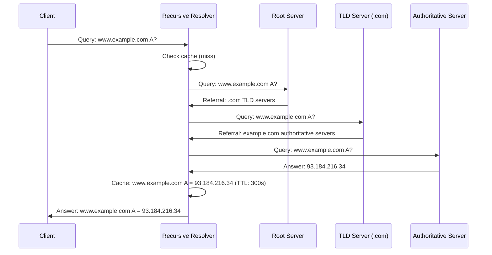

## Overview

The Domain Name System (DNS) is the Internet's hierarchical, distributed database that maps
human-readable names to IP addresses and other resource data. DNS is arguably the most critical
infrastructure service on the Internet -- virtually every application depends on name resolution to
function. When DNS fails, everything fails.

DNS was designed by Paul Mockapetris in 1983 (RFC 882 and RFC 883, now obsoleted by RFC 1034 and
RFC 1035) to replace the original HOSTS.TXT file, which was a flat file maintained centrally and
distributed manually.

## DNS Hierarchy

DNS is organized as a tree structure with the root at the top. Each node in the tree is called a
**domain** and can have zero or more **child domains**.

```mermaid
graph TD
    ROOT["." (root)"]
    ROOT --> COM[".com"]
    ROOT --> ORG[".org"]
    ROOT --> NET[".net"]
    ROOT --> UK[".uk"]
    ROOT --> ARPA[".arpa"]
    COM --> EXAMPLE["example.com"]
    COM --> GOOGLE["google.com"]
    ORG --> WIKI["wikipedia.org"]
    NET --> CLOUD["cloudflare.net"]
    UK --> CO[".co.uk"]
    CO --> BBC["bbc.co.uk"]
    ARPA --> INADDR["in-addr.arpa"]
    ARPA --> IP6["ip6.arpa"]

    style ROOT fill:#4a6fa5,color:#fff
    style COM fill:#6a8caf,color:#fff
    style ORG fill:#6a8caf,color:#fff
    style NET fill:#6a8caf,color:#fff
    style UK fill:#6a8caf,color:#fff
    style ARPA fill:#6a8caf,color:#fff
```

### Domain Levels

- **Root zone (`.`):** The top of the hierarchy. Managed by ICANN. Operated by 13 logical root
  server networks (A through M), implemented as anycast clusters with over 1,700 server instances
  worldwide.
- **Top-Level Domains (TLDs):** Directly below the root. Includes generic TLDs (`.com`, `.org`,
  `.net`, `.dev`) and country-code TLDs (`.uk`, `.de`, `.jp`, `.au`).
- **Second-Level Domains (SLDs):** Registered by organizations and individuals (e.g., `example.com`,
  `google.com`).
- **Subdomains:** Delegated by the SLD owner (e.g., `www.example.com`, `api.example.com`,
  `us-east-1.api.example.com`).

### FQDN (Fully Qualified Domain Name)

An FQDN specifies the exact location in the DNS tree, written with each label separated by a dot,
ending with the root (represented by a trailing dot, though usually omitted in practice):

```
www.example.com.    (trailing dot is the root, usually implicit)
```

Labels are limited to 63 characters. The total FQDN length is limited to 253 characters. Labels are
case-insensitive (`EXAMPLE.COM` = `example.com`).

## DNS Server Roles

### Root Name Servers

Operate the root zone, which contains delegations to all TLD name servers. There are 13 logical root
server networks (A-M), each identified by a letter and an IP address:

| Letter | Operator | IPv4          | IPv6                |
| ------ | -------- | ------------- | ------------------- |
| A      | Verisign | 198.41.0.4    | 2001:503:ba3e::2:30 |
| B      | USC/ISI  | 199.9.14.201  | 2001:478:65::53     |
| C      | Cogent   | 192.33.4.12   | 2001:500:2::c       |
| D      | Maryland | 199.7.91.13   | 2001:500:9d::d      |
| F      | IANA     | 192.5.6.30    | 2001:500:2f::f      |
| J      | Verisign | 192.58.128.30 | 2001:503:c27::2:30  |
| K      | RIPE NCC | 193.0.14.129  | 2001:7fd::1         |
| L      | ICANN    | 199.7.83.42   | 2001:500:9f::42     |
| M      | WIDE     | 202.12.27.33  | 2001:dc3::35        |

Each root server network operates anycast instances worldwide, so a query to "root server A" from
Tokyo likely reaches a different physical server than from New York.

### TLD Name Servers

Authoritative for their TLD. The `.com` TLD servers know which name servers are authoritative for
`example.com`, `google.com`, etc. They do not know the IP addresses -- they only know which servers
to ask next.

### Authoritative Name Servers

Hold the actual DNS records for a domain. When you register a domain, you configure its
authoritative name servers with your registrar. These are the servers that respond to DNS queries
for your domain with definitive answers.

Authoritative name servers are further divided:

- **Primary (master):** The authoritative source. Zone files are edited here.
- **Secondary (slave):** Pull zone data from the primary via zone transfers (AXFR/IXFR). Provide
  redundancy and load distribution.

### Recursive (Caching) Name Servers

Perform the full resolution process on behalf of a client. When your laptop resolves
`www.example.com`, it sends the query to a recursive resolver (configured via DHCP or manually). The
resolver walks the DNS hierarchy from the root down to the authoritative server, caching responses
along the way.

Common recursive resolvers:

- **Google Public DNS:** `8.8.8.8`, `8.8.4.4`
- **Cloudflare DNS:** `1.1.1.1`, `1.0.0.1`
- **Quad9:** `9.9.9.9`
- **ISP resolvers:** Provided by your ISP, typically via DHCP

## DNS Record Types

DNS records (resource records, RRs) map domain names to data. Each record has a type, class (almost
always IN for Internet), TTL, and data.

### Core Record Types

**A (Address, RFC 1035):** Maps a name to an IPv4 address.

```
example.com.    300    IN    A    93.184.216.34
```

**AAAA (IPv6 Address, RFC 3596):** Maps a name to an IPv6 address.

```
example.com.    300    IN    AAAA    2606:2800:220:1:248:1893:25c8:1946
```

**CNAME (Canonical Name, RFC 1035):** Alias of one name to another. DNS resolution continues at the
target name. A CNAME cannot coexist with any other record type on the same name.

```
www.example.com.    300    IN    CNAME    example.com.
cdn.example.com.    300    IN    CNAME    cdn.cloudflare.com.
```

:::warning

The CNAME restriction means you cannot have a CNAME at the zone apex (e.g., `example.com` CNAME to
`www.example.com`) because the apex also needs SOA and NS records. DNS providers solve this with
ALIAS or ANAME records (proprietary), or by using CNAME Flattening (Cloudflare).

:::

**MX (Mail Exchange, RFC 1035):** Identifies mail servers for the domain. The priority value
determines the order -- lower priority is preferred. If two servers have the same priority, the
client should try both.

```
example.com.    300    IN    MX    10    mail1.example.com.
example.com.    300    IN    MX    20    mail2.example.com.
```

**NS (Name Server, RFC 1035):** Delegates a DNS zone to an authoritative name server.

```
example.com.    86400    IN    NS    ns1.dnsprovider.net.
example.com.    86400    IN    NS    ns2.dnsprovider.net.
```

**TXT (Text, RFC 1035):** Arbitrary text data. Used for SPF, DKIM, DMARC, domain verification, and
other purposes.

```
example.com.    3600    IN    TXT    "v=spf1 include:_spf.example.com ~all"
example.com.    3600    IN    TXT    "google-site-verification=abc123"
_dmarc.example.com. 3600 IN TXT   "v=DMARC1; p=reject; rua=mailto:dmarc@example.com"
```

### Additional Record Types

**SRV (Service, RFC 2782):** Identifies the host and port for a specific service. Used extensively
in SIP, XMPP, LDAP, and Active Directory.

```
_sip._tcp.example.com.    3600    IN    SRV    10    60    5060    sip.example.com.
```

Format: `priority weight port target`

- **Priority:** Lower is preferred (like MX)
- **Weight:** Used for load balancing among servers with the same priority
- **Port:** The port on which the service runs
- **Target:** The hostname of the server

**PTR (Pointer, RFC 1035):** Maps an IP address to a name (reverse DNS). Used for anti-spam
verification and logging.

```
34.216.184.93.in-addr.arpa.    300    IN    PTR    example.com.
```

Note the reversed octets -- IPv4 reverse DNS uses the `in-addr.arpa` domain with octets in reverse
order because DNS reads labels left-to-right but IP addresses are written
most-significant-octet-first.

**CAA (Certification Authority Authorization, RFC 6844):** Specifies which certificate authorities
are allowed to issue certificates for the domain.

```
example.com.    3600    IN    CAA    0    issue    "letsencrypt.org"
example.com.    3600    IN    CAA    0    issuewild    ";"
```

**SOA (Start of Authority, RFC 1035):** Defines the primary name server, contact email, and timing
parameters for zone transfers. Every zone must have exactly one SOA record at the apex.

```
example.com.    3600    IN    SOA    ns1.example.com. hostmaster.example.com. (
                    2024010101  ; Serial (YYYYMMDDNN format)
                    3600        ; Refresh (secondary checks primary every 1 hour)
                    900         ; Retry (on failure, retry every 15 minutes)
                    604800      ; Expire (secondary data expires after 1 week)
                    86400       ; Minimum TTL (negative caching)
                    )
```

**NSAP, DNAME, LOC, NAPTR, SSHFP, TLSA:** Additional record types for specific purposes. SSHFP
publishes SSH key fingerprints. TLSA publishes TLS certificate hashes (DANE). LOC publishes
geographic coordinates.

## DNS Resolution Process

When an application needs to resolve `www.example.com`, the recursive resolver performs the
following steps:



### Recursive vs Iterative Queries

- **Recursive query:** The client asks the resolver to get the final answer. The resolver does all
  the work. This is what your laptop sends to its configured DNS server.
- **Iterative query:** The server returns the best answer it has, which may be a referral to another
  server. Recursive resolvers use iterative queries when talking to root, TLD, and authoritative
  servers.

### CNAME Chasing

When a query returns a CNAME, the resolver follows the chain. For `www.example.com` CNAME to
`example.com`, the resolver queries `example.com` A. If `example.com` is also a CNAME (to
`lb.example.cloudprovider.com`), the resolver follows that too. Most resolvers limit CNAME chain
depth to prevent infinite loops.

## DNS Caching

Caching is critical to DNS performance. Without it, every DNS query would traverse the full
hierarchy from root to authoritative server. Caching happens at three levels:

1. **Browser cache:** Chrome, Firefox, and Safari cache DNS responses. Chrome typically caches for
   60 seconds regardless of TTL.
2. **Operating system cache:** The OS resolver (`systemd-resolved`, `nscd`, `mDNSResponder`) caches
   responses for the TTL specified in the DNS response.
3. **Recursive resolver cache:** The recursive resolver (8.8.8.8, your ISP's resolver) caches
   responses for the TTL specified in the DNS response.

### TTL (Time to Live)

Every DNS record has a TTL value (in seconds) that specifies how long the response may be cached:

```
example.com.    300    IN    A    93.184.216.34
```

The TTL of 300 means resolvers may cache this answer for up to 300 seconds (5 minutes) before
querying the authoritative server again.

**TTL trade-offs:**

- **Short TTLs (60-300 seconds):** Changes propagate quickly. Higher query volume to authoritative
  servers. Good for records that change frequently (e.g., failover IPs, API endpoints).
- **Long TTLs (3600-86400 seconds):** Lower query volume. Better cache hit rates. Slower propagation
  of changes. Good for stable records (e.g., MX, NS).
- **SOA Minimum TTL:** Defines the negative caching TTL (how long to cache "name does not exist"
  responses).

### Negative Caching (RFC 2308)

When a query returns `NXDOMAIN` (name does not exist) or `NODATA` (name exists but no records of the
requested type), the response is cached for the SOA minimum TTL. This prevents repeated queries for
non-existent names from hammering authoritative servers.

:::warning

Negative caching with long SOA minimum TTLs can cause problems during DNS migrations. If you set the
SOA minimum to 86400 (1 day) and delete a subdomain, resolvers will cache the `NXDOMAIN` for up to 1
day. Reduce the SOA minimum TTL before making changes, then increase it after propagation.

:::

## DNS over HTTPS (DoH) and DNS over TLS (DoT)

Traditional DNS queries are sent in plaintext over UDP port 53, making them visible to any network
observer. DoH and DoT encrypt DNS queries to protect privacy.

### DNS over HTTPS (DoH, RFC 8484)

DNS queries are sent as HTTPS requests (typically to port 443). The DNS message is encoded in the
HTTPS request body (using the `application/dns-message` content type).

```
POST https://dns.google/dns-query
Content-Type: application/dns-message
Accept: application/dns-message

<binary DNS message>
```

DoH uses TCP port 443, making it indistinguishable from normal HTTPS traffic. This makes it
difficult for network operators to block or filter DNS queries, which is both a privacy feature and
a circumvention concern for corporate networks.

**Providers:** Google (`dns.google`), Cloudflare (`cloudflare-dns.com`), Quad9 (`dns.quad9.net`)

### DNS over TLS (DoT, RFC 7858)

DNS queries are sent over a TLS-encrypted TCP connection on port 853.

```
dig @dns.google +tls example.com
```

DoT uses a dedicated port (853), making it easy for network operators to identify and manage DNS
traffic separately from HTTPS.

### DoH vs DoT

| Criterion           | DoH                            | DoT                          |
| ------------------- | ------------------------------ | ---------------------------- |
| Port                | 443                            | 853                          |
| Protocol            | HTTPS (HTTP/2)                 | TLS over TCP                 |
| Identifiability     | Blends with HTTPS traffic      | Dedicated port, identifiable |
| Privacy             | High (blends with web traffic) | High (encrypted)             |
| Corporate filtering | Harder to filter               | Easier to filter             |
| Implementation      | Browser-native                 | OS-native                    |
| Adoption            | Chrome, Firefox, Edge          | Android, iOS 14+             |

## DNSSEC (DNS Security Extensions)

DNSSEC adds cryptographic signatures to DNS records, allowing resolvers to verify that the response
has not been tampered with. DNSSEC does **not** encrypt DNS queries -- it provides integrity, not
confidentiality. Use DoH/DoT for confidentiality.

### How DNSSEC Works

1. **Zone signing:** The zone owner generates a key pair (KSK and ZSK) and signs all records in the
   zone using digital signatures (RRSIG records).
2. **Chain of trust:** Each zone's public key is signed by its parent zone. The root zone's key is
   the trust anchor, distributed out-of-band (published in root zone files and configured in
   resolvers).
3. **Validation:** The resolver verifies the signature chain from the root down to the record being
   queried.

### Key Types

- **KSK (Key Signing Key):** A longer key (RSA-2048 or larger) that only signs the ZSK. Used
  infrequently, easier to rotate.
- **ZSK (Zone Signing Key):** A shorter key that signs all records in the zone. Used frequently,
  rotated more often.

### DNSSEC Record Types

- **DNSKEY:** Contains the public key for the zone.
- **RRSIG:** Contains the digital signature for a record set.
- **DS:** Contains a hash of a child zone's KSK, published in the parent zone. This creates the
  chain of trust.
- **NSEC / NSEC3:** Proves that a name does not exist (authenticated denial of existence). NSEC3
  uses hashed names to prevent zone enumeration.

### DNSSEC Deployment Considerations

DNSSEC increases DNS response sizes significantly. A signed zone can be 5-10x larger than an
unsigned zone. EDNS0 (Extension Mechanisms for DNS, RFC 6891) is required to support the larger
response sizes (up to 4096 bytes). If DNSSEC responses exceed the path MTU and ICMP Fragmentation
Needed messages are blocked, resolution fails.

```bash
# Validate DNSSEC for a domain
dig example.com DNSKEY +dnssec
dig example.com +dnssec +cd  # check mode (disable validation)
delv example.com              # DNSSEC validation tool (BIND 9.12+)
```

## Zone Transfers

Zone transfers copy DNS zone data from a primary server to a secondary server.

### AXFR (Full Zone Transfer, RFC 5936)

Transfers the entire zone database. Used for initial synchronization.

```bash
dig axfr example.com @ns1.example.com
```

### IXFR (Incremental Zone Transfer, RFC 1995)

Transfers only the changes since the last transfer. More efficient for large zones that change
frequently. The secondary sends its current SOA serial number, and the primary responds with only
the records that have changed.

## Reverse DNS

Reverse DNS maps IP addresses to domain names using PTR records in the `in-addr.arpa` (IPv4) or
`ip6.arpa` (IPv6) domains.

```bash
# Query reverse DNS
dig -x 93.184.216.34

# Query reverse DNS for IPv6
dig -x 2606:2800:220:1:248:1893:25c8:1946
```

**IPv4 reverse format:** Reverse the octets and append `.in-addr.arpa`:

```
93.184.216.34 -> 34.216.184.93.in-addr.arpa
```

**IPv6 reverse format:** Reverse the nibbles (hex digits) and append `.ip6.arpa`:

```
2606:2800:220:1:248:1893:25c8:1946
-> 6.4.9.1.8.c.5.2.3.9.8.1.8.4.2.1.0.0.0.0.2.2.0.0.8.2.6.0.2.ip6.arpa
```

Reverse DNS is important for:

- **Email deliverability:** Many mail servers reject email from IPs without matching reverse DNS
  (PTR = forward hostname).
- **Logging and forensics:** Logs showing IP addresses are more useful with reverse DNS to identify
  the source.
- **Trust verification:** SSH, TLS, and some authentication systems use reverse DNS verification.

## DNS Servers

### BIND (Berkeley Internet Name Domain)

The reference DNS implementation. Powerful but complex configuration. Most widely used DNS server on
the Internet.

```bash
# Install
apt install bind9 bind9utils

# Check configuration
named-checkconf /etc/bind/named.conf
named-checkzone example.com /var/lib/bind/example.com.zone

# Query using dig (part of bind9utils)
dig example.com A +short
```

### Unbound

A validating, recursive, caching DNS resolver developed by NLnet Labs. Does not serve authoritative
zones (pair with NSD for authoritative). Lightweight, secure, and fast.

```bash
# Install
apt install unbound

# Configuration
# /etc/unbound/unbound.conf
server:
    interface: 0.0.0.0@53
    access-control: 0.0.0.0/0 allow
    forward-zone:
        name: "."
        forward-addr: 1.1.1.1
        forward-addr: 8.8.8.8
```

### systemd-resolved

The default DNS resolver on modern Linux distributions (Ubuntu 20.04+, Fedora, Arch). Provides a
local DNS stub resolver that applications query via D-Bus or the local socket at
`/run/systemd/resolve/resolv.conf`.

```bash
# Check status
systemctl status systemd-resolved

# View DNS configuration
resolvectl status
resolvectl query example.com
```

:::warning

`systemd-resolved` modifies `/etc/resolv.conf` to point to its local stub resolver (127.0.0.53). If
you configure DNS manually in `/etc/resolv.conf`, your changes may be overwritten. To use custom DNS
servers, configure them via `systemd-resolved` or NetworkManager.

:::

## Common Pitfalls

1. **DNS propagation is not a thing.** DNS changes propagate based on TTL. A record with a
   300-second TTL takes at most 300 seconds to propagate to all resolvers. There is no magical
   "propagation delay." The perceived delay is caused by caches that have not expired. If you need
   fast changes, lower the TTL before making the change, then raise it after.

2. **CNAME at the zone apex.** You cannot have a CNAME at the root of a zone (e.g., `example.com`
   CNAME to `www.example.com`) because the apex requires SOA and NS records. Use ALIAS/ANAME records
   (DNS provider-specific) or CNAME flattening (Cloudflare) instead.

3. **DNS and load balancing.** Round-robin DNS (multiple A records for the same name) is the
   simplest form of load balancing but provides no health checking, session persistence, or weighted
   distribution. DNS-based global load balancing (GSLB/Anycast) is more sophisticated but still has
   limitations -- resolvers cache results, so traffic distribution depends on resolver behavior, not
   client behavior.

4. **Ignoring negative caching.** If you delete a record but the SOA minimum TTL is high (e.g.,
   86400), resolvers cache the NXDOMAIN response for 24 hours. Always reduce the SOA minimum TTL
   before removing records.

5. **UDP truncation and TCP fallback.** DNS responses over UDP are limited to 512 bytes (without
   EDNS0). If a response exceeds this size, the server sets the TC (truncation) flag, and the client
   retries over TCP. Many firewalls block TCP port 53, which causes resolution failures for
   responses that require TCP. This is especially common with DNSSEC responses, which are larger due
   to signatures.

6. **EDNS0 and DNSSEC response size.** EDNS0 advertises a larger UDP buffer size (typically 4096
   bytes). If a middlebox (firewall, NAT) drops UDP packets larger than 512 bytes, DNSSEC validation
   fails silently. Test with `dig +dnssec example.com` and verify the response size.

7. **Split-horizon DNS complexity.** Split-horizon (split-view) DNS returns different answers
   depending on the client's source IP. This is common in enterprise environments (internal vs
   external IPs). The complexity increases with every additional view and can lead to subtle
   misconfigurations where internal clients get external IPs or vice versa.

## DNS Internals

### DNS Message Format

Every DNS message (query or response) follows a fixed format defined in RFC 1035:

```
+---------------------+
|        Header       |
+---------------------+
|      Question       |  (the query)
+---------------------+
|       Answer        |  (resource records answering the query)
+---------------------+
|     Authority       |  (resource records pointing to authoritative servers)
+---------------------+
|     Additional      |  (resource records that may be helpful)
+---------------------+
```

**Header fields (12 bytes):**

| Field   | Size    | Purpose                                                               |
| ------- | ------- | --------------------------------------------------------------------- |
| ID      | 16 bits | Query identifier (matches response to request)                        |
| QR      | 1 bit   | 0 = query, 1 = response                                               |
| OPCODE  | 4 bits  | Query type (0 = standard query, 1 = inverse query, 2 = server status) |
| AA      | 1 bit   | Authoritative Answer (response only)                                  |
| TC      | 1 bit   | Truncation (response was truncated, retry over TCP)                   |
| RD      | 1 bit   | Recursion Desired (client wants recursive resolution)                 |
| RA      | 1 bit   | Recursion Available (server supports recursion)                       |
| Z       | 3 bits  | Reserved (must be zero)                                               |
| RCODE   | 4 bits  | Response code (0 = no error, 3 = NXDOMAIN, 5 = refused)               |
| QDCOUNT | 16 bits | Number of questions                                                   |
| ANCOUNT | 16 bits | Number of answer RRs                                                  |
| NSCOUNT | 16 bits | Number of authority RRs                                               |
| ARCOUNT | 16 bits | Number of additional RRs                                              |

### DNS Wire Format for Resource Records

Each resource record in the Answer, Authority, or Additional section has this format:

```
+---------------------+
|        NAME         |  (domain name, possibly compressed)
+---------------------+
|        TYPE         |  16 bits (A=1, AAAA=28, CNAME=5, MX=15, etc.)
+---------------------+
|       CLASS         |  16 bits (IN=1 for Internet)
+---------------------+
|        TTL          |  32 bits (time to live in seconds)
+---------------------+
|       RDLENGTH      |  16 bits (length of RDATA)
+---------------------+
|       RDATA         |  (variable, depends on TYPE)
+---------------------+
```

### DNS Name Compression

DNS names in the wire format use a compression scheme to reduce message size. Instead of repeating
the full domain name, a pointer (2 bytes, starting with 0b11) references a previous occurrence of
the name in the message. For example, if the question asks for `www.example.com` and the answer is a
CNAME pointing to `example.com`, the CNAME target can reference the suffix from the question.

This compression is why DNS responses are typically much smaller than they would be without it. It
is also why parsing DNS messages requires following pointer references, which adds complexity to DNS
client implementations.

## DNS and Load Balancing

### Round-Robin DNS

The simplest form of load balancing: multiple A records for the same name, with the server rotating
the order of records in each response.

```
example.com.    300    IN    A    93.184.216.34
example.com.    300    IN    A    93.184.216.35
example.com.    300    IN    A    93.184.216.36
```

Limitations:

- **No health checking.** If one server is down, clients still receive its IP address and will fail.
- **No session persistence.** Clients may be directed to different servers on each resolution,
  breaking stateful sessions.
- **No weighted distribution.** All servers receive equal traffic (unless you use multiple records
  with different weights, which is non-standard).
- **Cache amplification.** Resolvers cache the entire set, so traffic distribution depends on
  resolver behavior, not client behavior. A large ISP resolver may direct all its clients to the
  first IP in the cached set.

### DNS-Based Global Load Balancing (GSLB)

GSLB uses DNS to direct users to the nearest or best-performing server. The DNS server returns
different IP addresses based on the client's source IP (geolocation), server health, and network
conditions.

```
Client from Asia:    example.com -> 103.0.0.1 (Asia datacenter)
Client from Europe:  example.com -> 185.0.0.1 (Europe datacenter)
Client from US:      example.com -> 93.184.216.34 (US datacenter)
```

Providers include AWS Route 53, Cloudflare, Google Cloud DNS, and Akamai.

Limitations:

- **Resolver location != client location.** The DNS query comes from the recursive resolver, not the
  client. If a client in Tokyo uses Google DNS (8.8.8.8, located in various places), the geolocation
  may be wrong.
- **Caching.** Once a resolver caches the answer, it will not re-query until the TTL expires.
  Failover cannot be faster than the TTL.
- **Limited granularity.** DNS returns an IP address, not a URL. If a service runs on multiple ports
  or protocols, DNS cannot differentiate.

### Health Checking with DNS

Some DNS providers (Route 53, Cloudflare) automatically remove unhealthy servers from DNS responses.
The provider monitors server health (HTTP checks, TCP checks) and only includes healthy servers in
DNS responses.

This mitigates the main limitation of round-robin DNS, but health check failures still take effect
only after the TTL expires in all resolvers.

## DNS Debugging Techniques

### Querying Specific Servers

```bash
# Query a specific authoritative server directly
dig @ns1.example.com example.com A

# Query with DNSSEC validation enabled
dig @8.8.8.8 example.com A +dnssec

# Query without DNSSEC (check mode)
dig @8.8.8.8 example.com A +cd

# Query with specific EDNS buffer size
dig @8.8.8.8 example.com A +bufsize=4096

# Query with DO (DNSSEC OK) flag
dig @8.8.8.8 example.com DNSKEY +dnssec
```

### Checking DNS Propagation

```bash
# Query multiple resolvers to check if a change has propagated
dig @8.8.8.8 example.com A +short
dig @1.1.1.1 example.com A +short
dig @9.9.9.9 example.com A +short

# Check authoritative servers directly
dig ns example.com +short
dig @ns1.example.com example.com A +short
```

### Testing DNS over HTTPS

```bash
# Using curl
curl -H "Accept: application/dns-message" \
  "https://dns.google/dns-query?dns=AAABAAABAAAAAAAAB2V4YW1wbGUDY29tAAABAAE" \
  --output - --silent | base64 -d | xxd

# Using kdig (Knot DNS)
kdig @https://dns.google example.com

# Using doh-client
doh-client --query example.com --dns-server https://dns.google/dns-query
```

### Testing DNS over TLS

```bash
# Using kdig
kdig @tls://dns.google example.com

# Using openssl + dig (manual)
openssl s_client -connect dns.google:853 -quiet | \
  dig +tcp +short @127.0.0.1 -p 5353 example.com A
```

### Monitoring DNS Resolution Time

```bash
# Measure DNS resolution time with dig
dig example.com | grep "Query time"

# Measure with curl
curl -w "DNS: %{time_namelookup}s\n" -o /dev/null -s https://example.com

# Measure with Python
python3 -c "import time; t=time.time(); __import__('socket').gethostbyname('example.com'); print(f'{time.time()-t:.3f}s')"
```

## DNS in Container and Kubernetes Environments

### Container DNS

Containers in Docker and Kubernetes rely heavily on DNS for service discovery. Each container has a
local DNS resolver that forwards queries to the cluster's DNS service.

**Docker:** Docker embeds a DNS resolver (127.0.0.11) in each container. It resolves:

- Container names within the same network
- Service names in Docker Swarm
- External names via configured upstream DNS servers

**Kubernetes:** Each pod has a DNS resolver (usually at the IP of the kube-dns or CoreDNS service).
It resolves:

- Services: `my-service.my-namespace.svc.cluster.local`
- Pods: `pod-ip-default.my-namespace.pod.cluster.local`
- External names via configured upstream servers

### CoreDNS

CoreDNS is the default DNS server in Kubernetes (since v1.11). It is configured through a Corefile
(similar to Caddyfile) and supports plugins for various DNS features:

```
.:53 {
    errors
    health
    ready
    kubernetes cluster.local in-addr.arpa ip6.arpa {
        pods insecure
        fallthrough in-addr.arpa ip6.arpa
    }
    prometheus :9153
    forward . /etc/resolv.conf
    cache 30
    reload
    loadbalance
}
```

Common CoreDNS issues:

- **DNS resolution delays (5 seconds).** This is caused by the fallback DNS search path. When a pod
  looks up `my-service`, CoreDNS first tries `my-service.default.svc.cluster.local`, then
  `my-service.svc.cluster.local`, then `my-service.cluster.local`, then `my-service`. If none exist,
  the 5-second delay is the timeout for the last search domain. Fix by using FQDNs or reducing
  `ndots` in the resolv.conf.
- **CoreDNS CPU/memory exhaustion.** In large clusters with many DNS queries, CoreDNS can become a
  bottleneck. Scale CoreDNS replicas or enable NodeLocal DNSCache to reduce external DNS queries.
- **DNS caching.** CoreDNS caches responses for the TTL. The default minimum cache TTL is 5 seconds.
  Adjust with the `cache` plugin.
