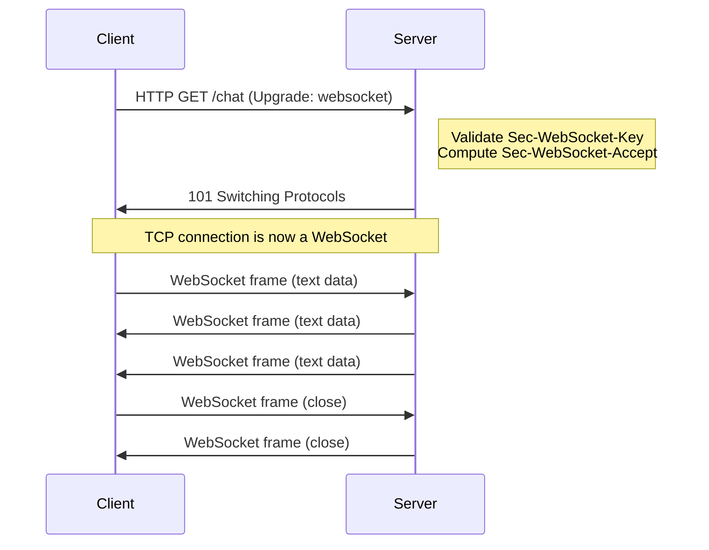

## Overview

WebSockets (RFC 6455) provide full-duplex, bidirectional communication over a single TCP connection.
Unlike HTTP, which follows a request-response model, WebSocket allows either side to send data at
any time after the connection is established. This makes WebSockets the protocol of choice for
real-time applications: chat, collaboration, financial tickers, live dashboards, gaming, and IoT
device control.

WebSockets start as an HTTP upgrade. The client sends a regular HTTP request with an
`Upgrade: websocket` header. If the server agrees, it responds with `101 Switching Protocols`, and
the connection becomes a WebSocket from that point forward.

## HTTP Upgrade Handshake

### Client Request

```text
GET /chat HTTP/1.1
Host: example.com:8080
Upgrade: websocket
Connection: Upgrade
Sec-WebSocket-Key: dGhlIHNhbXBsZSBub25jZQ==
Sec-WebSocket-Version: 13
Sec-WebSocket-Protocol: chat, superchat
Sec-WebSocket-Extensions: permessage-deflate; client_max_window_bits
Origin: https://example.com
```

Key headers:

- **Upgrade: websocket** -- signals the protocol upgrade request
- **Connection: Upgrade** -- required by HTTP/1.1 to indicate a connection-level upgrade
- **Sec-WebSocket-Key** -- base64-encoded 16-byte random value (used in the handshake validation)
- **Sec-WebSocket-Version** -- must be `13` (the current WebSocket protocol version)
- **Sec-WebSocket-Protocol** -- optional; lists application-level subprotocols the client supports
- **Sec-WebSocket-Extensions** -- optional; lists protocol-level extensions the client supports

### Server Response

```text
HTTP/1.1 101 Switching Protocols
Upgrade: websocket
Connection: Upgrade
Sec-WebSocket-Accept: s3pPLMBiTxaQ9kYGzzhZRbK+xOo=
Sec-WebSocket-Protocol: chat
Sec-WebSocket-Extensions: permessage-deflate; client_max_window_bits
```

### Handshake Validation

The `Sec-WebSocket-Accept` value is computed as follows:

1. Take the value of `Sec-WebSocket-Key` from the client request: `dGhlIHNhbXBsZSBub25jZQ==`
2. Concatenate the globally unique UUID `258EAFA5-E914-47DA-95CA-C5AB0DC85B11`
3. Compute SHA-1 hash of the concatenated string
4. Base64-encode the hash

```bash
# Verify the handshake computation
KEY="dGhlIHNhbXBsZSBub25jZQ=="
GUID="258EAFA5-E914-47DA-95CA-C5AB0DC85B11"
ACCEPT=$(printf "%s%s" "$KEY" "$GUID" | openssl dgst -sha1 -binary | base64)
echo "$ACCEPT"
# Output: s3pPLMBiTxaQ9kYGzzhZRbK+xOo=
```

This mechanism prevents a regular HTTP client from accidentally establishing a WebSocket connection,
and prevents a WebSocket client from accidentally connecting to a non-WebSocket server.



## WebSocket Framing

After the handshake, communication uses a binary frame format:

```
 0                   1                   2                   3
 0 1 2 3 4 5 6 7 8 9 0 1 2 3 4 5 6 7 8 9 0 1 2 3 4 5 6 7 8 9 0 1
+-+-+-+-+-------+-+-------------+-------------------------------+
|F|R|R|R| opcode|M| Payload len |    Extended payload length    |
|I|S|S|S|  (4)  |A|     (7)     |             (16/64)           |
|N|V|V|V|       |S|             |   (if payload len==126/127)   |
| |1|2|3|       |K|             |                               |
+-+-+-+-+-------+-+-------------+ - - - - - - - - - - - - - - - +
|     Extended payload length continued, if payload len == 127  |
+ - - - - - - - - - - - - - - - +-------------------------------+
|                               |Masking-key, if MASK set to 1  |
+-------------------------------+-------------------------------+
| Masking-key (continued)       |          Payload Data         |
+-------------------------------- - - - - - - - - - - - - - - - +
:                     Payload Data continued ...                :
+ - - - - - - - - - - - - - - - - - - - - - - - - - - - - - - - +
|                     Payload Data (continued)                  |
+---------------------------------------------------------------+
```

### Frame Fields

| Field                   | Bits  | Description                                                                      |
| ----------------------- | ----- | -------------------------------------------------------------------------------- |
| FIN                     | 1     | 1 = final frame of message, 0 = more frames follow                               |
| RSV1, RSV2, RSV3        | 3     | Reserved for extensions. Must be 0 unless an extension is negotiated.            |
| Opcode                  | 4     | Frame type (see opcodes table)                                                   |
| MASK                    | 1     | 1 = payload is masked (must be 1 for client-to-server frames)                    |
| Payload length          | 7     | Length of payload: 0-125 = actual length, 126 = next 2 bytes, 127 = next 8 bytes |
| Extended payload length | 16/64 | Actual payload length when payload length is 126 or 127                          |
| Masking key             | 32    | 4-byte key used to unmask the payload (if MASK=1)                                |
| Payload data            | var   | The actual data                                                                  |

### Fragmentation

A single WebSocket message can be split across multiple frames. The first frame has FIN=0 and the
opcode indicates the message type. Subsequent frames have FIN=0 and opcode=0x0 (continuation). The
final frame has FIN=1 and opcode=0x0.

```
Frame 1: FIN=0, opcode=0x1 (text), payload="Hello "
Frame 2: FIN=0, opcode=0x0 (continuation), payload="World"
Frame 3: FIN=1, opcode=0x0 (continuation), payload="!"
```

Control frames (ping, pong, close) MUST NOT be fragmented. They must fit in a single frame with
FIN=1.

## Masking

### Why Client-to-Server Frames Are Masked

Masking prevents cache poisoning attacks. A malicious client could craft a WebSocket frame that
looks like an HTTP request or response and inject it into a shared cache (e.g., a CDN or proxy).
Masking ensures that the payload on the wire differs from the actual payload, making it infeasible
to craft a frame that matches a specific HTTP pattern.

The RFC 6455 specification requires all client-to-server frames to be masked. Server-to-client
frames MUST NOT be masked.

### XOR Masking Algorithm

The masking key is 4 bytes. Each byte of the payload is XORed with the corresponding byte of the key
(cycling through the key):

```
j                   = i MOD 4
transformed[i]      = original[i] XOR mask[j]
```

Example:

```
Payload:   0x48 0x65 0x6c 0x6c 0x6f  (Hello)
Mask key:  0x37 0xfa 0x21 0x3d
Masked:    0x7f 0x9f 0x4d 0x55 0x58

Verification:
0x48 XOR 0x37 = 0x7f  (i=0, j=0)
0x65 XOR 0xfa = 0x9f  (i=1, j=1)
0x6c XOR 0x21 = 0x4d  (i=2, j=2)
0x6c XOR 0x3d = 0x55  (i=3, j=3)
0x6f XOR 0x37 = 0x58  (i=4, j=0, wraps)
```

:::info

Masking adds minimal overhead (4 bytes per frame) and a small amount of CPU for the XOR operation.
On modern hardware, this is negligible even at high throughput.

:::

## Opcodes

| Opcode | Meaning          | Description                          |
| ------ | ---------------- | ------------------------------------ |
| 0x0    | Continuation     | Continuation of a fragmented message |
| 0x1    | Text             | Text frame (UTF-8 encoded)           |
| 0x2    | Binary           | Binary frame (arbitrary binary data) |
| 0x3-7  | Reserved         | For future use                       |
| 0x8    | Connection Close | Close the connection                 |
| 0x9    | Ping             | Keepalive ping                       |
| 0xA    | Pong             | Response to a ping                   |
| 0xB-F  | Reserved         | For future use                       |

### Text vs Binary

Text frames carry UTF-8 encoded data. Binary frames carry arbitrary bytes. Choose based on the
application:

- **Text:** Human-readable messages (JSON, XML, plain text). Easier to debug.
- **Binary:** Efficient for binary protocols (Protocol Buffers, MessagePack, custom binary formats).
  No base64 encoding overhead.

:::warning

A common mistake is sending JSON in binary frames. While this works, it defeats the purpose of
binary frames (which are for non-text data). If you are sending JSON, use text frames.

:::

## Control Frames

### Close Frame (0x8)

The close frame begins the WebSocket closing handshake. The payload contains:

- **2-byte close code** (first byte high, second byte low)
- **Optional UTF-8 reason string**

Standard close codes:

| Code | Meaning                    | Description                                        |
| ---- | -------------------------- | -------------------------------------------------- |
| 1000 | Normal Closure             | Purpose fulfilled, connection closing              |
| 1001 | Going Away                 | Server shutting down, navigation away              |
| 1002 | Protocol Error             | Protocol violation detected                        |
| 1003 | Unsupported Data           | Received data type it cannot handle                |
| 1005 | No Status Received         | Reserved (must not be sent)                        |
| 1006 | Abnormal Closure           | Connection lost (no close frame received)          |
| 1007 | Invalid frame payload data | Data in frame inconsistent with message type       |
| 1008 | Policy Violation           | Policy violation (e.g., message too large)         |
| 1009 | Message Too Big            | Message too large to process                       |
| 1010 | Mandatory Extension        | Server requires extension client did not offer     |
| 1011 | Internal Error             | Unexpected condition                               |
| 1012 | Service Restart            | Server restarting                                  |
| 1013 | Try Again Later            | Server temporarily overloaded                      |
| 1014 | Bad Gateway                | Server acting as gateway received invalid response |
| 1015 | TLS Handshake Failure      | Reserved (must not be sent by endpoints)           |

### Ping/Pong (0x9/0xA)

Ping and pong are the WebSocket keepalive mechanism. Either side can send a ping at any time. The
receiver must respond with a pong containing the same payload data (up to 125 bytes).

```
Client                              Server
  |                                    |
  |--- PING [payload: "heartbeat"] --->|
  |                                    |
  |<-- PONG [payload: "heartbeat"] ----|
```

If the sender does not receive a pong within a reasonable timeout, the connection is considered dead
and should be closed.

:::warning

Do not send pings too frequently. A ping every 30-60 seconds is sufficient for keepalive. More
frequent pings add overhead without meaningful benefit. Some servers limit the rate of control
frames and will close the connection if pings are too frequent.

:::

## Subprotocols

WebSocket subprotocols allow the client and server to negotiate an application-level protocol on top
of WebSocket. This is similar to Content-Type negotiation in HTTP.

The client lists supported subprotocols in the `Sec-WebSocket-Protocol` header:

```text
GET /ws HTTP/1.1
...
Sec-WebSocket-Protocol: chat.v1, chat.v2
```

The server selects one and echoes it in the response:

```text
HTTP/1.1 101 Switching Protocols
...
Sec-WebSocket-Protocol: chat.v2
```

If the server does not support any of the listed subprotocols, it must not include the header, and
the client should close the connection (or proceed without a subprotocol).

Common subprotocol patterns:

- **STOMP over WebSocket:** Simple Text Oriented Messaging Protocol, used by Spring Framework
- **MQTT over WebSocket:** IoT messaging protocol tunneled through WebSocket
- **Socket.IO:** Uses its own framing protocol on top of WebSocket (and falls back to long-polling
  when WebSocket is unavailable)

## WebSocket Extensions

### permessage-deflate

The most common extension. Compresses each message using DEFLATE (RFC 7692). Negotiated during the
handshake:

```text
# Client offers
Sec-WebSocket-Extensions: permessage-deflate; client_max_window_bits

# Server accepts
Sec-WebSocket-Extensions: permessage-deflate; client_max_window_bits
```

Parameters:

- **client_max_window_bits:** Client limits its LZ77 sliding window size (reduces memory usage at
  the cost of compression ratio)
- **server_max_window_bits:** Server limits its LZ77 sliding window size
- **client_no_context_takeover:** Client does not reuse LZ77 context between messages
- **server_no_context_takeover:** Server does not reuse LZ77 context between messages

:::warning

`permessage-deflate` can introduce latency due to compression overhead. For small messages (under
100 bytes), the compression overhead may exceed the savings. Benchmark with your actual message
sizes before enabling. For high-frequency, small-message applications (gaming, financial tickers),
compression may not be worthwhile.

:::

## WebSocket API in JavaScript

```javascript
// Create a WebSocket connection
const ws = new WebSocket('wss://example.com/chat', ['chat.v2']);

ws.addEventListener('open', (event) => {
  console.log('WebSocket connected');
  ws.send(JSON.stringify({ type: 'hello', user: 'alice' }));
});

ws.addEventListener('message', (event) => {
  console.log('Received:', event.data);
  // event.data is a string for text frames
  // event.data is a Blob for binary frames (default)
  // event.data is an ArrayBuffer for binary frames (if ws.binaryType = 'arraybuffer')
});

ws.addEventListener('close', (event) => {
  console.log(`WebSocket closed: code=${event.code}, reason=${event.reason}`);
  // Implement reconnection logic here
});

ws.addEventListener('error', (event) => {
  console.error('WebSocket error:', event);
});

// Send binary data
ws.binaryType = 'arraybuffer';
const buffer = new ArrayBuffer(4);
const view = new DataView(buffer);
view.setUint32(0, 42);
ws.send(buffer);

// Close the connection
ws.close(1000, 'Normal closure');
```

### Connection States

```javascript
ws.readyState; // 0 = CONNECTING, 1 = OPEN, 2 = CLOSING, 3 = CLOSED
```

### Auto-Reconnection Pattern

```javascript
function createWebSocket(url, protocols) {
  const ws = new WebSocket(url, protocols);
  let reconnectAttempts = 0;
  const MAX_RECONNECT_ATTEMPTS = 10;
  const BASE_DELAY = 1000;

  ws.addEventListener('close', (event) => {
    if (reconnectAttempts < MAX_RECONNECT_ATTEMPTS) {
      const delay = BASE_DELAY * Math.pow(2, reconnectAttempts);
      reconnectAttempts++;
      setTimeout(() => createWebSocket(url, protocols), delay);
    }
  });

  ws.addEventListener('open', () => {
    reconnectAttempts = 0;
  });

  return ws;
}
```

## WebSocket vs HTTP vs SSE

| Feature        | WebSocket     | HTTP (polling)   | SSE              |
| -------------- | ------------- | ---------------- | ---------------- |
| Direction      | Bidirectional | Request-response | Server-to-client |
| Transport      | TCP           | TCP              | TCP              |
| Framing        | Binary        | HTTP             | Text (UTF-8)     |
| Binary data    | Yes           | Yes              | No (base64 only) |
| Connection     | Persistent    | Per-request      | Persistent       |
| Overhead       | Low (2 bytes) | High (headers)   | Low              |
| Browser API    | WebSocket     | fetch/XHR        | EventSource      |
| Auto-reconnect | Manual        | N/A              | Built-in         |
| Proxy/firewall | May block     | Works            | Works            |
| Scalability    | Challenging   | Easy             | Moderate         |

### When to Choose WebSocket

- Real-time bidirectional communication (chat, collaboration)
- High-frequency updates (financial tickers, gaming)
- Low-latency is critical
- Binary data transfer (file upload, streaming)

### When to Choose SSE

- Server-to-client only (notifications, live feeds)
- Simpler to implement than WebSocket
- Automatic reconnection built into EventSource API
- Works through most proxies and CDNs
- No need for binary data

## Load Balancing WebSockets

### Sticky Sessions

WebSocket connections are long-lived. Once established, all messages must go to the same backend
server. Load balancers must maintain session affinity (sticky sessions) based on the initial
connection.

```
Client  ──>  Load Balancer  ──>  Backend Server A (for connection 1)
Client  ──>  Load Balancer  ──>  Backend Server B (for connection 2)
```

Affinity methods:

- **IP hash:** Hash the client IP to select a backend. Simple but breaks when clients are behind NAT
  (multiple clients share an IP).
- **Cookie-based:** The load balancer injects a cookie on the first request. Subsequent requests
  include the cookie, directing to the same backend. More reliable than IP hash.
- **Consistent hashing with connection ID:** For WebSocket-specific load balancers, use the
  WebSocket connection parameters.

### Connection Draining

When a backend server needs to be removed (deploy, scale down, maintenance), existing WebSocket
connections must be drained gracefully:

1. Mark the backend as "draining" in the load balancer
2. The load balancer stops sending new connections to this backend
3. Existing connections continue to function
4. The backend signals clients to reconnect (close frame with code 1012 "Service Restart")
5. Clients reconnect and are directed to a healthy backend

```bash
# HAProxy example: drain backend connections
echo "set weight backend/websockets 0" | socat stdio /var/run/haproxy.sock
```

## WebSocket Security

### Origin Checking

The browser sends the `Origin` header in the WebSocket handshake. The server should verify that the
origin matches the expected value. This prevents cross-site WebSocket hijacking (CSWSH).

```javascript
// Node.js (ws library) example
const wss = new WebSocketServer({
  verifyClient: (info, cb) => {
    const allowedOrigins = ['https://example.com', 'https://app.example.com'];
    const origin = info.origin;
    if (allowedOrigins.includes(origin)) {
      cb(true);
    } else {
      cb(false, 403, 'Forbidden origin');
    }
  },
});
```

:::warning

Origin checking is the primary CSRF defense for WebSocket connections. Cookies are sent
automatically by the browser during the HTTP upgrade request, so cookie-based authentication alone
is insufficient -- a malicious site can initiate a WebSocket connection to your server with the
victim's cookies. Always verify the Origin header.

:::

### wss:// (WebSocket Secure)

Always use `wss://` (WebSocket over TLS) in production. Unencrypted `ws://` connections expose all
traffic (including authentication tokens in the initial handshake) to eavesdropping and
man-in-the-middle attacks.

### Input Validation

WebSocket messages are not bound by same-origin policy once the connection is established. Any data
received from the client must be validated and sanitized, just like any other untrusted input.

### Rate Limiting

Limit the rate of messages per connection to prevent abuse. A single WebSocket connection can send
unlimited messages, which can overwhelm the server if not rate-limited.

## Scaling WebSockets

### Redis Pub/Sub

When running multiple backend instances, messages must be broadcast to all relevant connections
regardless of which backend holds the connection. Redis pub/sub provides the message distribution
backbone.

```
Client A ──> Backend 1 ──> Redis pub/sub ──> Backend 2 ──> Client B
Client C ──> Backend 2 ──> Redis pub/sub ──> Backend 1 ──> Client D
```

```javascript
// Publisher (on receiving message from client)
const subscriber = redisClient.duplicate();
subscriber.subscribe('chat:room:1');
subscriber.on('message', (channel, message) => {
  // Forward to all local WebSocket connections in room 1
  broadcastToRoom('room:1', message);
});
```

### Connection Limits

A single server can handle tens of thousands to hundreds of thousands of concurrent WebSocket
connections, depending on:

- **Memory per connection:** ~10-50KB per connection (buffers, state)
- **File descriptor limits:** Linux default is 1024 (`ulimit -n`). Increase to 100,000+ for
  WebSocket servers.
- **CPU:** Message parsing and framing add CPU overhead. Binary protocols are more efficient than
  JSON.
- **Network bandwidth:** Each connection consumes bandwidth for control frames and keepalives, even
  when idle.

```bash
# Increase file descriptor limits for WebSocket server
ulimit -n 1000000

# Permanent setting in /etc/security/limits.conf
# *    hard    nofile    1000000
# *    soft    nofile    1000000

# Kernel tuning
sysctl -w net.core.somaxconn=65535
sysctl -w net.ipv4.tcp_max_syn_backlog=65535
sysctl -w net.ipv4.ip_local_port_range="1024 65535"
sysctl -w net.ipv4.tcp_tw_reuse=1
```

### Horizontal Scaling Patterns

1. **Sticky sessions + Redis pub/sub:** Each connection is pinned to a backend. Redis distributes
   messages between backends. Simple but does not survive backend failure (connections are lost).
2. **Connection migration:** Clients detect backend failure and reconnect. The application must
   handle reconnection gracefully (resubscribe to channels, replay missed messages).
3. **Message queue (Kafka, NATS):** Instead of Redis pub/sub (which does not persist messages), use
   a durable message queue. Messages published while a client is disconnected are queued and
   delivered on reconnect.

## Common Pitfalls

### 1. Not Implementing Heartbeats

Without ping/pong or application-level heartbeats, dead connections accumulate on the server. The
TCP stack detects dead connections eventually (via keepalive, typically 2 hours), but this is far
too slow. Implement heartbeats with a 30-60 second interval and a 10-second pong timeout.

### 2. Assuming Messages Arrive in Order

WebSocket messages arrive in the order they were sent within a single connection. However, if the
connection is dropped and reconnected, messages sent before the disconnect may be lost. Applications
must handle message gaps during reconnection (sequence numbers, message IDs, replay from last
acknowledged message).

### 3. Ignoring Backpressure

If the server sends messages faster than the client can process them, the client's receive buffer
fills up. WebSocket does not have built-in flow control (beyond TCP's flow control). The application
must implement backpressure: pause sending when the client is slow, or use a message queue to
buffer.

### 4. Not Handling Fragmentation

If you are implementing a WebSocket server from scratch (not using a library), you must handle
fragmented messages (FIN=0 continuation frames). Many protocol vulnerabilities have been found in
implementations that did not correctly handle fragmentation.

### 5. Proxy Timeout Issues

Reverse proxies (nginx, HAProxy, AWS ALB) have default idle timeouts (60 seconds for nginx, 3600
seconds for AWS ALB). WebSocket connections are idle between messages, and the proxy may close the
connection before the heartbeat interval. Configure the proxy's idle timeout to be longer than the
heartbeat interval.

### 6. Using JSON for Everything

JSON is human-readable but verbose and slow to parse. For high-frequency WebSocket communication,
consider binary formats (Protocol Buffers, MessagePack, CBOR) which are smaller on the wire and
faster to parse.

### 7. Forgetting About the HTTP Upgrade Path

Some proxies, CDNs, and corporate firewalls do not support the HTTP Upgrade mechanism. WebSocket
connections will fail. Provide a fallback transport (long-polling, SSE) for these environments.
Libraries like Socket.IO implement this fallback automatically.

## WebSocket Compression

### permessage-deflate Details

The `permessage-deflate` extension (RFC 7692) compresses each WebSocket message individually using
DEFLATE. Each message is compressed with its own zlib stream, so the decompressor does not need
state from previous messages.

Compression negotiation parameters:

| Parameter                  | Description                                             |
| -------------------------- | ------------------------------------------------------- |
| server_no_context_takeover | Server creates a new zlib context for each message      |
| client_no_context_takeover | Client creates a new zlib context for each message      |
| server_max_window_bits     | Server's LZ77 sliding window size (8-15, 15 is default) |
| client_max_window_bits     | Client's LZ77 window size limit (8-15, 15 is default)   |

Smaller window sizes reduce memory usage but also reduce compression ratio. For most server
applications, the default window size (15) is appropriate.

### Measuring Compression Effectiveness

```bash
# Capture WebSocket traffic without compression
tcpdump -i lo -w /tmp/ws-no-compress.pcap port 8080

# Capture WebSocket traffic with compression
tcpdump -i lo -w /tmp/ws-compress.pcap port 8080

# Compare file sizes
ls -la /tmp/ws-no-compress.pcap /tmp/ws-compress.pcap
```

## WebSocket Security Deep Dive

### CSRF via WebSocket

WebSocket connections are initiated by JavaScript. A malicious website can open a WebSocket to your
server using the victim's cookies (cookies are sent during the HTTP upgrade). This is a cross-site
WebSocket hijacking attack.

Defense layers:

1. **Verify Origin header:** Reject connections with unexpected origins
2. **Use token-based auth:** Include a CSRF token in the WebSocket URL or handshake headers
3. **Cookie SameSite attribute:** Set `SameSite=Strict` or `SameSite=Lax` on cookies to prevent them
   from being sent in cross-site requests

### WebSocket and CORS

CORS does not apply to WebSocket connections. The browser does not enforce CORS on the HTTP upgrade
request. This means a WebSocket connection can be opened to any server from any origin. The Origin
header is sent, but it is informational -- the server must check it.

### Rate Limiting

WebSocket connections bypass HTTP rate limiting because the connection is persistent. A single
WebSocket connection can send unlimited messages. Implement per-connection rate limiting:

```javascript
const RATE_LIMIT = 100; // messages per second
const RATE_WINDOW = 1000; // milliseconds

const messageCounts = new Map();

ws.on('message', (data) => {
  const now = Date.now();
  const count = messageCounts.get(ws) || { messages: 0, windowStart: now };

  if (now - count.windowStart > RATE_WINDOW) {
    count.messages = 0;
    count.windowStart = now;
  }

  count.messages++;

  if (count.messages > RATE_LIMIT) {
    ws.close(1008, 'Rate limit exceeded');
    return;
  }

  messageCounts.set(ws, count);
  // Process message...
});
```

## WebSocket Protocol Extensions

### multiplexing (draft)

The WebSocket multiplexing extension allows multiple logical channels over a single WebSocket
connection. Each channel has its own subprotocol and can be opened and closed independently.

This extension was never standardized and is not widely implemented. Most applications that need
multiplexing use application-level framing instead.

### compression context takeovers

By default, `permessage-deflate` reuses the LZ77 context between messages. This improves compression
ratio for messages with similar content but increases memory usage. Setting `no_context_takeover`
creates a fresh context for each message, using less memory but achieving lower compression.

## WebSocket in Microservice Architectures

### Service-to-Service WebSocket

In microservice architectures, WebSocket connections may need to traverse multiple service
boundaries. Common patterns:

1. **Direct WebSocket passthrough:** The API gateway passes the WebSocket connection through to the
   backend service. The gateway does not terminate the WebSocket.
2. **WebSocket termination at gateway:** The API gateway terminates the WebSocket and communicates
   with backend services via HTTP/gRPC. This gives the gateway control over the connection but adds
   latency.

### WebSocket and Service Mesh

Service meshes (Istio, Linkerd) can proxy WebSocket connections. The sidecar proxy handles the
WebSocket upgrade and forwards traffic to the backend service. This provides observability (metrics,
tracing) but adds latency due to the extra hop.

```yaml
# Istio VirtualService for WebSocket
apiVersion: networking.istio.io/v1beta1
kind: VirtualService
metadata:
  name: websocket-service
spec:
  hosts:
    - ws.example.com
  http:
    - route:
        - destination:
            host: websocket-backend
            port:
              number: 8080
      match:
        - uri:
            prefix: /ws
```

## WebSocket Testing

### Command-Line Testing

```bash
# Using websocat (powerful WebSocket client)
websocat ws://localhost:8080/ws

# Send a message
echo '{"type":"hello"}' | websocat ws://localhost:8080/ws

# wscat (Node.js-based)
npm install -g wscat
wscat -c ws://localhost:8080/ws

# Using curl (HTTP upgrade)
curl --include \
  --no-buffer \
  --header "Connection: Upgrade" \
  --header "Upgrade: websocket" \
  --header "Sec-WebSocket-Key: SGVsbG8sIHdvcmxkIQ==" \
  --header "Sec-WebSocket-Version: 13" \
  http://localhost:8080/ws
```

### Load Testing WebSocket Servers

```bash
# Using websocket-bench
websocket-bench broadcast ws://localhost:8080/ws 10 100
# 10 concurrent connections, 100 messages each

# Using Artillery (Node.js)
# artillery.yml
config:
  target: "ws://localhost:8080/ws"
  phases:
    - duration: 60
      arrivalRate: 10
scenarios:
  - engine: ws
    flow:
      - send: '{"type":"subscribe","channel":"test"}'
      - think: 5
      - send: '{"type":"unsubscribe","channel":"test"}'
```
