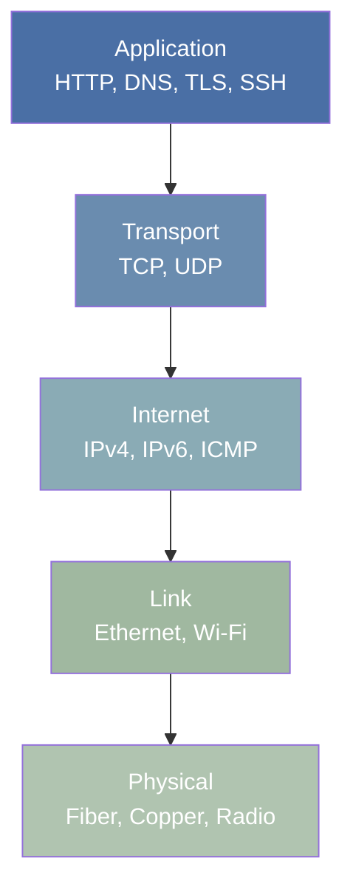

## Why Networking Matters

Every system you operate, deploy, or debug depends on networking. A container cannot reach its
database, a service returns 502 errors, DNS resolution stalls for 5 seconds, or TLS handshakes fail
with certificate errors -- these are all networking problems that land on the systems engineer's
desk.

Understanding networking is not optional. It is the substrate on which every distributed system
runs. When a microservice architecture adds latency proportional to the number of cross-service
calls, that is a networking problem. When a load balancer drops connections under load, that is a
networking problem. When a firewall rule blocks health checks but allows production traffic, that is
a networking problem.

This subject covers the protocol stack from layer 2 through layer 7, with emphasis on the protocols
you will encounter daily: IP, TCP, UDP, DNS, HTTP, and TLS. Each section includes practical
troubleshooting guidance because theoretical knowledge without diagnostic skill is useless in
production.

## The Protocol Stack

Network communication is organized into layers. Each layer provides services to the layer above it
and relies on the layer below it. The two primary reference models are:

- **OSI 7-layer model** -- a theoretical framework for understanding network functions
- **TCP/IP 4-layer model** (DoD model) -- the practical model that the Internet actually uses

## The Internet as a Network of Networks

The Internet is not a single network. It is a collection of approximately 70,000+ autonomous systems
(ASes) interconnected through peering agreements and transit relationships. Each AS is administered
independently, yet they all agree to exchange traffic using the Border Gateway Protocol (BGP).

Traffic between two hosts typically traverses:

1. **Access network** -- your local network (home, office, data center)
2. **Edge network** -- the ISP or cloud provider's network
3. **Transit network** -- backbone networks that carry traffic between ASes
4. **Destination network** -- the target's access and edge networks

Understanding this hierarchy matters because latency, packet loss, and routing policies differ at
each stage. A problem that looks like "the application is slow" may actually be a BGP route flap at
a transit provider, or it may be a misconfigured MTU on a VPN tunnel.

## What This Subject Covers

| Topic                 | Focus                                                     |
| --------------------- | --------------------------------------------------------- |
| OSI and TCP/IP Models | Reference models, encapsulation, layer violations         |
| IP Addressing         | IPv4, IPv6, subnetting, CIDR, NAT, DHCP, ARP              |
| TCP and UDP           | Connection management, congestion control, flow control   |
| DNS                   | Hierarchy, resolution, caching, DNSSEC, DoH/DoT           |
| HTTP                  | HTTP/1.1, HTTP/2, HTTP/3, caching, REST                   |
| TLS                   | Handshake, cipher suites, certificates, PKI               |
| Network Tools         | tcpdump, Wireshark, curl, dig, ss, diagnostic methodology |

## Core Principles

Every protocol covered in this subject shares a few fundamental properties:

1. **Encapsulation** -- higher-layer data is wrapped in lower-layer headers for delivery
2. **Multiplexing** -- port numbers, connection identifiers, and session tags allow multiple
   concurrent flows on a single link
3. **Best-effort delivery** -- IP provides no guarantees; reliability is an end-to-end concern
   implemented by TCP
4. **End-to-end principle** -- complexity belongs at the endpoints, not in the network (RFC 8890)

These principles explain why certain design decisions were made and why real-world networks behave
the way they do.
