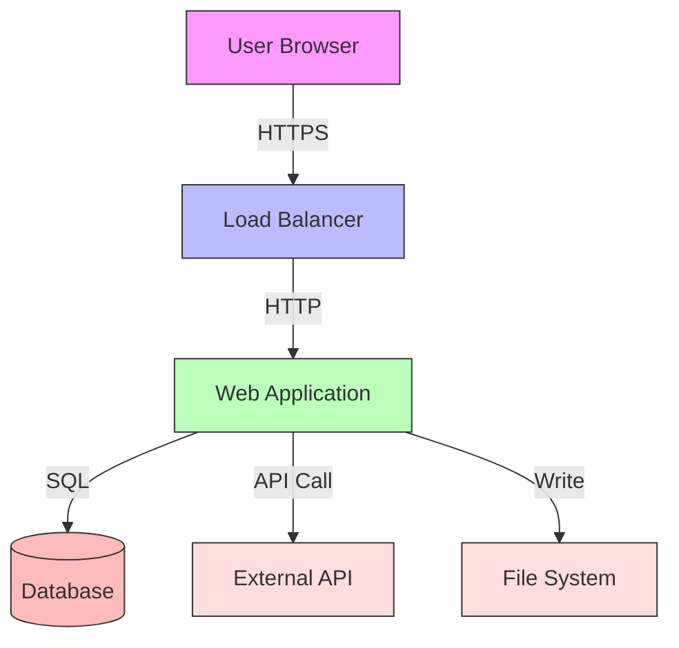
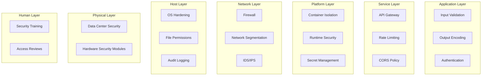
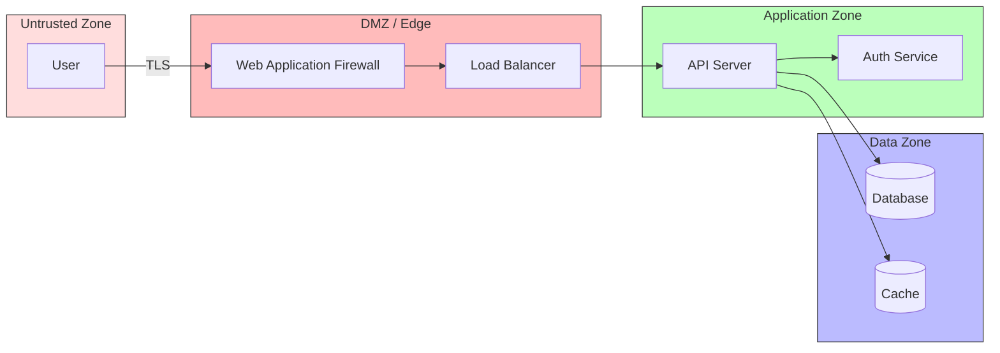

## The CIA Triad

The CIA triad is the foundational model for information security. Every security control,
vulnerability, and threat maps to one or more of these three properties.

### Confidentiality

Confidentiality ensures that data is accessible only to authorized parties. It is enforced through
encryption, access controls, and data classification.

Mechanisms that enforce confidentiality:

| Mechanism             | Layer          | Example                           |
| --------------------- | -------------- | --------------------------------- |
| Encryption at rest    | Storage        | AES-256-GCM on disk, database TDE |
| Encryption in transit | Network        | TLS 1.3, IPsec                    |
| Access control lists  | Application    | File permissions, RBAC policies   |
| Data masking          | Presentation   | Redacting PII in logs             |
| Classification        | Organizational | Public, internal, confidential    |

Confidentiality is not binary. A system that encrypts data at rest but logs the plaintext to an
unsecured file has failed confidentiality. A system that uses AES-256 but stores the key alongside
the ciphertext has failed confidentiality. The entire data lifecycle must be considered.

### Integrity

Integrity ensures that data has not been altered by unauthorized parties. It covers both malicious
tampering and accidental corruption.

| Mechanism             | Purpose                                | Example                     |
| --------------------- | -------------------------------------- | --------------------------- |
| Cryptographic hashes  | Detect modification                    | SHA-256 file checksums      |
| Digital signatures    | Prove authenticity and non-tampering   | Signed firmware images      |
| Version control       | Track authorized changes               | Git commits with signing    |
| Write-once storage    | Prevent post-write modification        | WORM storage for audit logs |
| Referential integrity | Database-level consistency enforcement | Foreign key constraints     |

Integrity failures are often subtler than confidentiality failures. A single bit flip in a
configuration file can change a firewall rule. A modified dependency in a supply chain attack can
introduce a backdoor without changing any visible behavior. Integrity verification must be
continuous, not one-time.

### Availability

Availability ensures that authorized users can access systems and data when needed. It is defended
against both malicious attacks (DDoS) and operational failures (hardware faults, misconfigurations).

| Threat Vector       | Countermeasure                      | Standard       |
| ------------------- | ----------------------------------- | -------------- |
| DDoS flooding       | Rate limiting, anycast, scrubbing   | RFC 4732       |
| Hardware failure    | Redundancy, failover, RAID          | N/A            |
| Misconfiguration    | Infrastructure as code, peer review | N/A            |
| Ransomware          | Backups, immutability, air-gapping  | NIST SP 800-34 |
| Resource exhaustion | Quotas, auto-scaling, cgroups       | N/A            |

Availability is the most operationally visible of the three triad elements. When confidentiality or
integrity fails silently, you may not know for months. When availability fails, everyone notices
immediately.

## STRIDE Threat Model

STRIDE is a threat classification framework developed by Microsoft (Shostack, 2014). It categorizes
threats against a system into six classes, each mapping to a specific security violation.

### Threat Categories

| Threat                      | STRIDE Category        | Security Impact | Example                                     |
| --------------------------- | ---------------------- | --------------- | ------------------------------------------- |
| Impersonating a user        | Spoofing               | Confidentiality | Stolen session token, forged certificate    |
| Modifying data or code      | Tampering              | Integrity       | SQL injection, firmware modification        |
| Denying an action           | Repudiation            | Non-repudiation | Deleting audit logs, anonymous transactions |
| Exposing information        | Information Disclosure | Confidentiality | Directory traversal, verbose errors         |
| Denying service             | Denial of Service      | Availability    | SYN flood, resource exhaustion              |
| Gaining unauthorized access | Elevation of Privilege | All three       | Kernel exploit, privilege escalation        |

### Applying STRIDE

STRIDE is applied through **data flow diagrams (DFDs)**. For each component, element, and data flow
in the diagram, you systematically ask: "Which STRIDE threats apply here?"



For the diagram above, a partial STRIDE analysis:

| Component  | Spoofing | Tampering | Repudiation | Info Disclosure | DoS | EoP |
| ---------- | -------- | --------- | ----------- | --------------- | --- | --- |
| User to LB | Yes      | No        | No          | Yes             | Yes | No  |
| LB to APP  | Yes      | No        | No          | No              | Yes | No  |
| APP to DB  | No       | Yes       | Yes         | Yes             | Yes | Yes |
| APP to EXT | Yes      | Yes       | No          | Yes             | Yes | No  |
| APP to FS  | No       | Yes       | No          | Yes             | Yes | Yes |

### Threat Trees

A **threat tree** decomposes a threat into its prerequisite conditions, creating a boolean
expression that describes the attack. The root node is the attacker's goal. Leaf nodes are the
specific conditions the attacker must achieve.

For example, a threat tree for "Attacker reads customer PII from database":

```
Attacker reads PII
├── Attacker gains SQL access
│   ├── SQL injection in web app
│   │   ├── Unsanitized user input reaches query
│   │   └── No WAF or input validation
│   └── Stolen database credentials
│       ├── Credential in source code
│       ├── Credential in CI/CD logs
│       └── Phished DBA
└── Attacker gains filesystem access
    ├── Server compromise
    └── Backup theft
```

Each leaf represents a countermeasure opportunity. If you eliminate enough leaves that no complete
path from root to leaf remains, the threat is mitigated.

## Attack Surface Analysis

The attack surface of a system is the set of all points where an untrusted actor can interact with
it. Reducing the attack surface is one of the highest-leverage security activities.

### Categories of Attack Surface

| Category      | Examples                                       | Reduction Strategy                     |
| ------------- | ---------------------------------------------- | -------------------------------------- |
| Network       | Open ports, APIs, services                     | Close unused ports, firewall rules     |
| Software      | Dependencies, libraries, frameworks            | Dependency auditing, minimal installs  |
| User          | Employees, customers, third-party integrations | Principle of least privilege, training |
| Physical      | Server room access, USB ports, printed docs    | Access controls, endpoint protection   |
| Configuration | Default credentials, verbose errors, debug     | Hardening guides, config management    |

### Measuring Attack Surface

Attack surface can be quantified using Microsoft's **Relative Attack Surface Quotient (RASQ)**,
which assigns a cost to each attack vector (network port, service, RPC endpoint, etc.) and compares
the total cost across configurations or versions.

For practical purposes, the key metric is: **how many distinct paths exist from an untrusted input
to a protected asset?** Each path represents a potential vulnerability.

### Attack Surface Reduction Checklist

- Remove unused software, services, and dependencies
- Disable default accounts and change default credentials
- Minimize network exposure (close ports, restrict IP ranges)
- Implement allowlists over denylists for input validation
- Remove debug endpoints, test APIs, and development tools from production
- Apply the principle of least functionality

## Risk Assessment

Risk assessment is the process of identifying, analyzing, and prioritizing risks. It is the bridge
between threat modeling and security investment.

### Risk Quantification

Risk is commonly expressed as:

$$
\mathrm{Risk} = \mathrm{Likelihood} \times \mathrm{Impact}
$$

Where likelihood and impact are each rated on a defined scale. A common 5-point scale:

| Rating | Likelihood Description       | Impact Description               |
| ------ | ---------------------------- | -------------------------------- |
| 1      | Rare (&lt;1/year)            | Negligible (&lt;1,000 USD)       |
| 2      | Unlikely (1-5/year)          | Minor (1,000-10,000 USD)         |
| 3      | Possible (5-15/year)         | Moderate (10,000-100,000 USD)    |
| 4      | Likely (15-50/year)          | Major (100,000-1,000,000 USD)    |
| 5      | Almost certain (&gt;50/year) | Catastrophic (&gt;1,000,000 USD) |

### Risk Matrix

| Likelihood / Impact | Negligible (1) | Minor (2) | Moderate (3) | Major (4) | Catastrophic (5) |
| ------------------- | -------------- | --------- | ------------ | --------- | ---------------- |
| Almost certain (5)  | 5              | 10        | 15           | 20        | **25**           |
| Likely (4)          | 4              | 8         | 12           | **16**    | 20               |
| Possible (3)        | 3              | 6         | 9            | 12        | 16               |
| Unlikely (2)        | 2              | 4         | 6            | 8         | 12               |
| Rare (1)            | 1              | 2         | 3            | 4         | 8                |

Risks scoring 15 or above typically require immediate mitigation. Risks scoring 8-14 require a
mitigation plan with defined timelines. Risks below 8 may be accepted with documentation.

### Quantitative Risk Analysis (FAIR)

The **FAIR (Factor Analysis of Information Risk)** model provides a more rigorous quantitative
framework. It decomposes risk into:

- **Loss Event Frequency (LEF)**: How often a threat event occurs
- **Loss Magnitude (LM)**: How much loss results from each event

LEF is further decomposed into **Threat Event Frequency** (how often the threat actor attempts the
attack) and **Vulnerability** (the probability that an attempt succeeds). Loss Magnitude includes
both **Primary Loss** (direct costs) and **Secondary Loss** (response, reputation, regulatory).

FAIR produces a probability distribution over loss amounts rather than a single point estimate,
enabling risk-informed decision-making.

## Principle of Least Privilege

The principle of least privilege states that every subject (user, process, service account) should
operate with the minimum permissions necessary to perform its function, and for the minimum duration
necessary.

### Why Least Privilege Matters

Privilege escalation is involved in the majority of successful breaches. An attacker who gains
access to a low-privilege service account does not need a kernel exploit if that account already has
admin access to the database.

### Implementation Across Layers

| Layer       | Least Privilege Mechanism            | Example                                |
| ----------- | ------------------------------------ | -------------------------------------- |
| OS          | User accounts, capabilities, seccomp | Run web server as `nobody`, not root   |
| Container   | Non-root user, read-only filesystem  | Drop all capabilities, add only needed |
| Database    | Separate accounts per service, GRANT | App can SELECT but not DROP            |
| Cloud       | IAM roles, service-linked roles      | Lambda function with scoped S3 access  |
| Network     | Microsegmentation, network policies  | Pod can only talk to its own backend   |
| Application | RBAC, feature flags                  | User can edit but not delete           |

### Just-in-Time (JIT) Access

Static privilege assignment accumulates permissions over time. JIT access grants elevated privileges
on demand, with automatic expiration. Systems like AWS IAM, HashiCorp Vault, and Teleport support
JIT patterns.

### Separation of Duties

Related to least privilege is separation of duties: no single individual should control all aspects
of a critical operation. A developer who writes code should not be the sole approver for deploying
it to production. A database administrator should not be the sole reviewer of audit logs.

## Defense in Depth

Defense in depth is the practice of layering multiple independent security controls so that no
single point of failure results in total compromise.

### The Onion Model



### Key Principles

1. **Diversity**: Use controls from different vendors and different technologies. Two firewalls from
   the same vendor with the same ruleset are one control, not two.
2. **Redundancy**: If one control fails, another should still provide protection. This does not mean
   identical controls — it means complementary ones.
3. **Fail-safe defaults**: When a control fails, it should fail to a more restrictive state, not a
   more permissive one.
4. **Depth over breadth**: It is better to have 3 controls protecting a critical asset than 1
   control protecting 3 assets.

## Zero Trust Architecture

Zero trust is a security model that eliminates implicit trust based on network location. The
traditional perimeter model assumes that everything inside the network is trustworthy and everything
outside is not. Zero trust assumes that no network location, user, or device is inherently
trustworthy.

### Core Principles (NIST SP 800-207)

1. **All data sources and computing services are considered resources**: Whether on-premises or
   cloud.
2. **All communication is secured regardless of network location**: TLS everywhere, no exceptions.
3. **Access to resources is granted on a per-session basis**: Not per-connection, not per-login.
4. **Access is determined by dynamic policy**: Based on identity, device posture, location, and data
   sensitivity.
5. **The enterprise monitors and measures the integrity and security posture**: Continuous
   verification, not one-time authentication.
6. **All resource authentication and authorization are dynamic and strictly enforced**: Before and
   during the session.
7. **The enterprise collects as much information as possible about the current state**: Asset
   inventory, network traffic, user behavior.

### Zero Trust vs VPN Model

| Aspect             | VPN Model                  | Zero Trust Model                 |
| ------------------ | -------------------------- | -------------------------------- |
| Trust model        | Trust the network          | Trust nothing, verify everything |
| Access granularity | Network-level              | Per-resource, per-session        |
| Lateral movement   | Easy (full network access) | Restricted (microsegmentation)   |
| Authentication     | At connection time         | Continuous                       |
| Policy enforcement | At perimeter               | At every resource                |
| Deployment         | VPN concentrator           | Per-application proxies, SASE    |

### Implementation Components

- **Identity provider (IdP)**: Centralized identity management with MFA (Okta, Azure AD, Keycloak)
- **Policy engine**: Evaluates access requests against policies (OPA, Cedar)
- **Policy enforcement point (PEP)**: Enforces decisions at the resource (Envoy, service mesh
  proxies)
- **Device trust**: Evaluates device health certificates, OS version, patch level
- **Continuous monitoring**: Detects anomalous behavior and triggers re-evaluation

## Security Boundaries and Trust Relationships

A **security boundary** is a logical or physical perimeter within which a consistent set of security
policies is enforced. Crossing a security boundary requires authentication, authorization, and
typically encryption.

### Trust Boundaries

A trust boundary is where the authority controlling the security policy changes. Trust boundaries
exist:

- Between user and application (authentication)
- Between application tiers (service-to-service auth)
- Between organization and cloud provider (shared responsibility)
- Between application and third-party dependencies (supply chain)
- Between processes on the same host (process isolation)



### Cross-Boundary Security

Every time data crosses a trust boundary, you must consider:

1. **Authentication**: Is the sender who they claim to be?
2. **Authorization**: Is the sender allowed to perform this action?
3. **Integrity**: Has the data been modified in transit?
4. **Confidentiality**: Can unauthorized parties observe the data?
5. **Auditability**: Is this access logged?

### Shared Responsibility Model

In cloud environments, the security boundary between provider and customer is critical. AWS, Azure,
and GCP each define shared responsibility models, but the general principle is:

| Responsibility    | Provider                              | Customer                             |
| ----------------- | ------------------------------------- | ------------------------------------ |
| Physical security | Data center, hardware, networking     | N/A                                  |
| Platform security | Hypervisor, host OS, managed services | Guest OS, application, data          |
| Identity          | IAM service infrastructure            | User management, access policies     |
| Data protection   | Encryption infrastructure             | Encryption keys, data classification |
| Compliance        | SOC 2, ISO 27001 certification        | Customer-specific compliance         |

## OWASP Top 10 Overview

The OWASP Top 10 is a standard awareness document for web application security. The 2021 edition:

| #   | Category                                   | Description                                            |
| --- | ------------------------------------------ | ------------------------------------------------------ |
| A01 | Broken Access Control                      | Users acting outside intended permissions              |
| A02 | Cryptographic Failures                     | Sensitive data exposure due to weak or missing crypto  |
| A03 | Injection                                  | SQL, NoSQL, OS command injection via untrusted input   |
| A04 | Insecure Design                            | Missing or ineffective security controls by design     |
| A05 | Security Misconfiguration                  | Default configs, open S3 buckets, verbose errors       |
| A06 | Vulnerable and Outdated Components         | Using libraries with known CVEs                        |
| A07 | Identification and Authentication Failures | Weak passwords, broken session management              |
| A08 | Software and Data Integrity Failures       | Insecure CI/CD, unsigned updates, auto-fill            |
| A09 | Security Logging and Monitoring Failures   | Insufficient logging, no alerting, missing audit trail |
| A10 | Server-Side Request Forgery (SSRF)         | Server coerced into accessing unintended resources     |

Each of these is covered in detail in subsequent sections. See
[Web Security](../04-web-security/web-security.md) for mitigation details.

## CVE and CVSS

### Common Vulnerabilities and Exposures (CVE)

CVE is a dictionary of publicly known cybersecurity vulnerabilities. Each CVE entry is assigned a
unique identifier (e.g., CVE-2024-12345) and describes the vulnerability in standardized terms.

CVE is maintained by MITRE Corporation under sponsorship of CISA. It is the industry-standard
identifier referenced by vulnerability scanners, package managers, and security advisories.

### Common Vulnerability Scoring System (CVSS)

CVSS provides a numerical score (0.0-10.0) representing the severity of a vulnerability. CVSS v3.1
uses three metric groups:

| Metric Group  | Components                                                                          | Purpose                            |
| ------------- | ----------------------------------------------------------------------------------- | ---------------------------------- |
| Base          | Attack vector, complexity, privileges required, user interaction, scope, CIA impact | Intrinsic severity (immutable)     |
| Temporal      | Exploitability, remediation level, report confidence                                | Current state of the vulnerability |
| Environmental | Modified base metrics, CIA requirements, security requirements                      | Organizational impact              |

### Interpreting CVSS Scores

| Score Range | Severity | Action                                     |
| ----------- | -------- | ------------------------------------------ |
| 0.0         | None     | Informational                              |
| 0.1-3.9     | Low      | Track, address in normal maintenance cycle |
| 4.0-6.9     | Medium   | Address within 30-90 days                  |
| 7.0-8.9     | High     | Address within 7-30 days                   |
| 9.0-10.0    | Critical | Address immediately (within 24-72 hours)   |

:::warning

CVSS base scores are often misused as the sole basis for prioritization. A CVSS 9.8 vulnerability in
an internal tool with no network exposure is less urgent than a CVSS 7.5 vulnerability in an
internet-facing authentication service. Always factor exploitability, exposure, and business context
into prioritization.

:::

## Security Through Obscurity

Security through obscurity is the practice of relying on the secrecy of a system's design or
implementation as a security measure, rather than on the strength of the mechanism itself.

### Why It Fails

Kerckhoffs's principle states that a cryptosystem should be secure even if everything about the
system, except the key, is public knowledge. This principle extends beyond cryptography to all of
security engineering.

Arguments for obscurity typically include:

- "Attackers do not know we use this custom protocol"
- "We changed the default port, so scanners will not find it"
- "Our API endpoints are not documented, so attackers cannot discover them"

Each of these fails because:

1. **Attackers can reverse-engineer**: Binary analysis, network traffic inspection, and
   documentation scraping are automated.
2. **Insiders know**: The biggest threat vector is often internal. Obscurity provides zero
   protection against insiders.
3. **It creates a false sense of security**: You invest effort in hiding rather than hardening.
4. **It does not survive disclosure**: Once discovered, there is no defense in depth.

Obscurity is not without value — it can reduce noise from automated scanners and raise the effort
required for reconnaissance. But it must never be the sole or primary security control.

### Obscurity as a Supplementary Layer

Obscurity can serve as an additional layer in a defense-in-depth strategy, but only when backed by
real security controls:

| Anti-Pattern            | Why It Fails                                        | Proper Alternative                   |
| ----------------------- | --------------------------------------------------- | ------------------------------------ |
| Custom crypto algorithm | Not peer-reviewed, almost certainly breakable       | AES, ChaCha20, Ed25519               |
| Non-standard ports only | Port scanners find all ports in minutes             | Firewall rules, disable service      |
| Hidden admin endpoints  | Fuzzers and spiders discover unlinked routes        | Authentication + authorization       |
| Obfuscated source code  | Reverse engineering tools deobfuscate automatically | Code signing, integrity verification |
| Custom binary protocols | Wireshark + protocol analysis reveals structure     | TLS + standard protocol              |
| Removing server headers | Banner grabbing is one of many recon methods        | Harden the service, not the banner   |

## Threat Intelligence

Threat intelligence is information about threats and threat actors that helps organizations make
informed decisions about their security posture. It transforms raw indicators (IP addresses,
domains, file hashes) into actionable context (who is attacking, why, and how).

### Types of Threat Intelligence

| Type        | Description                                           | Audience            | Example                                               |
| ----------- | ----------------------------------------------------- | ------------------- | ----------------------------------------------------- |
| Strategic   | High-level trends, motivations, TTPs of threat actors | Executives, board   | "State-sponsored actors targeting financial services" |
| Operational | Specific campaigns, attacks, and imminent threats     | Security team       | "New campaign targeting VPN appliances"               |
| Tactical    | TTPs (tactics, techniques, procedures)                | Security engineers  | MITRE ATT&CK mapping of recent breach                 |
| Technical   | IOCs, signatures, YARA rules                          | Analysts, automated | Malware hashes, C2 domains, URLs                      |

### Threat Intelligence Sources

| Source                               | Type                | Cost      | Use Case                            |
| ------------------------------------ | ------------------- | --------- | ----------------------------------- |
| MITRE ATT&CK                         | Tactical            | Free      | Mapping adversary behavior          |
| CISA Known Exploited Vulnerabilities | Technical           | Free      | Patching prioritization             |
| AlienVault OTX                       | Technical           | Free      | Community-driven IOC sharing        |
| Recorded Future                      | All types           | Paid      | Enterprise threat intelligence      |
| Mandiant                             | Strategic, tactical | Paid      | APT tracking, incident analysis     |
| VirusTotal                           | Technical           | Free/Paid | Malware analysis, hash lookup       |
| Shodan                               | Technical           | Free/Paid | Internet-facing exposure assessment |

### Intelligence-Driven Defense

Threat intelligence is most valuable when integrated into operational workflows:

1. **Patch prioritization**: CISA KEV catalog identifies vulnerabilities known to be actively
   exploited — patch these first regardless of CVSS score
2. **Detection engineering**: Map threat actor TTPs to detection rules in your SIEM/EDR
3. **Hunting**: Proactively search your environment for indicators and behaviors associated with
   active campaigns
4. **Risk assessment**: Factor threat intelligence into likelihood estimates — if a vulnerability is
   being actively exploited in your industry, the likelihood is higher than the generic estimate

## Security Metrics

You cannot improve what you cannot measure. Security metrics provide visibility into the
effectiveness of security controls and inform resource allocation.

### Leading vs Lagging Indicators

| Type    | Description                                   | Example                                |
| ------- | --------------------------------------------- | -------------------------------------- |
| Leading | Predictive — measures effort and preparedness | Percentage of systems with MFA enabled |
| Lagging | Reactive — measures outcomes after the fact   | Number of breaches in the last year    |

Leading indicators are more actionable because you can influence them before an incident occurs.

### Meaningful Security Metrics

| Metric                                  | Type    | Why It Matters                                     |
| --------------------------------------- | ------- | -------------------------------------------------- |
| Mean Time to Patch (critical)           | Leading | Measures vulnerability management effectiveness    |
| Percentage of systems with MFA          | Leading | Measures authentication posture                    |
| Phishing simulation click rate          | Leading | Measures security awareness effectiveness          |
| Percentage of dependencies up to date   | Leading | Measures supply chain hygiene                      |
| Mean Time to Detect (MTTD)              | Lagging | Measures detection capability                      |
| Mean Time to Respond (MTTR)             | Lagging | Measures response effectiveness                    |
| Number of high/critical vulnerabilities | Lagging | Measures exposure (trending downward is good)      |
| Failed authentication attempts          | Leading | Indicates brute-force activity and password policy |

### Anti-Patterns in Security Metrics

- **Counting vulnerabilities**: Total CVE count is meaningless without context. A 5-year-old library
  with 50 CVEs in unused features is less risky than a 1 CVE in the authentication library.
- **Counting security tools**: Having 15 security tools does not mean you are 15x more secure.
  Measure outcomes, not tool count.
- **Compliance checkbox metrics**: "100% of servers have antivirus" means nothing if the antivirus
  is outdated or misconfigured.
- **Activity metrics**: "500 security tickets closed" measures busyness, not security. Measure risk
  reduction.

## Security vs Convenience Trade-offs

Every security control introduces friction. The challenge is finding the right balance — not
eliminating friction (which eliminates security), but minimizing unnecessary friction while
maintaining adequate protection.

### Common Trade-off Decisions

| Decision                 | Security Benefit           | Convenience Cost               | Typical Resolution                   |
| ------------------------ | -------------------------- | ------------------------------ | ------------------------------------ |
| Password rotation        | Limits credential lifetime | User frustration, sticky notes | NIST now discourages forced rotation |
| MFA enforcement          | Blocks credential theft    | Extra step per login           | Hardware keys, passkeys              |
| VPN requirement          | Encrypts all traffic       | Latency, client management     | Zero trust per-app access            |
| Session timeout          | Limits window of exposure  | Interrupted workflows          | Adaptive timeout by risk             |
| Code review requirements | Catches vulnerabilities    | Slower deployment              | Automated scanning + review          |
| Network segmentation     | Limits lateral movement    | Configuration complexity       | Service mesh, policy as code         |

### The Cost of Getting It Wrong

The trade-off is not symmetric. The cost of an incident is typically orders of magnitude higher than
the cost of the security control. A single ransomware incident can cost millions of USD in
remediation, lost revenue, and regulatory fines. The annual cost of MFA tokens for an entire
organization is a rounding error by comparison.

However, excessive security friction drives shadow IT — users routing around controls using personal
devices, unapproved SaaS, and shared credentials. The goal is security that is effective without
being burdensome enough to create workarounds.

### Designing Usable Security

Security that is too difficult to use correctly will be used incorrectly. Principles for usable
security:

1. **Default to secure**: The path of least resistance should be the secure path
2. **Make the secure choice obvious**: Visual indicators, clear language, good error messages
3. **Minimize steps**: Every additional step reduces compliance
4. **Provide feedback**: Show users the security state (is MFA enabled? Is the session encrypted?)
5. **Avoid blame language**: "Your password is weak" vs "This password could be stronger"

### Security by Design Principles

Security should be integrated into the development lifecycle from the earliest stages, not bolted on
at the end:

| Phase           | Security Activity                               | Output                           |
| --------------- | ----------------------------------------------- | -------------------------------- |
| Requirements    | Security requirements, threat model             | Security user stories            |
| Design          | Architecture review, security patterns          | Secure design document           |
| Implementation  | Secure coding standards, code review            | Reviewed, scanned code           |
| Testing         | SAST, DAST, penetration testing                 | Test reports, vulnerability list |
| Deployment      | Infrastructure hardening, secret management     | Hardened configuration           |
| Operations      | Monitoring, incident response, patch management | Operational runbooks             |
| Decommissioning | Secure data disposal, credential revocation     | Disposal certificate             |

## Security Governance

### Security Policies

A security policy is a high-level statement of management intent that defines the organization's
security objectives and principles. Policies are supported by standards (mandatory requirements),
guidelines (recommended practices), and procedures (step-by-step instructions).

| Document Type | Purpose                                          | Example                                                         |
| ------------- | ------------------------------------------------ | --------------------------------------------------------------- |
| Policy        | What must be done and why (management directive) | "All data classified as confidential must be encrypted at rest" |
| Standard      | What must be done (technical requirement)        | "AES-256-GCM for data at rest encryption"                       |
| Guideline     | What should be done (recommended best practice)  | "Use Argon2id for password hashing"                             |
| Procedure     | How to do it (step-by-step instructions)         | "How to rotate database credentials"                            |

### Risk Register

A risk register is a living document that tracks identified risks, their assessment, and their
mitigation status:

| Risk ID | Description                        | Likelihood | Impact | Score | Mitigation            | Owner    | Status      |
| ------- | ---------------------------------- | ---------- | ------ | ----- | --------------------- | -------- | ----------- |
| R-001   | SQL injection in login endpoint    | 3          | 4      | 12    | Parameterized queries | Dev Lead | In Progress |
| R-002   | Unencrypted data in S3 bucket      | 2          | 5      | 10    | Enable SSE-S3         | Ops Lead | Mitigated   |
| R-003   | Stale SSH keys on production hosts | 4          | 3      | 12    | SSH CA, cert rotation | SRE Lead | Open        |

### Security Awareness and Culture

Technical controls are necessary but insufficient without a security-aware culture. The goal is to
make security a shared responsibility, not a gatekeeping function.

**Effective security awareness programs:**

| Approach                     | Why It Works                                             | Why Alternatives Fail               |
| ---------------------------- | -------------------------------------------------------- | ----------------------------------- |
| Phishing simulations         | Provides real-time feedback, measures improvement        | One-time training that is forgotten |
| Department-specific training | Tailored to actual threats each team faces               | Generic "click safe" training       |
| Positive reinforcement       | Rewards good behavior (reporting phishing, MFA adoption) | Punitive "gotcha" culture           |
| Security champions program   | Embeds security advocates in each team                   | Centralized team as bottleneck      |
| Metrics and transparency     | Shows improvement over time, builds engagement           | No visibility into progress         |

The most effective security awareness programs frame security as enabling the business, not
constraining it. "This MFA protects you from account takeover" is more effective than "You must use
MFA because policy says so."

## Information Security Management Systems (ISMS)

An ISMS (as defined by ISO/IEC 27001) provides a systematic approach to managing sensitive
information. It encompasses policies, procedures, and controls that collectively manage risk to
information assets.

### ISO/IEC 27001 Structure

The standard follows the Plan-Do-Check-Act (PDCA) cycle:

| Phase | Activity                                                    | Output                                 |
| ----- | ----------------------------------------------------------- | -------------------------------------- |
| Plan  | Define scope, assess risks, set objectives, select controls | Risk treatment plan, SoA               |
| Do    | Implement controls, train staff, manage operations          | Implemented controls, training records |
| Check | Monitor, audit, review effectiveness                        | Audit reports, metrics, incidents      |
| Act   | Corrective actions, continual improvement                   | Updated policies, improved controls    |

### Controls (ISO/IEC 27001 Annex A)

The 2022 revision reorganized controls into four themes:

| Theme          | Number of Controls | Examples                                         |
| -------------- | ------------------ | ------------------------------------------------ |
| Organizational | 37                 | Security policies, asset management, HR security |
| People         | 8                  | Screening, terms of employment, training         |
| Physical       | 14                 | Office security, equipment, clear desk           |
| Technological  | 34                 | Access control, cryptography, operations         |

## Common Pitfalls

### Pitfall 1: Treating Security as a Checklist

Running through OWASP Top 10, applying security headers, and enabling MFA is necessary but not
sufficient. Checklists capture known patterns but miss novel attacks, context-specific risks, and
systemic issues. Security must be a continuous process of threat modeling, testing, and iteration —
not a one-time audit.

### Pitfall 2: Confusing Compliance with Security

PCI-DSS, SOC 2, HIPAA, ISO 27001 — these are compliance frameworks, not security guarantees.
Compliance measures whether you have controls in place. Security measures whether those controls are
effective. A compliant system can still be breached. A secure system that is not compliant can face
legal liability. Both are necessary; neither is sufficient.

### Pitfall 3: Trusting the Network

The assumption that "internal traffic is safe" has been obsolete for over a decade. Lateral movement
is a standard post-exploitation technique. Worms propagate across internal networks. Insider threats
are by definition inside the perimeter. Every internal service-to-service communication should be
authenticated and encrypted.

### Pitfall 4: Neglecting the Supply Chain

Your system is only as secure as its weakest dependency. If your CI/CD pipeline pulls from a public
package registry, a compromised dependency can give an attacker access to your build environment,
your signing keys, and ultimately your production systems. Dependency pinning, integrity
verification (lockfiles, SLSA), and minimal dependency trees are essential.

### Pitfall 5: Assuming Encryption Solves Everything

Encryption protects confidentiality and integrity of data in transit and at rest. It does not
protect against:

- Authorized users who misuse their access
- SQL injection (the attacker is the application, which is authorized)
- Client-side attacks (XSS steals data after decryption in the browser)
- Key compromise (encryption is only as strong as key management)
- Metadata exposure (who communicated, when, how much data)

### Pitfall 6: Ignoring the Human Factor

The most sophisticated technical controls are defeated by a user clicking a phishing link, reusing a
password, or sharing credentials over Slack. Technical controls must account for human behavior, not
assume perfect users. Security awareness training, phishing simulations, and usable security design
are not optional extras.

### Pitfall 7: No Incident Response Plan

Every organization will experience a security incident. The difference between a contained incident
and a catastrophe is whether you have a tested, practiced response plan. Without one, you will waste
the first critical hours figuring out who is responsible, what to do, and how to communicate — while
the attacker continues to operate undisturbed.

### Pitfall 8: Assuming Compliance Equals Security

Compliance frameworks (SOC 2, ISO 27001, PCI-DSS) define minimum control requirements. They are
necessary for legal and contractual reasons, but meeting the minimum does not mean you are secure. A
system can be fully compliant and still have critical vulnerabilities. Compliance is the floor, not
the ceiling.

### Pitfall 9: Neglecting Security at Design Time

Retrofitting security into an existing system is orders of magnitude more expensive and less
effective than designing it in from the start. Threat modeling during architecture review, security
requirements in user stories, and security testing in CI/CD are all far cheaper than post-deployment
remediation.

### Pitfall 10: Vendor Lock-in on Security Tooling

Relying on a single vendor for all security capabilities creates a single point of failure in your
security posture. If that vendor has a vulnerability, goes out of business, or changes pricing, your
entire security stack is affected. Use open standards, maintain interoperability, and avoid
proprietary lock-in where possible.

### Pitfall 11: Failing to Classify Data

Not all data has the same sensitivity. Without data classification, you either over-protect
low-sensitivity data (wasting resources) or under-protect high-sensitivity data (creating risk). A
data classification scheme (Public, Internal, Confidential, Restricted) enables proportionate
security controls.

### Pitfall 12: Ignoring Physical Security

Physical access trumps almost all technical controls. An attacker with physical access to a server
can boot from a live USB, modify the bootloader, install a hardware keylogger, or simply steal the
drive. Server room access controls, visitor logging, and hardware security modules (HSMs) are not
optional.

:::info

**Reference Standards**: NIST SP 800-53 (Security and Privacy Controls), NIST SP 800-207 (Zero Trust
Architecture), ISO/IEC 27001 (Information Security Management), OWASP Testing Guide v4, MITRE ATT&CK
Framework, CISA Known Exploited Vulnerabilities Catalog, ISO/IEC 27005 (Risk Management).

:::
