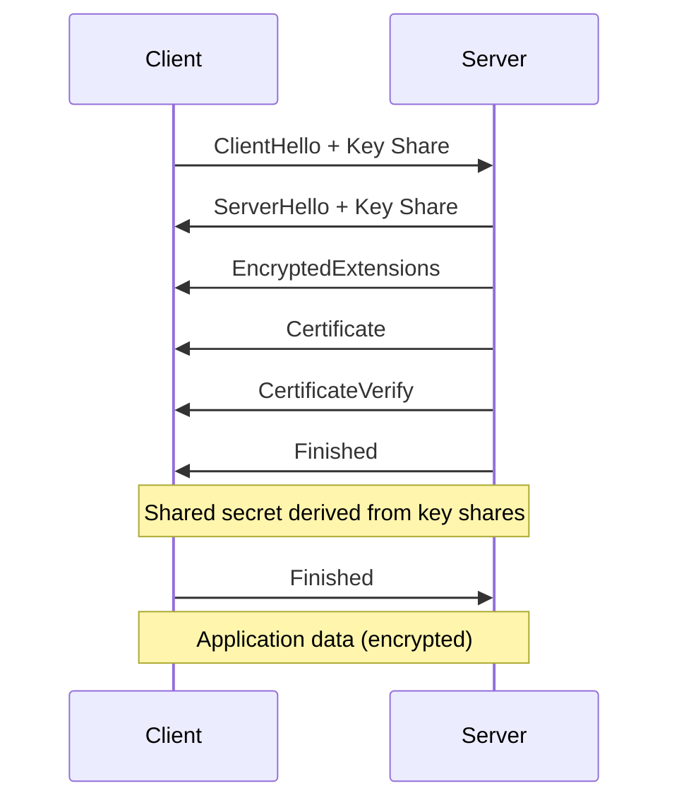

## Foundations

Cryptography is the mathematical science of securing communication and data. It is not a security
solution by itself — it is a tool that, when correctly applied within a secure system, provides
confidentiality, integrity, authentication, and non-repudiation.

### Cryptographic Primitives

| Primitive                | Purpose                            | Examples               |
| ------------------------ | ---------------------------------- | ---------------------- |
| Symmetric encryption     | Confidentiality (high-speed)       | AES, ChaCha20          |
| Asymmetric encryption    | Confidentiality (key exchange)     | RSA, ECIES             |
| Hash functions           | Integrity, password storage        | SHA-256, SHA-3, bcrypt |
| Message authentication   | Integrity + authenticity           | HMAC, Poly1305         |
| Digital signatures       | Non-repudiation, authenticity      | RSA-PSS, ECDSA, EdDSA  |
| Key exchange             | Secure shared secret establishment | Diffie-Hellman, ECDH   |
| Random number generation | Key material, nonces, salts        | `/dev/urandom`, CSPRNG |

### Kerckhoffs's Principle

A cryptosystem should be secure even if everything about the system, except the key, is public
knowledge. This means:

- The algorithm is published and peer-reviewed
- Security depends only on key secrecy
- The algorithm works even if the attacker has full knowledge of its implementation

This is why rolling your own crypto is almost always wrong. AES has been studied for decades by
thousands of cryptanalysts. Your custom cipher has been studied by nobody.

## Symmetric Encryption

Symmetric encryption uses the same key for encryption and decryption. It is fast (orders of
magnitude faster than asymmetric encryption) and is the standard for bulk data encryption.

### AES (Advanced Encryption Standard)

AES is a block cipher selected by NIST in 2001 (FIPS 197) as the successor to DES. It operates on
128-bit blocks with key sizes of 128, 192, or 256 bits.

| Parameter   | AES-128  | AES-192  | AES-256         |
| ----------- | -------- | -------- | --------------- |
| Key size    | 128 bits | 192 bits | 256 bits        |
| Rounds      | 10       | 12       | 14              |
| Security    | 128-bit  | 192-bit  | 256-bit         |
| Performance | Fastest  | Moderate | Slightly slower |

AES is a substitution-permutation network (SPN). Each round applies:

1. **SubBytes**: Non-linear byte substitution using an S-box
2. **ShiftRows**: Cyclic permutation of bytes within each row
3. **MixColumns**: Linear transformation mixing each column
4. **AddRoundKey**: XOR with the round key derived from the key schedule

### Modes of Operation

A block cipher operating on 128-bit blocks needs a mode of operation to handle messages longer than
one block. The mode determines how blocks are chained together and how ciphertext is produced.

#### Electronic Codebook (ECB)

Each block is encrypted independently with the same key.

```
Block 1 + Key → Ciphertext Block 1
Block 2 + Key → Ciphertext Block 2
Block 3 + Key → Ciphertext Block 3
```

**Do not use ECB.** Identical plaintext blocks produce identical ciphertext blocks, revealing
patterns in the data. The classic demonstration is encrypting an image — ECB preserves visual
structure completely.

#### Cipher Block Chaining (CBC)

Each plaintext block is XORed with the previous ciphertext block before encryption. An
initialization vector (IV) is used for the first block.

```
IV + Block 1 → XOR → Encrypt → Ciphertext Block 1
Ciphertext Block 1 + Block 2 → XOR → Encrypt → Ciphertext Block 2
```

CBC requires:

- **IV must be unpredictable** (random, not a counter). Reusing an IV with the same key is
  catastrophic.
- **Padding** (typically PKCS#7) to align plaintext to block boundaries.
- Decryption is parallelizable; encryption is sequential.

**Vulnerability**: CBC is vulnerable to padding oracle attacks if the system leaks information about
whether padding is valid. The BEAST attack (2011) exploited CBC in TLS 1.0 where the IV was the last
ciphertext block of the previous record.

#### Counter Mode (CTR)

CTR turns a block cipher into a stream cipher. A counter value is encrypted to produce a keystream,
which is XORed with the plaintext.

```
Counter 0 + Key → Encrypt → Keystream Block 0 → XOR → Plaintext Block 0 → Ciphertext Block 0
Counter 1 + Key → Encrypt → Keystream Block 1 → XOR → Plaintext Block 1 → Ciphertext Block 1
```

CTR properties:

- **No padding required**: It is a stream cipher mode, so plaintext can be any length.
- **Fully parallelizable**: Both encryption and decryption can be parallelized.
- **Random access**: Any block can be decrypted independently.
- **Nonce requirements**: The counter value must never repeat for the same key. A nonce (96 bits)
  combined with a block counter (32 bits) is standard (NIST SP 800-38A).

**Vulnerability**: CTR provides confidentiality only. It provides no integrity. If an attacker flips
a bit in the ciphertext, the corresponding plaintext bit is flipped and the modification is
undetectable. Always combine with a MAC.

#### Galois/Counter Mode (GCM)

GCM combines CTR mode encryption with Galois field authentication, providing both confidentiality
and integrity (AEAD — Authenticated Encryption with Associated Data).

```
Plaintext → CTR Encryption → Ciphertext
Ciphertext + Associated Data → GHASH → Authentication Tag
Output: Ciphertext + Tag
```

GCM properties:

- **AEAD**: Confidentiality + integrity in a single operation.
- **Associated data**: Can authenticate metadata (headers, nonces) without encrypting it.
- **Performance**: Hardware-accelerated AES-GCM is extremely fast (AES-NI instruction set).
- **Tag length**: Typically 128 bits (16 bytes). Shorter tags (96, 64 bits) reduce security margin.

:::warning

GCM has a critical nonce reuse vulnerability. If the same nonce is used twice with the same key, the
authentication tag can be forged and confidentiality of both messages is compromised. Use a 96-bit
random nonce (the probability of collision with $2^{32}$ messages is approximately $2^{-32}$, which
is acceptable) or a deterministic nonce construction (NIST SP 800-38D).

:::

### ChaCha20-Poly1305

ChaCha20-Poly1305 is an AEAD construction that is competitive with AES-GCM but does not require
hardware acceleration. It is the default in TLS 1.3 when AES-NI is not available (e.g., mobile
devices).

| Property       | AES-256-GCM      | ChaCha20-Poly1305   |
| -------------- | ---------------- | ------------------- |
| Key size       | 256 bits         | 256 bits            |
| Nonce size     | 96 bits          | 96 bits             |
| Tag size       | 128 bits         | 128 bits            |
| Hardware accel | AES-NI           | None required       |
| Software speed | Fast with AES-NI | Fast without AES-NI |
| Adoption       | Ubiquitous       | TLS 1.3, WireGuard  |

### Key Management

Symmetric encryption is only as secure as key management. The key must be:

1. **Generated with a CSPRNG** (never derived from passwords, timestamps, or process IDs)
2. **Stored securely** (HSM, KMS, sealed secrets — never in source code or environment variables)
3. **Rotated regularly** (with forward secrecy preserved during rotation)
4. **Destroyed when no longer needed** (cryptographic erasure — overwriting key material in memory)

```bash
# Generate a 256-bit random key (Linux)
openssl rand -base64 32

# Generate a 256-bit random key (macOS)
dd if=/dev/urandom bs=32 count=1 2>/dev/null | base64
```

## Asymmetric Encryption

Asymmetric (public-key) cryptography uses separate keys for encryption and decryption. The public
key encrypts, the private key decrypts. This eliminates the key distribution problem of symmetric
encryption at the cost of significantly slower performance.

### RSA

RSA (Rivest-Shamir-Adleman, 1977) is based on the computational difficulty of factoring the product
of two large prime numbers.

| Parameter     | Recommended Value                           |
| ------------- | ------------------------------------------- |
| Key size      | 2048 bits minimum, 4096 preferred           |
| Padding       | OAEP (for encryption), PSS (for signatures) |
| Hash function | SHA-256 or SHA-384                          |

RSA encryption with OAEP:

$$
\mathrm{Ciphertext} = (\mathrm{Plaintext} \| \mathrm{Label})^{e} \mod n
$$

Where $e$ is the public exponent (typically 65537) and $n$ is the modulus (product of two primes $p$
and $q$).

**Key sizes and security levels:**

| RSA Key Size | Equivalent Symmetric Security |
| ------------ | ----------------------------- |
| 1024 bits    | 80 bits (broken)              |
| 2048 bits    | 112 bits                      |
| 3072 bits    | 128 bits                      |
| 4096 bits    | 150 bits                      |

RSA key generation is expensive ($O(k^3)$ for key size $k$) and RSA encryption/decryption is orders
of magnitude slower than AES. RSA is typically used to encrypt a symmetric key (key encapsulation),
not to encrypt bulk data directly.

### Elliptic Curve Cryptography (ECC)

ECC is based on the algebraic structure of elliptic curves over finite fields. It provides
equivalent security to RSA with much smaller key sizes.

| Security Level | RSA Key Size | ECC Key Size | Ratio |
| -------------- | ------------ | ------------ | ----- |
| 80 bits        | 1024 bits    | 160 bits     | 6.4x  |
| 128 bits       | 3072 bits    | 256 bits     | 12x   |
| 192 bits       | 7680 bits    | 384 bits     | 20x   |
| 256 bits       | 15360 bits   | 521 bits     | 29.5x |

The most commonly used curves:

| Curve             | Key Size | Use Case                          | Standard            |
| ----------------- | -------- | --------------------------------- | ------------------- |
| P-256 (secp256r1) | 256 bits | TLS, JWT, general use             | NIST                |
| P-384 (secp384r1) | 384 bits | Higher security requirements      | NIST                |
| X25519            | 256 bits | Key exchange (Diffie-Hellman)     | RFC 7748            |
| Ed25519           | 256 bits | Digital signatures                | RFC 8032            |
| Curve25519        | 256 bits | Modern alternative to NIST curves | Daniel J. Bernstein |

:::info

Prefer Curve25519 and Ed25519 over NIST P-256/P-384 for new systems. The NIST curves have parameter
generation that was not fully transparent (though no backdoor has been found), and
Curve25519/Ed25519 have simpler, faster implementations with fewer side-channel risks.

:::

### Diffie-Hellman Key Exchange

Diffie-Hellman (DH) allows two parties to establish a shared secret over an insecure channel without
transmitting the secret itself.

#### Finite Field Diffie-Hellman (FFDHE)

1. Alice and Bob agree on a prime $p$ and generator $g$ (public parameters)
2. Alice generates private key $a$, sends $A = g^a \mod p$
3. Bob generates private key $b$, sends $B = g^b \mod p$
4. Alice computes $s = B^a \mod p$
5. Bob computes $s = A^b \mod p$
6. Both arrive at the same shared secret $s = g^{ab} \mod p$

An eavesdropper who sees $A$ and $B$ cannot compute $s$ without solving the discrete logarithm
problem.

#### Elliptic Curve Diffie-Hellman (ECDH)

Same principle as FFDHE but over an elliptic curve group. ECDH with Curve25519 (X25519) is the
standard for modern key exchange:

```go
// Go example: ECDH key exchange
privateKey, _ := x25519.GenerateKey(rand.Reader)
publicKey := privateKey.Public()

// sharedSecret is the same on both sides
sharedSecret, _ := privateKey.ECDH(peerPublicKey)
```

#### Forward Secrecy

Forward secrecy (also called perfect forward secrecy, PFS) ensures that compromise of a long-term
key does not compromise past session keys. If you use RSA to encrypt a symmetric key and the RSA
private key is later compromised, all past sessions can be decrypted.

With ephemeral Diffie-Hellman (DHE or ECDHE), the key exchange uses temporary key pairs that are
discarded after the session. Even if the server's long-term key is compromised, past sessions remain
secure.

## Hash Functions

A cryptographic hash function maps arbitrary-length input to a fixed-length output with the
following properties:

1. **Preimage resistance**: Given hash $h$, it is infeasible to find $m$ such that
   $\mathrm{Hash}(m) = h$
2. **Second preimage resistance**: Given $m_1$, it is infeasible to find $m_2 \neq m_1$ such that
   $\mathrm{Hash}(m_1) = \mathrm{Hash}(m_2)$
3. **Collision resistance**: It is infeasible to find any pair $m_1 \neq m_2$ such that
   $\mathrm{Hash}(m_1) = \mathrm{Hash}(m_2)$

### SHA Family

| Algorithm | Output Size | Block Size | Rounds | Status                         |
| --------- | ----------- | ---------- | ------ | ------------------------------ |
| SHA-1     | 160 bits    | 512 bits   | 80     | Broken (collision found, 2017) |
| SHA-224   | 224 bits    | 512 bits   | 64     | Secure                         |
| SHA-256   | 256 bits    | 512 bits   | 64     | Secure                         |
| SHA-384   | 384 bits    | 1024 bits  | 80     | Secure                         |
| SHA-512   | 512 bits    | 1024 bits  | 80     | Secure                         |
| SHA-3-256 | 256 bits    | 1088 bits  | 24     | Secure (Keccak)                |

### SHA-3 (Keccak)

SHA-3 was selected by NIST in 2012 as a backup to SHA-2. It uses a different internal structure
(sponge construction vs Merkle-Damgard in SHA-2), so an attack on SHA-2 would not necessarily affect
SHA-3.

SHA-3 is not faster than SHA-2 in software, but it is significantly faster in hardware (FPGA/ASIC
implementations). Use SHA-3 when you want algorithmic diversity or are implementing in hardware.

### Password Hashing Functions

Standard hash functions (SHA-256, SHA-3) are **not suitable for password hashing**. They are
designed to be fast, which makes them vulnerable to brute-force and dictionary attacks with GPUs.

Password hashing functions are designed to be slow and memory-hard, making brute-force attacks
expensive.

#### bcrypt

- **Design**: Blowfish-based, adaptive cost parameter
- **Salt**: 128-bit random salt embedded in output
- **Cost factor**: $2^{\mathrm{cost}}$ iterations (default 10 = 1024 iterations, recommended 12+)
- **Output**: 60 characters (e.g., `$2b$12$R9h/cIPz0gi...`)

```python
import bcrypt

# Hash a password (cost factor 12)
password = b"correct_horse_battery_staple"
hashed = bcrypt.hashpw(password, bcrypt.gensalt(rounds=12))

# Verify
bcrypt.checkpw(password, hashed)  # True
bcrypt.checkpw(b"wrong", hashed)  # False
```

**Limitation**: bcrypt has a 72-byte password length limit. Passwords longer than 72 bytes are
silently truncated. Pre-hashing with SHA-256 before bcrypt mitigates this.

#### scrypt

- **Design**: Memory-hard, CPU-hard
- **Parameters**: Cost (CPU/memory), block size (memory), parallelization
- **Advantage over bcrypt**: Resistant to GPU/ASIC attacks due to memory requirements

```python
import hashlib

# scrypt hash (Python 3.6+)
salt = b"random_salt_16_bytes"
hashed = hashlib.scrypt(
    b"password",
    salt=salt,
    n=2**14,    # CPU/memory cost
    r=8,        # block size
    p=1,        # parallelization
    dklen=64    # output length
)
```

#### Argon2

Argon2 is the winner of the Password Hashing Competition (2015) and is recommended by OWASP for new
applications.

| Variant  | Resistance Target  | Use Case                                   |
| -------- | ------------------ | ------------------------------------------ |
| Argon2id | GPU + side-channel | Recommended default                        |
| Argon2i  | Side-channel       | Threat model includes side-channel attacks |
| Argon2d  | GPU                | Threat model excludes side-channel attacks |

```python
from argon2 import PasswordHasher

ph = PasswordHasher(
    time_cost=3,       # number of iterations
    memory_cost=65536, # 64 MB
    parallelism=4,     # number of threads
    hash_len=32,       # output length
    salt_len=16        # salt length
)

hashed = ph.hash("correct_horse_battery_staple")
ph.verify(hashed, "correct_horse_battery_staple")  # True
```

**OWASP recommended parameters (2023):**

| Parameter   | Argon2id      | scrypt   | bcrypt              |
| ----------- | ------------- | -------- | ------------------- |
| Memory      | 64 MB (65536) | N/A      | N/A                 |
| Iterations  | 3             | N/A      | 10+                 |
| Parallelism | 4             | 1        | N/A                 |
| Salt length | 16 bytes      | 16 bytes | 16 bytes (embedded) |
| Hash length | 32 bytes      | 32 bytes | 31 characters       |

## Message Authentication Codes

A MAC provides integrity and authenticity for a message. The sender and receiver share a secret key.

### HMAC

HMAC (Hash-based MAC, RFC 2104) uses a cryptographic hash function with a secret key:

$$
\mathrm{HMAC}(K, m) = H\Big((K' \oplus \mathrm{opad}) \;\|\; H\big((K' \oplus \mathrm{ipad}) \;\|\; m\big)\Big)
$$

Where $K'$ is the key padded to the block size, $\mathrm{opad} = \mathrm{0x5c}...$, and
$\mathrm{ipad} = \mathrm{0x36}...$.

```python
import hmac
import hashlib

key = b"secret_key"
message = b"important message"

mac = hmac.new(key, message, hashlib.sha256).hexdigest()
# Verify: hmac.compare_digest(mac, received_mac)
```

:::warning

Always use `hmac.compare_digest()` for MAC verification, not the `==` operator. The `==` operator is
vulnerable to timing attacks — it returns as soon as it finds a mismatch, leaking information about
how many bytes of the MAC are correct.

:::

### Poly1305

Poly1305 is a fast MAC that is typically paired with ChaCha20 (ChaCha20-Poly1305 AEAD). It produces
a 128-bit tag and is designed for one-time use per key.

## Digital Signatures

Digital signatures provide authentication, integrity, and non-repudiation. The signer uses their
private key to sign; anyone with the public key can verify.

### RSA-PSS

RSA-PSS (Probabilistic Signature Scheme, RFC 8017) is the modern RSA signature scheme. It uses
randomization in the padding, making it more resistant to attacks than the older PKCS#1 v1.5 scheme.

```bash
# Generate RSA-PSS signature
openssl dgst -sha256 -sigopt rsa_padding_mode:pss -sigopt rsa_pss_saltlen:32 \
  -sign private.key -out signature.bin document.pdf

# Verify
openssl dgst -sha256 -sigopt rsa_padding_mode:pss -sigopt rsa_pss_saltlen:32 \
  -verify public.key -signature signature.bin document.pdf
```

### ECDSA

ECDSA (Elliptic Curve Digital Signature Algorithm) provides equivalent security to RSA with much
smaller keys. Used extensively in TLS, Bitcoin, and code signing.

| Curve | Key Size | Security Level |
| ----- | -------- | -------------- |
| P-256 | 256 bits | 128 bits       |
| P-384 | 384 bits | 192 bits       |
| P-521 | 521 bits | 256 bits       |

ECDSA signature verification requires careful implementation. Nonce reuse (signing two different
messages with the same nonce) leaks the private key. Use deterministic nonce generation (RFC 6979).

### EdDSA (Ed25519)

EdDSA (Edwards-curve Digital Signature Algorithm) using the Ed25519 curve is the modern standard for
digital signatures:

- **Deterministic**: No random nonce required (eliminates nonce-reuse vulnerabilities)
- **Fast**: Signature generation and verification are faster than ECDSA
- **Simple**: Fewer implementation pitfalls than ECDSA
- **Compact**: 64-byte signatures, 32-byte keys

```go
// Go example: Ed25519 signing
publicKey, privateKey, _ := ed25519.GenerateKey(rand.Reader)
signature := ed25519.Sign(privateKey, message)
ed25519.Verify(publicKey, message, signature) // true
```

### Comparison

| Algorithm    | Key Size  | Signature Size | Performance | Security Notes               |
| ------------ | --------- | -------------- | ----------- | ---------------------------- |
| RSA-2048-PSS | 256 bytes | 256 bytes      | Slow        | Widely supported, large keys |
| ECDSA P-256  | 64 bytes  | 64 bytes       | Medium      | Nonce handling critical      |
| Ed25519      | 32 bytes  | 64 bytes       | Fast        | Deterministic, recommended   |

## Key Derivation

Key derivation functions (KDFs) derive cryptographic keys from a source of entropy (a shared secret,
password, or random seed).

### HKDF

HKDF (HMAC-based Extract-and-Expand Key Derivation Function, RFC 5869) is used in TLS 1.3,
WireGuard, and most modern protocols.

```python
import hmac
import hashlib

def hkdf_extract(salt, ikm):
    return hmac.new(salt, ikm, hashlib.sha256).digest()

def hkdf_expand(prk, info, length):
    n = (length + 31) // 32  # for SHA-256
    okm = b""
    t = b""
    for i in range(1, n + 1):
        t = hmac.new(prk, t + info + bytes([i]), hashlib.sha256).digest()
        okm += t
    return okm[:length]
```

### PBKDF2

PBKDF2 (Password-Based Key Derivation Function 2, RFC 2898) derives keys from passwords using
iterated HMAC.

```python
import hashlib
import os

salt = os.urandom(16)
key = hashlib.pbkdf2_hmac(
    "sha256",
    b"password",
    salt,
    600000,  # iterations (OWASP 2023 recommendation)
    dklen=32
)
```

:::warning

PBKDF2 is a CPU-hard KDF but not memory-hard. It is significantly weaker against GPU attacks than
Argon2id or scrypt. Use PBKDF2 only for compatibility with existing systems. For new systems, use
Argon2id.

:::

## Public Key Infrastructure (PKI)

PKI is the framework for managing digital certificates and public-key encryption. It binds public
keys to identities through a chain of trust.

### X.509 Certificates

An X.509 certificate contains:

| Field                   | Description                                   |
| ----------------------- | --------------------------------------------- |
| Version                 | Certificate format version (v3)               |
| Serial number           | Unique identifier within the CA               |
| Signature algorithm     | Algorithm used to sign the certificate        |
| Issuer                  | Distinguished name of the CA                  |
| Validity period         | Not Before / Not After timestamps             |
| Subject                 | Distinguished name of the certificate holder  |
| Subject Public Key Info | The public key and its algorithm              |
| Extensions              | Key usage, SAN, CRL distribution points, etc. |
| Signature               | CA's signature over all the above fields      |

### Certificate Chains

Certificates form a chain from a leaf (end-entity) certificate to a root certificate through one or
more intermediate certificates.

```
Root CA (self-signed, trusted)
  └── Intermediate CA (signed by Root)
       └── Leaf Certificate (signed by Intermediate, e.g., example.com)
```

The root certificate is pre-installed in operating systems and browsers (trust store). Validation
verifies:

1. Each certificate in the chain is properly signed by the issuing CA
2. No certificate has expired
3. No certificate has been revoked (via CRL or OCSP)
4. The leaf certificate matches the requested hostname (via SAN)
5. Key usage and extended key usage are appropriate

### Certificate Revocation

| Mechanism         | Description                                     | Pros                         | Cons                            |
| ----------------- | ----------------------------------------------- | ---------------------------- | ------------------------------- |
| CRL               | CA publishes list of revoked serial numbers     | Simple, offline verification | Can grow large, delayed updates |
| OCSP              | Real-time query: "is this certificate revoked?" | Fresh status                 | Privacy leak, CA must be online |
| OCSP Stapling     | Server provides OCSP response with the cert     | No extra request, privacy    | Server must fetch and staple    |
| Short-lived certs | Certificates valid for hours/days               | Reduces need for revocation  | Requires automation             |

### Certificate Transparency (CT)

Certificate Transparency (RFC 6962) requires CAs to log all issued certificates to publicly
auditable, append-only logs. This prevents CAs from issuing certificates for a domain without the
domain owner's knowledge.

## TLS (Transport Layer Security)

TLS provides authenticated, encrypted communication over a network. TLS 1.3 (RFC 8446) is the
current standard; TLS 1.0, 1.1, and SSL are deprecated.

### TLS 1.3 Handshake



TLS 1.3 improvements over TLS 1.2:

- **1-RTT handshake** (down from 2-RTT)
- **0-RTT resumption** for repeat connections (with replay protection caveats)
- **Mandatory forward secrecy** (all cipher suites use ephemeral key exchange)
- **No renegotiation** (eliminates a class of attacks)
- **Encrypted server messages** (EncryptedExtensions, Certificate, etc. sent after cleartext
  ServerHello)

### Cipher Suites

TLS 1.3 simplified cipher suites to:

| Cipher Suite                 | KEX   | Auth      | AEAD              |
| ---------------------------- | ----- | --------- | ----------------- |
| TLS_AES_256_GCM_SHA384       | ECDHE | RSA/ECDSA | AES-256-GCM       |
| TLS_CHACHA20_POLY1305_SHA256 | ECDHE | RSA/ECDSA | ChaCha20-Poly1305 |
| TLS_AES_128_GCM_SHA256       | ECDHE | RSA/ECDSA | AES-128-GCM       |

In TLS 1.3, the key exchange is always ephemeral Diffie-Hellman (providing forward secrecy), and the
cipher suite only specifies the AEAD algorithm and hash function. RSA key exchange and static DH are
removed.

### Verifying TLS Configuration

```bash
# Test TLS configuration (external scanner)
testssl.sh example.com

# Check supported protocols
openssl s_client -connect example.com:443 -tls1_3

# View certificate chain
openssl s_client -connect example.com:443 -showcerts

# Check cipher suites
nmap --script ssl-enum-ciphers -p 443 example.com
```

## Random Number Generation

Cryptographic random number generation is critical. Predictable random numbers compromise keys,
nonces, IVs, and salts.

### CSPRNG vs PRNG

| Property      | PRNG (e.g., Mersenne Twister) | CSPRNG                     |
| ------------- | ----------------------------- | -------------------------- |
| Speed         | Fast                          | Slower                     |
| Unpredictable | No (if state is known)        | Yes (computationally)      |
| Seeding       | Single seed                   | Continuous entropy from OS |
| Use case      | Simulations, games            | Cryptographic keys, nonces |

### Sources of Entropy

| Source                | Entropy Quality | Platform     |
| --------------------- | --------------- | ------------ |
| `/dev/urandom`        | High            | Linux, macOS |
| `/dev/random`         | High            | Linux        |
| `CryptGenRandom`      | High            | Windows      |
| `getrandom()` syscall | High            | Linux 3.17+  |
| RDRAND/RDSEED         | Moderate        | Intel/AMD    |
| Hardware TRNG         | High            | HSMs, TPMs   |

:::warning

Do not use `Math.random()` or `random()` for security purposes. These are PRNGs seeded with
predictable values (often timestamps). Use platform CSPRNGs: `/dev/urandom` on Unix,
`CryptGenRandom` on Windows, or language-specific secure random APIs (`secrets` in Python,
`crypto.randomBytes` in Node.js, `java.security.SecureRandom` in Java).

:::

## Post-Quantum Cryptography

### The Threat

A sufficiently powerful quantum computer running Shor's algorithm could:

- **Break RSA**: Factor large integers in polynomial time
- **Break ECC**: Compute discrete logarithms in polynomial time
- **Break DH**: Compute discrete logarithms in polynomial time

Grover's algorithm reduces the effective security of symmetric encryption and hashing by half (e.g.,
AES-128 becomes 64-bit security, SHA-256 preimage resistance becomes 128-bit).

### NIST PQC Standardization (2024)

NIST has standardized the following post-quantum algorithms:

| Algorithm                   | Type              | Based On      | Status                  |
| --------------------------- | ----------------- | ------------- | ----------------------- |
| ML-KEM (CRYSTALS-Kyber)     | Key encapsulation | Lattice-based | Standardized (FIPS 203) |
| ML-DSA (CRYSTALS-Dilithium) | Digital signature | Lattice-based | Standardized (FIPS 204) |
| SLH-DSA (SPHINCS+)          | Digital signature | Hash-based    | Standardized (FIPS 205) |

### Migration Strategy

1. **Inventory**: Identify all cryptographic dependencies and their key sizes
2. **Hybrid mode**: Use classical + post-quantum algorithms simultaneously during transition
3. **Crypto agility**: Design systems so algorithms can be swapped without protocol changes
4. **Key sizes**: AES-256 and SHA-384 provide sufficient security against Grover's algorithm

:::info

The "harvest now, decrypt later" threat is real. Attackers may be recording encrypted traffic today
to decrypt it when quantum computers become available. Organizations with long-term confidentiality
requirements (government, healthcare, financial) should begin PQC migration planning now.

:::

## Common Pitfalls

### Pitfall 1: ECB Mode

ECB encrypts each block independently, preserving patterns in the data. Never use ECB. If you need a
mode without authentication, use CTR. If you need both confidentiality and integrity, use GCM or
ChaCha20-Poly1305.

### Pitfall 2: Hardcoded Keys

Keys in source code, configuration files committed to Git, or environment variables in CI logs are
immediately compromised. Use a dedicated secret management system (HashiCorp Vault, AWS KMS, Azure
Key Vault).

### Pitfall 3: Using SHA-256 for Password Hashing

SHA-256 is designed to be fast. An attacker with a modern GPU can compute billions of SHA-256 hashes
per second. Use bcrypt (cost 12+), scrypt, or Argon2id for password storage.

### Pitfall 4: Reusing Nonces/IVs

In GCM mode, nonce reuse is catastrophic — it enables both forgeries and plaintext recovery. In CTR
mode, nonce reuse leaks XOR of plaintexts. Always use a unique nonce per encryption operation.

### Pitfall 5: Ignoring Certificate Validation

Disabling TLS certificate verification (`verify=False` in Python, `InsecureRequestWarning`
suppression) eliminates the entire trust model of TLS. This is common in development and
occasionally leaks into production. Never disable certificate validation.

### Pitfall 6: Using Deprecated Algorithms

MD5, SHA-1, DES, 3DES, RC4, and RSA with PKCS#1 v1.5 padding are all broken or deprecated. Use
AES-256-GCM, ChaCha20-Poly1305, SHA-256/384, RSA-PSS, or Ed25519.

### Pitfall 7: Not Providing Forward Secrecy

Without forward secrecy (ephemeral Diffie-Hellman), compromise of the server's private key
compromises all past sessions. TLS 1.3 mandates forward secrecy, but TLS 1.2 with RSA key exchange
does not provide it. Ensure your cipher suites use ECDHE or DHE.

:::info

**Reference Standards**: NIST SP 800-57 (Key Management), NIST SP 800-63B (Digital Identity), NIST
SP 800-38D (GCM), NIST SP 800-132 (PBKDF2), NIST FIPS 203/204/205 (Post-Quantum), RFC 8446 (TLS
1.3), RFC 8017 (RSA), RFC 8032 (EdDSA), RFC 7748 (Curve25519), RFC 5869 (HKDF).

:::
