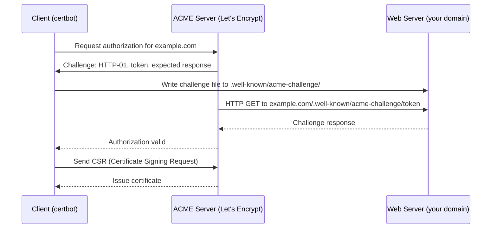
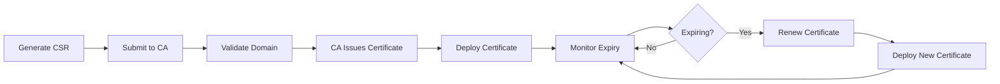

## Getting a Certificate

### Certificate Authority (CA) Options

| Source         | Cost | Validation          | Trust     | Best For                         |
| -------------- | ---- | ------------------- | --------- | -------------------------------- |
| Let's Encrypt  | Free | Automated (ACME)    | Universal | Public-facing services           |
| DigiCert       | Paid | Organization, EV    | Universal | Enterprise, extended validation  |
| Self-signed    | Free | None                | Internal  | Development, internal services   |
| Internal CA    | Free | Internal            | Internal  | Corporate networks               |
| Cloud provider | Paid | DNS/HTTP validation | Universal | Services hosted on that provider |

### Self-Signed Certificates

```bash
# Generate a self-signed certificate (development only)
openssl req -x509 -newkey rsa:2048 -keyout server.key -out server.crt \
  -days 365 -nodes \
  -subj "/CN=localhost/O=Dev/C=US"

# Generate with SAN (Subject Alternative Names)
openssl req -x509 -newkey rsa:2048 -keyout server.key -out server.crt \
  -days 365 -nodes \
  -subj "/CN=localhost" \
  -addext "subjectAltName=DNS:localhost,IP:127.0.0.1"
```

:::warning

Self-signed certificates produce browser warnings and client errors unless the CA certificate is
explicitly trusted. Never use self-signed certificates in production for public-facing services. Use
them only for internal services where you control the trust store.

:::

## ACME Protocol

The ACME (Automated Certificate Management Environment) protocol, defined in RFC 8555, automates
certificate issuance, renewal, and revocation. Let's Encrypt is the most widely used CA that
implements ACME.

### HTTP-01 Challenge

The CA sends a request to `http://&lt;domain&gt;/.well-known/acme-challenge/&lt;token&gt;` and
expects a specific response. This proves control over the domain.



Requirements:

- Port 80 must be reachable from the internet
- The web server must serve files from `/.well-known/acme-challenge/`
- Works behind HTTP reverse proxies (nginx, Caddy, Traefik)

### DNS-01 Challenge

The CA verifies domain ownership by looking for a specific TXT record:

```bash
# ACME client creates a TXT record:
_acme-challenge.example.com. TXT "validation_string"

# The ACME server queries this TXT record via DNS
# Once validated, the certificate is issued
```

Requirements:

- DNS API access (Cloudflare, Route53, etc.) or manual DNS record creation
- DNS propagation time (can be minutes to hours without API access)
- Works for internal services, wildcard certificates, and servers behind NAT

| Challenge   | Port Required | Wildcards | Behind NAT             | Automation           |
| ----------- | ------------- | --------- | ---------------------- | -------------------- |
| HTTP-01     | 80            | No        | No (needs public HTTP) | Easy with web server |
| DNS-01      | None          | Yes       | Yes                    | Requires DNS API     |
| TLS-ALPN-01 | 443           | No        | No                     | Less common          |

### Certbot

```bash
# Obtain a certificate (HTTP-01)
certbot certonly --webroot \
  -w /var/www/html \
  -d example.com \
  -d www.example.com

# Obtain a certificate (DNS-01 with Cloudflare)
certbot certonly --dns-cloudflare \
  --dns-cloudflare-credentials /etc/cloudflare/api.ini \
  -d example.com \
  -d *.example.com

# Obtain a certificate (standalone, temporarily uses port 80)
certbot certonly --standalone -d example.com

# Dry run (test without actually getting a certificate)
certbot certonly --webroot -w /var/www/html -d example.com --dry-run

# Renew (certificates auto-renew via cron/systemd timer)
certbot renew

# Renew with force (if certificate is not yet due)
certbot renew --force-renewal

# Check certificate expiry
certbot certificates

# Hooks (run scripts before/after renewal)
certbot renew --deploy-hook "systemctl reload nginx"
certbot renew --pre-hook "systemctl stop nginx" \
  --post-hook "systemctl start nginx"
```

### Renewal Automation

Certbot installs a systemd timer or cron job for automatic renewal:

```bash
# Systemd timer (default on modern systems)
systemctl list-timers | grep certbot
# certbot.timer - runs twice daily

# Cron (older systems)
# /etc/cron.d/certbot:
# 0 */12 * * * root certbot renew --quiet --deploy-hook "systemctl reload nginx"
```

Let's Encrypt certificates are valid for 90 days. Certbot attempts renewal at 30 days before expiry.
The `--deploy-hook` reloads the web server after successful renewal.

## Certificate Lifecycle



### Key Events

| Event      | Description                                           |
| ---------- | ----------------------------------------------------- |
| Creation   | Private key generated, CSR created, submitted to CA   |
| Issuance   | CA validates domain, signs certificate, returns chain |
| Deployment | Certificate and chain installed on server             |
| Rotation   | Old certificate replaced with new one before expiry   |
| Expiration | Certificate becomes invalid after validity period     |
| Revocation | CA marks certificate as compromised before expiry     |

### Certificate Rotation

```bash
# Check certificate expiry
openssl x509 -in /etc/letsencrypt/live/example.com/cert.pem -noout -enddate
# notAfter=Mar 15 23:59:59 2026 GMT

# Days until expiry
openssl x509 -in /etc/letsencrypt/live/example.com/cert.pem -noout -checkend 2592000
# (checks if cert expires within 30 days = 2592000 seconds)

# Test certificate chain
openssl s_client -connect example.com:443 -servername example.com </dev/null 2>/dev/null \
  | openssl x509 -noout -dates -issuer
```

## Certificate Formats

### PEM

The most common format. Base64-encoded ASCII with `-----BEGIN ...-----` headers:

```text
-----BEGIN CERTIFICATE-----
MIIFazCCA1OgAwIBAgIRAIIQz7DSQONZRGPgu2OCiwAwDQYJKoZIhvcNAQELBQAw
...
-----END CERTIFICATE-----
```

### DER

Binary form of PEM. Used in Java keystores and some enterprise systems:

```bash
# Convert PEM to DER
openssl x509 -in cert.pem -outform DER -out cert.der
```

### PKCS12 (.pfx, .p12)

Archive format that bundles the certificate, private key, and CA chain:

```bash
# Create PKCS12 from PEM
openssl pkcs12 -export -out bundle.p12 \
  -inkey server.key \
  -in server.crt \
  -certfile ca_chain.crt

# Extract PEM from PKCS12
openssl pkcs12 -in bundle.p12 -nocerts -out server.key
openssl pkcs12 -in bundle.p12 -clcerts -nokeys -out server.crt
```

### Chain Ordering

The certificate chain must be ordered from leaf (server) to root (CA):

```text
# Correct order:
# 1. server.crt (your certificate)
# 2. intermediate.crt (intermediate CA)
# 3. (root.crt is usually NOT included — browsers have it in their trust store)

# Full chain file for nginx:
cat server.crt intermediate.crt > fullchain.pem
```

## Private Key Management

### Key Types

| Algorithm | Key Size | Performance | Security Level | Recommendation                    |
| --------- | -------- | ----------- | -------------- | --------------------------------- |
| RSA       | 2048     | Fast        | 112 bits       | Minimum acceptable                |
| RSA       | 4096     | Slower      | 128 bits       | High-security environments        |
| ECDSA     | P-256    | Fast        | 128 bits       | Best balance of speed/security    |
| ECDSA     | P-384    | Moderate    | 192 bits       | Higher security requirement       |
| Ed25519   | 256 bit  | Fastest     | 128 bits       | Modern, recommended for new certs |

```bash
# RSA 2048
openssl genrsa -out server.key 2048

# RSA 4096
openssl genrsa -out server.key 4096

# ECDSA P-256
openssl ecparam -genkey -name prime256v1 -noout -out server.key

# Ed25519
openssl genpkey -algorithm ED25519 -out server.key

# Generate CSR from existing key
openssl req -new -key server.key -out server.csr \
  -subj "/CN=example.com/O=MyOrg/C=US"
```

### Key Protection

```bash
# Generate encrypted key (requires passphrase)
openssl genrsa -aes256 -out server.key 4096

# Key file permissions
chmod 600 server.key
chown root:root server.key

# Remove passphrase from key (for automated services)
openssl rsa -in server-encrypted.key -out server.key
```

:::warning

Never commit private keys to version control. Use a secrets manager (HashiCorp Vault, AWS Secrets
Manager, Azure Key Vault) or a provisioning tool (Ansible Vault, SOPS) to manage private keys.
Automated certificate management with certbot or a cloud provider reduces the risk of manual key
handling errors.

:::

## TLS Configuration

### Cipher Suite Selection

```nginx
# Nginx: modern configuration (TLS 1.2 and 1.3 only)
ssl_protocols TLSv1.2 TLSv1.3;

# Cipher suites for TLS 1.2 (server preference order)
ssl_ciphers 'ECDHE-ECDSA-AES128-GCM-SHA256:ECDHE-RSA-AES128-GCM-SHA256:ECDHE-ECDSA-AES256-GCM-SHA384:ECDHE-RSA-AES256-GCM-SHA384';

# TLS 1.3 cipher suites (selected automatically by the library)
# TLS_AES_128_GCM_SHA256
# TLS_AES_256_GCM_SHA384
# TLS_CHACHA20_POLY1305_SHA256

# Prefer server cipher order
ssl_prefer_server_ciphers on;
```

### Protocol Version Negotiation

```bash
# Test supported TLS versions
openssl s_client -connect example.com:443 -tls1_2 </dev/null 2>&1 | grep "Protocol"
openssl s_client -connect example.com:443 -tls1_3 </dev/null 2>&1 | grep "Protocol"

# Verify TLS 1.0 and 1.1 are rejected
openssl s_client -connect example.com:443 -tls1 </dev/null 2>&1 | grep "Protocol"
# Should fail with: "wrong version number"
```

## Common Misconfigurations

### Weak Ciphers

```bash
# Test for weak ciphers
nmap --script ssl-enum-ciphers -p 443 example.com

# Look for these (insecure):
# RC4, DES, 3DES, MD5, SHA1, export-grade ciphers
# Null ciphers, anonymous DH
```

### Expired Certificates

Monitor certificate expiry proactively:

```bash
# Check expiry of all certificates on a server
for domain in example.com api.example.com cdn.example.com; do
  echo -n "$domain: "
  echo | openssl s_client -connect $domain:443 -servername $domain 2>/dev/null \
    | openssl x509 -noout -enddate | cut -d= -f2
done

# Set up monitoring alerts at 30, 14, and 7 days before expiry
```

### Missing Intermediate Chain

If the server does not send the intermediate certificate, clients that do not have it cached will
fail to validate the chain:

```bash
# Verify chain is complete
openssl s_client -connect example.com:443 -showcerts </dev/null 2>/dev/null \
  | grep -c "BEGIN CERTIFICATE"
# Should be 2 or more (server cert + intermediate)
# If 1, the chain is incomplete
```

### Mixed Content

HTTPS pages that load resources (images, scripts, CSS) over HTTP trigger browser "mixed content"
warnings:

```text
# Insecure: HTTPS page loads HTTP resource
https://example.com/page → loads http://example.com/image.jpg

# Fix: use protocol-relative URLs or HTTPS
https://example.com/page → loads //example.com/image.jpg
https://example.com/page → loads https://example.com/image.jpg
```

### HSTS Misconfiguration

```nginx
# HSTS header
add_header Strict-Transport-Security "max-age=31536000; includeSubDomains; preload" always;

# Common mistakes:
# 1. Not including "includeSubDomains" — subdomains can be accessed over HTTP
# 2. Not including "preload" — browsers won't preload HSTS
# 3. Too short max-age (e.g., 300 seconds) — provides minimal protection
# 4. Setting HSTS on HTTP responses — browsers ignore it
```

## Forward Secrecy

Forward secrecy ensures that compromising the server's private key does not allow decryption of past
sessions. Each session uses a unique ephemeral key exchange.

| Key Exchange | Forward Secrecy | Notes                                      |
| ------------ | --------------- | ------------------------------------------ |
| RSA          | No              | Key encrypted with server's static RSA key |
| DHE          | Yes             | Slower, older                              |
| ECDHE        | Yes             | Faster, recommended                        |

```nginx
# ECDHE is used automatically with modern cipher suites
# Verify forward secrecy is enabled
openssl s_client -connect example.com:443 -tls1_2 </dev/null 2>&1 | grep "Key-Exchange"
# Should show: ECDHE-RSA or ECDHE-ECDSA
```

## Session Resumption

### Session IDs

The server assigns a session ID after the first handshake. The client presents this ID in subsequent
handshakes to skip the full negotiation:

```nginx
# Nginx: configure shared session cache
ssl_session_cache shared:SSL:10m;
ssl_session_timeout 1d;
ssl_session_tickets off;
```

### Session Tickets

The server encrypts the session state and sends it to the client as a ticket. The client presents
the ticket in subsequent handshakes. No server-side session cache is needed:

```nginx
# Nginx: session tickets (enabled by default)
ssl_session_tickets on;
ssl_session_timeout 1d;
```

### 0-RTT (TLS 1.3)

TLS 1.3 supports 0-RTT data, where the client sends application data with the first handshake
message. This reduces latency by one round-trip but is vulnerable to replay attacks:

```nginx
# Nginx: 0-RTT (disabled by default, enable with caution)
ssl_early_data on;

# Application must handle replay attacks:
# - Only use for idempotent requests
# - Use a single-use token to detect replays
```

:::warning

0-RTT data can be replayed by an attacker who captures the client's initial message. Only enable
0-RTT for idempotent, safe-to-replay requests (e.g., GET requests, non-critical analytics). Never
use 0-RTT for authentication, payment, or state-changing requests.

:::

## Mutual TLS (mTLS)

### Client Certificates

In mTLS, both the client and the server present certificates. This provides strong authentication:

```nginx
# Nginx: require client certificates
ssl_client_certificate /etc/nginx/ca.crt;
ssl_verify_client on;
ssl_verify_depth 2;
```

```bash
# Generate a client certificate signed by your CA
openssl genpkey -algorithm EC -pkeyopt ec_paramgen_curve:P-256 -out client.key
openssl req -new -key client.key -out client.csr \
  -subj "/CN=service-account/O=MyOrg"
openssl x509 -req -in client.csr -CA ca.crt -CAkey ca.key -CAcreateserial \
  -out client.crt -days 365 -sha256

# Test mTLS connection
curl --cert client.crt --key client.key https://example.com/api
```

### Use Cases

| Use Case                         | Why mTLS                                  |
| -------------------------------- | ----------------------------------------- |
| Service-to-service communication | Stronger than API keys, no shared secrets |
| Internal APIs                    | Replaces VPN for some architectures       |
| IoT devices                      | Device identity and authentication        |
| Zero-trust network access        | Identity-based access control             |

## Certificate Transparency

### Certificate Transparency Logs

Certificate Transparency (CT) is a system for publicly logging all issued certificates. Browsers
require CT log inclusion for publicly trusted certificates:

```bash
# Check CT log inclusion
curl -s "https://crt.sh/?q=example.com&amp;output=json" | python3 -m json.tool

# Monitor for unauthorized certificates
# Set up alerts for new certificate entries for your domain
```

### HPKP (Deprecated)

HTTP Public Key Pinning (HPKP) was a mechanism to pin specific public keys for a domain. It has been
**removed** from all major browsers due to the risk of misconfiguration (which could permanently
block access to a site):

```text
# DEPRECATED: DO NOT USE
# Public-Key-Pins: pin-sha256="base64=="; max-age=5184000; includeSubDomains

# If you pinned the wrong key, your site becomes inaccessible for the max-age duration
# Chrome removed support in Chrome 69 (2018)
```

## Monitoring

### Certificate Expiry Alerts

```bash
# Cron job: alert when certificates expire within 30 days
#!/bin/bash
DOMAINS=("example.com" "api.example.com" "cdn.example.com")
THRESHOLD_DAYS=30

for domain in "${DOMAINS[@]}"; do
  expiry_date=$(echo | openssl s_client -connect $domain:443 \
    -servername $domain 2>/dev/null \
    | openssl x509 -noout -enddate 2>/dev/null | cut -d= -f2)

  if [ -n "$expiry_date" ]; then
    expiry_epoch=$(date -d "$expiry_date" +%s)
    current_epoch=$(date +%s)
    days_left=$(( (expiry_epoch - current_epoch) / 86400 ))

    if [ $days_left -lt $THRESHOLD_DAYS ]; then
      echo "WARNING: $domain expires in $days_left days ($expiry_date)"
      # Send alert (email, Slack, PagerDuty)
    fi
  else
    echo "ERROR: Could not retrieve certificate for $domain"
  fi
done
```

### SSL Labs Scan

```bash
# Automated SSL Labs scan
# https://www.ssllabs.com/ssltest/analyze.html?d=example.com

# API-based scan (requires registration)
curl "https://api.ssllabs.com/api/v3/analyze?host=example.com&amp;publish=off&amp;startNew=on"
```

### Mozilla Observatory

```bash
# https://observatory.mozilla.org/
# Tests security headers, TLS configuration, and more
```

## Common Pitfalls

### Let's Encrypt Rate Limits

Let's Encrypt enforces strict rate limits:

| Limit Type              | Restriction                          |
| ----------------------- | ------------------------------------ |
| Certificates per domain | 50 per week (per registered domain)  |
| Failed validations      | 5 per account per hostname per hour  |
| Duplicate certificates  | 5 per week (same exact set of names) |
| Registered domains      | 300 per account                      |

Exceeding these limits blocks certificate issuance. Use the staging environment for testing:

```bash
# Let's Encrypt staging (certificates are NOT trusted)
certbot --staging certonly --webroot -w /var/www/html -d example.com
```

### Certificate Chain Ordering

The most common TLS deployment error is incorrect chain ordering. The chain file must contain the
server certificate first, followed by intermediate certificates in order (leaf to root). Nginx
requires the full chain in a single file:

```bash
# Correct: server cert + intermediate
cat server.crt intermediate.crt > fullchain.pem

# Wrong: intermediate first
cat intermediate.crt server.crt > fullchain.pem
# This causes "certificate verify failed" errors in some clients
```

### Not Including SAN (Subject Alternative Names)

Modern browsers and TLS clients ignore the CN (Common Name) field and only use SAN. If your
certificate lacks a SAN for the domain, it will be rejected:

```bash
# Verify SAN on a certificate
openssl x509 -in cert.pem -noout -text | grep -A1 "Subject Alternative Name"
```

### Disabling TLS 1.0/1.1 Too Early

While TLS 1.0 and 1.1 are deprecated (RFC 8996), some legacy clients still require them. Disable
them only after auditing client requirements. PCI DSS 3.2.1 mandated disabling TLS 1.0 by June 2018
and TLS 1.1 by June 2019.
