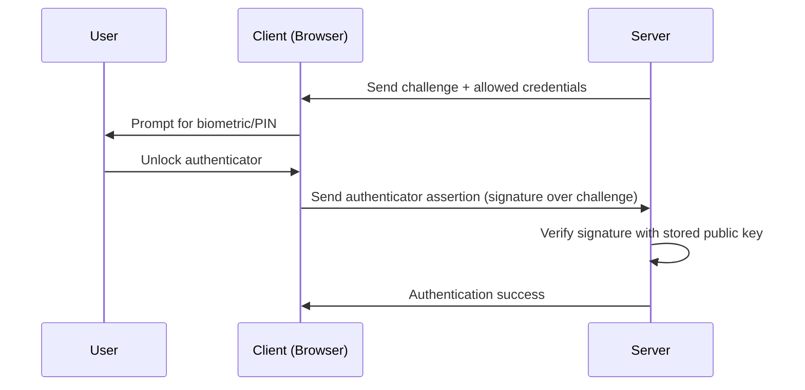
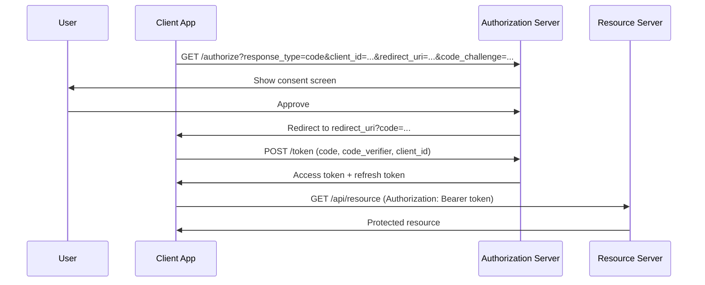
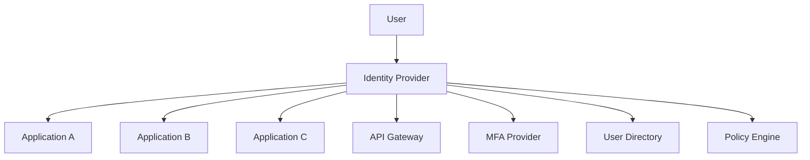

## Authentication vs Authorization

**Authentication (AuthN)** answers "who are you?" — it verifies identity.

**Authorization (AuthZ)** answers "what can you do?" — it enforces permissions.

These are distinct concerns that are often conflated. A user can be authenticated (their identity is
verified) but not authorized (they lack permission for a specific action). Conversely, a system
might authorize a request without authentication (anonymous access).

| Aspect       | Authentication               | Authorization               |
| ------------ | ---------------------------- | --------------------------- |
| Question     | Who are you?                 | What are you allowed to do? |
| Mechanism    | Passwords, MFA, certificates | RBAC, ABAC, ACLs, policies  |
| Failure mode | Authentication failed        | Access denied / Forbidden   |
| HTTP status  | 401 Unauthorized             | 403 Forbidden               |
| Frequency    | Once per session (typically) | Every request               |
| Revocation   | Invalidate session/token     | Update permissions/policies |

## Password Storage

### How Not to Store Passwords

| Method               | Why It Fails                                     |
| -------------------- | ------------------------------------------------ |
| Plaintext            | Immediate compromise on any data breach          |
| MD5                  | Fast, 128-bit output, no salt, trivially broken  |
| SHA-1                | Fast, 160-bit output, collision broken           |
| SHA-256 without salt | Fast, no salt, vulnerable to rainbow tables      |
| Base64 encoding      | Not hashing at all — encoding is not encryption  |
| Custom encryption    | Key management problem shifts the attack surface |

### How to Store Passwords

Use a dedicated password hashing function with a unique random salt per password:

```python
# Argon2id (recommended)
from argon2 import PasswordHasher
ph = PasswordHasher(time_cost=3, memory_cost=65536, parallelism=4)
hash = ph.hash("user_password")  # $argon2id$v=19$m=65536,t=3,p=4$...

# bcrypt (widely supported)
import bcrypt
hash = bcrypt.hashpw(b"user_password", bcrypt.gensalt(rounds=12))

# scrypt (memory-hard alternative)
import hashlib
hash = hashlib.scrypt(b"user_password", salt=os.urandom(16), n=2**14, r=8, p=1, dklen=64)
```

### Password Hash Format

A password hash must contain:

1. **Algorithm identifier**: Which function was used (allows migration)
2. **Parameters**: Cost factor, memory, parallelism (allows increasing work factor)
3. **Salt**: Unique per password (prevents rainbow tables and identical password detection)
4. **Hash output**: The actual derived key

Example formats:

```
# Argon2id
$argon2id$v=19$m=65536,t=3,p=4$c29tZXNhbHQ$RdescudvJCsgt3ub+b+dWRWJTmaaJObG

# bcrypt
$2b$12$R9h/cIPz0gi.YJJFsRyuPOYfGJTCGijPylCPvmFbzXuKJ5Xo1GZ6u

# scrypt (PHC format)
$scrypt$ln=16,r=8,p=1$c2FsdHNhbHQ$E4JnHDMfM/4R5U6YbGzbVg==
```

### Hash Migration Strategy

When you need to upgrade from bcrypt to Argon2id:

1. On login, verify the password against the existing hash
2. If verification succeeds and the hash uses the old algorithm, re-hash with the new algorithm
3. Store the new hash
4. Over time, all active users migrate to the new algorithm

This avoids forcing a password reset for all users.

## Password Policies

### NIST SP 800-63B Recommendations (Revised 2023)

The NIST Digital Identity Guidelines represent the current best practice for password policies, and
they contradict many traditional policies.

**Do:**

- Require minimum 8 characters (15+ for higher security)
- Allow all printable characters and spaces
- Check passwords against breached password databases (HaveIBeenPwned API)
- Use rate limiting to prevent brute-force attacks
- Allow password managers and paste functionality
- Implement secure password reset (time-limited, single-use tokens)

**Do Not:**

- Force periodic password rotation (leads to predictable patterns: `Password1!`, `Password2!`, ...)
- Require composition rules (uppercase + lowercase + digit + special character — users just
  capitalize the first letter and add `1!`)
- Require passwords to be changed after a breach unless compromise is confirmed
- Use knowledge-based authentication (security questions are trivially guessable)
- Store password hints
- Set maximum password length under 64 characters

### Breached Password Checking

Check passwords against known breached password databases at creation and authentication time:

```python
import requests
import hashlib
import sys

def check_pwned_password(password):
    """Check if password appears in HaveIBeenPwned database using k-anonymity."""
    sha1 = hashlib.sha1(password.encode()).hexdigest().upper()
    prefix, suffix = sha1[:5], sha1[5:]
    response = requests.get(f"https://api.pwnedpasswords.com/range/{prefix}")
    for line in response.text.splitlines():
        hash_suffix, count = line.split(":")
        if hash_suffix == suffix:
            return int(count)
    return 0
```

## Multi-Factor Authentication (MFA)

MFA requires two or more independent factors from different categories:

| Factor Category | Examples                              | Security Level         |
| --------------- | ------------------------------------- | ---------------------- |
| Knowledge       | Passwords, PINs, security questions   | Low (phishable)        |
| Possession      | TOTP apps, hardware keys, phone (SMS) | Medium (varies)        |
| Inherence       | Biometrics (fingerprint, face, iris)  | Medium (not revocable) |
| Location        | IP address, geolocation               | Low (spoofable)        |

### TOTP (Time-based One-Time Password)

TOTP (RFC 6238) generates a 6-8 digit code based on a shared secret and the current time. The server
and client both compute:

$$
\mathrm{TOTP} = \mathrm{Truncate}\Big(\mathrm{HMAC-SHA-1}(K, T)\Big)
$$

Where $K$ is the shared secret and $T = \lfloor \mathrm{current\_time} / 30 \rfloor$.

| Property      | Value                                  |
| ------------- | -------------------------------------- |
| Time step     | 30 seconds                             |
| Code length   | 6 digits (default)                     |
| Shared secret | 160-bit (Base32)                       |
| Hash          | HMAC-SHA-1 (default), SHA-256, SHA-512 |

**Limitations**: TOTP codes are phishable. An attacker can proxy the login page and forward the TOTP
code to the real service in real time. TOTP is not a replacement for phishing-resistant MFA.

### FIDO2 / WebAuthn

FIDO2 (Fast Identity Online 2) is the gold standard for phishing-resistant authentication. It uses
public-key cryptography with a hardware authenticator.



Key properties:

- **Phishing-resistant**: The authenticator binds to the relying party (origin), so a phishing site
  cannot replay the credential.
- **Public-key based**: The server stores a public key, not a shared secret. Compromising the server
  does not allow impersonation.
- **Hardware-bound**: Private key never leaves the authenticator (YubiKey, Touch ID, Windows Hello).
- **Multi-device**: Passkeys (synced WebAuthn credentials) allow cloud-synced FIDO2 credentials.

### Hardware Security Keys

| Key Model   | Protocol Support     | Connector    | Price (approx.) |
| ----------- | -------------------- | ------------ | --------------- |
| YubiKey 5   | FIDO2, U2F, OTP, PIV | USB-A/C, NFC | USD 45-55       |
| YubiKey Bio | FIDO2 (biometric)    | USB-A/C      | USD 80          |
| Titan Key   | FIDO2, U2F           | USB-A/C, NFC | USD 30-40       |
| SoloKeys    | FIDO2, U2F           | USB-A/C      | USD 25-50       |

### SMS-based 2FA

:::warning

SMS-based 2FA is deprecated by NIST SP 800-63B. SMS is vulnerable to SIM swapping, SS7 protocol
attacks, and mobile network interception. Use TOTP or FIDO2 instead. If SMS must be used, implement
rate limiting, anomaly detection, and do not use it as the sole second factor.

:::

## OAuth 2.0

OAuth 2.0 (RFC 6749) is an authorization framework that allows applications to obtain limited access
to user accounts on HTTP services. It is a delegation protocol — the user authorizes a third-party
application to access their resources without sharing their credentials.

### Core Concepts

| Term                 | Definition                                             |
| -------------------- | ------------------------------------------------------ |
| Resource Owner       | The user who owns the data (e.g., your Google account) |
| Client               | The application requesting access                      |
| Authorization Server | Issues access tokens after user consent                |
| Resource Server      | Hosts the protected resources (API)                    |
| Access Token         | Credential used to access protected resources          |
| Refresh Token        | Long-lived credential used to obtain new access tokens |
| Scope                | Defines the level of access requested                  |

### Authorization Code Flow (with PKCE)

This is the recommended flow for all applications, including single-page apps and mobile apps.



**PKCE (Proof Key for Code Exchange, RFC 7636)** prevents authorization code interception attacks.
The client generates a random `code_verifier`, computes `code_challenge = SHA256(code_verifier)`,
and sends the challenge in the authorization request. The verifier is sent with the token request.
Even if the authorization code is intercepted, the attacker cannot exchange it without the verifier.

```python
import hashlib
import base64
import secrets

code_verifier = secrets.token_urlsafe(64)
code_challenge = base64.urlsafe_b64encode(
    hashlib.sha256(code_verifier.encode()).digest()
).rstrip(b"=").decode()

# Authorization request includes code_challenge
# Token request includes code_verifier
```

### Client Credentials Flow

Used for server-to-server communication (no user involved). The client authenticates directly with
the authorization server using its credentials.

```bash
curl -X POST https://auth.example.com/token \
  -d "grant_type=client_credentials" \
  -d "client_id=service-account" \
  -d "client_secret=secret" \
  -d "scope=read:api"
```

### Implicit Flow (Deprecated)

The implicit flow returns the access token directly in the URL fragment, which exposes it to the
browser history, referrer headers, and JavaScript access. It has been deprecated by OAuth 2.1. Use
the authorization code flow with PKCE instead.

## OpenID Connect (OIDC)

OpenID Connect (OIDC) is an identity layer on top of OAuth 2.0. While OAuth provides authorization
(access tokens for APIs), OIDC provides authentication (ID tokens identifying the user).

### ID Token

An ID token is a JWT that contains identity claims about the user:

```json
{
  "iss": "https://auth.example.com",
  "sub": "user-12345",
  "aud": "client-abc",
  "exp": 1710000000,
  "iat": 1709996400,
  "email": "user@example.com",
  "email_verified": true,
  "name": "Jane Doe"
}
```

### Token Types

| Token         | Format        | Purpose                                  | Audience             |
| ------------- | ------------- | ---------------------------------------- | -------------------- |
| ID Token      | JWT           | Authenticate the user to the client      | Client               |
| Access Token  | JWT or opaque | Authorize API access                     | Resource Server      |
| Refresh Token | Opaque        | Obtain new access tokens without re-auth | Authorization Server |

### Validation Requirements

When validating an ID token, verify:

1. **Signature**: Verify the JWT signature using the issuer's public keys (JWKS endpoint)
2. **Issuer (`iss`)**: Must match the expected issuer
3. **Audience (`aud`)**: Must contain your client ID
4. **Expiration (`exp`)**: Must be in the future
5. **Issued at (`iat`)**: Should be recent (within acceptable clock skew)
6. **Nonce**: If provided in the auth request, must match

```python
from jose import jwt

# Validate ID token
payload = jwt.decode(
    id_token,
    jwks_client.get_signing_key_from_jwt(id_token).key,
    algorithms=["RS256"],
    audience="client-abc",
    issuer="https://auth.example.com"
)
```

## SAML 2.0

SAML (Security Assertion Markup Language) 2.0 is an XML-based framework for exchanging
authentication and authorization data between parties. It is primarily used in enterprise SSO
scenarios.

### SAML Components

| Component               | Role                                                |
| ----------------------- | --------------------------------------------------- |
| Service Provider (SP)   | The application requesting authentication           |
| Identity Provider (IdP) | The service that authenticates users                |
| Assertion               | XML statement about the user (identity, attributes) |
| SAML Response           | XML message containing the assertion                |

### SAML vs OIDC

| Aspect          | SAML 2.0                       | OIDC                     |
| --------------- | ------------------------------ | ------------------------ |
| Format          | XML                            | JSON (JWT)               |
| Primary use     | Enterprise SSO                 | Web and mobile apps      |
| Complexity      | High (XML namespaces, signing) | Lower                    |
| Browser support | Redirect/POST bindings         | Simple redirect          |
| Token format    | SAML assertions (XML)          | JWT                      |
| Adoption        | Enterprise, legacy systems     | Modern web, cloud-native |

### SAML Security Considerations

- **XML Signature Wrapping**: An attacker can move the signature to a different element within the
  XML, creating a validly-signed document with different content. Use a SAML library that validates
  signature reference URIs.
- **XXE (XML External Entity)**: SAML messages are XML, so they are vulnerable to XXE attacks.
  Disable external entity processing.
- **Replay attacks**: Validate the `NotOnOrAfter` and `InResponseTo` fields. Maintain a replay
  cache.

## JWT (JSON Web Tokens)

JWT (RFC 7519) is a compact, URL-safe token format for transmitting claims between parties.

### JWT Structure

A JWT consists of three Base64URL-encoded parts separated by dots:

```
header.payload.signature
```

**Header**:

```json
{
  "alg": "RS256",
  "typ": "JWT"
}
```

**Payload** (claims):

```json
{
  "sub": "user-12345",
  "exp": 1710000000,
  "iat": 1709996400,
  "role": "admin"
}
```

**Signature**:

```
RSASHA256(
  base64UrlEncode(header) + "." + base64UrlEncode(payload),
  private_key
)
```

### Registered Claims

| Claim | Purpose                       | Required    |
| ----- | ----------------------------- | ----------- |
| `iss` | Issuer                        | Recommended |
| `sub` | Subject (user identifier)     | Recommended |
| `aud` | Audience (intended recipient) | Recommended |
| `exp` | Expiration time               | Recommended |
| `iat` | Issued at                     | Optional    |
| `nbf` | Not before                    | Optional    |
| `jti` | JWT ID (unique identifier)    | Optional    |

### Signing Algorithms

| Algorithm | Type       | Security Notes                                    |
| --------- | ---------- | ------------------------------------------------- |
| HS256     | Symmetric  | Shared secret — both parties must protect the key |
| RS256     | Asymmetric | RSA with SHA-256 — widely supported               |
| ES256     | Asymmetric | ECDSA with P-256 — smaller signatures             |
| EdDSA     | Asymmetric | Ed25519 — modern, recommended for new systems     |
| none      | None       | **Insecure** — must be rejected                   |

### JWT Validation Checklist

1. Verify the signature with the expected key
2. Validate `exp` (not expired)
3. Validate `nbf` (not before)
4. Validate `iss` (expected issuer)
5. Validate `aud` (expected audience)
6. Validate algorithm (reject `alg: none`, reject algorithm substitution)
7. Check token revocation if applicable (blacklist, short expiry)

:::warning

**Critical vulnerability — Algorithm Confusion Attack**: An attacker can change the `alg` header
from `RS256` to `HS256`. If the server uses the RSA public key as the HMAC secret (which some
libraries do by default), the attacker can forge tokens. Always explicitly specify the expected
algorithm when validating JWTs, and never accept `none`.

:::

### JWT Best Practices

- **Short expiry**: Access tokens should expire in 15-60 minutes
- **Use refresh tokens**: Long-lived access tokens are a liability
- **Do not store sensitive data in JWT**: The payload is Base64-encoded, not encrypted (unless using
  JWE)
- **Rotate refresh tokens**: Issue a new refresh token on each use, invalidate old ones
- **Token binding**: Bind tokens to the client (IP, user-agent, or better, a certificate)

## Session Management

### Cookies vs Tokens

| Aspect         | Server-Side Sessions (Cookies) | Token-Based (JWT)                   |
| -------------- | ------------------------------ | ----------------------------------- |
| State          | Server-side session store      | Stateless (state in token)          |
| Scalability    | Requires shared session store  | Naturally scalable                  |
| Revocation     | Delete session from store      | Short expiry + blacklist            |
| Size           | Small (session ID in cookie)   | Larger (JWT in cookie/localStorage) |
| CSRF           | Vulnerable (cookies auto-sent) | Not vulnerable (manual send)        |
| XSS            | Token theft risk               | Token theft risk                    |
| Mobile support | Complex (cookie management)    | Simpler                             |

### Secure Cookie Attributes

```http
Set-Cookie: session_id=abc123; Secure; HttpOnly; SameSite=Strict; Path=/; Max-Age=3600; Domain=.example.com
```

| Attribute  | Purpose                                                        |
| ---------- | -------------------------------------------------------------- |
| `Secure`   | Cookie sent only over HTTPS                                    |
| `HttpOnly` | Cookie not accessible to JavaScript (prevents XSS theft)       |
| `SameSite` | Controls cross-site request behavior (`Strict`, `Lax`, `None`) |
| `Path`     | Limits cookie to specific path                                 |
| `Domain`   | Limits cookie to specific domain and subdomains                |
| `Max-Age`  | Cookie expiration in seconds                                   |

### SameSite Attribute

| Value    | Behavior                                                               | Use Case                                       |
| -------- | ---------------------------------------------------------------------- | ---------------------------------------------- |
| `Strict` | Cookie not sent on cross-site requests at all                          | Banking, internal tools                        |
| `Lax`    | Cookie sent on top-level navigations (GET), not on cross-site POST/PUT | Most applications (default in modern browsers) |
| `None`   | Cookie sent on all cross-site requests (requires `Secure`)             | Third-party integrations                       |

## RBAC vs ABAC

### Role-Based Access Control (RBAC)

RBAC assigns permissions to roles, and roles to users. A user's permissions are the union of all
permissions from their assigned roles.

```yaml
roles:
  admin:
    permissions:
      - 'users:read'
      - 'users:write'
      - 'users:delete'
      - 'system:configure'
  editor:
    permissions:
      - 'users:read'
      - 'content:read'
      - 'content:write'
  viewer:
    permissions:
      - 'users:read'
      - 'content:read'

users:
  alice:
    roles: ['admin']
  bob:
    roles: ['editor']
  carol:
    roles: ['viewer']
```

**Advantages**: Simple to understand, audit, and implement. Well-suited for organizations with
stable role hierarchies.

**Disadvantages**: Role explosion in complex systems. Cannot express context-dependent rules (e.g.,
"users can edit their own posts but not others").

### Attribute-Based Access Control (ABAC)

ABAC evaluates access decisions based on attributes of the subject, resource, action, and
environment:

$$
\mathrm{Allow} = f(\mathrm{subject}, \mathrm{resource}, \mathrm{action}, \mathrm{environment})
$$

Example policy (Cedar-like syntax):

```
permit(
  principal == User::"alice",
  action == Action::"edit",
  resource == Post::"123"
) when {
  resource.owner == principal.id || principal.roles.contains("admin")
};
```

**Attributes used in evaluation:**

| Attribute Source | Examples                                 |
| ---------------- | ---------------------------------------- |
| Subject          | Department, clearance level, location    |
| Resource         | Classification, owner, creation date     |
| Action           | Type (read/write/delete), time of day    |
| Environment      | IP address, device posture, threat level |

**Advantages**: Fine-grained, context-aware, reduces role explosion. Well-suited for complex,
dynamic environments (cloud, microservices).

**Disadvantages**: Harder to audit and reason about. Policy evaluation can be complex. Requires
careful testing to avoid unintended permission grants.

### Hybrid Approach

Most production systems use a hybrid: RBAC for coarse-grained access (role assignment) and ABAC for
fine-grained decisions (attribute checks within a role).

## OAuth Token Storage

### Best Practices by Client Type

| Client Type       | Storage Method                               | Risks                            |
| ----------------- | -------------------------------------------- | -------------------------------- |
| Server-side (web) | HttpOnly, Secure, SameSite cookie            | Lowest risk — JS cannot access   |
| SPA (browser)     | In-memory only, or HttpOnly cookie           | XSS exfiltrates in-memory tokens |
| Mobile (native)   | OS keychain (iOS Keychain, Android Keystore) | Malware, jailbroken devices      |
| Desktop (native)  | OS credential store                          | Similar to mobile                |

### Token Storage Anti-Patterns

- **localStorage**: Accessible to any JavaScript on the page — XSS directly exfiltrates tokens
- **sessionStorage**: Same as localStorage but cleared on tab close — still vulnerable to XSS
- **URL parameters**: Tokens in URLs appear in browser history, referrer headers, server logs
- **Cookies without HttpOnly**: Accessible to JavaScript — XSS can steal them

### Refresh Token Storage

Refresh tokens are long-lived credentials. They must be stored more securely than access tokens:

- **Server-side**: Encrypted database or secure key-value store
- **Browser**: HttpOnly, Secure, SameSite=Strict cookie (never in JavaScript-accessible storage)
- **Rotation**: Issue a new refresh token on each use, invalidate the old one (detects token theft)

## Common Pitfalls

### Pitfall 1: Not Hashing Passwords

Storing passwords in plaintext or using reversible encryption instead of hashing. Every major data
breach of user credentials has involved unhashed or inadequately hashed passwords. Use Argon2id,
bcrypt, or scrypt.

### Pitfall 2: Weak Password Policies

Enforcing complexity rules (uppercase, lowercase, digit, special character) without enforcing length
produces passwords like `P@ssw0rd1` that are trivially guessable. Focus on minimum length and
breached password checking instead.

### Pitfall 3: JWT in localStorage

Storing JWTs in localStorage or sessionStorage makes them accessible to any JavaScript running on
the page. A single XSS vulnerability exposes the token. Store access tokens in memory (with silent
refresh) or in HttpOnly cookies.

### Pitfall 4: Missing Token Revocation

Stateless JWTs cannot be revoked without a blacklist. If a user's JWT is stolen, it remains valid
until expiry. Mitigate with: short expiry times (15 minutes), refresh token rotation, and a token
blacklist for compromised tokens.

### Pitfall 5: OAuth Redirect URI Validation

An open redirect_uri parameter allows an attacker to intercept the authorization code. Always
validate redirect URIs against an exact-match allowlist (no wildcards, no open redirects).

### Pitfall 6: Ignoring Algorithm in JWT Validation

Accepting any algorithm in the JWT header, or not explicitly specifying the expected algorithm
during validation, enables the algorithm confusion attack. Always specify `algorithms=["RS256"]` (or
your expected algorithm) explicitly.

### Pitfall 7: Session Fixation

If an application does not regenerate the session ID after authentication, an attacker who knows the
pre-authentication session ID can hijack the authenticated session. Always regenerate the session ID
upon successful authentication.

### Pitfall 8: Storing Secrets in Version Control

Hardcoded API keys, OAuth client secrets, JWT signing keys, and database credentials in source code
are exposed to anyone with repository access. Use secret management systems (HashiCorp Vault, AWS
Secrets Manager, Azure Key Vault) and scan repositories for committed secrets (git-secrets,
truffleHog, gitleaks).

### Pitfall 9: Weak Password Reset Mechanisms

A password reset flow that leaks information (e.g., "that email is not registered") or uses
predictable tokens (sequential, timestamp-based, short tokens) enables account enumeration and token
guessing. Use random, high-entropy tokens (32+ bytes from CSPRNG), single-use tokens with short
expiry (15-30 minutes), and consistent success/failure messages.

### Pitfall 10: Not Invalidating Sessions on Security Events

Failing to invalidate sessions when a user changes their password, enables MFA, or reports their
device as lost means compromised sessions remain active. Implement session revocation on all
security-sensitive events. With stateless JWTs, this requires either a blacklist, short expiry with
refresh token rotation, or a hybrid approach.

## Authentication Architecture Patterns

### Centralized Identity Provider

A centralized IdP (Okta, Azure AD, Keycloak, Auth0) provides a single point of authentication for
all applications. This eliminates per-application credential management and enables consistent
security policies.



**Advantages:**

- Single source of truth for user identity
- Centralized MFA and password policy enforcement
- Single sign-on (SSO) across applications
- Centralized audit trail of authentication events

**Disadvantages:**

- Single point of failure — IdP outage affects all applications
- Requires high availability and disaster recovery planning
- Latency added to every authentication request
- Vendor lock-in risk with proprietary IdPs

### Service-to-Service Authentication

Microservices must authenticate each other. Common patterns:

| Pattern              | Mechanism                          | Complexity | Revocation               |
| -------------------- | ---------------------------------- | ---------- | ------------------------ |
| Shared secret        | API key, HMAC                      | Low        | Rotation required        |
| Mutual TLS (mTLS)    | Client certificates                | Medium     | Certificate revocation   |
| JWT (signed)         | Service signs token for downstream | Medium     | Short expiry + blacklist |
| Service mesh (Istio) | Automatic mTLS via sidecar proxy   | High       | Config-driven            |
| Broker pattern       | Central auth broker issues tokens  | Medium     | Broker-managed           |

### Credential Rotation Strategy

All credentials should be rotated regularly. The strategy depends on the credential type:

| Credential Type        | Rotation Frequency                     | Automation Approach                |
| ---------------------- | -------------------------------------- | ---------------------------------- |
| Database passwords     | 90 days                                | Vault dynamic secrets              |
| API keys               | 90 days                                | Automated rotation via CI/CD       |
| TLS certificates       | 90 days (max 1 year)                   | ACME (Let's Encrypt), cert-manager |
| SSH keys               | 90 days                                | Certificate authority (SSH CA)     |
| Service account tokens | 24 hours                               | Short-lived tokens from IdP        |
| Encryption keys        | Annual (or on suspicion of compromise) | Key management service (KMS)       |

### Passwordless Authentication

Passwordless authentication eliminates passwords entirely, replacing them with stronger factors:

| Method            | How It Works                               | Security Level |
| ----------------- | ------------------------------------------ | -------------- |
| FIDO2 / Passkeys  | Biometric or PIN + public-key cryptography | Highest        |
| Magic links       | One-time login link sent to verified email | Medium         |
| Push notification | Mobile app notification with approve/deny  | High           |
| SMS OTP           | One-time code via SMS (deprecated)         | Low            |

Passkeys (synced FIDO2 credentials) are the most promising approach for consumer applications. They
use public-key cryptography stored in the device's secure enclave, synced across devices via cloud
keychain, and are inherently phishing-resistant because they are bound to the relying party domain.

### FIDO2 Implementation Example

```typescript
// Server-side: Registration (simplified)
const registrationOptions = {
  challenge: crypto.randomBytes(32),
  rp: { name: 'My Application', id: 'app.example.com' },
  user: {
    id: userId,
    name: 'user@example.com',
    displayName: 'Jane Doe',
  },
  pubKeyCredParams: [
    { type: 'public-key', alg: -7 }, // ES256 (P-256)
    { type: 'public-key', alg: -257 }, // RS256
  ],
  authenticatorSelection: {
    authenticatorAttachment: 'cross-platform',
    userVerification: 'required',
    residentKey: 'preferred',
  },
  timeout: 60000,
  attestation: 'none',
};

// Server-side: Authentication
const authenticationOptions = {
  challenge: crypto.randomBytes(32),
  allowCredentials: storedCredentials.map((cred) => ({
    id: Buffer.from(cred.id, 'base64url'),
    type: 'public-key',
  })),
  userVerification: 'required',
  timeout: 60000,
};
```

### Identity Federation

Identity federation allows users authenticated by one IdP to access resources in another
organization without creating a new account. This is common in B2B scenarios, academic institutions,
and government agencies.

| Federation Protocol | Use Case               | Example                                   |
| ------------------- | ---------------------- | ----------------------------------------- |
| SAML 2.0            | Enterprise B2B         | Company A employees access Company B app  |
| OIDC Federation     | Cloud-to-cloud         | AWS accepts Google Workspace identities   |
| InCommon            | Academic/research      | University single sign-on across services |
| eduGAIN             | Research and education | Cross-border federated access             |

:::info

**Reference Standards**: NIST SP 800-63B (Digital Identity — Authentication and Lifecycle
Management), RFC 6749 (OAuth 2.0), RFC 7636 (PKCE), RFC 7519 (JWT), RFC 7515 (JWS), RFC 6238 (TOTP),
RFC 8446 (TLS 1.3), OWASP Authentication Cheat Sheet, FIDO2 (W3C WebAuthn + CTAP2).

:::
