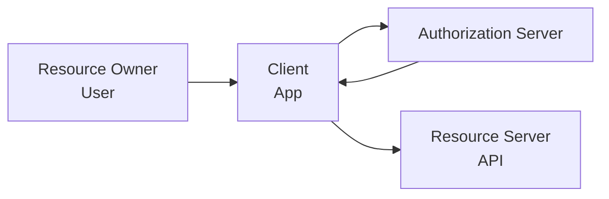

## OAuth 2.0 Overview

OAuth 2.0 is an **authorization** framework defined in RFC 6749. It allows a third-party application
to obtain limited access to a user's resources on a resource server without sharing the user's
credentials. OAuth 2.0 is not an authentication protocol -- it delegates authorization.

### Roles

| Role                 | Description                                                              |
| -------------------- | ------------------------------------------------------------------------ |
| Resource Owner       | The user who owns the data (e.g., a Google account holder)               |
| Client               | The application requesting access (e.g., a mobile app)                   |
| Authorization Server | Issues access tokens after authenticating the user and obtaining consent |
| Resource Server      | The API that holds the protected resources (e.g., Google API)            |



## Grant Types

### Authorization Code Grant (with PKCE)

The most secure grant type. The client redirects the user to the authorization server, the user
authenticates and consents, and the authorization server redirects back with an authorization code.
The client then exchanges the code for tokens via a back-channel request.

```mermaid
sequenceDiagram
    participant U as User
    participant C as Client App
    participant A as Auth Server
    participant R as Resource Server

    U->>C: Click "Login with Google"
    C->>A: Redirect to /authorize?response_type=code&amp;client_id=xxx&amp;redirect_uri=xxx&amp;scope=openid+profile&amp;code_challenge=xxx&amp;code_challenge_method=S256&amp;state=abc123
    A->>U: Show login/consent page
    U->>A: Authenticate and consent
    A->>C: Redirect to redirect_uri?code=AUTH_CODE&amp;state=abc123
    C->>A: POST /token (code, client_id, code_verifier, redirect_uri)
    A->>C: {access_token, id_token, refresh_token}
    C->>R: GET /api/user (Authorization: Bearer &lt;token&gt;)
    R-->>C: User data
```

### PKCE (Proof Key for Code Exchange)

PKCE (RFC 7636) prevents authorization code interception attacks. It is mandatory for public clients
(native apps, SPAs) and recommended for all clients.

```javascript
// Generate PKCE verifier and challenge
function generatePKCE() {
  // Step 1: Generate a cryptographically random code_verifier (43-128 chars)
  const array = new Uint8Array(32);
  crypto.getRandomValues(array);
  const codeVerifier = base64URLEncode(array);

  // Step 2: Derive code_challenge from code_verifier
  // SHA-256 hash, then base64url encode
  const encoder = new TextEncoder();
  const data = encoder.encode(codeVerifier);
  crypto.subtle.digest('SHA-256', data).then((hash) => {
    const codeChallenge = base64URLEncode(new Uint8Array(hash));
  });

  return { codeVerifier, codeChallenge };
}

function base64URLEncode(buffer) {
  return btoa(String.fromCharCode(...buffer))
    .replace(/\+/g, '-')
    .replace(/\//g, '_')
    .replace(/=+$/, '');
}

// Step 3: Send code_challenge in authorization request
// Step 4: Send code_verifier in token request (server verifies challenge)
```

| Step                 | What Happens                                           |
| -------------------- | ------------------------------------------------------ |
| 1. Generate verifier | Client creates random `code_verifier`                  |
| 2. Derive challenge  | Client hashes verifier with SHA-256 → `code_challenge` |
| 3. Authorization     | Client sends `code_challenge` to auth server           |
| 4. Token exchange    | Client sends `code_verifier` to auth server            |
| 5. Verification      | Server verifies `SHA256(verifier) == challenge`        |

### Authorization Code Flow Step-by-Step

```text
1. Authorization Request (browser redirect):
   GET /authorize?
     response_type=code
     &amp;client_id=my_app_id
     &amp;redirect_uri=https://myapp.com/callback
     &amp;scope=openid profile email
     &amp;state=abc123
     &amp;code_challenge=E9Melhoa2OwvFrEMTJguCHaoeK1t8URWbuGJSstw-cM
     &amp;code_challenge_method=S256

2. User authenticates and consents

3. Authorization Response (redirect):
   https://myapp.com/callback?
     code=SplxlOBeZQQYbYS6WxSbIA
     &amp;state=abc123

4. Token Request (server-to-server, POST):
   POST /token
   Content-Type: application/x-www-form-urlencoded

   grant_type=authorization_code
   &amp;code=SplxlOBeZQQYbYS6WxSbIA
   &amp;client_id=my_app_id
   &amp;client_secret=my_app_secret
   &amp;redirect_uri=https://myapp.com/callback
   &amp;code_verifier=dBjftJeZ4CVP-mB92K27uhbUJU1p1r_wW1gFWFOEjXk

5. Token Response:
   {
     "access_token": "eyJhbGci...",
     "token_type": "Bearer",
     "expires_in": 3600,
     "refresh_token": "tGzv3JOkF0XG5Qx2TlKWIA",
     "id_token": "eyJhbGci..."
   }
```

### Client Credentials Grant

Machine-to-machine authentication. No user involved:

```bash
curl -X POST https://auth.example.com/token \
  -H "Content-Type: application/x-www-form-urlencoded" \
  -d "grant_type=client_credentials" \
  -d "client_id=service_account" \
  -d "client_secret=service_secret" \
  -d "scope=read:users write:users"
```

### Device Code Grant

For devices with limited input capability (CLI tools, IoT devices, smart TVs):

```text
1. POST /device/authorize
   Response:
   {
     "device_code": "GmRhmhXhwThko6mVU...",
     "user_code": "WDJB-MJHT",
     "verification_uri": "https://example.com/device",
     "expires_in": 1800,
     "interval": 5
   }

2. User visits verification_uri and enters user_code

3. Client polls POST /token with device_code until user completes authorization
```

### Deprecated Grants

| Grant                   | Why Deprecated                 | Replacement               |
| ----------------------- | ------------------------------ | ------------------------- |
| Implicit                | Token exposed in URL fragment  | Authorization Code + PKCE |
| Resource Owner Password | Credentials shared with client | Authorization Code + PKCE |

## Access Tokens

### JWT vs Opaque Tokens

| Format | Self-Contained | Revocation               | Performance                        | Use Case                          |
| ------ | -------------- | ------------------------ | ---------------------------------- | --------------------------------- |
| JWT    | Yes            | Difficult (short TTL)    | Fast (no introspection needed)     | Stateless APIs, microservices     |
| Opaque | No             | Easy (delete from store) | Requires introspection per request | APIs with strict revocation needs |

### JWT Structure

```text
eyJhbGciOiJSUzI1NiIsInR5cCI6IkpXVCJ9.   # Header (base64url)
eyJzdWIiOiIxMjM0NTY3ODkwIiwibmFtZSI6IkpvaG4gRG9lIiwiaWF0IjoxNTE2MjM5MDIyfQ.   # Payload (base64url)
SflKxwRJSMeKKF2QT4fwpMeJf36POk6yJV_adQssw5c   # Signature
```

### Common JWT Claims

| Claim   | Meaning                       | Example                    |
| ------- | ----------------------------- | -------------------------- |
| `iss`   | Issuer                        | `https://auth.example.com` |
| `sub`   | Subject (user ID)             | `user-12345`               |
| `aud`   | Audience (intended recipient) | `https://api.example.com`  |
| `exp`   | Expiration time               | `1700000000`               |
| `iat`   | Issued at                     | `1700000000`               |
| `jti`   | JWT ID (unique identifier)    | `abc123def456`             |
| `scope` | Granted scopes/permissions    | `read:users write:orders`  |

### Token Validation Checklist

```python
def validate_jwt(token, expected_issuer, expected_audience, jwks_uri):
    # 1. Verify signature using JWKS from the authorization server
    jwks = fetch_jwks(jwks_uri)
    public_key = jwks.get_key(token.header['kid'])
    verify_signature(token, public_key)

    # 2. Verify issuer
    assert token.payload['iss'] == expected_issuer

    # 3. Verify audience
    assert token.payload['aud'] in [expected_audience]

    # 4. Verify expiration
    assert token.payload['exp'] > time.time()

    # 5. Verify not-before (if present)
    if 'nbf' in token.payload:
        assert token.payload['nbf'] <= time.time()

    # 6. Verify issuer-signed claims (e.g., email_verified)
    return token.payload
```

## Refresh Tokens

### Token Rotation

Refresh token rotation (RFC 6749 Section 6) issues a new refresh token every time the old one is
used. The old token is immediately invalidated:

```text
1. POST /token with refresh_token=ABC
   Response: { access_token: "new_access", refresh_token: "XYZ" }

2. ABC is now invalid. Use XYZ for the next refresh.
3. If ABC is used again, ALL tokens for this user are revoked (theft detected).
```

### Revocation (RFC 7009)

```bash
# Revoke a specific token
curl -X POST https://auth.example.com/revoke \
  -H "Authorization: Basic base64(client_id:client_secret)" \
  -d "token=eyJhbGci..."

# Revoke a refresh token
curl -X POST https://auth.example.com/revoke \
  -H "Authorization: Basic base64(client_id:client_secret)" \
  -d "token=refresh_token_value&amp;token_type_hint=refresh_token"
```

### Token Introspection (RFC 7662)

```bash
# Check if a token is active and get its metadata
curl -X POST https://auth.example.com/introspect \
  -H "Authorization: Basic base64(client_id:client_secret)" \
  -d "token=eyJhbGci..."

# Response:
# {
#   "active": true,
#   "sub": "user-12345",
#   "scope": "read:users write:orders",
#   "exp": 1700000000,
#   "iat": 1699996400,
#   "client_id": "my_app_id"
# }
```

## OpenID Connect (OIDC)

OIDC is an identity layer on top of OAuth 2.0, defined by OpenID Connect Core 1.0. It provides
authentication (verifying who the user is) in addition to authorization.

### OIDC Endpoints

| Endpoint                            | Purpose                                             |
| ----------------------------------- | --------------------------------------------------- |
| `/authorize`                        | Authentication request (same as OAuth 2.0)          |
| `/token`                            | Token exchange (same as OAuth 2.0)                  |
| `/userinfo`                         | Get user profile information                        |
| `/jwks`                             | JSON Web Key Set (public keys for JWT verification) |
| `/.well-known/openid-configuration` | OIDC discovery document                             |

### id_token

The `id_token` is a JWT that contains identity claims about the authenticated user:

```json
{
  "iss": "https://auth.example.com",
  "sub": "user-12345",
  "aud": "my_app_id",
  "exp": 1700000000,
  "iat": 1699996400,
  "email": "alice@example.com",
  "email_verified": true,
  "name": "Alice Smith",
  "picture": "https://example.com/alice.jpg"
}
```

### OIDC Scopes and Claims

| Scope     | Claims Returned                                |
| --------- | ---------------------------------------------- |
| `openid`  | `sub` (required for all OIDC flows)            |
| `profile` | `name`, `family_name`, `given_name`, `picture` |
| `email`   | `email`, `email_verified`                      |
| `address` | `address` (formatted address object)           |
| `phone`   | `phone_number`, `phone_number_verified`        |

### OIDC Flows

**Authorization Code Flow:** Most secure, for web apps and native apps.

**Hybrid Flow:** Returns tokens from the authorization endpoint and the token endpoint. Rarely used;
complex and provides minimal benefit over pure authorization code flow.

**Implicit Flow (deprecated):** Returned tokens directly in the URL fragment. Vulnerable to token
interception via URL history, referrer headers, and browser extensions.

## Token Security

### Storage

| Location          | Vulnerable to XSS? | Vulnerable to CSRF?         | Recommendation                    |
| ----------------- | ------------------ | --------------------------- | --------------------------------- |
| `localStorage`    | Yes                | No                          | Never use for sensitive tokens    |
| `sessionStorage`  | Yes                | No                          | Never use for sensitive tokens    |
| `httpOnly` cookie | No                 | Yes (mitigated by SameSite) | Recommended for web apps          |
| In-memory (SPA)   | No (until refresh) | N/A                         | Good for SPAs with silent refresh |

```javascript
// Recommended: httpOnly cookie for tokens (set by server)
// Set-Cookie: access_token=xxx; HttpOnly; Secure; SameSite=Strict; Path=/; Max-Age=3600

// SPA: store access token in memory, refresh token in httpOnly cookie
let accessToken = null;

// On page load, use refresh token to get a new access token
async function initializeAuth() {
  const response = await fetch('/api/auth/refresh', {
    method: 'POST',
    credentials: 'include', // sends httpOnly cookie
  });
  const data = await response.json();
  accessToken = data.access_token;
}

// Access token is lost on page refresh (acceptable: silent refresh restores it)
```

### Token Binding

DPoP (Demonstrating Proof-of-Possession) binds a token to a specific client:

```javascript
// Create a DPoP proof for each request
async function createDPoPProof(url, method) {
  const jwk = await crypto.subtle.generateKey({ name: 'ECDSA', namedCurve: 'P-256' }, true, [
    'sign',
  ]);

  const header = { typ: 'dpop+jwt', jwk: exportJWK(jwk) };
  const payload = {
    jti: crypto.randomUUID(),
    htu: url,
    htm: method,
    iat: Math.floor(Date.now() / 1000),
  };

  const signed = await signJWT(header, payload, jwk);
  return signed;
}

// Include DPoP header in every request
fetch('/api/resource', {
  headers: {
    Authorization: 'Bearer xxx',
    DPoP: dpopProof,
  },
});
```

### Audience and Issuer Validation

```python
# ALWAYS validate aud and iss on every token
def validate_token(token):
    claims = decode_jwt(token)

    # Validate issuer
    if claims['iss'] != 'https://auth.example.com':
        raise InvalidTokenError(f"Wrong issuer: {claims['iss']}")

    # Validate audience (token must be intended for your service)
    if 'my-api-id' not in claims.get('aud', []):
        raise InvalidTokenError(f"Wrong audience: {claims.get('aud')}")

    return claims
```

## Common OAuth Vulnerabilities

### Redirect URI Manipulation

```javascript
// VULNERABLE: Accept any redirect URI
app.get('/callback', (req, res) => {
  const redirectUri = req.query.redirect_uri;
  // If attacker provides redirect_uri=https://evil.com, the auth code goes to evil.com
});

// SAFE: Whitelist redirect URIs
const ALLOWED_REDIRECTS = ['https://myapp.com/callback', 'https://admin.myapp.com/callback'];

app.get('/callback', (req, res) => {
  const redirectUri = req.query.redirect_uri;
  if (!ALLOWED_REDIRECTS.includes(redirectUri)) {
    return res.status(400).send('Invalid redirect URI');
  }
});
```

### Token Leakage via URL

Authorization codes in the URL can leak via:

- Browser history
- Referrer headers (if the page links to an external site)
- Server access logs
- Browser extensions

The authorization code flow mitigates this because the code is exchanged server-side and is
single-use. But if the code is intercepted, PKCE prevents the attacker from exchanging it.

### CSRF via State Parameter

The `state` parameter prevents CSRF attacks on the OAuth flow:

```javascript
// Step 1: Generate state before redirecting to auth server
const state = crypto.randomUUID();
session.oauthState = state; // Store in server-side session

// Step 2: Include state in authorization request
const authUrl = `https://auth.example.com/authorize?state=${state}&amp;...`;

// Step 3: On callback, verify state matches
app.get('/callback', (req, res) => {
  if (req.query.state !== session.oauthState) {
    return res.status(400).send('CSRF detected: state mismatch');
  }
  session.oauthState = null; // Consume the state
  // Proceed with token exchange
});
```

### PKCE Bypass

PKCE can be bypassed if:

1. The `code_challenge_method` is set to `plain` (verifier sent in cleartext)
2. The authorization server does not validate the `code_challenge` against the `code_verifier`

Always use `S256` (SHA-256) as the challenge method.

## OAuth 2.1 Changes

OAuth 2.1 (draft) consolidates best practices from OAuth 2.0 security BCPs:

| Change                        | Impact                                         |
| ----------------------------- | ---------------------------------------------- |
| Implicit grant removed        | All clients must use authorization code + PKCE |
| Password grant removed        | No more credential sharing with clients        |
| PKCE required for all clients | Even confidential clients must use PKCE        |
| Redirect URI must use HTTPS   | HTTP redirect URIs no longer allowed           |
| Exact redirect URI matching   | No partial/path-based matching                 |
| Sender-constrained tokens     | DPoP or mTLS for proof-of-possession           |

## Common Pitfalls

### Using Access Tokens as Identity

Access tokens are for authorization, not authentication. The `sub` claim may be absent. Use the
`id_token` (OIDC) for identity information. Never use an access token to make authentication
decisions.

### Not Validating Tokens on Every Request

Token validation must happen on every API request. Caching validation results is acceptable if you
check the `exp` claim first. Never trust a token without verifying its signature, issuer, audience,
and expiration.

### Storing Refresh Tokens Without Rotation

Without refresh token rotation, a stolen refresh token can be used indefinitely. Implement rotation:
issue a new refresh token on every refresh, and revoke all tokens for the user if a rotated token is
reused.

### Missing Scope Enforcement

Access tokens contain `scope` claims. The resource server must check that the token has the required
scope for the requested operation:

```python
def require_scope(required_scope):
    def decorator(f):
        def wrapper(*args, **kwargs):
            token = get_bearer_token()
            claims = validate_token(token)
            if required_scope not in claims.get('scope', '').split():
                raise ForbiddenError("Insufficient scope")
            return f(*args, **kwargs)
        return wrapper
    return decorator

@app.route('/api/admin/users')
@require_scope('admin:users')
def list_users():
    ...
```

### Accepting Tokens from Untrusted Issuers

Always validate the `iss` claim against a known list of trusted issuers. If your API accepts tokens
from `https://auth.example.com` but also accepts tokens from any issuer, an attacker can create
their own authorization server and issue tokens with arbitrary claims.
