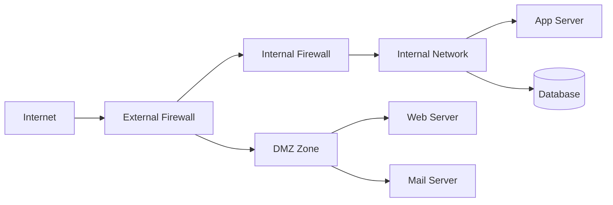
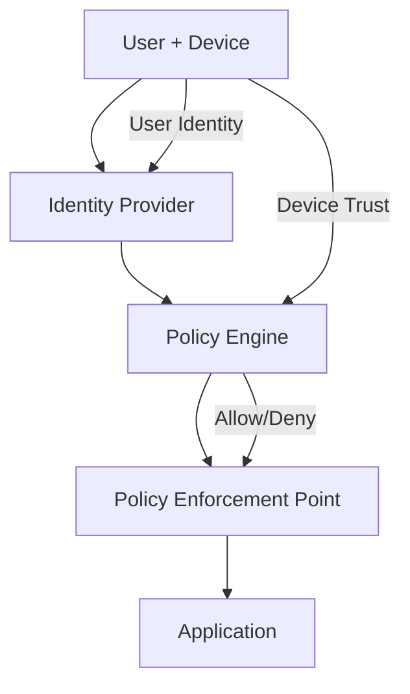

## Firewalls

A firewall is a network security device or software that monitors and filters incoming and outgoing
network traffic based on an organization's security policies.

### Firewall Types

| Type                   | OSI Layer    | Inspection Depth                       | Example                              |
| ---------------------- | ------------ | -------------------------------------- | ------------------------------------ |
| Packet filtering       | L3 (Network) | Source/destination IP, port, protocol  | iptables, nftables, PF               |
| Stateful inspection    | L3-L4        | Connection state tracking              | iptables with conntrack, PF          |
| Application-layer      | L7           | Application protocol content           | ModSecurity, AWS WAF                 |
| Next-generation (NGFW) | L3-L7        | All of the above + IPS, TLS inspection | Palo Alto, Fortinet, pfSense         |
| Web Application (WAF)  | L7           | HTTP/HTTPS request/response            | Cloudflare WAF, AWS WAF, ModSecurity |

### Stateful Inspection

Stateful firewalls maintain a connection table that tracks the state of each connection. They
understand the difference between a new connection, an established connection, and a related
connection.

```bash
# nftables example: stateful firewall rules
nft add table inet filter
nft 'add chain inet filter input { type filter hook input priority 0; policy drop; }'
nft 'add chain inet filter output { type filter hook output priority 0; policy accept; }'
nft 'add chain inet filter forward { type filter hook forward priority 0; policy drop; }'

# Allow established/related connections
nft add rule inet filter input ct state established,related accept

# Allow loopback
nft add rule inet filter input iif lo accept

# Allow SSH (rate limited)
nft add rule inet filter input tcp dport 22 ct state new limit rate 10/minute accept

# Allow HTTPS
nft add rule inet filter input tcp dport 443 ct state new accept

# Log and drop everything else
nft add rule inet filter input log prefix "nft-drop: " drop
```

### Web Application Firewall (WAF)

A WAF operates at layer 7 and inspects HTTP/HTTPS traffic for malicious payloads. It is the last
line of defense against web application attacks (after secure coding practices and input
validation).

**WAF rules target specific attack patterns:**

| Attack Type      | WAF Detection Pattern                         |
| ---------------- | --------------------------------------------- |
| SQL injection    | `' OR`, `UNION SELECT`, `--`, `; DROP`        |
| XSS              | `<script`, `onerror=`, `javascript:`          |
| Path traversal   | `../`, `%2e%2e%2f`, `..%2f`                   |
| Remote code exec | `eval(`, `exec(`, `system(`, `cmd=`           |
| SSRF             | `169.254.169.254`, `metadata.google.internal` |

**WAF limitations:**

- WAFs are signature-based and cannot detect novel attacks
- False positives can block legitimate traffic
- WAFs do not fix underlying vulnerabilities — they mask them
- Encrypted traffic (HTTPS) requires TLS termination before WAF inspection
- Attackers can encode payloads to bypass pattern matching

### Default Deny

The most important firewall principle: **default deny**. All traffic is denied unless explicitly
allowed. The alternative (default allow) requires you to enumerate every possible attack, which is
impossible.

```bash
# Default deny (correct)
iptables -P INPUT DROP
iptables -P FORWARD DROP
iptables -P OUTPUT ACCEPT  # Typically allow outbound

# Then add specific allow rules
iptables -A INPUT -m conntrack --ctstate ESTABLISHED,RELATED -j ACCEPT
iptables -A INPUT -p tcp --dport 443 -j ACCEPT
```

## Network Segmentation

Network segmentation divides a network into smaller zones with different security policies. Each
zone represents a trust boundary.

### Segmentation Models

#### VLAN-based Segmentation

VLANs (Virtual Local Area Networks) operate at layer 2 and segment a physical network into logical
broadcast domains. Traffic between VLANs must pass through a router or layer 3 switch, where
firewall rules can be applied.

```
VLAN 10: Management (switches, hypervisors, IPMI)
VLAN 20: Production (application servers)
VLAN 30: Database (database servers, no internet access)
VLAN 40: Development (dev/test environments)
VLAN 50: Guest/IoT (isolated, internet-only)
```

```bash
# Linux bridge VLAN configuration
ip link add name br0 type bridge
ip link set dev br0 up
ip link set dev eth0 master br0
bridge vlan add dev eth0 vid 10
bridge vlan add dev br0 vid 10 pvid untagged
```

#### DMZ Architecture

A DMZ (Demilitarized Zone) is a network segment that sits between the internal network and the
internet, hosting publicly accessible services.



**DMZ firewall rules:**

| Direction            | Rule                             |
| -------------------- | -------------------------------- |
| Internet to DMZ      | Allow specific ports (80, 443)   |
| DMZ to Internet      | Allow established connections    |
| DMZ to Internal      | Allow specific ports to app tier |
| Internal to DMZ      | Allow established connections    |
| Internal to Internet | Allow outbound (proxy/NAT)       |
| Internet to Internal | Deny all                         |

#### Microsegmentation

Microsegmentation applies security policies at the workload level (container, VM, process) rather
than the network level. It is the network-level implementation of zero trust.

| Technology               | Environment    | Mechanism                     |
| ------------------------ | -------------- | ----------------------------- |
| Kubernetes NetworkPolicy | Kubernetes     | Pod-to-pod rules              |
| Istio/Envoy              | Service mesh   | mTLS + authorization policies |
| Calico                   | Kubernetes     | eBPF-based network policy     |
| VMware NSX               | Virtualization | VM-level microsegmentation    |
| AWS Security Groups      | Cloud          | ENI-level rules               |

```yaml
# Kubernetes NetworkPolicy: deny all ingress to database, allow only from app pod
apiVersion: networking.k8s.io/v1
kind: NetworkPolicy
metadata:
  name: database-policy
  namespace: production
spec:
  podSelector:
    matchLabels:
      app: database
  policyTypes:
    - Ingress
  ingress:
    - from:
        - podSelector:
            matchLabels:
              app: api-server
      ports:
        - port: 5432
          protocol: TCP
```

## Virtual Private Networks (VPN)

A VPN creates an encrypted tunnel over a public network, allowing secure communication between
remote hosts and a private network.

### VPN Protocols

| Protocol  | Encryption        | Speed     | Audit Status            | Key Feature                         |
| --------- | ----------------- | --------- | ----------------------- | ----------------------------------- |
| WireGuard | ChaCha20-Poly1305 | Very fast | Small, audited codebase | Modern, minimal, kernel-integrated  |
| IPsec     | AES-GCM, IKEv2    | Fast      | Mature, complex         | Suite of protocols, OS-native       |
| OpenVPN   | AES-256-GCM       | Moderate  | Mature, audited         | Flexible, TLS-based                 |
| SSTP      | TLS 1.2+          | Moderate  | Microsoft               | Windows-native, traverses firewalls |

### WireGuard

WireGuard is the recommended VPN protocol for new deployments. It is simple (4,000 lines of kernel
code vs OpenVPN's 100,000+), fast (in-kernel, modern crypto), and secure (formally verified subset,
small attack surface).

```ini
# /etc/wireguard/wg0.conf (server)
[Interface]
PrivateKey = <server-private-key>
Address = 10.0.0.1/24
ListenPort = 51820
PostUp = iptables -A FORWARD -i %i -j ACCEPT; iptables -A FORWARD -o %i -j ACCEPT; iptables -t nat -A POSTROUTING -o eth0 -j MASQUERADE
PostDown = iptables -D FORWARD -i %i -j ACCEPT; iptables -D FORWARD -o %i -j ACCEPT; iptables -t nat -D POSTROUTING -o eth0 -j MASQUERADE

[Peer]
PublicKey = <client-public-key>
AllowedIPs = 10.0.0.2/32
```

```ini
# /etc/wireguard/wg0.conf (client)
[Interface]
PrivateKey = <client-private-key>
Address = 10.0.0.2/24
DNS = 1.1.1.1, 1.0.0.1

[Peer]
PublicKey = <server-public-key>
Endpoint = vpn.example.com:51820
AllowedIPs = 10.0.0.0/24, 192.168.1.0/24
PersistentKeepalive = 25
```

### IPsec

IPsec operates at the network layer (L3) and provides site-to-site and remote access VPN. It
consists of two protocols:

- **IKE (Internet Key Exchange)**: Manages key negotiation (IKEv2 is current)
- **ESP (Encapsulating Security Payload)**: Provides encryption and authentication

```bash
# StrongSwan IPsec configuration (site-to-site)
# /etc/ipsec.conf
config setup
    charondebug="ike 2, knl 2, cfg 2"

conn site-to-site
    left=10.1.0.1
    leftsubnet=10.1.0.0/24
    leftid=@site-a.example.com
    leftcert=site-a.pem
    right=203.0.113.1
    rightsubnet=10.2.0.0/24
    rightid=@site-b.example.com
    rightcert=site-b.pem
    ike=aes256gcm16-sha384-ecp384!
    esp=aes256gcm16-ecp384!
    keyexchange=ikev2
    auto=start
```

## Intrusion Detection and Prevention (IDS/IPS)

### IDS vs IPS

| Aspect     | IDS (Detection)               | IPS (Prevention)                       |
| ---------- | ----------------------------- | -------------------------------------- |
| Action     | Alerts on suspicious activity | Actively blocks suspicious traffic     |
| Deployment | Span port, tap (passive)      | Inline (active)                        |
| Risk       | Low (no traffic impact)       | Higher (false positives block traffic) |
| Visibility | Full traffic visibility       | May miss encrypted traffic             |

### Detection Methods

| Method          | How It Works                                    | Strengths                | Weaknesses                  |
| --------------- | ----------------------------------------------- | ------------------------ | --------------------------- |
| Signature-based | Matches known attack patterns                   | Low false positive rate  | Cannot detect novel attacks |
| Anomaly-based   | Establishes baseline, flags deviations          | Detects unknown attacks  | High false positive rate    |
| Heuristic-based | Analyzes protocol behavior and traffic patterns | Good at protocol attacks | Requires tuning             |
| Behavior-based  | Monitors system/process behavior                | Detects lateral movement | Complex to configure        |

### Snort / Suricata

Snort and Suricata are open-source IDS/IPS engines that use rule-based detection.

```bash
# Suricata rule examples
# Detect SQL injection attempt
alert http $EXTERNAL_NET any -> $HOME_NET 80 (msg:"ET WEB SQL Injection"; flow:established,to_server; content:"UNION"; nocase; http_uri; content:"SELECT"; nocase; http_uri; distance:0; reference:url,owasp.org/www-community/attacks/SQL_Injection; classtype:web-application-attack; sid:1000001; rev:1;)

# Detect port scan
alert tcp $EXTERNAL_NET any -> $HOME_NET any (msg:"PORTSCAN Detected"; flags:S; threshold:type both, track by_src, count 30, seconds 60; classtype:attempted-recon; sid:1000002; rev:1;)

# Detect known malicious IP
drop ip [192.0.2.1, 198.51.100.0/24] any -> $HOME_NET any (msg:"Known Malicious IP"; sid:1000003; rev:1;)
```

### Zeek (Bro)

Zeek is a network analysis framework that provides protocol-level analysis rather than signature
matching. It logs all network activity and generates detailed connection, DNS, HTTP, SSL, and file
transfer logs.

```zeek
# Zeek script to detect SSH brute force
@load base/protocols/ssh
@load base/frameworks/notice

event ssh_auth_failed(c: connection, auth: bool, msg: string) {
    if ( !auth ) {
        NOTICE([$note=SSH::Brute_Force_Attacker,
                $msg=fmt("SSH brute force from %s", c$id$orig_h),
                $conn=c,
                $identifier=c$id$orig_h]);
    }
}
```

## Zero Trust Networking

Zero trust networking eliminates implicit trust based on network location. Every request must be
authenticated, authorized, and encrypted regardless of where it originates.

### BeyondCorp Model

Google's BeyondCorp (published in 2014) is the foundational model for zero trust networking. Its
principles:

1. **Authenticate, not authorize**: Every device and user must authenticate before accessing any
   resource
2. **Access based on device and user state**: Not just credentials, but device posture, location,
   and behavior
3. **No special network access**: VPNs are replaced by per-application access
4. **Dynamic access control**: Policies are evaluated per-request, not per-connection

### Implementation Architecture



**Components:**

| Component                | Purpose                                   | Implementation                   |
| ------------------------ | ----------------------------------------- | -------------------------------- |
| Identity Provider        | Centralized authentication + device trust | Okta, Azure AD, Keycloak         |
| Policy Engine            | Evaluate access requests against policies | OPA, Cedar, custom               |
| Policy Enforcement Point | Enforce decisions at the resource         | Envoy, service mesh, API gateway |
| Access Proxy             | Per-application secure access             | BeyondCorp Enterprise, Tailscale |
| Device Trust             | Evaluate device health and compliance     | MDM, certificates, posture       |

### Tailscale as Zero Trust

Tailscale is a WireGuard-based mesh VPN that implements zero trust principles:

- **Identity-based**: Access is based on identity (SSO), not IP addresses
- **No open ports**: Services are not exposed to the internet; access requires authentication
- **ACL-based**: Fine-grained access control per resource
- **Key management**: WireGuard keys are distributed via a control plane, not manually

```jsonc
// tailscale ACL (tailnet policy file)
{
  "acls": [
    // Allow all users to access their own devices
    { "action": "accept", "src": ["autogroup:member"], "dst": ["autogroup:self:*"] },
    // Allow dev team to access staging servers on port 443
    { "action": "accept", "src": ["group:dev"], "dst": ["tag:staging:443"] },
    // Allow on-call engineers to access production database
    { "action": "accept", "src": ["group:oncall"], "dst": ["tag:prod-db:5432"] },
    // Deny everything else
    { "action": "deny", "src": ["*"], "dst": ["*:*"] },
  ],
  "tags": ["tag:staging", "tag:prod-db"],
}
```

## DNS Security

### DNSSEC

DNSSEC (Domain Name System Security Extensions) adds cryptographic signatures to DNS records,
enabling DNS response authentication. It prevents DNS cache poisoning and spoofing.

| Record Type | Purpose                                                 |
| ----------- | ------------------------------------------------------- |
| DNSKEY      | Public key for the zone                                 |
| RRSIG       | Signature over a record set (RRset)                     |
| DS          | Delegation signer — links child zone to parent          |
| NSEC/NSEC3  | Proves non-existence of a record (authenticated denial) |

**Chain of trust:**

```
Root Zone (trust anchor)
  └── .com zone (signed by root)
       └── example.com zone (signed by .com)
            └── www.example.com A record (signed by example.com)
```

### DNS over HTTPS (DoH) and DNS over TLS (DoT)

| Protocol | Port | Encryption | Standard |
| -------- | ---- | ---------- | -------- |
| DoH      | 443  | HTTPS      | RFC 8484 |
| DoT      | 853  | TLS        | RFC 7858 |

Both encrypt DNS queries between the client and the resolver, preventing eavesdropping and
manipulation of DNS responses in transit. They do not encrypt queries between the resolver and the
authoritative name server.

:::warning

DoH/DoT protect against network-level DNS interception but do not prevent the resolver itself from
logging, filtering, or manipulating queries. Choose a resolver you trust (e.g., your own), and
understand the privacy policy of any third-party resolver.

:::

## Email Security

### SPF, DKIM, and DMARC

These three standards work together to prevent email spoofing and phishing.

| Standard | Full Name                    | Purpose                                              |
| -------- | ---------------------------- | ---------------------------------------------------- |
| SPF      | Sender Policy Framework      | Authorizes which mail servers can send from a domain |
| DKIM     | DomainKeys Identified Mail   | Cryptographically signs outgoing email               |
| DMARC    | Domain-based Message Auth... | Policy for handling unauthenticated email            |

**SPF record:**

```dns
example.com. IN TXT "v=spf1 ip4:203.0.113.0/24 include:_spf.google.com -all"
```

**DKIM record:**

```
selector._domainkey.example.com. IN TXT (
  "v=DKIM1; k=rsa; p=MIGfMA0GCSqGSIb3DQEBAQUAA4GNADCBiQ..."
)
```

**DMARC record:**

```dns
_dmarc.example.com. IN TXT "v=DMARC1; p=reject; rua=mailto:dmarc@example.com; pct=100"
```

| DMARC Policy | Action                            |
| ------------ | --------------------------------- |
| `none`       | Monitor only, deliver all mail    |
| `quarantine` | Send unauthenticated mail to spam |
| `reject`     | Reject unauthenticated mail       |

### Email Encryption

| Protocol       | Purpose                            | Standard |
| -------------- | ---------------------------------- | -------- |
| TLS (STARTTLS) | Encrypt in transit between servers | RFC 3207 |
| S/MIME         | End-to-end encryption + signing    | RFC 5751 |
| PGP/GPG        | End-to-end encryption + signing    | RFC 4880 |

## Network Monitoring and SIEM

### Security Information and Event Management (SIEM)

A SIEM system collects, aggregates, and correlates security events from across the infrastructure to
detect threats, investigate incidents, and demonstrate compliance.

| SIEM Component | Function                                                     |
| -------------- | ------------------------------------------------------------ |
| Collection     | Ingest logs from servers, firewalls, applications, endpoints |
| Normalization  | Parse logs into a common format                              |
| Correlation    | Identify related events across sources                       |
| Detection      | Apply rules and ML models to identify threats                |
| Alerting       | Notify security team of detected threats                     |
| Investigation  | Provide search, visualization, and timeline tools            |
| Reporting      | Generate compliance and operational reports                  |

### SIEM Tools

| Tool                   | Deployment         | Best For                            |
| ---------------------- | ------------------ | ----------------------------------- |
| Splunk                 | Self-hosted, cloud | Large enterprises, custom use cases |
| Elastic Security (ELK) | Self-hosted, cloud | Open source, log analytics          |
| Microsoft Sentinel     | Cloud              | Microsoft/Azure environments        |
| Datadog Security       | Cloud              | Datadog users, cloud-native         |
| Wazuh                  | Self-hosted        | Open source, compliance-focused     |
| Graylog                | Self-hosted        | Open source, simpler setup          |

### Log Sources

Every security-relevant system should feed into the SIEM:

| Source                 | Events                                            |
| ---------------------- | ------------------------------------------------- |
| Firewalls              | Allowed/denied connections, NAT translations      |
| DNS servers            | Queries, responses, NXDOMAIN records              |
| Web servers            | Access logs, error logs, WAF logs                 |
| Authentication systems | Login success/failure, MFA events, token issuance |
| Endpoint detection     | Process creation, file modification, registry     |
| Cloud audit logs       | AWS CloudTrail, Azure Activity Log, GCP Audit     |
| Network IDS/IPS        | Alerts, blocked connections                       |
| Email gateway          | SMTP logs, spam/phishing detections               |

### Key Metrics

- **MTTD (Mean Time to Detect)**: Average time from attack start to detection
- **MTTR (Mean Time to Respond)**: Average time from detection to containment
- **MTTI (Mean Time to Investigate)**: Average time to determine scope and impact

## Port Security

### Default Port Exposure

Every open port is an attack surface. Regularly audit which ports are exposed and to whom.

```bash
# Scan your own infrastructure (authorized scanning only)
nmap -sT -p- -T4 target.example.com

# Check for unexpected open ports
nmap -sU -p 53,123,161,500 target.example.com

# Service version detection
nmap -sV -p 22,80,443 target.example.com
```

### Port Hardening Checklist

- Close all ports not required for the service's function
- Change default ports only as obscurity (not a security control)
- Use SSH keys instead of password authentication on port 22
- Do not expose database ports (3306, 5432, 6379, 27017) to the internet
- Restrict management ports (SSH, IPMI, iDRAC) to specific source IPs
- Use firewalls to enforce port access at the network level

## Certificate Pinning

Certificate pinning associates a service with a specific certificate or public key, preventing
man-in-the-middle attacks even if a CA is compromised.

### Pinning Methods

| Method              | Granularity     | Flexibility | Security |
| ------------------- | --------------- | ----------- | -------- |
| Public key pinning  | Per key         | Low         | High     |
| Certificate pinning | Per certificate | Very low    | High     |
| CA pinning          | Per CA          | Medium      | Medium   |

### HTTP Public Key Pinning (HPKP) — Deprecated

HPKP was deprecated due to the risk of hosts pinning themselves out of existence (losing the pinned
key with no recovery mechanism). If the pin was wrong, the site became permanently inaccessible for
all visitors.

### Modern Alternatives

- **Expect-CT header**: Reports/Enforces CT log inclusion
- **Application-level pinning**: Pin certificates in the application code (mobile apps, API clients)
- **DNS-based Authentication of Named Entities (DANE)**: Publishes certificate information in
  DNSSEC-signed DNS records

```bash
# Check CT log inclusion
openssl s_client -connect example.com:443 -servername example.com 2>/dev/null | \
  openssl x509 -noout -text | grep -A1 "Authority Information Access"

# Query CT logs via crt.sh
curl "https://crt.sh/?q=example.com&output=json"
```

## DDoS Mitigation

### DDoS Attack Types

| Type              | Target            | Method                                   |
| ----------------- | ----------------- | ---------------------------------------- |
| Volumetric        | Bandwidth         | UDP flood, ICMP flood, DNS amplification |
| Protocol          | Server resources  | SYN flood, Ping of Death, Smurf          |
| Application Layer | Application logic | HTTP flood, Slowloris, API abuse         |

### Mitigation Strategies

| Layer        | Strategy                                         | Tool/Service                   |
| ------------ | ------------------------------------------------ | ------------------------------ |
| Network      | Anycast distribution, BGP blackholing, scrubbing | Cloudflare, AWS Shield, Akamai |
| Transport    | SYN cookies, connection rate limiting            | iptables, nginx, HAProxy       |
| Application  | Rate limiting, CAPTCHA, challenge pages          | Cloudflare, reCAPTCHA          |
| Architecture | Auto-scaling, CDN, caching                       | Cloud load balancers, Varnish  |

```bash
# SYN flood protection (sysctl)
sysctl -w net.ipv4.tcp_syncookies=1
sysctl -w net.ipv4.tcp_max_syn_backlog=8192
sysctl -w net.ipv4.tcp_synack_retries=2

# Rate limiting with iptables
iptables -A INPUT -p tcp --dport 80 -m connlimit --connlimit-above 100 -j REJECT
iptables -A INPUT -p tcp --dport 443 -m conntrack --ctstate NEW -m limit --limit 50/sec --limit-burst 200 -j ACCEPT
```

### Amplification Attacks

Amplification attacks exploit services that return large responses to small requests. The attacker
spoofs the victim's IP as the source, and the reflector sends a large response to the victim.

| Protocol  | Amplification Factor |
| --------- | -------------------- |
| DNS       | 28-54x               |
| NTP       | 556x                 |
| Memcached | 51,000x              |
| SSDP      | 30x                  |

Prevention: Disable open resolvers/reflectors, implement BCP 38 (ingress filtering) to block spoofed
source addresses at network edges.

## Common Pitfalls

### Pitfall 1: Flat Networks

A flat network with no segmentation means a compromised workstation has unrestricted access to all
servers, databases, and management interfaces. Segment your network with firewalls between zones,
even in small environments.

### Pitfall 2: Unencrypted Internal Traffic

"Internal traffic is safe" is a dangerous assumption. Lateral movement, insider threats, and
compromised switches all expose internal traffic. Encrypt all traffic with TLS, even within your
data center. Use service mesh mTLS for microservices.

### Pitfall 3: Missing Egress Filtering

Firewalls often focus on ingress rules and ignore egress. Without egress filtering, compromised
servers can exfiltrate data, communicate with C2 servers, and participate in DDoS attacks. Implement
default-deny egress with explicit allow rules.

### Pitfall 4: Ignoring DNS Security

DNS is a foundational protocol that is rarely secured. Without DNSSEC, DNS responses can be spoofed.
Without monitoring, DNS tunneling can exfiltrate data. Implement DNSSEC, use DoH/DoT for client
resolution, and monitor DNS logs for anomalies.

### Pitfall 5: No Network Monitoring

You cannot detect what you cannot see. Without network monitoring (flow data, packet capture, IDS),
attacks can operate undetected for months. Implement SIEM integration for all network devices and
security systems.

### Pitfall 6: VPN as the Only Remote Access Control

A VPN provides network-level access but does not provide application-level authorization. A user
connected to the VPN has access to everything on the VPN network. Replace VPN-centric access with
zero trust per-application access where possible.

### Pitfall 7: Stale Firewall Rules

Firewall rules accumulate over time. Rules created for temporary access, specific projects, or
long-departed employees often remain indefinitely. Audit firewall rules quarterly, document the
business justification for each rule, and remove rules that are no longer needed.

### Pitfall 8: No Egress Monitoring

Monitoring inbound traffic without monitoring outbound traffic misses data exfiltration. An attacker
who has compromised an internal server may use DNS tunneling, HTTPS to cloud storage, or encrypted
ICMP to exfiltrate data. Monitor egress traffic volume, destinations, and protocols.

### Pitfall 9: Ignoring IPv6

IPv6 is enabled by default on modern operating systems. If your firewall rules only cover IPv4, IPv6
traffic may bypass all controls. Either properly secure IPv6 or disable it on interfaces where it is
not needed.

### Pitfall 10: Single Point of Failure in Network Security

A single firewall, IDS, or VPN concentrator is a single point of failure. If it fails (hardware
fault, misconfiguration, DDoS), the entire network is either exposed or inaccessible. Deploy in
high-availability pairs and ensure failover is tested regularly.

## Network Hardening Checklist

### Host-Level Network Hardening

```bash
# Disable IPv6 if not needed
sysctl -w net.ipv6.conf.all.disable_ipv6=1
sysctl -w net.ipv6.conf.default.disable_ipv6=1

# Disable source routing
sysctl -w net.ipv4.conf.all.accept_source_route=0
sysctl -w net.ipv4.conf.default.accept_source_route=0

# Disable ICMP redirects
sysctl -w net.ipv4.conf.all.accept_redirects=0
sysctl -w net.ipv4.conf.default.accept_redirects=0
sysctl -w net.ipv6.conf.all.accept_redirects=0

# Enable reverse path filtering (prevent IP spoofing)
sysctl -w net.ipv4.conf.all.rp_filter=1
sysctl -w net.ipv4.conf.default.rp_filter=1

# Log martian packets (invalid source addresses)
sysctl -w net.ipv4.conf.all.log_martians=1

# Disable unused services
systemctl disable --now telnet.socket
systemctl disable --now rsh.socket
systemctl disable --now vsftpd
```

### SSH Hardening

```bash
# /etc/ssh/sshd_config
PermitRootLogin no
PasswordAuthentication no
PubkeyAuthentication yes
AuthorizedKeysFile .ssh/authorized_keys
PermitEmptyPasswords no
MaxAuthTries 3
LoginGraceTime 30
AllowUsers deploy admin
X11Forwarding no
AllowTcpForwarding no
```

### Network Access Control (802.1X)

802.1X provides port-based network access control. Devices must authenticate before gaining access
to the network.

| Component             | Role                                 |
| --------------------- | ------------------------------------ |
| Supplicant            | The device requesting network access |
| Authenticator         | The switch or wireless access point  |
| Authentication Server | RADIUS server (FreeRADIUS, ISE)      |

```bash
# FreeRADIUS client configuration (on the switch/AP)
# Devices that fail 802.1X are placed in a restricted VLAN with internet-only access
# This prevents unauthorized devices from accessing the internal network
```

## Network Troubleshooting for Security

### Common Security-Related Network Issues

| Symptom                         | Possible Cause                           | Diagnostic Command                     |
| ------------------------------- | ---------------------------------------- | -------------------------------------- |
| Intermittent connection drops   | Firewall rate limiting, IDS alert        | `tcpdump -i eth0 -nn host target`      |
| DNS resolution failures         | DNS hijacking, DNSSEC validation failure | `dig +dnssec example.com @8.8.8.8`     |
| TLS handshake failures          | Certificate expired, cipher mismatch     | `openssl s_client -connect host:443`   |
| Unexpected outbound connections | Malware C2, compromised service          | `ss -tulpn`, `netstat -an`             |
| High latency on specific routes | BGP hijacking, route leaks               | `traceroute`, `mtr`, BGP looking glass |

### Network Forensics

```bash
# Capture full packet capture for analysis
tcpdump -i eth0 -w /evidence/capture.pcap -c 100000

# Filter for specific traffic
tcpdump -r capture.pcap 'host 192.168.1.100 and port 443'

# Extract HTTP payloads from PCAP
tshark -r capture.pcap -Y "http.request" -T fields -e http.host -e http.request.uri

# Analyze with Wireshark (GUI) or tshark (CLI)
tshark -r capture.pcap -q -z conv,tcp
tshark -r capture.pcap -q -z io,phs
```

### DNS Monitoring for Security

DNS is a critical but often overlooked monitoring domain. Anomalous DNS behavior can indicate
malware C2 communication, data exfiltration via DNS tunneling, or phishing domains:

```bash
# Monitor DNS queries for suspicious patterns
# High volume of queries to a single domain (DNS tunneling)
# Queries to newly registered domains (DGA malware)
# Queries to domains with known bad reputation

# Using dnscat2 detection pattern
# Look for high entropy subdomains (indicative of DGA or DNS tunneling)
```

| DNS Anomaly                  | Possible Cause                            | Detection Method               |
| ---------------------------- | ----------------------------------------- | ------------------------------ |
| High volume to single domain | DNS tunneling for data exfiltration       | Query volume per domain        |
| High entropy subdomains      | DGA (Domain Generation Algorithm) malware | Entropy analysis on subdomains |
| NXDOMAIN burst               | DGA malware, recon scanning               | NXDOMAIN response rate         |
| Queries to TLDs not in use   | Malware C2, suspicious resolution         | TLD distribution analysis      |
| Late-night DNS activity      | Compromised host beaconing                | Time-based query analysis      |

:::info

**Reference Standards**: NIST SP 800-41 (Firewall Guidelines), NIST SP 800-207 (Zero Trust
Architecture), RFC 6014 (DNSSEC Operational Practices), RFC 7208 (SPF), RFC 6376 (DKIM), RFC 7489
(DMARC), RFC 8446 (TLS 1.3), RFC 8484 (DNS over HTTPS), IEEE 802.1X (Port-Based Network Access
Control), MITRE ATT&CK (Tactic: Lateral Movement).

:::
