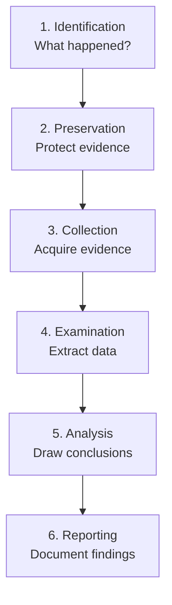

## Forensic Fundamentals

### Chain of Custody

The chain of custody is a documented record of every person who handled evidence, when, where, and
why. A broken chain of custody renders evidence inadmissible in court.

```text
Chain of custody documentation:
1. Evidence identifier (unique ID)
2. Description of the evidence
3. Date and time of collection
4. Who collected it
5. Where it was found
6. How it was collected (method, tools)
7. Storage location
8. Every subsequent transfer, access, and analysis
9. Return or disposition
```

### Integrity Hashes

Every piece of evidence must be hashed immediately upon collection and re-verified at every stage:

```bash
# Generate SHA-256 hashes of evidence files
sha256sum disk_image.raw > disk_image.raw.sha256

# Verify integrity at any point
sha256sum -c disk_image.raw.sha256
# disk_image.raw: OK

# Use multiple algorithms for defense in depth
sha256sum disk_image.raw > disk_image.sha256
md5sum disk_image.raw > disk_image.md5
sha1sum disk_image.raw > disk_image.sha1
```

### Write Blockers

Write blockers prevent the forensic workstation from modifying the evidence during analysis.
Hardware write blockers intercept write commands at the hardware level. Software write blockers
(like Linux `ro` mount) are less reliable because the OS can bypass them.

```bash
# Hardware write blocker: dedicated device between disk and workstation
# Software write blocker (Linux): mount as read-only
mount -o ro,loop,noexec /evidence/disk_image.raw /mnt/evidence

# Verify no writes occurred
dmesg | grep -i "read-only"
```

### Volatility

The order of evidence collection matters because volatile evidence is lost first:

| Priority | Evidence Type        | Volatility | Collection Method                  |
| -------- | -------------------- | ---------- | ---------------------------------- |
| 1        | CPU registers, cache | Seconds    | Live response, hardware debugger   |
| 2        | RAM                  | Seconds    | Live acquisition (LiME, WinPmem)   |
| 3        | Network connections  | Minutes    | `netstat`, `ss`, `tcpdump`         |
| 4        | Running processes    | Minutes    | `ps`, process dumps                |
| 5        | Swap / pagefile      | Minutes    | Disk imaging                       |
| 6        | Disk / filesystem    | Persistent | Write-blocked imaging              |
| 7        | Remote logs          | Hours/Days | Secure copy from log servers       |
| 8        | Physical media       | Persistent | Forensic imaging, chain of custody |

## Disk Forensics

### Disk Imaging

```bash
# Create a forensic image (bit-for-bit copy)
# Use dcfldd (forensic version of dd with hashing)
dcfldd if=/dev/sdb of=/evidence/disk_image.raw hash=sha256 hashwindow=1M \
  hashlog=/evidence/disk_image.hash log=/evidence/imaging.log

# Alternative: FTK Imager (GUI, Windows)
# Alternative: Guymager (GUI, Linux)

# Verify the image
sha256sum /evidence/disk_image.raw

# Create a working copy (never work on the original)
dd if=/evidence/disk_image.raw of=/analysis/working_copy.raw bs=1M
```

### File System Analysis

```bash
# Using The Sleuth Kit (TSK) command-line tools
# List partitions in the disk image
mmls disk_image.raw

# Filesystem timeline
fls -r -m "/" -o 2048 disk_image.raw > filelist.txt
mactime -b filelist.txt > timeline.csv

# Recover deleted files
icat -o 2048 disk_image.raw <inode_number> > recovered_file.txt

# Search for keywords in unallocated space
srch_strings -a disk_image.raw | grep "password"
# Or use bulk_extractor for more comprehensive extraction
bulk_extractor -o /evidence/output/ disk_image.raw
```

### Deleted File Recovery

```bash
# Autopsy (GUI frontend for Sleuth Kit)
# 1. Open the disk image
# 2. Analyze → File System Analysis → File Type
# 3. Sort by "Deleted" flag
# 4. Recover files by right-click → Extract

# Recover specific file types from unallocated space
foremost -t jpg,png,pdf,docx -i disk_image.raw -o /evidence/recovered/
```

### Timeline Analysis

```text
Timeline reconstruction combines:
1. File system metadata (created, modified, accessed times)
2. Application logs (web server, database, auth)
3. System logs (syslog, Event Viewer)
4. Network captures

Tools: Plaso (log2timeline), Timesketch, mactime (TSK)
```

```bash
# Create a timeline with log2timeline
log2timeline.py timeline.plaso disk_image.raw

# Analyze with Timesketch (web-based timeline analysis)
# or psort (command-line)
psort.py -o timeline_timeline.timeline timeline.plaso
```

### Slack Space

Slack space is the unused space between the end of a file's content and the end of the file system
block. Data may be recoverable from slack space:

```bash
# Extract slack space using TSK
slacker -o 2048 disk_image.raw > slack_space.raw

# Search slack space for keywords
strings slack_space.raw | grep -i "password\|secret\|key"
```

## Memory Forensics

### Acquiring Memory

```bash
# Linux: LiME (Linux Memory Extractor)
insmod lime.ko "path=/evidence/memory.raw format=lime"

# Windows: WinPmem
winpmem_mini_x64.exe /evidence/memory.raw

# macOS: OSXPMem
sudo ./osxpmem -o /evidence/memory.raw
```

### Volatility Framework

Volatility is the primary open-source memory forensics framework:

```bash
# Identify the OS profile
vol.py -f memory.raw imageinfo

# List running processes
vol.py -f memory.raw --profile=Win10x64_19041 pslist

# Process tree (parent-child relationships)
vol.py -f memory.raw --profile=Win10x64_19041 pstree

# Network connections
vol.py -f memory.raw --profile=Win10x64_19041 netscan

# Command-line history
vol.py -f memory.raw --profile=Win10x64_19041 cmdscan

# Injected code / DLLs
vol.py -f memory.raw --profile=Win10x64_19041 malfind

# Dump a specific process memory
vol.py -f memory.raw --profile=Win10x64_19041 -p <pid> -D /evidence/processes/ procdump

# Registry hives
vol.py -f memory.raw --profile=Win10x64_19041 hivelist
vol.py -f memory.raw --profile=Win10x64_19041 printkey -K "Software\Microsoft\Windows\CurrentVersion\Run"
```

### Key Memory Analysis Targets

| Target                  | What It Reveals                                              |
| ----------------------- | ------------------------------------------------------------ |
| `pslist` / `psscan`     | Running processes (including hidden/rootkits)                |
| `netscan`               | Active and closed network connections                        |
| `cmdscan` / `consoles`  | Command-line history                                         |
| `malfind`               | Code injection, suspicious memory regions                    |
| `hivelist` / `printkey` | Windows registry (startup programs, recently accessed files) |
| `envars`                | Environment variables (PATH, USER, etc.)                     |
| `filescan`              | Open file handles                                            |
| `dumpfiles`             | Extract files from memory                                    |

## Log Forensics

### Authentication Logs

```bash
# Linux: /var/log/auth.log (Debian/Ubuntu) or /var/log/secure (RHEL/CentOS)
# Successful logins
grep "Accepted" /var/log/auth.log
# Failed logins
grep "Failed password" /var/log/auth.log

# Count failed logins by IP
grep "Failed password" /var/log/auth.log | awk '{print $(NF-3)}' | sort | uniq -c | sort -rn | head -20

# SSH key-based auth
grep "Accepted publickey" /var/log/auth.log

# sudo commands
grep "COMMAND=" /var/log/auth.log
```

### Web Server Logs

```bash
# Apache / Nginx access logs
# Common Log Format:
# 192.168.1.100 - - [15/Jun/2024:10:30:00 +0000] "GET /admin HTTP/1.1" 403 1284

# Suspicious patterns:
# SQL injection attempts
grep -i "union\|select\|insert\|drop\|--" /var/log/nginx/access.log

# Directory traversal
grep -i "\.\./\.\." /var/log/nginx/access.log

# Scanning activity
awk '{print $1}' /var/log/nginx/access.log | sort | uniq -c | sort -rn | head -20

# Status code distribution
awk '{print $9}' /var/log/nginx/access.log | sort | uniq -c | sort -rn

# 404 errors (reconnaissance)
grep " 404 " /var/log/nginx/access.log | awk '{print $7}' | sort | uniq -c | sort -rn | head -20
```

### Database Logs

```bash
# PostgreSQL: query logging
# postgresql.conf:
# log_statement = 'all'  # or 'ddl', 'mod'
# log_connections = on
# log_disconnections = on

# MySQL: general query log
# my.cnf:
# general_log = 1
# general_log_file = /var/log/mysql/general.log

# Analyze: look for unusual patterns
# - DROP, TRUNCATE, DELETE without WHERE
# - SELECT * with large result sets
# - Queries from unexpected hosts
# - Bulk data exports
```

### Syslog

```bash
# Central syslog analysis
# /var/log/syslog (Debian/Ubuntu) or /var/log/messages (RHEL/CentOS)

# Kernel messages
grep "kernel:" /var/log/syslog

# Service start/stop
grep -E "(Started|Stopped|Starting|Stopping)" /var/log/syslog

# Cron jobs
grep "CRON" /var/log/syslog

# OOM killer
grep -i "out of memory\|oom\|killed process" /var/log/syslog
```

### Windows Event Logs

```bash
# PowerShell: export event logs
wevtutil epl Security /rt:true /f:text security.evtx

# Key Windows event IDs:
# 4624: Successful logon
# 4625: Failed logon
# 4634: Logoff
# 4648: Explicit credential logon
# 4672: Special privileges assigned
# 4720: User account created
# 4732: Member added to local group
# 4740: User account locked out
# 7045: New service installed
# 7036: Service state change
# 4688: New process created
# 1: System start
# 41: System shutdown
```

### Timeline Reconstruction

```bash
# Merge logs from multiple sources into a unified timeline
# Using Plaso (log2timeline)
log2timeline.py combined.plaso \
  /var/log/auth.log \
  /var/log/nginx/access.log \
  /var/log/syslog \
  windows.evtx

# Sort by timestamp
# Cross-reference events across sources
# Example: correlate failed SSH login (auth.log) with subsequent HTTP request (nginx log)
```

## Network Forensics

### PCAP Analysis

```bash
# Capture traffic
tcpdump -i eth0 -w evidence.pcap -c 10000

# Capture with tshark (Wireshark CLI)
tshark -i eth0 -w evidence.pcap

# Filter: HTTP traffic
tshark -r evidence.pcap -Y "http" -T fields \
  -e frame.time -e ip.src -e ip.dst -e http.request.method -e http.request.uri

# Filter: DNS queries
tshark -r evidence.pcap -Y "dns" -T fields \
  -e frame.time -e ip.src -e dns.qry.name -e dns.a

# Filter: TLS handshakes
tshark -r evidence.pcap -Y "tls.handshake.type == 1"

# Full packet content for a specific stream
tshark -r evidence.pcap -q -z follow,tcp,ascii,<stream_index>
```

### Protocol Dissection

```bash
# HTTP sessions
tshark -r evidence.pcap -Y "http" -T fields \
  -e frame.number -e ip.src -e ip.dst -e http.request.method -e http.request.uri -e http.response.code

# Extract files from HTTP
tshark -r evidence.pcap --export-objects http,/evidence/http_files/

# DNS resolution timeline
tshark -r evidence.pcap -Y "dns.qry.name" -T fields \
  -e frame.time -e ip.src -e dns.qry.name -e dns.a

# TCP connection analysis
tshark -r evidence.pcap -q -z conv,tcp | sort -k2 -rn | head -20
```

### Key Network Forensic Artifacts

| Artifact           | What It Reveals                            |
| ------------------ | ------------------------------------------ |
| DNS queries        | Domains contacted, C2 communication        |
| HTTP requests      | URLs visited, parameters, file downloads   |
| TLS SNI            | Domain names even with encrypted traffic   |
| TCP connections    | Communication partners, data volume        |
| Certificate chains | MITM detection, rogue CAs                  |
| ARP tables         | Local network devices, ARP spoofing        |
| DHCP requests      | Network configuration, host identification |

## Investigation Methodology

### The Six Phases (Digital Forensic Methodology)



### Phase 1: Identification

```text
- Determine the scope of the incident
- Identify potential evidence sources
- Define the timeline
- Determine legal requirements (warrants, preservation orders)
- Assign roles and responsibilities
```

### Phase 2: Preservation

```text
- Implement write blockers
- Record hash values of all evidence
- Document the chain of custody
- Photograph/screenshots of physical evidence
- Network isolation (pull the network cable, not the power)
```

### Phase 3: Collection

```text
- Create forensic images (bit-for-bit copies)
- Acquire volatile data first (RAM, network state)
- Document collection methods and tools
- Verify hash values after collection
- Store evidence in a secure, access-controlled location
```

### Phase 4: Examination

```text
- Extract files from disk images
- Parse file system structures
- Recover deleted files
- Extract data from memory images
- Parse log files
- Create timelines
```

### Phase 5: Analysis

```text
- Correlate evidence across sources
- Determine the attack vector
- Identify the attacker (if possible)
- Determine the scope of compromise
- Establish the timeline of events
- Answer the investigation questions
```

### Phase 6: Reporting

```text
- Executive summary
- Investigation scope and methodology
- Findings of fact
- Technical analysis
- Timeline of events
- Conclusions
- Recommendations for remediation
- Appendices (raw data, tool output, hash values)
```

## Anti-Forensics Techniques

### Steganography

```bash
# Detect steganography in images
# steghide: extract hidden data from JPEG/BMP/WAV
steghide extract -sf image.jpg

# binwalk: detect embedded files in firmware/images
binwalk firmware.bin

# exiftool: examine image metadata for anomalies
exiftool suspicious_image.jpg
```

### Encryption

Encrypted volumes (LUKS, BitLocker, FileVault) block access to evidence without the decryption key.
Options:

```text
1. Obtain the passphrase/password through legal means
2. Recover the key from memory (Volatility can extract BitLocker keys)
3. Use known-plaintext attacks (if partial content is known)
4. Document the encryption as a finding (encrypted evidence is evidence of intent to conceal)
```

### File Wiping

```bash
# Detect wiped disk regions (all zeros or random data in unallocated space)
# Use Sleuth Kit to examine unallocated space
blkls -o 2048 disk_image.raw | xxd | head -100

# Check for wiping tools in filesystem
find / -name "shred" -o -name "wipe" -o -name "secure-delete" -o -name "eraser"
```

### Rootkits

```bash
# Linux rootkit detection
chkrootkit
rkhunter --check

# Memory analysis for rootkits
vol.py -f memory.raw --profile=LinuxCentOS8x64 linux_check_syscall
vol.py -f memory.raw --profile=LinuxCentOS8x64 linux_hidden_modules

# Check for kernel module tampering
lsmod
cat /proc/modules
```

## Tools Reference

### Comprehensive Tool Table

| Tool           | Purpose                          | Platform              | Type        |
| -------------- | -------------------------------- | --------------------- | ----------- |
| Autopsy        | Disk forensics GUI               | Linux, Windows        | Open source |
| Sleuth Kit     | Disk forensics CLI               | Linux, macOS, Windows | Open source |
| Wireshark      | Network packet analysis          | Cross-platform        | Open source |
| Volatility     | Memory forensics                 | Cross-platform        | Open source |
| Plaso          | Timeline creation                | Cross-platform        | Open source |
| Timesketch     | Collaborative timeline analysis  | Web-based             | Open source |
| FTK Imager     | Disk imaging                     | Windows               | Free        |
| bulk_extractor | Data extraction from disk images | Cross-platform        | Open source |
| binwalk        | Firmware analysis                | Cross-platform        | Open source |
| exiftool       | Metadata extraction              | Cross-platform        | Open source |
| RegRipper      | Windows registry analysis        | Cross-platform        | Open source |
| Log2Timeline   | Log parsing and timeline         | Cross-platform        | Open source |

## Legal Considerations

### Warrants and Authorization

```text
Key legal principles:
1. Fourth Amendment (US): protects against unreasonable search and seizure
2. Warrant requirement: searches of computers require a warrant (US v. Jones, Riley v. California)
3. Border search exception: devices may be searched at international borders with lower standard
4. Third-party doctrine: data shared with third parties may have reduced expectation of privacy
5. EU GDPR: data processing must have legal basis; data breach notification within 72 hours
6. SCA (Stored Communications Act): governs access to stored electronic communications
```

### Preservation Orders

```text
When evidence may be relevant to litigation:
1. Issue a litigation hold (preserve all potentially relevant evidence)
2. Document the hold and notify custodians
3. Collect evidence under forensic protocols
4. Maintain chain of custody documentation
5. Use hash values to prove integrity
6. Engage qualified forensic examiners
```

### Chain of Custody Documentation

```text
Every transfer of evidence must be documented:
- Date and time of transfer
- Who released the evidence
- Who received the evidence
- Reason for transfer
- Condition of evidence at transfer
- Method of transfer (hand delivery, courier, etc.)
- Both parties sign and date
```

## Common Pitfalls

### Booting the Suspect System

Never boot the suspect system into its normal operating system. Booting modifies timestamps, creates
new files, and may trigger anti-forensics mechanisms. Instead, image the disk first, then boot the
image in a sandboxed environment.

### Working on Original Evidence

Always work on forensic copies, never on the original evidence. Every modification to the original
destroys its forensic value and breaks the chain of custody.

### Not Documenting Every Step

Every command run, every tool used, and every observation must be documented in the investigation
report. Undocumented analysis steps are not defensible in court.

### Ignoring Volatile Evidence

Volatile evidence (RAM, network state, running processes) is lost when the system is powered off. If
you pull the plug before acquiring RAM, you lose one of the most valuable evidence sources
(encryption keys, running malware, network connections).

### Trusting System Clocks

System clocks may be inaccurate or deliberately tampered with. Cross-reference timestamps across
multiple evidence sources (logs from different systems, network captures with NTP-synchronized
timestamps) to validate the timeline.
