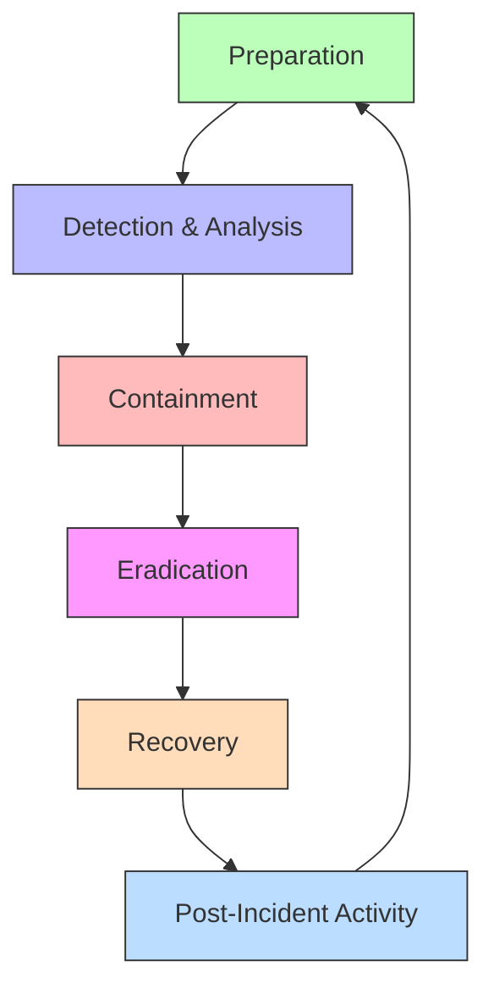
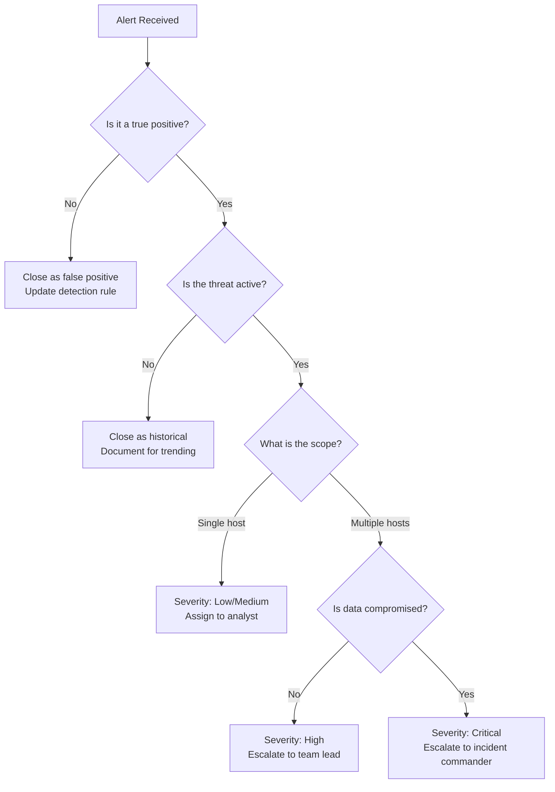
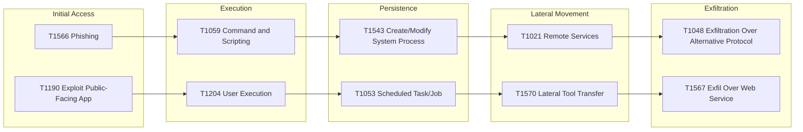
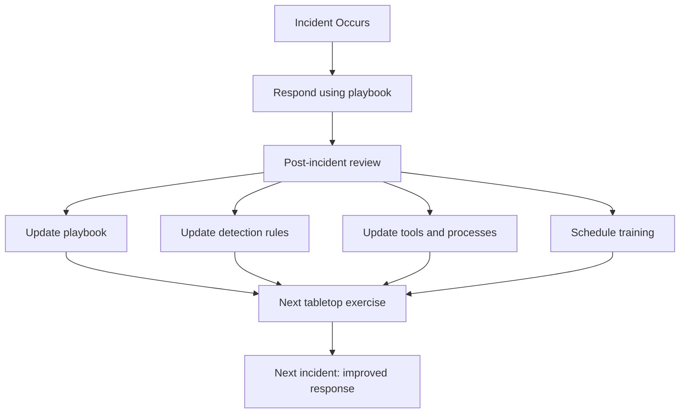

## The Incident Response Lifecycle

NIST SP 800-61 Rev. 2 defines the incident response lifecycle as four phases: Preparation, Detection
and Analysis, Containment Eradication and Recovery, and Post-Incident Activity.



The lifecycle is not strictly linear. Detection may happen during containment. Recovery may reveal
the need for additional eradication. Post-incident analysis feeds back into preparation, improving
readiness for the next incident.

## Preparation

Preparation is the most important phase. An unprepared team will waste critical time during an
incident figuring out roles, tools, and processes — while the attacker continues to operate.

### Incident Response Plan (IRP)

An IRP is a documented, tested plan that defines how the organization will respond to security
incidents. It should be a living document that is reviewed and updated at least annually.

**Essential IRP components:**

| Component                  | Description                                               |
| -------------------------- | --------------------------------------------------------- |
| Scope and objectives       | What constitutes an incident, what the plan covers        |
| Roles and responsibilities | Who does what during each phase (RACI matrix)             |
| Severity classification    | How to categorize incidents by impact and urgency         |
| Communication procedures   | Internal escalation, external notification, public comms  |
| Technical procedures       | Step-by-step instructions for common incident types       |
| Evidence handling          | Chain of custody, forensic imaging, log preservation      |
| Tool inventory             | What tools are available and how to use them              |
| Contact lists              | IR team, management, legal, law enforcement, regulators   |
| Legal and regulatory       | Data breach notification requirements, retention policies |

### Incident Response Team

| Role               | Responsibility                                       |
| ------------------ | ---------------------------------------------------- |
| Incident Commander | Overall coordination, decision-making, communication |
| Technical Lead     | Directs investigation, containment, and eradication  |
| Forensic Analyst   | Evidence collection, preservation, and analysis      |
| Communications     | Internal and external messaging, media relations     |
| Legal Counsel      | Regulatory compliance, law enforcement liaison       |
| Management Liaison | Executive communication, resource authorization      |
| IT Operations      | Infrastructure support, isolation, recovery          |

For small organizations, roles may overlap. The critical requirement is that **someone is explicitly
responsible for each function**.

### Playbooks

Playbooks are predefined procedures for specific incident types. They reduce decision-making under
pressure and ensure consistent, repeatable responses.

| Incident Type         | Key Playbook Actions                                                                                |
| --------------------- | --------------------------------------------------------------------------------------------------- |
| Ransomware            | Isolate affected systems, identify ransomware variant, assess data exposure, do not pay immediately |
| Data breach           | Identify scope, preserve evidence, notify affected parties, assess regulatory requirements          |
| Credential compromise | Force password reset, revoke sessions, check for lateral movement                                   |
| DDoS                  | Activate scrubbing, increase capacity, identify attack vector                                       |
| Malware               | Isolate infected host, identify malware family, scan for propagation                                |
| Insider threat        | Preserve evidence (legal hold), revoke access, coordinate with HR/legal                             |
| Supply chain attack   | Identify affected software, assess blast radius, patch/revert, verify integrity                     |

### Tools and Infrastructure

| Category            | Tools                                          |
| ------------------- | ---------------------------------------------- |
| SIEM                | Splunk, Elastic Security, Microsoft Sentinel   |
| EDR/XDR             | CrowdStrike, SentinelOne, Microsoft Defender   |
| Forensic imaging    | FTK Imager, dd, dc3dd, ewf                     |
| Memory forensics    | Volatility, Rekall                             |
| Log aggregation     | Fluentd, Logstash, Vector                      |
| Threat intelligence | MITRE ATT&CK, VirusTotal, Shodan, CIRCL        |
| Communication       | Slack (dedicated channel), PagerDuty, Opsgenie |
| Ticketing           | Jira, ServiceNow, RT                           |
| Documentation       | Confluence, shared drive (access-controlled)   |

### Tabletop Exercises

Tabletop exercises are discussion-based simulations where the IR team walks through a hypothetical
incident scenario. They test the plan, identify gaps, and build muscle memory without the pressure
of a real incident.

**Exercise structure:**

1. **Scenario design**: Choose a realistic scenario (ransomware, data breach, insider threat)
2. **Inject timeline**: Progress the scenario with new information at intervals
3. **Discussion**: Team discusses what they would do at each step
4. **Observation**: Facilitator notes gaps, confusion, and delays
5. **Debrief**: Review findings, update playbooks and IRP

**Example inject sequence for a ransomware exercise:**

| Time     | Inject                                                                |
| -------- | --------------------------------------------------------------------- |
| T+0      | User reports files are encrypted and a ransom note is displayed       |
| T+15min  | Second user reports the same. IT discovers network share is encrypted |
| T+30min  | EDR alerts on lateral movement attempts from the first host           |
| T+60min  | Legal asks: "Do we know what data was accessed before encryption?"    |
| T+90min  | Media inquiry received. Board asks for status update                  |
| T+120min | Threat intel: ransomware variant has known data exfiltration          |
| T+180min | Executive demands: "Can we restore from backups?"                     |

## Detection and Analysis

### Detection Sources

| Source              | Detection Capability                               | Limitations                               |
| ------------------- | -------------------------------------------------- | ----------------------------------------- |
| SIEM alerts         | Correlated events across sources                   | Requires tuning, high false positive rate |
| EDR/XDR             | Endpoint behavior, process execution, file changes | Agent must be running and healthy         |
| Network IDS/IPS     | Suspicious network traffic, known signatures       | Cannot inspect encrypted traffic          |
| Log analysis        | Application errors, authentication failures        | Requires logging to be enabled            |
| User reports        | Phishing, suspicious emails, slow systems          | Inconsistent, delayed                     |
| Threat intelligence | Known IOCs, vulnerability announcements            | Reactive, not proactive                   |
| File integrity      | Unauthorized changes to critical files             | Requires baseline                         |
| Cloud audit logs    | Unusual API calls, privilege escalation            | Volume can be overwhelming                |

### Alert Triage

Not every alert is an incident. Effective triage distinguishes true positives from false positives
and prioritizes by severity.

**Triage decision tree:**



### Severity Classification

| Severity | Definition                                               | Response Time     | Example                                       |
| -------- | -------------------------------------------------------- | ----------------- | --------------------------------------------- |
| Critical | Active breach, data exfiltration, system-wide compromise | Immediate         | Ransomware encrypting production DB           |
| High     | Confirmed compromise, limited scope, active threat       | Within 1 hour     | Single server compromised                     |
| Medium   | Suspicious activity, potential compromise                | Within 4 hours    | Credential reuse alert from HaveIBeenPwned    |
| Low      | Policy violation, reconnaissance, informational          | Within 24 hours   | Port scan from external IP                    |
| Info     | No security impact, awareness item                       | Next business day | Vulnerability disclosure (unaffected version) |

### Indicators of Compromise (IOCs)

| IOC Type         | Example                                                      | Detection Method          |
| ---------------- | ------------------------------------------------------------ | ------------------------- |
| IP address       | `198.51.100.42` (known C2 server)                            | Firewall logs, IDS alerts |
| Domain           | `evil-update.example.com`                                    | DNS logs, proxy logs      |
| File hash        | SHA-256: `abc123...` (known malware)                         | EDR, AV scans             |
| URL              | `https://evil.com/payload.exe`                               | Proxy logs, URL filtering |
| Email subject    | "Urgent: Verify your account"                                | Email gateway logs        |
| Registry key     | `HKLM\Software\Microsoft\Windows\CurrentVersion\Run\malware` | EDR, system logs          |
| Mutex            | `Global\{A1B2C3D4-E5F6-7890}`                                | Memory analysis, EDR      |
| Network artifact | Unusual user-agent, certificate pin mismatch                 | IDS, TLS logs             |

### IOC Sharing and Threat Intelligence Platforms

Sharing IOCs within your organization and with the broader security community amplifies detection
capability. A compromise detected at one organization can be prevented at others if IOCs are shared
rapidly.

| Platform       | Type          | Access      | Use Case                                     |
| -------------- | ------------- | ----------- | -------------------------------------------- |
| MISP           | Open source   | Self-hosted | Internal and community IOC sharing           |
| STIX/TAXII     | Standard      | Various     | Structured threat intelligence exchange      |
| AlienVault OTX | Community     | Free        | Open threat intelligence sharing             |
| CISA AIS       | Government    | Authorized  | US government cyber threat sharing           |
| VirusTotal     | Malware       | Free/Paid   | File and URL reputation lookup               |
| Shodan         | Internet scan | Free/Paid   | Exposed services and vulnerability detection |

Sharing IOCs must be done carefully. Sanitize internal information before sharing externally —
remove internal hostnames, usernames, and any information that could reveal your network topology or
security posture.

### Automated Detection Rules

Detection rules translate threat intelligence into automated alerts in your SIEM or EDR:

```yaml
# Sigma rule: Detect suspicious PowerShell execution
title: Suspicious PowerShell Encoded Command
status: production
description: Detects PowerShell commands with encoded payloads
logsource:
  category: process_creation
  product: windows
detection:
  selection:
    Image|endswith: '\powershell.exe'
    CommandLine|contains:
      - '-enc'
      - '-EncodedCommand'
      - '-w hidden'
  condition: selection
level: medium
tags:
  - attack.execution
  - attack.t1059.001
```

```yaml
# Sigma rule: Detect potential SSH brute force
title: SSH Brute Force Attempt
status: production
description: Detects multiple failed SSH authentication attempts
logsource:
  category: authentication
  product: linux
detection:
  selection:
    service: sshd
    result: failure
  timeframe: 5m
  condition: selection | count() > 10
level: high
tags:
  - attack.brute_force
  - attack.t1110
```

### MITRE ATT&CK Mapping

MITRE ATT&CK provides a framework of adversary tactics, techniques, and procedures (TTPs). Mapping
detected activity to ATT&CK techniques helps understand the attacker's goals and predict next steps.



## Containment

Containment limits the damage by isolating affected systems and preventing further spread. The goal
is to stop the bleeding without destroying evidence.

### Short-Term Containment

Immediate actions to stop the active threat:

| Action                        | When to Use                                    | Risk                                 |
| ----------------------------- | ---------------------------------------------- | ------------------------------------ |
| Network isolation (pull plug) | Fast-spreading ransomware, active exfiltration | Disrupts service, may alert attacker |
| Firewall rule blocking        | Known C2 IP/domain                             | Less disruptive                      |
| Account disable               | Compromised credentials                        | User loses access                    |
| VLAN isolation                | Compromised host on shared network             | Isolates without full disconnection  |
| API key revocation            | Leaked or compromised keys                     | Dependent services break             |

### Long-Term Containment

Actions that allow business to continue while the investigation proceeds:

- Deploy clean systems alongside compromised ones (temporary replacements)
- Implement network segmentation to contain the affected zone
- Apply emergency patches or configuration changes
- Set up monitoring on containment boundaries for escape attempts
- Implement enhanced logging on affected systems

### Evidence Preservation

:::warning

Before any containment action that may alter the system state, preserve volatile evidence. Once a
system is rebooted or powered off, volatile data is permanently lost.

:::

**Order of volatility** (what to collect first):

| Priority | Evidence Type         | Collection Method                           |
| -------- | --------------------- | ------------------------------------------- |
| 1        | CPU registers, cache  | Hardware debugger (rarely available)        |
| 2        | RAM / physical memory | Memory dump tool (LiME, WinPmem, Belkasoft) |
| 3        | Network connections   | `netstat`, `ss`, network capture (tcpdump)  |
| 4        | Running processes     | `ps auxf`, process tree capture             |
| 5        | Logged-in users       | `w`, `who`, `/var/run/utmp`                 |
| 6        | Open files            | `lsof`                                      |
| 7        | Disk                  | Full forensic image (FTK Imager, dd)        |
| 8        | Remote logs           | SIEM, syslog, centralized logging           |

```bash
# Memory capture on Linux (before any containment)
# Load the LiME kernel module
insmod lime.ko "path=/tmp/memory.lime format=lime"

# Network state capture
ss -tulpn > /tmp/network_state.txt
netstat -an > /tmp/netstat.txt

# Process list
ps auxfww > /tmp/processes.txt

# Running process memory maps
for pid in $(ps -eo pid); do
    cat /proc/$pid/maps > /tmp/maps_$pid.txt 2>/dev/null
done

# Forensic disk image (after memory capture)
dd if=/dev/sda of=/evidence/disk_image.dd bs=4M conv=noerror,sync status=progress
# Or with hashing for integrity
dc3dd if=/dev/sda of=/evidence/disk_image.dd hash=sha256 log=/evidence/imaging_log.txt
```

### Chain of Custody

Every piece of evidence must have a documented chain of custody — a record of who handled it, when,
and what was done.

| Field            | Description                                                     |
| ---------------- | --------------------------------------------------------------- |
| Evidence ID      | Unique identifier                                               |
| Description      | What the evidence is (e.g., "Forensic image of server-01 disk") |
| Collection time  | Date and time of collection (with timezone)                     |
| Collector        | Name and role of person who collected it                        |
| Storage location | Where the evidence is stored (physical or digital)              |
| Hash values      | SHA-256 of original, verified at each transfer                  |
| Transfer log     | Every time evidence changed hands                               |

## Eradication

Eradication removes the threat from the environment. This means identifying the root cause, removing
malicious artifacts, and addressing the vulnerability that allowed the compromise.

### Root Cause Analysis

| Question                              | What to Investigate                                    |
| ------------------------------------- | ------------------------------------------------------ |
| How did the attacker get in?          | Phishing, exploited vulnerability, stolen creds        |
| What vulnerabilities were exploited?  | Unpatched software, misconfiguration, weak credentials |
| What did the attacker access?         | File access logs, database queries, email              |
| What did the attacker modify?         | File integrity monitoring, configuration changes       |
| What persistence mechanisms exist?    | Scheduled tasks, startup items, registry, cron jobs    |
| Did the attacker establish backdoors? | New accounts, SSH keys, certificates, web shells       |
| Was data exfiltrated?                 | Network traffic analysis, DNS logs, cloud egress       |

### Eradication Actions

1. **Remove malware**: Delete malicious files, web shells, and tools
2. **Remove persistence**: Delete unauthorized accounts, SSH keys, scheduled tasks, cron jobs
3. **Patch vulnerabilities**: Update software, fix misconfigurations that allowed entry
4. **Rotate credentials**: Reset passwords, API keys, certificates, database credentials
5. **Revoke sessions**: Invalidate all active sessions for affected users
6. **Update firewall rules**: Block any attacker infrastructure (C2 servers, exfil endpoints)
7. **Verify integrity**: Compare critical files against known-good versions or checksums

:::warning

Do not trust the compromised system. The attacker may have installed rootkits, modified binaries, or
created backdoors that survive apparent cleanup. The safest approach is to rebuild affected systems
from known-good images rather than attempting in-place cleanup.

:::

## Recovery

Recovery restores affected systems to normal operation while ensuring the threat has been fully
eradicated.

### Recovery Steps

1. **Restore from clean backups**: Use backups from before the compromise. Verify backup integrity
   before restoration.
2. **Rebuild from scratch**: If the extent of compromise is unclear, rebuild systems from known-good
   images.
3. **Validate configurations**: Ensure restored systems match the intended hardened configuration.
4. **Re-enable monitoring**: Restore enhanced monitoring implemented during containment.
5. **Phased restoration**: Bring systems back online incrementally, monitoring for signs of
   re-compromise.
6. **Verify business function**: Confirm that restored systems operate correctly.
7. **Continue monitoring**: Maintain heightened monitoring for at least 30 days after recovery.

### Backup Considerations

| Backup Property | Requirement                                                                   |
| --------------- | ----------------------------------------------------------------------------- |
| Immutability    | Backups must be immutable (not modifiable or deletable) to survive ransomware |
| Air-gapping     | At least one backup copy must be offline/disconnected                         |
| Encryption      | Backups must be encrypted at rest                                             |
| Testing         | Restore tests must be performed regularly (not just backup verification)      |
| Retention       | Retain backups long enough to recover from delayed detection                  |
| 3-2-1 rule      | 3 copies, 2 different media, 1 offsite                                        |

## Post-Incident Activity

Post-incident activity is where the organization learns from the incident and improves its security
posture. This phase is often neglected under time pressure but provides the highest long-term ROI.

### Blameless Post-Mortem

A blameless post-mortem focuses on understanding what happened and why, not on assigning blame. The
goal is systemic improvement, not punishment.

**Post-mortem structure:**

| Section          | Content                                                        |
| ---------------- | -------------------------------------------------------------- |
| Incident summary | One-paragraph description of what happened                     |
| Timeline         | Detailed chronological sequence of events                      |
| Impact           | What systems/data/users were affected, duration, business cost |
| Root cause       | Technical and process root causes (5 Whys analysis)            |
| Detection        | How was the incident detected? How could detection be faster?  |
| Response         | What went well? What could be improved?                        |
| Lessons learned  | Specific, actionable takeaways                                 |
| Action items     | Assigned tasks with owners and deadlines                       |

### 5 Whys Analysis

A root cause analysis technique that asks "why" recursively until reaching a systemic cause:

```
Why was the database breached?
→ Because an SQL injection vulnerability existed in the login endpoint.

Why did the SQL injection vulnerability exist?
→ Because user input was concatenated into the SQL query instead of using parameterized queries.

Why were parameterized queries not used?
→ Because the developer was not aware of the security requirement.

Why was the developer not aware?
→ Because there was no security training or code review process for database interactions.

Why was there no security training or review?
→ Because the organization does not have a security awareness program for developers.
```

The root cause is not "the developer made a mistake" — it is "the organization lacks developer
security training and secure code review."

### Metrics and KPIs

| Metric                                 | Description                                    | Target           |
| -------------------------------------- | ---------------------------------------------- | ---------------- |
| MTTD (Mean Time to Detect)             | Average time from attack start to detection    | Decreasing trend |
| MTTR (Mean Time to Respond)            | Average time from detection to containment     | Decreasing trend |
| MTTE (Mean Time to Eradicate)          | Average time from containment to eradication   | Decreasing trend |
| MTTR (Mean Time to Recover)            | Average time from eradication to full recovery | Decreasing trend |
| Number of incidents                    | Total incidents by severity                    | Decreasing trend |
| False positive rate                    | Alerts that were not real incidents            | Decreasing trend |
| Time to patch critical vulnerabilities | Average time from CVE disclosure to patch      | Decreasing trend |
| Backup restoration success rate        | Percentage of successful restore tests         | 100%             |

## Forensic Basics

### Forensic Imaging

A forensic image is a bit-for-bit copy of a storage device, including unallocated space, file slack,
and metadata. It must be created using a write-blocker to prevent modification of the original.

```bash
# Create a forensic image with integrity verification
dc3dd if=/dev/sda of=/evidence/server01.dd hash=sha256 log=/evidence/server01.log

# Verify the image later
sha256sum /evidence/server01.dd
# Compare with the hash in the log file

# Mount a forensic image read-only for analysis
mkdir /mnt/forensic
mount -o ro,loop,noexec /evidence/server01.dd /mnt/forensic
```

### Memory Forensics with Volatility

Volatility is the standard open-source framework for analyzing memory dumps.

```bash
# Identify the operating system profile
vol -f memory.lime imageinfo

# List running processes
vol -f memory.lime --profile=Win10x64_19041 pslist

# Show process tree
vol -f memory.lime --profile=Win10x64_19041 pstree

# Detect injected code (process hollowing, DLL injection)
vol -f memory.lime --profile=Win10x64_19041 malfind

# Dump a specific process memory
vol -f memory.lime --profile=Win10x64_19041 procdump -p 1234 -D /evidence/dumps/

# Network connections at time of capture
vol -f memory.lime --profile=Win10x64_19041 netscan

# Extract command history
vol -f memory.lime --profile=Win10x64_19041 cmdscan
```

### Timeline Analysis

Reconstructing a timeline of attacker activity is critical for understanding scope and impact.

```bash
# Create a body file from filesystem for timeline analysis
fls -r -m "/" /evidence/server01.dd > /tmp/body.txt

# Create a timeline with mactime
mactime -b /tmp/body.txt > /tmp/timeline.csv

# Sort and analyze
# Look for files created/modified during the incident window
# Look for files in unusual locations
# Look for files with suspicious extensions (.php, .jsp, .exe in web directories)
```

## Common Incident Types

### Ransomware

| Phase         | Response Action                                                |
| ------------- | -------------------------------------------------------------- |
| Detection     | Identify variant (ransom note, file extension, behavior)       |
| Containment   | Isolate affected systems immediately                           |
| Assessment    | Determine encryption type, affected data, backup status        |
| Decision      | Do not pay ransom (funds criminal organizations, no guarantee) |
| Recovery      | Restore from immutable, tested backups                         |
| Investigation | Determine initial access vector, lateral movement path         |

### Data Breach

| Phase         | Response Action                                                           |
| ------------- | ------------------------------------------------------------------------- |
| Detection     | Identify what data was accessed/exfiltrated                               |
| Containment   | Close the access vector, revoke compromised credentials                   |
| Assessment    | Classify the data (PII, PHI, financial, intellectual property)            |
| Notification  | Determine regulatory notification requirements (GDPR 72hr, HIPAA 60 days) |
| Communication | Prepare internal and external messaging                                   |
| Recovery      | Implement additional controls to prevent recurrence                       |

### Credential Compromise

| Phase         | Response Action                                                           |
| ------------- | ------------------------------------------------------------------------- |
| Detection     | Identify which accounts are affected                                      |
| Containment   | Force password reset, revoke all sessions                                 |
| Assessment    | Check for MFA bypass, password reuse, credential stuffing                 |
| Investigation | Determine how credentials were obtained (phishing, breach, reuse)         |
| Recovery      | Implement password policy changes, enable MFA, check for lateral movement |

### Supply Chain Attack

| Phase         | Response Action                                                       |
| ------------- | --------------------------------------------------------------------- |
| Detection     | Identify the compromised dependency or update                         |
| Containment   | Pin to last known-good version, revoke compromised artifacts          |
| Assessment    | Determine blast radius — which systems used the compromised component |
| Investigation | Trace the supply chain path, identify the root compromise             |
| Recovery      | Replace with verified, signed artifacts (SLSA)                        |

## Communication

### Internal Communication

| Audience       | Timing         | Content                                                |
| -------------- | -------------- | ------------------------------------------------------ |
| IR team        | Immediately    | Technical details, assigned tasks, evidence status     |
| Executive team | Within 1 hour  | Business impact, customer impact, response status      |
| All employees  | As needed      | General awareness, phishing warnings, policy reminders |
| Legal/PR       | Within 2 hours | Regulatory implications, media strategy                |

### External Communication

| Audience        | Timing                | Content                                                  |
| --------------- | --------------------- | -------------------------------------------------------- |
| Affected users  | Per regulatory req    | What happened, what data was affected, what to do        |
| Customers       | As appropriate        | Impact assessment, mitigation steps                      |
| Public/Media    | Via PR team           | Factual statement, no speculation, commitment to resolve |
| Law enforcement | If criminal activity  | Forensic evidence, IOCs, timeline                        |
| Regulators      | Per legal requirement | Formal notification with required details                |

### Regulatory Notification Requirements

| Regulation | Notification Deadline                     | Authority                           |
| ---------- | ----------------------------------------- | ----------------------------------- |
| GDPR       | 72 hours                                  | Supervisory authority               |
| HIPAA      | 60 days                                   | HHS OCR                             |
| PCI-DSS    | Immediately                               | Payment card brands, acquiring bank |
| CCPA       | "Expeditious"                             | California Attorney General         |
| NIS2 (EU)  | 24 hours (early warning), 72 hours (full) | National CSIRT                      |

:::warning

Regulatory requirements vary by jurisdiction and data type. Engage legal counsel early. Failure to
notify within the required timeframe can result in significant fines on top of the incident's direct
costs. GDPR fines for late notification can reach 10 million EUR or 2% of global annual revenue.

:::

## Common Pitfalls

### Pitfall 1: No Incident Response Plan

Operating without a documented, tested IRP means the first hours of any incident will be spent
figuring out who is responsible, what to do, and how to communicate. This is the most critical
window — the attacker is active, and you are disorganized. Write a plan, test it with tabletop
exercises, and update it regularly.

### Pitfall 2: Destroying Evidence

Rebooting a compromised system, running cleanup scripts, or modifying files before collecting
forensic evidence destroys volatile data and alters the system state. Always collect memory and
volatile evidence before containment actions. Create forensic images before any analysis on the
original disk.

### Pitfall 3: Inadequate Logging

You cannot investigate what you did not log. And you cannot detect what you are not monitoring.
Ensure comprehensive logging with sufficient retention (minimum 90 days, 1 year recommended).
Centralize logs to a SIEM with tamper-evident storage.

### Pitfall 4: Siloed Communication

Incidents require coordination across security, IT, legal, communications, and executive teams.
Information silos lead to inconsistent messaging, duplicated effort, and delayed response. Establish
a dedicated communication channel (Slack, Teams) and define who communicates what to whom.

### Pitfall 5: Not Learning from Incidents

The post-mortem is the most valuable phase of incident response. Organizations that skip it or treat
it as a formality will repeat the same mistakes. A blameless culture that focuses on systemic
improvement, not individual fault, produces better security outcomes.

### Pitfall 6: Paying Ransomware Demands

Paying a ransom does not guarantee data recovery, funds criminal organizations, and signals to
attackers that your organization will pay. Worse, paying once makes you a repeat target. Maintain
tested, immutable backups as the primary recovery mechanism. Pay only as an absolute last resort
with legal guidance.

### Pitfall 7: Ignoring Small Incidents

Not every incident is a catastrophic breach, but every incident is an opportunity to improve. A
phishing email that reached an inbox reveals a gap in email filtering. A successful brute-force
attempt on SSH reveals a need for key-based authentication. Small incidents are free lessons — treat
them as such.

### Pitfall 8: Not Preserving Volatile Evidence

Rebooting a compromised system, closing terminal sessions, or running cleanup scripts before
collecting volatile evidence permanently destroys critical forensic data. Memory contents, running
processes, and network connections cannot be recovered after a reboot. Always collect volatile
evidence first.

### Pitfall 9: Communicating Too Much or Too Little

Over-communicating (sharing unverified details publicly) can cause panic, legal liability, and give
attackers information about your response. Under-communicating (hiding an incident from
stakeholders) violates regulatory requirements and destroys trust. Follow a defined communication
plan that balances transparency with caution.

### Pitfall 10: Treating Recovery as the End

Recovery is not the end of the incident. Post-incident analysis, process improvements, and knowledge
sharing are what prevent the next incident. Organizations that skip the post-incident phase will
repeat the same mistakes with increasing severity.

## Legal and Regulatory Considerations

### Data Breach Notification Laws

Different jurisdictions have different notification requirements. Understanding these before an
incident occurs is critical.

| Jurisdiction   | Regulation             | Notification Deadline                                                     | Who to Notify                       |
| -------------- | ---------------------- | ------------------------------------------------------------------------- | ----------------------------------- |
| European Union | GDPR                   | 72 hours to supervisory authority; "without undue delay" to data subjects | DPA + affected individuals          |
| United States  | State laws (50 states) | Varies: 30-90 days typical                                                | State AG + affected individuals     |
| United States  | HIPAA                  | 60 days to HHS, affected individuals                                      | HHS + affected individuals          |
| United States  | PCI-DSS                | Immediately to card brands and acquirer                                   | Payment card brands, acquiring bank |
| California     | CCPA/CPRA              | "Expeditious" to CA AG (if &gt;500 CA residents)                          | CA Attorney General + consumers     |
| Australia      | Privacy Act            | 30 days to OAIC and affected individuals                                  | OAIC + affected individuals         |
| Germany        | GDPR + BDSG            | 72 hours (GDPR), 72 hours (BDSG)                                          | DPA + affected individuals          |
| Japan          | APPI                   | "Promptly" to PPC and affected individuals                                | PPC + affected individuals          |

### Evidence Handling for Legal Proceedings

If an incident may result in legal action (civil or criminal), evidence must be collected and
handled according to forensic standards:

1. **Chain of custody**: Document every person who handled the evidence, when, and why
2. **Write blockers**: Use hardware or software write blockers when imaging disks
3. **Hash verification**: Compute SHA-256 hashes at every stage of evidence handling
4. **Documentation**: Photograph screens, log timestamps, and system state before any action
5. **Legal hold**: Issue a legal hold notice to preserve all relevant data when litigation is
   anticipated

### Working with Law Enforcement

| Consideration         | Guidance                                                                              |
| --------------------- | ------------------------------------------------------------------------------------- |
| When to involve       | For criminal activity, significant financial loss, or nation-state attribution        |
| Which agency          | FBI (IC3), CISA, local CERT, national CERT                                            |
| What to provide       | Forensic evidence (images, logs), IOCs, timeline                                      |
| What to expect        | Slow response for non-critical incidents, may require court order for certain actions |
| Internal coordination | Legal counsel should manage all law enforcement contact                               |

## Building an Incident Response Capability

### Maturity Levels

| Level          | Description                                      | Characteristics                                    |
| -------------- | ------------------------------------------------ | -------------------------------------------------- |
| 1 - Initial    | No formal IR capability                          | Ad-hoc response, no plan, no tools                 |
| 2 - Managed    | Basic IR plan exists                             | Documented but untested, basic tools               |
| 3 - Defined    | IR plan tested and maintained                    | Regular tabletop exercises, defined roles          |
| 4 - Quantified | Metrics-driven improvement                       | MTTD/MTTR tracked, automated detection             |
| 5 - Optimized  | Continuous improvement, proactive threat hunting | Threat intelligence integrated, red team exercises |

### Automation Opportunities

| Phase         | What to Automate                                | Tool Examples                              |
| ------------- | ----------------------------------------------- | ------------------------------------------ |
| Detection     | Alert triage, IOC matching, anomaly detection   | SOAR platforms (Splunk SOAR, Cortex XSOAR) |
| Containment   | Automated host isolation, account disable       | EDR response actions, AWS Lambda           |
| Investigation | Log correlation, timeline reconstruction        | SIEM queries, automated playbooks          |
| Communication | Status page updates, notification routing       | PagerDuty, Slack webhooks, statuspage.io   |
| Reporting     | Metric collection, compliance report generation | Custom dashboards, SIEM reporting          |

### Continuous Improvement Cycle



### Red Team Exercises

While tabletop exercises test the decision-making process, red team exercises test the technical
detection and response capabilities. A red team simulates a real adversary attempting to breach the
organization, while the blue team (defenders) attempts to detect and stop them.

| Exercise Type            | Scope                    | Duration  | Frequency     |
| ------------------------ | ------------------------ | --------- | ------------- |
| Tabletop                 | Discussion-based         | 2-4 hours | Quarterly     |
| Red team / Blue team     | Technical simulation     | 1-4 weeks | Annually      |
| Purple team              | Collaborative (red+blue) | 1-2 weeks | Semi-annually |
| Vulnerability assessment | Targeted scanning        | 1-5 days  | Monthly       |
| Penetration test         | Scoped exploitation      | 1-3 weeks | Annually      |

Red team exercises should be conducted by an independent team (internal red team or external
consultant) that does not share detection rules or playbooks with the blue team. The goal is to test
the blue team's actual detection and response capability, not to validate known detections.

### Communication Templates

Preparing communication templates before an incident ensures rapid, consistent messaging under
pressure:

**Internal notification template:**

```
Subject: [SEVERITY] Security Incident - [brief description]

Status: [Investigating / Contained / Resolved]
Severity: [Critical / High / Medium / Low]
Affected Systems: [list]
Impact: [data affected, services impacted]
Current Actions: [what the IR team is doing]
Next Update: [time]
IR Commander: [name and contact]
Dedicated Channel: [Slack channel, bridge line]
```

**External notification template (for affected users):**

```
Subject: Important Security Notice from [Organization]

What happened: [clear, factual description]
What information was involved: [specific data types]
What we are doing: [containment and remediation steps]
What you can do: [specific actions for the user]
For more information: [contact details, FAQ link]
```

:::info

**Reference Standards**: NIST SP 800-61 Rev. 2 (Computer Security Incident Handling Guide), NIST SP
800-86 (Guide to Integrating Forensic Techniques into Incident Response), NIST SP 800-83 (Guide to
Malware Incident Prevention and Handling), RFC 3227 (Guidelines for Evidence Collection and
Archiving), MITRE ATT&CK Framework, ISO/IEC 27035 (Information Security Incident Management), NIST
Cybersecurity Framework (CSF), SANS Incident Handler's Handbook.

:::
