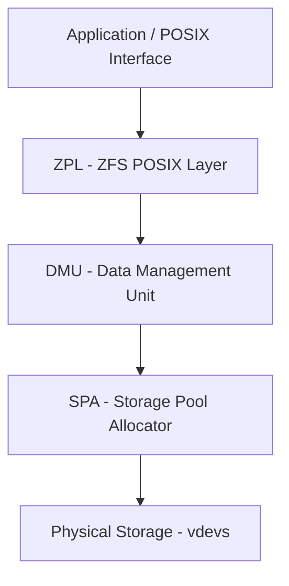
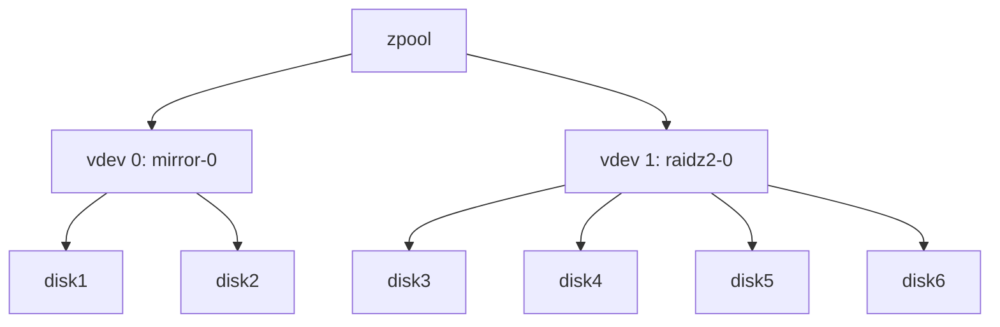
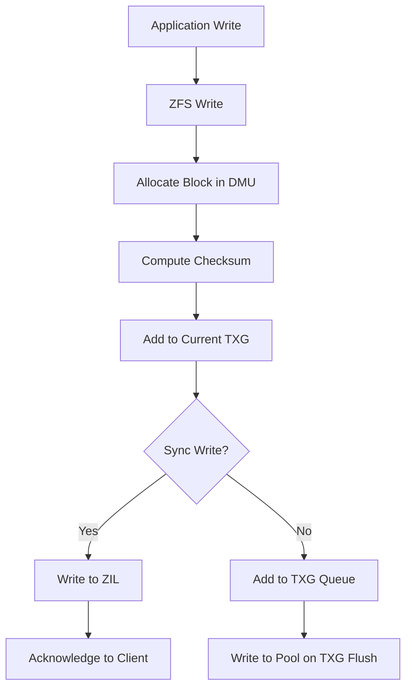
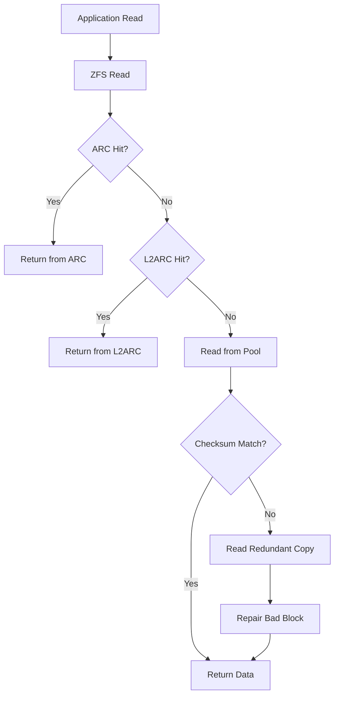

## ZFS Architecture

### The Three Layers

ZFS is not a traditional filesystem. It is a combined volume manager and filesystem built from three
distinct layers:



1. **ZPL (ZFS POSIX Layer):** The filesystem layer that provides POSIX-compliant semantics — files,
   directories, permissions, extended attributes, and ACLs. It translates file operations into block
   operations.
2. **DMU (Data Management Unit):** The transactional layer that manages objects, blocks, and
   snapshots. All writes are handled as atomic transactions. The DMU also manages the ARC (Adaptive
   Replacement Cache).
3. **SPA (Storage Pool Allocator):** The lowest layer that manages physical storage. It handles vdev
   topology, I/O scheduling, checksumming, compression, and self-healing.

### Copy-on-Write Transaction Model

ZFS never overwrites data in place. Every write creates a new copy of the data block, and only after
the new block is written and its checksum verified does ZFS update the metadata to point to the new
block. This has several consequences:

- **Snapshots are instantaneous and free** (initially). A snapshot is simply a marker in the
  transaction history that prevents old blocks from being freed.
- **No write hole.** Unlike hardware RAID, a power loss during a write cannot leave data and parity
  in an inconsistent state. Either the old data or the new data is referenced, never a partial
  update.
- **Fragmentation is inevitable.** Over time, as blocks are updated and freed, the pool becomes
  fragmented. This is the primary trade-off of copy-on-write.

### Merkle Tree and Checksumming

Every block in ZFS is identified by its content hash (SHA-256 by default), forming a Merkle tree.
The root of the Merkle tree (the block pointer) stores the checksum of its child blocks, and so on
recursively.

When ZFS reads a block, it:

1. Reads the block and its checksum from disk.
2. Recomputes the checksum of the read data.
3. Compares the computed checksum with the stored checksum.
4. If they match, the data is returned.
5. If they do not match (silent corruption), ZFS uses redundancy (mirror or parity) to reconstruct
   the correct data and repair the corrupted copy.

### Checksum Algorithms

| Algorithm | Speed     | Collision Resistance | Recommendation                     |
| --------- | --------- | -------------------- | ---------------------------------- |
| fletcher2 | Fast      | Low                  | Legacy only                        |
| fletcher4 | Fast      | Low                  | Default on older pools             |
| sha256    | Moderate  | High                 | Default and recommended            |
| sha512    | Slow      | Very High            | Security-sensitive environments    |
| edonr     | Very Fast | Very High            | Best for modern hardware (SSE4.2+) |
| blake3    | Very Fast | Very High            | Available on newer ZFS versions    |

:::info Set the checksum algorithm at pool creation time with `-O checksum=sha256`. It cannot be
changed after pool creation. `edonr` is the fastest on hardware with SSE4.2+ support and provides
excellent collision resistance.
:::

---

## Storage Pools

### vdev Types

A ZFS pool (zpool) is constructed from one or more vdevs (virtual devices). The vdev is the
fundamental unit of redundancy and performance. Data is striped across vdevs for performance.



| vdev Type     | Min Drives | Fault Tolerance  | Capacity Efficiency | Write Performance | Read Performance |
| ------------- | ---------- | ---------------- | ------------------- | ----------------- | ---------------- |
| stripe (none) | 1          | None             | 100%                | N ×               | N ×              |
| mirror        | 2          | N-1 drives       | 1/N ×               | 1 × (per mirror)  | N ×              |
| raidz1        | 3          | 1 drive          | (N-1)/N ×           | Moderate          | Good             |
| raidz2        | 4          | 2 drives         | (N-2)/N ×           | Moderate          | Good             |
| raidz3        | 5          | 3 drives         | (N-3)/N ×           | Moderate          | Good             |
| draid1        | 3          | 1 drive + spare  | Similar to raidz1   | Good              | Good             |
| draid2        | 4          | 2 drives + spare | Similar to raidz2   | Good              | Good             |

### RAIDZ Dynamic Striping

RAIDZ uses dynamic stripe width. Unlike traditional RAID 5/6 where the stripe width is fixed (e.g.,
4+1 for RAID 5 with 5 drives), RAIDZ varies the stripe width based on the size of the incoming
write:

- Small writes (less than one sector per data disk) are written as "full stripe" writes with
  variable-width padding.
- Large writes that fill the stripe exactly avoid any padding overhead.
- Medium writes may leave some sectors unused (wasted space).

This is why RAIDZ capacity is slightly less than the theoretical (N-P)/N formula, where P is the
parity count. The actual usable capacity depends on the recordsize and write patterns.

### ashift (Sector Size)

The `ashift` property controls the physical sector size that ZFS assumes for the drives. It must be
set at pool creation time and cannot be changed afterward.

| ashift | Sector Size | When to Use                                 |
| ------ | ----------- | ------------------------------------------- |
| 9      | 512 bytes   | Legacy drives only                          |
| 12     | 4 KB        | Most modern HDDs and SSDs                   |
| 13     | 8 KB        | Some modern SSDs with 8 KB physical sectors |
| 14     | 16 KB       | Advanced-format SMR drives                  |

:::warning Always set `ashift=12` (4 KB) at minimum for modern drives. Setting `ashift=9` on a drive
with 4 KB physical sectors causes read-modify-write amplification, devastating performance. On
TrueNAS, the default `ashift` is 12, which is correct for virtually all modern drives.
:::

### Pool Creation Examples

```bash
# Mirror pool (2-way mirror)
zpool create tank mirror /dev/sda /dev/sdb

# RAIDZ2 pool with ashift=12
zpool create -o ashift=12 tank raidz2 /dev/sda /dev/sdb /dev/sdc /dev/sdd

# Hybrid pool: SSD mirror for special vdev + HDD RAIDZ2 for data
zpool create -o ashift=12 tank \
  mirror /dev/nvme0n1 /dev/nvme1n1 \
  raidz2 /dev/sda /dev/sdb /dev/sdc /dev/sdd /dev/sde /dev/sdf
```

---

## Dataset Hierarchy

### Datasets and Properties

A dataset (zfs filesystem) is a logical namespace within a pool. Each dataset has its own
properties, mount point, and can have its own snapshots, quotas, and compression settings.

```bash
# Create a dataset
zfs create tank/data

# Set properties
zfs set compression=lz4 tank/data
zfs set atime=off tank/data
zfs set recordsize=128K tank/data
zfs set quota=500G tank/data

# List all properties
zfs get all tank/data
```

### Key Dataset Properties

| Property       | Default                 | Description                        | Recommendation                                        |
| -------------- | ----------------------- | ---------------------------------- | ----------------------------------------------------- |
| compression    | off (on), lz4 (TrueNAS) | Compress data before writing       | Always `lz4` (fast, low CPU) or `zstd` (better ratio) |
| atime          | on                      | Update file access time on read    | Set `off` to reduce metadata writes                   |
| recordsize     | 128K                    | Maximum block size for a file      | 128K for media, 16K-64K for VMs, 8K for databases     |
| dedup          | off                     | Deduplicate blocks                 | Generally off (high memory cost)                      |
| sync           | standard                | Synchronous write behavior         | `standard` for NFS, `disabled` for scratch            |
| logbias        | latency                 | Optimize for latency vs throughput | `latency` for databases, `throughput` for media       |
| primarycache   | all                     | What to store in ARC               | `all` for most workloads                              |
| secondarycache | all                     | What to store in L2ARC             | `all` if L2ARC present                                |

### recordsize Selection

The `recordsize` property determines the maximum block size ZFS uses for a file. ZFS uses
variable-size blocks up to this maximum. The optimal recordsize depends on the workload:

| Workload                           | Recommended recordsize | Rationale                                        |
| ---------------------------------- | ---------------------- | ------------------------------------------------ |
| Media files (video, audio, images) | 128K (default)         | Large sequential reads benefit from large blocks |
| Virtual machine images             | 64K or 16K             | VMs do mixed random/sequential I/O               |
| Databases (MySQL, PostgreSQL)      | 8K or 16K              | Match the database page size                     |
| General file storage               | 128K                   | Good balance for mixed workloads                 |
| NFS home directories               | 128K                   | Mixed workload, default is fine                  |

:::warning Changing `recordsize` on an existing dataset only affects new writes. Existing files
retain their original block sizes. To benefit from a recordsize change, you must rewrite the data
(e.g., copy files to a new dataset with the desired recordsize).
:::

---

## Snapshots

### How Snapshots Work

Because ZFS is copy-on-write, a snapshot is simply a point-in-time marker in the transaction
history. Creating a snapshot is instantaneous and consumes no space initially. Space is consumed
only when blocks referenced by the snapshot are modified or deleted in the live filesystem.

### Snapshot Space Accounting

The space used by a snapshot is the total size of blocks that have been modified or deleted in the
live filesystem since the snapshot was taken. This is called "written" space:

```bash
# List snapshots and their space usage
zfs list -t snapshot -o name,used,refer,written

# Check space used by a specific snapshot
zfs list -o name,used,refer tank/data@daily.2024-01-01
```

### Snapshot Lifecycle Management

```bash
# Create a snapshot
zfs snapshot tank/data@daily.2024-01-01

# List snapshots
zfs list -t snapshot

# Destroy a snapshot
zfs destroy tank/data@daily.2024-01-01

# Destroy snapshots matching a pattern
zfs destroy tank/data@daily.2023-*

# Clone a snapshot (creates a writable copy)
zfs clone tank/data@daily.2024-01-01 tank/data-restore

# Promote a clone (make it independent of the snapshot)
zfs promote tank/data-restore
```

### Clones vs. Snapshots

| Feature        | Snapshot                       | Clone                           |
| -------------- | ------------------------------ | ------------------------------- |
| Writable       | No                             | Yes                             |
| Space usage    | Only changed blocks            | Same as snapshot + new writes   |
| Can be mounted | No                             | Yes                             |
| Dependencies   | Cannot destroy if clone exists | Independent after promotion     |
| Use case       | Backup points, rollback        | Testing, temporary environments |

---

## ARC, L2ARC, and SLOG

### ARC (Adaptive Replacement Cache)

The ARC is ZFS's primary read cache, stored in system RAM. It uses the Adaptive Replacement Cache
algorithm, which maintains two lists:

- **MRU (Most Recently Used):** Recently accessed data.
- **MFU (Most Frequently Used):** Frequently accessed data.

The ARC dynamically balances between these two lists, evicting from the list with lower hit rates.
This performs better than a simple LRU cache for mixed workloads with both sequential and random
access patterns.

**ARC sizing:** The default ARC maximum is typically 50% of system RAM on TrueNAS. For dedicated NAS
workloads, increasing the ARC to 70–80% of RAM can significantly improve read performance for hot
datasets.

```bash
# Check ARC stats
zfs get arcstats 2>/dev/null || cat /proc/spl/kstat/zfs/arcstats

# Key metrics:
# arc_hits    — Cache hits
# arc_misses  — Cache misses
# arc_hit_ratio — Percentage of reads served from cache
```

### L2ARC (Level 2 ARC)

The L2ARC is a secondary read cache stored on a dedicated SSD (or partition of an SSD). When the ARC
evicts data, it can write it to the L2ARC before discarding it entirely. On subsequent accesses, if
the data is not in the ARC but is in the L2ARC, it can be read from the L2ARC rather than from the
slower pool disks.

**L2ARC considerations:**

- L2ARC is read-through, not write-through. Data is written to L2ARC only when evicted from ARC.
- The L2ARC does not speed up writes — only reads.
- L2ARC requires significant ARC space to be effective. The ARC metadata for tracking L2ARC entries
  consumes RAM.
- L2ARC is most effective when the working set is larger than ARC but smaller than ARC + L2ARC.

### SLOG (ZIL)

The SLOG (Separate Log) is an accelerator for synchronous writes. When a synchronous write request
arrives (from NFS, SMB sync, or a database), ZFS must ensure the data is on stable storage before
acknowledging the write. Without a SLOG, this means writing directly to the pool, which is slow for
HDD-based pools.

A dedicated SLOG device (typically a low-latency NVMe SSD or Intel Optane) absorbs synchronous
writes at SSD speed, then asynchronously flushes them to the pool. This dramatically improves NFS
and database write performance on HDD-based pools.

:::warning The SLOG must have power-loss protection (PLP). Without PLP, a power loss during a
synchronous write can lose acknowledged data, violating the sync guarantee. Intel Optane DC
persistent memory is the gold standard for SLOG devices. Enterprise NVMe SSDs with PLP are also
acceptable. Consumer NVMe SSDs without PLP should not be used as SLOG devices.
:::

---

## Scrub and Resilver

### Scrub

A scrub reads all data in the pool and verifies checksums. If a checksum mismatch is detected (the
block is corrupted), ZFS automatically repairs it from a redundant copy (mirror or parity).

```bash
# Start a scrub
zpool scrub tank

# Check scrub status
zpool status tank

# Scrub scheduling on TrueNAS:
# Configure under Data Protection → Scrub Tasks
# Recommended: Monthly scrubs for HDD pools, Weekly for SSD pools
```

**Scrub best practices:**

- Run scrubs at off-peak hours. Scrubbing a large HDD pool can take days and significantly impacts
  pool performance.
- SSD pools scrub much faster (hours instead of days) due to higher throughput.
- Monitor scrub progress with `zpool status`. The scrub will report any errors found and repaired.
- If a scrub finds uncorrectable errors, immediately back up critical data and replace the failing
  drive.

### Resilver

A resilver rebuilds the data on a replaced drive. Unlike traditional RAID rebuilds, ZFS resilvers
only copy the actual data (not the entire disk), and they prioritize data based on its metadata
importance.

```bash
# Replace a failed drive
zpool replace tank /dev/sda /dev/sdb

# Monitor resilver progress
zpool status tank
```

:::warning During a resilver, the pool is vulnerable. If a second drive fails during resilver of a
RAIDZ1 pool, all data is lost. For RAIDZ2, you can tolerate a second failure. Always monitor
resilver progress and ensure the pool is healthy before and after.
:::

---

## Send and Receive

### Incremental Replication

ZFS send/receive is the native mechanism for replicating datasets between pools or systems. It works
at the block level, sending only the changed blocks between two snapshots.

```bash
# Full replication (initial)
zfs send tank/data@snapshot1 | zfs recv backup/data

# Incremental replication (send only changes since snapshot1)
zfs send -i tank/data@snapshot1 tank/data@snapshot2 | zfs recv backup/data

# Replication with compression over SSH
zfs send -Rcv tank/data@snapshot1 | ssh nas2 zfs recv backup/data

# Raw send (preserves encryption and compression)
zfs send -w tank/data@snapshot1 | zfs recv backup/data
```

### Replication Strategies

| Strategy                              | Bandwidth | Storage | Complexity |
| ------------------------------------- | --------- | ------- | ---------- |
| Full periodic                         | High      | High    | Low        |
| Incremental periodic                  | Low       | Medium  | Medium     |
| Continuous (zfs-auto-snapshot + cron) | Low       | Medium  | Medium     |
| TrueNAS replication task              | Low       | Medium  | Low (GUI)  |

---

## zpool Status Interpretation

### Reading zpool status

```bash
zpool status -v tank
```

Key fields to understand:

| Field  | Meaning                                                 |
| ------ | ------------------------------------------------------- |
| state  | Overall pool state (ONLINE, DEGRADED, FAULTED, UNAVAIL) |
| status | Human-readable description of current state             |
| action | Recommended corrective action                           |
| see    | Kernel message log reference                            |
| config | Detailed vdev and disk status                           |
| errors | Read, write, and checksum error counts per disk         |

### Drive Status Values

| Status   | Meaning                                             | Action                     |
| -------- | --------------------------------------------------- | -------------------------- |
| ONLINE   | Drive is healthy and active                         | None                       |
| DEGRADED | Drive is operational but pool redundancy is reduced | Replace failed drive       |
| OFFLINE  | Drive has been taken offline administratively       | Bring online or replace    |
| FAULTED  | Drive has been marked as failed                     | Replace immediately        |
| UNAVAIL  | Drive cannot be opened or accessed                  | Check connections, replace |
| REMOVED  | Drive has been physically removed                   | Reinsert or replace        |

---

## Common Pitfalls

### Using RAIDZ1 with Large Drives

With modern drives (8 TB+), the probability of encountering an unrecoverable read error (URE) during
a resilver approaches certainty. A RAIDZ1 pool with 8 TB drives has a resilver time of 12–24 hours.
During that time, reading every block on every remaining drive means the chance of hitting a URE
(and losing the pool) is non-trivial. Use RAIDZ2 (or RAIDZ3) for any pool with drives larger than 4
TB.

### Setting dedup=on Without Sufficient RAM

Deduplication maintains an in-memory hash table of every unique block. This table requires
approximately 320 bytes per unique block. A 10 TB pool with 4 TB of unique data can require 100+ GB
of RAM for the dedup table. If the system runs out of RAM and must swap, performance collapses. Only
enable dedup if your data is highly redundant (VM templates, ISO images) and you have sufficient
RAM. In most cases, compression (lz4) provides better space savings with no memory cost.

### Mixing Drive Sizes in a RAIDZ Vdev

While ZFS allows mixing drive sizes in a RAIDZ vdev, the pool capacity is determined by the smallest
drive in the vdev. A RAIDZ2 vdev with three 12 TB drives and one 4 TB drive will have the capacity
of four 4 TB drives. Always use identical drives within a vdev.

### Not Setting ashift Correctly

Once a pool is created, `ashift` cannot be changed. Creating a pool with `ashift=9` (512 bytes) on
drives with 4 KB physical sectors causes severe read-modify-write amplification on small writes,
reducing performance by 50–80%. Always use `ashift=12` or higher.

### Ignoring Fragmentation

ZFS pools become fragmented over time due to the copy-on-write nature. Fragmentation above 70–80%
can significantly reduce performance, especially for random read workloads. Monitor fragmentation
with `zpool list -v`. There is no native defragmentation tool for ZFS — the only way to defragment
is to copy the data to a new pool. Regular snapshot pruning and avoiding small random writes on HDD
pools help keep fragmentation manageable.

## ZFS Pool Design Patterns

### Mirror Pool Design

Mirrors are the gold standard for performance and redundancy:

```bash
# 2-way mirror (most common)
zpool create -o ashift=12 -O compression=lz4 -O atime=off tank \
  mirror /dev/sda /dev/sdb \
  mirror /dev/sdc /dev/sdd \
  mirror /dev/sde /dev/sdf

# Performance characteristics:
# Read: N × single-disk IOPS (any disk in a mirror can serve the read)
# Write: N × single-disk IOPS (writes go to all mirrors simultaneously)
# Capacity: 50% of total raw
# Fault tolerance: 1 disk per mirror vdev
```

Mirror pools provide the best random I/O performance because every vdev can serve reads
independently. A 6-disk mirror pool (3 mirror vdevs) can serve 3× the random IOPS of a single disk.

### RAIDZ2 Pool Design

RAIDZ2 provides dual-parity protection at better capacity efficiency:

```bash
# RAIDZ2 with 8 drives per vdev
zpool create -o ashift=12 -O compression=lz4 -O atime=off tank \
  raidz2 /dev/sda /dev/sdb /dev/sdc /dev/sdd /dev/sde /dev/sdf /dev/sdg /dev/sdh \
  raidz2 /dev/sdi /dev/sdj /dev/sdk /dev/sdl /dev/sdm /dev/sdn /dev/sdo /dev/sdp

# Performance characteristics:
# Read: Good (reads span all data disks)
# Write: Moderate (parity calculation overhead)
# Capacity: (N-2)/N of total raw per vdev
# Fault tolerance: 2 disks per vdev
```

### dRAID (Declustered RAID)

dRAID is a ZFS feature that distributes spare capacity across all drives in the pool, rather than
dedicating entire drives as hot spares:

```bash
# dRAID2 with distributed spares
zpool create -o ashift=12 tank \
  draid2:2d:8c:2s /dev/sda /dev/sdb /dev/sdc /dev/sdd /dev/sde /dev/sdf /dev/sdg /dev/sdh \
  /dev/sdi /dev/sdj

# Parameters:
# 2d     = 2 data drives per stripe
# 8c     = 8 children (drives) per redundancy group
# 2s     = 2 distributed spares
```

dRAID provides faster resilvering than traditional RAIDZ because all drives participate in
rebuilding simultaneously.

### Hybrid Pool Design (Special Vdev + Data Vdev)

For workloads with mixed metadata and data requirements:

```bash
# NVMe metadata vdev + HDD data vdev
zpool create -o ashift=12 tank \
  mirror /dev/nvme0n1 /dev/nvme1n1 \
  raidz2 /dev/sda /dev/sdb /dev/sdc /dev/sdd /dev/sde /dev/sdf

# Assign special small blocks to NVMe
zfs create -o special_small_blocks=32K tank/data
```

This stores metadata (directories, file attributes) on the fast NVMe vdev while data resides on the
HDD vdev, dramatically improving directory listing performance.

## ZFS Compression Analysis

### Compression Ratio by Data Type

| Data Type                         | lz4 Ratio | zstd-3 Ratio | Compressible |
| --------------------------------- | --------- | ------------ | ------------ |
| Text files (source code, docs)    | 2.0–3.0x  | 2.5–4.0x     | Yes          |
| JSON, XML, CSV                    | 3.0–5.0x  | 4.0–7.0x     | Yes          |
| Virtual machine images            | 1.3–2.0x  | 1.5–2.5x     | Partially    |
| Databases (relational)            | 1.2–1.5x  | 1.3–1.8x     | Partially    |
| Encrypted data                    | 1.0x      | 1.0x         | No           |
| Media (JPEG, MP4, MKV)            | 1.0x      | 1.0x         | No           |
| Compressed archives (ZIP, tar.gz) | 1.0x      | 1.0x         | No           |
| Logs (server, application)        | 5.0–10.0x | 8.0–15.0x    | Yes          |

### CPU Overhead of Compression

| Algorithm | Compression Throughput | Decompression Throughput | CPU Overhead |
| --------- | ---------------------- | ------------------------ | ------------ |
| lz4       | 3–5 GB/s per core      | 8–12 GB/s per core       | Minimal      |
| zstd-1    | 1–2 GB/s per core      | 4–6 GB/s per core        | Low          |
| zstd-3    | 500 MB–1 GB/s per core | 3–5 GB/s per core        | Moderate     |
| zstd-10   | 100–200 MB/s per core  | 2–3 GB/s per core        | High         |

On modern CPUs (8+ cores), lz4 compression overhead is negligible for most workloads. The I/O time
saved by writing less data to disk typically exceeds the CPU time spent compressing.

### When to Disable Compression

Disable compression only for data that is already compressed or encrypted:

```bash
# Disable compression for an existing dataset
zfs set compression=off tank/media/movies
zfs set compression=off tank/backups/encrypted
zfs set compression=off tank/software/isos
```

## ZFS ARC Internals

### ARC Replacement Policy

The ARC maintains five lists:

1. **MRU (Most Recently Used):** Ghost + active MRU lists.
2. **MFU (Most Frequently Used):** Ghost + active MFU lists.
3. **Metadata (ARC meta):** Separate cache for metadata (dnode structures, directory entries).

The replacement algorithm:

- New data enters the MRU list.
- On a cache hit, data is promoted from MRU to MFU (if accessed multiple times).
- On eviction, data moves from active to ghost list. Ghost entries remember the data's identity but
  not its content.
- If a ghost entry is accessed again (cache miss → hit in ghost list), the data is fetched from disk
  and placed at the head of the appropriate active list.
- The ARC size is bounded by `arc_max` (primary cache) and `arc_meta_limit` (metadata cache).

### ARC Metadata Limit

Metadata (directory entries, file attributes, indirect blocks) can consume a significant portion of
the ARC. The `arc_meta_limit` parameter controls the maximum fraction of ARC dedicated to metadata:

```bash
# Default: 1/4 of ARC
# Recommended for metadata-heavy workloads: 1/2 to 3/4

# Check current metadata usage
kstat -p zfs:0:arcstats:arc_meta_used
kstat -p zfs:0:arcstats:arc_meta_max

# The metadata-to-data ratio indicates workload characteristics:
# High metadata/data ratio → Many small files (mail server, source code, home directories)
# Low metadata/data ratio → Few large files (media, VM images, backups)
```

## ZFS Dataset Properties Reference

### Compression Properties

| Property      | Values                               | Default       | Description                  |
| ------------- | ------------------------------------ | ------------- | ---------------------------- |
| compression   | off, lz4, lzjb, zstd, gzip-1..9, zle | lz4 (TrueNAS) | Compress data before writing |
| compressratio | Read-only                            | 1.00x         | Current compression ratio    |

### Access Time Properties

| Property | Values  | Default | Description                                   |
| -------- | ------- | ------- | --------------------------------------------- |
| atime    | on, off | on      | Update file access time on read               |
| relatime | on, off | off     | Update atime only if modified since last read |
| xattr    | on, off | on      | Enable extended attributes                    |

### Quota and Reservation Properties

| Property       | Values       | Default | Description                                   |
| -------------- | ------------ | ------- | --------------------------------------------- |
| quota          | Size or none | none    | Maximum space for dataset + children          |
| refquota       | Size or none | none    | Maximum space for dataset only (not children) |
| reservation    | Size or none | none    | Minimum space guaranteed for dataset          |
| refreservation | Size or none | none    | Minimum space for dataset only                |

### Sync Properties

| Property | Values                     | Default  | Description                        |
| -------- | -------------------------- | -------- | ---------------------------------- |
| sync     | standard, always, disabled | standard | Synchronous write behavior         |
| logbias  | latency, throughput        | latency  | Optimize for latency or throughput |

## ZFS Snapshot Advanced Usage

### Snapshot Naming Conventions

```bash
# Recommended naming convention:
tank/data@daily-2024-01-15
tank/data@weekly-2024-W03
tank/data@monthly-2024-01
tank/data@pre-upgrade-2024-01-15T10-30-00
tank/data@manual-description

# List snapshots with sorting
zfs list -t snapshot -s creation -o name,creation,used,refer
```

### Snapshot Diff

```bash
# Show differences between two snapshots
zfs diff tank/data@snap1 tank/data@snap2

# Output format:
# M       +       path      # Modified file
# M       -       path      # Deleted file
# +       +       path      # New file
# R       +       old -> new # Renamed file
```

### Snapshot Rollback

```bash
# Rollback a dataset to a specific snapshot (DESTRUCTIVE: destroys all snapshots taken after)
zfs rollback tank/data@daily-2024-01-10

# Force rollback (discard changes since snapshot)
zfs rollback -rf tank/data@daily-2024-01-10
```

:::warning `zfs rollback` destroys all intermediate snapshots between the current state and the
target snapshot. Use `zfs clone` instead if you want to preserve the current state.
:::

## ZFS Send/Receive Advanced Usage

### Raw Send for Encrypted Datasets

```bash
# Raw send preserves encryption without requiring the key on the receiving side
zfs send -Rwv tank/encrypted@snap1 | ssh remote zfs recv -F backup/encrypted

# The receiving system cannot read the data without the encryption key
# This is ideal for offsite backup where the remote system should not have access
```

### Resuming Interrupted Transfers

```bash
# Send with resume token (saved periodically)
zfs send -Rv -t <resume-token> | ssh remote zfs recv -s backup/data

# The resume token is printed when a transfer is interrupted (Ctrl+C)
# Save it and use it to resume the transfer later
```

### Bandwidth-Limited Transfer

```bash
# Use pv to limit bandwidth
zfs send -Rcv tank/data@snap1 | pv --rate-limit 50m | ssh remote zfs recv -F backup/data

# 50m = 50 MB/s
# Adjust based on available bandwidth and impact on production workloads
```

## ZFS Pool Maintenance

### Pool Expansion

```bash
# Replace a smaller disk with a larger one (one at a time)
zpool replace tank /dev/sda /dev/sdb-new

# After all disks in a vdev are replaced with larger disks:
# The vdev automatically expands to use the full capacity
zpool list -v

# Add a new vdev to the pool (stripes across vdevs)
zpool add tank mirror /dev/sdg /dev/sdh

# Add a cache device (L2ARC)
zpool add cache tank /dev/nvme0n1

# Add a log device (SLOG)
zpool add log tank /dev/nvme1n1p1

# Add a spare device
zpool add spare tank /dev/sdi
```

### Pool Export and Import

```bash
# Export a pool (unmount all datasets)
zpool export tank

# Import a pool
zpool import tank

# Import a pool from a specific cachefile (after disk replacement)
zpool import -c /path/to/zpool.cache tank

# Import by GUID (more reliable than by name)
zpool import <guid>

# Force import (if pool was not properly exported)
zpool import -f tank
```

:::warning Always export a pool before disconnecting drives. If a pool is not exported, ZFS may mark
it as active on the original system, preventing import on the new system. Use `zpool export -f` to
force export if necessary.
:::

### Pool Degradation Scenarios

| Scenario                      | Impact                           | Recovery                     |
| ----------------------------- | -------------------------------- | ---------------------------- |
| Single disk failure in mirror | No data loss, reduced redundancy | Replace disk, resilver       |
| Single disk failure in RAIDZ2 | No data loss, reduced redundancy | Replace disk, resilver       |
| Two disk failures in RAIDZ2   | No data loss, no redundancy      | Replace both disks, resilver |
| Two disk failures in RAIDZ1   | **Total data loss**              | Restore from backup          |
| Cache device failure          | Performance degradation only     | Remove and replace cache     |
| SLOG device failure           | Sync writes fall back to pool    | Remove and replace SLOG      |

## ZFS Internals: The DMU Transaction Model

### Transaction Groups (TXGs)

ZFS batches writes into transaction groups for efficiency:

1. When a write request arrives, ZFS allocates a block and writes the data.
2. The block is checksummed and added to the current TXG.
3. When the TXG fills (every ~5 seconds) or is flushed, the entire group is written to disk
   atomically.
4. The ZIL (ZFS Intent Log) ensures that synchronous writes survive power loss by writing the intent
   to the log before the TXG is flushed.

### ZIL (ZFS Intent Log)

The ZIL records the intent to modify data before the modification is committed to the pool:

- **Synchronous writes:** Data is written to the ZIL and acknowledged to the client. Only after the
  ZIL is persisted (or the data reaches the main pool) does ZFS acknowledge the write.
- **The ZIL is per-dataset.** Some datasets may need synchronous writes (databases), while others do
  not (media files).
- **ZIL is in-memory by default.** A dedicated SLOG device (NVMe SSD) accelerates synchronous writes
  by providing a fast persistent log.

### ZFS Write Path



### ZFS Read Path



## Advanced ZFS Properties

### Special Allocation Classes

ZFS supports special allocation classes for metadata and small blocks:

```bash
# Create a dataset with special small block allocation on NVMe
zfs create -o special_small_blocks=32K tank/data

# This stores metadata and small files on the special vdev (NVMe)
# while regular data goes to the main vdev (HDD)
```

| Special Vdev   | Stores                                       | Benefit                          |
| -------------- | -------------------------------------------- | -------------------------------- |
| `special_vdev` | Metadata (dnode, directories) + small blocks | Faster directory listing         |
| `dedup_vdev`   | Dedup table                                  | Offloads dedup metadata from ARC |

### ZFS Bookmarks

Bookmarks are point-in-time markers for a dataset, created with `zfs bookmark`. Unlike snapshots,
they don't hold references to blocks and don't prevent space from being freed, making them very
lightweight. They are primarily used as send base references for incremental `zfs send`:

```bash
# Create a bookmark from a snapshot
zfs bookmark tank/data@snap1 tank/data#bm_snap1

# Send incremental using a bookmark as the base (snapshot can be destroyed)
zfs send -i tank/data#bm_snap1 tank/data@snap2 | zfs recv backup/data
```

### dedup Table Analysis

The dedup DDT (Dedup Table) stores a hash entry for every unique block:

| Field           | Size     | Description                             |
| --------------- | -------- | --------------------------------------- |
| Hash            | 32 bytes | SHA-256 hash of block contents          |
| Reference count | 8 bytes  | Number of blocks pointing to this entry |
| First LBLK      | 8 bytes  | First logical block reference           |
| Disk address    | 8 bytes  | Physical location on disk               |

Memory per DDT entry: approximately 320 bytes.

For a pool with 4 TB of unique data at 128K recordsize:

$$
DDT\_entries = rac{4 	imes 2^{40}}{128 	imes 1024} = 33554432
$$

$$
DDT\_RAM = 33554432 	imes 320 	ext{ bytes} pprox 10.7 	ext{ GB}
$$

This is why dedup requires careful capacity planning. A 4 TB pool with 4 TB of unique data needs ~10
GB of RAM just for the DDT.

## ZFS Pool Maintenance Procedures

### Scrub Scheduling Best Practices

| Pool Type     | Scrub Frequency | Time of Day     | Reason                        |
| ------------- | --------------- | --------------- | ----------------------------- |
| All-SSD       | Weekly          | Weekend morning | Fast completion (1–4 hours)   |
| All-HDD       | Monthly         | Weekend morning | Slow completion (12–48 hours) |
| Hybrid        | Monthly         | Weekend morning | Focus on HDD vdevs            |
| Critical data | Bi-weekly       | Off-peak        | More frequent verification    |

### Resilver Performance Optimization

Resilver speed depends on:

1. **Pool configuration:** Mirror pools resilver faster than RAIDZ pools because data can be read
   from any mirror copy.
2. **Disk speed:** Faster disks resilver faster. NVMe resilvers much faster than HDD.
3. **Pool load:** Resilver shares I/O bandwidth with normal operations. Scheduling during low-usage
   periods is recommended.
4. **Priority:** TrueNAS prioritizes resilver I/O over normal I/O, but both compete for disk
   bandwidth.

### Drive Replacement Procedure

```bash
# 1. Identify the failed drive
zpool status -v tank
# Look for OFFLINE, FAULTED, or UNAVAIL status

# 2. Prepare the replacement drive
# Ensure the replacement drive is the same size or larger
# Zero the first and last megabytes if the drive was previously used:
dd if=/dev/zero of=/dev/sdx bs=1M count=1
dd if=/dev/zero of=/dev/sdx seek=$((block_count-1)) bs=1M count=1

# 3. Replace the drive
zpool replace tank /dev/sdOLD /dev/sdNEW

# 4. Monitor resilver progress
zpool status tank
# Wait until resilver completes

# 5. Verify pool health
zpool scrub tank
# Wait for scrub to complete
zpool status tank
```

## ZFS Performance Debugging

### Identifying Bottlenecks

```bash
# Check ARC efficiency
kstat -p zfs:0:arcstats:hits zfs:0:arcstats:misses
# Hit ratio should be >80% for most workloads

# Check pool I/O
zpool iostat -v tank 1

# Check for fragmentation
zdb -r -e tank 2>/dev/null | grep fragmentation

# Check for slow reads/writes
zpool iostat -v tank 5
# Look for high latency (await column)
```

### Common Performance Issues

| Symptom                             | Likely Cause                   | Diagnostic                              |
| ----------------------------------- | ------------------------------ | --------------------------------------- |
| Low ARC hit ratio                   | Working set exceeds RAM        | Increase RAM or add L2ARC               |
| High read latency                   | HDD pool, fragmented data      | Check fragmentation, consider SSD cache |
| Slow write speed                    | Synchronous writes on HDD pool | Add SLOG device                         |
| Inconsistent I/O                    | Mixed vdev types (HDD + SSD)   | Separate hot/cold data                  |
| High metadata latency               | Many small files               | Add special vdev with SSD               |
| Pool performance degrades over time | Fragmentation                  | Copy data to a new pool                 |
