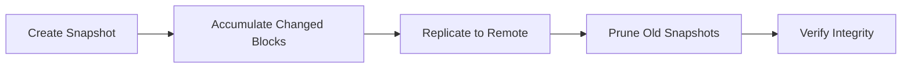
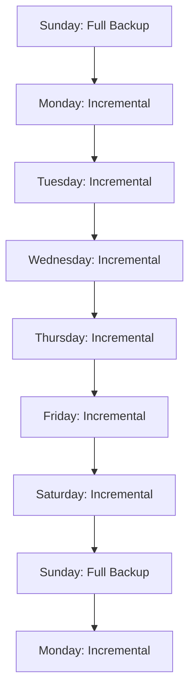
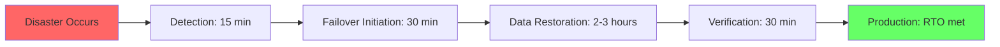

## The 3-2-1 Backup Rule

The 3-2-1 rule is the minimum standard for data protection:

- **3** copies of your data
- **2** different storage media (e.g., HDD and cloud)
- **1** copy offsite (e.g., cloud, another building, another geographic region)

ZFS makes this rule easy to implement:

1. **Primary copy:** Your live ZFS pool.
2. **Secondary copy:** A second ZFS pool (on the same NAS or a second NAS) via snapshot and
   send/receive.
3. **Tertiary copy (offsite):** Cloud storage via TrueNAS Cloud Sync or a remote NAS via ZFS
   replication.

:::warning
The 3-2-1 rule is a minimum, not a maximum. For critical data, consider extending to
3-2-1-1-0: 3 copies, 2 media, 1 offsite, 1 air-gapped (disconnected), 0 errors (verified restores).
:::

---

## ZFS Snapshots

### Snapshot Lifecycle



### Snapshot Types

| Type             | Trigger            | Retention                   | Use Case                |
| ---------------- | ------------------ | --------------------------- | ----------------------- |
| Periodic         | Cron schedule      | Configured policy           | Day-to-day protection   |
| Pre-dataset sync | Before replication | Until replication completes | Consistency             |
| Manual           | Administrator      | Manual                      | Before risky operations |
| Boot environment | System update      | Until rollback needed       | System recovery         |

### Snapshot Retention Policies

TrueNAS provides built-in snapshot task scheduling with configurable retention:

| Schedule         | Naming Pattern     | Retention | Typical Use            |
| ---------------- | ------------------ | --------- | ---------------------- |
| Every 15 minutes | `autosnap_15min`   | 1 day     | Active work, databases |
| Hourly           | `autosnap_hourly`  | 2 days    | General use            |
| Daily            | `autosnap_daily`   | 2 weeks   | File servers           |
| Weekly           | `autosnap_weekly`  | 1 month   | Media, archives        |
| Monthly          | `autosnap_monthly` | 1 year    | Long-term retention    |

### Snapshot Space Management

Snapshots only consume space when data is modified or deleted after the snapshot is taken. Monitor
snapshot space usage:

```bash
# List all snapshots with space usage
zfs list -t snapshot -o name,used,refer,written

# Check how much space snapshots are using on a dataset
zfs list -o name,used,usedbysnapshots,usedbydataset,usedbyrefreservation tank/data

# Find the largest snapshots
zfs list -t snapshot -S used -o name,used | head -20
```

### Destroying Snapshots

Snapshots can be destroyed to reclaim space, but you cannot destroy an individual snapshot if it has
clones. Destroy all clones first, or use `zfs destroy -R` to recursively destroy a snapshot and all
its dependents.

```bash
# Destroy a specific snapshot
zfs destroy tank/data@daily.2024-01-01

# Destroy all snapshots older than 90 days (using zfs-auto-snapshot naming)
zfs list -t snapshot -o name -s creation | \
  awk '/tank\/data@autosnap_daily/ && $1 < "tank/data@autosnap_daily_$(date -d '90 days ago' +%Y-%m-%d)"' | \
  xargs -n1 zfs destroy
```

---

## ZFS Send/Receive

### Full and Incremental Replication

ZFS send/receive is the native mechanism for creating exact copies of datasets. It works at the
block level, transferring only the changed blocks.

```bash
# Initial full replication
zfs send -Rv tank/data@snapshot1 | ssh remote-nas zfs recv -F backup/data

# Incremental replication
zfs send -Rvi tank/data@snapshot1 tank/data@snapshot2 | \
  ssh remote-nas zfs recv -F backup/data

# Encrypted replication over SSH
zfs send -Rcv tank/data@snapshot2 | \
  ssh -c aes128-ctr remote-nas zfs recv -F backup/data
```

### Send Flags

| Flag | Meaning                                     | When to Use                    |
| ---- | ------------------------------------------- | ------------------------------ |
| `-R` | Recursive — send all child datasets         | Replicating entire hierarchies |
| `-p` | Send properties                             | Preserving dataset settings    |
| `-c` | Compress data during transfer               | Slow or metered network links  |
| `-v` | Verbose output                              | Monitoring progress            |
| `-i` | Incremental (from snapshot)                 | All subsequent replications    |
| `-w` | Raw send (preserves encryption)             | Encrypted datasets             |
| `-L` | Large block send (for recordsize &gt; 128K) | Large recordsize datasets      |

### Bandwidth Limiting

For bandwidth-constrained network links, use `pv` or `trickle` to limit transfer rate:

```bash
# Limit transfer to 50 MB/s using pv
zfs send -Rv tank/data@snapshot2 | \
  pv -rat -b -s $(zfs send -nPv tank/data@snapshot2 | tail -1 | awk '{print $NF}') | \
  ssh remote-nas zfs recv -F backup/data
```

---

## Cloud Sync

### Supported Cloud Providers

TrueNAS Cloud Sync supports:

| Provider             | Protocol      | Encryption        | Notes                |
| -------------------- | ------------- | ----------------- | -------------------- |
| Amazon S3            | S3 API        | TLS + server-side | Most common          |
| Backblaze B2         | S3-compatible | TLS               | Cost-effective       |
| Google Cloud Storage | S3-compatible | TLS               | Good for GCP users   |
| Microsoft Azure Blob | Azure API     | TLS               | Good for Azure users |
| Wasabi               | S3-compatible | TLS               | No egress fees       |
| MinIO                | S3-compatible | TLS               | Self-hosted S3       |

### Cloud Sync Configuration

1. Navigate to **Data Protection** → **Cloud Sync** → **Add**.
2. Select the source (local dataset or snapshot).
3. Select the cloud provider and configure credentials.
4. Choose the transfer mode:
   - **Sync:** One-way mirror from local to cloud.
   - **Move:** Transfer to cloud and delete local copies.
5. Set the schedule (real-time, hourly, daily).
6. Configure snapshot retention on the cloud side.

### Cloud Sync Considerations

- **Egress costs:** Most cloud providers charge for data egress (download). Backblaze B2 and Wasabi
  are exceptions with no egress fees.
- **Upload bandwidth:** Uploading to cloud is limited by your ISP's upload speed. A 1 TB backup over
  a 50 Mbps upload connection takes ~48 hours.
- **Encryption:** TrueNAS can encrypt data before uploading (client-side encryption), ensuring the
  cloud provider cannot read your data. Configure this under "Encryption" in the Cloud Sync task.
- **Versioning:** Enable cloud bucket versioning to protect against accidental deletion or
  ransomware.

---

## Backup Verification

### The Restore Test

A backup that has never been tested is not a backup — it is a hope. Regularly test your backup
restore procedure:

1. **Monthly:** Restore a random subset of files from the most recent backup and verify integrity.
2. **Quarterly:** Perform a full dataset restore to a test environment and validate application
   functionality.
3. **Annually:** Test a bare-metal restore (pool recovery from replicated snapshots).

```bash
# Test restore from a snapshot
zfs clone tank/data@daily.2024-01-15 tank/data-test-restore
ls -la /mnt/tank/data-test-restore
# Verify file contents, permissions, timestamps
zfs destroy tank/data-test-restore
```

### Backup Monitoring

Set up monitoring and alerting to detect backup failures:

1. **Snapshot task failures:** TrueNAS sends alerts when snapshot tasks fail. Configure email
   notifications under **System** → **Alert Settings**.
2. **Replication failures:** Monitor the replication task status and ensure the lag time between
   source and destination is within your RPO target.
3. **Cloud sync failures:** Cloud sync tasks can fail due to credential expiration, network issues,
   or quota limits. Set up alerting for these failures.
4. **Storage capacity:** Monitor both local and remote backup storage capacity. A full backup
   destination is as bad as no backup.

---

## RPO and RTO

### Recovery Point Objective (RPO)

RPO defines the maximum acceptable data loss measured in time. If your RPO is 1 hour, your backup
strategy must ensure that no more than 1 hour of data can be lost.

| RPO                | Strategy                              | TrueNAS Configuration                        |
| ------------------ | ------------------------------------- | -------------------------------------------- |
| 0 (zero data loss) | Synchronous replication               | Active-passive cluster with shared storage   |
| 15 minutes         | Frequent snapshots + replication      | Snapshot every 15 min, replicate immediately |
| 1 hour             | Hourly snapshots + replication        | Snapshot every hour, replicate hourly        |
| 24 hours           | Daily snapshots + daily replication   | Snapshot daily, replicate daily              |
| 1 week             | Weekly snapshots + weekly replication | Snapshot weekly, replicate weekly            |

### Recovery Time Objective (RTO)

RTO defines the maximum acceptable downtime after a disaster. If your RTO is 4 hours, you must be
able to restore service within 4 hours.

| RTO     | Strategy                                              |
| ------- | ----------------------------------------------------- |
| Minutes | Active-passive cluster with automatic failover        |
| Hours   | Standby hardware + ZFS replication + scripted restore |
| Days    | New hardware + cloud backup restore                   |

---

## Ransomware Protection

### Immutable Snapshots

TrueNAS supports snapshot retention policies that prevent snapshot deletion within a configured time
window. This protects against ransomware that attempts to encrypt files and delete snapshots:

1. Configure a snapshot task with a retention period that exceeds your recovery window.
2. TrueNAS SCALE supports "protected" snapshots that cannot be deleted manually within the retention
   period.
3. For maximum protection, replicate snapshots to a separate system where the replication
   destination has its own snapshot retention policy.

### Defense in Depth

1. **Immutable snapshots:** Prevent snapshot deletion.
2. **Offsite replication:** Even if the primary system is compromised, the offsite copy is
   protected.
3. **Air-gapped backup:** Periodically create a backup that is disconnected from the network.
4. **User education:** Train users on phishing and suspicious attachments.
5. **Network segmentation:** Limit access to the NAS from untrusted networks.

---

## Backup Encryption

### At-Rest Encryption

TrueNAS supports dataset-level encryption using AES-256-GCM:

1. Create an encrypted dataset or pool.
2. The encryption key is protected by a passphrase or a key file.
3. Without the key, the data is unreadable — even if the drives are physically stolen.

```bash
# Create an encrypted dataset
zfs create -o encryption=on -o keyformat=passphrase -o keylocation=prompt \
    tank/encrypted-data

# Mount the encrypted dataset (requires the passphrase)
zfs mount -l tank/encrypted-data
```

### Encryption Considerations

- **Performance impact:** AES-NI hardware acceleration makes the overhead negligible on modern CPUs
  (typically 1–3%).
- **Key management:** You must securely store the encryption key/passphrase. Losing the key means
  losing the data permanently. Store keys in a password manager, hardware security module, or
  offline location.
- **Send/receive:** Encrypted datasets can be sent with raw mode (`-w`), preserving encryption
  without needing to decrypt and re-encrypt.
- **Backup implications:** If you replicate an encrypted dataset to an untrusted location, the
  destination cannot read the data without the key.

---

## Common Pitfalls

### Not Testing Restores

The most common backup failure is not testing the restore procedure. Backups can fail silently
(corrupt snapshots, incomplete transfers, credential expiration) and you will not discover the
problem until you need to restore. Test restores monthly at minimum.

### Relying on a Single Backup

A single backup copy (even if it is offsite) is vulnerable to the same failure that destroyed the
primary (ransomware, fire, flood). Always maintain at least two independent backup copies on
different media.

### Ignoring Backup Window Constraints

Large backups over slow network links can take longer than the backup window allows, causing backup
tasks to overlap and potentially fail. Calculate your backup size and network bandwidth to ensure
backups complete within the window:

$$
Time = \frac{Data\_Size}{Bandwidth \times Efficiency}
$$

Where efficiency accounts for compression and deduplication (typically 0.5–0.8 for compressed data).

### Forgetting to Rotate Encryption Keys

If your encryption keys are compromised, all data encrypted with those keys is at risk. Implement a
key rotation policy (e.g., annually) and ensure you can re-encrypt data with new keys. ZFS does not
natively support key rotation on existing datasets — you must create a new encrypted dataset and
copy the data.

### Snapshot Explosion

Creating too many snapshots (e.g., every 5 minutes without pruning) can consume all available pool
space. Always configure retention policies that limit the total number of snapshots per dataset.
Monitor snapshot space usage with `zfs list -o name,usedbysnapshots`.

## Backup Strategy Design

### Full + Incremental Strategy

The most storage-efficient backup strategy combines periodic full backups with frequent incremental
backups:



**Storage calculation:**

$$
Total\_Storage = N_{weeks} \times Full\_Size + N_{days} \times Daily\_Incremental\_Size
$$

For a 1 TB dataset with 5% daily change rate:

$$
Total\_Storage = 4 \times 1 \text{ TB} + 28 \times 50 \text{ GB} = 4 \text{ TB} + 1.4 \text{ TB} = 5.4 \text{ TB}
$$

### Synthetic Full Backup

A synthetic full backup constructs a full backup from the last full backup and all subsequent
incrementals, without reading the source data again. This reduces the load on the production system:

1. **Initial full backup:** Read all data from source.
2. **Daily incrementals:** Read only changed blocks from source.
3. **Weekly synthetic full:** Construct full backup from incremental chain on the backup
   destination.

TrueNAS supports synthetic full backups through its replication task configuration.

### Backup Window Calculation

Calculate the time required for each backup type:

$$
Time = \frac{Data\_Size}{Effective\_Bandwidth}
$$

Where `Effective_Bandwidth` accounts for compression, deduplication, and network overhead (typically
50–80% of raw bandwidth).

| Backup Type      | Data Size | Network Bandwidth | Effective Bandwidth | Time        |
| ---------------- | --------- | ----------------- | ------------------- | ----------- |
| Full (1 TB)      | 1 TB      | 1 Gbps            | 80 MB/s             | ~3.5 hours  |
| Incremental (5%) | 50 GB     | 1 Gbps            | 80 MB/s             | ~10 minutes |
| Full (1 TB)      | 1 TB      | 100 Mbps          | 8 MB/s              | ~35 hours   |

## ZFS Snapshot Advanced Configuration

### Snapshot Retention Automation

```bash
# TrueNAS snapshot task configuration (via web UI):
# Navigate to Data Protection → Snapshot Tasks → Add
#
# For daily snapshots with 2-week retention:
#   Dataset: tank/data
#   Schedule: Daily at 00:00
#   Retention: Keep 14 snapshots with naming convention: auto-daily-%Y%m%d-%H%M%S
#
# For weekly snapshots with 3-month retention:
#   Dataset: tank/data
#   Schedule: Weekly on Sunday at 02:00
#   Retention: Keep 12 snapshots with naming convention: auto-weekly-%Y%m%d-%H%M%S
#
# For monthly snapshots with 1-year retention:
#   Dataset: tank/data
#   Schedule: Monthly on the 1st at 03:00
#   Retention: Keep 12 snapshots with naming convention: auto-monthly-%Y%m%d-%H%M%S
```

### Snapshot Space Monitoring

```bash
# Check snapshot space usage per dataset
zfs list -o name,used,usedbysnapshots,usedbydataset -r tank

# Find datasets where snapshots use more than 10% of total space
zfs list -o name,used,usedbysnapshots -r tank | awk '$3 > 0.1 * $2 {print}'

# Destroy snapshots matching a pattern (older than 30 days)
zfs list -t snapshot -o name -s creation | \
  awk '/tank\/data@auto-daily-/ && substr($1, length($1)-7) < strftime("%Y%m%d", systime()-30*86400)' | \
  xargs -n1 zfs destroy

# Or use TrueNAS's built-in snapshot task with retention policy
```

## Cloud Sync Advanced Configuration

### AWS S3 Configuration

```bash
# TrueNAS Cloud Sync configuration for AWS S3:
# Provider: Amazon S3
# Bucket: my-nas-backup
# Region: us-east-1
# Access Key: AKIA...
# Secret Key: ...
# Folder: /tank/data/
# Transfer Mode: SYNC (one-way mirror)
# Schedule: Daily at 04:00
# Snapshot: Include latest snapshot
# Encryption: AES-256 (client-side)
# Compression: Enabled (gzip)
```

### Backblaze B2 Configuration

Backblaze B2 is a cost-effective alternative to AWS S3 for backup storage:

- **No egress fees:** Download data for free.
- **Storage cost:** Approximately USD 5/TB/month.
- **Download cost:** Free.
- **API compatible with S3** (use S3-compatible provider in TrueNAS).

### Cloud Sync Performance Optimization

1. **Enable client-side encryption and compression:** Reduces upload data volume.
2. **Schedule during off-peak hours:** Minimize impact on production network.
3. **Use multipart uploads:** Large files are uploaded in parts, improving reliability.
4. **Monitor transfer logs:** Check for errors, timeouts, or throttling.

## Disaster Recovery Planning

### RPO/RTO Matrix

| Data Category        | RPO    | RTO      | Backup Method                   | Recovery Procedure         |
| -------------------- | ------ | -------- | ------------------------------- | -------------------------- |
| Critical databases   | 15 min | 1 hour   | ZFS replication + snapshots     | Failover to replica        |
| User files           | 1 day  | 4 hours  | Daily snapshots + cloud sync    | Restore from snapshot      |
| Media library        | 1 week | 24 hours | Weekly snapshots + cloud sync   | Restore from cloud         |
| System configuration | 1 day  | 2 hours  | Daily snapshots + config export | Reinstall + restore config |

### Disaster Recovery Runbook

1. **Assess the disaster.** What was lost? Pool, server, site?
2. **Verify backups are intact.** Log into the backup destination and verify recent snapshots exist
   and are readable.
3. **Prioritize recovery.** Restore critical data first, then less critical data.
4. **Test the restore.** Restore a sample of data and verify integrity.
5. **Document the recovery.** Record what was restored, what was lost, and the timeline.

### Site Disaster Recovery

If the entire TrueNAS server is lost (fire, flood, theft):

1. **Procure replacement hardware.** Match the original specifications if possible.
2. **Install TrueNAS on the new hardware.**
3. **Import the remote replica pool.** If using ZFS replication, the remote pool can be imported
   directly.
4. **Configure services.** Restore SMB shares, NFS exports, users, and permissions from the
   configuration backup.
5. **Verify data integrity.** Run a scrub on the imported pool.
6. **Restore any data not in the replication.** Use cloud sync or offline backups.

## Backup Encryption Details

### Dataset-Level Encryption

TrueNAS SCALE supports ZFS native encryption:

```bash
# Create an encrypted dataset
zfs create -o encryption=on -o keyformat=passphrase -o keylocation=prompt \
    -o compression=zstd tank/encrypted

# Mount (requires passphrase)
zfs mount -l tank/encrypted

# Change passphrase
zfs change-key tank/encrypted

# Check encryption status
zfs get encryption tank/encrypted
```

### Key Management

Encryption keys can be managed in several ways:

| Method     | Storage            | Security         | Convenience |
| ---------- | ------------------ | ---------------- | ----------- |
| Passphrase | Human memory       | High (if strong) | Medium      |
| Key file   | File on disk/USB   | Medium           | High        |
| Hex key    | Configuration file | Medium           | High        |
| PKCS#11    | Hardware token     | Very High        | Low         |

### Key Escrow

Store encryption keys in a secure, offsite location:

1. **Password manager:** Store the passphrase in a password manager (Bitwarden, 1Password).
2. **Physical copy:** Write the passphrase on paper and store in a safe deposit box.
3. **Key escrow service:** Some password managers offer key escrow for trusted contacts.

:::danger
If you lose the encryption key, all data on the encrypted dataset is permanently
irrecoverable. There is no backdoor. Always have a verified backup of the key.
:::

## Backup Monitoring and Alerting

### TrueNAS Backup Alert Configuration

Configure alerts under **System** → **Alert Settings** → **Advanced**:

| Alert Condition                  | Severity | Action                             |
| -------------------------------- | -------- | ---------------------------------- |
| Snapshot task failed             | Critical | Investigate immediately            |
| Replication lag exceeds 24 hours | Warning  | Check network and destination      |
| Cloud sync failed                | Critical | Check credentials and connectivity |
| Pool capacity above 80%          | Warning  | Plan expansion                     |
| SMART predictive failure         | Critical | Replace drive immediately          |
| Scrub errors found               | Critical | Investigate and repair             |

### Backup Health Dashboard

Create a Grafana dashboard to monitor backup health:

- **Panel 1:** Replication lag (hours since last successful replication)
- **Panel 2:** Snapshot count per dataset (line chart over time)
- **Panel 3:** Snapshot space usage per dataset (stacked area chart)
- **Panel 4:** Cloud sync status (success/failure count over time)
- **Panel 5:** Pool capacity gauge
- **Panel 6:** SMART health status table

### Automated Backup Verification

```bash
#!/bin/bash
# Verify backup integrity by comparing source and destination checksums
# Run weekly as a cron job

SOURCE="tank/data"
DEST="backup/data"
SNAPSHOT="verify-$(date +%Y%m%d)"

# Create a snapshot of the source
zfs snapshot ${SOURCE}@${SNAPSHOT}

# Send to backup destination (dry run to compare)
zfs send -Rnv ${SOURCE}@${SNAPSHOT} > /tmp/verify_output.txt

# Check the output for any errors
if grep -q "error\|failed\|corrupt" /tmp/verify_output.txt; then
    echo "BACKUP VERIFICATION FAILED" | mail -s "Backup Alert" admin@example.com
else
    echo "BACKUP VERIFICATION PASSED" | mail -s "Backup OK" admin@example.com
fi

# Clean up verification snapshot
zfs destroy ${SOURCE}@${SNAPSHOT}
```

## Incremental Chain Management

ZFS incremental send/receive creates a chain of snapshots where each new snapshot contains only the
changes since the previous one. Managing these chains correctly is critical for both efficiency and
recoverability.

### How Incremental Chains Work

```bash
# Full send (baseline)
zfs send tank/data@base | zfs recv backup/data

# Incremental send (changes between base and snap1)
zfs send -i tank/data@base tank/data@snap1 | zfs recv backup/data

# Another incremental (changes between snap1 and snap2)
zfs send -i tank/data@snap1 tank/data@snap2 | zfs recv backup/data
```

The receiving side must have the base snapshot (`@base`) and all intermediate snapshots to apply an
incremental send. If any intermediate snapshot is missing, the receive fails.

### Handling Broken Chains

A broken chain occurs when an intermediate snapshot is destroyed on either side. To recover:

```bash
# Scenario: @snap1 was destroyed on the backup, breaking the chain
# Option 1: Find the last common snapshot and do a new full send
LAST_COMMON=$(zfs list -t snapshot -o name -s creation backup/data | tail -1)
echo "Last common snapshot: $LAST_COMMON"

# Option 2: Use zfs send -R to send all snapshots including intermediates
# This re-creates the full history on the receiving side
zfs send -R tank/data@snap2 | zfs recv -F backup/data
```

### Deduplicated Incremental Sends

When using ZFS deduplication (not recommended for most workloads due to RAM overhead), incremental
sends automatically deduplicate. However, the dedup table must be present on both sides:

```bash
# Check dedup table size (warning: can be enormous)
zpool get dedupratio tank
zdb -D tank 2>/dev/null | head -5

# If dedup ratio is close to 1.00x, dedup is not saving space but still consuming RAM
# Consider disabling dedup: zfs set dedup=off tank/data
```

### Resumable Send/Receive

TrueNAS and OpenZFS 2.0+ support resumable send/receive, which is critical for large datasets where
network interruptions are possible:

```bash
# Send with resume token (TrueNAS UI handles this automatically for replication tasks)
# From CLI:
zfs send -v tank/data@snap1 | zfs recv -s backup/data

# If interrupted, the receive side generates a token
# Check for resume tokens:
zfs get receive_resume_token backup/data

# Resume the transfer using the token
zfs recv -s backup/data <<< "$(zfs get -H -o value receive_resume_token backup/data)"
```

:::tip
Resume tokens expire after approximately 5 minutes of inactivity in some implementations. For
very large transfers over unreliable networks, consider using `mbuffer` as a network buffer to
absorb short interruptions:

```bash
# Sender side
zfs send tank/data@snap1 | mbuffer -W 300 -s 128k -m 1G 10.0.0.20:9090

# Receiver side
mbuffer -s 128k -m 1G -I 9090 | zfs recv backup/data
```

:::

## Monthly and Quarterly Verification Procedures

A backup that has never been tested is not a backup. Establish a regular verification cadence to
catch silent corruption, configuration drift, and restoration procedure issues.

### Monthly Verification Checklist

```bash
#!/bin/bash
# monthly-backup-verify.sh
# Run on the first Saturday of each month via cron

set -euo pipefail
LOG="/var/log/backup-verify-$(date +%Y-%m).log"
VERIFIED_COUNT=0
FAILED_COUNT=0

echo "=== Monthly Backup Verification: $(date) ===" | tee -a "$LOG"

# 1. Verify all replication tasks completed successfully
for task in $(midclt call replication.query | jq -r '.[].id'); do
  status=$(midclt call replication.get_instance "$task" | jq -r '.status')
  if [ "$status" != "SUCCESS" ]; then
    echo "FAIL: Replication task $task last status: $status" | tee -a "$LOG"
    FAILED_COUNT=$((FAILED_COUNT + 1))
  else
    echo "OK: Replication task $task" | tee -a "$LOG"
    VERIFIED_COUNT=$((VERIFIED_COUNT + 1))
  fi
done

# 2. Test restore of a random file from each major dataset
for dataset in tank/data tank/photos tank/documents; do
  # Pick a random file
  RANDOM_FILE=$(find /mnt/$dataset -type f | shuf -n 1)
  RELATIVE_PATH="${RANDOM_FILE#/mnt/}"

  # Find the backup location and verify the file exists there
  echo "Checking: $RELATIVE_PATH" | tee -a "$LOG"

  # Compute checksums on source and backup
  SOURCE_CKSUM=$(sha256sum "$RANDOM_FILE" | awk '{print $1}')
  BACKUP_FILE="/mnt/backup_pool/$RELATIVE_PATH"
  if [ -f "$BACKUP_FILE" ]; then
    BACKUP_CKSUM=$(sha256sum "$BACKUP_FILE" | awk '{print $1}')
    if [ "$SOURCE_CKSUM" = "$BACKUP_CKSUM" ]; then
      echo "OK: $RELATIVE_PATH checksums match" | tee -a "$LOG"
      VERIFIED_COUNT=$((VERIFIED_COUNT + 1))
    else
      echo "FAIL: $RELATIVE_PATH checksum MISMATCH" | tee -a "$LOG"
      FAILED_COUNT=$((FAILED_COUNT + 1))
    fi
  else
    echo "FAIL: $RELATIVE_PATH not found in backup" | tee -a "$LOG"
    FAILED_COUNT=$((FAILED_COUNT + 1))
  fi
done

# 3. Summary
echo "=== Results: $VERIFIED_COUNT passed, $FAILED_COUNT failed ===" | tee -a "$LOG"
if [ "$FAILED_COUNT" -gt 0 ]; then
  echo "BACKUP VERIFICATION FAILED" | mail -s "Monthly Backup FAIL" admin@example.com
  exit 1
fi
```

### Quarterly Full Restoration Test

Every quarter, perform a full dataset restoration to a temporary location and verify application
integrity:

```bash
# 1. Receive a full backup to a test pool
zfs send -R tank/data@quarterly-test | zfs recv -o mountpoint=/mnt/test_restore test_pool/data

# 2. Run application-specific integrity checks
# For a database:
docker run --rm -v /mnt/test_restore/pgdata:/var/lib/postgresql/data \
  postgres:15 pg_verifybackup /var/lib/postgresql/data

# For a file server:
find /mnt/test_restore -type f -exec md5sum {} \; > /tmp/test_checksums.txt
# Compare against production checksums taken at snapshot time
diff /tmp/production_checksums.txt /tmp/test_checksums.txt

# 3. Measure restoration time for RTO validation
START=$(date +%s)
zfs send -R tank/data@quarterly-test | zfs recv -F test_pool/data_restore
END=$(date +%s)
echo "Full restoration time: $((END - START)) seconds"
# Compare against your RTO target
```

## RPO and RTO Calculation Examples

### Recovery Point Objective (RPO)

RPO defines the maximum acceptable data loss measured in time. If your RPO is 1 hour, you can afford
to lose up to 1 hour of data.

```bash
# Calculate actual RPO from snapshot schedule
# Snapshots: hourly, replication: every 4 hours
# Worst case: replication fails right after snapshot, next successful replication is 4 hours later
# Actual RPO = snapshot_interval + replication_interval = 1h + 4h = 5 hours

# If business requires RPO of 1 hour:
# Option A: Replicate every hour (increases bandwidth usage)
# Option B: Use synchronous replication (requires low-latency link, &lt;5ms)
# Option C: Use application-level replication (e.g., PostgreSQL streaming replication)
```

### Recovery Time Objective (RTO)

RTO defines the maximum acceptable downtime. If your RTO is 4 hours, the system must be fully
restored within 4 hours of a disaster.



### RPO/RTO Matrix by Workload

| Workload                | Acceptable RPO     | Acceptable RTO | Recommended Strategy                            |
| ----------------------- | ------------------ | -------------- | ----------------------------------------------- |
| Production database     | 0 (zero data loss) | 15-30 min      | Synchronous replication + streaming replication |
| File server (documents) | 1 hour             | 4 hours        | Hourly snapshots + 4-hourly replication         |
| Media library           | 24 hours           | 24 hours       | Daily snapshots + daily replication             |
| Development environment | 24 hours           | 48 hours       | Daily snapshots + weekly replication            |
| Archive/cold storage    | 7 days             | 72 hours       | Weekly snapshots + monthly cloud sync           |

## Cloud Sync Error Handling and Retention

TrueNAS Cloud Sync tasks can fail silently if not properly monitored. Common failure modes include
authentication token expiration, rate limiting, and network timeouts.

### Monitoring Cloud Sync Tasks

```bash
# List all cloud sync tasks and their last run status
midclt call cloudsync.query | jq '.[] | {id, description, job: .job.name, state: .job.state}'

# Get detailed error information for a failed task
TASK_ID=1
midclt call cloudsync.get_instance "$TASK_ID" | jq '.'

# Check cloud sync logs
ls -la /var/log/cloudsync/
cat /var/log/cloudsync/cloudsync.log | tail -50
```

### Setting Up Retention Policies

Cloud sync retention policies prevent cloud storage costs from growing unboundedly:

```bash
# Configure retention via CLI (TrueNAS SCALE)
midclt call cloudsync.update 1 '{
  "snapshot": true,
  "retention_policy": "CUSTOM",
  "lifetime": 90,
  "retention_count": 10
}'
```

Retention strategies:

| Strategy                      | When to Use                  | Trade-offs                            |
| ----------------------------- | ---------------------------- | ------------------------------------- |
| Count-based (keep last N)     | Unpredictable snapshot sizes | May keep too much or too little data  |
| Time-based (keep last N days) | Predictable recovery window  | Storage usage varies with change rate |
| Custom (count + lifetime)     | Balanced approach            | More complex to reason about          |

### Handling Rate Limits

Cloud providers impose API rate limits that can cause sync failures:

```bash
# AWS S3: 5,500 GET/HEAD requests per second per prefix
# Google Cloud Storage: 4,000 read operations per second
# Backblaze B2: varies by plan

# Reduce rate by:
# 1. Increasing transfer chunk size
# 2. Reducing concurrent connections
# 3. Syncing less frequently
# 4. Using multipart uploads for large files

# Configure chunk size and concurrency in TrueNAS
midclt call cloudsync.update 1 '{
  "transfer_threads": 4,
  "chunk_size": 524288000
}'
```

## Ransomware Protection and Recovery

ZFS snapshots are inherently resistant to ransomware because they are read-only and cannot be
modified by compromised clients. However, additional measures are needed for comprehensive
protection.

### Immutable Snapshots

TrueNAS supports holding snapshots to prevent even administrators from deleting them:

```bash
# Hold a snapshot (prevents deletion until released)
zfs hold keep_forever tank/data@snap1

# List holds on a dataset
zfs holds tank/data

# Release a hold (requires explicit admin action)
zfs release keep_forever tank/data@snap1

# Create a periodic hold script for critical datasets
#!/bin/bash
# Run weekly: hold the latest snapshot for 1 year
DATASETS="tank/data tank/photos tank/documents"
TAG="annual-hold-$(date +%Y)"

for ds in $DATASETS; do
  LATEST=$(zfs list -t snapshot -o name -s creation "$ds" | tail -1)
  zfs hold "$TAG" "$LATEST"
done
```

### Detecting Ransomware Activity

Monitor for sudden increases in file modification or deletion rates:

```bash
# Alert on rapid file changes (potential ransomware)
#!/bin/bash
THRESHOLD=1000  # files changed per minute
DATASET="tank/data"

while true; do
  CHANGES=$(zfs diff -FH "$DATASET@1min-ago" 2>/dev/null | wc -l)
  if [ "$CHANGES" -gt "$THRESHOLD" ]; then
    echo "ALERT: $CHANGES file changes detected in $DATASET in the last minute" \
      | mail -s "RANSOMWARE ALERT" admin@example.com
    # Optionally create an emergency snapshot before more damage occurs
    zfs snapshot "$DATASET@emergency-$(date +%Y%m%d-%H%M%S)"
  fi
  sleep 60
done
```

### Recovery Procedure

If ransomware is detected:

```bash
# 1. Immediately disconnect affected shares to stop the spread
midclt call smb.update '{"shares": [{"name": "infected-share", "enabled": false}]}'

# 2. Identify the last clean snapshot (before infection)
zfs list -t snapshot -o name,creation -s creation tank/data | tail -20

# 3. Roll back to the last clean snapshot
zfs rollback -r tank/data@clean-snapshot

# 4. Verify data integrity after rollback
find /mnt/tank/data -type f -mtime -1 | head -50  # Check recently modified files
```

## Client-Side Encryption for Cloud Backups

When syncing backups to cloud storage, encrypt data before it leaves your network. TrueNAS supports
client-side encryption for cloud sync tasks.

### Setting Up Encryption

```bash
# Create an encryption key (store this securely offline)
openssl rand -base64 32 > /root/cloud-sync-key.enc
chmod 400 /root/cloud-sync-key.enc

# Configure cloud sync to use encryption
midclt call cloudsync.update 1 '{
  "encryption": true,
  "encryption_key": "'"$(cat /root/cloud-sync-key.enc)"'",
  "encryption_cipher": "AES-256-GCM"
}'
```

:::warning
If you lose the encryption key, all cloud backups become permanently unrecoverable. Store
encryption keys in multiple secure locations: a password manager, a hardware security key, and a
printed copy in a physical safe. Never store encryption keys alongside the backups themselves.
:::

### Compliance Considerations

For environments subject to regulatory requirements (GDPR, HIPAA, SOC 2), document your backup and
encryption procedures:

- **Data classification:** Identify which datasets contain regulated data.
- **Encryption at rest:** Cloud storage providers encrypt at rest, but client-side encryption adds a
  layer of protection against provider-side breaches.
- **Data residency:** Some regulations require data to remain in specific geographic regions. Choose
  cloud providers with data centers in compliant regions.
- **Retention policies:** Regulations may mandate minimum or maximum retention periods. Configure
  snapshot and cloud sync retention accordingly.
- **Audit trail:** Enable logging for all backup and restoration operations.

```bash
# Enable audit logging for ZFS operations
# In /etc/sysctl.conf:
echo "vfs.zfs.zfs_events.class.include=\"all\"" > /etc/sysctl.d/99-zfs-audit.conf
sysctl -p /etc/sysctl.d/99-zfs-audit.conf
```

## Automation Scripts

### Nightly Backup Health Check

```bash
#!/bin/bash
# /mnt/pool/scripts/backup-health.sh
# Run daily at 06:00 via cron

set -euo pipefail
ALERT_EMAIL="admin@example.com"
ERRORS=()

# Check 1: All datasets have recent snapshots
for ds in $(zfs list -o name -H | grep -v "^tank/boot$"); do
  NEWEST=$(zfs list -t snapshot -o creation -s creation "$ds" | tail -1)
  AGE_HOURS=$(( ($(date +%s) - $(date -d "$NEWEST" +%s)) / 3600 ))
  if [ "$AGE_HOURS" -gt 26 ]; then
    ERRORS+=("WARNING: $ds has no snapshot in ${AGE_HOURS}h")
  fi
done

# Check 2: Replication tasks are healthy
for task in $(midclt call replication.query | jq -r '.[].id'); do
  LAST_RUN=$(midclt call replication.get_instance "$task" | jq -r '.job.time_started')
  LAST_STATUS=$(midclt call replication.get_instance "$task" | jq -r '.job.state')
  if [ "$LAST_STATUS" != "SUCCESS" ]; then
    ERRORS+=("FAIL: Replication task $task status=$LAST_STATUS (last run: $LAST_RUN)")
  fi
done

# Check 3: Pool health
POOL_HEALTH=$(zpool status -x)
if echo "$POOL_HEALTH" | grep -q "DEGRADED\|FAULTED\|OFFLINE"; then
  ERRORS+=("CRITICAL: Pool health issue - $POOL_HEALTH")
fi

# Report
if [ ${#ERRORS[@]} -gt 0 ]; then
  printf "%s\n" "${ERRORS[@]}" | mail -s "BACKUP HEALTH ALERT" "$ALERT_EMAIL"
fi
```
