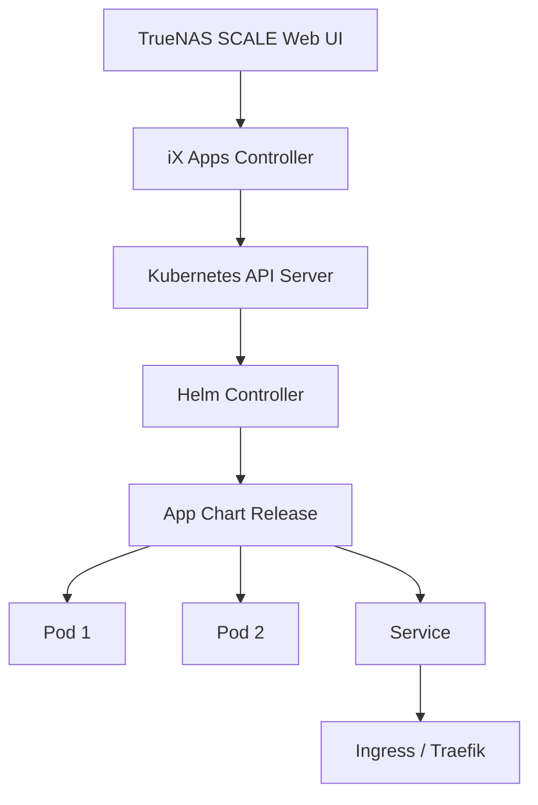

## TrueNAS SCALE Apps

### Kubernetes-Based App Architecture

TrueNAS SCALE uses a Kubernetes-based application framework. Apps run as Helm charts deployed into a
lightweight Kubernetes cluster managed by TrueNAS. This provides:

- Container orchestration (restart policies, health checks)
- Service discovery and networking
- Persistent storage via iX volumes (backed by ZFS datasets)
- Resource limits (CPU, memory)
- Rollback capabilities

### App Catalog

TrueNAS SCALE provides two app catalogs:

| Catalog   | Source                | Update Frequency | Trust Level                      |
| --------- | --------------------- | ---------------- | -------------------------------- |
| Official  | TrueNAS/iXsystems     | Regular          | High — tested by iXsystems       |
| Community | Community-contributed | Variable         | Medium — review before deploying |
| Custom    | Your own charts       | Manual           | Depends on source                |

### Installing Apps

1. Navigate to **Apps** → **Settings** → Ensure the app pool and configuration are set.
2. Select the desired app from the catalog.
3. Configure the app settings (storage, networking, environment variables).
4. Deploy.

### Custom Apps

For applications not in the catalog, deploy custom Docker Compose or Helm charts:

1. Navigate to **Apps** → **Launch** → **Custom App**.
2. Choose "Docker Compose" or "Helm Chart."
3. Paste the compose file or Helm values.
4. Configure storage and network settings.
5. Deploy.

```yaml
# Example Docker Compose for a custom app
services:
  myapp:
    image: myapp:latest
    ports:
      - '8080:8080'
    volumes:
      - type: volume
        source: myapp-data
        target: /data
    environment:
      - TZ=UTC
      - LOG_LEVEL=info
```

---

## Common Self-Hosted Apps

### Media Server (Plex/Jellyfin)

**Plex** is a commercial media server with client apps for virtually every platform. **Jellyfin** is
the open-source alternative.

**TrueNAS configuration:**

1. Install Plex or Jellyfin from the app catalog.
2. Create a dataset for media: `tank/media/movies`, `tank/media/tv`, `tank/media/music`.
3. Configure storage mounts in the app settings to point to the media datasets.
4. Set the container's PUID/PGID to match the user that owns the media files.
5. For hardware transcoding (Plex Pass), configure GPU passthrough.

**Key considerations:**

- Transcoding requires significant CPU or GPU resources. An Intel QuickSync GPU or NVIDIA
  Quadro/Tesla is recommended.
- Direct play (no transcoding) requires no CPU/GPU and is preferred. Ensure your media is in a
  format compatible with your clients (H.264/H.265, AAC audio).
- Metadata databases should be stored on SSD-backed datasets for fast library scanning.

### Nextcloud

Nextcloud is a self-hosted file sync, collaboration, and communication platform.

**TrueNAS configuration:**

1. Install Nextcloud from the app catalog.
2. Create a dataset for Nextcloud data: `tank/apps/nextcloud/data`.
3. Create a database (MariaDB/PostgreSQL) — either as a separate app or using the built-in SQLite.
4. Configure the database connection in Nextcloud's environment variables.
5. Set up a reverse proxy (Traefik or Nginx Proxy Manager) for HTTPS.

**Key considerations:**

- Nextcloud's performance is heavily dependent on database performance. Use PostgreSQL on an SSD for
  best results.
- For large deployments, enable Redis caching and PHP OPcache.
- Regularly update Nextcloud — security updates are frequent.

### Home Assistant

Home Assistant is an open-source home automation platform.

**TrueNAS configuration:**

1. Install Home Assistant from the app catalog.
2. Create a dataset for configuration and data persistence.
3. Ensure the container has access to the host network (required for device discovery).
4. For Zigbee/Z-Wave USB dongles, pass through the USB device to the container.

### Vaultwarden

Vaultwarden is a lightweight, self-hosted Bitwarden-compatible password manager.

**TrueNAS configuration:**

1. Install Vaultwarden from the app catalog.
2. Create a dataset for data persistence.
3. Set up HTTPS via a reverse proxy (required for Bitwarden clients).
4. Enable WebSocket notifications (WebSocket support in the reverse proxy config).
5. Configure automated backups of the Vaultwarden data directory.

### Grafana + Prometheus Stack

For monitoring your TrueNAS and other systems:

1. Install the "Prometheus + Grafana" stack from the app catalog.
2. Configure Prometheus to scrape TrueNAS metrics (node exporter, SMART metrics).
3. Create Grafana dashboards for NAS health, storage capacity, and performance.
4. Set up alerting rules for disk failures, temperature, capacity thresholds.

---

## Virtual Machines

### VM Configuration on TrueNAS

TrueNAS SCALE supports KVM-based virtual machines with full hardware virtualization.

**Key settings:**

| Setting       | Recommendation | Notes                                             |
| ------------- | -------------- | ------------------------------------------------- |
| CPU           | 2+ vCPUs       | Pin to specific cores for performance             |
| Memory        | 4 GB+          | Use dynamic memory if workload varies             |
| Disk          | ZVOL           | Use `volblocksize=64K` or `128K`                  |
| Network       | VirtIO         | VirtIO is fastest; use `e1000` only for legacy OS |
| Boot firmware | UEFI           | Required for modern OS (Windows 11, Linux)        |
| Graphics      | VNC or SPICE   | SPICE provides better performance                 |

### GPU Passthrough

GPU passthrough allows a VM to directly access a physical GPU, enabling hardware acceleration for
gaming, ML workloads, or transcoding.

**Requirements:**

1. CPU and motherboard must support IOMMU (Intel VT-d or AMD-Vi).
2. GPU must support UEFI mode (NVIDIA GTX 900+ or AMD RX 400+).
3. Enable IOMMU in BIOS and add kernel parameters to TrueNAS.
4. The GPU must not be used by the host (no host display output from the passed-through GPU).

**Configuration steps:**

```bash
# Enable IOMMU (add to TrueNAS kernel parameters)
# For Intel: intel_iommu=on iommu=pt
# For AMD: amd_iommu=on iommu=pt

# Verify IOMMU groups
dmesg | grep -i iommu

# Check which devices are in each IOMMU group
find /sys/kernel/iommu_groups/ -type l | sort

# In the VM configuration:
# 1. Select the GPU from the "PCIe" device list
# 2. Enable "ROM BAR" for GPU firmware
# 3. Add the GPU's audio device (HD Audio) as well
```

### VirtIO Drivers

VirtIO is the paravirtualized I/O framework for KVM. It provides near-native I/O performance by
eliminating the overhead of emulating hardware devices.

| Device  | VirtIO Driver               | Windows Driver Source        |
| ------- | --------------------------- | ---------------------------- |
| Network | VirtIO Network              | virtio-win ISO from Fedora   |
| Disk    | VirtIO Block or VirtIO SCSI | virtio-win ISO               |
| Balloon | VirtIO Balloon              | virtio-win ISO               |
| RNG     | VirtIO RNG                  | Built-in                     |
| GPU     | VirtIO GPU                  | Built-in (Spice Guest Tools) |

:::info For Windows VMs, download the `virtio-win` ISO from the Fedora project and attach it as a
CD-ROM drive during installation. Install the VirtIO drivers before installing Windows, or use the
`e1000` network driver temporarily and switch to VirtIO after driver installation. :::

---

## Networking for Apps

### Network Modes

| Mode   | Behavior                                    | Use Case                         |
| ------ | ------------------------------------------- | -------------------------------- |
| Bridge | App gets its own IP on a virtual network    | Most apps, isolation             |
| Host   | App shares the host's network stack         | Apps that need host-level access |
| Custom | User-defined network with specific subnet   | Multi-app communication          |
| DHCP   | App gets an IP from the network DHCP server | Most apps                        |
| Static | App gets a manually assigned IP             | Apps accessed by fixed address   |

### Port Management

Each app's port must be unique on the host. If two apps both want port 8080, one must be remapped:

```yaml
# Remap port 8080 to 8081
services:
  app1:
    ports:
      - '8081:8080' # Host port 8081 maps to container port 8080
```

### Reverse Proxy (Traefik)

A reverse proxy provides:

- **Single entry point:** All apps accessible via the same host with different paths or subdomains.
- **TLS termination:** HTTPS for all apps with automatic certificate management (Let's Encrypt).
- **Load balancing:** Distribute traffic across multiple app instances.

Refer to the dedicated [Traefik guide](../setup/traefik.md) for TrueNAS Traefik configuration.

---

## Storage for Apps

### iX Volumes

iX volumes are TrueNAS-managed persistent storage volumes backed by ZFS datasets. When you configure
storage for an app, TrueNAS creates a ZFS dataset at the specified path and mounts it into the
container.

### Host Path Volumes

Host path volumes mount an existing ZFS dataset directly into the container. This provides:

- Full control over the dataset properties (compression, snapshots, encryption)
- Direct access to the data from the host system
- Ability to use ZFS snapshots and replication for app data backup

### Storage Best Practices

1. **Separate datasets per app:** This allows per-app snapshot policies and quota management.
2. **Use SSD-backed datasets for databases and metadata:** SQLite, PostgreSQL, and metadata
   directories benefit from SSD latency.
3. **Enable snapshots on app data datasets:** This allows point-in-time recovery of app data.
4. **Set quotas:** Prevent a single app from consuming all available storage.

---

## App Data Persistence

### What Needs to Be Persistent

| Data Type           | Persistence Required | Backup Strategy               |
| ------------------- | -------------------- | ----------------------------- |
| Configuration files | Yes                  | Snapshot or file backup       |
| Databases           | Yes                  | ZFS snapshot + replication    |
| Media libraries     | Yes                  | Snapshot + cloud sync         |
| Application logs    | Optional             | Log rotation, short retention |
| Cache/temp data     | No                   | Use ephemeral storage         |
| Container images    | No                   | Re-downloaded on deploy       |

### Backup App Data

```bash
# Snapshot app data before updating
zfs snapshot tank/apps/nextcloud/data@pre-update-$(date +%Y%m%d)

# After update, if everything works:
# The snapshot is kept as a restore point

# If the update breaks something:
zfs rollback tank/apps/nextcloud/data@pre-update-20240101
```

---

## App Troubleshooting

### Common Issues

| Issue                         | Likely Cause                                       | Solution                          |
| ----------------------------- | -------------------------------------------------- | --------------------------------- |
| App won't start               | Port conflict, missing storage, image pull failure | Check logs, verify config         |
| App starts but is unreachable | Network misconfiguration, firewall                 | Check port mapping, DNS           |
| App crashes after update      | Data migration issue, config change                | Check logs, rollback snapshot     |
| Slow performance              | Storage on HDD, insufficient resources             | Move to SSD, increase CPU/RAM     |
| Cannot connect to database    | Database not ready, wrong credentials              | Wait for DB to initialize, verify |

### Checking Logs

```bash
# View app logs via kubectl (TrueNAS SCALE)
kubectl logs -n ix-apps deployment/<app-name>

# View all pods in the apps namespace
kubectl get pods -n ix-apps

# View app status
midclt call chart.release.query
```

### Updating Apps

1. Check the app's changelog for breaking changes before updating.
2. Snapshot the app's data dataset.
3. Update the app via the TrueNAS web interface.
4. Verify the app is functioning correctly after the update.
5. If the update breaks the app, rollback using the snapshot.

---

## Common Pitfalls

### Using Host Network Mode Unnecessarily

Host network mode eliminates network isolation between the container and the host. This can cause
port conflicts (two apps trying to bind the same port) and security issues. Use bridge mode with
port mapping unless the app specifically requires host networking (e.g., Home Assistant for device
discovery).

### Not Setting Resource Limits

Without resource limits, a single misbehaving app can consume all available CPU and memory,
affecting other apps and the TrueNAS host itself. Always set CPU and memory limits appropriate for
the app's expected usage.

### Storing Database Data on HDDs

Databases (MySQL, PostgreSQL, SQLite) perform many small random I/O operations. HDDs handle random
I/O at 100–200 IOPS, while SSDs handle 50,000–100,000 IOPS. A Nextcloud instance with its database
on an HDD will feel sluggish. Always store database data on SSD-backed datasets.

### Ignoring App Security Updates

Self-hosted apps frequently receive security updates. Ignoring these updates leaves known
vulnerabilities exposed to the network. Subscribe to security advisories for your critical apps and
apply updates promptly. Use the TrueNAS app catalog's "Available Updates" notification.

### Not Backing Up App Configuration

App data snapshots protect the data, but configuration (environment variables, network settings,
custom configurations) may be stored separately. Export and version-control your app configurations
so they can be recreated after a disaster.

## Container Orchestration in TrueNAS SCALE

### Kubernetes Architecture on TrueNAS

TrueNAS SCALE runs a lightweight Kubernetes cluster under the hood. Apps are deployed as Helm
releases into this cluster. Understanding the K8s architecture helps with troubleshooting:



### Inspecting App Resources

```bash
# List all pods in the apps namespace
kubectl get pods -n ix-apps

# Describe a specific pod (for troubleshooting)
kubectl describe pod -n ix-apps <pod-name>

# View app logs
kubectl logs -n ix-apps <pod-name> --tail=100

# View app events
kubectl get events -n ix-apps --sort-by=.lastTimestamp

# List all Helm releases
helm list -n ix-apps

# Get Helm values for an app
helm get values -n ix-apps <release-name>
```

### Resource Limits Configuration

Every app should have resource limits configured to prevent resource starvation:

```yaml
# Example resource configuration in Helm values
resources:
  requests:
    cpu: '250m'
    memory: '256Mi'
  limits:
    cpu: '2000m'
    memory: '2048Mi'
```

| Resource       | Request vs Limit                  | Recommendation                    |
| -------------- | --------------------------------- | --------------------------------- |
| CPU request    | Guaranteed minimum                | 10–25% of typical usage           |
| CPU limit      | Maximum allowed                   | 2–4x typical usage (allow bursts) |
| Memory request | Guaranteed minimum                | Match typical usage               |
| Memory limit   | Maximum allowed (OOM if exceeded) | 1.5–2x typical usage              |

## Detailed App Configurations

### Plex Media Server

**Recommended storage layout:**

```
tank/
  media/
    movies/        # Movie library
    tv/            # TV show library
    music/         # Music library
    photos/        # Photo library
  apps/
    plex/
      config/      # Plex configuration and metadata
      transcode/   # Transcode cache directory (SSD-backed)
```

**Performance tuning:**

1. Set the transcode directory to an SSD-backed dataset. Transcoding generates many small temporary
   files that benefit from SSD latency.
2. Allocate sufficient memory (2–4 GB depending on library size).
3. Enable hardware transcoding if available (Intel QuickSync or NVIDIA GPU).
4. Set `PLEX_MEDIA_SERVER_USE_HARDWARE transcoding` environment variable.
5. Schedule library scans during off-peak hours to reduce I/O impact.

**GPU passthrough for Plex:**

```yaml
# In the app's Helm values, add GPU device allocation
extraEnv:
  - name: PLEX_MEDIA_SERVER_USE_HARDWARE
    value: 'true'
hostGPU: true
# Or for specific GPU:
# nodeSelector:
#   gpu: "true"
```

### Nextcloud

**Database selection:**

| Database          | Performance             | Complexity | Recommendation      |
| ----------------- | ----------------------- | ---------- | ------------------- |
| SQLite (built-in) | Poor for large installs | None       | Small/personal only |
| MariaDB           | Good                    | Moderate   | Medium installs     |
| PostgreSQL        | Best                    | Moderate   | Large installs      |

**PostgreSQL tuning for Nextcloud:**

```yaml
# Create PostgreSQL as a separate app
# Tune for Nextcloud workload:
shared_buffers = 256MB       # 25% of available RAM
effective_cache_size = 768MB  # 75% of available RAM
max_connections = 100          # Default is 100, may need increase
work_mem = 16MB                # Per-connection memory for sorts
```

**Redis cache configuration:**

```yaml
# Add Redis for file locking and caching
redis:
  enabled: true
  resources:
    limits:
      memory: '128Mi'
```

### Home Assistant

**Integration with TrueNAS:**

1. Install Home Assistant from the app catalog.
2. Create a dedicated dataset: `tank/apps/homeassistant/`.
3. Configure USB device passthrough for Zigbee/Z-Wave dongles.
4. Use the TrueNAS integration for monitoring NAS health within Home Assistant.

**USB passthrough configuration:**

```yaml
# In the app's Helm values
extraVolumes:
  - name: usb-zigbee
    hostPath:
      path: /dev/serial/by-id/usb-Silicon_Labs_CP2102
extraVolumeMounts:
  - name: usb-zigbee
    mountPath: /dev/ttyUSB0
```

### Grafana + Prometheus Stack

**Prometheus configuration for TrueNAS:**

```yaml
# Add TrueNAS as a scrape target
scrape_configs:
  - job_name: 'truenas'
    static_configs:
      - targets: ['truenas.local:9100'] # node-exporter
  - job_name: 'smartmon'
    static_configs:
      - targets: ['truenas.local:9633'] # smartmon-exporter
```

**Grafana dashboard for TrueNAS:**

Key panels to include:

- Pool capacity gauge per pool
- Pool I/O throughput (read/write) time series
- ARC hit ratio and size time series
- Disk temperature heatmap
- SMART health status table (error counts, wear level)
- Network interface throughput
- CPU and memory utilization
- Replication lag indicator

### Vaultwarden

**Security hardening:**

1. Enable HTTPS via reverse proxy (Traefik or Nginx).
2. Enable WebSocket support for real-time sync.
3. Configure automated backups of the vaultwarden data directory.
4. Restrict admin panel access to specific IP ranges.
5. Enable rate limiting to prevent brute-force attacks.

```yaml
# Vaultwarden security configuration
extraEnv:
  - name: DOMAIN
    value: 'https://vault.example.com'
  - name: WEBSOCKET_ENABLED
    value: 'true'
  - name: SHOW_PASSWORD_HINT
    value: 'false'
  - name: LOG_FILE
    value: '/data/vaultwarden.log'
  - name: LOG_LEVEL
    value: 'warn'
  - name: ADMIN_TOKEN
    valueFrom:
      secretKeyRef:
        name: vaultwarden-secret
        key: admin-token
```

## VM Management on TrueNAS

### VM Creation Best Practices

| Setting  | Recommendation             | Notes                                    |
| -------- | -------------------------- | ---------------------------------------- |
| CPU      | Pin to specific cores      | Reduces latency from scheduler migration |
| Memory   | Use balloon driver         | Allows dynamic memory adjustment         |
| Disk     | ZVOL with volblocksize=64K | Better performance than file-backed disk |
| Network  | VirtIO                     | 10x faster than emulated e1000           |
| Boot     | UEFI with OVMF             | Required for modern OS                   |
| Graphics | QXL or VirtIO-GPU          | Use SPICE for best remote display        |
| TPM      | Software TPM (swtpm)       | Required for Windows 11                  |

### VM Storage Options

| Option                 | Performance           | Flexibility           | Use Case                        |
| ---------------------- | --------------------- | --------------------- | ------------------------------- |
| ZVOL                   | Best                  | Low (fixed size)      | Production VMs, databases       |
| File-backed disk image | Good                  | High (thin provision) | Development VMs                 |
| Virtio-FS              | Best for shared files | Medium                | Shared data between host and VM |

### VM Network Configuration

| Mode   | Behavior                                | Use Case                    |
| ------ | --------------------------------------- | --------------------------- |
| VirtIO | Paravirtualized NIC, best performance   | Most VMs                    |
| E1000  | Emulated Intel NIC, broad compatibility | Legacy OS, PXE boot         |
| SR-IOV | Direct PCI passthrough of VF            | High-performance networking |

### VM Backup Strategy

1. **ZFS snapshot the ZVOL** before making changes to the VM.
2. **Use `zfs send`** to replicate the VM's ZVOL to a backup pool.
3. **Export the VM configuration** from the TrueNAS web UI and store it alongside the ZVOL snapshot.
4. **To restore:** Import the ZVOL, recreate the VM with the exported configuration, and attach the
   ZVOL.

## Networking for Apps - Advanced

### Custom Docker Compose Networking

```yaml
# Custom Docker Compose with explicit network configuration
services:
  myapp:
    image: myapp:latest
    networks:
      - app-network
    ports:
      - '8080:8080'

  database:
    image: postgres:15
    networks:
      - internal-network

networks:
  app-network:
    driver: bridge
  internal-network:
    driver: bridge
    internal: true # No external access
```

### DNS Resolution for Apps

TrueNAS provides internal DNS resolution for apps via CoreDNS. Apps can reference each other by
service name:

```yaml
# App A can connect to App B using the service name
# In App A's configuration:
# DATABASE_HOST: app-b-service
# This resolves to the internal IP of App B's pod
```

### Service Discovery

TrueNAS Kubernetes cluster uses CoreDNS for service discovery. Services are accessible via:

- `<service-name>.ix-apps.svc.cluster.local` (full FQDN)
- `<service-name>` (within the same namespace)

## App Security Considerations

### Running Apps as Non-Root

By default, many Docker containers run as root. For security:

```yaml
# Run as non-root user
securityContext:
  runAsUser: 1000
  runAsGroup: 1000
  fsGroup: 1000
```

### Network Policies

Use Kubernetes NetworkPolicies to restrict traffic between apps:

```yaml
apiVersion: networking.k8s.io/v1
kind: NetworkPolicy
metadata:
  name: restrict-database-access
  namespace: ix-apps
spec:
  podSelector:
    matchLabels:
      app: database
  policyTypes:
    - Ingress
  ingress:
    - from:
        - podSelector:
            matchLabels:
              app: myapp
      ports:
        - port: 5432
```

### Secret Management

Do not store secrets in plain text in Helm values. Use Kubernetes secrets:

```bash
# Create a secret from the command line
kubectl create secret generic myapp-secret \
  --from-literal=password='my-password' \
  -n ix-apps

# Reference in Helm values
extraEnv:
  - name: DATABASE_PASSWORD
    valueFrom:
      secretKeyRef:
        name: myapp-secret
        key: password
```

## Troubleshooting Common Issues

### App Fails to Start

```bash
# 1. Check pod status
kubectl get pods -n ix-apps | grep <app-name>

# 2. If pod is in CrashLoopBackOff or Error:
kubectl logs -n ix-apps <pod-name> --previous

# 3. If pod is in ImagePullBackOff:
kubectl describe pod -n ix-apps <pod-name>
# Check if the image exists and is accessible

# 4. If pod is pending:
kubectl describe pod -n ix-apps <pod-name>
# Check for insufficient resources or taints
```

### App Storage Issues

```bash
# Check if the dataset is mounted in the container
kubectl exec -it -n ix-apps <pod-name> -- df -h

# Check if the dataset has the correct permissions
ls -la /mnt/tank/apps/<app-name>/

# Check if the dataset has snapshots that need releasing
zfs list -o name,used,usedbysnapshots -r tank/apps/<app-name>
```

### App Network Issues

```bash
# Check service endpoints
kubectl get endpoints -n ix-apps <service-name>

# Check if the app is listening on the expected port
kubectl exec -it -n ix-apps <pod-name> -- netstat -tlnp

# Check DNS resolution
kubectl exec -it -n ix-apps <pod-name> -- nslookup <other-service>
```

## Advanced App Deployment

### Custom App Development

For applications not in the TrueNAS catalog, develop and deploy custom apps:

```bash
# Directory structure for a custom app
custom-app/
  Chart.yaml          # Helm chart metadata
  values.yaml         # Default values
  templates/
    deployment.yaml  # Kubernetes deployment template
    service.yaml      # Kubernetes service template
    _helpers.tpl       # Template helpers
  app/
    Dockerfile        # Application Dockerfile
    main.py           # Application code
    requirements.txt   # Python dependencies
```

### Helm Chart.yaml

```yaml
apiVersion: v2
name: my-custom-app
version: 0.1.0
description: My custom application
type: application
appVersion: '1.0.0'
maintainers:
  - name: Your Name
keywords:
  - custom
  - python
  - api
home: https://github.com/yourusername/my-custom-app
```

### values.yaml

```yaml
image:
  repository: ghcr.io/yourusername/my-custom-app
  tag: latest
  pullPolicy: IfNotPresent

resources:
  requests:
    cpu: 100m
    memory: 128Mi
  limits:
    cpu: 500m
    memory: 512Mi

service:
  type: ClusterIP
  port: 8080

ingress:
  enabled: false
  className: ''
  annotations: {}
  hosts: []
  tls: []

persistence:
  enabled: true
  size: 1Gi
  storageClass: ''
  accessMode: ReadWriteOnce
```

## Application Networking Patterns

### Service Discovery

TrueNAS apps can communicate with each other using Kubernetes service names:

```yaml
# App A connects to App B
# In App A's values.yaml:
config:
  DATABASE_URL: 'postgres://postgres-service:5432/mydb'
# Kubernetes resolves "postgres-service" to the internal ClusterIP
# This works within the same namespace (ix-apps)
```

### External Access Configuration

For apps that need external access:

```yaml
# Option 1: NodePort (simple, limited)
service:
  type: NodePort
  nodePort: 30080  # Access via <node-ip>:30080

# Option 2: LoadBalancer (if supported)
service:
  type: LoadBalancer
  port: 80

# Option 3: Ingress + Traefik (recommended for production)
ingress:
  enabled: true
  className: traefik
  annotations:
    traefik.ingress.kubernetes.io/router.entrypoints: web
    traefik.ingress.kubernetes.io/router.tls: "true"
  hosts:
    - host: myapp.example.com
      paths:
        - path: /
```

## Application Data Management

### Backup Strategies for App Data

```bash
# Create periodic snapshots of app datasets
zfs snapshot tank/apps/nextcloud/data@auto-daily-$(date +%Y%m%d)

# Retention: keep last 30 daily snapshots
zfs list -t snapshot -o name -S creation -r tank/apps/nextcloud/data |   tail -n +31 | xargs -n1 zfs destroy

# For databases, use ZFS replication to a remote system
zfs send -Rcv tank/apps/postgres/data@auto-daily-$(date +%Y%m%d) |   ssh backup-nas zfs recv -F backup/apps/postgres/data
```

### Data Migration Between Apps

When upgrading or replacing an app:

1. Snapshot the current app's data dataset.
2. Clone the snapshot to a temporary location.
3. Deploy the new app with a reference to the cloned data.
4. Verify the new app can read the data.
5. Destroy the temporary clone after verification.

```bash
# Snapshot current data
zfs snapshot tank/apps/old-app/data@pre-migration

# Clone for the new app
zfs clone tank/apps/old-app/data@pre-migration tank/apps/new-app/data

# After verification, clean up
zfs promote tank/apps/new-app/data
zfs destroy tank/apps/old-app/data@pre-migration
```

## Application Security Hardening

### Network Policies

```yaml
# Restrict app network access
apiVersion: networking.k8s.io/v1
kind: NetworkPolicy
metadata:
  name: restrict-database-access
  namespace: ix-apps
spec:
  podSelector:
    matchLabels:
      app: postgres
  policyTypes:
    - type: Ingress
  ingress:
    - from:
        - podSelector:
            matchLabels:
              app: webapp
```

### Pod Security Standards

```yaml
# Pod security context (add to values.yaml)
podSecurityContext:
  runAsNonRoot: true
  runAsUser: 1000
  fsGroup: 1000
  seccompProfile:
    type: RuntimeDefault
```

:::
