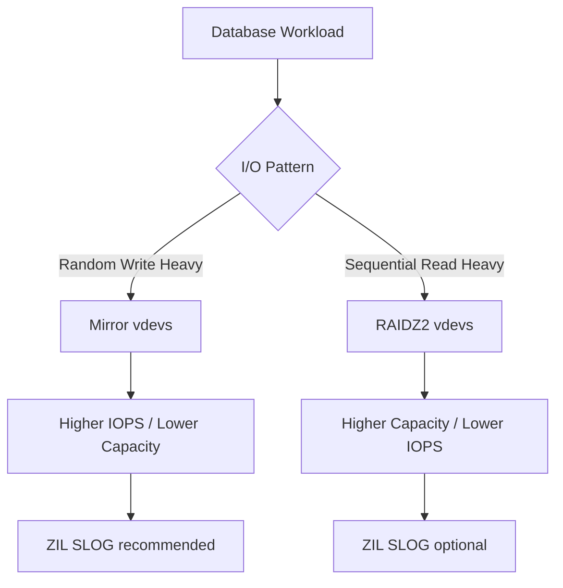

## ARC Sizing and Tuning

### How the ARC Works

The Adaptive Replacement Cache (ARC) is ZFS's primary read cache, stored in system RAM. It uses an
algorithm that maintains two lists:

- **MRU (Most Recently Used):** Tracks recently accessed data.
- **MFU (Most Frequently Used):** Tracks frequently accessed data.

The ARC dynamically allocates space between these lists based on access patterns. When the ARC is
full, it evicts data from the list with lower hit rates.

### Default ARC Sizing

On TrueNAS, the default ARC maximum is approximately 50% of physical RAM (5/8 of kernel addressable
memory, minus some overhead). For a dedicated NAS with 64 GB RAM, the ARC will use approximately 32
GB.

### Tuning ARC Size

```bash
# Check current ARC statistics
kstat -p zfs:0:arcstats

# Key metrics:
# arc_size — Current ARC size in bytes
# arc_hits — Number of cache hits
# arc_misses — Number of cache misses
# arc_hit_ratio — Hit percentage (hits / (hits + misses) * 100)
# arc_meta_used — Metadata cache usage

# Set ARC maximum (in bytes, persistent via /etc/system or sysctl)
# For a system with 64 GB RAM, set ARC max to 48 GB:
# vfs.zfs.arc_max=51539607552

# On TrueNAS SCALE (Linux):
echo 51539607552 | sudo tee /sys/module/zfs/parameters/zfs_arc_max
```

### ARC Hit Ratio Targets

| Hit Ratio | Interpretation                            |
| --------- | ----------------------------------------- |
| &gt; 95%  | Excellent — working set fits in ARC       |
| 85–95%    | Good — most reads are served from cache   |
| 70–85%    | Acceptable — consider adding RAM or L2ARC |
| &lt; 70%  | Poor — working set exceeds ARC, add RAM   |

### primarycache and secondarycache

These dataset properties control what data is cached:

| Property         | Values              | Effect                       |
| ---------------- | ------------------- | ---------------------------- |
| `primarycache`   | all, metadata, none | What to store in ARC (RAM)   |
| `secondarycache` | all, metadata, none | What to store in L2ARC (SSD) |

For most workloads, `primarycache=all` is correct. For workloads where the working set is much
larger than RAM (e.g., media streaming), setting `primarycache=metadata` caches only file metadata
(directory structures, file sizes), which can significantly reduce RAM usage while maintaining fast
directory listing performance.

---

## recordsize Selection

### Understanding recordsize

The `recordsize` property sets the maximum block size for files in a dataset. ZFS uses variable-size
blocks from 512 bytes up to the recordsize. The block size for a specific file is determined at
write time and cannot be changed afterward.

### Choosing the Right recordsize

| Workload                            | recordsize     | Rationale                                            |
| ----------------------------------- | -------------- | ---------------------------------------------------- |
| General file storage                | 128K (default) | Good balance for mixed workloads                     |
| Media files (video, audio, ISO)     | 128K or 1M     | Large sequential reads benefit from large blocks     |
| Virtual machine images (VDI, QCOW2) | 64K or 16K     | VMs do mixed I/O; 64K is a good compromise           |
| Databases (MySQL, PostgreSQL)       | 16K or 8K      | Match database page size to avoid read amplification |
| iSCSI LUNs (VM storage)             | 64K or 16K     | Match the expected VM I/O pattern                    |
| NFS home directories                | 128K           | Mixed workload, default is fine                      |
| Photo libraries (many small files)  | 128K           | Large enough for most image files                    |
| Source code repositories            | 128K           | Many small reads, metadata caching is more important |

:::warning Changing `recordsize` on an existing dataset only affects new writes. Existing files keep
their original block size. To benefit from a recordsize change, rewrite the data by copying files to
a new dataset. :::

### Impact of recordsize on Performance

Incorrect recordsize causes read amplification:

- **recordsize too large for small random reads:** ZFS must read the entire block (e.g., 128 KB) to
  serve a 4 KB read request, wasting bandwidth. This is devastating for database workloads.
- **recordsize too small for large sequential reads:** ZFS issues many small reads instead of fewer
  large reads, increasing per-I/O overhead and reducing throughput.

---

## Compression

### Compression Algorithms

| Algorithm            | Ratio                | CPU Cost | Speed     | Recommendation                         |
| -------------------- | -------------------- | -------- | --------- | -------------------------------------- |
| lz4                  | Good (1.3–1.5x)      | Very Low | Very Fast | Default for all workloads              |
| zstd (default level) | Very Good (1.5–2.0x) | Moderate | Fast      | Best ratio/speed trade-off             |
| zstd-fast            | Good                 | Low      | Very Fast | For CPU-constrained systems            |
| gzip-1 to gzip-9     | Variable             | Moderate | Moderate  | Legacy; zstd is better                 |
| lzjb                 | Poor                 | Low      | Fast      | Legacy; avoid                          |
| zle                  | None                 | None     | Fast      | Incompressible data (encrypted, media) |

### When to Use Compression

Always enable compression unless you have a specific reason not to:

1. **LZ4** is the default on TrueNAS and adds virtually no CPU overhead (it has a fast path that
   skips incompressible data in hardware).
2. Compression reduces the amount of data written to disk, which extends SSD lifespan and improves
   pool performance.
3. Compressed data takes less space in the ARC, effectively increasing cache capacity.
4. The only scenario where compression should be disabled is for data that is already compressed
   (encrypted files, compressed video/audio archives, ZIP files).

```bash
# Enable compression on a dataset
zfs set compression=lz4 tank/data

# Enable zstd for better compression (slightly more CPU)
zfs set compression=zstd tank/data

# Disable compression for already-compressed data
zfs set compression=off tank/media/encrypted
```

---

## Deduplication

### How Dedup Works

When `dedup=on`, ZFS maintains a hash table of every unique block written to the pool. Before
writing a new block, ZFS checks if an identical block already exists. If it does, ZFS stores a
reference instead of a new copy.

### Memory Cost

The deduplication table (DDT) requires approximately 320 bytes per unique block in RAM:

$$
DDT\_RAM = Unique\_Blocks \times 320 \mathrm{ bytes}
$$

| Pool Size | Unique Data | DDT RAM Required |
| --------- | ----------- | ---------------- |
| 1 TB      | 500 GB      | ~160 GB          |
| 5 TB      | 2.5 TB      | ~800 GB          |
| 10 TB     | 5 TB        | ~1.6 TB          |

### When to Use Dedup

| Scenario                           | Use Dedup? | Rationale                             |
| ---------------------------------- | ---------- | ------------------------------------- |
| VM templates (many identical VMs)  | Yes        | High dedup ratio, manageable DDT size |
| ISO images (many identical copies) | Yes        | High dedup ratio                      |
| General file storage               | No         | Low dedup ratio, high memory cost     |
| Backup storage                     | No         | Most data is unique                   |
| Database storage                   | No         | Low dedup ratio, performance impact   |

:::warning In most NAS deployments, deduplication is a net negative. The memory cost of the DDT far
exceeds the space savings from deduplication. Use compression (lz4/zstd) instead — it provides
meaningful space savings with no memory cost. :::

---

## SMB Tuning

### SMBD vs. Kernel SMB

TrueNAS uses Samba's `smbd` daemon for SMB file sharing. Tuning options include:

| Setting          | Default | Recommended         | Effect                            |
| ---------------- | ------- | ------------------- | --------------------------------- |
| `min protocol`   | SMB1    | SMB3                | Security                          |
| `aio read size`  | 0       | 1                   | Asynchronous I/O for reads        |
| `aio write size` | 0       | 1                   | Asynchronous I/O for writes       |
| `strict locking` | Auto    | No                  | Reduce lock contention            |
| `strict sync`    | Auto    | No                  | Skip fsync on close (performance) |
| `cache size`     | Auto    | Adjust based on RAM | Directory metadata cache          |

### SMB Auxiliary Parameters

Add these in the SMB share configuration under "Auxiliary Parameters":

```text
# Performance tuning
aio read size = 1
aio write size = 1
strict locking = no
strict sync = no

# For macOS compatibility
vfs objects = catia fruit streams_xattr
fruit:aapl = yes
fruit:encoding = native

# For large directory support
directory name cache size = 0
```

### SMB Multichannel

SMB3 multichannel allows multiple network connections between client and server, increasing
throughput and providing failover:

1. Ensure the TrueNAS server has multiple network interfaces (or a bonded interface).
2. Enable multichannel in the TrueNAS SMB service settings.
3. The Windows client will automatically detect and use multichannel if it has multiple paths to the
   server.

---

## NFS Tuning

### NFSv4 Configuration

```bash
# Mount options for optimal performance
mount -t nfs4 -o rw,hard,intr,_netdev,rsize=1048576,wsize=1048576,noatime \
    nas:/mnt/pool/data /mnt/data

# Key options:
# rsize/wsize=1M — Maximum read/write size (1 MB is optimal for 10GbE+)
# hard — Retry on server failure (do not use soft for persistent storage)
# noatime — Do not update access times (reduces metadata writes)
# _netdev — Wait for network before mounting
```

### NFS Server Tuning on TrueNAS

```bash
# Increase NFS server threads (default is 16)
# More threads = more concurrent NFS requests
# Set based on expected client count (e.g., 64 for 20+ clients)
```

Configure under **Sharing** → **Unix (NFS) Shares** → **Settings**.

### async vs. sync NFS

| Mode  | Behavior                                             | Safety | Performance |
| ----- | ---------------------------------------------------- | ------ | ----------- |
| sync  | Server acknowledges write only after data is on disk | High   | Lower       |
| async | Server acknowledges write before data is on disk     | Lower  | Higher      |

For NFS, the default sync behavior depends on the client's mount options. ZFS's copy-on-write
ensures data integrity regardless of the NFS sync setting, but async mode can return "success" to
the client before the data is actually stable on disk.

---

## Network Configuration

### Jumbo Frames

Jumbo frames increase the MTU from 1500 bytes to 9000 bytes, reducing per-packet overhead and
increasing throughput for large transfers:

```bash
# Set MTU to 9000 on the NAS and all connected devices
ifconfig igb0 mtu 9000

# Verify
ifconfig igb0 | grep mtu
```

:::warning Jumbo frames must be configured on every device in the network path — NAS, switch, and
clients. A single device with MTU 1500 in the path will cause fragmentation, which is worse than
standard frames. Only enable jumbo frames if you control the entire network path. :::

### Link Aggregation (LACP)

Link aggregation (LACP, IEEE 802.3ad) bonds multiple network interfaces into a single logical
interface for increased throughput and redundancy:

| Mode           | Throughput           | Failover | Requirements            |
| -------------- | -------------------- | -------- | ----------------------- |
| LACP (802.3ad) | Aggregate (per-flow) | Yes      | Switch support required |
| Balance-XOR    | Aggregate (per-flow) | Yes      | No switch configuration |
| Active-Backup  | Single link          | Yes      | No switch configuration |
| Balance-ALB    | Aggregate (per-flow) | Yes      | No switch configuration |

**Important:** LACP aggregates bandwidth per-flow, not per-connection. A single SMB or NFS transfer
will use only one link. Aggregation benefits multi-client or multi-stream workloads.

### 10GbE+ Configuration

For 10 GbE and faster networks:

1. Use **SFP+** or **SFP28** direct attach cables (DAC) for distances up to 3 meters.
2. Use **fiber optic** modules for distances over 3 meters.
3. Ensure the switch supports the full line rate for all connected ports.
4. Enable **flow control** (802.3x) to prevent packet loss under heavy load.
5. Set **TCP buffer sizes** appropriately:

```bash
# Increase TCP buffer sizes (Linux client)
sysctl -w net.core.rmem_max=16777216
sysctl -w net.core.wmem_max=16777216
sysctl -w net.ipv4.tcp_rmem="4096 1048576 16777216"
sysctl -w net.ipv4.tcp_wmem="4096 1048576 16777216"
```

---

## Hardware Considerations

### ECC RAM

ECC (Error-Correcting Code) RAM detects and corrects single-bit errors and detects multi-bit errors.
For ZFS:

- ZFS stores data and checksums in RAM during operations. A bit flip in RAM can cause ZFS to write
  corrupted data to disk, which the checksum will not catch (the checksum matches the corrupted
  data).
- ECC RAM is strongly recommended for any ZFS deployment, particularly for large pools where the
  probability of RAM errors is non-trivial.

### SSD SLOG (ZIL) Devices

A dedicated SLOG device accelerates synchronous writes:

| Device Type            | Write Latency | Endurance | Cost                         |
| ---------------------- | ------------- | --------- | ---------------------------- |
| Intel Optane P5800X    | ~10 $\mu$s    | Very High | Very High                    |
| Enterprise NVMe (PLP)  | ~50 $\mu$s    | High      | High                         |
| Consumer NVMe (no PLP) | ~30 $\mu$s    | Moderate  | Low (unsafe for sync writes) |
| SATA SSD               | ~100 $\mu$s   | Moderate  | Low                          |

### L2ARC Devices

L2ARC extends the ARC to SSD storage:

- L2ARC is most effective when the working set exceeds RAM but fits in RAM + L2ARC.
- The optimal L2ARC size is 5–10x the ARC size. An L2ARC smaller than the ARC provides minimal
  benefit because the ARC metadata to track L2ARC entries consumes significant RAM.
- Use a dedicated SSD for L2ARC, not a partition of the pool's SSD vdev.

### HBA vs. RAID Controller

| Feature             | HBA (IT Mode)             | RAID Controller              |
| ------------------- | ------------------------- | ---------------------------- |
| ZFS compatibility   | Full (direct disk access) | Limited (virtual disks only) |
| SMART pass-through  | Yes                       | Often not                    |
| Disk identification | Direct (serial, WWN)      | Mapped (may differ)          |
| Performance         | Native                    | May add overhead             |
| Cost                | Low                       | High                         |
| Boot support        | Sometimes                 | Usually                      |

:::warning Always use an HBA in IT (Initiator Target) mode for ZFS. RAID controllers hide disk
identity and prevent ZFS from performing its error detection, self-healing, and direct disk
management. Flash RAID controllers to IT mode (LSI 9211-8i, LSI 9300-8i) or buy pre-flashed HBAs.
:::

### Pool Layout Optimization

**Optimal pool layout for general use:**

```bash
# Mirror vdevs for best random I/O performance
zpool create -o ashift=12 -O compression=lz4 -O atime=off \
    tank \
    mirror /dev/sda /dev/sdb \
    mirror /dev/sdc /dev/sdd \
    mirror /dev/sde /dev/sdf
```

**Optimal pool layout for archival storage:**

```bash
# RAIDZ2 for capacity efficiency with redundancy
zpool create -o ashift=12 -O compression=zstd -O atime=off \
    tank \
    raidz2 /dev/sda /dev/sdb /dev/sdc /dev/sdd /dev/sde /dev/sdf \
    raidz2 /dev/sdg /dev/sdh /dev/sdi /dev/sdj /dev/sdk /dev/sdl
```

---

## Monitoring Performance

### zfs_arcstats Monitoring

```bash
# Key ARC metrics
kstat -p zfs:0:arcstats:hits
kstat -p zfs:0:arcstats:misses
kstat -p zfs:0:arcstats:arc_size
kstat -p zfs:0:arcstats:arc_meta_used
kstat -p zfs:0:arcstats:l2_hits
kstat -p zfs:0:arcstats:l2_misses
```

### Common Performance Bottlenecks

| Symptom               | Likely Cause                      | Diagnostic                                             |
| --------------------- | --------------------------------- | ------------------------------------------------------ |
| Slow random reads     | HDD pool, insufficient ARC        | Check ARC hit ratio, consider SSD L2ARC                |
| Slow random writes    | HDD pool, ZIL on slow storage     | Add SSD SLOG device                                    |
| Slow sequential reads | Network bottleneck, fragmentation | Check network throughput, pool fragmentation           |
| Slow SMB access       | SMB configuration, DNS            | Check SMB logs, verify DNS resolution                  |
| Slow NFS access       | NFS mount options, network        | Check rsize/wsize, network MTU                         |
| High CPU usage        | Compression, dedup, encryption    | Check compression algorithm, disable dedup             |
| Low write throughput  | Insufficient vdevs, slow disks    | Add vdevs (striping across vdevs increases throughput) |

---

## Common Pitfalls

### Adding a Single Disk to a RAIDZ Vdev

You cannot add a single disk to an existing RAIDZ vdev. RAIDZ vdevs are fixed-size — you can only
add entire new vdevs to the pool (which stripes data across all vdevs). To expand a RAIDZ pool, add
a new RAIDZ vdev of the same type.

The exception is that you can replace individual disks in a vdev with larger disks (one at a time),
and after all disks in the vdev are replaced, the vdev's capacity expands to match the largest disk.

### Over-Tuning ARC Size

Setting the ARC too large (e.g., 90% of RAM) leaves insufficient memory for the OS, applications,
and the ZFS prefetch cache. This can cause swapping, which is catastrophic for ZFS performance. Keep
the ARC at 50–70% of physical RAM for dedicated NAS systems.

### Using dedup Without Understanding the Memory Cost

Enabling dedup on a large pool without sufficient RAM (128+ GB) will cause the DDT to overflow to
disk, which destroys performance. The system may become unresponsive. If you must use dedup, ensure
you have enough RAM for the entire DDT in memory.

### Misaligned Partitions or ashift

Creating a pool with `ashift=9` (512 bytes) on drives with 4 KB physical sectors causes severe
read-modify-write amplification. Every 4 KB write becomes a read-modify-write of a 512-byte-aligned
region, potentially touching multiple 4 KB physical sectors. Always use `ashift=12` or higher.

### Not Separating Workloads into Different Datasets

Putting all data in a single dataset with a single recordsize means that all workloads share the
same block size. Database workloads suffer with 128K recordsize, and media streaming suffers with 8K
recordsize. Create separate datasets with appropriate recordsize for different workload types.

## ARC Internals Deep Dive

### ARC Memory Allocation

The ARC is a slab allocator that manages memory in several categories:

| Category   | Description                                    | Typical Size  |
| ---------- | ---------------------------------------------- | ------------- |
| `arc_meta` | Metadata (dnode structures, directory entries) | 25–50% of ARC |
| `arc_data` | Data blocks (file content)                     | 50–75% of ARC |
| `arc_mfu`  | Most Frequently Used data                      | 40–60% of ARC |
| `arc_mru`  | Most Recently Used data                        | 20–30% of ARC |
| `arc_l2c`  | Pointers to L2ARC entries                      | 1–5% of ARC   |

### ARC Hit Ratio Analysis

```bash
# Detailed ARC statistics
kstat -p zfs:0:arcstats

# Key metrics to calculate hit ratio:
# arc_hits — Cache hits (data served from ARC)
# arc_misses — Cache misses (data read from disk)
# arc_prefetch_data_misses — Prefetch misses (data prefetched but not used)

# Calculate hit ratio:
# hit_ratio = arc_hits / (arc_hits + arc_misses)

# ARC demand data hit ratio (excluding prefetch):
# demand_hit_ratio = arc_hits / (arc_hits + arc_demand_data_misses)
```

### ARC Prefetch

ZFS can prefetch data that it predicts will be needed soon:

- **Stream prefetch:** Detects sequential access patterns and prefetches ahead.
- **Offset prefetch:** Detects strided access patterns.

Prefetch can significantly improve performance for sequential workloads but wastes memory for random
workloads (prefetched data evicts useful data from the ARC).

```bash
# Disable prefetch for random workloads
zfs set prefetch_disable=1 tank/database

# Enable prefetch for sequential workloads (default)
zfs set prefetch_disable=0 tank/media
```

### ARC Eviction

When the ARC is full, it evicts data to make room for new data. The eviction policy considers:

1. **Ghost lists:** Data is moved to a ghost list (metadata only, no data). If the data is accessed
   again, it is re-read from disk and placed at the head of the active list.
2. **MFU vs MRU:** Data in the MRU list (accessed once) is evicted before data in the MFU list
   (accessed multiple times).
3. **Metadata vs data:** By default, metadata is not evicted to make room for data. This can cause
   metadata to consume excessive ARC space on metadata-heavy workloads.

## recordsize Deep Dive

### recordsize and Database Workloads

Databases issue I/O in page-sized chunks (typically 8 KB for PostgreSQL, 16 KB for MySQL InnoDB).
Setting `recordsize` to match the database page size is critical:

```bash
# PostgreSQL (8 KB pages)
zfs create -o recordsize=8K -o primarycache=metadata -o logbias=latency \
    tank/databases/postgres

# MySQL InnoDB (16 KB pages)
zfs create -o recordsize=16K -o primarycache=metadata -o logbias=latency \
    tank/databases/mysql
```

**Why `primarycache=metadata` for databases?**

Most databases have their own buffer pool (shared_buffers in PostgreSQL, innodb_buffer_pool_size in
MySQL). Caching the same data in both the database buffer pool and the ZFS ARC is redundant. Setting
`primarycache=metadata` caches only ZFS metadata (which the database does not cache), reducing ARC
memory usage and improving overall efficiency.

### recordsize and VM Images

VM images exhibit mixed I/O patterns: small random reads/writes for metadata and large sequential
reads for boot and application loading.

```bash
# VM images
zfs create -o recordsize=64K -o compression=lz4 tank/vms

# If using qcow2 or vmdk (which have internal 64K blocks)
# If using raw images for databases, use 16K instead
```

### recordsize and Media Files

```bash
# Media files (video, audio, images)
zfs create -o recordsize=128K -o compression=lz4 tank/media
# Or for very large files (4K video):
zfs create -o recordsize=1M -o compression=off tank/media/4k-video
```

## Compression Algorithm Comparison

### Real-World Compression Ratios

| Data Type      | lz4  | zstd-1 | zstd-3 | zstd-10 | zstd-19 |
| -------------- | ---- | ------ | ------ | ------- | ------- |
| Source code    | 2.1x | 2.4x   | 2.8x   | 3.5x    | 3.8x    |
| Server logs    | 5.2x | 6.1x   | 7.8x   | 9.2x    | 9.5x    |
| JSON data      | 3.8x | 4.5x   | 5.2x   | 6.0x    | 6.3x    |
| VM images      | 1.3x | 1.4x   | 1.5x   | 1.6x    | 1.6x    |
| Encrypted data | 1.0x | 1.0x   | 1.0x   | 1.0x    | 1.0x    |
| JPEG images    | 1.0x | 1.0x   | 1.0x   | 1.0x    | 1.0x    |

### zstd Compression Levels

| Level | Speed (comp/decomp MB/s) | Ratio | Recommendation                             |
| ----- | ------------------------ | ----- | ------------------------------------------ |
| 1     | 400/1000                 | 1.3x  | Default for TrueNAS, good balance          |
| 3     | 200/800                  | 1.5x  | Good for compressible data                 |
| 10    | 50/500                   | 1.7x  | Archive/compressible data, low CPU systems |
| 19    | 10/300                   | 1.8x  | Maximum compression, very slow             |

## SMB Tuning Deep Dive

### SMBD Performance Parameters

```text
# Key SMB performance parameters (add to auxiliary parameters):
aio read size = 1         # Enable async I/O for reads
aio write size = 1        # Enable async I/O for writes
strict sync = no           # Skip fsync on close (performance)
strict locking = no        # Reduce lock contention
strict rename = no         # Allow rename of open files
kernel share modes = no    # Reduce share mode overhead
use sendfile = yes         # Use sendfile syscall for zero-copy transfers
min receivefile size = 16384  # Minimum size for sendfile
getwd cache = yes          # Cache getwd() results
```

### SMB Multichannel Configuration

For SMB multichannel to work:

1. TrueNAS must have multiple network interfaces.
2. The client must be configured for multichannel (Windows 8+ and macOS support it natively).
3. All interfaces must be on the same subnet (or use SMB3 encryption for cross-subnet).
4. No manual bonding is needed — SMB handles it at the protocol level.

```bash
# Verify multichannel on TrueNAS
smbstatus

# Check active sessions and channels
# Multiple entries for the same client IP indicate multichannel is active
```

## NFS Tuning Deep Dive

### NFS Server Thread Tuning

```bash
# Check current NFS thread count
ps aux | grep nfsd | wc -l

# On TrueNAS, configure under Sharing → Unix NFS Shares → Settings
# Recommended values:
# 16 threads for 1-5 clients
# 32 threads for 5-15 clients
# 64 threads for 15+ clients
```

### NFS Client Mount Options Reference

```bash
# Full reference for optimal NFSv4 mounts:
mount -t nfs4 \
    -o rw \
    -o hard \
    -o intr \
    -o _netdev \
    -o noatime \
    -o nodiratime \
    -o rsize=1048576 \
    -o wsize=1048576 \
    -o tcp \
    -o actimeo=60 \
    nas:/mnt/pool/data /mnt/data

# actimeo=60 — Attribute cache timeout (60 seconds)
#   Longer timeout reduces metadata operations for read-mostly workloads
#   Shorter timeout improves consistency for write-heavy workloads
```

## Network Configuration Deep Dive

### 10GbE+ Tuning

```bash
# Set TCP buffer sizes (Linux client)
sysctl -w net.core.rmem_max=16777216
sysctl -w net.core.wmem_max=16777216
sysctl -w net.ipv4.tcp_rmem="4096 1048576 16777216"
sysctl -w net.ipv4.tcp_wmem="4096 1048576 16777216"
sysctl -w net.ipv4.tcp_congestion_control=bbr

# Enable BBR congestion control for better throughput on high-BDP networks
# BBR (Bottleneck Bandwidth and RTT) outperforms CUBIC on networks with
# high bandwidth-delay product (typical of 10GbE+ links)
```

### Link Aggregation (LACP) Configuration

```bash
# On TrueNAS, configure under Network → Interfaces
# Create a LAGG interface:
# Protocol: LACP
# Ports: igb0, igb1 (or your NIC names)
# Hash policy: L4 (layer 4 — source/destination IP + port)

# LACP requires switch configuration:
# Switch side:
#   interface Port-channel1
#   description LACP to TrueNAS
#   switchport mode trunk
#   channel-group 1 mode active
```

## Hardware Considerations Deep Dive

### ECC RAM: Why It Matters for ZFS

ZFS stores data and checksums in RAM during read and write operations. If a bit flip occurs in RAM:

1. **On write:** The corrupted data and its checksum are written to disk. The checksum matches the
   corrupted data, so ZFS cannot detect the corruption on a subsequent read. The data is permanently
   corrupted.
2. **On read:** The corrupted data is returned to the application. The checksum verification may or
   may not catch it depending on which bits flipped.

ECC RAM detects and corrects single-bit errors in real time, preventing this scenario.

### SSD SLOG Selection Guide

| Use Case              | Minimum SLOG      | Recommended SLOG      | Budget SLOG     |
| --------------------- | ----------------- | --------------------- | --------------- |
| NFS home directories  | Any SSD           | Enterprise NVMe (PLP) | Consumer NVMe   |
| Database (PostgreSQL) | Enterprise NVMe   | Intel Optane          | Enterprise NVMe |
| VM storage (iSCSI)    | Enterprise NVMe   | Intel Optane          | Enterprise NVMe |
| Backup server         | Any SSD           | Consumer NVMe         | SATA SSD        |
| File server           | None (ZIL in RAM) | None                  | None            |

### HBA Configuration

Popular HBAs for ZFS:

| HBA Model         | Ports | Speed             | Firmware      | Notes                         |
| ----------------- | ----- | ----------------- | ------------- | ----------------------------- |
| LSI 9211-8i       | 8     | 6 Gbps (SATA/SAS) | IT mode (P20) | Most common, widely available |
| LSI 9300-8i       | 8     | 12 Gbps (SAS3)    | IT mode (P16) | Modern, supports SAS3 drives  |
| Broadcom 9500-16i | 16    | 12 Gbps (SAS3)    | IT mode       | High port count               |
| LSI 9207-8i       | 8     | 6 Gbps            | IT mode       | Low-profile, rackmount        |

Flashing LSI cards to IT mode:

```bash
# On a Linux system with the HBA installed:
# 1. Download the sas2flash or sas3flash utility
# 2. Download the IT mode firmware (e.g., mpt2sas.20.00.07.00-fw.bin)
# 3. Flash the firmware:
./sas2flash -o mpt2sas.20.00.07.00-fw.bin -b mptsas2.rom
```

## Performance Monitoring Commands

### Real-Time Monitoring

```bash
# Pool I/O statistics
zpool iostat -v tank 5

# ARC statistics
kstat -p zfs:0:arcstats:hits zfs:0:arcstats:misses zfs:0:arcstats:arc_size

# Dataset-level I/O statistics
zfs get all tank/data | grep -E "written|read|used|compressratio"

# Vdev I/O latency
zpool iostat -v tank 1 5

# Disk utilization
iostat -x 5

# NFS statistics
nfsstat -c
```

### Performance Benchmarking

```bash
# Sequential read test (using zfs send as a benchmark)
zfs send -R tank/data@snapshot > /dev/null

# Random I/O test (using fio)
fio --name=randrw --ioengine=libaio --iodepth=32 --rw=randrw \
    --rwmixread=70 --bs=4k --direct=1 --size=10G \
    --directory=/mnt/tank/data --runtime=300 --group_reporting

# Metadata-heavy workload test (creating/reading many small files)
mkdir /mnt/tank/data/metadata-test
for i in $(seq 1 10000); do dd if=/dev/zero of=/mnt/tank/data/metadata-test/file_$i bs=4k count=1; done
```

## Pool Layout Optimization Examples

The physical layout of vdevs within a pool has a profound impact on performance, resilience, and
future expandability. Different workloads demand different vdev topologies.

### Mirror vs RAIDZ2 for Database Workloads



For databases (PostgreSQL, MySQL), mirror vdevs provide significantly higher random IOPS because
each mirror pair can serve reads from both drives simultaneously. A pool of 8 drives configured as
4x mirror vdevs delivers approximately 4x the IOPS of the same 8 drives in a single RAIDZ2 vdev.

### Special Allocation Classes

ZFS special vdevs store metadata and small blocks on fast storage (NVMe or SSD), leaving the
spinning disk array to handle only large sequential data blocks. This dramatically improves
metadata-heavy operations:

```bash
# Create a special vdev with NVMe devices
zpool add -o ashift=12 tank special mirror /dev/nvme0n1p1 /dev/nvme1n1p1

# Create a dedup vdev (only if deduplication is actually needed)
zpool add -o ashift=12 tank dedup mirror /dev/nvme2n1p1 /dev/nvme3n1p1

# Verify special vdev allocation
zpool list -v tank
zdb -bb tank 2>/dev/null | head -30
```

:::warning Special vdevs cannot be removed after creation. If a special vdev fails, the entire pool
is at risk. Always mirror special vdevs and use high-endurance NVMe drives rated for sustained write
workloads. Check the DWPD (Drive Writes Per Day) rating and ensure it meets your projected metadata
write volume. :::

### Optimizing Recordsize Per Dataset

The `recordsize` property controls the maximum block size ZFS uses for files. Matching recordsize to
your workload's typical I/O size is critical:

| Workload                 | Recommended recordsize | Rationale                                               |
| ------------------------ | ---------------------- | ------------------------------------------------------- |
| Database (8K pages)      | 8K or 16K              | Matches database page size, reduces write amplification |
| Virtual machine images   | 16K or 32K             | Balances random I/O and sequential streaming            |
| Media files (video)      | 1M (default)           | Large sequential reads benefit from large blocks        |
| Source code repositories | 128K                   | Many small files with varied access patterns            |
| Photo libraries          | 128K or 256K           | Mixed file sizes, moderate random access                |

```bash
# Set recordsize for a PostgreSQL dataset
zfs create -o recordsize=16K -o primarycache=metadata -o logbias=latency \
  tank/postgres/data

# Set recordsize for a media library
zfs create -o recordsize=1M -o compression=zstd tank/media/videos

# Verify current settings
zfs get all tank/postgres/data | grep -E "recordsize|primarycache|logbias|compression"
```

:::tip The `recordsize` only affects new writes. Existing files retain their original block size
until they are rewritten. To reblock existing data, copy files to a new dataset with the desired
recordsize. :::

## Monitoring ARC Statistics

The Adaptive Replacement Cache (ARC) is ZFS's primary caching mechanism. Monitoring ARC hit rates
helps determine whether you need more RAM or an L2ARC device.

### Key ARC Metrics

```bash
# Quick ARC summary
arc_summary

# Individual arc_stats (key fields)
cat /proc/spl/kstat/zfs/arcstats | grep -E \
  "^hits|^misses|^size|^c_max|^deleted|^evict|^mfu|^mru|^prefetch|^demand"
```

| Metric          | Meaning                                 | Target                                                               |
| --------------- | --------------------------------------- | -------------------------------------------------------------------- |
| `hits`          | ARC hit count                           | Should be &gt; 90% of total accesses                                 |
| `misses`        | ARC miss count                          | Should be &lt; 10% of total accesses                                 |
| `size`          | Current ARC size in bytes               | Should be close to `c_max` under load                                |
| `c_max`         | Maximum ARC size (typically 5/8 of RAM) | Tune via `vfs.zfs.arc_max`                                           |
| `mfu_hits`      | Most Frequently Used hits               | High values indicate working set fits in ARC                         |
| `mru_hits`      | Most Recently Used hits                 | High values indicate streaming access pattern                        |
| `prefetch_hits` | Prefetch hits                           | Should be low to moderate; high means ZFS is prefetching effectively |

### Calculating Hit Rate

```bash
# Calculate ARC hit rate percentage
hits=$(cat /proc/spl/kstat/zfs/arcstats | awk '/^hits/ {print $3}')
misses=$(cat /proc/spl/kstat/zfs/arcstats | awk '/^misses/ {print $3}')
total=$((hits + misses))
hit_rate=$(echo "scale=2; $hits * 100 / $total" | bc)
echo "ARC hit rate: ${hit_rate}%"

# If hit rate is below 80%, consider adding RAM or an L2ARC
```

### Tuning ARC Maximum Size

By default, ZFS limits ARC to approximately 5/8 of physical RAM. On a dedicated NAS with 128GB RAM,
this leaves about 48GB for applications and the kernel. If TrueNAS is the only workload, you can
increase the ARC ceiling:

```bash
# Set ARC max to 90% of RAM (128GB system = ~115GB ARC)
echo $(echo '128 * 1024 * 1024 * 1024 * 90 / 100' | bc) > /sys/module/zfs/parameters/zfs_arc_max

# Make persistent across reboots (TrueNAS SCALE)
# Add to /etc/modprobe.d/zfs.conf
echo "options zfs zfs_arc_max=123480309760" > /etc/modprobe.d/zfs.conf
```

:::warning Setting `zfs_arc_max` too high leaves insufficient memory for the kernel, applications,
and the ZFS prefetch cache. Never set it above 90% of physical RAM, and monitor swap usage after
changes. If the system begins swapping, reduce `zfs_arc_max` immediately. :::

### L2ARC Configuration

L2ARC (Level 2 ARC) uses a dedicated SSD as a second-tier cache. It stores ARC evictions and can
dramatically improve read performance for datasets larger than physical RAM.

```bash
# Add an L2ARC device
zpool add tank cache /dev/sdb

# Verify L2ARC is active
zpool list -v | grep cache
zdb -C tank | grep -A5 "L2ARC"
```

L2ARC effectiveness depends on the working set size relative to RAM and L2ARC size. If your working
set is 200GB and you have 64GB RAM plus a 500GB L2ARC SSD, the L2ARC will be effective. If your
working set is 10TB, even a large L2ARC will have a low hit rate because the cache is too small
relative to the dataset.

```bash
# Monitor L2ARC effectiveness
arc_summary | grep -A10 "L2 ARC"

# Key fields to watch:
# L2 ARC Hit Ratio: Should be &gt; 30% to justify the SSD cost
# L2 ARC Writes: Should be stable (not constantly writing and evicting)
# L2 ARC Size: Should approach the device capacity over time
```

:::

:::

:::

:::

:::

:::
