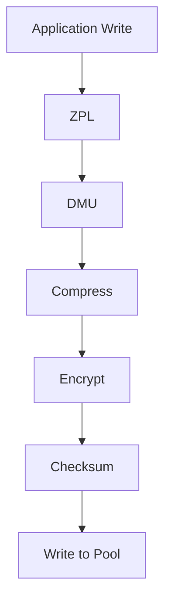

## ZFS Encryption Overview

**Definition.** ZFS native encryption is a dataset-level encryption mechanism integrated into the
ZFS storage stack, introduced in OpenZFS 0.8 (ZoL 0.8.0, FreeBSD 12.0). It encrypts data and
metadata at the block level before it is written to the pool, transparently decrypting on read.
Unlike dm-crypt/LUKS, which operates at the block device layer below ZFS, native ZFS encryption is
aware of ZFS data structures and operates within the DMU (Data Management Unit).

### Why Native ZFS Encryption Over dm-crypt/LUKS

| Feature                  | ZFS Native Encryption     | dm-crypt / LUKS          |
| ------------------------ | ------------------------- | ------------------------ |
| Encryption granularity   | Per-dataset               | Per-block device         |
| Key management scope     | Dataset hierarchy aware   | Volume-level only        |
| Send/receive integration | Raw mode preserves crypto | Not integrated           |
| Snapshot encryption      | Inherited automatically   | Full volume encrypted    |
| Deduplication support    | Per-dataset keys          | Single key per volume    |
| Changing encryption      | Per-dataset rekey         | Requires full re-encrypt |
| TrueNAS integration      | Full GUI support          | Manual setup             |
| Boot from encrypted pool | Supported (with key load) | Supported                |
| Multiple encryption keys | Different keys per child  | Single key per volume    |

Native ZFS encryption provides the critical advantage of per-dataset key granularity. You can
encrypt one dataset with one passphrase and a sibling dataset with a different passphrase, all
within the same pool. With dm-crypt, the entire block device is encrypted with a single key, and
there is no concept of per-directory or per-dataset keys.

### Encryption in the ZFS Write Path

When encryption is enabled on a dataset, the encryption step is inserted between the DMU and the SPA
in the ZFS write path:



The order matters. Compression is applied before encryption because encrypted data is effectively
random and cannot be compressed. The checksum is computed on the encrypted data (not the plaintext),
which means scrubbing verifies the integrity of the encrypted ciphertext.

### Encryption at Rest vs. Encryption in Transit

ZFS native encryption is encryption at rest. It protects data on physical media -- if a drive is
removed from the pool, the data is unreadable without the key. It does not protect data in transit.
For network protection, use SMB3 encryption, NFS with Kerberos (krb5p), or a VPN.

---

## Encryption Properties

### Core Encryption Properties

ZFS exposes encryption configuration through dataset properties. These properties control how
encryption operates, what keys are used, and where keys are stored.

| Property         | Values                                                                         | Default | Set At                | Description                                 |
| ---------------- | ------------------------------------------------------------------------------ | ------- | --------------------- | ------------------------------------------- |
| `encryption`     | on, off, aes-256-gcm, aes-128-gcm, aes-256-ccm, chacha20-poly1305, aes-256-xts | off     | Dataset creation only | Encryption algorithm or on/off toggle       |
| `keyformat`      | none, passphrase, hex, raw                                                     | none    | Dataset creation only | Format of the encryption key                |
| `keylocation`    | prompt, file:///path, https://server/path                                      | prompt  | Dataset creation only | Where to read the encryption key from       |
| `pbkdf2iters`    | Integer (iterations)                                                           | 350000  | Dataset creation only | PBKDF2 iterations for passphrase stretching |
| `encryptionroot` | Read-only (dataset path)                                                       | -       | Inherited             | The root dataset that holds the master key  |
| `keystatus`      | Read-only (available, unavailable, none)                                       | -       | Read-only             | Whether the encryption key is loaded        |

### Setting Encryption Properties

Encryption properties can only be set at dataset creation time. They cannot be changed on an
existing dataset (with one exception: `keylocation` can be changed after creation). To change the
encryption algorithm or key format on an existing dataset, you must create a new dataset and copy
the data.

```bash
# Create an encrypted dataset with all properties set
zfs create -o encryption=on \
  -o keyformat=passphrase \
  -o keylocation=prompt \
  -o pbkdf2iters=350000 \
  tank/secret

# Check encryption properties
zfs get encryption,keyformat,keylocation,pbkdf2iters,encryptionroot,keystatus tank/secret
```

Output:

```
NAME        PROPERTY        VALUE           SOURCE
tank/secret encryption      on              local
tank/secret keyformat       passphrase      local
tank/secret keylocation     prompt          local
tank/secret pbkdf2iters     350000          local
tank/secret encryptionroot  tank/secret     -
tank/secret keystatus       available       -
```

### Inherited Encryption

When you create a child dataset inside an encrypted parent, the child inherits the parent's
encryption settings by default. The `encryptionroot` of the child points to the topmost encrypted
ancestor.

```bash
# Parent is encrypted
zfs create -o encryption=on -o keyformat=passphrase -o keylocation=prompt tank/secret

# Child inherits encryption automatically
zfs create tank/secret/docs

# Check child encryption properties
zfs get encryption,encryptionroot,keyformat,keystatus tank/secret/docs
```

Output:

```
NAME              PROPERTY        VALUE           SOURCE
tank/secret/docs  encryption      on              inherited from tank/secret
tank/secret/docs  encryptionroot  tank/secret     -
tank/secret/docs  keyformat       passphrase      inherited from tank/secret
tank/secret/docs  keystatus       available       -
```

The child dataset `tank/secret/docs` is encrypted with the same key as its parent. Loading the key
on the parent (`tank/secret`) automatically makes the child accessible.

### Overriding Inherited Encryption

A child dataset can override the parent's encryption by specifying its own encryption properties at
creation time. This creates a new encryption root:

```bash
# Create child with its own encryption key
zfs create -o encryption=on -o keyformat=passphrase -o keylocation=prompt \
  tank/secret/separate-vault

# This child has its own encryptionroot
zfs get encryptionroot tank/secret/separate-vault
# NAME                         PROPERTY        VALUE
# tank/secret/separate-vault   encryptionroot  tank/secret/separate-vault
```

Now `tank/secret/separate-vault` requires its own key, independent of `tank/secret`.

### Encryption Algorithm Selection

| Algorithm         | Key Size | Mode       | Performance (AES-NI) | Use Case                            |
| ----------------- | -------- | ---------- | -------------------- | ----------------------------------- |
| aes-256-gcm       | 256 bit  | GCM (AEAD) | Fastest              | Default, general purpose            |
| aes-128-gcm       | 128 bit  | GCM (AEAD) | Fast                 | Slightly faster than 256, adequate  |
| aes-256-ccm       | 256 bit  | CCM (AEAD) | Moderate             | Legacy hardware without GCM support |
| chacha20-poly1305 | 256 bit  | Stream     | Moderate             | CPUs without AES-NI instructions    |
| aes-256-xts       | 256 bit  | XTS        | Fast                 | Block device encryption (zvols)     |

**Definition.** AEAD (Authenticated Encryption with Associated Data) modes such as GCM and CCM
combine encryption and authentication in a single operation. This means every encrypted block has an
integrity check built in -- tampering with ciphertext is detected during decryption. This is in
addition to ZFS's own checksum verification.

:::info `aes-256-gcm` is the default when `encryption=on` is specified. It provides the best
performance on modern CPUs with AES-NI support and is the recommended choice for all workloads.
`chacha20-poly1305` is the fallback for CPUs without AES-NI (e.g., some ARM SoCs).
:::

### pbkdf2iters Property

The `pbkdf2iters` property controls the number of PBKDF2 (Password-Based Key Derivation Function 2)
iterations used to stretch a user passphrase into a cryptographic key. Higher values make
brute-force attacks on weak passphrases more expensive.

| Iterations | Key Derivation Time (approx.) | Recommendation             |
| ---------- | ----------------------------- | -------------------------- |
| 100000     | ~50 ms                        | Legacy default, too low    |
| 350000     | ~150 ms                       | Current default, minimum   |
| 500000     | ~200 ms                       | Good for sensitive data    |
| 1000000    | ~400 ms                       | High-security environments |

:::warning Higher `pbkdf2iters` values increase the time to load the encryption key at boot. If you
set `pbkdf2iters=1000000`, every boot (or key load) will take an additional ~400 ms per dataset.
This property only applies to `keyformat=passphrase`. It has no effect on `hex` or `raw` key
formats, which use the raw key material directly.
:::

---

## Key Management

### Key Formats

ZFS supports four key formats, each with different security and usability characteristics:

| Key Format | Source                 | Key Length      | Security         | Convenience | Use Case                 |
| ---------- | ---------------------- | --------------- | ---------------- | ----------- | ------------------------ |
| passphrase | User-entered at prompt | Variable        | High (if strong) | Low         | Interactive use, laptops |
| hex        | Hexadecimal string     | 64 chars (256b) | Medium           | High        | Automated key loading    |
| raw        | Raw binary key file    | 32 bytes (256b) | Medium           | High        | Automated, key files     |
| none       | No encryption          | N/A             | N/A              | N/A         | Unencrypted datasets     |

### passphrase Format

A passphrase is a human-memorable string that is stretched into a 256-bit key using PBKDF2-SHA512.
The passphrase is prompted for interactively when the key needs to be loaded.

```bash
# Create dataset with passphrase
zfs create -o encryption=on -o keyformat=passphrase -o keylocation=prompt tank/docs
# Enter passphrase: ********
# Re-enter passphrase: ********

# Load key (prompts for passphrase)
zfs load-key tank/docs
# Enter passphrase: ********
```

Passphrase strengths:

| Type        | Example                      | Entropy (approx.) | Security  |
| ----------- | ---------------------------- | ----------------- | --------- |
| Weak        | password123                  | ~10 bits          | Broken    |
| Moderate    | Tr0ub4dour&3                 | ~30 bits          | Low       |
| Strong      | correct horse battery staple | ~60 bits          | Moderate  |
| Very strong | 7 random words (Diceware)    | ~90 bits          | Good      |
| Excellent   | 16+ random ASCII characters  | ~105+ bits        | Excellent |

:::info Use a Diceware passphrase (6-8 random words from a word list) or a randomly generated string
of 20+ characters. Store the passphrase in a password manager and write it down on paper stored in a
physically secure location (safe deposit box, fireproof safe).
:::

### hex Format

A hex key is a 64-character hexadecimal string representing a 256-bit key. It is stored in a file or
provided directly. No key stretching is applied -- the hex string is used directly as the encryption
key.

```bash
# Generate a random 256-bit hex key
openssl rand -hex 32
# Output: a1b2c3d4e5f6... (64 hex characters)

# Create dataset with hex key from file
echo "a1b2c3d4e5f6...64chars" > /root/keys/tank_docs.key
chmod 400 /root/keys/tank_docs.key

zfs create -o encryption=on -o keyformat=hex \
  -o keylocation=file:///root/keys/tank_docs.key \
  tank/docs

# Load key from file
zfs load-key -L file:///root/keys/tank_docs.key tank/docs
```

### raw Format

A raw key is a 32-byte binary file containing the raw 256-bit key. Like hex, no key stretching is
performed.

```bash
# Generate a raw 32-byte key
openssl rand -out /root/keys/tank_docs.raw 32
chmod 400 /root/keys/tank_docs.raw

# Create dataset with raw key
zfs create -o encryption=on -o keyformat=raw \
  -o keylocation=file:///root/keys/tank_docs.raw \
  tank/docs

# Load key
zfs load-key -L file:///root/keys/tank_docs.raw tank/docs
```

### keylocation Options

The `keylocation` property specifies where ZFS finds the encryption key:

| keylocation                 | Behavior                                  | Use Case                     |
| --------------------------- | ----------------------------------------- | ---------------------------- |
| `prompt`                    | Prompts on stdin at key load time         | Passphrase, interactive use  |
| `file:///absolute/path`     | Reads key from a local file               | Automated key loading        |
| `file:///path/to/directory` | For encryptionroot: reads child key files | Multi-dataset key management |
| `https://server/path`       | Fetches key from an HTTPS URL             | Remote key server            |

### Key Location Inheritance

When a child dataset inherits encryption from a parent, it can use the parent's key location scheme.
For the `file://` key format, you can set the parent's `keylocation` to a directory path. Each child
dataset's key file is expected to be named after the dataset within that directory:

```bash
# Parent points to a key directory
zfs create -o encryption=on -o keyformat=hex \
  -o keylocation=file:///root/keys/tank \
  tank/secret

# Key files for children go in /root/keys/tank/
echo "hexkey1..." > /root/keys/tank/docs
echo "hexkey2..." > /root/keys/tank/media

zfs create tank/secret/docs    # Key read from /root/keys/tank/docs
zfs create tank/secret/media   # Key read from /root/keys/tank/media
```

### Loading and Unloading Keys

```bash
# Load a single dataset's key (prompts for passphrase)
zfs load-key tank/secret

# Load key from a specific file
zfs load-key -L file:///root/keys/tank_secret.key tank/secret

# Load keys recursively for all datasets under a root
zfs load-key -r tank/secret

# Load key for a specific dataset
zfs load-key tank/secret/docs

# Unload a key (dataset becomes inaccessible)
zfs unload-key tank/secret/docs

# Unload keys recursively
zfs unload-key -r tank/secret

# Check which keys are loaded
zfs get keystatus -r tank
```

When a key is unloaded, the dataset and all its children are unmounted and become inaccessible. The
data remains on disk, encrypted, but cannot be read or written until the key is loaded again.

### Changing Keys with zfs change-key

The `zfs change-key` command allows you to change the encryption key for a dataset without
re-encrypting the data. The master key wrapping key is re-encrypted with the new key material, but
the actual data encryption keys are preserved.

```bash
# Change passphrase for an existing encrypted dataset
zfs change-key -o keyformat=passphrase -o keylocation=prompt tank/secret
# Enter new passphrase: ********
# Re-enter new passphrase: ********

# Change from passphrase to hex key
zfs change-key -o keyformat=hex -o keylocation=file:///root/keys/tank_secret.key tank/secret

# Change pbkdf2iters (requires re-entering the passphrase)
zfs change-key -o pbkdf2iters=500000 tank/secret

# Change the encryption algorithm (requires full re-encryption)
zfs change-key -o encryption=chacha20-poly1305 tank/secret
```

:::warning Changing the encryption algorithm with `zfs change-key` triggers a full re-encryption of
all data in the dataset. This is a long-running operation that consumes significant I/O bandwidth
and CPU. Plan this for off-peak hours. Changing the passphrase or key format does not require
re-encryption.
:::

### Auto-Mount at Boot

ZFS can automatically load encryption keys at boot for datasets that use key files (not
passphrases). Configure this by setting `keylocation` to a file path:

```bash
# Auto-load key from file at boot
zfs create -o encryption=on -o keyformat=raw \
  -o keylocation=file:///root/keys/tank_secret.raw \
  tank/secret

# The key will be loaded automatically when the pool is imported at boot
# Ensure the key file exists and is readable at boot time
```

:::warning Storing the key file on the same pool that it decrypts defeats the purpose of encryption.
If the pool is stolen, the key file is stolen with it. Store key files on a separate, secure
location -- a USB drive, a separate small pool, or a remote key server.
:::

---

## Creating Encrypted Datasets

### Step-by-Step: Creating an Encrypted Pool Root

While encryption is set at the dataset level (not pool level), you can create an encrypted root
dataset that all child datasets inherit from:

```bash
# 1. Create the pool (unencrypted at the pool level)
zpool create -o ashift=12 -O compression=lz4 -O atime=off \
  tank mirror /dev/sda /dev/sdb \
  mirror /dev/sdc /dev/sdd

# 2. Create an encrypted root dataset
zfs create -o encryption=on \
  -o keyformat=passphrase \
  -o keylocation=prompt \
  -o pbkdf2iters=350000 \
  tank/encrypted

# 3. Create child datasets (inherit encryption)
zfs create -o recordsize=128K tank/encrypted/docs
zfs create -o recordsize=64K  tank/encrypted/vms
zfs create -o compression=off tank/encrypted/media

# 4. Verify inheritance
zfs get encryption,encryptionroot,keystatus -r tank/encrypted
```

### Creating a Standalone Encrypted Dataset

You do not need to encrypt the entire pool. You can encrypt individual datasets within an
unencrypted pool:

```bash
# Pool has mixed encrypted and unencrypted datasets
zpool create -o ashift=12 tank mirror /dev/sda /dev/sdb

# Unencrypted dataset for public data
zfs create -o compression=lz4 tank/public

# Encrypted dataset for sensitive data
zfs create -o encryption=on -o keyformat=passphrase -o keylocation=prompt \
  -o compression=zstd tank/secret

# Another encrypted dataset with different key
zfs create -o encryption=on -o keyformat=passphrase -o keylocation=prompt \
  -o compression=lz4 tank/confidential
```

### Mixed Encryption Hierarchy

A pool can contain a mix of encrypted and unencrypted datasets at any level:

```bash
# Unencrypted root
zfs create tank/data

# Encrypted child
zfs create -o encryption=on -o keyformat=passphrase -o keylocation=prompt \
  tank/data/private

# Unencrypted sibling
zfs create tank/data/public

# Encrypted grandchild (inherits from private)
zfs create tank/data/private/documents

# Verify the hierarchy
zfs get encryption,encryptionroot -r tank/data
```

### Creating Encrypted zvols (Block Devices)

zvols (ZFS volumes) can also be encrypted. This is useful for iSCSI LUNs or raw VM disk images:

```bash
# Create an encrypted zvol for iSCSI
zfs create -V 100G \
  -o encryption=on -o keyformat=passphrase -o keylocation=prompt \
  -o volblocksize=64K -o compression=lz4 \
  tank/iscsi/encrypted-lun

# The zvol key must be loaded before the block device is usable
zfs load-key tank/iscsi/encrypted-lun

# Verify
zfs get encryption,volsize,volblocksize,keystatus tank/iscsi/encrypted-lun
```

### Encryption and the Boot Pool

On TrueNAS, the boot pool (typically `boot-pool`) is separate from the data pool. Encrypting the
boot pool is generally not recommended because:

1. The bootloader must be able to load the kernel and initramfs.
2. Key management for the boot pool adds complexity without significant security benefit (the boot
   pool contains the OS, not user data).

Encrypt user data pools instead. The TrueNAS boot pool should remain unencrypted.

---

## Managing Encrypted Pools

### Importing Encrypted Pools

When you import an encrypted pool, the datasets within it are not automatically accessible. You must
load the keys before mounting:

```bash
# 1. Import the pool
zpool import tank

# 2. Check key status (all unavailable)
zfs get keystatus -r tank/encrypted
# NAME                PROPERTY   VALUE
# tank/encrypted      keystatus  unavailable
# tank/encrypted/docs keystatus  unavailable

# 3. Load the encryption key
zfs load-key -r tank/encrypted
# Enter passphrase for 'tank/encrypted': ********

# 4. Verify keys are loaded
zfs get keystatus -r tank/encrypted
# NAME                PROPERTY   VALUE
# tank/encrypted      keystatus  available
# tank/encrypted/docs keystatus  available

# 5. Mount the datasets
zfs mount -a
```

### Importing with Key Auto-Load

The `-l` flag on `zpool import` automatically attempts to load all encryption keys during import:

```bash
# Import and attempt to auto-load keys
zpool import -l tank

# For keyformat=passphrase, this will prompt for each encrypted dataset
# For keyformat=raw or hex with keylocation=file://, it will attempt to read the key files
```

:::info On TrueNAS SCALE, the `-l` flag is used by default when importing pools at boot. If your
encrypted datasets use passphrase keys, TrueNAS will prompt you for the passphrase during boot. If
they use key files, TrueNAS will attempt to load them from the specified file locations
automatically.
:::

### Exporting Encrypted Pools

Exporting an encrypted pool unloads all keys and unmounts all datasets:

```bash
# Export the pool (keys are unloaded automatically)
zpool export tank

# After export, the data on disk is encrypted and inaccessible
# To access it again, you must import and reload keys
```

### Recovery Scenarios

#### Scenario: Forgot Passphrase

If you forget the passphrase for an encrypted dataset, the data is **permanently irrecoverable**.
There is no backdoor, no recovery mechanism, no workaround. The encryption is designed to be
computationally infeasible to break.

:::warning There is no "forgot password" mechanism for ZFS encryption. If you lose the passphrase,
the data is gone forever. Store passphrases in multiple secure locations: a password manager, a
physical safe deposit box, and a trusted family member's possession.
:::

#### Scenario: Key File Deleted

If the key file is deleted but you remember the passphrase (or have a backup of the key material),
you can regenerate the key:

```bash
# If you have the passphrase:
zfs change-key -o keyformat=passphrase -o keylocation=prompt tank/secret

# If you have a backup of the raw key:
# Restore the key file from backup, then load it
cp /backup/keys/tank_secret.raw /root/keys/tank_secret.raw
zfs load-key -L file:///root/keys/tank_secret.raw tank/secret
```

#### Scenario: Pool on Removed Disks

If drives are removed from the system and reconnected later:

```bash
# Import the pool
zpool import tank

# Load keys
zfs load-key -r tank/encrypted

# Verify data integrity
zpool scrub tank
```

#### Scenario: System Failure with Key Files on Separate Media

If the system fails and key files were stored on a separate USB drive:

1. Install TrueNAS on new hardware.
2. Connect the pool drives and the USB drive with key files.
3. Import the pool: `zpool import tank`
4. Load keys from the USB drive: `zfs load-key -r -L file:///mnt/usb/keys tank/encrypted`
5. Verify data integrity: `zpool scrub tank`

### Rekeying

Rekeying is the process of changing the encryption key or algorithm. There are two levels:

**Shallow rekey** (fast): Changes the wrapping key (passphrase, key file) but keeps the same data
encryption keys. No data re-encryption required.

**Deep rekey** (slow): Changes the encryption algorithm, which requires re-encrypting all data.

```bash
# Shallow rekey: change passphrase (fast, no data re-encryption)
zfs change-key -o keyformat=passphrase -o keylocation=prompt tank/secret

# Deep rekey: change algorithm (slow, full re-encryption)
zfs change-key -o encryption=aes-256-xts tank/secret
```

---

## Performance Impact

### Encryption Overhead

The performance impact of ZFS encryption depends primarily on whether the CPU supports AES-NI (AES
New Instructions) hardware acceleration:

| CPU Feature  | Encryption Overhead (AES-256-GCM) | Notes                       |
| ------------ | --------------------------------- | --------------------------- |
| AES-NI       | 1-5%                              | Negligible on modern CPUs   |
| No AES-NI    | 20-40%                            | Significant; use ChaCha20   |
| AES-NI + AVX | 1-3%                              | Best case, modern Intel/AMD |
| ARM crypto   | 3-10%                             | ARMv8 AES instructions      |

Most Intel CPUs since Westmere (2010) and AMD CPUs since Bulldozer (2011) support AES-NI. Check
with:

```bash
# Check if CPU supports AES-NI
grep -o aes /proc/cpuinfo | wc -l
# If > 0, AES-NI is supported

# Or check CPU flags
lscpu | grep aes
# Flags: ... aes ...
```

### Benchmarking Encryption Performance

```bash
# Write test to encrypted dataset
dd if=/dev/zero of=/mnt/tank/encrypted/testfile bs=1M count=10000 oflag=direct

# Write test to unencrypted dataset (for comparison)
dd if=/dev/zero of=/mnt/tank/unencrypted/testfile bs=1M count=10000 oflag=direct

# Read test
dd if=/mnt/tank/encrypted/testfile of=/dev/null bs=1M iflag=direct

# Compare with fio for more realistic workloads
fio --name=enc-write --ioengine=libaio --iodepth=32 --rw=write \
    --bs=128K --direct=1 --size=10G --directory=/mnt/tank/encrypted \
    --runtime=60 --group_reporting

fio --name=unenc-write --ioengine=libaio --iodepth=32 --rw=write \
    --bs=128K --direct=1 --size=10G --directory=/mnt/tank/unencrypted \
    --runtime=60 --group_reporting
```

### Encryption and Compression Interaction

Compression is always applied before encryption in the ZFS pipeline. This is critical because:

1. Encrypted data is incompressible -- any compression algorithm sees ciphertext as random noise.
2. Compressing first reduces the amount of data that needs to be encrypted.
3. Compression and encryption together reduce both storage usage and the encryption computational
   cost (fewer bytes to encrypt).

```bash
# This is the correct order (ZFS handles this automatically):
# Plaintext -> Compress -> Encrypt -> Checksum -> Write to disk

# Always enable compression on encrypted datasets (unless the data is already incompressible)
zfs set compression=zstd tank/encrypted/docs
```

| Data Type              | Compression | Encryption | Combined Effect                     |
| ---------------------- | ----------- | ---------- | ----------------------------------- |
| Text, code, logs       | 3-5x        | 1-5%       | Less data encrypted, net benefit    |
| Databases              | 1.2-1.5x    | 1-5%       | Marginal compression savings        |
| Already-encrypted data | 1.0x        | 1-5%       | Disable compression, encrypt only   |
| Media (JPEG, MP4, MKV) | 1.0x        | 1-5%       | Disable compression, encrypt only   |
| Virtual machine images | 1.3-2.0x    | 1-5%       | Moderate compression before encrypt |

### Encryption and Deduplication

Deduplication operates on block hashes. When encryption is enabled:

- Deduplication happens **after** encryption in the write path.
- Each encrypted block has a unique nonce, meaning identical plaintext blocks produce different
  ciphertext blocks.
- Deduplication is effectively useless on encrypted datasets because no two encrypted blocks will
  ever have the same hash.

```bash
# Do NOT enable dedup on encrypted datasets
zfs set dedup=off tank/encrypted

# Verify dedup is off
zfs get dedup tank/encrypted
```

---

## Encryption and ZFS Features

### Snapshots and Encryption

Snapshots of encrypted datasets inherit the parent dataset's encryption. The snapshot is encrypted
with the same key as the live dataset. No separate key management is needed for snapshots.

```bash
# Create a snapshot of an encrypted dataset
zfs snapshot tank/encrypted/docs@daily-2026-04-07

# The snapshot is encrypted with the same key
# If the key is unloaded, the snapshot is also inaccessible
zfs get encryption,encryptionroot tank/encrypted/docs@daily-2026-04-07
```

:::info Snapshots do not require separate key management. They use the same encryption key as their
parent dataset. If you load the key for the parent, all snapshots become accessible. If you unload
the key, all snapshots become inaccessible.
:::

### Clones and Encryption

Clones of encrypted snapshots inherit the encryption of the source snapshot. The clone uses the same
encryption key as the source:

```bash
# Clone an encrypted snapshot
zfs clone tank/encrypted/docs@daily-2026-04-07 tank/encrypted/docs-restore

# The clone inherits encryption from the snapshot
zfs get encryption,encryptionroot tank/encrypted/docs-restore
```

### Send and Receive with Encryption

This topic is covered in detail in the Send and Receive section below. Key points:

- Normal `zfs send` decrypts data on the source and sends plaintext.
- `zfs send -w` (raw mode) sends encrypted data without decrypting, preserving the encryption.
- Raw sends are the only way to replicate encrypted datasets without exposing the plaintext to the
  receiving system.

### Scrub and Resilver with Encryption

Scrubbing reads all data and verifies checksums. For encrypted datasets, the checksum is computed on
the ciphertext (the encrypted block). This means:

- Scrub verifies the integrity of the encrypted data, not the plaintext.
- Scrub does not need the encryption key loaded to verify checksums.
- Scrub can detect and repair corrupted ciphertext blocks from redundancy.

```bash
# Scrub works on encrypted datasets without loading keys
zpool scrub tank

# The scrub verifies checksums of encrypted blocks
# If a checksum mismatch is found, ZFS repairs from redundancy (mirror/parity)
```

:::info ZFS can scrub encrypted datasets even when the encryption key is not loaded. The checksum
covers the encrypted data, so integrity verification does not require decryption. This is a
significant advantage -- you can schedule scrubs on encrypted datasets without worrying about key
availability.
:::

Resilvering after a drive replacement also does not require the encryption key. The data is copied
at the block level (encrypted ciphertext), and checksums are verified against the stored values.

### Encryption and Special Vdevs

Special vdevs (metadata and small block allocation) work with encrypted datasets. The metadata
stored on the special vdev is encrypted with the dataset's key. When the key is unloaded, metadata
on the special vdev is also inaccessible.

### Encryption and ZFS Properties

Some ZFS properties interact with encryption in specific ways:

| Property      | Interaction with Encryption                        |
| ------------- | -------------------------------------------------- |
| `compression` | Applied before encryption. Recommended to keep on. |
| `dedup`       | Useless on encrypted data. Always keep off.        |
| `recordsize`  | No interaction. Set independently.                 |
| `sync`        | No interaction. Set independently.                 |
| `atime`       | No interaction. Set independently.                 |
| `copies`      | Additional copies are encrypted with the same key. |
| `xattr`       | Extended attributes are encrypted with the data.   |

---

## Send and Receive

### Raw Send for Encrypted Datasets

**Definition.** Raw send (`zfs send -w`) transmits the raw encrypted blocks from the source dataset
without decrypting them. The receiving system receives encrypted data that it cannot read without
the encryption key. This is the only secure way to replicate encrypted datasets to an untrusted
destination.

```bash
# Raw send of an encrypted dataset (preserves encryption)
zfs send -w tank/encrypted/docs@snap1 | zfs recv backup/encrypted/docs

# Raw send with properties and verbose output
zfs send -wpv tank/encrypted/docs@snap1 | zfs recv backup/encrypted/docs

# Recursive raw send (entire hierarchy)
zfs send -Rw tank/encrypted@snap1 | ssh remote-nas zfs recv -F backup/encrypted
```

### Normal Send vs. Raw Send

| Aspect          | Normal Send (`zfs send`)        | Raw Send (`zfs send -w`)                |
| --------------- | ------------------------------- | --------------------------------------- |
| Data form       | Plaintext (decrypted on source) | Ciphertext (encrypted)                  |
| Key required    | Source key must be loaded       | Source key not required                 |
| Destination     | Can read the data               | Cannot read without key                 |
| Compression     | Decompressed and re-compressed  | Preserved as-is                         |
| Properties      | Sent as plaintext values        | Preserved including encryption settings |
| Cross-algorithm | Can change encryption algorithm | Preserves original algorithm            |
| Use case        | Trusted destination             | Untrusted destination                   |

### Raw Incremental Send

Raw mode works with incremental sends as well:

```bash
# Initial raw send
zfs send -Rw tank/encrypted@base | ssh backup-server zfs recv -F backup/encrypted

# Incremental raw send
zfs send -Rwi tank/encrypted@base tank/encrypted@snap1 | \
  ssh backup-server zfs recv backup/encrypted
```

### Receiving Raw Sends

When you receive a raw send, the destination dataset inherits the encryption settings from the
source:

```bash
# The destination is created as an encrypted dataset
# It has the same encryptionroot, keyformat, and algorithm as the source
zfs send -w tank/encrypted/docs@snap1 | zfs recv backup/docs

# Check the destination
zfs get encryption,encryptionroot,keyformat,keystatus backup/docs
# NAME        PROPERTY        VALUE           SOURCE
# backup/docs encryption      aes-256-gcm     received
# backup/docs encryptionroot  backup/docs     received
# backup/docs keyformat       passphrase      received
# backup/docs keystatus       unavailable     -
```

The destination dataset has the encryption settings from the source but the key is not available
(you would need the source's key to decrypt the data).

### Cross-Host Transfer with Raw Send

Raw send is ideal for sending encrypted backups to a remote system that should not have access to
the plaintext:

```bash
# Send encrypted backup to a remote NAS (remote cannot read the data)
zfs send -Rwv tank/encrypted@monthly-2026-04 | \
  pv --rate-limit 100m | \
  ssh -c aes256-gcm backup-server zfs recv -F backup/offsite

# The remote system stores encrypted data
# To restore, you would raw-send back to a system with the key:
ssh backup-server "zfs send -Rw backup/offsite@monthly-2026-04" | \
  zfs recv -F restore/encrypted
```

### Send Flags for Encrypted Datasets

| Flag | Effect on Encrypted Datasets                      |
| ---- | ------------------------------------------------- |
| `-w` | Raw mode: send encrypted blocks                   |
| `-R` | Recursive: include all child datasets             |
| `-p` | Include dataset properties                        |
| `-c` | Compress during transfer (applied after raw read) |
| `-L` | Large block send                                  |
| `-v` | Verbose output                                    |
| `-i` | Incremental between two snapshots                 |

### Limitations of Raw Send

1. You cannot change the encryption algorithm during a raw send. The destination uses the same
   algorithm as the source.
2. You cannot perform a raw send from an unencrypted dataset (there is nothing to preserve).
3. If the source dataset's key is not loaded, you can still raw send (the data is already encrypted
   on disk), but you cannot perform a normal send (which requires decryption).
4. Raw send of zvols preserves the encryption of the block device.

---

## Backup Implications

### Cloud Backup of Encrypted Datasets

When backing up encrypted datasets to cloud storage, you have two options:

**Option 1: ZFS native encryption + raw send to a local backup pool, then cloud sync.**

The cloud sync uploads encrypted data. The cloud provider cannot read the data.

**Option 2: Client-side encryption via TrueNAS Cloud Sync.**

TrueNAS Cloud Sync can encrypt data before uploading, adding a second layer of encryption on top of
ZFS encryption (or as the sole encryption for unencrypted datasets).

```bash
# Option 1: Raw send to backup pool, then cloud sync the backup pool
# Step 1: Raw send to local backup
zfs send -Rw tank/encrypted@snap1 | zfs recv -F backup/encrypted

# Step 2: Cloud Sync uploads the encrypted data from backup/encrypted
# Configure in TrueNAS: Data Protection > Cloud Sync
# Source: backup/encrypted
# Destination: S3 bucket
# The cloud receives encrypted blocks
```

### Key Management for Backups

The most critical aspect of encrypted backups is key management. If you have encrypted backups but
lose the keys, the backups are worthless.

**Key storage strategy for encrypted backups:**

1. **Primary key:** Stored in a password manager (Bitwarden, 1Password, Vaultwarden).
2. **Secondary key:** Printed on paper and stored in a physical safe deposit box.
3. **Tertiary key:** Stored on a USB drive in a fireproof safe at a different physical location.
4. **Key escrow:** A trusted person (attorney, family member) has access to a sealed envelope with
   the passphrase.

:::warning Never store encryption keys in the same location as the encrypted data. If a fire
destroys both the NAS and the paper with the passphrase, the data is lost. Distribute keys across
multiple physical locations.
:::

### Disaster Recovery with Encrypted Datasets

Disaster recovery for encrypted datasets follows the same process as unencrypted datasets, with the
additional step of key loading:

1. **Procure replacement hardware.**
2. **Install TrueNAS.**
3. **Import the pool:** `zpool import tank`
4. **Restore encryption keys:** Load keys from your backup location.
5. **Load the keys:** `zfs load-key -r tank/encrypted`
6. **Verify data integrity:** `zpool scrub tank`
7. **Restore from offsite backup if needed:** Raw send the backup to the new pool.

### Backup Verification with Encryption

When testing backup restores for encrypted datasets, verify both the encryption and the data:

```bash
# 1. Receive raw backup to a test location
zfs send -Rw backup/encrypted@snap1 | zfs recv -F test/encrypted

# 2. Load the encryption key
zfs load-key test/encrypted

# 3. Mount the dataset
zfs mount test/encrypted

# 4. Verify file contents
find /mnt/test/encrypted -type f -exec md5sum {} \; > /tmp/backup_checksums.txt
# Compare against production checksums
```

---

## Security Considerations

### Key Protection

The encryption key is the single point of failure for encrypted datasets. Protect the key with the
same rigor as the data it protects:

| Threat                 | Mitigation                                     |
| ---------------------- | ---------------------------------------------- |
| Key file on same pool  | Store key file on separate media               |
| Key file stolen        | Encrypt the key file itself (e.g., GPG)        |
| Passphrase brute-force | Use high-entropy passphrase + high pbkdf2iters |
| Passphrase forgotten   | Store in password manager + physical backup    |
| Key file deleted       | Keep multiple backups of key files             |
| Memory dump attack     | See RAM security below                         |

### RAM (Memory) Security

When an encryption key is loaded, it resides in kernel memory for as long as the dataset is mounted.
This has several implications:

1. **Cold boot attack:** If an attacker gains physical access to a running system, they may be able
   to extract encryption keys from RAM by rapidly dumping memory contents before they decay. This is
   a sophisticated attack that requires physical access and specialized tools.
2. **Hibernation:** If the system hibernates, the RAM contents (including encryption keys) are
   written to disk in the hibernation image. This image may be accessible to an attacker with
   physical access.
3. **Kernel memory access:** Any process with access to kernel memory (e.g., via a kernel exploit)
   can potentially extract encryption keys. Minimize attack surface by keeping the system updated.

Mitigations:

- Power off the system when not in use (keys are not persisted across power cycles).
- Use secure boot and measured boot to detect unauthorized kernel modifications.
- Restrict physical access to the NAS.
- Keep the kernel and ZFS modules updated.

### Algorithm Choices

| Algorithm         | Security Level | Performance   | Recommendation              |
| ----------------- | -------------- | ------------- | --------------------------- |
| aes-256-gcm       | Excellent      | Best (AES-NI) | Default, use for everything |
| aes-128-gcm       | Very Good      | Very Good     | Adequate, marginally faster |
| aes-256-ccm       | Good           | Moderate      | Legacy hardware only        |
| chacha20-poly1305 | Good           | Good          | CPUs without AES-NI         |
| aes-256-xts       | Good           | Good          | zvols / block devices only  |

### crypt vs. crypt2 Format

ZFS encryption has two internal key wrapping formats: `crypt` (legacy) and `crypt2` (current):

| Format | Key Wrapping Algorithm | Key Length Support | Recommendation |
| ------ | ---------------------- | ------------------ | -------------- |
| crypt  | PBKDF2-SHA512          | 256-bit only       | Legacy         |
| crypt2 | HKDF-SHA512            | 128-bit, 256-bit   | Use this       |

The `crypt2` format (available since OpenZFS 2.1 / TrueNAS SCALE 22.02) supports both 128-bit and
256-bit key lengths and uses HKDF (HMAC-based Key Derivation Function) for key wrapping, which is
more efficient and secure than PBKDF2 for this purpose. New encrypted datasets on TrueNAS SCALE use
`crypt2` by default.

```bash
# Check the encryption format
zfs get keyformat,encryption tank/encrypted

# The format is not directly exposed as a property; it is determined by
# the ZFS version and the keyformat/encryption properties
```

### Forward Secrecy Considerations

ZFS native encryption does not provide forward secrecy. Once a key is loaded, all data encrypted
with that key (past, present, and future) can be decrypted. If a key is compromised, all data
encrypted with that key is compromised.

For forward secrecy, you would need to re-encrypt data with a new key after each access session and
securely destroy the old key. This is not practical for a NAS workload. Instead, focus on strong key
protection and regular key rotation.

### Key Rotation Strategy

While ZFS does not support automatic key rotation, you can implement a manual rotation strategy:

```bash
# Annual key rotation:
# 1. Create a new encrypted dataset with a new key
zfs create -o encryption=on -o keyformat=passphrase -o keylocation=prompt \
  tank/secret-v2

# 2. Copy data from old to new
zfs send -R tank/secret@snap1 | zfs recv tank/secret-v2

# 3. Verify the new dataset
zfs load-key tank/secret-v2
diff -r /mnt/tank/secret /mnt/tank/secret-v2

# 4. Destroy the old dataset
zfs unload-key tank/secret
zfs destroy -r tank/secret
```

:::warning Key rotation is a manual, time-consuming process that requires enough free space to hold
a copy of the data. Plan key rotation during maintenance windows and verify data integrity before
destroying the old dataset.
:::

---

## TrueNAS SCALE Specific

### Web UI Encryption Setup

TrueNAS SCALE provides a graphical interface for creating and managing encrypted datasets:

1. Navigate to **Storage** → **Pools**.
2. Click the three-dot menu next to the pool → **Add Dataset**.
3. In the dataset creation dialog:
   - **Encryption:** Select `AES-256-GCM` (or your preferred algorithm).
   - **Key Format:** Choose `Passphrase`, `Hex`, or `Raw`.
   - **Key Location:** For passphrase, leave as `Prompt`. For hex/raw, provide the file path.
   - **PBKDF2 Iterations:** Leave at default (350000) or increase for stronger passphrases.
4. Click **Save**.

### Key Management in TrueNAS

TrueNAS SCALE manages encryption keys through the **Storage** → **Encryption** section:

- **Lock/Unlock Datasets:** Lock (unload key) or unlock (load key) encrypted datasets from the UI.
- **Rekey:** Change the passphrase or key for an encrypted dataset.
- **Key Files:** Manage key files stored on the TrueNAS system.

```bash
# List all encrypted datasets and their key status
midclt call pool.dataset.query | \
  jq '.[] | select(.encrypted == true) | {name, key_status: .key_status, encryptionroot}'

# Unlock an encrypted dataset via CLI
midclt call pool.dataset.unlock '{"id": "tank/encrypted", "name": "tank/encrypted", "key": "your-passphrase"}'

# Lock an encrypted dataset via CLI
midclt call pool.dataset.lock '{"id": "tank/encrypted", "force_umount": true}'
```

### System Dataset Encryption

TrueNAS SCALE supports encrypting the system dataset (which stores configuration data, SMB
passwords, and other system state). This is separate from user data encryption:

1. Navigate to **System** → **Advanced**.
2. Set the **System Dataset Pool** to an encrypted dataset.
3. The system dataset will be encrypted with a key managed by TrueNAS.

The system dataset encryption key is automatically managed by TrueNAS and stored in the boot pool.
This protects system configuration if the data pool drives are stolen, but the boot pool must also
be protected.

### Boot Key Loading

On TrueNAS SCALE, encrypted datasets are handled at boot as follows:

1. The pool is imported.
2. Datasets with `keyformat=passphrase` remain locked until manually unlocked via the web UI or CLI.
3. Datasets with `keyformat=raw` or `hex` and `keylocation=file://` are automatically unlocked if
   the key file is accessible.
4. The TrueNAS web UI shows locked datasets with a lock icon, and you can unlock them by entering
   the passphrase.

```bash
# Check which datasets are locked at boot
zfs get keystatus -r tank
# Any dataset with keystatus=unavailable is locked

# Unlock via CLI
zfs load-key tank/encrypted
```

### TrueNAS SCALE Encryption Best Practices

1. **Use `keyformat=passphrase` for sensitive data.** The passphrase provides an additional factor
   -- even if an attacker gains access to the TrueNAS web UI, they cannot unlock the dataset without
   the passphrase.
2. **Use `keyformat=raw` or `hex` for automated workloads.** If you need datasets to auto-mount at
   boot (e.g., app storage), use key files with restricted permissions.
3. **Store key files on a separate pool or USB drive.** Never store key files on the same pool they
   decrypt.
4. **Document all passphrases and key locations.** Maintain a spreadsheet or document listing every
   encrypted dataset, its key format, key location, and where the key/passphrase is stored.
5. **Test key recovery quarterly.** Verify that you can load the key and access the data for every
   encrypted dataset.

---

## Common Pitfalls

### Forgetting the Passphrase (Data Loss)

This is the most catastrophic pitfall. There is no recovery mechanism. The data is permanently lost.

**Prevention:**

- Use a password manager as the primary key store.
- Write the passphrase on paper and store it in a fireproof safe.
- Store a copy in a bank safe deposit box.
- Use a Diceware passphrase with 7+ words for memorability and strength.
- Test key loading monthly to ensure the passphrase is correct and the process works.

### Key File Deletion

If a key file is deleted and no backup exists:

- If `keyformat=passphrase`, use `zfs change-key` to switch to passphrase mode (you need the
  original passphrase to do this).
- If `keyformat=raw` or `hex` with no passphrase backup, the data is lost.

**Prevention:**

- Keep at least two backups of every key file on separate physical media.
- Use version control (git) for key files stored in an encrypted repository.
- Document the location of all key file backups.

### Mounting Without Loading the Key

If you attempt to mount an encrypted dataset without loading the key first:

```bash
# Error: cannot mount 'tank/encrypted': encryption key not loaded
zfs mount tank/encrypted

# Solution: load the key first
zfs load-key tank/encrypted
zfs mount tank/encrypted
```

Or use the combined flag:

```bash
# Mount and load key in one command
zfs mount -l tank/encrypted
```

### Inheriting Encryption Unexpectedly

When you create a child dataset inside an encrypted parent, the child inherits encryption
automatically. If you did not intend this, the child will be encrypted with the parent's key:

```bash
# Parent is encrypted
zfs create -o encryption=on -o keyformat=passphrase tank/secret

# Child inherits encryption (this may be unexpected)
zfs create tank/secret/public-data

# tank/secret/public-data is now encrypted
# To create an unencrypted child inside an encrypted parent, you must explicitly disable encryption:
# (This is NOT supported by ZFS -- you cannot have unencrypted children inside an encrypted parent)
```

:::warning You cannot create an unencrypted child dataset inside an encrypted parent. All children
of an encrypted dataset are encrypted, period. If you need a mix of encrypted and unencrypted
datasets, create them as siblings (not parent-child) within an unencrypted pool.
:::

### Performance Without AES-NI

On CPUs without AES-NI support, AES-256-GCM encryption can add 20-40% overhead. This is particularly
noticeable on:

- Low-power ARM SoCs without crypto extensions
- Older Intel/AMD CPUs (pre-2010)
- Virtual machines where AES-NI is not passed through

**Mitigation:**

```bash
# Check for AES-NI support
lscpu | grep -i aes

# If AES-NI is not available, use ChaCha20-Poly1305 instead
zfs create -o encryption=chacha20-poly1305 \
  -o keyformat=passphrase -o keylocation=prompt \
  tank/encrypted
```

ChaCha20-Poly1305 is a stream cipher that does not rely on AES-NI and provides competitive
performance on CPUs without hardware AES support.

### Storing Key Files on the Same Pool

This is a common configuration mistake that provides a false sense of security:

```bash
# WRONG: Key file stored on the same pool it decrypts
zfs create -o encryption=on -o keyformat=raw \
  -o keylocation=file:///mnt/tank/keys/secret.raw \
  tank/encrypted

# If the pool is stolen, the attacker has both the encrypted data and the key
```

```bash
# CORRECT: Key file stored on separate media
# Option A: Separate pool on internal SSD
zfs create -o encryption=on -o keyformat=raw \
  -o keylocation=file:///mnt/keypool/keys/secret.raw \
  tank/encrypted

# Option B: USB drive mounted at /mnt/usb
zfs create -o encryption=on -o keyformat=raw \
  -o keylocation=file:///mnt/usb/keys/secret.raw \
  tank/encrypted
```

### Disabling Compression on Encrypted Datasets

Some administrators disable compression on encrypted datasets, assuming that encrypted data cannot
be compressed. This is incorrect for ZFS because compression happens **before** encryption:

```bash
# WRONG: Disabling compression on encrypted dataset
zfs set compression=off tank/encrypted/docs

# CORRECT: Keep compression enabled (it runs before encryption)
zfs set compression=zstd tank/encrypted/docs
```

The data flow is: Plaintext → Compress → Encrypt → Write. Compression operates on the plaintext, so
it works normally on encrypted datasets. Only disable compression if the plaintext data is already
incompressible (encrypted files, compressed archives, media files).

### Not Testing Key Recovery

The worst time to discover you have lost the encryption key is when you need to restore from backup.
Test key recovery regularly:

```bash
#!/bin/bash
# quarterly-key-test.sh
# Test that all encryption keys can be loaded

DATASETS=$(zfs get -r -H -o name encryption | grep -v "^-$" | cut -f1)
FAILED=0

for ds in $DATASETS; do
  STATUS=$(zfs get -H -o value keystatus "$ds")
  if [ "$STATUS" = "unavailable" ]; then
    echo "Testing key load for: $ds"
    # This will prompt for passphrase; in production, automate with expect or key files
    if ! zfs load-key "$ds" 2>/dev/null; then
      echo "FAILED: Could not load key for $ds"
      FAILED=$((FAILED + 1))
    fi
  fi
done

if [ $FAILED -gt 0 ]; then
  echo "WARNING: $FAILED dataset(s) have key issues"
fi
```

### Using Short or Weak Passphrases

A weak passphrase (e.g., "password", "nas123", your dog's name) can be brute-forced in seconds to
minutes. The `pbkdf2iters` property slows down brute-force attacks, but a sufficiently weak
passphrase can still be cracked.

**Minimum passphrase requirements:**

- At least 20 characters if randomly generated.
- At least 6-7 Diceware words if using a word-based passphrase.
- No dictionary words, names, dates, or common patterns.
- Unique per dataset (do not reuse passphrases across encrypted datasets).

### Ignoring Key Status After Updates

After a TrueNAS update or pool upgrade, verify that all encryption keys are still loaded and all
encrypted datasets are accessible:

```bash
# Check key status after system update
zfs get keystatus -r tank

# Any dataset showing "unavailable" needs its key reloaded
# For passphrase datasets:
zfs load-key tank/encrypted/dataset

# For key file datasets:
zfs load-key -L file:///path/to/key tank/encrypted/dataset

# Verify all datasets are mounted
zfs mount -a
```
