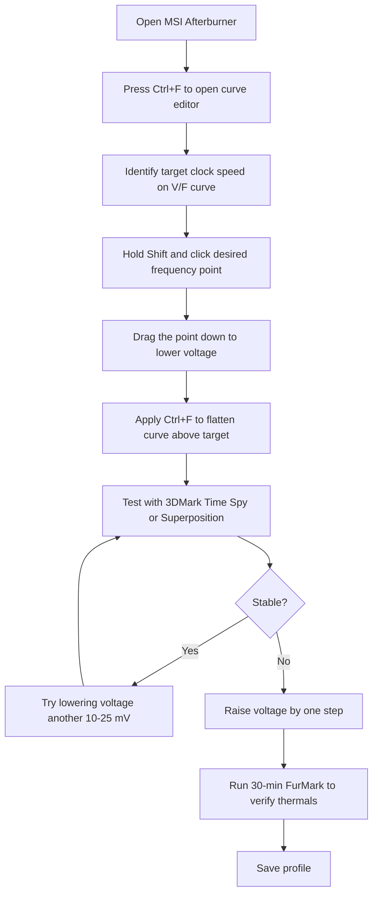
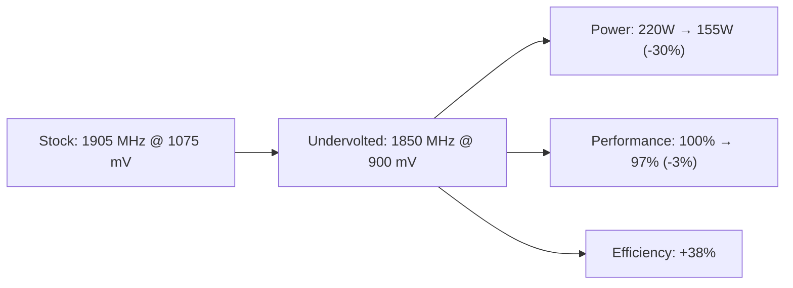

## GPU Architecture Overview

### CUDA Cores and Streaming Multiprocessors

NVIDIA GPUs are organized into Streaming Multiprocessors (SMs), each containing a set of CUDA cores,
shared memory, register files, and scheduling units. The number of SMs and their configuration
defines the GPU's compute capability.

| GPU                 | SMs | CUDA Cores per SM | Total CUDA Cores | FP32 TFLOPS (Boost) |
| ------------------- | --- | ----------------- | ---------------- | ------------------- |
| RTX 3060 (GA106)    | 28  | 128               | 3584             | 12.7                |
| RTX 3070 Ti (GA104) | 48  | 128               | 6144             | 21.7                |
| RTX 4070 (AD104)    | 46  | 128               | 5888             | 29.1                |
| RTX 4090 (AD102)    | 128 | 128               | 16384            | 82.6                |

AMD uses a similar architecture with Compute Units (CUs), each containing multiple Stream Processors
(SP). RDNA 3 CUs contain 2 SIMD32 units (64 SPs per CU).

| GPU                   | CUs | SPs per CU | Total SPs | FP32 TFLOPS (Boost) |
| --------------------- | --- | ---------- | --------- | ------------------- |
| RX 6700 XT (Navi 22)  | 40  | 64         | 2560      | 13.2                |
| RX 7600 (Navi 33)     | 32  | 64         | 2048      | 15.5                |
| RX 7900 XTX (Navi 31) | 96  | 64         | 6144      | 61.4                |

### Memory Bandwidth

Memory bandwidth is often the bottleneck in GPU workloads. The theoretical bandwidth is:

$$
Bandwidth = \frac{Memory\_Clock \times Bus\_Width \times 2}{1000}
$$

The factor of 2 accounts for double data rate (GDDR6/GDDR6X) or multi-level signaling (HBM).

| GPU         | Memory Type | Bus Width | Memory Clock         | Bandwidth (GB/s) |
| ----------- | ----------- | --------- | -------------------- | ---------------- |
| RTX 3060    | GDDR6       | 192-bit   | 15 Gbps              | 360              |
| RTX 4070    | GDDR6X      | 192-bit   | 21 Gbps              | 504              |
| RTX 4090    | GDDR6X      | 384-bit   | 21 Gbps              | 1008             |
| RX 7900 XTX | GDDR6       | 384-bit   | 20 Gbps              | 960              |
| A100        | HBM2e       | 5120-bit  | 2.0 Gbps (per stack) | 2039             |

### ROPs and TMUs

- **ROPs (Render Output Units):** Handle pixel output operations (blending, depth testing,
  anti-aliasing). Important for high-resolution gaming and rendering.
- **TMUs (Texture Mapping Units):** Handle texture sampling, filtering, and address calculations.
  Important for workloads with heavy texture use.

These are fixed-function units that cannot be overclocked independently. They scale with the GPU's
base and boost clocks.

---

## NVIDIA GPU Boost

### How GPU Boost Works

NVIDIA's GPU Boost (version 3.0 and later on Maxwell+) is an autonomous frequency scaling algorithm
that continuously adjusts the GPU clock speed based on:

1. **Power consumption** — Current draw vs. the configured power limit
2. **Temperature** — Current temperature vs. the thermal throttling threshold
3. **Voltage** — Current voltage vs. the maximum allowed voltage
4. **Software limits** — Any application-specific clock limits

The GPU operates at the highest frequency that satisfies all constraints. If temperature rises, the
GPU reduces frequency to stay within the thermal limit. If power headroom exists, the GPU increases
frequency.

### Base Clock vs. Boost Clock

- **Base Clock:** The minimum guaranteed clock speed under typical gaming loads at the default power
  limit. This is the "worst case" frequency.
- **Boost Clock:** The maximum frequency the GPU can achieve under ideal conditions (adequate
  cooling, sufficient power, and a workload that hits the right utilization pattern).

In practice, most GPUs boost above the listed boost clock because the boost specification is based
on a specific temperature and power envelope. If your cooling is better than the reference design,
the GPU will boost higher.

### Voltage/Frequency Curve

NVIDIA GPUs operate along a voltage/frequency (V/F) curve. Each frequency point has a minimum
voltage required for stability. The GPU Boost algorithm selects the highest frequency point where
the current conditions (temperature, power, voltage) allow operation.

The V/F curve is non-linear — higher frequencies require disproportionately more voltage. This is
because:

$$
P \propto V^2 \times F
$$

A small frequency increase at the top of the curve requires a larger voltage increase, which causes
a quadratic increase in power consumption. This is the fundamental reason why undervolting works:
you sacrifice a small amount of peak frequency for a large reduction in power consumption, which
allows the GPU to sustain higher average frequencies under thermal constraints.

---

## AMD PowerPlay

AMD's equivalent to GPU Boost is PowerPlay, which manages GPU frequency and voltage based on thermal
and power constraints. The principles are similar but the implementation differs:

- AMD GPUs use a "power limit" rather than a hard frequency/voltage curve. The GPU boosts as high as
  possible within the power budget.
- The power limit is configurable via AMD Adrenalin or MSI Afterburner, typically up to +15–20%
  above the default TGP (Total Graphics Power).
- AMD's automatic undervolting feature (in Adrenalin) is a simpler interface than NVIDIA's curve
  editor but offers less fine-grained control.

### AMD Power Limit Tiers

| GPU         | Default TGP | Max Power Limit | Overdrive % |
| ----------- | ----------- | --------------- | ----------- |
| RX 7600     | 165 W       | 165 W           | +0%         |
| RX 7800 XT  | 263 W       | 287 W           | +9%         |
| RX 7900 XTX | 355 W       | 420 W           | +18%        |

---

## GPU Undervolting Methodology

### NVIDIA Undervolting with MSI Afterburner

The most effective GPU tuning technique is undervolting — reducing the voltage at which the GPU
operates while maintaining or only slightly reducing the clock frequency.



#### Step-by-Step Process

1. Open MSI Afterburner and press **Ctrl+F** to open the voltage/frequency curve editor.
2. Observe the stock curve. Note the frequency at stock voltage (e.g., 1905 MHz at 1050 mV for an
   RTX 3070).
3. Hold **Shift** and click on the point corresponding to your target frequency (e.g., 1800 MHz).
4. Drag this point down to find the minimum stable voltage (e.g., 875 mV).
5. Hold **Ctrl+F** again and drag all points above your target down to the same voltage, creating a
   flat line. This prevents the GPU from ever exceeding your target voltage.
6. Click **Apply** (the checkmark button in MSI Afterburner).
7. Run a benchmark (3DMark Time Spy, Unigine Superposition).
8. If stable, try reducing voltage by another 10–25 mV.
9. When instability appears (artifacts, crashes, driver resets), raise voltage by one step.
10. Run a 30-minute FurMark session to verify thermals and sustained stability.

#### Typical Results

| GPU      | Stock Voltage/Frequency | Undervolted Voltage/Frequency | Power Savings |
| -------- | ----------------------- | ----------------------------- | ------------- |
| RTX 3060 | 1700 MHz @ 1050 mV      | 1800 MHz @ 875 mV             | 30–40 W       |
| RTX 3070 | 1905 MHz @ 1075 mV      | 1850 MHz @ 900 mV             | 40–50 W       |
| RTX 4070 | 2475 MHz @ 1100 mV      | 2520 MHz @ 925 mV             | 40–60 W       |
| RTX 4090 | 2520 MHz @ 1000 mV      | 2520 MHz @ 875 mV             | 60–100 W      |

### AMD Undervolting

AMD GPUs can be undervolted using MSI Afterburner (same curve editor approach) or AMD Adrenalin:

**Adrenalin Method:**

1. Open AMD Adrenalin → Performance → Tuning.
2. Select "Manual Tuning" or "Automatic Undervolting."
3. For automatic undervolting, move the slider to reduce the target voltage. Adrenalin will find a
   stable point.
4. For manual tuning, adjust the V/F curve similarly to the NVIDIA method.

**MSI Afterburner Method:**

Same process as NVIDIA. Hold Ctrl+F, select target frequency, drag voltage down. AMD GPUs typically
respond well to undervolting, with 50–80 mV reductions being achievable on most cards.

---

## Memory Clock Overclocking

### How Memory Overclocking Works

GPU memory (GDDR6, GDDR6X, or HBM) can be overclocked by increasing the memory clock frequency. This
increases memory bandwidth, which benefits workloads that are memory-bandwidth bound:

- High-resolution gaming (4K with high texture quality)
- GPU computing (machine learning, rendering)
- Cryptocurrency mining

### Overclocking Process

1. In MSI Afterburner, increase the Memory Clock slider in increments of +100 MHz.
2. After each increment, run a memory-intensive benchmark:
   - 3DMark Time Spy (for gaming workloads)
   - AIDA64 GPGPU benchmark (for compute workloads)
3. Watch for visual artifacts — colored squares, flashing textures, or screen corruption.
4. When artifacts appear, reduce the offset by 100 MHz.
5. Run a 30-minute stability test at the final setting.

### Typical Memory Overclocks

| GPU         | Stock Memory Clock  | Typical Stable Overclock | Bandwidth Increase |
| ----------- | ------------------- | ------------------------ | ------------------ |
| RTX 3060    | 7500 MHz (15 Gbps)  | +500 to +800 MHz         | 7–11%              |
| RTX 4070    | 10500 MHz (21 Gbps) | +200 to +500 MHz         | 2–5%               |
| RX 7900 XTX | 10000 MHz (20 Gbps) | +500 to +1000 MHz        | 5–10%              |

:::warning Memory overclocking can cause data corruption. If your GPU is used for compute workloads
(machine learning, rendering, scientific computing), memory instability can produce silently
incorrect results. Thoroughly test with error-checking workloads (e.g., CUDA memtest) before relying
on an overclocked GPU for production compute.
:::

---

## Power Limit Adjustment

### Why Adjust Power Limits

Increasing the power limit allows the GPU to sustain higher boost frequencies for longer. The
default power limit is conservative — it accounts for reference cooling solutions and thermal
environments that may be worse than yours.

### NVIDIA Power Limits

In MSI Afterburner, the Power Limit slider typically allows +5% to +15% above the default TGP. Some
custom BIOSes (e.g., TechPowerUp GPU BIOS database) can unlock higher power limits.

```bash
# Check and set power limits on Linux with nvidia-smi
nvidia-smi -i 0 -pl 300  # Set power limit to 300W
nvidia-smi -i 0 -q -d POWER  # Query current power draw and limit
```

### AMD Power Limits

AMD Adrenalin allows up to +15–20% power limit increase. MSI Afterburner provides a similar slider.
On some AMD GPUs, the power limit can be adjusted in the BIOS using tools like MorePowerTool.

### Power Limit vs. Undervolting

Combining an increased power limit with undervolting is the optimal strategy:

- **Power limit increase** gives the GPU more thermal and electrical headroom.
- **Undervolting** reduces the power consumed at any given frequency, meaning the increased power
  limit translates to higher sustained frequencies rather than just more heat.

This combination often yields better results than either technique alone.

---

## Thermal Management

### Temperature Targets

| GPU            | Default Temp Limit | Max Safe Temp                     | Recommended Target |
| -------------- | ------------------ | --------------------------------- | ------------------ |
| RTX 30-series  | 83 °C              | 93 °C (thermal shutdown at 95 °C) | &lt; 75 °C         |
| RTX 40-series  | 83 °C              | 91 °C (thermal shutdown at 93 °C) | &lt; 70 °C         |
| RX 7000-series | 110 °C (hotspot)   | 120 °C (hotspot)                  | &lt; 90 °C hotspot |

NVIDIA GPUs report two temperatures: "GPU Temperature" (edge temperature) and "GPU Temperature
(Junction)" (hotspot, the hottest point on the die). The junction temperature is typically 10–20 °C
higher than the edge temperature. AMD GPUs report only the junction (hotspot) temperature.

### Fan Curves

A well-configured fan curve keeps temperatures low while minimizing noise:

1. **0–40 °C:** Fans off or at minimum speed (30%). Modern GPUs are designed to run at zero RPM at
   low loads.
2. **40–60 °C:** Gradual increase to 50–60%. This covers web browsing and light gaming.
3. **60–70 °C:** Increase to 70–80%. Normal gaming load range.
4. **70–80 °C:** Increase to 85–100%. Heavy gaming or stress testing.
5. **80 °C+:** 100% fan speed. Should not happen with proper undervolting.

### Thermal Paste Replacement

GPU thermal paste degrades over time (typically 2–4 years depending on quality and operating
temperature). Replacing it can drop temperatures by 5–15 °C.

**Process:**

1. Remove the GPU from the system.
2. Remove the heatsink screws (usually Torx T5 or T6).
3. Clean the old paste from both the GPU die and heatsink with isopropyl alcohol (90%+).
4. Apply new paste: for GPUs with a bare die (no IHS), use the pea or cross method with a thin, even
   spread. For GPUs with an IHS, the pea method works well.
5. Reattach the heatsink with even screw tension (tighten in an X pattern).
6. Reinstall and verify temperatures.

Recommended pastes for GPUs:

- **Thermal Grizzly Kryonaut:** High performance, non-conductive. Best for bare-die GPUs.
- **Noctua NT-H2:** Easy to apply, good longevity. Safe choice.
- **Honeywell PTM7950:** Phase-change pad. Used by NVIDIA on some Founders Edition cards. Requires
  heat cycling to set properly.

---

## Tools

### Windows

| Tool                     | Function                                                        |
| ------------------------ | --------------------------------------------------------------- |
| MSI Afterburner          | Universal GPU overclocking/undervolting, fan curves, monitoring |
| HWiNFO64                 | Comprehensive hardware monitoring, per-sensor logging           |
| NVIDIA Profile Inspector | Deep NVIDIA driver settings, power management modes             |
| GPU-Z                    | GPU information, sensor monitoring, BIOS dump/flash             |
| AMD Adrenalin            | AMD GPU tuning, automatic undervolting, Radeon Super Resolution |
| TechPowerUp GPU-Z        | GPU specs, VRAM monitoring, BIOS validation                     |

### Linux

```bash
# nvidia-smi — NVIDIA GPU management and monitoring
nvidia-smi                    # Basic status
nvidia-smi -l 1               # Refresh every 1 second
nvidia-smi -q -d PERFORMANCE  # Detailed performance state
nvidia-smi -i 0 -pl 300       # Set power limit
nvidia-smi --gpu-reset        # Reset GPU (if hung)

# overclocking with nvidia-settings
nvidia-settings -a "[gpu:0]/GPUPowerMizerMode=1"  # Maximum performance mode
nvidia-settings -a "[gpu:0]/GPUFanControlState=1" # Manual fan control
nvidia-settings -a "[gpu:0]/GPUCurrentFanSpeed=80" # Set fan to 80%

# AMD GPU monitoring with rocm-smi
rocm-smi                      # AMD GPU status
rocm-smi --setfan 80          # Set fan speed to 80%

# LACT (Linux AMDGPU Controller) for AMD tuning
# Provides GUI-like controls for AMD GPUs on Linux
lact                         # Launch GUI
```

---

## Multi-GPU Considerations

### SLI and CrossFire (Deprecated)

NVIDIA SLI and AMD CrossFire are effectively dead. NVIDIA discontinued SLI support after the RTX
30-series (except for the RTX 3090). AMD dropped CrossFire branding on RDNA 2 and later. Neither
technology is relevant for modern gaming.

### Compute Multi-GPU

For compute workloads (machine learning, rendering), multiple GPUs are used independently — each GPU
processes a portion of the workload. No special inter-GPU communication is required, but:

1. **PCIe bandwidth matters** when transferring data between GPUs or between CPU and GPU. NVLink
   (NVIDIA) provides 80–600 GB/s inter-GPU bandwidth, far exceeding PCIe 4.0 x16 (32 GB/s).
2. **Power supply capacity** must accommodate all GPUs simultaneously. Two RTX 4090s under full load
   draw ~900 W combined. Plan for peak power, not TDP.
3. **Thermal isolation** is important. GPUs in adjacent PCIe slots can dump heat into each other.
   Leave at least one slot gap between GPUs, or use water cooling.

---

## GPU Benchmark Methodology

### Benchmark Selection

Different benchmarks stress different aspects of the GPU:

| Benchmark               | What It Tests                      | Duration  | Use Case                       |
| ----------------------- | ---------------------------------- | --------- | ------------------------------ |
| 3DMark Time Spy         | Direct3D 12 gaming performance     | 2–3 min   | Quick gaming performance check |
| 3DMark Speed Way        | Direct3D 12 Ultimate (ray tracing) | 3–4 min   | Modern gaming workload         |
| Unigine Superposition   | OpenGL/Vulkan, visual quality      | 3–5 min   | Visual stability testing       |
| FurMark                 | Maximum power draw (power virus)   | 10–30 min | Thermal limit verification     |
| CUDA memtest            | VRAM integrity                     | 10–30 min | Memory overclocking stability  |
| Blender BMW / Classroom | GPU rendering                      | 5–10 min  | Compute performance            |

### Proper Benchmarking Procedure

1. **Warm up the GPU** — Run the benchmark once and discard the result. GPUs take time to reach
   thermal equilibrium.
2. **Use consistent settings** — Same resolution, quality preset, driver version, and background
   processes.
3. **Run multiple iterations** — Take the median of 3–5 runs to account for variance.
4. **Monitor during the benchmark** — Use HWiNFO64 or MSI Afterburner OSD to log temperature, power,
   clock speed, and fan speed.
5. **Control variables** — Close all other applications, disable CPU boost limits, use the same
   display refresh rate.

---

## Common Failure Modes

| Symptom                               | Likely Cause                             | Solution                                         |
| ------------------------------------- | ---------------------------------------- | ------------------------------------------------ |
| Driver crash (TDR)                    | Core clock too high or voltage too low   | Reduce core clock or increase voltage            |
| Visual artifacts (colored squares)    | Memory clock too high                    | Reduce memory clock by 100 MHz                   |
| Screen goes black momentarily         | Power limit too low or transient spike   | Increase power limit by 5%                       |
| GPU at 100% fan speed but overheating | Poor case airflow or dried thermal paste | Improve airflow or repaste                       |
| Performance drops after 5 minutes     | Thermal throttling (check temps)         | Undervolt, improve cooling, increase power limit |
| Coil whine under load                 | Inductors vibrating at high current      | Not a defect; improve mounting or RMA if severe  |
| HDMI/DP signal loss                   | Cable or port issue                      | Try a different cable or port                    |

---

## Common Pitfalls

### Using FurMark as a Stability Test

FurMark is a power virus that draws more power than any real application. It is useful for testing
thermal limits but not for stability. A GPU that is stable under FurMark may crash in games, and
vice versa. Use FurMark only to verify thermal behavior, not as a general stability test.

### Overvolting Without Monitoring

Increasing voltage without monitoring VRM (Voltage Regulator Module) temperatures can damage the
GPU's power delivery components. VRM temperatures above 105 °C (for most MOSFETs) will cause
premature failure. Always monitor VRM temps with HWiNFO64 when increasing voltage.

### Ignoring PCIe Power Cable Limits

Each PCIe power cable (6-pin, 8-pin, or 12VHPWR) has a maximum current rating:

| Connector      | Max Current                      | Max Power   |
| -------------- | -------------------------------- | ----------- |
| 6-pin          | 75 W                             | 75 W        |
| 8-pin          | 150 W (spec) / 300 W (realistic) | 150–300 W   |
| 12VHPWR (12+4) | 600 W (spec)                     | Up to 600 W |

Daisy-chaining two power connectors from a single cable doubles the current on that cable, which can
cause the cable to overheat. Use separate cables for high-power GPUs (RTX 3080+).

### Not Testing for Sufficient Duration

GPU instability can take 20–30 minutes to manifest. A 5-minute benchmark pass is not sufficient. Run
stability tests for at least 30 minutes, and ideally 1–2 hours, before considering a setting stable.

### Forgetting to Save Profiles

MSI Afterburner profiles are saved per-user and can be lost if the application is uninstalled or
Windows is reinstalled. Save your profile and note the settings. For persistent settings, use the
"Windows startup" option in Afterburner or write the settings to the GPU BIOS.

## Advanced GPU Architecture

### NVIDIA Ampere Architecture (RTX 30-series)

The GA100/102/104/106 chips introduced significant architectural changes:

- **2nd Gen RT Cores:** Dedicated hardware for ray-triangle intersection testing and BVH traversal.
  Capable of processing up to 84 RT-TI ops per SM per clock.
- **3rd Gen Tensor Cores:** Support for FP64, TF32, BF16, INT8, INT4, and FP8 data types. The TF32
  mode provides accelerated matrix multiply-accumulate for AI training without code changes.
- **MIG (Multi-Instance GPU):** Available on A100 only. Partitions a single GPU into up to 7
  isolated instances, each with its own SMs, L2 cache, and memory bandwidth.

### NVIDIA Ada Lovelace Architecture (RTX 40-series)

The AD102/104/103 chips introduced:

- **Shader Execution Reordering (SER):** Reorders shader execution order in real time to improve ray
  tracing performance. Previously, rays were processed in fixed batches regardless of their spatial
  coherence. SER dynamically groups coherent rays for better cache utilization.
- **4th Gen Tensor Cores:** Added FP8 (E4M3 and E5M2) support for AI inference. FP8 provides 2x
  throughput vs. FP16 with minimal accuracy loss for inference workloads.
- **DLSS 3 Frame Generation:** Uses AI to generate intermediate frames, effectively doubling the
  frame rate. This is not a GPU tuning feature but does affect perceived performance.
- **Discrete GPC (Graphics Processing Cluster):** Each GPC has its own raster engine and ROP
  partition, improving scalability.

### AMD RDNA 3 Architecture

AMD's RDNA 3 introduced a chiplet design with separate compute and I/O dies:

- **Compute Die (GCD):** 5nm process, contains the CUs, L2 cache, and render backends.
- **I/O Die (IOD):** 6nm process, contains the display engine, PCIe controller, memory controllers,
  and Infinity Cache.
- **Infinity Cache:** 96 MB of L3 cache (Navi 31) that dramatically reduces dependence on VRAM
  bandwidth. This is a key differentiator — RDNA 3 achieves competitive performance with narrower
  memory buses (384-bit vs. NVIDIA's 384-bit on 4090) thanks to the cache.

### Memory Controller Architecture

GPU memory controllers manage the interface between the GPU and VRAM:

- **Burst length:** GDDR6/GDDR6X use a burst length of 16 (16 data transfers per access).
- **Channel count:** The number of independent memory channels. More channels = higher bandwidth and
  lower latency.
- **Write queue depth:** The number of pending write operations. Deeper queues absorb bursty writes
  without stalling the GPU.

Understanding the memory controller helps explain why some GPUs with lower bandwidth numbers
outperform others in practice — a larger L2 cache or Infinity Cache reduces the effective memory
traffic.

## Detailed GPU Undervolting Analysis

### Understanding the V/F Curve

The voltage/frequency curve is not linear. Power consumption scales with the square of voltage and
linearly with frequency:

$$
P = C \times V^2 \times F
$$

Where:

- $P$ is power in watts
- $C$ is a constant representing the switching capacitance
- $V$ is voltage in volts
- $F$ is frequency in Hz

This means that a 10% reduction in voltage yields approximately a 19% reduction in power consumption
($0.9^2 = 0.81$), while only a small reduction in achievable frequency (because the V/F curve is
relatively flat in the middle range).

### Finding the Efficiency Curve

The "sweet spot" for undervolting is where the performance-per-watt ratio is maximized. This is
typically at a voltage significantly below the stock voltage but at a frequency only slightly below
the stock boost:



### Per-Card Undervolting Profiles

The optimal undervolt varies by card because of silicon lottery and board partner power delivery.
Here are starting points for common cards:

**RTX 4070:**

- Stock boost: ~2475 MHz @ ~1100 mV
- Undervolt target: 2520 MHz @ 900 mV
- Method: Find 2520 MHz on the V/F curve, drag voltage to 900 mV, flatten above

**RTX 4090:**

- Stock boost: ~2520 MHz @ ~1000 mV
- Undervolt target: 2520 MHz @ 875 mV
- Method: The 4090 is power-limited, not voltage-limited. Reducing voltage frees thermal headroom,
  allowing higher sustained boost.

**RX 7900 XTX:**

- Stock boost: ~2500 MHz @ ~1100 mV
- Undervolt target: 2400 MHz @ 950 mV
- Method: Use Adrenalin's manual curve editor. AMD's curve is less granular than NVIDIA's.

## NVIDIA-Specific Tools and Configuration

### nvidia-smi Deep Dive

`nvidia-smi` provides comprehensive GPU management on Linux:

```bash
# Basic status
nvidia-smi

# Detailed information
nvidia-smi -q

# Power management mode
# 0 = Default (auto)
# 1 = Prefer Maximum Performance
# 2 = Prefer Power Saving
nvidia-smi -pm 1

# Enable persistence mode (keeps GPU initialized between processes)
nvidia-smi -pm 1

# Set application clocks (override automatic boost)
nvidia-smi -ac 2100,5005  # GPU clock, memory clock in MHz

# Reset GPU clocks to default
nvidia-smi -rac

# Set power limit
nvidia-smi -i 0 -pl 275  # Set 275W power limit for GPU 0

# Monitor specific metrics
nvidia-smi -q -d CLOCK -d POWER -d TEMPERATURE -d UTILIZATION

# Enable verbose ECC reporting (Tesla/Quadro only)
nvidia-smi -q -d ECC

# Lock GPU clocks for consistent benchmarking
nvidia-smi -lgc 1800  # Lock GPU clock to 1800 MHz
```

### NVIDIA Power Modes

| Mode                            | Behavior                           | Use Case                           |
| ------------------------------- | ---------------------------------- | ---------------------------------- |
| Default (W)                     | GPU autonomously manages frequency | Most workloads                     |
| Prefer Maximum Performance (P0) | GPU runs at maximum frequency      | Benchmarks, latency-sensitive apps |
| Prefer Power Saving (P8)        | GPU drops to minimum frequency     | Battery-powered laptops            |

### NVIDIA Xorg Configuration (Linux)

```text
# /etc/X11/xorg.conf.d/20-nvidia.conf
Section "Device"
    Identifier "NVIDIA GPU"
    Driver     "nvidia"
    Option     "Coolbits" "31"
    Option     "RegistryDwords" "PowerMizerEnable=0x1; PowerMizerDefault=0x1; PowerMizerLevel=0x1"
EndSection
```

`Coolbits` enables overclocking and fan control via nvidia-settings.

## AMD-Specific Tools and Configuration

### AMD Overdrive Options via rocm-smi

```bash
# Install ROCm tools
sudo apt install rocm-smi

# Check GPU status
rocm-smi

# Set power limit (in watts)
rocm-smi --setpower 300

# Set fan speed (percentage)
rocm-smi --setfan 80

# Set performance level (manual frequency control)
rocm-smi --setperflevel 3  # Higher number = higher clocks

# Overdrive options
rocm-smi --showoverdrive
rocm-smi --setoverdrivetarget auto --setoverdriveoffsets 20,20,0,0
```

### LACT (Linux AMDGPU Controller)

LACT provides a GUI for AMD GPU tuning on Linux:

```bash
# Install LACT
# Download from https://github.com/ilya-zlobintsev/LACT/releases

# Features:
# - GPU overclocking (core and memory)
# - Voltage/frequency curve editing
# - Fan curve configuration
# - Power limit adjustment
# - Per-GPU profile management
# - Persistent settings (applied on boot)
```

## GPU Benchmarking Methodology

### Controlled Testing Environment

For meaningful benchmark comparisons, control these variables:

1. **Driver version:** Pin to a specific driver version. NVIDIA driver updates can change
   performance by 1–5%.
2. **Windows power plan:** Always use "High Performance" or "Ultimate Performance."
3. **Background processes:** Close all non-essential applications, including hardware monitoring
   overlays (use logging instead).
4. **Display resolution and refresh rate:** Use the same resolution and refresh rate for all tests.
5. **GPU temperature:** Allow the GPU to reach thermal equilibrium before measuring. Run the
   benchmark twice and use the second result.
6. **CPU bottleneck:** Ensure the CPU is not the bottleneck. If GPU utilization is below 95%, the
   CPU may be limiting performance.

### Benchmark Suite for GPU Validation

Run this suite after any GPU tuning change:

1. **3DMark Time Spy Stress Test** — 20 loops, record average and minimum scores.
2. **Unigine Superposition** — 1080p Extreme preset, 5 runs, record average FPS and minimum FPS.
3. **FurMark** — 15 minutes, record maximum temperature and power draw.
4. **CUDA memtest** — If applicable, verify VRAM integrity after memory overclocking.

### Interpreting Benchmark Variance

Normal benchmark variance is approximately 1–3%. If variance exceeds 3%, investigate:

- Background processes consuming resources
- Thermal throttling (check maximum temperature)
- Power limit throttling (check power draw vs. limit)
- Windows Update or driver telemetry running

## GPU Compute Workload Tuning

### Machine Learning Training

For ML training workloads, GPU tuning priorities differ from gaming:

- **Memory capacity** is often the bottleneck, not compute throughput. A GPU with more VRAM can
  handle larger batch sizes, which improves training throughput.
- **FP16/BF16 precision** provides 2x throughput vs. FP32 with minimal accuracy loss for most
  training workloads.
- **NVLink** between GPUs provides 80–600 GB/s inter-GPU bandwidth, essential for multi-GPU
  training.

### GPU Rendering

For GPU rendering (Blender, Octane, V-Ray):

- **OptiX denoising** uses the RT cores to denoise renders, significantly reducing render time.
- **CUDA cores** determine raw rendering throughput. Higher CUDA core counts translate directly to
  faster renders.
- **VRAM capacity** limits scene complexity and texture resolution. Complex scenes with 4K+ textures
  can require 16+ GB of VRAM.

### Cryptocurrency Mining (Historical Context)

While cryptocurrency mining profitability has decreased, the tuning principles remain relevant for
any sustained full-load GPU workload:

- **Core clock is less important than memory clock** for most mining algorithms (Ethash, RandomX).
- **Power efficiency** is the primary optimization target. The goal is maximum hashrate per watt.
- **Undervolting is critical.** Mining runs the GPU at 100% load 24/7. Even a small voltage
  reduction saves significant power over time.

## Multi-GPU Workload Distribution

### When Multi-GPU Makes Sense

| Use Case                     | Multi-GPU Benefit         | Configuration         |
| ---------------------------- | ------------------------- | --------------------- |
| ML training (data parallel)  | Near-linear scaling       | NVLink preferred      |
| ML training (model parallel) | Required for large models | NVLink required       |
| GPU rendering                | Near-linear (per-frame)   | Separate render tasks |
| Gaming                       | Minimal benefit           | SLI deprecated        |
| VM passthrough               | One GPU per VM            | Physical isolation    |
| Inference serving            | Load distribution         | Software-level        |

### Multi-GPU Power and Thermal Considerations

Two GPUs under full load can draw 500–900 W combined. Ensure:

1. **PSU capacity:** 1000 W+ for two high-end GPUs.
2. **PCIe slot spacing:** Leave at least one empty slot between GPUs for airflow.
3. **Case airflow:** GPUs in adjacent slots dump heat into each other. Use a case with good
   front-to-back airflow.
4. **Power cables:** Use separate PCIe power cables for each GPU. Daisy-chaining doubles the current
   on a single cable.

## Troubleshooting GPU Issues

### Common Linux GPU Issues

| Issue                           | Cause                                 | Solution                              |
| ------------------------------- | ------------------------------------- | ------------------------------------- |
| GPU not detected                | Missing driver or wrong kernel module | Install correct NVIDIA/AMD driver     |
| `nvidia-smi` shows "No devices" | Kernel module not loaded              | `sudo modprobe nvidia`                |
| X11 crashes with GPU driver     | Driver version mismatch with kernel   | Match driver to kernel version        |
| GPU hangs under load            | Insufficient power or overheating     | Check PSU, improve cooling            |
| Poor performance vs. Windows    | Missing power management mode         | Set `nvidia-smi -pm 1`                |
| Display flicker                 | Refresh rate or driver issue          | Check display settings, update driver |

### GPU Failure Diagnosis

```bash
# Check for GPU errors in kernel log
dmesg | grep -i -E "gpu|nvidia|amdgpu|drm"

# Check PCIe link status
lspci -vv -s <bus:dev.func> | grep -A 20 "LnkCap\|LnkSta"

# Check GPU temperature and power
nvidia-smi -q -d TEMPERATURE -d POWER

# Test GPU compute with a simple CUDA example
# (requires CUDA toolkit)
/usr/local/cuda/samples/1_Utilities/deviceQuery/deviceQuery
```

### RMA Criteria

Consider RMA if:

- Artifacts appear at stock clocks and voltage
- The GPU fails FurMark within 5 minutes at stock settings
- VRAM errors are reported by CUDA memtest
- The GPU is detected intermittently or not at all
- Physical damage (burned PCB, leaking thermal pads, broken fan)
