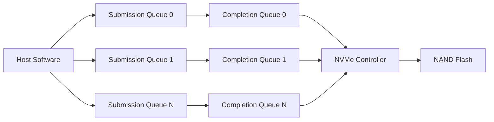
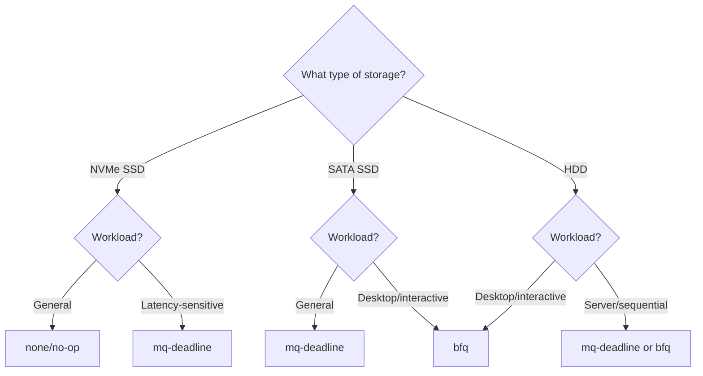
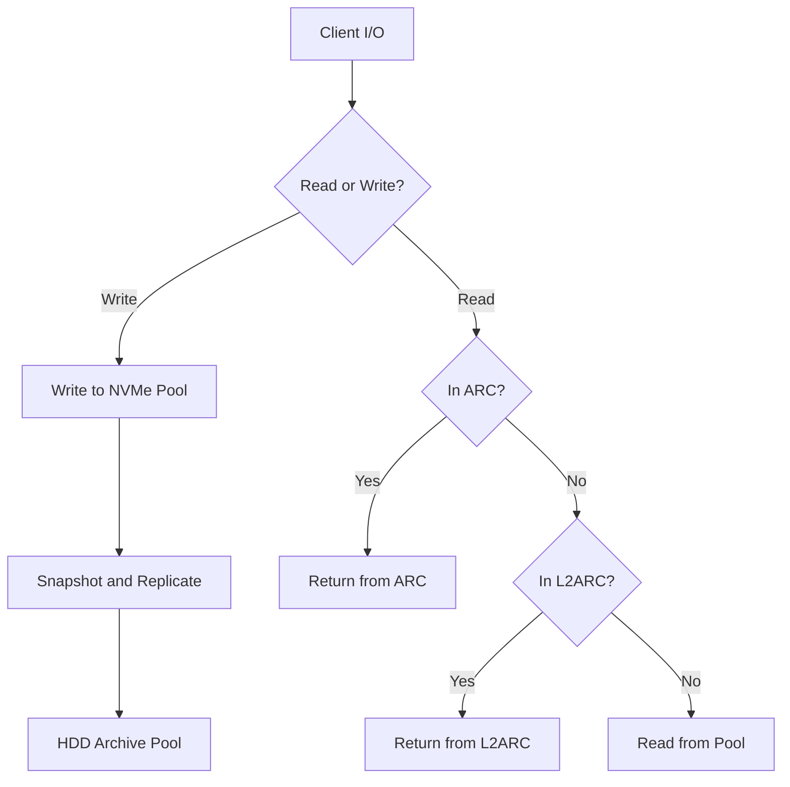

## Storage Hierarchy

### Storage Technologies Compared

| Technology          | Sequential Read    | Sequential Write  | 4K Random Read (IOPS) | 4K Random Write (IOPS) | Latency       |
| ------------------- | ------------------ | ----------------- | --------------------- | ---------------------- | ------------- |
| HDD (7200 RPM)      | 150–250 MB/s       | 150–250 MB/s      | 100–200               | 100–200                | 5–10 ms       |
| SATA SSD            | 500–560 MB/s       | 400–530 MB/s      | 50,000–100,000        | 50,000–90,000          | 50–100 $\mu$s |
| NVMe SSD (PCIe 3.0) | 3,000–3,500 MB/s   | 2,500–3,000 MB/s  | 200,000–500,000       | 200,000–400,000        | 10–30 $\mu$s  |
| NVMe SSD (PCIe 4.0) | 5,000–7,500 MB/s   | 4,500–7,000 MB/s  | 500,000–1,000,000     | 400,000–800,000        | 5–20 $\mu$s   |
| NVMe SSD (PCIe 5.0) | 10,000–14,000 MB/s | 9,000–12,000 MB/s | 1,000,000–2,000,000   | 800,000–1,500,000      | 3–10 $\mu$s   |
| Intel Optane P5800X | 7,200 MB/s         | 6,200 MB/s        | 1,500,000             | 1,100,000              | 6–10 $\mu$s   |

### Choosing the Right Storage

The optimal storage strategy depends on your workload profile:

- **OS and applications:** NVMe SSD (PCIe 4.0+). Fast random I/O makes the system feel responsive.
- **Game library:** NVMe SSD for frequently played games; HDD for archival storage. Load times are
  dominated by sequential read speed and random read IOPS.
- **Media production (video editing):** NVMe SSD with high sustained write endurance. 4K/8K video
  requires 500 MB/s–2 GB/s sustained write.
- **Database workloads:** NVMe SSD with high random IOPS and low latency. Optane is ideal but
  expensive.
- **Backup and archival:** HDD or high-capacity SATA SSD (QLC). Sequential throughput matters more
  than latency.
- **ZFS SLOG (ZIL):** Enterprise NVMe SSD or Optane with power-loss protection (PLP).

---

## NVMe Protocol

### NVMe Architecture

NVMe (Non-Volatile Memory Express) is designed from the ground up for PCIe-attached flash storage,
replacing the legacy AHCI protocol that was designed for spinning disks.

Key architectural advantages over AHCI/SATA:

1. **Multiple queues:** NVMe supports up to 65,535 I/O queues, each with up to 65,535 entries. AHCI
   has a single command queue with 32 entries. This eliminates the queue bottleneck in
   multi-threaded workloads.
2. **Direct CPU access:** NVMe uses MSI-X interrupts and can map completion queues directly into
   user space, reducing interrupt overhead and enabling kernel bypass.
3. **Deep queue depths:** The large number of queue entries allows the storage device to optimize
   its internal command scheduling and garbage collection.
4. **Lower latency:** NVMe eliminates the SATA protocol overhead (command encoding, FIS framing,
   spread spectrum clocking), reducing command latency by 2–5 $\mu$s.

### NVMe Namespaces

A namespace is the NVMe equivalent of a partition — a logical address space exposed to the host.
Most consumer NVMe SSDs expose a single namespace (NSID 1) spanning the entire device. Enterprise
SSDs may support multiple namespaces for partitioning.

```bash
# List NVMe devices
nvme list

# List namespaces on device nvme0
nvme list-ns /dev/nvme0

# Get namespace details
nvme id-ns /dev/nvme0n1
```

### NVMe Power States

NVMe defines several power states (PS0–PS4) that trade off power consumption against latency:

| Power State           | Power    | Exit Latency | Entry Latency |
| --------------------- | -------- | ------------ | ------------- |
| PS0 (Active)          | Highest  | 0            | N/A           |
| PS1                   | Moderate | ~10 $\mu$s   | ~10 $\mu$s    |
| PS2                   | Low      | ~100 $\mu$s  | ~100 $\mu$s   |
| PS3 (Deep Sleep)      | Very Low | ~10 ms       | ~10 ms        |
| PS4 (Deep Power Down) | Minimal  | ~20 ms       | ~20 ms        |

APST (Autonomous Power State Transition) allows the SSD to transition between power states
automatically. On desktops, this is generally fine. On servers with latency-sensitive workloads, you
may want to restrict APST to prevent the SSD from entering deep sleep states.

```bash
# Disable APST on Linux
echo 0 | sudo tee /sys/module/nvme_core/parameters/default_ps_max_latency_us
```

---

## SSD Internals

### NAND Flash Types

NAND flash stores data in cells, with each cell holding one or more bits. More bits per cell
increases density but reduces endurance and performance.

| NAND Type | Bits per Cell | Write Endurance (P/E Cycles) | Relative Cost | Performance               |
| --------- | ------------- | ---------------------------- | ------------- | ------------------------- |
| SLC       | 1             | 100,000                      | Highest       | Best                      |
| MLC       | 2             | 3,000–10,000                 | High          | Good                      |
| TLC       | 3             | 1,000–3,000                  | Medium        | Moderate                  |
| QLC       | 4             | 100–1,000                    | Lowest        | Worst (especially writes) |

Modern "3D NAND" stacks memory cells vertically (64, 128, or 176 layers), increasing density without
shrinking the cell size. This improves endurance compared to planar NAND at the same technology
node.

### SLC Caching

Most TLC and QLC SSDs implement an SLC cache — a portion of the NAND operates in pseudo-SLC mode
(one bit per cell) to boost write performance. When the SLC cache is full, write speeds drop
dramatically as data must be folded from SLC into the TLC/QLC area.

| SSD                       | SLC Cache Size | SLC Cache Speed | Full Speed |
| ------------------------- | -------------- | --------------- | ---------- |
| Samsung 990 Pro 2TB       | ~210 GB        | 6,650 MB/s      | 2,000 MB/s |
| WD Black SN850X 2TB       | ~300 GB        | 6,600 MB/s      | 1,500 MB/s |
| Crucial P3 Plus 2TB (QLC) | ~160 GB        | 5,000 MB/s      | 200 MB/s   |

:::warning QLC SSDs with full SLC caches can experience catastrophic write speed drops — from 5,000
MB/s to under 200 MB/s. This is a fundamental limitation of QLC NAND, not a defect. Avoid QLC SSDs
for write-heavy workloads (video editing, database, OS drive). :::

### Wear Leveling

SSD controllers implement wear leveling to distribute write operations evenly across all NAND
blocks. Two approaches exist:

- **Dynamic wear leveling:** Only moves data that is actively being updated. Free blocks are
  preferentially written to the least-worn physical block.
- **Static wear leveling:** Also moves cold (rarely accessed) data from low-wear blocks to high-wear
  blocks, ensuring all blocks wear evenly. More effective but higher write amplification.

### Garbage Collection

NAND flash cannot overwrite data in place — a block must be erased before it can be written. Erase
operations happen at the block level (typically 4–8 MB), while writes happen at the page level
(typically 4–16 KB). This mismatch necessitates garbage collection:

1. When a page is invalidated (overwritten or deleted), it is marked as stale.
2. When the number of stale pages in a block exceeds a threshold, the controller copies the valid
   pages to a new block and erases the old block.
3. This process is called "garbage collection" and causes write amplification — the physical write
   count exceeds the logical write count.

Write amplification factor (WAF) is the ratio of physical writes to logical writes:

$$
WAF = \frac{Physical\_Writes}{Logical\_Writes}
$$

A WAF of 1.0 means no amplification. In practice, WAF is typically 1.2–3.0 depending on the workload
and the amount of over-provisioning.

---

## TRIM and Over-Provisioning

### TRIM

TRIM is a SATA/NVMe command that tells the SSD which LBAs (Logical Block Addresses) are no longer in
use. Without TRIM, the SSD treats all previously written LBAs as valid data and must copy them
during garbage collection, even if the OS has deleted the files. TRIM allows the SSD to skip copying
deleted data, improving garbage collection efficiency and maintaining write performance.

```bash
# Check if TRIM is supported
sudo hdparm -I /dev/nvme0 | grep "TRIM supported"

# Verify TRIM is active on ext4/xfs
lsblk -D
# Discard column should show "0B" or the device supports it

# Manually TRIM all mounted filesystems
sudo fstrim -av

# Enable periodic TRIM (weekly) with systemd
sudo systemctl enable fstrim.timer
sudo systemctl start fstrim.timer
```

:::warning On ZFS, do not use `fstrim`. ZFS handles discard internally and the `autotrim` pool
property controls TRIM behavior. :::

### Over-Provisioning

Over-provisioning (OP) reserves a portion of the NAND capacity for the SSD controller's use. This
reserved space is not accessible to the host but provides:

1. **More spare blocks for garbage collection**, reducing write amplification.
2. **Better wear leveling**, because more blocks are available to distribute writes across.
3. **Sustained write performance**, because the SLC cache and garbage collection have more room to
   work.

| OP Level         | Usable Capacity (1 TB drive) | Write Performance | Endurance |
| ---------------- | ---------------------------- | ----------------- | --------- |
| 0% (no OP)       | 1 TB                         | Worst             | Worst     |
| 7% (standard)    | ~930 GB                      | Good              | Good      |
| 28% (enterprise) | ~720 GB                      | Best              | Best      |

Consumer SSDs typically have 7% OP built in. Enterprise SSDs have 28% or more. Some consumer SSDs
(e.g., Samsung 840 EVO) allowed you to manually increase OP by shrinking the user-accessible
partition.

---

## RAID Levels

### RAID Comparison

| RAID Level | Min Drives | Fault Tolerance | Capacity     | Read Performance | Write Performance | Use Case                |
| ---------- | ---------- | --------------- | ------------ | ---------------- | ----------------- | ----------------------- |
| 0 (Stripe) | 2          | None            | N × size     | N ×              | N ×               | Scratch space, cache    |
| 1 (Mirror) | 2          | 1 drive         | 1 × size     | N × (some)       | 1 × (some)        | OS, critical data       |
| 5          | 3          | 1 drive         | (N-1) × size | (N-1) ×          | (N-1) × (slow)    | General purpose         |
| 6          | 4          | 2 drives        | (N-2) × size | (N-2) ×          | (N-2) × (slow)    | High availability       |
| 10 (1+0)   | 4          | 1 per mirror    | N/2 × size   | N ×              | N ×               | Databases, high IOPS    |
| Z1         | 3          | 1 drive         | ~85% of raw  | Good             | Moderate          | ZFS equivalent of RAID5 |
| Z2         | 4          | 2 drives        | ~80% of raw  | Good             | Moderate          | ZFS equivalent of RAID6 |
| Z3         | 5          | 3 drives        | ~75% of raw  | Good             | Moderate          | Critical data, ZFS      |

### RAID Write Hole

Traditional RAID 5/6 has a "write hole" vulnerability: if power is lost during a stripe write, the
parity may be inconsistent with the data, leading to silent data corruption. Hardware RAID cards
with battery-backed write cache (BBWC) or ZFS's copy-on-write transaction model address this.

### Why ZFS Is Preferred

ZFS eliminates many traditional RAID problems:

- No write hole (copy-on-write transactions are always consistent)
- No RAID rebuild degradation (resilver prioritizes data, not block order)
- End-to-end checksumming detects silent corruption
- Self-healing repairs corrupted data from parity/mirror copies
- Scrubbing proactively verifies all data integrity

:::warning Never use hardware RAID with ZFS. ZFS needs direct access to individual disks to manage
the storage pool. Hardware RAID hides the disks behind a virtual block device, which prevents ZFS
from performing its error detection and correction. :::

---

## Linux I/O Schedulers

### Available Schedulers

Modern Linux (kernel 5.0+) uses multi-queue block layer (blk-mq) I/O schedulers:

| Scheduler      | Description                                            | Best For                                            |
| -------------- | ------------------------------------------------------ | --------------------------------------------------- |
| `none` (no-op) | No reordering; FIFO dispatch                           | NVMe SSDs (the SSD controller handles optimization) |
| `mq-deadline`  | Deadline-based scheduling with FIFO guarantees         | SATA SSDs, mixed workloads                          |
| `bfq`          | Budget Fair Queueing; per-process bandwidth allocation | Desktop, interactive workloads                      |
| `kyber`        | Low-latency scheduler for fast devices                 | NVMe SSDs                                           |

### Selecting a Scheduler

For NVMe SSDs, `none` is typically the best choice because the SSD's internal controller already has
sophisticated queuing and scheduling logic. Adding a software scheduler on top introduces
unnecessary overhead.

For SATA SSDs, `mq-deadline` provides good latency guarantees without sacrificing throughput.

For HDDs (or HDD-based arrays), `bfq` provides the best interactive responsiveness by preventing
large sequential transfers from starving small random I/O.

```bash
# View current scheduler
cat /sys/block/nvme0n1/queue/scheduler

# Change scheduler (temporary)
echo none | sudo tee /sys/block/nvme0n1/queue/scheduler

# Persistent change via udev rule
# /etc/udev/rules.d/60-scheduler.rules
# ACTION=="add|change", KERNEL=="nvme[0-9]*", ATTR{queue/scheduler}="none"
```

### Queue Depth Tuning

The block layer queue depth determines how many I/O requests can be in flight simultaneously:

```bash
# View current queue depth
cat /sys/block/nvme0n1/queue/nr_requests

# Set queue depth (temporary)
echo 1024 | sudo tee /sys/block/nvme0n1/queue/nr_requests
```

For NVMe SSDs, increasing the queue depth can improve throughput for multi-threaded workloads. The
optimal value depends on the SSD's internal queue depth and the workload's concurrency. Values of
256–1024 are typical for NVMe.

### Read-Ahead

Read-ahead prefetches data into the page cache before it is requested, improving sequential read
performance but wasting memory for random workloads.

```bash
# View read-ahead size (in 512-byte sectors)
cat /sys/block/nvme0n1/queue/read_ahead_kb

# Set read-ahead to 128 KB (good for sequential workloads)
echo 128 | sudo tee /sys/block/nvme0n1/queue/read_ahead_kb

# Disable read-ahead (for random I/O workloads)
echo 0 | sudo tee /sys/block/nvme0n1/queue/read_ahead_kb
```

---

## Filesystem Performance Impact

### Filesystem Comparison

| Filesystem | Features                                     | Best For                       |
| ---------- | -------------------------------------------- | ------------------------------ |
| ext4       | Mature, journaling, robust                   | General purpose, compatibility |
| xfs        | High performance, parallel I/O, large files  | Databases, media production    |
| btrfs      | Copy-on-write, snapshots, checksums          | NAS, desktop (with caution)    |
| f2fs       | Optimized for flash storage                  | Android, embedded, SD cards    |
| zfs        | Data integrity, snapshots, RAID, compression | NAS, servers, backup           |

### mount Options for SSDs

```bash
# ext4 with SSD optimizations
/dev/nvme0n1p2 / ext4 noatime,discard,errors=remount-ro 0 1

# xfs with SSD optimizations
/dev/nvme0n1p2 / xfs noatime,discard 0 0

# Key options:
# noatime  — Don't update file access times (reduces writes)
# discard  — Enable continuous TRIM (or use fstrim.timer)
# nodiratime — Don't update directory access times
```

### ZFS on SSD

For ZFS on SSD, key tunables include:

- `ashift=12` or `ashift=13` (4K or 8K sector size — always match the SSD's physical sector size)
- `primarycache=all` (default — use ARC for caching)
- `compression=lz4` (default — reduces writes and improves performance for compressible data)
- `atime=off` (reduces metadata writes)
- `recordsize=128K` for media files, `recordsize=16K` or `8K` for databases

---

## SMART Monitoring

### Key SMART Attributes

SMART (Self-Monitoring, Analysis, and Reporting Technology) provides predictive failure information
for storage devices.

```bash
# Install smartmontools
sudo apt install smartmontools

# View SMART health
sudo smartctl -a /dev/nvme0n1

# View SMART summary
sudo smartctl -H /dev/nvme0n1

# Run a short self-test
sudo smartctl -t short /dev/nvme0n1

# Run a long self-test
sudo smartctl -t long /dev/nvme0n1

# View test results
sudo smartctl -l selftest /dev/nvme0n1
```

### Critical SMART Attributes for SSDs

| Attribute                       | What It Means               | Warning Threshold       |
| ------------------------------- | --------------------------- | ----------------------- |
| Percentage Used                 | Life remaining based on TBW | &lt; 10%                |
| Media and Data Integrity Errors | Uncorrectable read errors   | Any non-zero value      |
| Critical Warning                | Composite health indicator  | Any non-zero value      |
| Temperature                     | Current temperature         | &gt; 70 °C sustained    |
| Available Spare                 | Reserved blocks remaining   | &lt; 10%                |
| Power Cycles                    | Number of power cycles      | Not directly predictive |
| Power On Hours                  | Total operating time        | Compare against MTBF    |

### Automated SMART Monitoring

```bash
# Enable smartd daemon
sudo systemctl enable smartd
sudo systemctl start smartd

# Configure smartd (/etc/smartd.conf)
# Monitor all drives and send email on failure
DEVICESCAN -m admin@example.com -M exec /usr/share/smartmontools/smartd-runner
```

---

## Common Pitfalls

### Using RAID 5 with Large Drives

The risk of a second drive failure during rebuild increases with drive capacity and count. With 12
TB+ drives, a RAID 5 rebuild can take 24–72 hours, during which a second drive failure (or
unreadable sectors on another drive) causes complete data loss. Use RAID 6 (dual parity) or
RAIDZ2/Z3 for arrays with drives larger than 4 TB.

### Not Enabling TRIM

Without TRIM, SSD performance degrades over time as the garbage collector must process stale data
that the OS has already deleted. This can cause write speeds to drop by 50–80% over weeks or months.
Enable TRIM either continuously (`discard` mount option) or periodically (`fstrim.timer`).

### Using QLC SSDs for Write-Heavy Workloads

QLC NAND has 10–100x lower write endurance than TLC. A QLC SSD rated for 400 TBW may reach its
endurance limit in months under heavy write workloads (e.g., VM images, database logs, video editing
scratch). Check the TBW (Terabytes Written) rating and compare it against your expected annual write
volume.

### Ignoring NVMe Temperature Limits

NVMe SSDs throttle aggressively when they overheat. Consumer NVMe SSDs typically throttle at 70–80
°C. Under sustained write workloads (e.g., cloning a drive, large file transfers), the SSD can hit
thermal throttling within seconds. Ensure the M.2 slot has a heatsink and adequate case airflow.

### Confusing Logical and Physical Sector Size

Many modern SSDs have a 512-byte logical sector size but a 4 KB or 8 KB physical sector size.
Misalignment between the logical and physical sector boundaries (partition not aligned to 4 KB)
causes read-modify-write amplification. Always use partition tools that align to 1 MB boundaries
(parted, gdisk) rather than older tools (fdisk in legacy mode).

## Deep Dive: NVMe Command Structure

### NVMe Admin Commands vs. I/O Commands

NVMe has two command categories:

1. **Admin Commands:** Sent via the Admin Submission Queue (SQ). Used for controller management:
   - Identify Controller (returns controller capabilities and configuration)
   - Identify Namespace (returns namespace parameters)
   - Get/Set Features (configure power states, interrupt coalescing, etc.)
   - Namespace Management (create, delete, attach, detach)
   - Firmware Commit (update controller firmware)
   - Format NVM (secure erase)

2. **I/O Commands:** Sent via I/O Submission Queues. Used for data transfer:
   - Read, Write (standard data commands)
   - Compare (read and compare with host buffer)
   - Write Uncorrectable (inject error for testing)
   - Dataset Management (hints about data usage: read, write, deallocate)

### NVMe Queue Architecture



Each Submission Queue (SQ) and Completion Queue (CQ) pair is associated with a processing core. This
eliminates the lock contention that plagues the single-queue AHCI model:

- **SQ (Submission Queue):** Ring buffer where the host posts commands. The host writes command
  entries to the tail of the queue and rings the doorbell register to notify the controller.
- **CQ (Completion Queue):** Ring buffer where the controller posts completions. The host polls or
  receives interrupts for completed commands.

Queue depth is configurable per queue, with a maximum of 65,535 entries per queue. Deeper queues
allow the SSD controller to reorder and optimize I/O more effectively.

### NVMe Namespace Attributes

```bash
# Detailed namespace information
nvme id-ns /dev/nvme0n1

# Key fields:
# nsze    — Namespace size (total logical blocks)
# ncap    — Namespace capacity (usable blocks)
# nuse    — Namespace utilization (used blocks)
# nlbaf   — Number of LBA formats supported
# flbas   — Current LBA format (data size + metadata size)
# dps     — Data protection (end-to-end protection type)
# nmc     — Namespace multi-path I/O and sharing capabilities
```

### NVMe End-to-End Data Protection

NVMe supports optional end-to-end data protection using protection information (PI) appended to each
logical block:

| PI Type   | Size    | Protection                                            |
| --------- | ------- | ----------------------------------------------------- |
| PI Type 0 | 0 bytes | No protection                                         |
| PI Type 1 | 8 bytes | Guard + Application Tag + Logical Block Reference Tag |
| PI Type 2 | 4 bytes | Guard + Logical Block Reference Tag                   |
| PI Type 3 | 8 bytes | Guard + Application Tag                               |

Type 1 is the most comprehensive and is recommended for enterprise workloads where data integrity is
critical.

## SSD Firmware Management

### Checking and Updating Firmware

SSD firmware updates can fix bugs, improve performance, and extend drive lifespan:

```bash
# Check current firmware version
nvme id-ctrl /dev/nvme0n1 | grep fr

# Samsung NVMe firmware update (using samsung_magician or nvme-cli)
# Intel NVMe firmware update (using intelmas or nvme-cli fw-download)
sudo nvme fw-download /dev/nvme0n1 --fw=/path/to/firmware.bin
sudo nvme fw-commit /dev/nvme0n1 --action=1  # 1 = apply immediately

# Check for firmware updates without applying
sudo nvme fw-download /dev/nvme0n1 --fw=/path/to/firmware.bin --save
```

### When to Update Firmware

- When the manufacturer releases a stability fix for your specific drive model
- When you experience unexpected behavior (drops to lower power states, intermittent timeouts)
- Before initial deployment of a new drive
- When a security vulnerability is disclosed in the firmware

:::warning Firmware updates are irreversible on most drives. A failed firmware update can brick the
drive. Ensure the update process is not interrupted (connect the drive to a UPS, close all
applications accessing the drive). :::

## Deep Dive: I/O Scheduler Internals

### mq-deadline Scheduler

The `mq-deadline` scheduler maintains two sorted queues:

- **Read queue:** Sorted by request deadline (earliest first).
- **Write queue:** Sorted by request deadline (earliest first).

Each request is assigned a deadline based on its target sector:

$$
deadline = current\_time + target\_latency
$$

The scheduler always dispatches the request with the earliest deadline. If a batch of reads or
writes accumulates, the scheduler alternates between read and write batches to prevent starvation:

- Maximum number of reads dispatched before switching to writes: 8 (configurable)
- Maximum number of writes dispatched before switching to reads: 8 (configurable)

### bfq Scheduler

BFQ (Budget Fair Queueing) assigns each process an I/O budget. A process can issue I/O until its
budget is exhausted, then it must wait for other processes to use their budgets:

- **Budget:** Measured in sectors served. Default is approximately 128 KB per budget slice.
- **Weighting:** Higher-priority processes get larger budgets (configurable via cgroups).
- **Seek optimization:** BFQ accounts for disk seek time when choosing the next request. Requests
  that are close to the current head position are dispatched first.

BFQ is the best choice for desktop systems where interactive responsiveness matters more than
throughput.

### Scheduler Selection Decision Tree



## Advanced Block Layer Tuning

### Nomerges

The block layer can merge adjacent I/O requests to reduce per-request overhead. However, excessive
merging can increase latency for individual requests:

```bash
# View current merge settings
cat /sys/block/nvme0n1/queue/nomerges

# Values:
# 0 — Merge all types
# 1 — Merge only simple adjacent requests
# 2 — Merge all types including cross-queue merges
# 2 — No merging
```

For low-latency workloads (databases), disabling merges (`nomerges=2`) can reduce latency at the
cost of higher command overhead.

### nr_requests and scheduler_quantum

```bash
# Block layer request queue depth
cat /sys/block/nvme0n1/queue/nr_requests
# Default: 128. Increase to 256-1024 for NVMe SSDs.

# Scheduler quantum (number of requests dispatched per round-robin cycle)
cat /sys/block/nvme0n1/queue/scheduler_quantum
# Default: 8. Increase for throughput-oriented workloads.
```

### write_same and discard_zeroes_data

```bash
# Write Same optimization (writes the same data to multiple blocks)
cat /sys/block/nvme0n1/queue/write_same_max_bytes

# Discard zeroes data (does a discard return zeroes?)
cat /sys/block/nvme0n1/queue/discard_zeroes_data
```

These parameters affect how the kernel handles TRIM/discard commands and block-level write
optimizations.

## Filesystem-Specific Optimization

### ext4 Tuning for SSDs

```bash
# Mount options for ext4 on NVMe SSD
/dev/nvme0n1p2 / ext4 noatime,discard,errors=remount-ro,commit=60,barrier=1 0 1

# Key options:
# commit=60    — Flush data to disk every 60 seconds (default is 5)
# barrier=1    — Enable write barriers (safe, slight overhead)
# journal_opts=journal_async_commit — Asynchronous journal commits (faster but slightly less safe)
```

### XFS Tuning for SSDs

```bash
# Mount options for XFS on NVMe SSD
/dev/nvme0n1p2 / xfs noatime,discard,allocsize=64m,inode64 0 0

# Key options:
# allocsize=64m — Delayed allocation size (larger = better sequential write performance)
# inode64     — Allow inode allocation across the entire filesystem (not just the first 1 TB)
# logbufs=8   — Increase log buffer count (default is 2, useful for metadata-heavy workloads)
# logbsize=256k — Increase log buffer size
```

### BTRFS on SSDs

```bash
# Mount options for BTRFS on SSD
/dev/nvme0n1p2 / btrfs noatime,ssd,discard=async,compress=zstd:1,space_cache=v2 0 0

# Key options:
# ssd           — Enable SSD-specific optimizations (reduced seek cost model)
# discard=async — Background discard (better than continuous discard for SSDs)
# space_cache=v2 — Free space tree (more efficient than v1 for large filesystems)
# compress=zstd:1 — Lightweight compression (fast, saves space without significant CPU cost)
```

## Storage Performance Benchmarking

### fio Workload Profiles

```bash
# Database simulation (random read/write, 4K blocks)
fio --name=db-test --ioengine=libaio --iodepth=64 --rw=randrw \
    --rwmixread=70 --bs=4k --direct=1 --size=4G --numjobs=4 \
    --runtime=300 --group_reporting --output-format=json

# Web server simulation (random read, 4K-16K blocks)
fio --name=web-test --ioengine=libaio --iodepth=32 --rw=randread \
    --bs=4k --direct=1 --size=2G --numjobs=8 \
    --runtime=300 --group_reporting

# Media streaming (sequential read, 128K blocks)
fio --name=media-test --ioengine=libaio --iodepth=32 --rw=read \
    --bs=128k --direct=1 --size=16G --numjobs=1 \
    --runtime=300 --group_reporting

# Write endurance test (sequential write, 1M blocks)
fio --name=endurance-test --ioengine=libaio --iodepth=32 --rw=write \
    --bs=1m --direct=1 --size=32G --numjobs=1 \
    --runtime=3600 --group_reporting
```

### Interpreting fio Results

Key metrics to analyze from fio JSON output:

| Metric   | Description                 | Good Value                                  |
| -------- | --------------------------- | ------------------------------------------- |
| iops     | I/O operations per second   | Workload-dependent                          |
| lat_ns   | Latency in nanoseconds      | p99 &lt; 1ms for NVMe                       |
| clat_ns  | Completion latency          | Lower is better                             |
| slat_ns  | Submission latency          | Should be &lt; 10 $\mu$s                    |
| bw       | Bandwidth in KB/s           | Near theoretical max                        |
| cpu_util | CPU utilization during test | &lt; 80% (CPU should not be the bottleneck) |

## Storage Reliability Engineering

### UBER (Uncorrectable Bit Error Rate)

Every storage medium has a specified UBER — the probability of an unrecoverable bit error:

| Medium          | UBER       | Probability of reading error for 1 TB |
| --------------- | ---------- | ------------------------------------- |
| HDD             | $10^{-14}$ | ~1 in 9 million full reads            |
| Enterprise SSD  | $10^{-17}$ | ~1 in 9 billion full reads            |
| Enterprise NVMe | $10^{-17}$ | ~1 in 9 billion full reads            |

While these numbers seem reassuring, they compound in large-scale deployments:

$$
P(\mathrm{error in array}) = 1 - (1 - UBER)^{N_{drives} \times N_{reads}}
$$

This is why ZFS checksumming is essential — it detects and corrects these errors that would
otherwise cause silent data corruption.

### Wear Leveling Depth

Wear leveling effectiveness determines SSD lifespan:

$$
\mathrm{Minimum Lifespan} = \frac{\mathrm{Total Writes}}{\mathrm{P/E Cycles} \times \mathrm{Capacity}}
$$

For a 2 TB TLC SSD with 3,000 P/E cycles and a sustained write rate of 50 GB/day:

$$
\mathrm{Lifespan} = \frac{3000 \times 2 \mathrm{ TB}}{50 \mathrm{ GB/day}} = 120,000 \mathrm{ days} \approx 328 \mathrm{ years}
$$

In practice, write amplification (WAF 1.2–3.0) and real-world write patterns reduce this
significantly. A more realistic estimate with WAF of 2.0:

$$
\mathrm{Lifespan} = \frac{3000 \times 2 \mathrm{ TB}}{2.0 \times 50 \mathrm{ GB/day}} \approx 164 \mathrm{ years}
$$

Modern TLC SSDs are extremely durable for typical workloads. QLC SSDs (100–1,000 P/E cycles) are the
concern — at 500 P/E cycles and 50 GB/day with WAF 2.0:

$$
\mathrm{Lifespan} = \frac{500 \times 2 \mathrm{ TB}}{2.0 \times 50 \mathrm{ GB/day}} \approx 27 \mathrm{ years}
$$

Still long for typical desktop use, but write-heavy workloads (video editing, VM images) can
significantly reduce this.

## Hybrid Storage Configurations

### Intel Optane as ZFS SLOG

Intel Optane DC P5800X and P4800X drives are the gold standard for ZFS SLOG devices due to their
consistent low latency regardless of workload:

| Drive         | Read Latency | Write Latency | Endurance | Capacity       |
| ------------- | ------------ | ------------- | --------- | -------------- |
| Optane P5800X | 6 $\mu$s     | 6 $\mu$s      | 100 DWPD  | 400 GB–1.6 TB  |
| Samsung PM9A3 | 25 $\mu$s    | 45 $\mu$s     | 3 DWPD    | 960 GB–7.68 TB |
| Intel P4510   | 40 $\mu$s    | 60 $\mu$s     | 1 DWPD    | 1–8 TB         |

DWPD (Drive Writes Per Day) measures endurance relative to capacity. A 100 DWPD drive can be written
to 100 times its capacity every day for 5 years.

### L2ARC Sizing Guidelines

The optimal L2ARC size depends on the ARC size and the working set:

- **Minimum useful L2ARC size:** Equal to the ARC size. Smaller L2ARC devices provide minimal
  benefit because the metadata overhead consumes too much of the available space.
- **Recommended L2ARC size:** 3–10x the ARC size. This provides enough capacity for the L2ARC to
  store a meaningful portion of the working set that overflows from the ARC.
- **L2ARC for SSD pools:** Generally not recommended. The pool SSDs already provide low-latency
  access. L2ARC adds cost and complexity without significant benefit.

### L2ARC Metadata Impact

L2ARC metadata is stored in the ARC, consuming RAM proportional to the number of L2ARC entries:

$$
ARC_{metadata} \approx 70 \mathrm{ bytes} \times \mathrm{L2ARC\_entries}
$$

For a 1 TB L2ARC with 4 KB average block size, this is approximately 17.5 GB of ARC metadata. Ensure
you have sufficient RAM to accommodate both the ARC and L2ARC metadata.

## Storage Tiering Strategies

### Hot-Warm-Cold Architecture



**Hot tier (NVMe SSD):** Active working data. Databases, VM images, frequently accessed files.

**Warm tier (SATA SSD):** Recently accessed data. Media libraries, documents, infrequently used VMs.

**Cold tier (HDD):** Archive data. Backups, long-term storage, rarely accessed files.

### Tiering Implementation with ZFS

ZFS does not have native automatic tiering. You can implement manual tiering with:

1. **Separate pools for each tier** with different storage devices.
2. **Periodic scripts** that move data between tiers based on access patterns (using `zfs send` and
   `zfs recv`).
3. **L2ARC** as a read cache for the warm tier, backed by the hot tier.
4. **ZFS special vdevs** for metadata, storing metadata on fast storage while data lives on slower
   storage.

## Power Management for Storage

### NVMe APST Configuration

```bash
# Check APST status
cat /sys/module/nvme_core/parameters/default_ps_max_latency_us

# Disable APST (set to 0)
echo 0 | sudo tee /sys/module/nvme_core/parameters/default_ps_max_latency_us

# Enable APST with a latency target (in microseconds)
# 200000 us = 200 ms (moderate aggressiveness)
echo 200000 | sudo tee /sys/module/nvme_core/parameters/default_ps_max_latency_us

# Set per-device APST
echo 0 | sudo tee /sys/class/nvme/nvme0/power/pm_qos_latency_tolerance_us
```

### HDD Standby Configuration

```bash
# Set HDD standby timeout (in seconds, 0 = never)
hdparm -S 60 /dev/sda  # Standby after 60 seconds of inactivity
hdparm -y /dev/sda     # Immediately enter standby

# APM (Advanced Power Management) level
hdparm -B 127 /dev/sda  # 1 (aggressive) to 255 (disabled)
```

:::warning Frequent HDD spin-up/spin-down cycles increase wear. Set standby timeout to a reasonable
value (15–30 minutes) rather than a short interval. :::

:::

:::

:::

:::

:::
