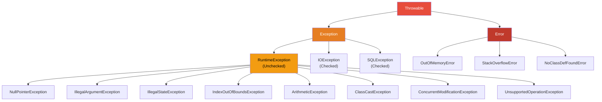

## Conditional Statements

### if / else if / else

The `if` statement is the most fundamental control flow construct. Java evaluates the condition as a `boolean` expression -- unlike C and C++, Java does not allow integer-to-boolean coercion.

```java
int value = 42;

// Java requires an explicit boolean condition
if (value > 0) {
    System.out.println("positive");
} else if (value == 0) {
    System.out.println("zero");
} else {
    System.out.println("negative");
}

// This is a compile error in Java (unlike C/C++):
// if (value) { }  // error: incompatible types: int cannot be converted to boolean
```

The rationale for requiring explicit boolean conditions ([JLS §14.9](https://docs.oracle.com/javase/specs/jls/se21/html/jls-14.html#jls-14.9)) is to eliminate an entire class of bugs where a non-zero integer is mistakenly used as a truthy value. In C, `if (x = 5)` assigns 5 to `x` and evaluates to true; in Java, this is a compile-time error.

### Dangling else Problem

Java resolves the dangling else ambiguity by binding `else` to the nearest preceding `if` that lacks an `else`. This is the same rule used by most C-family languages.

```java
if (a > 0)
    if (b > 0)
        System.out.println("both positive");
    else
        // This else binds to the inner if, NOT the outer if
        System.out.println("a positive, b non-positive");

// To bind the else to the outer if, use explicit braces:
if (a > 0) {
    if (b > 0) {
        System.out.println("both positive");
    }
} else {
    System.out.println("a non-positive");
}
```

:::warning
Always use braces for `if`/`else` blocks, even when the body is a single statement. This eliminates the dangling else ambiguity entirely and prevents bugs when statements are added later.
:::

## The switch Statement

### Traditional switch (Java 1.0+)

The traditional `switch` statement evaluates an expression and transfers control to a matching `case` label. Without `break`, execution **falls through** to subsequent cases -- a notorious source of bugs.

```java
int dayOfWeek = 3;

switch (dayOfWeek) {
    case 1:
        System.out.println("Monday");
        break;
    case 2:
        System.out.println("Tuesday");
        break;
    case 3:
        System.out.println("Wednesday");
        break;
    case 4:
        System.out.println("Thursday");
        break;
    case 5:
        System.out.println("Friday");
        break;
    case 6:
    case 7:
        System.out.println("Weekend");
        break;
    default:
        System.out.println("Invalid day");
        break;
}
```

The fall-through behavior is **intentional** and documented in [JLS §14.11](https://docs.oracle.com/javase/specs/jls/se21/html/jls-14.html#jls-14.11). It allows grouping multiple cases that share the same logic (as shown for days 6 and 7 above). However, accidental fall-through is one of the most common sources of bugs in Java code.

The supported types for traditional switch are: `byte`, `short`, `char`, `int`, their wrapper classes (`Byte`, `Short`, `Character`, `Integer`), `String` (since Java 7), and enums (since Java 5).

:::danger
The traditional switch has several design flaws: fall-through is error-prone, variables declared in one `case` scope leak into subsequent cases, and the entire construct is statement-oriented (it cannot produce a value). These flaws motivated the introduction of switch expressions.
:::

### Switch Expressions (Java 14+)

Switch expressions ([JEP 361](https://openjdk.org/jeps/361), standardized in Java 14) transform `switch` from a statement into an expression that yields a value. They use the `->` arrow syntax and do not fall through.

```java
String dayType = switch (dayOfWeek) {
    case 1, 2, 3, 4, 5 -> "Weekday";
    case 6, 7 -> "Weekend";
    default -> "Invalid";
};
```

Key differences from traditional switch:

1. **No fall-through**: Each arrow branch produces exactly one value. Multiple case labels can be comma-separated.
2. **Expression-oriented**: The entire switch can be assigned to a variable, returned from a method, or used as an argument.
3. **Exhaustiveness**: The compiler requires all possible values to be covered. For enums and sealed classes, the compiler can verify completeness without a `default`.
4. **No variable scope leaking**: Each branch has its own scope.

```java
// Switch expression with block body
String result = switch (status) {
    case SUCCESS -> {
        log("Operation succeeded");
        yield "ok";
    }
    case FAILURE -> {
        int code = getErrorCode();
        log("Operation failed with code " + code);
        yield "error:" + code;
    }
    default -> "unknown";
};

// Used as a method return value
String describe(int score) {
    return switch (score / 10) {
        case 10, 9 -> "Excellent";
        case 8, 7 -> "Good";
        case 6 -> "Acceptable";
        case 5, 4, 3, 2, 1, 0 -> "Failing";
        default -> throw new IllegalArgumentException("Invalid score: " + score);
    };
}
```

The `yield` keyword (not `return`) is used to produce a value from a block body within a switch expression. Using `return` inside a switch expression block is a compile error because `return` exits the enclosing method, not just the switch arm.

### Pattern Matching in switch (Java 21+)

Pattern matching in switch ([JEP 441](https://openjdk.org/jeps/441), standardized in Java 21) allows matching not just on constant values but on **types**, with automatic extraction of component values. This eliminates verbose `instanceof` chains.

```java
static String formatter(Object obj) {
    return switch (obj) {
        case Integer i -> String.format("int %d", i);
        case Long l    -> String.format("long %d", l);
        case Double d  -> String.format("double %f", d);
        case String s  when s.length() > 5 -> String.format("long string: %s", s);
        case String s  -> String.format("string: %s", s);
        case int[] arr -> "array of length " + arr.length;
        case null      -> "null";
        default        -> obj.toString();
    };
}
```

Guards (`when`) add additional conditions to a pattern case. The pattern variable is in scope for the guard expression.

```java
// Guards with pattern matching
String classify(Object obj) {
    return switch (obj) {
        case CharSequence cs when cs.isEmpty() -> "empty sequence";
        case CharSequence cs -> "non-empty sequence: " + cs;
        case Object o -> "something else: " + o;
    };
}

// Exhaustive matching with sealed hierarchies
double area(Shape shape) {
    return switch (shape) {
        case Circle c -> Math.PI * c.radius() * c.radius();
        case Rectangle r -> r.width() * r.height();
        case Triangle t -> 0.5 * t.base() * t.height();
        // No default needed -- the compiler knows all permitted subtypes of Shape
    };
}
```

### Design Decision: Why Switch Expressions Replaced Switch Statements

The traditional `switch` statement was one of the most bug-prone constructs in Java. The problems were not accidental -- they reflected fundamental limitations of a statement-oriented design:

1. **Fall-through was a design mistake for modern code**. Fall-through originated in C to allow case merging, but it meant every `case` required an explicit `break` or a comment explaining intentional fall-through. Google's code style analysis found that fall-through bugs constituted a significant fraction of defect reports. Switch expressions eliminate this entirely by making each branch independent.

2. **Statements cannot produce values**. The traditional switch required assigning to a pre-declared variable or using a separate return statement. This is verbose and makes the intent unclear. Switch expressions allow the switch to be a first-class value-producing expression, aligning with functional style and enabling use in contexts like lambda expressions and ternary operators.

3. **Exhaustiveness checking was impossible**. With traditional switch, the compiler could not verify that all enum constants or sealed subtypes were handled. Switch expressions, combined with sealed classes, enable the compiler to prove exhaustiveness at compile time -- catching missing cases before they become runtime bugs.

4. **Scope rules were broken**. Variables declared in one `case` leaked into subsequent cases, creating shadowing bugs. Switch expressions give each branch its own scope, eliminating this class of errors entirely.

The transition from statement to expression is part of a broader trend in Java's evolution: moving from imperative, statement-heavy code toward more declarative, expression-oriented code. Records, sealed classes, and pattern matching all follow the same philosophy.

## Loop Constructs

### The for Loop (Traditional)

The traditional `for` loop gives explicit control over initialization, condition, and update steps.

```java
// Classic indexed loop
for (int i = 0; i < array.length; i++) {
    System.out.println(array[i]);
}

// Loop with multiple variables
for (int i = 0, j = array.length - 1; i < j; i++, j--) {
    // reverse traversal from both ends
    int temp = array[i];
    array[i] = array[j];
    array[j] = temp;
}

// Infinite loop with break
for (;;) {
    if (shouldStop()) break;
    processNext();
}
```

The initialization, condition, and update components are all optional. A `for (;;)` is the idiomatic infinite loop in Java.

### The Enhanced for Loop (for-each, Java 5+)

The enhanced for loop ([JLS §14.14.2](https://docs.oracle.com/javase/specs/jls/se21/html/jls-14.html#jls-14.14.2)) iterates over arrays and objects that implement `Iterable`. It is syntactic sugar -- the compiler translates it into an `Iterator`-based loop (or indexed loop for arrays).

```java
int[] numbers = {1, 2, 3, 4, 5};

// Enhanced for loop over array
for (int n : numbers) {
    System.out.println(n);
}

// Enhanced for loop over Iterable
List<String> names = List.of("Alice", "Bob", "Charlie");
for (String name : names) {
    System.out.println(name);
}

// The enhanced for loop is equivalent to:
for (Iterator<String> it = names.iterator(); it.hasNext(); ) {
    String name = it.next();
    System.out.println(name);
}
```

:::warning
The enhanced for loop does not provide access to the index. If you need the index, use the traditional for loop. Additionally, the enhanced for loop does not allow modification of the collection during iteration (any structural modification throws `ConcurrentModificationException`).
:::

### while and do-while

```java
// while loop -- test before execution (may execute zero times)
while (hasMoreData()) {
    processChunk(readNext());
}

// do-while loop -- test after execution (executes at least once)
do {
    promptUser();
    input = readInput();
} while (!input.isValid());
```

The `do-while` loop guarantees at least one execution of the body. It is the correct choice when the loop body must run before the condition can be evaluated (e.g., reading input before validating it).

:::info JLS Reference
[JLS §14.12](https://docs.oracle.com/javase/specs/jls/se21/html/jls-14.html#jls-14.12) defines the `while` statement. [JLS §14.13](https://docs.oracle.com/javase/specs/jls/se21/html/jls-14.html#jls-14.13) defines the `do` statement.
:::

## break, continue, and Labeled Statements

### Unlabeled break and continue

`break` exits the innermost enclosing `switch`, `for`, `while`, or `do-while` statement. `continue` skips to the next iteration of the innermost enclosing loop.

```java
// break exits the loop entirely
for (int i = 0; i < 100; i++) {
    if (i == 42) break;   // loop terminates when i reaches 42
    System.out.println(i);
}

// continue skips to the next iteration
for (int i = 0; i < 10; i++) {
    if (i % 2 == 0) continue;  // skip even numbers
    System.out.println(i);       // prints only odd numbers: 1, 3, 5, 7, 9
}
```

### Labeled break and continue

Java supports labeled statements, which allow `break` and `continue` to target an outer loop rather than the innermost one. This is one of the few areas where Java's syntax resembles C's `goto` -- and it exists specifically to avoid the need for `goto`.

```java
// Labeled break -- exits the labeled loop entirely
search:
for (int row = 0; row < matrix.length; row++) {
    for (int col = 0; col < matrix[row].length; col++) {
        if (matrix[row][col] == target) {
            foundRow = row;
            foundCol = col;
            break search;  // exits the outer for loop, not just the inner one
        }
    }
}

// Labeled continue -- skips to the next iteration of the labeled loop
outer:
for (int i = 0; i < rows; i++) {
    for (int j = 0; j < cols; j++) {
        if (shouldSkipRow(i, j)) {
            continue outer;  // skips to the next iteration of the outer loop
        }
        process(i, j);
    }
}
```

:::info
Labels follow the same naming rules as identifiers. A label is attached to a statement by prefixing it with `label:`. The label is only useful when referenced by a `break label;` or `continue label;` statement inside a nested loop. Labels cannot target arbitrary statements -- only loop and switch statements can be the target of `break`, and only loops can be the target of `continue`.
:::

## Exception Handling

### The Exception Hierarchy

Java's exception system is rooted at `java.lang.Throwable`. The hierarchy divides into two main branches: `Error` and `Exception`, with the latter further subdivided into checked and unchecked exceptions.



:::info JLS Reference
[JLS §11.1](https://docs.oracle.com/javase/specs/jls/se21/html/jls-11.html#jls-11.1) defines the Throwable hierarchy and the distinction between unchecked and checked exceptions.
:::

**Throwable** -- The root of the exception hierarchy. It carries a detail message and an optional cause (for chaining). Only instances of `Throwable` (or subclasses) can be thrown by `throw` or caught by `catch`.

**Error** -- Represents serious problems that applications should not attempt to catch. These typically indicate JVM-level failures: `OutOfMemoryError`, `StackOverflowError`, `NoClassDefFoundError`. Catching `Error` is almost always wrong -- if the JVM is out of memory, there is no safe way to continue.

**Exception** -- Represents conditions that a reasonable application might want to catch and recover from. `Exception` is the superclass of all checked exceptions.

**RuntimeException** -- The superclass of all unchecked exceptions. These represent programming errors (logic bugs) that the programmer could have prevented: `NullPointerException`, `IllegalArgumentException`, `IndexOutOfBoundsException`, `ClassCastException`.

### Checked vs Unchecked Exceptions

The distinction between checked and unchecked exceptions is one of Java's most distinctive -- and most controversial -- language features.

**Checked exceptions** must be either caught with a `try-catch` block or declared in the method signature with a `throws` clause. The compiler enforces this at compile time. `Exception` and its subclasses (except `RuntimeException`) are checked.

**Unchecked exceptions** do not require explicit handling. They include `RuntimeException` and its subclasses, as well as `Error` and its subclasses.

```java
// Checked exception -- must be caught or declared
public void readFile(String path) throws IOException {
    FileReader reader = new FileReader(path);
    // compiler error if IOException is not caught or declared
}

// Unchecked exception -- no declaration required
public int divide(int a, int b) {
    return a / b;  // ArithmeticException is unchecked, no throws needed
}
```

### Design Decision: Why Java Has Checked Exceptions (And Why They Are Controversial)

Checked exceptions were introduced in Java 1.0 based on a design philosophy that **exception handling is part of a method's contract**, just like its parameter types and return type. The rationale was:

1. **API contracts should be explicit**. If a method can fail with `IOException`, the caller must be aware of this and decide how to handle it. Checked exceptions make failure modes visible in the method signature, analogous to how return types make success modes visible.

2. **Forces error handling at the right level**. Without checked exceptions, programmers routinely ignore error conditions. Checked exceptions force a decision at compile time: handle it here, or propagate it up the call stack.

3. **Enables separation of business logic and error recovery**. The compiler ensures that error paths exist, making it harder to forget error handling entirely.

However, checked exceptions have become increasingly controversial, and most modern languages (Kotlin, Scala, C#, Go) do not include them. The arguments against are:

1. **Signature pollution**. When low-level methods throw checked exceptions, every method in the call chain must either catch them or declare them. This forces implementation details to leak through the entire API. A method like `processUser()` might be forced to declare `throws SQLException, IOException, ParseException` even though these are irrelevant to its callers.

2. **The catch-and-rethrow antipattern**. The most common "handling" of checked exceptions is to wrap them in unchecked exceptions or log and rethrow, which adds no value:

```java
// The boilerplate that checked exceptions force
try {
    service.doWork();
} catch (IOException e) {
    throw new RuntimeException("Failed to do work", e);  // no actual handling
} catch (SQLException e) {
    throw new RuntimeException("Database error", e);    // no actual handling
}
```

3. **Encapsulation violation**. A checked exception exposes an implementation detail. If `UserService` initially uses file-based storage and declares `throws IOException`, switching to a database implementation requires changing the method signature, breaking all callers.

4. **Interaction with lambdas and functional interfaces**. Checked exceptions are particularly painful with lambdas because functional interfaces in `java.util.function` do not declare checked exceptions. This creates friction when using checked-exception-throwing code in streams.

5. **Empirical evidence of poor handling**. Studies of large Java codebases found that the majority of checked exceptions are either caught and wrapped in unchecked exceptions, logged and swallowed, or declared in signatures without meaningful handling at any level of the call stack.

The pragmatic approach in modern Java is to use checked exceptions sparingly -- only for recoverable conditions that callers can meaningfully handle (such as validation errors or file-not-found scenarios) -- and to prefer unchecked exceptions for programming errors and infrastructure failures.

### try-catch-finally

```java
try {
    // Code that might throw
    FileReader reader = new FileReader("data.txt");
    // ...
} catch (FileNotFoundException e) {
    // Handle specific exception first
    System.err.println("File not found: " + e.getMessage());
} catch (IOException e) {
    // Broader exception caught after specific ones
    System.err.println("I/O error: " + e.getMessage());
} catch (Exception e) {
    // Catch-all (usually not recommended)
    System.err.println("Unexpected error: " + e.getMessage());
} finally {
    // Always executes, even if an exception is thrown, caught, or
    // if the try or catch block contains a return statement
    System.out.println("Cleanup executed");
}
```

**Execution order rules**:

1. If no exception is thrown, the `try` block completes, then `finally` executes.
2. If an exception is thrown and caught, the matching `catch` block executes, then `finally` executes.
3. If an exception is thrown and not caught, `finally` executes before the exception propagates.
4. If a `catch` block throws an exception, `finally` still executes before the new exception propagates.
5. If `finally` also throws an exception, it **replaces** any exception thrown in the `try` or `catch` block.

:::danger
If both the `try` block and the `finally` block throw exceptions, the exception from `finally` replaces the original exception. This silently swallows the original error. Always ensure `finally` blocks cannot throw exceptions.
:::

```java
// Dangerous: finally block that can throw
try {
    throw new IllegalStateException("original problem");
} finally {
    // If this throws, the IllegalStateException is lost forever
    closeResource();  // might throw IOException
}

// Safe: suppress exceptions in finally
try {
    throw new IllegalStateException("original problem");
} finally {
    try {
        closeResource();
    } catch (IOException e) {
        // log but don't throw -- preserve the original exception
    }
}
```

### try-with-resources (AutoCloseable, Java 7+)

The try-with-resources statement ([JEP 234](https://openjdk.org/jeps/234), [JLS §14.20.3](https://docs.oracle.com/javase/specs/jls/se21/html/jls-14.html#jls-14.20.3)) automatically closes resources that implement `AutoCloseable` when the `try` block exits, whether normally or exceptionally.

```java
// Before Java 7 -- manual resource management (verbose, error-prone)
BufferedReader reader = null;
try {
    reader = new BufferedReader(new FileReader("data.txt"));
    String line;
    while ((line = reader.readLine()) != null) {
        System.out.println(line);
    }
} catch (IOException e) {
    System.err.println("Error reading file: " + e.getMessage());
} finally {
    if (reader != null) {
        try {
            reader.close();  // can itself throw IOException
        } catch (IOException e) {
            // silently swallowed -- dangerous
        }
    }
}

// Java 7+ -- try-with-resources (concise, correct)
try (BufferedReader reader = new BufferedReader(new FileReader("data.txt"))) {
    String line;
    while ((line = reader.readLine()) != null) {
        System.out.println(line);
    }
}  // reader.close() is called automatically
```

Resources are closed in **reverse order** of their declaration. If closing a resource throws an exception, it is either added as a suppressed exception (if the `try` block also threw) or propagated as the primary exception.

```java
// Multiple resources
try (
    FileInputStream fis = new FileInputStream("input.bin");
    BufferedInputStream bis = new BufferedInputStream(fis);
    ObjectInputStream ois = new ObjectInputStream(bis)
) {
    // use ois
}  // closed in order: ois, bis, fis

// Suppressed exceptions
try (Reader r = new FailingReader()) {
    throw new IllegalStateException("primary problem");
} catch (IllegalStateException e) {
    // e.getMessage() == "primary problem"
    // e.getSuppressed()[0] is the IOException from close()
}
```

:::info
`AutoCloseable.close()` is declared to throw `Exception`. `Closeable` (a subinterface) narrows this to `IOException`. Any resource that needs cleanup should implement `AutoCloseable`. The compiler generates the equivalent of a `finally` block that calls `close()` on each declared resource in reverse order.
:::

### Custom Exceptions

```java
// Checked custom exception -- for recoverable conditions
public class InsufficientFundsException extends Exception {
    private final long accountId;
    private final double requestedAmount;
    private final double availableBalance;

    public InsufficientFundsException(long accountId, double requested,
                                      double available) {
        super(String.format(
            "Account %d: requested %.2f but only %.2f available",
            accountId, requested, available));
        this.accountId = accountId;
        this.requestedAmount = requested;
        this.availableBalance = available;
    }

    public long getAccountId() { return accountId; }
    public double getRequestedAmount() { return requestedAmount; }
    public double getAvailableBalance() { return availableBalance; }
}

// Unchecked custom exception -- for programming errors
public class InvalidTransactionException extends RuntimeException {
    public InvalidTransactionException(String message) {
        super(message);
    }

    public InvalidTransactionException(String message, Throwable cause) {
        super(message, cause);
    }
}
```

Design guidelines for custom exceptions:

1. **Extend `Exception` (checked)** when the caller can reasonably recover from the condition and take meaningful action.
2. **Extend `RuntimeException` (unchecked)** when the condition represents a programming error that cannot be meaningfully handled at runtime (invalid arguments, illegal state, null references).
3. **Always provide both constructors**: one that takes a message, and one that takes a message and a cause (for exception chaining).
4. **Include diagnostic data** as fields, not just in the message string. This enables programmatic inspection of the exception.

### Exception Chaining

Exception chaining allows wrapping a lower-level exception in a higher-level one while preserving the original cause. This is essential for maintaining the full error trace across abstraction boundaries.

```java
public Account findAccount(long id) throws AccountNotFoundException {
    try {
        String sql = "SELECT * FROM accounts WHERE id = ?";
        return jdbcTemplate.queryForObject(sql, new AccountRowMapper(), id);
    } catch (SQLException e) {
        // Wrap the low-level SQL exception in a domain-specific exception
        // The original SQLException is preserved as the cause
        throw new AccountNotFoundException(
            "Failed to load account " + id, e);
    }
}

// At a higher level, the full chain is available:
try {
    Account account = service.findAccount(42);
} catch (AccountNotFoundException e) {
    System.err.println(e.getMessage());          // "Failed to load account 42"
    System.err.println(e.getCause());            // the SQLException
    e.printStackTrace();                         // prints the full chain
}
```

The `getCause()` method returns the wrapped exception. `printStackTrace()` prints the entire causal chain. When creating a chained exception, always pass the cause to the constructor -- do not rely on `initCause()`, which can only be called once.

### The throws Clause

A method's `throws` clause declares the checked exceptions it might throw. This is part of the method's contract.

```java
// Declaring multiple checked exceptions
public void processData(String input)
        throws IOException, ParseException, ValidationException {
    // ...
}

// Overriding methods cannot add new checked exceptions
interface DataSource {
    String read() throws IOException;
}

class FileDataSource implements DataSource {
    @Override
    public String read() throws IOException {
        // OK -- same exception as the interface method
        return new String(Files.readAllBytes(Paths.get("data.txt")));
    }
}

class SafeDataSource implements DataSource {
    @Override
    public String read() {
        // OK -- can declare fewer exceptions (or none)
        return "hardcoded";
    }
}

// class BrokenDataSource implements DataSource {
//     @Override
//     public String read() throws SQLException {
//         // COMPILE ERROR -- cannot add SQLException, not declared in interface
//     }
// }
```

:::warning
The overriding rule: a method that overrides or implements another method cannot declare checked exceptions that are broader than those declared in the supertype method. It can declare the same exceptions, narrower exceptions (subtypes), or no checked exceptions at all.
:::

## Assertions

The `assert` statement ([JLS §14.10](https://docs.oracle.com/javase/specs/jls/se21/html/jls-14.html#jls-14.10)) tests a boolean condition at runtime. If the condition is `false`, an `AssertionError` is thrown. Assertions are **disabled by default** and must be explicitly enabled with the `-ea` (enable assertions) JVM flag.

```java
// Simple assertion
assert x > 0;

// Assertion with a detail message
assert x > 0 : "x must be positive, was " + x;

// Assertion with an expression (the expression's value becomes the message)
assert collection != null : "collection is null at " + LocalDateTime.now();

// Common patterns
private void setAge(int age) {
    assert age >= 0 && age <= 150 : "Invalid age: " + age;
    this.age = age;
}

private double sqrt(double value) {
    assert value >= 0 : "Cannot compute square root of negative: " + value;
    return Math.sqrt(value);
}
```

### When to Use Assertions

Assertions are for verifying **internal invariants** -- conditions that should always be true if the code is correct. They are not a substitute for argument validation or error handling.

```java
// Correct use: internal invariant
private int binarySearch(int[] sorted, int target) {
    int low = 0;
    int high = sorted.length - 1;
    while (low <= high) {
        int mid = (low + high) >>> 1;  // avoid overflow
        assert mid >= low && mid <= high : "Invariant violated";  // internal check
        if (sorted[mid] == target) return mid;
        if (sorted[mid] < target) low = mid + 1;
        else high = mid - 1;
    }
    return -1;
}

// Incorrect use: argument validation (use IllegalArgumentException instead)
// public void setName(String name) {
//     assert name != null;  // WRONG -- assertions may be disabled
//     this.name = name;
// }

// Correct: use explicit validation for public API arguments
public void setName(String name) {
    Objects.requireNonNull(name, "name must not be null");
    if (name.isBlank()) {
        throw new IllegalArgumentException("name must not be blank");
    }
    this.name = name;
}
```

:::danger
Never use assertions for validating public method arguments or for conditions that affect correctness in production. Since assertions can be disabled, a failed assertion would go undetected in production, leading to silent data corruption. Use `Objects.requireNonNull()`, explicit `if` checks with `IllegalArgumentException`, or framework-level validation (like `jakarta.validation`) for input validation.
:::

## Varargs (Variable Arity Parameters)

Varargs ([JLS §8.4.1](https://docs.oracle.com/javase/specs/jls/se21/html/jls-8.html#jls-8.4.1)) allow a method to accept a variable number of arguments. The syntax `Type... name` is syntactic sugar for `Type[] name`, with the compiler handling array creation at the call site.

```java
// Varargs method declaration
public static String join(String delimiter, String... parts) {
    return String.join(delimiter, parts);
}

// All of these are valid calls
join(", ", "one", "two", "three");
join(", ", "single");
join(", ");  // parts is an empty array (String[0])

// The compiler translates varargs calls to array creation:
// join(", ", "one", "two", "three")
// becomes:
// join(", ", new String[]{"one", "two", "three"})

// Varargs must be the last parameter
// public void invalid(int... nums, String s) {}  // compile error

// Only one varargs parameter per method
// public void invalid(String... a, int... b) {}  // compile error
```

### Varargs and Overloading Ambiguity

Varargs can create surprising overload resolution behavior.

```java
public static void main(String... args) {  // varargs form of main
    System.out.println(sum(1, 2, 3));       // prints 6

    // Which overload is called?
    System.out.println(sum(1, 2));          // calls sum(int, int) -- more specific
    System.out.println(sum(new int[]{1, 2})); // calls sum(int...) -- exact match
}

static int sum(int a, int b) { return a + b; }
static int sum(int... nums) {
    int total = 0;
    for (int n : nums) total += n;
    return total;
}
```

The compiler prefers the more specific overload (exact parameter count match) over the varargs overload. When no exact match exists, the compiler performs varargs invocation by wrapping the arguments in an array.

:::warning
Be cautious with varargs when the parameter type is generic. A varargs parameter of type `T...` can cause heap pollution because the compiler creates a generic array, which is not type-safe. Use `@SafeVarargs` on methods that do not store the varargs array or pass it to untrusted code.
:::

```java
// Heap pollution example
static <T> List<T> asList(T... items) {
    return Arrays.asList(items);
}

// Safe usage
List<String> strings = asList("a", "b", "c");

// Unsafe usage -- heap pollution at runtime
List<String> list = asList("hello", 42);  // compiles with warning, ClassCastException later

// @SafeVarargs suppresses the warning when you guarantee safety
@SafeVarargs
static <T> List<T> safeAsList(T... items) {
    return new ArrayList<>(Arrays.asList(items));  // defensive copy, safe
}
```

## Text Blocks (Java 13+)

Text blocks ([JEP 378](https://openjdk.org/jeps/378), standardized in Java 15) provide a way to write multi-line string literals with minimal escaping. They are delimited by triple double-quotes.

```java
// Traditional string concatenation -- hard to read, easy to make mistakes
String json = "{\n" +
    "  \"name\": \"Alice\",\n" +
    "  \"age\": 30,\n" +
    "  \"city\": \"New York\"\n" +
    "}";

// Text block -- clean and readable
String jsonBlock = """
        {
          "name": "Alice",
          "age": 30,
          "city": "New York"
        }
        """;
```

### Indentation Handling

The compiler determines how much incidental whitespace to strip by finding the line with the least leading whitespace among all content lines (excluding the closing delimiter). This indentation is stripped from every line.

```java
// The closing delimiter position controls the indentation
String html = """
              <html>
                  <body>
                      <p>Hello, world</p>
                  </body>
              </html>
              """;
// Result: "<html>\n    <body>\n        <p>Hello, world</p>\n    </body>\n</html>\n"

// Move the closing delimiter left to preserve more indentation
String html2 = """
              <html>
                  <body>
                      <p>Hello, world</p>
                  </body>
              </html>
""";
// Result: "          <html>\n              <body>\n                  <p>Hello, world</p>\n              </body>\n          <html>\n"
```

### Escaping in Text Blocks

Most characters do not need escaping inside text blocks, but a few special cases remain:

```java
// Escaping is rarely needed, but these cases exist:
String example = """
        Line ending with double quote: "hello"
        Escaped triple quotes: \"""
        A backslash followed by a space: \\ (trailing space after \\ is stripped)
        Carriage return: \r
        Non-breaking space: \u00A0
        """;
```

:::info
Text blocks produce standard `String` objects. At compile time, the text block is converted to a `String` literal with `\n`, `\t`, and `\"` escape sequences. Text blocks are primarily syntactic convenience -- they do not introduce a new type.
:::

## Summary of Control Flow Design Principles

1. **Explicit boolean conditions** eliminate an entire class of bugs common in C-style languages. Java's refusal to coerce integers to booleans is a deliberate safety choice.

2. **Switch expressions complete the transition** from statement-oriented to expression-oriented control flow. By eliminating fall-through, enabling exhaustiveness checking, and producing values directly, switch expressions are strictly safer and more expressive than switch statements.

3. **Pattern matching in switch** unifies type testing, casting, and dispatch into a single construct. Combined with sealed classes, it enables the compiler to verify that every case is handled -- moving what was previously runtime behavior into compile-time guarantees.

4. **Checked exceptions embody a failed experiment** in enforced error handling. While the intent was admirable (explicit contracts, forced handling), the practical result is boilerplate, signature pollution, and widespread catch-and-rethrow antipatterns. Modern Java practice favors unchecked exceptions for most error conditions.

5. **try-with-resources eliminates the most error-prone** aspect of manual resource management. By guaranteeing closure in the correct order and handling suppressed exceptions properly, it removes an entire class of resource leak bugs.

6. **Assertions are a development-time tool**, not a runtime error-handling mechanism. They should be used exclusively for verifying internal invariants that, if violated, indicate a programming error in the code itself.
