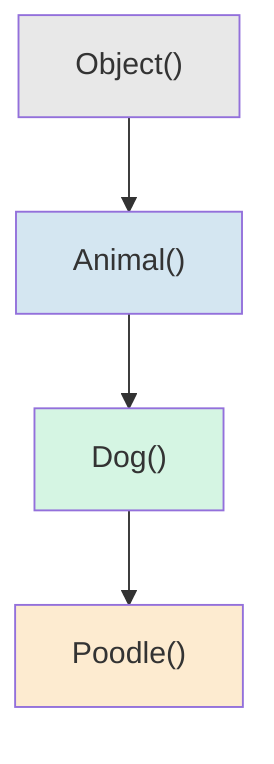
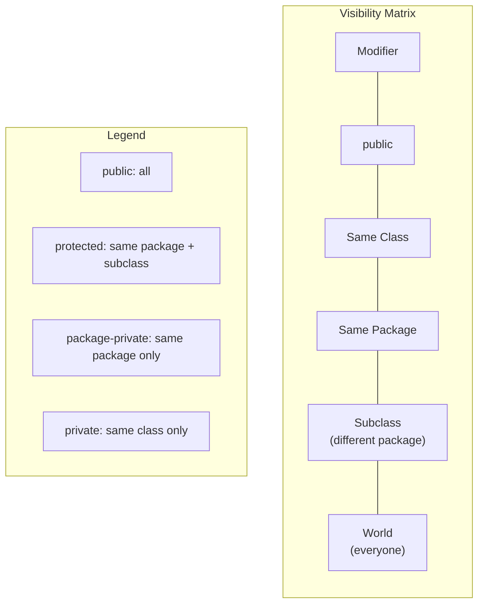
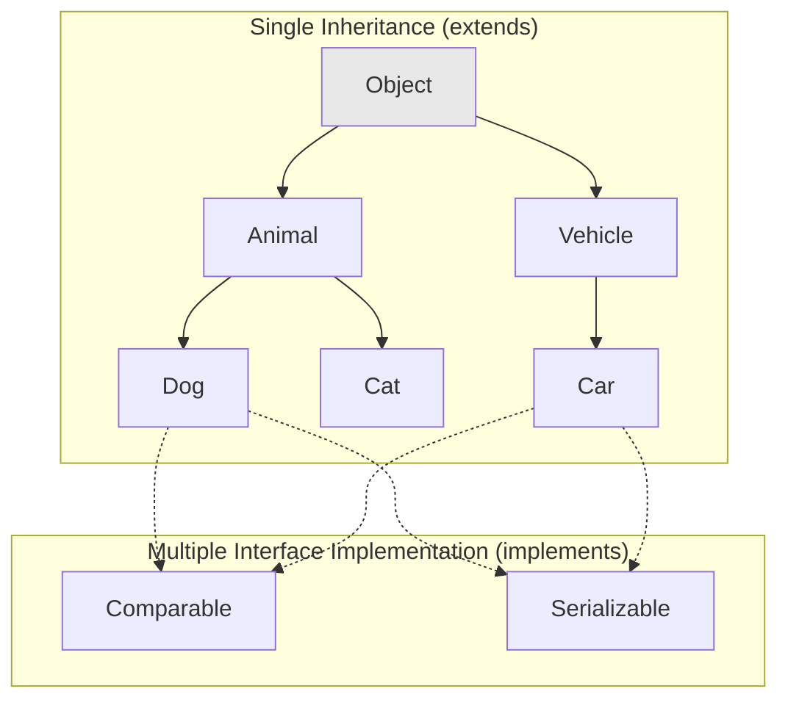
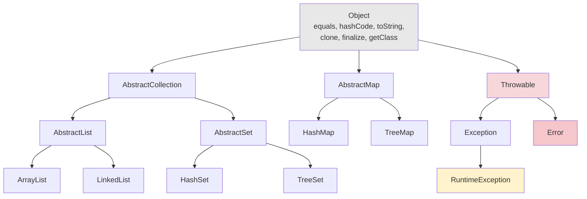

## Class Declaration

A Java class is a template that defines the structure and behavior of objects. Every class declaration in Java ultimately inherits from `java.lang.Object`, either explicitly or implicitly.

```java
[access_modifier] [final | abstract] class ClassName [extends SuperClass] [implements Interface1, Interface2, ...] {
    // fields
    // constructors
    // methods
    // nested types
}
```

```java
public final class ImmutableList<E> extends AbstractList<E> implements List<E>, RandomAccess, Serializable {
    private static final Object[] EMPTY_ARRAY = {};

    private final Object[] elements;

    public ImmutableList(Object[] elements) {
        this.elements = Arrays.copyOf(elements, elements.length);
    }

    @Override
    public int size() {
        return elements.length;
    }
}
```

:::info JLS Reference
[JLS §8.1](https://docs.oracle.com/javase/specs/jls/se21/html/jls-8.html#jls-8.1) defines class declarations. The top-level class can be `public` or package-private (no modifier). Only one `public` class per compilation unit (.java file) is permitted.
:::

A class body can contain: field declarations, method declarations, constructors, static and instance initializer blocks, nested class and interface declarations, and enum declarations.

## Constructors

A constructor initializes a new instance of a class. Constructors are not methods -- they have no return type, not even `void`, and they are invoked only via the `new` keyword (or reflection).

### No-Arg Constructor

```java
public class Person {
    private String name;
    private int age;

    // No-arg constructor -- the compiler generates one automatically
    // if no constructor is explicitly defined
    public Person() {
        this("Unknown", 0);
    }
}
```

If you define **any** constructor explicitly, the compiler suppresses the default no-arg constructor. This is a common source of `NoSuchMethodException` when using reflection.

### Parameterized Constructor

```java
public class Person {
    private final String name;
    private final int age;

    public Person(String name, int age) {
        this.name = Objects.requireNonNull(name, "name must not be null");
        this.age = age;
    }
}
```

### Copy Constructor

Java does not provide a built-in copy constructor, but you can define one. Copy constructors are useful when you need a defensive copy or when `Cloneable` is inappropriate (e.g., the class contains mutable state).

```java
public class Person {
    private final String name;
    private final int age;
    private final List<String> hobbies;

    public Person(Person other) {
        this.name = other.name;
        this.age = other.age;
        this.hobbies = new ArrayList<>(other.hobbies); // defensive copy of mutable field
    }
}
```

### this() and super()

`this(...)` calls another constructor in the **same class**. `super(...)` calls a constructor in the **direct superclass**. Both must be the **first statement** in a constructor body. If you omit `super(...)`, the compiler inserts `super()` (no-arg superclass constructor) automatically.

```java
public class Employee extends Person {
    private final String department;
    private final double salary;

    public Employee(String name, int age, String department, double salary) {
        super(name, age);  // MUST be the first statement
        this.department = department;
        this.salary = salary;
    }

    public Employee(String name, int age, String department) {
        this(name, age, department, 0.0);  // calls the 4-arg constructor above
    }

    public Employee() {
        this("Unknown", 0, "Unassigned", 0.0);  // chain to 4-arg
    }
}
```

The constructor chaining order at runtime is: the most-derived constructor calls `super()`, which calls its superclass constructor, all the way up to `Object()`. Then initialization proceeds top-down -- `Object`'s instance initializer runs first, then each subclass's field initializers and initializer blocks, finally the body of each constructor completes bottom-up.



```java
// Execution order: Object() -> Animal() -> Dog() -> Poodle()
// Field initializers and instance initializer blocks run AFTER super() returns
// but BEFORE the rest of the current constructor body
class Animal {
    private int x = print("Animal.x initialized");  // step 2 (in Animal init)
    { print("Animal instance init block"); }          // step 3
    Animal() { print("Animal() body"); }              // step 4
}
```

## Access Modifiers

Access modifiers control which other classes can access a class's members (fields, methods, constructors, nested types).



| Modifier        | Same Class | Same Package | Subclass (diff pkg) | Unrelated |
| --------------- | :--------: | :----------: | :-----------------: | :-------: |
| `public`        |     Y      |      Y       |          Y          |     Y     |
| `protected`     |     Y      |      Y       |          Y          |     N     |
| package-private |     Y      |      Y       |          N          |     N     |
| `private`       |     Y      |      N       |          N          |     N     |

```java
public class AccessDemo {
    public String publicField;         // accessible everywhere
    protected String protectedField;   // same package + subclasses
    String packageField;               // same package only (no modifier)
    private String privateField;       // this class only

    private void internalHelper() {
        // can access all four fields here
    }
}

class SamePackageClass {
    void demo() {
        AccessDemo d = new AccessDemo();
        d.publicField;      // OK
        d.protectedField;   // OK -- same package
        d.packageField;     // OK -- same package
        // d.privateField;  // COMPILE ERROR -- different class
    }
}
```

```java
// Different package
package com.other;

import com.example.AccessDemo;

class SubclassDemo extends AccessDemo {
    void demo() {
        this.publicField;     // OK
        this.protectedField;  // OK -- inherited access via subclass
        // this.packageField; // COMPILE ERROR -- different package
        // this.privateField; // COMPILE ERROR -- different class
    }

    void demoViaReference(AccessDemo d) {
        d.publicField;       // OK
        // d.protectedField;  // COMPILE ERROR -- protected access is ONLY via inheritance
        // You can only access protected members through `this` or a subclass reference,
        // NOT through a supertype reference to an unrelated instance
    }
}
```

:::warning
`protected` access is narrower than most developers expect. A subclass in a different package can access a `protected` member only through `this` or a reference of the subclass's own type. It cannot access the `protected` member through a reference of the superclass type, even if the actual object is an instance of the subclass.
:::

:::info JLS Reference
[JLS §6.6](https://docs.oracle.com/javase/specs/jls/se21/html/jls-6.html#jls-6.6) defines access control in exhaustive detail. The rules for `protected` are specified in [JLS §6.6.2](https://docs.oracle.com/javase/specs/jls/se21/html/jls-6.html#jls-6.6.2).
:::

## Fields and Methods

### Instance Fields

Instance fields hold per-object state. They are allocated as part of the object layout on the heap. If not explicitly initialized, they default to `0` / `false` / `null`.

```java
public class BankAccount {
    private String owner;
    private double balance;          // defaults to 0.0
    private final List<String> transactions = new ArrayList<>();

    // Field access should always go through methods to preserve encapsulation
    public double getBalance() {
        return balance;
    }

    public void deposit(double amount) {
        if (amount <= 0) throw new IllegalArgumentException("amount must be positive");
        balance += amount;
        transactions.add("+" + amount);
    }
}
```

### Instance Methods

Instance methods receive an implicit `this` reference. They can access all instance fields, static fields, and other methods of the class.

### Static vs Instance

The distinction between static and instance members is fundamental to understanding Java's object model.

```java
public class Counter {
    private int instanceCount = 0;            // per-object state
    private static int totalCount = 0;        // per-class state (shared across all instances)

    public Counter() {
        instanceCount++;
        totalCount++;
    }

    // Instance method -- operates on a specific object
    public int getInstanceCount() {
        return instanceCount;
    }

    // Static method -- operates on the class, no `this`
    public static int getTotalCount() {
        return totalCount;
        // CANNOT access instanceCount here -- there is no `this`
    }

    // Static factory method -- preferred over public constructors
    // when you need named construction, caching, or subtyping
    public static Counter createDefault() {
        return new Counter();
    }
}
```

Static members belong to the **class** itself, not to any instance. They are stored in Metaspace (for static fields) and are accessible without creating an object. Static methods have no `this` reference and cannot directly access instance members.

```java
// Static initializer block -- runs once when the class is loaded
public class Config {
    private static final Map<String, String> ENV;

    static {
        ENV = new HashMap<>();
        ENV.put("db.url", System.getenv("DB_URL"));
        ENV.put("db.user", System.getenv("DB_USER"));
        // static blocks can throw only unchecked exceptions
    }
}
```

:::danger
Never use a static mutable field to store per-request or per-user state. Static fields are shared across all threads and all instances of the class. This is the source of countless concurrency bugs in web applications.
:::

## Final Classes and Methods

### Final Classes

A `final` class cannot be extended. This is used to enforce immutability, security guarantees, or performance optimizations.

```java
public final class String {
    // The most important final class in Java.
    // Cannot be subclassed -- ensures that String's contract (immutability, hash caching)
    // cannot be weakened by a malicious or buggy subclass.
}
```

Other common `final` classes: `Integer`, `Long`, `Double`, `StringBuilder`, `java.time.LocalDate`.

### Final Methods

A `final` method cannot be overridden by subclasses. This is used to prevent subclasses from changing behavior that the parent class depends on.

```java
public class AbstractShape {
    // Template method pattern -- the algorithm skeleton is final
    public final void draw(Graphics g) {
        g.setColor(getColor());
        doDraw(g);      // hook for subclasses
        g.resetColor();
    }

    protected abstract void doDraw(Graphics g);

    protected abstract Color getColor();
}
```

Private methods are implicitly `final` (they cannot be overridden because they are not visible to subclasses). Methods on `final` classes are implicitly `final` as well.

## Abstract Classes

An abstract class is a class that is designed to be subclassed. It may contain abstract methods (declared without a body) and concrete methods. Abstract classes **cannot be instantiated** directly.

```java
public abstract class Shape {
    private final String color;

    protected Shape(String color) {
        this.color = color;
    }

    // Abstract method -- subclasses MUST implement
    public abstract double area();
    public abstract double perimeter();

    // Concrete method -- shared implementation for all subclasses
    public String describe() {
        return String.format("A %s shape with area %.2f and perimeter %.2f",
                color, area(), perimeter());
    }

    // Abstract classes can have state and constructors
    public String getColor() {
        return color;
    }
}

public class Circle extends Shape {
    private final double radius;

    public Circle(String color, double radius) {
        super(color);
        this.radius = radius;
    }

    @Override
    public double area() {
        return Math.PI * radius * radius;
    }

    @Override
    public double perimeter() {
        return 2 * Math.PI * radius;
    }
}
```

:::info JLS Reference
[JLS §8.1.1.1](https://docs.oracle.com/javase/specs/jls/se21/html/jls-8.html#jls-8.1.1.1) defines abstract classes. An abstract class must be declared `abstract` if it has any abstract methods, but a class can be declared `abstract` even with no abstract methods (to prevent direct instantiation).
:::

## Interfaces

An interface declares a contract that implementing classes must fulfill. Unlike abstract classes, an interface cannot have instance fields or constructors (prior to Java 8, it could not have method bodies at all).

```java
public interface Serializable {
    // Marker interface -- no methods, serves as a type tag
}
```

### Default Methods (Java 8+)

Default methods provide a concrete implementation in an interface, allowing interface evolution without breaking existing implementations.

```java
public interface List<E> extends Collection<E> {
    // Abstract method -- must be implemented
    int size();
    E get(int index);

    // Default method (Java 8+) -- provides a default implementation
    default void sort(Comparator<? super E> c) {
        Object[] a = this.toArray();
        Arrays.sort(a, (Comparator) c);
        ListIterator<E> i = this.listIterator();
        for (Object e : a) {
            i.next();
            i.set((E) e);
        }
    }

    // Another default method -- allows interface growth
    default Spliterator<E> spliterator() {
        return Spliterators.spliterator(this, Spliterator.ORDERED);
    }
}
```

### Private Methods (Java 9+)

Private methods in interfaces allow default methods to share code without exposing helper methods to implementing classes.

```java
public interface Logger {
    void log(String level, String message);

    default void info(String message) {
        logWithTimestamp("INFO", message);
    }

    default void error(String message) {
        logWithTimestamp("ERROR", message);
    }

    // Private method -- not visible to implementations, only to other default methods
    private void logWithTimestamp(String level, String message) {
        log(level, Instant.now() + " " + message);
    }
}
```

### Functional Interfaces

A functional interface is an interface with exactly one abstract method (SAM -- Single Abstract Method). It serves as the target type for lambda expressions and method references.

```java
@FunctionalInterface
public interface Predicate<T> {
    boolean test(T t);

    // default methods do NOT count toward the SAM
    default Predicate<T> and(Predicate<? super T> other) {
        Objects.requireNonNull(other);
        return (t) -> test(t) && other.test(t);
    }

    default Predicate<T> negate() {
        return (t) -> !test(t);
    }

    default Predicate<T> or(Predicate<? super T> other) {
        Objects.requireNonNull(other);
        return (t) -> test(t) || other.test(t);
    }

    // static methods do NOT count toward the SAM
    static <T> Predicate<T> isEqual(Object targetRef) {
        return (null == targetRef)
                ? Objects::isNull
                : targetRef::equals;
    }
}
```

```java
// Lambda expression targets Predicate<String>
Predicate<String> isNotEmpty = s -> s != null && !s.isEmpty();

// Method reference
Predicate<String> isBlank = String::isBlank;

// Composed predicates
Predicate<String> isValid = isNotEmpty.and(s -> s.length() <= 255);
```

The `@FunctionalInterface` annotation is optional but causes the compiler to verify that the interface has exactly one abstract method. Standard functional interfaces in `java.util.function`: `Function<T,R>`, `Consumer<T>`, `Supplier<T>`, `Predicate<T>`, `BiFunction<T,U,R>`, `UnaryOperator<T>`, `BinaryOperator<T>`.

### Design Decision: Why Interfaces Got Default Methods

Before Java 8, adding a method to a public interface broke every existing implementation. This made interface evolution practically impossible for widely-used interfaces like `Collection`, `List`, and `Map`. When the Streams API was added in Java 8, methods like `stream()`, `forEach()`, and `spliterator()` needed to be added to `Collection`. Without default methods, every single `Collection` implementation in every library on Earth would have to be updated and recompiled.

Default methods solve this by providing a **default implementation** that existing classes inherit automatically. The implementing class does not need to change. This is fundamentally an API evolution mechanism, not a mixin or trait system -- Java chose to keep the solution minimal rather than introducing full multiple inheritance of behavior.

The diamond problem is resolved by explicit rules: if a class inherits the same default method from two interfaces, it must override the method and resolve the conflict explicitly using `InterfaceName.super.method()`.

```java
interface A { default void foo() { System.out.println("A"); } }
interface B { default void foo() { System.out.println("B"); } }

class C implements A, B {
    @Override
    public void foo() {
        A.super.foo();  // explicitly choose A's implementation
        // or B.super.foo(), or provide your own implementation entirely
    }
}
```

## Inner Classes

Java supports four kinds of nested classes, each with different scoping rules, access to the enclosing class, and relationship to instances.

### Static Nested Class

A static nested class is a class declared `static` inside another class. It has no implicit reference to an enclosing instance and can access only the static members of the enclosing class (unless given an explicit reference).

```java
public class Map<K, V> {
    // Static nested class -- does NOT hold a reference to the enclosing Map instance
    public static class Entry<K, V> {
        private final K key;
        private V value;

        Entry(K key, V value) {
            this.key = key;
            this.value = value;
        }

        public K getKey() { return key; }
        public V getValue() { return value; }
    }
}

// Usage -- no outer instance needed
Map.Entry<String, Integer> entry = new Map.Entry<>("count", 42);
```

### Member Inner Class

A member (non-static) inner class is associated with an instance of its enclosing class. It has an implicit reference to the enclosing instance and can access all members (including private) of the enclosing class.

```java
public class LinkedList<E> {
    private Node<E> head;

    // Member inner class -- each Node holds a reference to the enclosing LinkedList
    private class Node<E> {
        E data;
        Node<E> next;

        Node(E data) {
            this.data = data;
            // can access head, size() etc. of the enclosing LinkedList
            if (LinkedList.this.head == null) {
                LinkedList.this.head = this;
            }
        }
    }
}

// Member inner classes require an enclosing instance
LinkedList<String> list = new LinkedList<>();
// LinkedList<String>.Node<String> node = list.new Node<>("hello");
```

### Anonymous Class

An anonymous class is an unnamed class that is declared and instantiated in a single expression. It is most commonly used for implementing functional interfaces before Java 8, and for abstract classes that need a one-off implementation.

```java
// Anonymous class implementing an interface
Runnable task = new Runnable() {
    @Override
    public void run() {
        System.out.println("Executing task");
    }
};

// Anonymous class extending an abstract class
abstract class Writer {
    abstract void write(String data);
    void close() { System.out.println("Writer closed"); }
}

Writer w = new Writer() {
    @Override
    void write(String data) {
        System.out.println("Writing: " + data);
    }

    @Override
    void close() {
        System.out.println("Custom close");
        super.close();
    }
};
```

Anonymous classes can capture effectively final local variables from the enclosing scope. Each anonymous class instance holds a reference to the enclosing instance (if defined in a non-static context).

### Local Class

A local class is declared inside a method body. It is the least commonly used type of inner class. It can access local variables that are effectively final.

```java
public Iterator<E> filteredIterator(final Predicate<? super E> predicate) {
    // Local class -- visible only within this method
    class FilteredIterator implements Iterator<E> {
        private final Iterator<E> source = elements.iterator();
        private E next;

        FilteredIterator() {
            advance();
        }

        private void advance() {
            while (source.hasNext()) {
                E candidate = source.next();
                if (predicate.test(candidate)) {
                    next = candidate;
                    return;
                }
            }
            next = null;
        }

        @Override
        public boolean hasNext() {
            return next != null;
        }

        @Override
        public E next() {
            if (!hasNext()) throw new NoSuchElementException();
            E result = next;
            advance();
            return result;
        }
    }

    return new FilteredIterator();
}
```

### Inner Class Summary

| Type          | Holds enclosing ref? | Can access enclosing members? | Needs enclosing instance? | Can be `static`? |
| ------------- | :------------------: | :---------------------------: | :-----------------------: | :--------------: |
| Static nested |          No          |      Static members only      |            No             |       Yes        |
| Member inner  |         Yes          |          All members          |            Yes            |        No        |
| Anonymous     |         Yes          |          All members          |            Yes            |        No        |
| Local         |         Yes          |          All members          |            Yes            |        No        |

:::warning
Prefer static nested classes over member inner classes. A member inner class holds an implicit reference to its enclosing instance, which can prevent garbage collection of the enclosing object and creates a coupling that makes testing harder. Use a member inner class only when it genuinely needs to access the enclosing instance's state.
:::

## Inheritance

### IS-A and HAS-A Relationships

**IS-A** (inheritance): a subclass is a specialization of its superclass. Represented by `extends` or `implements`. An `ElectricCar` IS-A `Car`.

**HAS-A** (composition): a class contains an instance of another class. Represented by a field. A `Car` HAS-A `Engine`.

### Design Decision: Why Java Uses Single Inheritance of Classes

Java allows a class to extend only one superclass. This is a deliberate simplification from C++, which supports multiple inheritance. The reasons are:

1. **The diamond problem**: With multiple inheritance, if two superclasses define the same method, which one does the subclass inherit? C++ solves this with virtual inheritance, which adds significant complexity. Java avoids the problem entirely for classes.

2. **Simplicity and predictability**: Single inheritance produces a linear type hierarchy. Method resolution is unambiguous -- you always know exactly which method implementation will be called by following the single chain from the subclass up to `Object`.

3. **Complexity of multiple inheritance**: Multiple inheritance introduces problems beyond the diamond problem: conflicting field layouts, constructor ordering ambiguity, and access control complications. The C++ experience showed that these complexities caused more bugs than they solved.

4. **Interfaces provide multiple subtyping**: Java compensates for single inheritance by allowing a class to implement any number of interfaces. This gives you the type polymorphism benefit of multiple inheritance without the implementation complexity.



### Liskov Substitution Principle (LSP)

The Liskov Substitution Principle states that if `S` is a subtype of `T`, then objects of type `T` may be replaced with objects of type `S` without altering any of the desirable properties of the program.

Violating LSP means that a subclass does not truly honor the contract of its superclass. Classic violations:

```java
// VIOLATION: Square is not a proper subtype of Rectangle
class Rectangle {
    private int width;
    private int height;

    public void setWidth(int w) { this.width = w; }
    public void setHeight(int h) { this.height = h; }
    public int getArea() { return width * height; }
}

class Square extends Rectangle {
    // Square breaks Rectangle's contract: setting width changes height too
    @Override
    public void setWidth(int w) {
        super.setWidth(w);
        super.setHeight(w);  // violates LSP -- caller expects height unchanged
    }

    @Override
    public void setHeight(int h) {
        super.setHeight(h);
        super.setWidth(h);  // violates LSP -- caller expects width unchanged
    }
}

// Code that works with Rectangle will break when given a Square
void resize(Rectangle r, int width, int height) {
    r.setWidth(width);
    r.setHeight(height);
    assert r.getArea() == width * height;  // FAILS for Square!
}
```

The LSP violation occurs because `Square` cannot satisfy `Rectangle`'s behavioral contract. The fix is composition: `Square` should contain a `Rectangle` rather than extend it, or both should implement a common `Shape` interface.

## Method Overriding vs Hiding

### Method Overriding (Instance Methods)

When a subclass defines an instance method with the same signature as a superclass method, it **overrides** the superclass method. The JVM dispatches to the overriding method based on the **runtime type** of the object (virtual method invocation).

```java
class Animal {
    public String speak() {
        return "...";
    }
}

class Dog extends Animal {
    @Override
    public String speak() {
        return "Woof";
    }
}

Animal a = new Dog();
System.out.println(a.speak());  // "Woof" -- runtime type is Dog, so Dog.speak() is called
```

Rules for overriding:

- The method must have the same name, parameter types, and return type (or a covariant return type).
- The access level cannot be **more restrictive** than the overridden method.
- The overriding method cannot throw checked exceptions that are broader than those declared by the overridden method.
- The `@Override` annotation is optional but strongly recommended -- it causes a compile error if the method does not actually override a superclass method.
- `static` methods, `private` methods, and `final` methods cannot be overridden.

### Method Hiding (Static Methods)

When a subclass defines a `static` method with the same signature as a superclass `static` method, it **hides** (does not override) the superclass method. The method called depends on the **compile-time type** of the reference.

```java
class Parent {
    public static void classify() {
        System.out.println("Parent");
    }
}

class Child extends Parent {
    // This HIDES Parent.classify(), it does NOT override it
    public static void classify() {
        System.out.println("Child");
    }
}

Parent p = new Child();
p.classify();     // "Parent" -- compile-time type is Parent
Child c = new Child();
c.classify();     // "Child"  -- compile-time type is Child
```

:::danger
Never hide static methods. It creates extremely confusing behavior where the method called depends on the declared type of the variable rather than the actual object. If you need polymorphic behavior, use instance methods.
:::

### Covariant Return Types

Since Java 5, an overriding method can return a subtype of the return type declared in the overridden method. This is called a covariant return type.

```java
class Animal {
    public Animal copy() {
        return new Animal();
    }
}

class Dog extends Animal {
    @Override
    public Dog copy() {       // Dog is a subtype of Animal -- covariant return
        return new Dog();
    }
}

// The caller can use the more specific type without casting
Dog original = new Dog();
Dog clone = original.copy();  // returns Dog, not Animal
```

## Object Methods

Every class inherits from `java.lang.Object`, which defines methods that every object has. Understanding and correctly implementing these methods is essential for writing correct Java programs.

### toString()

Returns a string representation of the object. The default implementation returns `getClass().getName() + "@" + Integer.toHexString(hashCode())`, which is rarely useful.

```java
public class Person {
    private final String name;
    private final int age;

    public Person(String name, int age) {
        this.name = name;
        this.age = age;
    }

    @Override
    public String toString() {
        return String.format("Person{name='%s', age=%d}", name, age);
    }
}
```

### equals() and hashCode()

### Design Decision: Why the equals/hashCode Contract Exists

The contract exists because hash-based collections (`HashMap`, `HashSet`, `Hashtable`) depend on two invariants:

1. **If two objects are equal, they MUST have the same hash code.** If this is violated, equal objects could end up in different hash buckets, and lookups would fail.

2. **If two objects have the same hash code, they need NOT be equal.** This is a normal collision that hash tables handle correctly via linear probing or chaining.

If you override `equals()` without overriding `hashCode()`, you break invariant 1. Objects that your `equals()` says are equal will have different hash codes (from `Object.hashCode()`, which is typically based on memory address), causing them to be placed in different buckets. A `HashSet` would then contain duplicates, and a `HashMap` would fail to find keys.

The contract, as defined in `Object.hashCode()`:

- If two objects are equal according to `equals(Object)`, then calling `hashCode()` on each must produce the same integer result.
- If two objects are unequal according to `equals(Object)`, it is NOT required that they produce distinct hash codes. However, distinct hash codes improve hash table performance.

The contract for `equals(Object)`, as defined in `Object.equals()`:

- **Reflexive**: `x.equals(x)` must return `true`.
- **Symmetric**: `x.equals(y)` must return the same result as `y.equals(x)`.
- **Transitive**: if `x.equals(y)` and `y.equals(z)`, then `x.equals(z)`.
- **Consistent**: multiple invocations of `x.equals(y)` must consistently return `true` or `false`, provided neither object is modified.
- `x.equals(null)` must return `false`.

```java
public final class Person {
    private final String name;
    private final int age;

    @Override
    public boolean equals(Object obj) {
        if (this == obj) return true;              // reflexive, and fast path
        if (!(obj instanceof Person other)) return false; // null check + type check
        return age == other.age && name.equals(other.name);
    }

    @Override
    public int hashCode() {
        return 31 * name.hashCode() + age;
        // 31 is used because it is an odd prime.
        // The multiplication distributes the effect of the hash across bits,
        // reducing collisions when fields have similar values.
        // Joshua Bloch explains this in Effective Java Item 11.
    }
}
```

```java
// Using java.util.Objects to simplify
@Override
public boolean equals(Object obj) {
    if (this == obj) return true;
    if (!(obj instanceof Person other)) return false;
    return age == other.age && Objects.equals(name, other.name);
}

@Override
public int hashCode() {
    return Objects.hash(name, age);
}
```

:::warning
If you use an object as a key in a `HashMap` or add it to a `HashSet`, and then mutate its state in a way that changes `equals()` or `hashCode()`, the collection will behave incorrectly. The object may become "lost" in the wrong bucket. Always use immutable objects as hash keys, or ensure that fields used in `equals()`/`hashCode()` are never modified after insertion.
:::

### clone()

The `clone()` method is intended to create a field-for-field copy of an object. However, its design is widely considered flawed.

```java
// The Cloneable interface is a marker interface with NO methods.
// Object.clone() checks at runtime whether the object implements Cloneable.
// If not, it throws CloneNotSupportedException.

class Point implements Cloneable {
    private int x;
    private int y;

    @Override
    public Point clone() {
        try {
            return (Point) super.clone();  // shallow copy
        } catch (CloneNotSupportedException e) {
            throw new AssertionError();  // cannot happen since we implement Cloneable
        }
    }
}

// Deep copy -- for objects containing mutable fields
class Person implements Cloneable {
    private String name;
    private int[] scores;  // mutable array

    @Override
    public Person clone() {
        try {
            Person copy = (Person) super.clone();
            copy.scores = scores.clone();  // deep copy of mutable field
            return copy;
        } catch (CloneNotSupportedException e) {
            throw new AssertionError();
        }
    }
}
```

:::danger
`clone()` is broken by design. It is based on a combination of `Object.clone()` (which does a shallow copy) and the `Cloneable` marker interface (which has no methods). The pattern is awkward: you must call `super.clone()` (which checks runtime type), then manually deep-copy mutable fields. Most experts recommend using copy constructors or static factory methods instead. Josh Bloch (Effective Java) recommends against using `clone()`.
:::

### finalize()

The `finalize()` method is called by the garbage collector before an object's memory is reclaimed. It was intended for resource cleanup but is deprecated since Java 9 and marked for removal.

```java
// DEPRECATED -- do NOT use finalize() in new code
// Problems:
// 1. Unpredictable timing -- the GC may never call it (or call it much later than expected)
// 2. Performance impact -- finalizable objects require extra GC cycles
// 3. Can resurrect objects (assign `this` to a static field in finalize),
//    making the object reachable again and preventing GC
// 4. Exceptions thrown in finalize() are silently swallowed by the GC
// 5. Finalizer thread is a single thread shared across all objects -- can become a bottleneck

// Instead, use try-with-resources and AutoCloseable
public class Resource implements AutoCloseable {
    private final FileChannel channel;

    public Resource(String path) throws IOException {
        this.channel = FileChannel.open(Path.of(path));
    }

    @Override
    public void close() throws IOException {
        channel.close();
    }
}

// Usage
try (Resource r = new Resource("data.bin")) {
    // use r
}  // close() is called automatically, even if an exception is thrown
```

## Enums

An enum is a special class that represents a fixed set of constants. Unlike enums in C/C++, Java enums are full-fledged classes -- they can have fields, methods, constructors, and can implement interfaces.

### Basic Enum

```java
public enum DayOfWeek {
    MONDAY, TUESDAY, WEDNESDAY, THURSDAY, FRIDAY, SATURDAY, SUNDAY
}

// Usage
DayOfWeek today = DayOfWeek.MONDAY;
switch (today) {
    case MONDAY, TUESDAY, WEDNESDAY, THURSDAY, FRIDAY -> System.out.println("Weekday");
    case SATURDAY, SUNDAY -> System.out.println("Weekend");
}
```

### Enums with Fields and Methods

```java
public enum Planet {
    MERCURY(3.303e+23, 2.4397e6),
    VENUS(4.869e+24, 6.0518e6),
    EARTH(5.976e+24, 6.37814e6),
    MARS(6.421e+23, 3.3972e6);

    private final double mass;       // in kilograms
    private final double radius;     // in meters

    Planet(double mass, double radius) {
        this.mass = mass;
        this.radius = radius;
    }

    public double mass() { return mass; }
    public double radius() { return radius; }

    public double surfaceGravity() {
        final double G = 6.67300E-11;
        return G * mass / (radius * radius);
    }

    public double surfaceWeight(double otherMass) {
        return otherMass * surfaceGravity();
    }
}
```

### Enums Implementing Interfaces

```java
public interface Describable {
    String description();
}

public enum HttpStatus implements Describable {
    OK(200, "OK"),
    NOT_FOUND(404, "Not Found"),
    INTERNAL_SERVER_ERROR(500, "Internal Server Error");

    private final int code;
    private final String reason;

    HttpStatus(int code, String reason) {
        this.code = code;
        this.reason = reason;
    }

    @Override
    public String description() {
        return code + " " + reason;
    }

    public int code() { return code; }
}
```

```java
// Each enum constant can override an interface method
public enum Operation {
    ADD {
        @Override
        public double apply(double a, double b) { return a + b; }
    },
    SUBTRACT {
        @Override
        public double apply(double a, double b) { return a - b; }
    },
    MULTIPLY {
        @Override
        public double apply(double a, double b) { return a * b; }
    },
    DIVIDE {
        @Override
        public double apply(double a, double b) {
            if (b == 0) throw new ArithmeticException("division by zero");
            return a / b;
        }
    };

    public abstract double apply(double a, double b);
}
```

:::info JLS Reference
[JLS §8.9](https://docs.oracle.com/javase/specs/jls/se21/html/jls-8.html#jls-8.9) defines enum declarations. Enum constants are implicitly `public static final`. Enum types implicitly extend `java.lang.Enum` and cannot be instantiated with `new`. Enum types are implicitly `final` unless they have constant-specific class bodies.
:::

## Generics Basics

Generics allow you to parameterize types -- classes, interfaces, and methods can operate on types that the client specifies at declaration time. Generics provide compile-time type safety and eliminate the need for explicit casting.

### Type Parameters

```java
// Generic class
public class Box<T> {
    private T contents;

    public void set(T value) {
        this.contents = value;
    }

    public T get() {
        return contents;
    }
}

// Usage
Box<String> stringBox = new Box<>();
stringBox.set("hello");
String s = stringBox.get();  // no cast needed -- compiler knows it's String

// Box<String> and Box<Integer> are different types at compile time
// but BOTH compile to the same raw type Box at runtime (type erasure)
```

### Bounded Type Parameters

You can restrict the type argument to a subtype of a specific class or interface using `extends`.

```java
// T must be a subtype of Number
public class NumericBox<T extends Number> {
    private T value;

    public double doubleValue() {
        return value.doubleValue();  // safe -- all Numbers have doubleValue()
    }
}

// Multiple bounds: T must extend Number AND implement Comparable<T>
public static <T extends Number & Comparable<T>> T max(T a, T b) {
    return a.compareTo(b) >= 0 ? a : b;
}
```

```java
// The class bound must come first, then interfaces
public static <T extends Number & Serializable & Cloneable> void process(T item) {
    // T is guaranteed to be a Number, Serializable, and Cloneable
}
```

### Wildcards

Wildcards (`?`) represent an unknown type. They are used primarily in method signatures to increase API flexibility.

**Upper-bounded wildcard** (`? extends T`): accepts `T` or any subtype of `T`. Used when you only **read** from the generic structure.

```java
// Can accept List<Integer>, List<Double>, List<Number>, etc.
public static double sum(List<? extends Number> numbers) {
    double total = 0;
    for (Number n : numbers) {
        total += n.doubleValue();  // safe -- every ? extends Number IS-A Number
    }
    return total;
}

List<Integer> ints = List.of(1, 2, 3);
List<Double> doubles = List.of(1.5, 2.5, 3.5);
sum(ints);     // OK
sum(doubles);  // OK
```

**Lower-bounded wildcard** (`? super T`): accepts `T` or any supertype of `T`. Used when you only **write** to the generic structure.

```java
// Can accept List<Integer>, List<Number>, List<Object>, etc.
public static void addIntegers(List<? super Integer> list) {
    list.add(1);  // safe -- every ? super Integer can hold an Integer
    list.add(2);
}

List<Number> numbers = new ArrayList<>();
addIntegers(numbers);  // OK

List<Object> objects = new ArrayList<>();
addIntegers(objects);  // OK

List<String> strings = new ArrayList<>();
// addIntegers(strings);  // COMPILE ERROR -- String is not a supertype of Integer
```

**Unbounded wildcard** (`?`): accepts any type. Used when you need a generic type but do not depend on the specific type parameter.

```java
// Can accept List<String>, List<Integer>, List<Object>, etc.
public static int size(List<?> list) {
    return list.size();
}

// You cannot add elements to a List<?> (except null)
// because you don't know what type ? represents
```

**PECS mnemonic** (Producer Extends, Consumer Super): if a parameterized type is a **producer** (you read from it), use `? extends T`. If it is a **consumer** (you write to it), use `? super T`.

```java
// Joshua Bloch's example from Effective Java
public static <T> void copy(List<? super T> dest, List<? extends T> src) {
    for (T item : src) {   // src is a producer -- read from it
        dest.add(item);    // dest is a consumer -- write to it
    }
}
```

### Type Erasure

Java generics are implemented via **type erasure**. All type parameters are replaced by their bounds (or `Object` if unbounded) at compile time. The compiler inserts casts where necessary. This means generics provide compile-time type safety but no runtime type information for generic types.

```java
// Source code
List<String> strings = new ArrayList<>();
strings.add("hello");
String s = strings.get(0);

// After type erasure (what the JVM sees)
List strings = new ArrayList();
strings.add("hello");
String s = (String) strings.get(0);  // compiler inserts the cast
```

```java
// Consequence: you CANNOT create arrays of generic types
// List<String>[] array = new List<String>[10];  // COMPILE ERROR
// Reason: after erasure, this becomes List[] array = new List[10];
// Then array[0] = new List<Integer>() would compile but fail at runtime
// (same problem as array covariance -- the JVM cannot enforce the generic type)

// Workaround: use raw type with @SuppressWarnings
@SuppressWarnings("unchecked")
List<String>[] array = (List<String>[]) new List<?>[10];
```

:::info JLS Reference
[JLS §4.6](https://docs.oracle.com/javase/specs/jls/se21/html/jls-4.html#jls-4.6) defines type erasure. [JLS §4.5](https://docs.oracle.com/javase/specs/jls/se21/html/jls-4.html#jls-4.5) defines parameterized types. [JLS §4.7](https://docs.oracle.com/javase/specs/jls/se21/html/jls-4.html#jls-4.7) defines wildcards.
:::

## Complete Class Hierarchy



## Summary of Design Principles

1. **Single inheritance trades flexibility for simplicity.** Multiple inheritance of implementation creates the diamond problem, ambiguous constructor ordering, and conflicting field layouts. Java avoids this entirely for classes while providing multiple interface implementation for type polymorphism.

2. **Default methods solve interface evolution, not multiple inheritance.** They exist so that interfaces can grow without breaking existing implementations. The diamond problem is resolved by requiring explicit disambiguation when conflicts arise.

3. **The equals/hashCode contract exists because hash-based collections depend on it.** Without the contract, `HashMap` and `HashSet` would silently fail -- equal objects could end up in different buckets. The contract is a correctness invariant, not a suggestion.

4. **Access modifiers enforce encapsulation boundaries.** `private` ensures invariants cannot be violated from outside the class. `protected` provides extension points for subclasses. `package-private` enables cooperation within a package. `public` defines the API contract.

5. **Prefer composition over inheritance.** Inheritance creates the tightest coupling between classes. Composition (HAS-A) is more flexible, easier to test, and avoids Liskov Substitution Principle violations. Use inheritance only when there is a genuine IS-A relationship with a stable superclass contract.

6. **Generics provide compile-time type safety through type erasure.** The JVM does not know about generic types at runtime -- it sees raw types. This design was chosen for backward compatibility with pre-generics Java code. The cost is that you cannot use `new T()`, `instanceof T`, or create arrays of generic types.
