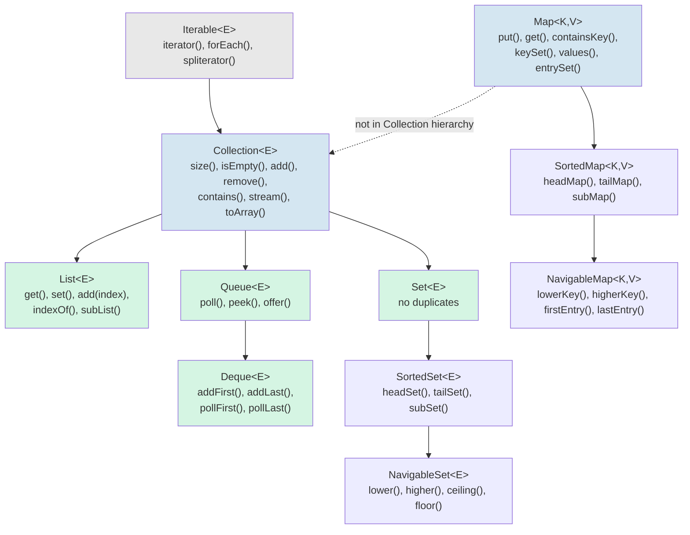
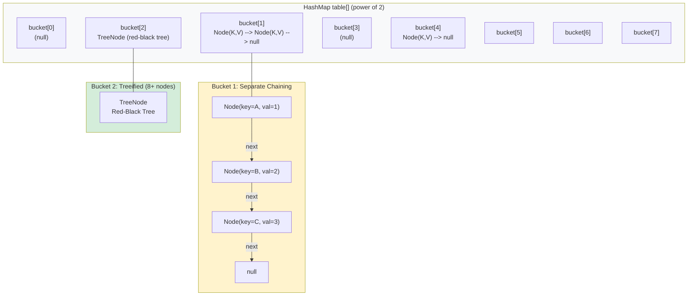

## Architecture Overview

The Java Collections Framework (JCF) is a unified architecture for representing and manipulating collections. It was introduced in JDK 1.2 (1998) and has been extended in every major release since. The framework is built around a hierarchy of interfaces that define contracts for different collection types, with concrete implementations that provide specific performance characteristics and behavioral guarantees.

The core design goals were: (1) reduce programming effort by providing high-performance data structures, (2) reduce effort required to learn and use new APIs by providing a consistent architecture, and (3) foster software reuse by providing interoperable interfaces.



:::info
`Map` is not a subtype of `Collection` because it models a mapping from keys to values rather than a collection of elements. Josh Bloch, the original framework designer, explained that `Map` was excluded from the `Collection` hierarchy because the two abstractions are fundamentally different: collections are groups of elements, while maps are groups of key-value pairs. Forcing `Map` into the `Collection` hierarchy would have required either contrived semantics or a separate parallel hierarchy for map entries.
:::

## The Iterable Interface

`Iterable<T>` is the root of the collection type hierarchy. Any object implementing `Iterable<T>` can be used with the enhanced for-each loop.

```java
public interface Iterable<T> {
    Iterator<T> iterator();

    default void forEach(Consumer<? super T> action) {
        Objects.requireNonNull(action);
        for (T t : this) {
            action.accept(t);
        }
    }

    default Spliterator<T> spliterator() {
        return Spliterators.spliteratorUnknownSize(iterator(), 0);
    }
}
```

The enhanced for-each loop is syntactic sugar that the compiler translates into an `Iterator`-based loop:

```java
// Source code
for (String s : list) {
    System.out.println(s);
}

// What the compiler generates
for (Iterator<String> it = list.iterator(); it.hasNext(); ) {
    String s = it.next();
    System.out.println(s);
}
```

## List Implementations

### ArrayList

`ArrayList<E>` is a resizable array implementation of `List`. It is the default choice for list-based collections in most applications because it provides O(1) random access and has excellent cache locality due to its contiguous memory layout.

#### Internal Structure and Growth

An `ArrayList` stores elements in a backing `Object[]` array. When the array is full and a new element is added, the list allocates a new, larger array and copies all elements from the old array to the new one.

```java
public class ArrayList<E> extends AbstractList<E>
        implements List<E>, RandomAccess, Cloneable, java.io.Serializable {
    private static final int DEFAULT_CAPACITY = 10;
    private static final Object[] EMPTY_ELEMENTDATA = {};
    private static final Object[] DEFAULTCAPACITY_EMPTY_ELEMENTDATA = {};

    transient Object[] elementData;  // non-private to simplify inner class access
    private int size;

    public ArrayList(int initialCapacity) {
        if (initialCapacity > 0) {
            this.elementData = new Object[initialCapacity];
        } else if (initialCapacity == 0) {
            this.elementData = EMPTY_ELEMENTDATA;
        } else {
            throw new IllegalArgumentException("Illegal Capacity: " + initialCapacity);
        }
    }

    public ArrayList() {
        this.elementData = DEFAULTCAPACITY_EMPTY_ELEMENTDATA;  // lazy allocation
    }
}
```

The growth strategy in OpenJDK uses a formula of `newCapacity = oldCapacity + (oldCapacity >> 1)` (i.e., 1.5x the old capacity). This amortizes the cost of resizing across many insertions:

```java
private Object[] grow(int minCapacity) {
    int oldCapacity = elementData.length;
    if (oldCapacity > 0 || elementData != DEFAULTCAPACITY_EMPTY_ELEMENTDATA) {
        int newCapacity = ArraysSupport.newLength(oldCapacity,
                minCapacity - oldCapacity,
                oldCapacity >> 1);  // grow by 50% of old capacity
        return elementData = Arrays.copyOf(elementData, newCapacity);
    } else {
        return elementData = new Object[Math.max(DEFAULT_CAPACITY, minCapacity)];
    }
}
```

The initial `new ArrayList<>()` does **not** allocate an array of size 10 immediately. It stores a shared static empty array reference. The first call to `add()` triggers allocation of an array of default capacity 10. This lazy allocation is a significant optimization for applications that create many empty lists that are never populated.

```java
public boolean add(E e) {
    modCount++;
    add(e, elementData, size);
    return true;
}

private void add(E e, Object[] elementData, int s) {
    if (s == elementData.length)
        elementData = grow();       // resize triggered only when needed
    elementData[s] = e;
    size = s + 1;
}
```

#### Time Complexity

| Operation             | Average        | Worst Case | Notes                     |
| --------------------- | -------------- | ---------- | ------------------------- |
| `get(index)`          | O(1)           | O(1)       | Direct array index        |
| `set(index, element)` | O(1)           | O(1)       | Direct array index        |
| `add(element)`        | O(1) amortized | O(n)       | O(n) when resize needed   |
| `add(index, element)` | O(n)           | O(n)       | Must shift elements right |
| `remove(index)`       | O(n)           | O(n)       | Must shift elements left  |
| `remove(Object)`      | O(n)           | O(n)       | Linear scan + shift       |
| `contains(Object)`    | O(n)           | O(n)       | Linear scan               |
| `indexOf(Object)`     | O(n)           | O(n)       | Linear scan               |

### LinkedList

`LinkedList<E>` is a doubly-linked list implementation of both `List` and `Deque`. Each element is wrapped in a node that holds references to the previous and next nodes.

```java
public class LinkedList<E> extends AbstractSequentialList<E>
        implements List<E>, Deque<E>, Cloneable, java.io.Serializable {
    transient Node<E> first;
    transient Node<E> last;
    transient int size;

    private static class Node<E> {
        E item;
        Node<E> next;
        Node<E> prev;

        Node(Node<E> prev, E element, Node<E> next) {
            this.item = element;
            this.next = next;
            this.prev = prev;
        }
    }
}
```

#### Time Complexity

| Operation                        | Average | Worst Case | Notes                           |
| -------------------------------- | ------- | ---------- | ------------------------------- |
| `get(index)`                     | O(n)    | O(n)       | Must traverse from head or tail |
| `add(element)`                   | O(1)    | O(1)       | Appends to tail                 |
| `add(index, element)`            | O(n)    | O(n)       | Must traverse to index          |
| `remove(index)`                  | O(n)    | O(n)       | Must traverse to index          |
| `addFirst()` / `addLast()`       | O(1)    | O(1)       | Direct pointer manipulation     |
| `removeFirst()` / `removeLast()` | O(1)    | O(1)       | Direct pointer manipulation     |

#### ArrayList vs LinkedList: When to Use Each

```java
// Use ArrayList when:
// 1. You primarily access elements by index (random access dominates)
// 2. You iterate much more than you insert/remove in the middle
// 3. Memory locality matters (ArrayList elements are contiguous in memory,
//    giving far better CPU cache hit rates than linked list node pointers)
List<String> names = new ArrayList<>(1000);  // set initial capacity if known
names.add("Alice");
names.get(500);  // O(1) -- direct array access

// Use LinkedList when:
// 1. You frequently add/remove at the head or tail (Deque operations)
// 2. You need Queue/Deque semantics (FIFO, LIFO)
// 3. You frequently insert or remove in the middle AND you have an iterator
//    already positioned at the insertion point
Deque<String> queue = new LinkedList<>();
queue.addFirst("head");
queue.addLast("tail");
String head = queue.removeFirst();  // O(1)
```

:::warning
In practice, `ArrayList` is almost always the better choice. The O(1) random access and cache-friendly contiguous memory layout make `ArrayList` faster for nearly all real-world workloads, even those with frequent insertions. The O(n) cost of shifting elements in `ArrayList` is offset by the fact that `System.arraycopy()` is a native, highly optimized operation that moves memory in bulk. Furthermore, each `LinkedList` node requires an extra object allocation (16+ bytes of overhead for the object header, plus three reference fields), so a `LinkedList` with N elements uses significantly more memory than an `ArrayList` with the same elements.
:::

`ArrayList` also implements the `RandomAccess` marker interface, which signals that it supports fast random access. Generic algorithms in `Collections` check for this interface to choose between iteration-based and index-based algorithms:

```java
// Collections.binarySearch uses this check internally
if (list instanceof RandomAccess || list.size() < BINARYSEARCH_THRESHOLD)
    return indexedBinarySearch(list, key);    // O(log n) with direct index access
else
    return iteratorBinarySearch(list, key);   // O(log n) but with O(n) iterator traversal
```

## Set Implementations

### HashSet

`HashSet<E>` is backed by a `HashMap<E, Object>` instance. Each element is stored as a key in the map, with a shared static `PRESENT` object as the value. It provides O(1) average-time performance for `add`, `remove`, `contains`, and `size` operations.

```java
public class HashSet<E> extends AbstractSet<E>
        implements Set<E>, Cloneable, java.io.Serializable {
    private transient HashMap<E, Object> map;
    private static final Object PRESENT = new Object();

    public HashSet() {
        map = new HashMap<>();
    }

    public boolean add(E e) {
        return map.put(e, PRESENT) == null;
    }

    public boolean contains(Object o) {
        return map.containsKey(o);
    }

    public boolean remove(Object o) {
        return map.remove(o) == PRESENT;
    }

    public int size() {
        return map.size();
    }
}
```

The `contains()` call delegates to `HashMap.containsKey()`, which first computes the hash, finds the bucket, and then traverses the chain comparing elements with `equals()`. This is O(1) on average but degrades to O(n) in the worst case if all elements hash to the same bucket.

### LinkedHashSet

`LinkedHashSet<E>` extends `HashSet` but overrides the constructor to create a `LinkedHashMap` instead of a `HashMap`. It maintains a doubly-linked list running through all of its entries, which defines the **insertion order** (or access order, if configured). Iteration order matches insertion order, which is the primary reason to choose `LinkedHashSet` over `HashSet`.

```java
public class LinkedHashSet<E> extends HashSet<E>
        implements Set<E>, Cloneable, java.io.Serializable {
    public LinkedHashSet(int initialCapacity, float loadFactor) {
        super(initialCapacity, loadFactor, true);  // accessOrder = true in LinkedHashMap
    }
}
```

The insertion-order guarantee has a cost: each entry carries two additional pointer fields (before, after) for the linked list, increasing per-entry memory overhead by 16 bytes on a 64-bit JVM with compressed oops.

### TreeSet

`TreeSet<E>` is a `NavigableSet` implementation backed by a `TreeMap`. Elements are ordered using their natural ordering (if they implement `Comparable`) or a `Comparator` provided at construction time. It provides guaranteed O(log n) time for `add`, `remove`, and `contains`.

```java
// Natural ordering (elements must implement Comparable)
Set<String> words = new TreeSet<>();
words.add("delta");
words.add("alpha");
words.add("charlie");
System.out.println(words);  // [alpha, charlie, delta]

// Custom ordering via Comparator
Set<String> reverseWords = new TreeSet<>(Comparator.reverseOrder());
reverseWords.addAll(words);
System.out.println(reverseWords);  // [delta, charlie, alpha]

// NavigableSet operations -- only available on TreeSet (and ConcurrentSkipListSet)
NavigableSet<Integer> numbers = new TreeSet<>(List.of(10, 20, 30, 40, 50));
numbers.lower(30);    // 20  -- greatest element strictly less than 30
numbers.floor(30);    // 30  -- greatest element less than or equal to 30
numbers.higher(30);   // 40  -- least element strictly greater than 30
numbers.ceiling(30);  // 30  -- least element greater than or equal to 30
numbers.subSet(20, 40);  // [20, 30]  -- range view (half-open interval)
numbers.headSet(30);     // [10, 20]  -- elements less than 30
numbers.tailSet(30);     // [30, 40, 50]  -- elements greater than or equal to 30
```

`TreeSet` does **not** allow null elements (it would require comparing null, which throws `NullPointerException`). `HashSet` and `LinkedHashSet` allow at most one null element.

### EnumSet

`EnumSet<E extends Enum<E>>` is a specialized `Set` implementation for use with enum types. Internally, it is represented as a bit vector, where each bit corresponds to an enum constant. This makes all operations O(1) and extremely memory-efficient.

```java
public enum Day { MON, TUE, WED, THU, FRI, SAT, SUN }

EnumSet<Day> weekdays = EnumSet.range(Day.MON, Day.FRI);
EnumSet<Day> weekend = EnumSet.complementOf(weekdays);  // SAT, SUN
EnumSet<Day> none = EnumSet.noneOf(Day.class);
EnumSet<Day> all = EnumSet.allOf(Day.class);

// Internally stored as a single long (or long[]) bitmask
// MON=1, TUE=2, WED=4, THU=8, FRI=16, SAT=32, SUN=64
// weekdays = 0b0011111 = 31
```

:::info
For enums with 64 or fewer constants, `EnumSet` uses a single `long` as its backing representation, making the entire set occupy just 16 bytes (object header + long field). For enums with more than 64 constants, it uses a `long[]`. All bulk operations (`containsAll`, `retainAll`, etc.) are implemented as bitwise AND, OR, and NOT operations on the bit vectors.
:::

### Set Implementation Comparison

| Feature                       | HashSet     | LinkedHashSet   | TreeSet                        | EnumSet                |
| ----------------------------- | ----------- | --------------- | ------------------------------ | ---------------------- |
| Backing structure             | HashMap     | LinkedHashMap   | TreeMap (red-black tree)       | Bit vector             |
| Ordering                      | None        | Insertion order | Sorted (natural or Comparator) | Enum declaration order |
| Null elements                 | One allowed | One allowed     | Not allowed                    | Not allowed            |
| `add` / `contains` / `remove` | O(1) avg    | O(1) avg        | O(log n)                       | O(1)                   |
| Element type                  | Any         | Any             | Comparable or Comparator       | Enum only              |

## Map Implementations

### HashMap

`HashMap<K,V>` is the most widely used Map implementation. It provides O(1) average-time performance for `get` and `put`, but does not guarantee any ordering of its entries.

#### Internal Structure

A `HashMap` is built on an array of buckets (called `table`). Each bucket is the head of a linked list (or, since Java 8, a balanced tree when a bucket's chain exceeds a threshold). The bucket index for a key is determined by `hash(key) & (table.length - 1)`, where `table.length` is always a power of two.



#### Hash Function

`HashMap` applies a secondary hash function (a "scrambling" function) to the object's `hashCode()` to spread higher bits into lower bits. This is critical because the bucket index depends only on the lower bits (`hash & (n-1)` where n is a power of two). Without this secondary hash, keys that differ only in higher bits would all land in the same bucket.

```java
static final int hash(Object key) {
    int h;
    return (key == null) ? 0 : (h = key.hashCode()) ^ (h >>> 16);
}
```

The expression `h ^ (h >>> 16)` XORs the upper 16 bits into the lower 16 bits. This ensures that both the upper and lower bits of the original hash code influence the bucket selection, reducing collisions when keys share similar lower bits.

#### Collision Resolution: Separate Chaining with Treeification

When two or more keys hash to the same bucket, they are stored in a linked list at that bucket index. Since Java 8, when the number of nodes in a single bucket reaches 8 (the `TREEIFY_THRESHOLD`), the linked list is converted into a red-black tree. This improves worst-case performance from O(n) to O(log n) for lookup in degenerate cases where many keys hash to the same bucket.

```java
// Simplified put logic
final V putVal(int hash, K key, V value, boolean onlyIfAbsent, boolean evict) {
    Node<K,V>[] tab; Node<K,V> p; int n, i;
    if ((tab = table) == null || (n = tab.length) == 0)
        n = (tab = resize()).length;
    if ((p = tab[i = (n - 1) & hash]) == null)
        tab[i] = newNode(hash, key, value, null);  // empty bucket -- direct insert
    else {
        Node<K,V> e; K k;
        if (p.hash == hash && ((k = p.key) == key || (key != null && key.equals(k))))
            e = p;                                  // key already exists -- replace
        else if (p instanceof TreeNode)
            e = ((TreeNode<K,V>)p).putTreeVal(this, tab, hash, key, value);  // tree bucket
        else {
            for (int binCount = 0; ; ++binCount) {   // linked list traversal
                if ((e = p.next) == null) {
                    p.next = newNode(hash, key, value, null);
                    if (binCount >= TREEIFY_THRESHOLD - 1)  // 8 nodes triggers treeification
                        treeifyBin(tab, hash);
                    break;
                }
                if (e.hash == hash && ((k = e.key) == key || (key != null && key.equals(k))))
                    break;  // found existing key
                p = e;
            }
        }
        if (e != null) {
            V oldValue = e.value;
            if (!onlyIfAbsent || oldValue == null)
                e.value = value;  // replace existing value
            return oldValue;
        }
    }
    ++modCount;
    if (++size > threshold)
        resize();  // grow the table when size exceeds capacity * loadFactor
    return null;
}
```

:::warning
`treeifyBin()` does not immediately convert to a tree. It first checks whether the table has fewer than `MIN_TREEIFY_CAPACITY` (64) entries. If so, it prefers to resize the table instead, because a larger table distributes keys across more buckets and may resolve the collision without the overhead of tree nodes. Only when the table already has at least 64 entries does it actually convert the linked list to a red-black tree.
:::

#### Load Factor and Capacity

The **load factor** (default 0.75) determines when the table is resized. When `size > capacity * loadFactor`, the table is doubled in size and all entries are rehashed into the new buckets. A load factor of 0.75 balances time and space costs -- it provides a good tradeoff between collision probability and memory usage according to the Poisson distribution analysis in the original `HashMap` documentation.

```java
// Setting initial capacity when the expected size is known avoids costly resizes
// Formula: capacity = expected_size / load_factor + 1
Map<String, Integer> map = new HashMap<>(1000 / 0.75f + 1);  // avoids resizing for ~1000 entries
```

### TreeMap

`TreeMap<K,V>` is a `NavigableMap` implementation backed by a red-black tree. All entries are kept in sorted order according to the natural ordering of the keys or a `Comparator` provided at construction. It provides guaranteed O(log n) time for `containsKey`, `get`, `put`, and `remove`.

#### Red-Black Tree Internals

A red-black tree is a self-balancing binary search tree with the following invariants:

1. Every node is either red or black.
2. The root is always black.
3. Every leaf (null node) is black.
4. If a node is red, both its children are black (no two consecutive red nodes).
5. Every path from a node to its descendant null nodes contains the same number of black nodes (black-height is uniform).

These invariants guarantee that the longest path from root to any leaf is at most twice the length of the shortest path, which ensures O(log n) height and therefore O(log n) operations.

```java
// Simplified TreeMap.Entry structure
static final class Entry<K,V> implements Map.Entry<K,V> {
    K key;
    V value;
    Entry<K,V> left;
    Entry<K,V> right;
    Entry<K,V> parent;
    boolean color = BLACK;

    Entry(K key, V value, Entry<K,V> parent) {
        this.key = key;
        this.value = value;
        this.parent = parent;
    }
}
```

When a new entry is inserted, it is placed as a red leaf at the correct position determined by the binary search tree property. Then, the tree is rebalanced to restore the red-black invariants. The rebalancing involves at most two rotations and recoloring operations.

```java
// After insertion, fixUp is called to restore red-black tree properties
private void fixAfterInsertion(Entry<K,V> x) {
    x.color = RED;
    while (x != null && x != root && x.parent.color == RED) {
        if (parentOf(x) == leftOf(parentOf(parentOf(x)))) {
            Entry<K,V> y = rightOf(parentOf(parentOf(x)));
            if (colorOf(y) == RED) {
                // Case 1: uncle is red -- recolor
                setColor(parentOf(x), BLACK);
                setColor(y, BLACK);
                setColor(parentOf(parentOf(x)), RED);
                x = parentOf(parentOf(x));
            } else {
                if (x == rightOf(parentOf(x))) {
                    // Case 2: uncle is black, x is right child -- left rotate
                    x = parentOf(x);
                    rotateLeft(x);
                }
                // Case 3: uncle is black, x is left child -- recolor + right rotate
                setColor(parentOf(x), BLACK);
                setColor(parentOf(parentOf(x)), RED);
                rotateRight(parentOf(parentOf(x)));
            }
        } else {
            // Symmetric cases for right parent
        }
    }
    root.color = BLACK;  // Invariant 2: root is always black
}
```

:::info
The rotation operation is the fundamental tree restructuring primitive. A left rotation at node X makes X's right child Y the new root of the subtree, with X becoming Y's left child and Y's former left child becoming X's right child. Rotations preserve the binary search tree property (in-order traversal yields sorted order) while changing the tree's shape to reduce height.
:::

```java
// Range operations are efficient in TreeMap because they leverage the sorted structure
NavigableMap<Integer, String> scores = new TreeMap<>();
scores.put(1, "Alice");
scores.put(5, "Bob");
scores.put(10, "Charlie");
scores.put(15, "Diana");

NavigableMap<Integer, String> range = scores.subMap(5, 15);  // [5, 15) -- half-open
System.out.println(range);  // {5=Bob, 10=Charlie}

// subMap returns a VIEW, not a copy -- changes to the view are reflected in the backing map
range.put(7, "Eve");
System.out.println(scores);  // {1=Alice, 5=Bob, 7=Eve, 10=Charlie, 15=Diana}
```

### LinkedHashMap

`LinkedHashMap<K,V>` extends `HashMap` and maintains a doubly-linked list that runs through all its entries. This linked list defines the iteration order, which is **insertion order by default** or **access order** (least-recently-used to most-recently-used) if constructed with `accessOrder = true`.

```java
// Insertion-ordered LinkedHashMap
Map<String, Integer> insertionOrder = new LinkedHashMap<>();
insertionOrder.put("C", 3);
insertionOrder.put("A", 1);
insertionOrder.put("B", 2);
System.out.println(insertionOrder.keySet());  // [C, A, B] -- insertion order

// Access-ordered LinkedHashMap (LRU cache basis)
Map<String, Integer> lruOrder = new LinkedHashMap<>(16, 0.75f, true);
lruOrder.put("C", 3);
lruOrder.put("A", 1);
lruOrder.put("B", 2);
lruOrder.get("C");  // accessing C moves it to the end
System.out.println(lruOrder.keySet());  // [A, B, C] -- access order (C moved to end)
```

The `accessOrder = true` variant is the foundation for building LRU caches. By overriding `removeEldestEntry()` to return `true` when the map exceeds a certain size, the oldest (least-recently-used) entry is automatically evicted on each `put`:

```java
// Simple LRU cache built on LinkedHashMap
public class LRUCache<K, V> extends LinkedHashMap<K, V> {
    private final int maxEntries;

    public LRUCache(int maxEntries) {
        super(maxEntries, 0.75f, true);  // accessOrder = true
        this.maxEntries = maxEntries;
    }

    @Override
    protected boolean removeEldestEntry(Map.Entry<K, V> eldest) {
        return size() > maxEntries;
    }
}
```

:::warning
`LinkedHashMap` with `accessOrder = true` is **not thread-safe**. Using it as an LRU cache in a concurrent environment requires external synchronization or a wrapper like `Collections.synchronizedMap()`. For high-concurrency LRU caches, consider `Caffeine` or `Guava Cache` instead.
:::

### ConcurrentHashMap

`ConcurrentHashMap<K,V>` is a thread-safe Map designed for high concurrency. Unlike `Hashtable` or `Collections.synchronizedMap()`, which use a single lock for the entire map, `ConcurrentHashMap` uses fine-grained locking to allow concurrent reads and writes.

#### Evolution

- **Java 7**: Segment-based locking. The map is divided into segments (default 16), each with its own `ReentrantLock`. Concurrent writes to different segments do not block each other. Reads are lock-free.
- **Java 8+**: The segment-based design was replaced with a flat array of nodes. Locking is done at the individual bucket level using CAS (compare-and-swap) and `synchronized` on the first node of a bucket. This eliminates the fixed segment count limitation and provides better scalability.

```java
// Basic usage -- thread-safe without external synchronization
ConcurrentHashMap<String, AtomicInteger> counts = new ConcurrentHashMap<>();

// Atomic compound operations (not possible with synchronizedMap)
counts.computeIfAbsent("key", k -> new AtomicInteger(0));
counts.computeIfPresent("key", (k, v) -> { v.incrementAndGet(); return v; });

// putIfAbsent is atomic -- avoids the check-then-act race condition
counts.putIfAbsent("key", new AtomicInteger(0));  // atomic

// The following is NOT atomic with synchronizedMap -- a race condition exists:
// if (!map.containsKey("key")) { map.put("key", value); }  // WRONG in concurrent code
```

:::danger
`ConcurrentHashMap` does not allow null keys or null values. This is a deliberate design choice. The reason is that the `containsKey()` and `get()` methods must be unambiguous in a concurrent setting. If null values were allowed, `get(key)` returning `null` could mean either "the key is absent" or "the key maps to null." In a single-threaded map, you can disambiguate with `containsKey()`, but in a concurrent map, the state could change between `get()` and `containsKey()`. By prohibiting null values, `ConcurrentHashMap` ensures that `get()` returning `null` unambiguously means "the key is absent."
:::

### Map Implementation Comparison

| Feature            | HashMap                    | LinkedHashMap             | TreeMap        | ConcurrentHashMap                |
| ------------------ | -------------------------- | ------------------------- | -------------- | -------------------------------- |
| Backing structure  | Array + linked list / tree | HashMap + linked list     | Red-black tree | Array + linked list / tree + CAS |
| Ordering           | None                       | Insertion or access order | Sorted by key  | None                             |
| Null keys/values   | One null key, null values  | One null key, null values | Not allowed    | Not allowed                      |
| `get` / `put`      | O(1) avg                   | O(1) avg                  | O(log n)       | O(1) avg                         |
| Thread-safe        | No                         | No                        | No             | Yes                              |
| Fail-fast iterator | Yes                        | Yes                       | Yes            | Weakly consistent                |

## Iterator and ListIterator

### Iterator

`Iterator<E>` provides a uniform way to traverse and remove elements from any collection. It replaces the older `Enumeration` interface with a simpler API and the ability to safely remove elements during iteration.

```java
public interface Iterator<E> {
    boolean hasNext();
    E next();
    default void remove() {
        throw new UnsupportedOperationException("remove");
    }
    default void forEachRemaining(Consumer<? super E> action) {
        Objects.requireNonNull(action);
        while (hasNext())
            action.accept(next());
    }
}
```

```java
List<String> names = new ArrayList<>(List.of("Alice", "Bob", "Charlie"));
Iterator<String> it = names.iterator();
while (it.hasNext()) {
    String name = it.next();
    if (name.startsWith("B")) {
        it.remove();  // safe -- uses Iterator.remove(), not List.remove()
    }
}
// names is now [Alice, Charlie]
```

:::danger
Never call `Collection.remove()` during iteration. This modifies the collection's structure while the iterator is active and will throw `ConcurrentModificationException`. Always use `Iterator.remove()` instead, which updates the iterator's internal state and the expected modification count atomically.
:::

### ListIterator

`ListIterator<E>` extends `Iterator<E>` with bidirectional traversal and the ability to modify the list during iteration.

```java
public interface ListIterator<E> extends Iterator<E> {
    boolean hasPrevious();
    E previous();
    int nextIndex();
    int previousIndex();
    void set(E e);       // replaces the last element returned by next() or previous()
    void add(E e);       // inserts element before the implicit cursor
}
```

```java
List<String> list = new ArrayList<>(List.of("A", "B", "C", "D"));
ListIterator<String> it = list.listIterator(2);  // cursor starts at index 2 (before "C")

it.next();     // "C" -- cursor now at 3
it.set("X");   // replaces "C" with "X" -- list is now [A, B, X, D]
it.previous(); // "X" -- cursor back at 2
it.add("Y");   // inserts "Y" before cursor -- list is now [A, B, Y, X, D]
```

## Fail-Fast vs Fail-Safe

### Fail-Fast Iterators

Most collection iterators in `java.util` are **fail-fast**: they detect concurrent structural modification (additions, removals, or resizes) and throw `ConcurrentModificationException` immediately. This is achieved through a `modCount` field on the collection. The iterator captures the expected `modCount` on creation and checks it on every call to `next()`.

```java
// Simplified ArrayList.Itr
private class Itr implements Iterator<E> {
    int expectedModCount = modCount;  // captured at iterator creation

    public E next() {
        checkForComodification();     // throws CME if modCount changed
        // ...
    }

    final void checkForComodification() {
        if (modCount != expectedModCount)
            throw new ConcurrentModificationException();
    }
}
```

:::warning
Fail-fast behavior is on a best-effort basis. It cannot be guaranteed because the check happens in the iterator, not via synchronization. The exception is thrown when the inconsistency is detected, not when it occurs. In a concurrent setting without external synchronization, a fail-fast exception should be used to **detect bugs**, not as a correctness mechanism.
:::

### Fail-Safe Iterators

Iterators from `java.util.concurrent` collections (e.g., `ConcurrentHashMap.KeySetView.iterator()`) are **weakly consistent** rather than fail-fast. They do not throw `ConcurrentModificationException`. They may or may not reflect modifications made during iteration, but they will never throw an exception.

```java
ConcurrentHashMap<String, Integer> map = new ConcurrentHashMap<>();
map.put("A", 1);
map.put("B", 2);

Iterator<String> it = map.keySet().iterator();
while (it.hasNext()) {
    String key = it.next();
    map.put("C", 3);  // modifying the map during iteration -- NO exception
}
```

The `Collections.synchronizedCollection()` wrapper returns a fail-fast iterator. If you need to iterate over a synchronized collection and modify it during iteration, you must manually synchronize on the collection:

```java
Collection<String> sync = Collections.synchronizedCollection(list);
synchronized (sync) {  // must synchronize manually during iteration
    for (String s : sync) {
        if (s.startsWith("A")) {
            sync.remove(s);
        }
    }
}
```

## Comparable vs Comparator

### Comparable (Natural Ordering)

`Comparable<T>` defines the natural ordering of a class. The comparison logic is embedded in the object itself.

```java
public interface Comparable<T> {
    int compareTo(T o);
    // Returns negative if this < o, zero if this == o, positive if this > o
}
```

```java
public record Person(String name, int age) implements Comparable<Person> {
    @Override
    public int compareTo(Person other) {
        int cmp = this.name.compareTo(other.name);
        return cmp != 0 ? cmp : Integer.compare(this.age, other.age);
    }
}

List<Person> people = List.of(
    new Person("Charlie", 30),
    new Person("Alice", 25),
    new Person("Bob", 30)
);
people.stream().sorted().forEach(System.out::println);
// Alice(25), Bob(30), Charlie(30) -- sorted by name, then age
```

### Comparator (External Ordering)

`Comparator<T>` defines an external ordering strategy that can be passed to sorting methods and collection constructors. It separates the comparison logic from the objects being compared, allowing multiple sort orders for the same type.

```java
public interface Comparator<T> {
    int compare(T o1, T o2);
    boolean equals(Object obj);

    // Comparator has many useful default methods (Java 8+)
    default Comparator<T> reversed();
    default Comparator<T> thenComparing(Comparator<? super T> other);
    default <U> Comparator<T> thenComparing(Function<? super T, ? extends U> keyExtractor,
                                             Comparator<? super U> keyComparator);
    static <T extends Comparable<? super T>> Comparator<T> naturalOrder();
    static <T> Comparator<T> reverseOrder();
    static <T> Comparator<T> nullsFirst(Comparator<? super T> comparator);
    static <T> Comparator<T> nullsLast(Comparator<? super T> comparator);
}
```

```java
// Chained comparators using default methods
Comparator<Person> byName = Comparator.comparing(Person::name);
Comparator<Person> byAge = Comparator.comparing(Person::age);
Comparator<Person> byNameThenAge = byName.thenComparing(byAge);

Comparator<Person> byAgeDesc = Comparator.comparing(Person::age).reversed();

// Null-safe comparators
Comparator<String> nullSafe = Comparator.nullsFirst(Comparator.naturalOrder());
List<String> mixed = List.of("Charlie", null, "Alice");
mixed.stream().sorted(nullSafe).forEach(System.out::println);
// null, Alice, Charlie -- null comes first
```

:::info
The difference is one of **where** the comparison logic lives. `Comparable` is implemented by the class being compared (one fixed natural ordering). `Comparator` is a separate object that defines a comparison strategy (many orderings for the same type). Use `Comparable` for the most natural, obvious ordering. Use `Comparator` when you need alternative orderings or when you cannot modify the class to implement `Comparable`.
:::

Both `compareTo()` and `compare()` must satisfy the same contract as `equals()`:

1. **sgn(compare(x, y)) == -sgn(compare(y, x))** (antisymmetry)
2. **Transitive**: if compare(x, y) > 0 and compare(y, z) > 0, then compare(x, z) > 0
3. **Consistent**: repeated calls with the same arguments return the same result
4. **compare(x, y) == 0 implies sgn(compare(x, z)) == sgn(compare(y, z))** (consistency with equals is recommended but not required)

:::warning
The recommendation that `compare(x, y) == 0` should imply `x.equals(y)` is important for sorted collections. `TreeSet` and `TreeMap` use the comparator (or `compareTo`) to determine equality, not `equals()`. If the comparator is inconsistent with `equals()`, the set will violate the `Set` contract (it may contain elements that are equal according to `equals()` but have different comparison results).
:::

## Collections Utility Class

`java.util.Collections` provides static methods that operate on or return collections. It is the companion utility class to the collections interfaces.

### Sorting and Searching

```java
List<Integer> numbers = new ArrayList<>(List.of(5, 3, 1, 4, 2));

Collections.sort(numbers);                  // natural ordering: [1, 2, 3, 4, 5]
Collections.sort(numbers, Comparator.reverseOrder());  // [5, 4, 3, 2, 1]

// binarySearch requires the list to be SORTED; returns the index if found,
// or (-(insertion point) - 1) if not found
int index = Collections.binarySearch(numbers, 3);  // 2
int notFound = Collections.binarySearch(numbers, 6);  // negative value

// binarySearch with a Comparator must use the SAME Comparator used for sorting
Collections.sort(numbers, Comparator.naturalOrder());
Collections.binarySearch(numbers, 3, Comparator.naturalOrder());
```

:::danger
`Collections.binarySearch()` returns undefined results if the list is not sorted according to the same ordering used for the search. Passing a list sorted by natural ordering but searching with a custom `Comparator` will produce incorrect results without any exception.
:::

### Unmodifiable Wrappers

```java
List<String> mutable = new ArrayList<>(List.of("A", "B", "C"));
List<String> unmodifiable = Collections.unmodifiableList(mutable);

unmodifiable.add("D");  // UnsupportedOperationException

// WARNING: the unmodifiable wrapper is a VIEW -- changes to the backing list are visible
mutable.add("D");
System.out.println(unmodifiable);  // [A, B, C, D] -- the wrapper reflects the change
```

### Synchronized Wrappers

```java
List<String> syncList = Collections.synchronizedList(new ArrayList<>());
Map<String, Integer> syncMap = Collections.synchronizedMap(new HashMap<>());

// Each individual operation is thread-safe
syncList.add("hello");  // synchronized internally

// BUT iteration requires manual synchronization
synchronized (syncList) {
    for (String s : syncList) {
        System.out.println(s);
    }
}
```

:::warning
Synchronized wrappers are **not** a substitute for `ConcurrentHashMap` in high-concurrency scenarios. Every method call acquires the monitor lock on the wrapper object, so even reads block each other. For read-heavy workloads, `ConcurrentHashMap` with its lock-free reads and fine-grained write locking provides far better throughput.
:::

### Other Utility Methods

```java
// Reversing and rotating
Collections.reverse(list);
Collections.rotate(list, 2);  // rotate right by 2 positions

// Shuffling (uses ThreadLocalRandom internally)
Collections.shuffle(list);

// Frequency and disjoint
int count = Collections.frequency(list, "target");
boolean noOverlap = Collections.disjoint(list1, list2);

// Singleton and empty collections
Set<String> single = Collections.singleton("only");
List<String> empty = Collections.emptyList();
Map<String, Integer> emptyMap = Collections.emptyMap();

// min/max
int max = Collections.max(numbers);
int min = Collections.min(numbers, Comparator.reverseOrder());

// addAll
Collections.addAll(list, "D", "E", "F");
```

## Arrays Utility Class

`java.util.Arrays` provides static methods for manipulating arrays, including sorting, searching, filling, and converting to/from collections.

```java
int[] numbers = {5, 3, 1, 4, 2};
Arrays.sort(numbers);                            // [1, 2, 3, 4, 5]
int index = Arrays.binarySearch(numbers, 3);     // 2

// Parallel sort -- uses ForkJoinPool for large arrays
int[] large = new int[1_000_000];
Arrays.fill(large, 0);
Arrays.parallelSort(large);

// Array to List
String[] words = {"hello", "world"};
List<String> list = Arrays.asList(words);
// WARNING: Arrays.asList returns a fixed-size LIST BACKED BY THE ARRAY
// list.add("new") throws UnsupportedOperationException
// But: list.set(0, "hi") modifies the original array

// Safe copy
List<String> copy = new ArrayList<>(Arrays.asList(words));

// fill and equals
Arrays.fill(numbers, 0);
boolean same = Arrays.equals(arr1, arr2);  // deep element-by-element comparison
boolean deepSame = Arrays.deepEquals(matrix1, matrix2);  // for nested arrays

// toString for debugging
System.out.println(Arrays.toString(numbers));     // [1, 2, 3, 4, 5]
System.out.println(Arrays.deepToString(matrix));   // [[1, 2], [3, 4]]
```

## Immutable Collections (Java 9+)

Java 9 introduced factory methods `List.of()`, `Set.of()`, and `Map.of()` that create compact, unmodifiable collections. These are preferred over `Collections.unmodifiableList(new ArrayList<>(...))` for creating immutable collections from a known set of elements.

```java
// List.of -- up to 10 elements have dedicated overloads for performance
List<String> empty = List.of();
List<String> one = List.of("A");
List<String> three = List.of("A", "B", "C");
List<String> fromArray = List.of("A", "B", "C", "D", "E", "F", "G", "H", "I", "J", "K");

// Set.of -- duplicates throw IllegalArgumentException
Set<String> unique = Set.of("A", "B", "C");
// Set.of("A", "A");  // IllegalArgumentException: duplicate element: A

// Map.of -- duplicate keys throw IllegalArgumentException
Map<String, Integer> map = Map.of("A", 1, "B", 2, "C", 3);
Map<String, Integer> fromEntries = Map.ofEntries(
    Map.entry("A", 1),
    Map.entry("B", 2),
    Map.entry("C", 3)
);
```

:::danger
`List.of()`, `Set.of()`, and `Map.of()` do **not** allow null elements or null keys/values. Passing null throws `NullPointerException`. This is a deliberate design choice: nulls are a common source of bugs, and immutable collections that cannot contain nulls are easier to reason about. Use `Collections.singletonList(null)` or a mutable collection if nulls are required.
:::

The internal implementation uses compact field-based storage for small sizes. For example, `List.of("A", "B")` creates an instance of `ListN` (or for very small lists, `List12`, `ListN1`, etc.) that stores elements in `final` fields rather than in an array. This reduces memory overhead and eliminates the indirection of array-based storage.

## Null Handling in Collections

Null handling varies across collection implementations. Understanding these differences is critical to avoiding `NullPointerException` at unexpected times.

### Summary Table

| Collection          | Null keys                   | Null values                  | Notes                                                    |
| ------------------- | --------------------------- | ---------------------------- | -------------------------------------------------------- |
| `ArrayList`         | N/A                         | Allowed                      | Allows multiple null elements                            |
| `LinkedList`        | N/A                         | Allowed                      | Allows multiple null elements                            |
| `HashSet`           | N/A                         | One null allowed             | Uses `null.hashCode()` = 0                               |
| `LinkedHashSet`     | N/A                         | One null allowed             | Same as HashSet                                          |
| `TreeSet`           | N/A                         | Not allowed                  | `compareTo(null)` throws NPE                             |
| `EnumSet`           | N/A                         | Not allowed                  | Enums cannot be null                                     |
| `HashMap`           | One null key allowed        | Multiple null values allowed | Null key stored at bucket 0                              |
| `LinkedHashMap`     | One null key allowed        | Multiple null values allowed | Same as HashMap                                          |
| `TreeMap`           | Not allowed (natural order) | Not allowed                  | Comparator must handle null; natural ordering throws NPE |
| `ConcurrentHashMap` | Not allowed                 | Not allowed                  | Ambiguity between absent and null-mapped                 |
| `List.of()`         | N/A                         | Not allowed                  | Throws NPE                                               |
| `Set.of()`          | N/A                         | Not allowed                  | Throws NPE                                               |
| `Map.of()`          | Not allowed                 | Not allowed                  | Throws NPE                                               |

### How HashMap Handles the Null Key

```java
// HashMap places null keys at bucket index 0 (since hash(null) = 0)
static final int hash(Object key) {
    return (key == null) ? 0 : (h = key.hashCode()) ^ (h >>> 16);
}

// The null key is stored in bucket[0] and compared with ==
// (not .equals()) since null.equals() would throw NPE
if (p.hash == hash && ((k = p.key) == key || (key != null && key.equals(k))))
```

### Sorted Collections and Null

```java
// TreeSet with natural ordering -- null is not allowed
Set<String> treeSet = new TreeSet<>();
// treeSet.add(null);  // NullPointerException: cannot compare null

// TreeSet with a null-safe Comparator -- null IS allowed
Set<String> nullSafeTree = new TreeSet<>(Comparator.nullsFirst(Comparator.naturalOrder()));
nullSafeTree.add(null);
nullSafeTree.add("Alice");
System.out.println(nullSafeTree);  // [null, Alice]
```

## Summary of Design Principles

1. **The interface-implementation separation enables polymorphism.** Code written against `List<E>` works with `ArrayList`, `LinkedList`, `CopyOnWriteArrayList`, or any future implementation without modification. Always declare variables with the interface type, not the implementation type.

2. **ArrayList is almost always the right default choice.** Its O(1) random access, cache-friendly contiguous memory, and highly optimized `System.arraycopy()` for shifts make it faster than `LinkedList` for virtually all workloads. Use `LinkedList` only when you genuinely need frequent Deque operations or iterator-positioned insertions.

3. **HashMap's secondary hash function is critical for performance.** Without `h ^ (h >>> 16)`, keys with similar lower bits (common for `Integer`, `Long`, and sequential IDs) would cluster in the same bucket. The treeification threshold (8) ensures that even pathological collision scenarios degrade only to O(log n) rather than O(n).

4. **Fail-fast iterators are a debugging aid, not a concurrency mechanism.** They detect bugs (modifying a collection during iteration) in single-threaded code. For actual concurrent access, use `java.util.concurrent` collections, which provide weakly consistent iterators and thread-safe operations.

5. **Prefer immutable collections when possible.** `List.of()`, `Set.of()`, and `Map.of()` create compact, unmodifiable collections with lower memory overhead than their mutable counterparts. Immutability eliminates entire classes of bugs (shared mutable state, concurrent modification) and enables safe sharing across threads without synchronization.
