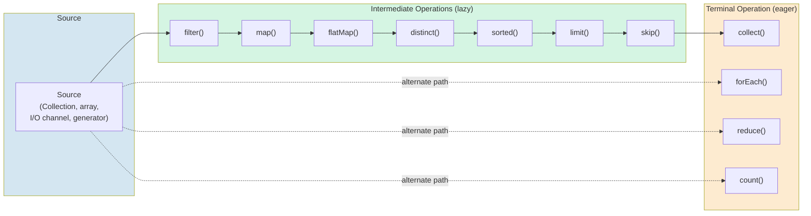
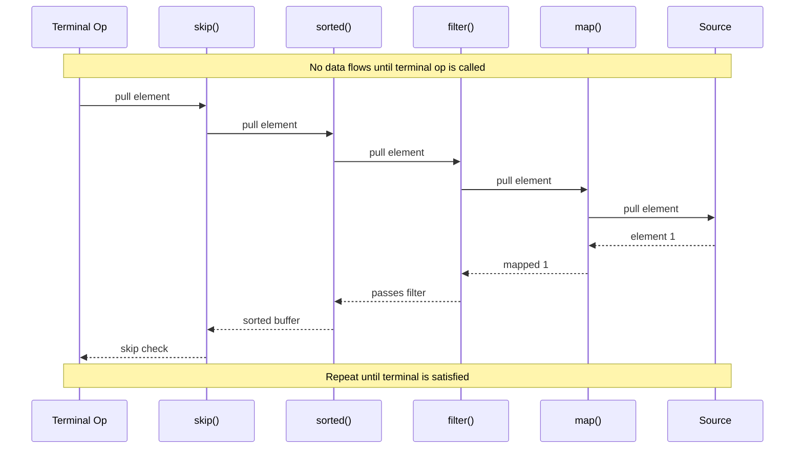

## Stream vs Collection

A `Collection` is an in-memory data structure that holds elements. A `Stream` is a sequence of elements supporting sequential and parallel aggregate operations computed on demand from a source. The distinction is fundamental and understanding it prevents entire categories of bugs.

| Property      | Collection                                | Stream                                                      |
| ------------- | ----------------------------------------- | ----------------------------------------------------------- |
| Storage       | Holds elements in memory                  | Does not store elements; computes from a source             |
| Evaluation    | Eager (all elements materialized at once) | Lazy (elements computed on demand)                          |
| Consumability | Can be traversed multiple times           | Single-use; consuming a terminal operation closes it        |
| Mutability    | Elements can be added, removed, replaced  | Elements are never modified; operations produce new streams |
| Iteration     | External (user controls the loop)         | Internal (library controls the iteration)                   |
| Purpose       | Store and organize data                   | Compute aggregate results and transform data                |

```java
List<String> names = List.of("Alice", "Bob", "Charlie", "Diana");

// Collection -- you own the data, you can iterate repeatedly
for (String name : names) {
    System.out.println(name);
}
for (String name : names) {  // fine -- collections are reusable
    System.out.println(name.toUpperCase());
}

// Stream -- you describe WHAT you want, not HOW to iterate
Stream<String> stream = names.stream()
    .filter(n -> n.length() > 3)
    .map(String::toUpperCase);

stream.forEach(System.out::println);  // OK -- first consumption
// stream.forEach(System.out::println);  // IllegalStateException: stream has already been operated upon or closed
```

### Design Decision: Why Streams Are Lazy

Streams are lazy for three reasons:

1. **Performance -- avoid unnecessary work.** If you filter a million elements and then call `findFirst()`, a lazy stream processes only the elements up to the first match. An eager approach would filter all one million elements before returning the first. Laziness enables short-circuiting, which can turn an O(n) operation into an O(k) operation where k is the number of elements actually needed.

2. **Composability -- enable infinite streams.** `Stream.generate()` and `Stream.iterate()` can produce infinite sequences. These are only useful because intermediate operations are lazy -- they describe transformations without materializing elements. Only when a terminal operation is invoked does the pipeline begin pulling elements, and a short-circuiting terminal operation like `limit()` prevents infinite processing.

3. **Fusion -- enable internal optimization.** Because the stream pipeline is a description of operations rather than a sequence of concrete steps, the runtime can fuse multiple operations into a single pass over the data. For example, `filter().map().filter().map()` is fused into a single traversal that applies all four predicates and functions per element, avoiding the creation of intermediate collections between each step.

```java
// Lazy evaluation in action -- only 3 elements are ever processed
// even though the source could be infinite
IntStream.iterate(1, n -> n + 1)       // infinite: 1, 2, 3, 4, ...
    .filter(n -> n % 2 == 0)           // lazy: 2, 4, 6, ...
    .map(n -> n * n)                   // lazy: 4, 16, 36, ...
    .limit(3)                          // short-circuiting: takes only 3
    .forEach(System.out::println);     // terminal: triggers the pipeline
// Output: 4, 16, 36
// Only 6 elements were tested by the filter (1,2,3,4,5,6)
// Only 3 elements were mapped (2,4,6)
```

## Stream Pipeline Architecture

A stream pipeline consists of three parts: a **source**, zero or more **intermediate operations**, and one **terminal operation**.





Intermediate operations return a new stream and are lazy -- they do not process any elements until a terminal operation is invoked. Terminal operations produce a result or a side effect and close the stream.

## Creating Streams

### Stream.of

Creates a stream from explicit values.

```java
Stream<String> stream = Stream.of("a", "b", "c");
Stream<String> single = Stream.of("only");

// Stream.of with null -- the stream will contain one null element
Stream<String> withNull = Stream.of((String) null);

// Stream.ofNullable (Java 9+) -- returns empty stream if the value is null
Stream<String> emptyIfNull = Stream.ofNullable(null);     // empty stream
Stream<String> present = Stream.ofNullable("hello");      // Stream["hello"]
```

### Collection.stream / Collection.parallelStream

Every `Collection` implementation provides `stream()` and `parallelStream()` methods via the `Collection` interface default method.

```java
List<String> names = List.of("Alice", "Bob", "Charlie");
Stream<String> sequential = names.stream();          // sequential stream
Stream<String> parallel = names.parallelStream();    // parallel stream
```

### Primitive Specializations

`IntStream`, `LongStream`, and `DoubleStream` avoid the overhead of boxing and unboxing. Each provides range generation, summary statistics, and specialized reduction operations.

```java
IntStream intStream = IntStream.range(1, 10);          // 1..9 (exclusive end)
IntStream closedRange = IntStream.rangeClosed(1, 10);  // 1..10 (inclusive end)
IntStream fromArray = IntStream.of(1, 2, 3, 4, 5);

// Conversion between object and primitive streams
IntStream ints = names.stream().mapToInt(String::length);
Stream<Integer> boxed = ints.boxed();
IntStream unboxed = Stream.of(1, 2, 3).mapToInt(Integer::intValue);

// Primitive streams have specialized reduction and summary methods
IntSummaryStatistics stats = IntStream.of(10, 20, 30, 40).summaryStatistics();
stats.getCount();    // 4
stats.getSum();      // 100
stats.getAverage();  // 25.0
stats.getMin();      // 10
stats.getMax();      // 40
```

### Arrays.stream

Creates a stream from an array, with optional range parameters.

```java
int[] numbers = {1, 2, 3, 4, 5};
IntStream fromArray = Arrays.stream(numbers);
IntStream range = Arrays.stream(numbers, 1, 4);  // elements at index 1..3: 2, 3, 4

String[] words = {"hello", "world"};
Stream<String> wordStream = Arrays.stream(words);
```

### Stream.builder

For building streams when the elements are not known in advance. Prefer `Stream.of()` or collection-based creation when elements are known at compile time.

```java
Stream<String> stream = Stream.<String>builder()
    .add("first")
    .add("second")
    .add("third")
    .build();

// Builder accepts null values (unlike List.of)
Stream<String> withNull = Stream.<String>builder()
    .add("present")
    .add(null)
    .build();
```

### Stream.generate / Stream.iterate

Create potentially infinite streams. Always use with `limit()` or a short-circuiting terminal operation.

```java
// generate -- takes a Supplier, produces an infinite stream
Stream<Double> randoms = Stream.generate(Math::random).limit(5);
Stream<String> constant = Stream.generate(() -> "hello").limit(3);

// iterate (Java 8) -- seed + unary operator
Stream<Integer> naturals = Stream.iterate(1, n -> n + 1).limit(10);
// 1, 2, 3, 4, 5, 6, 7, 8, 9, 10

// iterate (Java 9+) -- seed + predicate + unary operator
// The predicate determines when to stop (replaces the need for limit)
Stream<Integer> bounded = Stream.iterate(
    1,                              // seed
    n -> n <= 100,                  // hasNext predicate
    n -> n * 2                      // next
);
// 1, 2, 4, 8, 16, 32, 64
```

### Other Sources

```java
// Empty stream
Stream<String> empty = Stream.empty();

// String lines (Java 11+)
Stream<String> lines = "line1\nline2\nline3".lines();

// Regex split
Stream<String> tokens = Pattern.compile("\\s+").splitAsStream("one two three");

// File lines
try (Stream<String> fileLines = Files.lines(Path.of("data.txt"))) {
    fileLines.filter(line -> !line.isBlank()).forEach(System.out::println);
}

// Concatenation
Stream<String> combined = Stream.concat(Stream.of("a", "b"), Stream.of("c", "d"));
```

## Intermediate Operations

Intermediate operations are lazy. They return a new stream and do not trigger any processing until a terminal operation is invoked on the pipeline.

### filter

Returns a stream containing only elements that match the given predicate.

```java
List<String> longNames = names.stream()
    .filter(name -> name.length() > 4)
    .collect(Collectors.toList());
// [Alice, Charlie]
```

### map

Applies a function to each element, producing a stream of the results. The output stream may have a different type than the input stream.

```java
List<Integer> lengths = names.stream()
    .map(String::length)
    .collect(Collectors.toList());
// [5, 3, 7, 5]

// Changing type
List<String> greetings = names.stream()
    .map(name -> "Hello, " + name)
    .collect(Collectors.toList());
```

### flatMap

Maps each element to a stream, then flattens all resulting streams into a single stream. This is the stream equivalent of a nested loop.

```java
// Flatten a list of lists
List<List<Integer>> nested = List.of(
    List.of(1, 2, 3),
    List.of(4, 5),
    List.of(6)
);
List<Integer> flat = nested.stream()
    .flatMap(Collection::stream)
    .collect(Collectors.toList());
// [1, 2, 3, 4, 5, 6]

// Practical example: one-to-many relationship
record Author(String name, List<String> books) {}
List<Author> authors = List.of(
    new Author("Alice", List.of("Book A", "Book B")),
    new Author("Bob", List.of("Book C"))
);
List<String> allBooks = authors.stream()
    .flatMap(author -> author.books().stream())
    .collect(Collectors.toList());
// [Book A, Book B, Book C]
```

### distinct

Returns a stream with distinct elements. Uses `equals()` to determine equality. For ordered streams, the first occurrence is kept; for unordered streams, any element may be selected.

```java
List<Integer> unique = Stream.of(1, 2, 2, 3, 1, 4, 3)
    .distinct()
    .collect(Collectors.toList());
// [1, 2, 3, 4]
```

:::warning
`distinct()` internally uses a `HashSet`-like structure to track seen elements. For large streams with expensive `equals()`/`hashCode()` implementations, this can be costly. Consider whether `distinct()` is necessary or whether you can eliminate duplicates at the source.
:::

### sorted

Returns a stream sorted according to natural order or a provided `Comparator`. This is a **stateful** operation -- it must buffer all elements before producing output.

```java
List<String> sorted = Stream.of("Charlie", "Alice", "Bob")
    .sorted()
    .collect(Collectors.toList());
// [Alice, Bob, Charlie]

List<String> byLength = Stream.of("Charlie", "Alice", "Bob")
    .sorted(Comparator.comparingInt(String::length))
    .collect(Collectors.toList());
// [Bob, Alice, Charlie]

// Chained comparator
List<String> byLengthThenAlpha = Stream.of("aa", "b", "cc", "a")
    .sorted(Comparator.comparingInt(String::length).thenComparing(Comparator.naturalOrder()))
    .collect(Collectors.toList());
// [a, b, aa, cc]
```

### peek

Returns a stream identical to the input, but invokes the provided `Consumer` on each element as it is consumed. Primarily intended for debugging.

```java
List<String> result = Stream.of("Alice", "Bob", "Charlie")
    .filter(name -> name.length() > 3)
    .peek(name -> System.out.println("Filtered: " + name))
    .map(String::toUpperCase)
    .peek(name -> System.out.println("Mapped: " + name))
    .collect(Collectors.toList());
// Filtered: Alice
// Mapped: ALICE
// Filtered: Charlie
// Mapped: CHARLIE
```

:::warning
`peek()` should be used only for debugging. Using it for side effects violates the stream contract, which states that intermediate operations should be free of side effects. The behavior of `peek()` is undefined if it modifies the stream source or interferes with the pipeline. Furthermore, in parallel streams, `peek()` may be called from multiple threads simultaneously, making any side effect unsafe without synchronization.
:::

### limit

Truncates the stream to at most `maxSize` elements. This is a **short-circuiting stateful** operation.

```java
List<Integer> first3 = IntStream.iterate(1, n -> n + 1)
    .limit(3)
    .boxed()
    .collect(Collectors.toList());
// [1, 2, 3]
```

### skip

Discards the first `n` elements of the stream. This is a stateful operation.

```java
List<Integer> afterFirst2 = Stream.of(1, 2, 3, 4, 5)
    .skip(2)
    .collect(Collectors.toList());
// [3, 4, 5]
```

### takeWhile / dropWhile (Java 9+)

`takeWhile` returns elements while the predicate is true and stops at the first false. `dropWhile` discards elements while the predicate is true and returns the rest.

```java
// takeWhile -- stops at the first element that fails the predicate
List<Integer> taken = Stream.of(1, 2, 3, 4, 5, 1, 2)
    .takeWhile(n -> n < 4)
    .collect(Collectors.toList());
// [1, 2, 3]  -- stops at 4, even though 1,2 after it would pass

// dropWhile -- drops elements while predicate is true, returns the rest
List<Integer> dropped = Stream.of(1, 2, 3, 4, 5, 1, 2)
    .dropWhile(n -> n < 4)
    .collect(Collectors.toList());
// [4, 5, 1, 2]  -- drops 1,2,3, returns everything from 4 onward
```

:::info
For **ordered** streams, `takeWhile` and `dropWhile` are deterministic: they process elements in encounter order. For **unordered** streams (e.g., `HashSet.parallelStream()`), the behavior is nondeterministic -- different elements may be taken or dropped on different runs because the encounter order is not defined.
:::

## Terminal Operations

Terminal operations trigger the processing of the entire pipeline and produce a result or a side effect. After a terminal operation, the stream is consumed and cannot be reused.

### forEach

Performs an action for each element. In sequential streams, elements are processed in encounter order. In parallel streams, the order is not guaranteed unless the stream has an encounter order and the stream is explicitly ordered.

```java
names.stream()
    .map(String::toUpperCase)
    .forEach(System.out::println);

// Use forEachOrdered for guaranteed order in parallel streams
names.parallelStream()
    .map(String::toUpperCase)
    .forEachOrdered(System.out::println);
```

### collect

Transforms the elements of the stream into a different form, most commonly a `Collection`. The `collect` operation takes a `Collector` that encapsulates the reduction strategy.

```java
List<String> result = names.stream()
    .filter(n -> n.length() > 3)
    .collect(Collectors.toList());

Set<String> unique = names.stream()
    .map(String::toLowerCase)
    .collect(Collectors.toSet());
```

### reduce

Performs a reduction on the elements, combining them into a single result using an associative accumulation function.

```java
// Without identity -- returns Optional (stream may be empty)
Optional<Integer> sum = Stream.of(1, 2, 3, 4, 5).reduce(Integer::sum);
// Optional[15]

// With identity -- returns the identity if stream is empty
int sumWithIdentity = Stream.of(1, 2, 3, 4, 5).reduce(0, Integer::sum);
// 15

// With identity and combiner (used for parallel streams)
int sumParallel = Stream.of(1, 2, 3, 4, 5).parallel().reduce(0, Integer::sum, Integer::sum);

// Reduction to a different type
String concatenated = Stream.of("a", "b", "c")
    .reduce("", (acc, s) -> acc + s);
// "abc"
```

:::warning
The accumulator function passed to `reduce` must be **associative**: `(a op b) op c == a op (b op c)`. If it is not associative, the result will be incorrect in parallel streams, because partial results may be combined in any order. The identity value must also satisfy `identity op x == x` for all x.
:::

### count

Returns the number of elements in the stream.

```java
long count = names.stream()
    .filter(n -> n.startsWith("A"))
    .count();
```

### min / max

Returns the minimum or maximum element according to a `Comparator`. Returns `Optional` because the stream may be empty.

```java
Optional<String> longest = names.stream()
    .max(Comparator.comparingInt(String::length));
// Optional[Charlie]

Optional<Integer> smallest = Stream.of(5, 3, 8, 1, 9)
    .min(Comparator.naturalOrder());
// Optional[1]
```

### anyMatch / allMatch / noneMatch

Short-circuiting terminal operations that test whether elements match a predicate.

```java
// anyMatch -- returns true if ANY element matches (short-circuits on first match)
boolean hasLong = names.stream()
    .anyMatch(n -> n.length() > 6);
// true (Charlie has 7 chars)

// allMatch -- returns true if ALL elements match (short-circuits on first non-match)
boolean allLong = names.stream()
    .allMatch(n -> n.length() > 3);
// false (Bob has 3 chars)

// noneMatch -- returns true if NO elements match (short-circuits on first match)
boolean noEmpty = names.stream()
    .noneMatch(String::isEmpty);
// true
```

### findFirst / findAny

Returns an `Optional` describing the first (or any) element of the stream. Both are short-circuiting.

```java
Optional<String> first = names.stream()
    .filter(n -> n.length() > 3)
    .findFirst();
// Optional[Alice]

Optional<String> any = names.parallelStream()
    .filter(n -> n.length() > 3)
    .findAny();
// Optional[?] -- any matching element, not guaranteed to be first
```

:::info
In sequential streams, `findFirst()` and `findAny()` typically return the same element. In parallel streams, `findAny()` may return a different element than `findFirst()` because it can return any element that the parallel worker encounters first, without the synchronization overhead of maintaining encounter order. Use `findAny()` when you do not care about which element is returned -- it is faster in parallel streams because it avoids ordering constraints.
:::

### toArray

Converts the stream elements into an array.

```java
// Returns Object[] -- no type information
Object[] array = names.stream().toArray();

// Returns String[] -- using a generator function
String[] typedArray = names.stream().toArray(String[]::new);

// The generator function is called once with the size, allocates the array
// Functionally equivalent to: String[] a = new String[size]; // then fill
```

## Collectors

The `Collectors` utility class provides factory methods for common reduction operations. A `Collector` encapsulates the supplier, accumulator, combiner, and finisher functions that define a mutable reduction.

### toList / toUnmodifiableList

```java
// Collectors.toList() -- returns a mutable ArrayList
List<String> mutable = names.stream().collect(Collectors.toList());

// Collectors.toUnmodifiableList() (Java 10+) -- returns an immutable list
List<String> immutable = names.stream().collect(Collectors.toUnmodifiableList());
```

### toSet / toUnmodifiableSet

```java
Set<String> unique = names.stream().map(String::toLowerCase).collect(Collectors.toSet());
Set<String> immutableSet = names.stream().map(String::toLowerCase).collect(Collectors.toUnmodifiableSet());
```

### toMap

```java
record Person(String name, int age) {}
List<Person> people = List.of(
    new Person("Alice", 30),
    new Person("Bob", 25),
    new Person("Charlie", 35)
);

// Basic toMap -- key mapper, value mapper
Map<String, Integer> nameToAge = people.stream()
    .collect(Collectors.toMap(Person::name, Person::age));

// toMap with merge function -- handles duplicate keys
Map<Integer, String> ageToName = people.stream()
    .collect(Collectors.toMap(
        Person::age,
        Person::name,
        (existing, replacement) -> existing + ", " + replacement  // merge on conflict
    ));

// toMap with specific map supplier
LinkedHashMap<String, Integer> ordered = people.stream()
    .collect(Collectors.toMap(
        Person::name,
        Person::age,
        (a, b) -> a,
        LinkedHashMap::new
    ));
```

:::danger
`Collectors.toMap()` throws `IllegalStateException` on duplicate keys unless a merge function is provided. This is a common source of runtime exceptions. Always provide a merge function if duplicate keys are possible, or use `groupingBy` when multiple values per key are expected.
:::

### joining

Concatenates stream elements into a single `String`.

```java
// No delimiter
String all = names.stream().collect(Collectors.joining());
// "AliceBobCharlie"

// With delimiter
String csv = names.stream().collect(Collectors.joining(", "));
// "Alice, Bob, Charlie"

// With delimiter, prefix, and suffix
String formatted = names.stream()
    .collect(Collectors.joining(", ", "[", "]"));
// "[Alice, Bob, Charlie]"
```

### groupingBy

Groups elements by a classification function, producing a `Map<K, List<T>>`.

```java
// Basic grouping
Map<Integer, List<String>> byLength = names.stream()
    .collect(Collectors.groupingBy(String::length));
// {3=[Bob], 5=[Alice, Diana], 7=[Charlie]}

// groupingBy with downstream collector
Map<Integer, Long> countByLength = names.stream()
    .collect(Collectors.groupingBy(String::length, Collectors.counting()));
// {3=1, 5=2, 7=1}

// groupingBy with mapped downstream
Map<Integer, Set<String>> namesByLength = names.stream()
    .collect(Collectors.groupingBy(
        String::length,
        Collectors.mapping(String::toUpperCase, Collectors.toSet())
    ));
// {3=[BOB], 5=[ALICE, DIANA], 7=[CHARLIE]}

// groupingBy with specific map factory
TreeMap<Integer, List<String>> sortedGroups = names.stream()
    .collect(Collectors.groupingBy(
        String::length,
        TreeMap::new,
        Collectors.toList()
    ));
```

### partitioningBy

A special case of `groupingBy` with a `Predicate` as the classifier. Always produces a `Map<Boolean, List<T>>` with exactly two entries.

```java
Map<Boolean, List<String>> partitioned = names.stream()
    .collect(Collectors.partitioningBy(n -> n.length() > 4));
// {false=[Bob], true=[Alice, Charlie, Diana]}

// partitioningBy with downstream collector
Map<Boolean, Long> counts = names.stream()
    .collect(Collectors.partitioningBy(
        n -> n.length() > 4,
        Collectors.counting()
    ));
// {false=1, true=3}
```

:::info
Use `partitioningBy` when the classifier is a `Predicate` and you want exactly two groups (true/false). Use `groupingBy` when the classifier produces more than two categories or is not a boolean predicate. `partitioningBy` always creates both map entries (true and false), even if one group is empty. `groupingBy` only creates entries for groups that have at least one element.
:::

### counting / summingInt / averagingInt

Reduction collectors for numeric aggregates.

```java
long count = names.stream().collect(Collectors.counting());
// Equivalent to: names.stream().count()

int totalLength = names.stream().collect(Collectors.summingInt(String::length));
// 20

double avgLength = names.stream().collect(Collectors.averagingInt(String::length));
// 5.0

// Collect all statistics in one pass
IntSummaryStatistics stats = names.stream()
    .collect(Collectors.summarizingInt(String::length));
stats.getCount();    // 4
stats.getSum();      // 20
stats.getAverage();  // 5.0
stats.getMin();      // 3
stats.getMax();      // 7
```

### collectingAndThen

Wraps a collector with a finishing function, allowing post-processing of the result.

```java
// Produce an unmodifiable list (pre-Java 16)
List<String> unmodifiable = names.stream()
    .collect(Collectors.collectingAndThen(
        Collectors.toList(),
        Collections::unmodifiableList
    ));

// Get the max as a plain value with a default
int maxLength = names.stream()
    .collect(Collectors.collectingAndThen(
        Collectors.maxBy(Comparator.comparingInt(String::length)),
        opt -> opt.orElse(0)
    ));
```

### mapping / flatMapping

Downstream collectors that transform elements before collecting.

```java
// mapping -- applies a function to each element before collecting
Map<Integer, List<String>> byLengthUpper = names.stream()
    .collect(Collectors.groupingBy(
        String::length,
        Collectors.mapping(String::toUpperCase, Collectors.toList())
    ));

// flatMapping (Java 9+) -- applies a function that returns a stream, then flattens
record Department(String name, List<String> employees) {}
List<Department> departments = List.of(
    new Department("Engineering", List.of("Alice", "Bob")),
    new Department("Sales", List.of("Charlie", "Diana", "Eve"))
);

// Group by name length, then flatten all employees into a single list per group
Map<Integer, List<String>> employeesByLength = departments.stream()
    .collect(Collectors.groupingBy(
        dept -> dept.name().length(),
        Collectors.flatMapping(
            dept -> dept.employees().stream(),
            Collectors.toList()
        )
    ));
// {11=[Alice, Bob], 5=[Charlie, Diana, Eve]}
```

## Parallel Streams

### Design Decision: Why Parallel Streams Use ForkJoinPool

Parallel streams use the common `ForkJoinPool` (accessed via `ForkJoinPool.commonPool()`) rather than creating a new thread pool for each parallel stream operation. This design decision was made for three reasons:

1. **Resource efficiency.** Creating and destroying thread pools is expensive. A shared pool amortizes this cost across all parallel stream operations in the JVM. The common pool is lazily initialized on first use and has a target parallelism equal to `Runtime.getRuntime().availableProcessors() - 1`.

2. **Work-stealing.** The `ForkJoinPool` uses a work-stealing scheduler where idle threads steal tasks from busy threads' queues. This is ideal for stream pipelines because different pipeline stages may have different per-element costs, leading to load imbalance. Work-stealing automatically rebalances work across threads without explicit partitioning.

3. **Thread confinement.** The lambda functions passed to stream operations are often non-thread-safe. Using a managed pool with a known size prevents the creation of unbounded numbers of threads, which could lead to resource exhaustion.

```java
// Basic parallel stream
long count = IntStream.rangeClosed(1, 10_000_000)
    .parallel()
    .filter(PrimeUtils::isPrime)
    .count();

// Control parallelism by submitting to a custom ForkJoinPool
ForkJoinPool customPool = new ForkJoinPool(4);
int result = customPool.submit(() ->
    IntStream.rangeClosed(1, 1_000_000)
        .parallel()
        .sum()
).join();
```

### When to Use Parallel Streams

```java
// GOOD candidate for parallelism:
// 1. Large dataset (N > 10,000)
// 2. CPU-bound processing (not I/O-bound)
// 3. Stateless, non-interfering, associative operations
// 4. Source is efficiently splittable (ArrayList, IntStream.range, arrays)

List<Integer> largeList = IntStream.rangeClosed(1, 1_000_000).boxed().toList();
int sum = largeList.parallelStream()
    .mapToInt(Integer::intValue)
    .filter(n -> n % 2 == 0)
    .sum();
```

### Pitfalls of Parallel Streams

:::danger
Parallel streams have several pitfalls that make them unsuitable for many workloads:

**1. Thread safety of lambdas.** Lambda expressions used in parallel stream operations must be thread-safe. Mutable shared state will cause data races.

```java
// BROKEN -- ArrayList is not thread-safe
List<String> results = new ArrayList<>();
names.parallelStream().forEach(results::add);  // data race, possible ConcurrentModificationException

// CORRECT -- use collect() which handles thread safety internally
List<String> results = names.parallelStream().collect(Collectors.toList());
```

**2. Ordering overhead.** Ordered parallel streams require coordination between threads to maintain encounter order. If order does not matter, use `.unordered()` to improve parallel performance.

```java
// Faster when order does not matter
long count = largeList.parallelStream()
    .unordered()
    .distinct()
    .count();
```

**3. Poor sources for splitting.** `LinkedList`, `Stream.iterate()`, and `BufferedReader.lines()` are inherently sequential and cannot be efficiently split. Parallelizing them often makes things slower due to the splitting overhead.

**4. Blocking operations.** If a lambda performs I/O (file reads, network calls, database queries), it blocks the ForkJoinPool worker thread. Since the common pool has only `availableProcessors - 1` threads, blocking a few of them can starve other parallel operations (or even other parts of the application that use the common pool).

**5. Nondeterministic results with non-associative operations.** If the accumulator is not associative, parallel reduce produces incorrect results that vary between runs.
:::

```java
// ANTI-PATTERN: Parallel stream for a small dataset
List<String> small = List.of("a", "b", "c");
small.parallelStream().map(String::toUpperCase).collect(Collectors.toList());
// Overhead of splitting and thread coordination exceeds the work done

// ANTI-PATTERN: Parallel stream with I/O
List<String> fileContents = filePaths.parallelStream()
    .map(path -> {
        try { return Files.readString(path); }           // BLOCKING -- starves the common pool
        catch (IOException e) { throw new UncheckedIOException(e); }
    })
    .collect(Collectors.toList());
// Use a dedicated ExecutorService for I/O-bound parallelism instead
```

## Optional

`Optional<T>` is a container object that may or may not contain a non-null value. It was introduced in Java 8 to provide a more explicit way to represent the absence of a value, replacing the pervasive use of `null` as a sentinel.

### Design Decision: Why Optional Exists (And When Not to Use It)

`Optional` exists to make the **presence or absence of a value explicit at the type level**. Before `Optional`, API methods returned `null` to indicate "no result," and callers had to remember to check for null. This was the source of countless `NullPointerException`s. `Optional` forces the caller to explicitly handle both cases.

However, `Optional` was **not designed** for every use case. Brian Goetz (Java language architect) has stated that `Optional` is primarily intended for **return types** of methods, not for fields, method parameters, or collections.

| Usage              | Recommended? | Reason                                                           |
| ------------------ | :----------: | ---------------------------------------------------------------- |
| Method return type |     Yes      | Forces caller to handle absence                                  |
| Method parameter   |      No      | Adds complexity without benefit; use method overloading instead  |
| Field              |      No      | Increases memory overhead (wrapper object), breaks serialization |
| Collection element |      No      | Use empty collection; `Optional` in collections is a code smell  |
| Stream element     |      No      | Use `filter` and `flatMap` instead                               |

### Creating Optionals

```java
// From a possibly-null value
Optional<String> present = Optional.of("hello");
Optional<String> empty = Optional.ofNullable(null);
// Optional.of(null) throws NullPointerException -- use ofNullable for uncertain values

// Empty optional
Optional<String> emptyExplicit = Optional.empty();
```

### Retrieving Values

```java
Optional<String> opt = Optional.of("hello");

// orElse -- returns the value if present, otherwise the default (always evaluated)
String result1 = opt.orElse("default");

// orElseGet -- returns the value if present, otherwise calls the Supplier (lazy)
String result2 = opt.orElseGet(() -> "default");

// orElseThrow -- returns the value if present, otherwise throws an exception
String result3 = opt.orElseThrow();  // throws NoSuchElementException
String result4 = opt.orElseThrow(() -> new IllegalArgumentException("not found"));
```

:::danger
The difference between `orElse()` and `orElseGet()` is critical. `orElse(defaultValue)` always evaluates `defaultValue`, even if the `Optional` is present. `orElseGet(supplier)` only invokes the supplier when the `Optional` is empty.

```java
// BROKEN: computeExpensiveDefault() is always called, even when opt is present
String result = opt.orElse(computeExpensiveDefault());

// CORRECT: computeExpensiveDefault() is only called when opt is empty
String result = opt.orElseGet(() -> computeExpensiveDefault());
```

:::

### Transforming Values

```java
Optional<String> name = Optional.of("Alice");

// map -- applies a function if the value is present
Optional<Integer> length = name.map(String::length);
// Optional[5]

// flatMap -- applies a function that returns an Optional, flattening the result
// Required when the mapping function itself returns an Optional
Optional<String> upper = name.flatMap(n -> Optional.of(n.toUpperCase()));
// Optional[ALICE]

// filter -- returns the Optional if the predicate matches, otherwise empty
Optional<String> longName = name.filter(n -> n.length() > 4);
// Optional[Alice]
Optional<String> shortName = name.filter(n -> n.length() < 3);
// Optional.empty
```

### Checking Presence

```java
Optional<String> opt = Optional.of("hello");

// isPresent -- true if a value is present
if (opt.isPresent()) {
    String value = opt.get();  // safe because we checked isPresent
}

// ifPresent -- executes an action if a value is present (preferred over isPresent + get)
opt.ifPresent(value -> System.out.println("Value: " + value));
```

:::warning
Avoid the `isPresent()` + `get()` pattern. It is functionally equivalent to a null check (`if (x != null) { x.foo() }`) and negates the purpose of `Optional`. Prefer `ifPresent()`, `map()`, `flatMap()`, `filter()`, or the `orElse*` family.

```java
// ANTI-PATTERN -- isPresent + get
if (optional.isPresent()) {
    process(optional.get());
} else {
    handleMissing();
}

// PREFERRED -- ifPresentOrElse (Java 9+)
optional.ifPresentOrElse(
    this::process,
    this::handleMissing
);

// PREFERRED -- orElse
String result = optional.orElse(defaultValue);
```

:::

### Anti-Patterns

```java
// ANTI-PATTERN 1: Optional as a field
public class Person {
    private Optional<String> nickname;  // BAD -- use null or a domain-specific sentinel
}

// ANTI-PATTERN 2: Optional as a method parameter
public void process(Optional<String> input) {  // BAD -- use overloading or null
}
// Preferred:
public void process(String input) { }
public void process() { }  // no-arg overload for "no input"

// ANTI-PATTERN 3: Optional in collections
List<Optional<String>> items = List.of(Optional.of("a"), Optional.empty());  // BAD
// Preferred: filter out absent values
List<String> items = Stream.of(Optional.of("a"), Optional.<String>empty())
    .flatMap(Optional::stream)
    .collect(Collectors.toList());

// ANTI-PATTERN 4: get() without isPresent check
String value = optional.get();  // throws NoSuchElementException if empty

// ANTI-PATTERN 5: Using Optional for boolean logic
if (optional.isPresent()) {  // BAD
    return true;
}
return false;
// Preferred:
return optional.isPresent();
```

### Optional in Streams

`Optional` integrates naturally with the Streams API. `Optional.stream()` (Java 9+) converts an `Optional` to a `Stream` of zero or one elements, enabling flatMap-based composition.

```java
// Optional.stream() -- converts to Stream<T> (0 or 1 element)
Optional<String> opt = Optional.of("hello");
List<String> result = opt.stream().map(String::toUpperCase).collect(Collectors.toList());
// [HELLO]

// Optional.empty() produces an empty stream
Optional<String> empty = Optional.empty();
List<String> emptyResult = empty.stream().collect(Collectors.toList());
// []

// Practical: chain Optional-returning methods with flatMap
record User(String email, Optional<Address> address) {}
record Address(Optional<String> city) {}

Optional<User> user = Optional.of(new User("a@b.com", Optional.of(new Address(Optional.of("NYC")))));

// FlatMap chain through nested Optionals
Optional<String> city = user
    .flatMap(User::address)
    .flatMap(Address::city);
// Optional[NYC]

// Using streams to unwrap nested Optionals
List<String> cities = List.of(user)
    .stream()
    .flatMap(u -> u.address().stream())
    .flatMap(a -> a.city().stream())
    .collect(Collectors.toList());
// [NYC]
```

## Summary of Design Principles

1. **Streams describe computations, not data.** A stream is a view over a source that describes a series of transformations. It does not store elements and it does not modify the source. The pipeline exists to express **what** computation to perform; the library decides **how** to perform it.

2. **Laziness is the key optimization.** Because intermediate operations are lazy, the stream library can fuse operations into a single pass, short-circuit when a result is found early, and handle infinite sources. An eager model would require intermediate collections between each operation and could not short-circuit.

3. **Use `collect()` for mutable reduction, `reduce()` for immutable reduction.** `collect()` uses a mutable accumulator (like an `ArrayList`) and is optimized for parallel streams with thread-safe combiners. `reduce()` produces a new immutable value on each step and is conceptually cleaner but less efficient for building collections.

4. **Parallel streams are not a silver bullet.** They help only for large, CPU-bound, embarrassingly parallel workloads with efficiently splittable sources. For small datasets, I/O-bound operations, or sequential data structures, they add overhead and can cause subtle bugs through shared mutable state or blocking the common ForkJoinPool.

5. **Optional is for return types, not for fields or parameters.** It makes API contracts explicit: a method returning `Optional<T>` signals that the result may be absent and forces the caller to handle that case. Using `Optional` as a field or parameter adds memory overhead and complexity without corresponding benefit.
