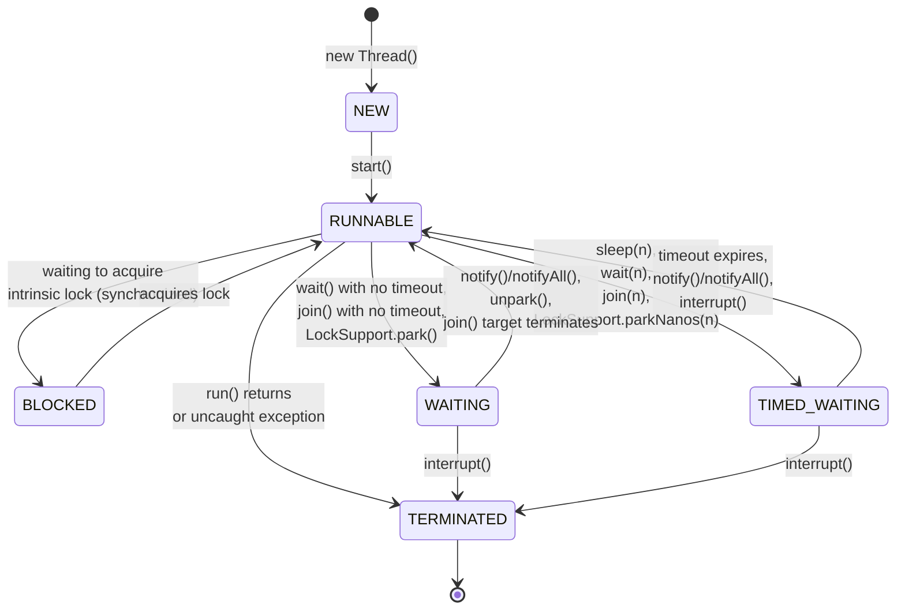
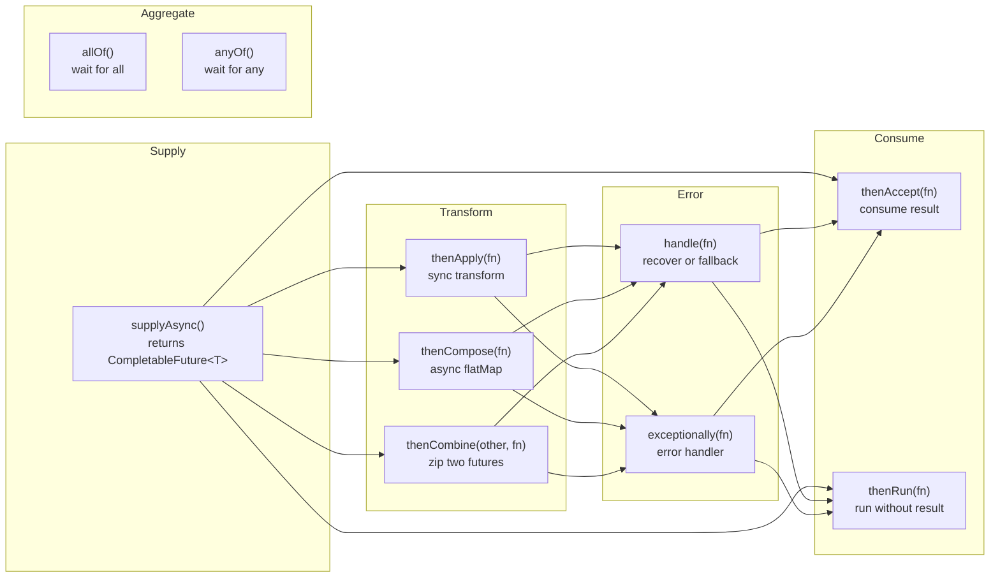

## Why Concurrency Is Hard

Concurrency is not parallelism. Concurrency is about _dealing with_ many things at once; parallelism is about _doing_ many things at once. A single-core processor running an event loop is concurrent but not parallel. A GPU running thousands of identical matrix multiplications is parallel but may not be concurrent in any meaningful sense. Java has supported concurrency since JDK 1.0 via the `Thread` class, and the platform has accumulated nearly three decades of concurrency primitives, each added to address the failure modes of its predecessors.

The fundamental difficulty of concurrent programming is that the number of possible interleavings of even two threads grows exponentially with the number of shared-memory operations. A bug that manifests once in a billion executions is still a bug, and it is still catastrophic in production. The Java Memory Model (JMM), introduced in JSR-133 (JDK 5), exists precisely to draw a line between "guaranteed correct" and "correct on my machine."

## The Java Memory Model

### Why the Memory Model Matters

On modern hardware, a write to a variable by one thread is not instantly visible to all other threads. Each CPU core has its own cache (L1, L2, L3), and the store buffer may hold writes that have not yet been flushed to main memory. Worse, the compiler and CPU may reorder instructions for optimization purposes, so even a program whose source code appears to execute operations in a specific order may have those operations reordered at the hardware level.

Without a memory model, the following program could behave unpredictably:

```java
// Thread A
ready = true;

// Thread B
if (ready) {
    System.out.println(result);  // result might not be visible!
}
```

The compiler might reorder `ready = true` before the write to `result` (or vice versa) because it sees no data dependency between them. The CPU might write `ready` to its store buffer while `result` sits in a cache line that has not been flushed. Thread B might read the stale value of `result` from its own cache even after seeing `ready = true`.

The JMM defines a partial ordering called **happens-before** that specifies when one operation is guaranteed to be visible to another. If operation A happens-before operation B, then the effects of A are visible to B. The happens-before relationship is the contract between the programmer and the runtime: if you establish a happens-before edge, the JVM and hardware are obligated to make the write visible.

### Happens-Before Rules

The JMM defines the following happens-before relationships:

| Rule               | Description                                                                                          |
| ------------------ | ---------------------------------------------------------------------------------------------------- |
| **Program order**  | Each action in a thread happens-before every action that comes later in that thread's program order. |
| **Monitor lock**   | An unlock on a monitor happens-before every subsequent lock on that same monitor.                    |
| **volatile**       | A write to a `volatile` field happens-before every subsequent read of that same field.               |
| **Thread start**   | A call to `Thread.start()` happens-before any action in the started thread.                          |
| **Thread join**    | All actions in a thread happen-before a return from `Thread.join()` on that thread.                  |
| **Transitivity**   | If A happens-before B, and B happens-before C, then A happens-before C.                              |
| **Interruption**   | `Thread.interrupt()` happens-before any thread detects that it has been interrupted.                 |
| **Finalizer**      | The end of a constructor happens-before the start of a finalizer.                                    |
| **Initialization** | The static initializer of a class happens-before any use of that class.                              |

### Safe Publication

An object is said to be _safely published_ when a reference to it is made visible to other threads in a way that guarantees all threads see the object in its fully constructed state. Without safe publication, other threads may see a partially constructed object (the notorious "partially constructed object" problem).

There are exactly four ways to safely publish an object in Java:

1. **Initializing a reference from a static initializer** -- class loading guarantees visibility.
2. **Storing a reference to a `volatile` field or `AtomicReference`.**
3. **Storing a reference to a final field** of a properly constructed object.
4. **Storing a reference to a field guarded by a lock.**

```java
// UNSAFE -- another thread may see count == 0
public class UnsafePublisher {
    public static Holder holder;

    public static void main(String[] args) {
        new Thread(() -> {
            holder = new Holder(42);  // publication without synchronization
        }).start();
        new Thread(() -> {
            Holder h = holder;  // may see a partially constructed Holder
            if (h != null) {
                h.assertSanity();  // may throw AssertionError
            }
        }).start();
    }
}

// SAFE -- volatile guarantees visibility of the fully constructed object
public class SafePublisher {
    public static volatile Holder holder;

    public static void main(String[] args) {
        new Thread(() -> {
            holder = new Holder(42);  // volatile write
        }).start();
        new Thread(() -> {
            Holder h = holder;  // volatile read -- sees fully constructed object
            if (h != null) {
                h.assertSanity();
            }
        }).start();
    }
}
```

:::warning
Publication via a normal (non-volatile, non-final) field is never safe. Even if Thread A writes the reference after constructing the object, the JIT compiler may reorder the write to `holder` before the writes to the object's fields during construction. This is not theoretical -- it has been observed in practice on x86, ARM, and every major architecture.
:::

## Threads

### Thread Creation: Runnable and Callable

Java provides two core abstractions for units of concurrent work: `Runnable` (no result, no checked exceptions) and `Callable<V>` (returns a result, can throw checked exceptions).

```java
// Runnable -- fire and forget
Runnable task = () -> {
    System.out.println("Running on thread: " + Thread.currentThread().getName());
};

// Callable -- produces a result
Callable<String> taskWithResult = () -> {
    Thread.sleep(1000);
    return "Result from thread: " + Thread.currentThread().getName();
};
```

### The Thread Class

```java
Thread thread = new Thread(() -> {
    System.out.println("Task executing");
}, "worker-1");

thread.start();   // spawns a new OS thread (expensive -- ~1MB stack, ~1ms creation time)
thread.join();    // blocks until the thread completes
```

### Future and FutureTask

A `Future` represents the result of an asynchronous computation. It is a read-only handle: you can check if the computation is complete, wait for it, and retrieve the result, but you cannot compose it.

```java
ExecutorService executor = Executors.newSingleThreadExecutor();

Future<String> future = executor.submit(() -> {
    Thread.sleep(1000);
    return "done";
});

// isDone() -- non-blocking check
System.out.println(future.isDone());  // false

// get() -- blocks until the result is available
String result = future.get();  // blocks for ~1 second, then returns "done"

// get(timeout) -- blocks with a timeout
try {
    String result2 = future.get(500, TimeUnit.MILLISECONDS);
} catch (TimeoutException e) {
    // the computation did not complete within 500ms
}

executor.shutdown();
```

### Thread Lifecycle

Every Java thread moves through a well-defined set of states during its lifetime. Understanding these states is essential for debugging deadlocks, livelocks, and performance problems.



| State             | Description                                                                                                              |
| ----------------- | ------------------------------------------------------------------------------------------------------------------------ |
| **NEW**           | Thread has been created but `start()` has not been called.                                                               |
| **RUNNABLE**      | Thread is eligible to run. It may be currently executing or waiting for CPU time. The JVM maps this to the OS scheduler. |
| **BLOCKED**       | Thread is waiting to acquire a monitor lock to enter or re-enter a `synchronized` block/method.                          |
| **WAITING**       | Thread is waiting indefinitely for another thread to perform a particular action (e.g., `notify()`).                     |
| **TIMED_WAITING** | Thread is waiting for another thread to perform an action, but with a specified maximum wait time.                       |
| **TERMINATED**    | Thread has completed execution of its `run()` method.                                                                    |

:::info
`RUNNABLE` in the JVM state machine does not distinguish between "currently executing on a CPU core" and "ready to execute but waiting for CPU time." The JVM delegates scheduling to the operating system, and the OS distinguishes between these two conditions (running vs. runnable in the OS run queue). From the JVM's perspective, both are `RUNNABLE`.
:::

## Synchronized

### Intrinsic Locks (Monitors)

Every Java object has an intrinsic lock (also called a monitor lock or mutex). When a thread enters a `synchronized` block, it acquires the monitor. When it exits, it releases it. Only one thread can hold a monitor at a time.

```java
public class Counter {
    private int count = 0;

    // Synchronized method -- acquires the monitor on `this`
    public synchronized void increment() {
        count++;
    }

    // Equivalent explicit monitor acquisition
    public void incrementExplicit() {
        synchronized (this) {
            count++;
        }
    }

    // Static synchronized method -- acquires the monitor on the Class object
    public static synchronized void staticMethod() {
        // ...
    }
    // Equivalent to: synchronized (Counter.class) { ... }
}
```

### Reentrancy

Intrinsic locks are **reentrant**: if a thread already holds the lock on an object, it can re-enter any `synchronized` block or method on that same object without deadlocking. The JVM keeps a hold count per thread per monitor. The lock is released only when the hold count drops to zero.

```java
public class ReentrantExample {
    public synchronized void outer() {
        // Thread acquires the monitor on `this` (hold count = 1)
        inner();  // re-enters -- hold count becomes 2
        // After inner() returns -- hold count back to 1
    }
    // After outer() returns -- hold count = 0, lock released

    public synchronized void inner() {
        // Same thread, same monitor -- reentrant, no deadlock
        System.out.println("Inner acquired lock successfully");
    }
}
```

### Why synchronized Was Problematic

`synchronized` has several well-documented shortcomings that motivated the development of `java.util.concurrent.locks`:

1. **No fairness control.** The JVM makes no guarantees about which waiting thread acquires the lock when it becomes available. A thread that has been waiting the longest may starve indefinitely while new threads repeatedly acquire the lock.

2. **No try-lock.** If a thread calls `synchronized`, it blocks indefinitely until the lock is available. There is no way to attempt acquisition with a timeout, which makes it impossible to implement deadlock-avoidance strategies.

3. **No interruptibility.** A thread blocked waiting to acquire a monitor lock cannot be interrupted -- it will not respond to `Thread.interrupt()` until it actually acquires the lock.

4. **Single condition variable.** A monitor has exactly one wait set (the set of threads that called `wait()`). If a class needs multiple conditions (e.g., "not full" and "not empty" for a bounded buffer), the programmer must use `notifyAll()` and check the condition in a loop, which is error-prone and wasteful.

5. **No read-write differentiation.** A `synchronized` block excludes all other threads, even those that only want to read. For data structures with a high read-to-write ratio, this is a significant performance bottleneck.

```java
// The classic bounded buffer -- single condition variable, must use notifyAll()
public class BoundedBuffer<V> {
    private final V[] buffer;
    private int count = 0;
    private int putIndex = 0;
    private int takeIndex = 0;

    @SuppressWarnings("unchecked")
    public BoundedBuffer(int capacity) {
        buffer = (V[]) new Object[capacity];
    }

    public synchronized void put(V value) throws InterruptedException {
        while (count == buffer.length) {  // MUST use while, not if
            wait();                         // spurious wakeup possible
        }
        buffer[putIndex] = value;
        putIndex = (putIndex + 1) % buffer.length;
        count++;
        notifyAll();  // must wake ALL waiters -- wasteful, but necessary
    }

    public synchronized V take() throws InterruptedException {
        while (count == 0) {
            wait();
        }
        V value = buffer[takeIndex];
        buffer[takeIndex] = null;
        takeIndex = (takeIndex + 1) % buffer.length;
        count--;
        notifyAll();
        return value;
    }
}
```

:::warning
Always use `wait()` inside a `while` loop, never an `if` statement. The JMM permits **spurious wakeups** -- a thread may return from `wait()` without `notify()` or `notifyAll()` being called. The condition must be re-checked after every wakeup. This is not a theoretical concern; it is mandated by the POSIX specification and the JLS.
:::

## Volatile

The `volatile` keyword provides a lighter-weight synchronization mechanism than `synchronized`. A `volatile` field has two guarantees:

1. **Visibility:** A write to a `volatile` variable is immediately visible to all other threads. The JVM inserts memory barriers (on x86, a `lock addl` instruction; on ARM, `dmb ish`) that prevent the write from being reordered with subsequent operations and force cache coherence.

2. **Ordering:** Reads and writes to `volatile` variables cannot be reordered with respect to each other or with respect to reads and writes to non-volatile variables that occur before or after them in program order. This is the "happens-before" guarantee.

```java
public class VolatileFlag {
    private volatile boolean shutdownRequested = false;

    public void shutdown() {
        shutdownRequested = true;  // volatile write -- immediately visible
    }

    public void doWork() {
        while (!shutdownRequested) {  // volatile read -- always sees latest value
            // perform work
        }
        System.out.println("Shutdown detected, exiting");
    }
}
```

### Volatile Is Not Atomic

`volatile` guarantees visibility but not atomicity of compound actions. The classic example:

```java
public class VolatileCounter {
    private volatile int count = 0;

    // NOT thread-safe -- count++ is three operations: read, increment, write
    public void increment() {
        count++;  // race condition between read and write
    }
}
```

Two threads calling `increment()` simultaneously can both read `count = 0`, both increment to `1`, and both write `1`, losing one increment. For atomic compound operations, use `AtomicInteger` or `synchronized`.

### The Double-Checked Locking Idiom

Before `volatile` was properly specified in JSR-133 (JDK 5), the double-checked locking idiom was broken. The fix requires `volatile`:

```java
public class Singleton {
    // volatile is MANDATORY here -- without it, the JIT may reorder the
    // write to `instance` before the constructor completes
    private static volatile Singleton instance;

    private Singleton() {
        // expensive initialization
    }

    public static Singleton getInstance() {
        Singleton result = instance;  // read once to avoid volatile read in common case
        if (result == null) {         // first check -- no synchronization
            synchronized (Singleton.class) {
                result = instance;
                if (result == null) { // second check -- under lock
                    instance = result = new Singleton();
                }
            }
        }
        return result;
    }
}
```

The local variable `result` avoids reading the volatile field more than once in the common (already-initialized) case. This is a micro-optimization that HotSpot typically applies automatically, but making it explicit ensures correctness across all JVMs.

## ExecutorService and Thread Pools

### Why Raw Threads Are Wrong

Creating a `new Thread()` for every unit of work is wrong for three reasons: (1) thread creation is expensive (each OS thread allocates a ~1MB stack and requires a system call), (2) there is no bound on the number of concurrent threads, so a spike in load can exhaust system resources (OutOfMemoryError), and (3) there is no reuse -- threads are created and destroyed rather than being recycled. The `ExecutorService` abstraction solves all three problems.

### The Executors Factory

```java
// Fixed thread pool -- bounded, threads are reused
ExecutorService fixedPool = Executors.newFixedThreadPool(4);

// Cached thread pool -- creates threads on demand, reclaims idle threads after 60s
// DANGEROUS in production -- unbounded thread creation under load
ExecutorService cachedPool = Executors.newCachedThreadPool();

// Single-threaded executor -- guarantees sequential execution
ExecutorService singleThread = Executors.newSingleThreadExecutor();

// Scheduled executor -- supports delayed and periodic tasks
ScheduledExecutorService scheduler = Executors.newScheduledThreadPool(2);
scheduler.schedule(() -> System.out.println("Delayed task"), 5, TimeUnit.SECONDS);
scheduler.scheduleAtFixedRate(() -> System.out.println("Periodic"), 0, 1, TimeUnit.SECONDS);

// IMPORTANT: always shut down executors
fixedPool.shutdown();  // orderly shutdown -- waits for submitted tasks
fixedPool.awaitTermination(10, TimeUnit.SECONDS);
fixedPool.shutdownNow();  // forceful shutdown -- interrupts running tasks
```

:::danger
Never use `Executors.newCachedThreadPool()` in production code. It creates a new thread for every submitted task when the pool is saturated, which means a sudden burst of 100,000 tasks creates 100,000 OS threads and almost certainly crashes the JVM with an `OutOfMemoryError: unable to create new native thread`. Always use a bounded pool.
:::

### ThreadPoolExecutor: The Complete Picture

`Executors` factory methods are thin wrappers around `ThreadPoolExecutor`. Understanding the underlying parameters is essential for production configuration:

```java
ThreadPoolExecutor executor = new ThreadPoolExecutor(
    2,                      // corePoolSize -- threads kept alive even when idle
    4,                      // maximumPoolSize -- upper bound on thread count
    60L,                    // keepAliveTime -- idle threads beyond core are reclaimed after this
    TimeUnit.SECONDS,       // unit for keepAliveTime
    new LinkedBlockingQueue<>(100),  // work queue -- bounded!
    new ThreadFactory() {   // custom thread factory -- name threads for debugging
        private final AtomicInteger counter = new AtomicInteger(0);
        @Override
        public Thread newThread(Runnable r) {
            Thread t = new Thread(r, "my-pool-" + counter.incrementAndGet());
            t.setUncaughtExceptionHandler((thread, throwable) -> {
                System.err.println("Uncaught in " + thread.getName() + ": " + throwable);
            });
            return t;
        }
    },
    new ThreadPoolExecutor.CallerRunsPolicy()  // rejection policy
);
```

**Execution flow when a task is submitted:**

1. If fewer than `corePoolSize` threads are running, a new thread is created.
2. If all core threads are busy and the queue is not full, the task is queued.
3. If the queue is full and fewer than `maximumPoolSize` threads are running, a new thread is created.
4. If the queue is full and `maximumPoolSize` threads are running, the task is rejected (handled by the `RejectedExecutionHandler`).

| Rejection Policy      | Behavior                                                              |
| --------------------- | --------------------------------------------------------------------- |
| `AbortPolicy`         | Throws `RejectedExecutionException` (default).                        |
| `CallerRunsPolicy`    | The calling thread executes the task itself -- provides backpressure. |
| `DiscardPolicy`       | Silently discards the task.                                           |
| `DiscardOldestPolicy` | Discards the oldest queued task and retries submission.               |

## CompletableFuture

### Why CompletableFuture Exists

`Future` is a read-only promise: you can call `get()` to block until the result is ready, but you cannot attach callbacks, compose multiple futures, or handle errors declaratively. `CompletableFuture<T>`, introduced in JDK 8, implements the `CompletionStage<T>` interface and provides a fluent API for composing asynchronous computations. It is to `Future` what `Stream` is to `Collection`: a composable, chainable abstraction that eliminates boilerplate.

### Transformation and Composition

```java
CompletableFuture<String> future = CompletableFuture.supplyAsync(() -> {
    return "Hello";
}, executor);

// thenApply -- synchronous transformation (same thread or calling thread)
CompletableFuture<String> upper = future.thenApply(String::toUpperCase);

// thenApplyAsync -- asynchronous transformation (executed on a different thread)
CompletableFuture<String> upperAsync = future.thenApplyAsync(String::toUpperCase, executor);

// thenCompose -- flatMap: the function returns a CompletableFuture
// Use when the transformation itself is asynchronous
CompletableFuture<Integer> length = future.thenCompose(s ->
    CompletableFuture.supplyAsync(() -> s.length(), executor)
);

// thenCombine -- combines two independent futures
CompletableFuture<String> greeting = CompletableFuture.supplyAsync(() -> "Hello", executor);
CompletableFuture<String> name = CompletableFuture.supplyAsync(() -> "World", executor);
CompletableFuture<String> combined = greeting.thenCombine(name, (g, n) -> g + ", " + n + "!");
```

### Aggregation: allOf and anyOf

```java
CompletableFuture<String> f1 = CompletableFuture.supplyAsync(() -> "A");
CompletableFuture<String> f2 = CompletableFuture.supplyAsync(() -> "B");
CompletableFuture<String> f3 = CompletableFuture.supplyAsync(() -> "C");

// allOf -- waits for ALL futures to complete
CompletableFuture<Void> all = CompletableFuture.allOf(f1, f2, f3);
CompletableFuture<List<String>> results = all.thenApply(v ->
    List.of(f1.join(), f2.join(), f3.join())  // join() is non-blocking here because all completed
);

// anyOf -- completes as soon as ANY future completes
CompletableFuture<Object> any = CompletableFuture.anyOf(f1, f2, f3);
```

### Error Handling

```java
CompletableFuture<Integer> safe = CompletableFuture.supplyAsync(() -> {
    if (Math.random() > 0.5) {
        throw new RuntimeException("Failed");
    }
    return 42;
})
.handle((result, ex) -> {  // handle -- always called, receives result OR exception
    if (ex != null) {
        return -1;  // fallback value
    }
    return result;
})
.exceptionally(ex -> {  // exceptionally -- only called on exception
    System.err.println("Error: " + ex.getMessage());
    return -1;
});
```

### CompletableFuture Pipeline



## Concurrent Collections

### ConcurrentHashMap

`ConcurrentHashMap` is a hash table that supports full concurrency of retrievals and high expected concurrency for updates. Unlike `Hashtable` or `Collections.synchronizedMap()`, it does not lock the entire map for writes. Instead, it uses a **striped lock** strategy (JDK 7: lock striping with 16 segments; JDK 8+: CAS on individual bucket nodes).

```java
ConcurrentHashMap<String, AtomicInteger> counts = new ConcurrentHashMap<>();

// putIfAbsent -- atomic check-then-act
counts.putIfAbsent("key", new AtomicInteger(0));

// compute -- atomic compute (the BiFunction is applied under lock)
counts.compute("key", (k, v) -> {
    if (v == null) return new AtomicInteger(1);
    v.incrementAndGet();
    return v;
});

// merge -- atomic merge
counts.merge("key", new AtomicInteger(1), (oldVal, newVal) -> {
    oldVal.addAndGet(newVal.get());
    return oldVal;
});

// forEach -- thread-safe iteration (weakly consistent -- may not reflect concurrent modifications)
counts.forEach(2, (key, value) -> {
    System.out.println(key + " = " + value.get());
});
```

:::info
The iteration semantics of `ConcurrentHashMap` are **weakly consistent**: the iterator reflects the state of the map at some point during or since the creation of the iterator. It will never throw `ConcurrentModificationException` and is guaranteed to see each element at most once, but it may miss elements that were added after the iterator was created.
:::

### CopyOnWriteArrayList

`CopyOnWriteArrayList` creates a new copy of the underlying array on every write operation. Reads are lock-free and see a snapshot of the array at the time the read began. This is optimal for read-heavy workloads where writes are rare.

```java
CopyOnWriteArrayList<String> listeners = new CopyOnWriteArrayList<>();

// Registration -- rare, O(n) copy on write
listeners.add("listener-1");
listeners.add("listener-2");

// Notification -- frequent, lock-free reads
for (String listener : listeners) {
    notify(listener);  // no ConcurrentModificationException, no locking
}
```

### BlockingQueue

`BlockingQueue` is a queue that supports blocking on `put()` (when full) and `take()` (when empty). It is the foundation of the producer-consumer pattern.

```java
BlockingQueue<String> queue = new LinkedBlockingQueue<>(100);

// Producer
Runnable producer = () -> {
    try {
        queue.put("item");  // blocks if queue is full
    } catch (InterruptedException e) {
        Thread.currentThread().interrupt();
    }
};

// Consumer
Runnable consumer = () -> {
    try {
        String item = queue.take();  // blocks if queue is empty
        process(item);
    } catch (InterruptedException e) {
        Thread.currentThread().interrupt();
    }
};

ExecutorService executor = Executors.newFixedThreadPool(4);
executor.submit(producer);
executor.submit(consumer);
```

| Implementation          | Ordering                         | Bounded                                  | Notes                                                                |
| ----------------------- | -------------------------------- | ---------------------------------------- | -------------------------------------------------------------------- |
| `ArrayBlockingQueue`    | FIFO                             | Yes (fixed capacity)                     | Backed by a circular array.                                          |
| `LinkedBlockingQueue`   | FIFO                             | Optional (defaults to Integer.MAX_VALUE) | Backed by linked nodes.                                              |
| `PriorityBlockingQueue` | Priority (natural or Comparator) | No (grows as needed)                     | `take()` always returns the head (lowest-priority element).          |
| `SynchronousQueue`      | None (handoff)                   | Always zero capacity                     | `put()` blocks until a `take()` arrives. Direct handoff, no storage. |

### ConcurrentLinkedQueue

`ConcurrentLinkedQueue` is an unbounded, lock-free, FIFO queue based on the Michael-Scott queue algorithm. It uses CAS (compare-and-set) operations instead of locks, which makes it non-blocking but more complex internally.

```java
ConcurrentLinkedQueue<String> queue = new ConcurrentLinkedQueue<>();

queue.offer("a");  // non-blocking add -- always succeeds (unbounded)
queue.offer("b");

String head = queue.poll();  // non-blocking remove -- returns null if empty
String peek = queue.peek();  // non-blocking inspect -- returns null if empty
```

## Atomic Classes

The `java.util.concurrent.atomic` package provides lock-free, thread-safe variables that support atomic read-modify-write operations. They are built on top of CPU-level CAS (compare-and-swap) instructions.

### AtomicInteger

```java
AtomicInteger counter = new AtomicInteger(0);

// Atomic increment -- equivalent to ++counter but thread-safe
int newValue = counter.incrementAndGet();  // returns the new value
int oldValue = counter.getAndIncrement();  // returns the old value

// Atomic compare-and-set
int expected = 0;
boolean success = counter.compareAndSet(expected, expected + 1);
// success is true only if the current value was exactly `expected` when the CAS executed

// Atomic update with a function
counter.updateAndGet(x -> x * 2);  // atomic: reads, applies function, writes back via CAS
```

### AtomicReference

```java
class User {
    final String name;
    final int age;

    User(String name, int age) {
        this.name = name;
        this.age = age;
    }
}

AtomicReference<User> currentUser = new AtomicReference<>(new User("Alice", 30));

// Atomic update of an object reference
User updated = new User("Bob", 35);
currentUser.compareAndSet(
    currentUser.get(),  // expected reference
    updated             // new reference
);
```

### How CAS Works

CAS is a single hardware instruction (e.g., `cmpxchg` on x86, `LDXR/STXR` on ARM) that atomically performs:

```
if (currentValue == expectedValue) {
    currentValue = newValue;
    return true;
} else {
    return false;
}
```

If the CAS fails (because another thread modified the value between the read and the write), the caller retries. This is the core of lock-free algorithms:

```java
// Simplified implementation of AtomicInteger.incrementAndGet()
public final int incrementAndGet() {
    int current;
    int next;
    do {
        current = get();          // read current value
        next = current + 1;       // compute new value
    } while (!compareAndSet(current, next));  // retry until CAS succeeds
    return next;
}
```

:::info
Under high contention (many threads repeatedly failing CAS on the same cache line), atomic classes can suffer from **cache line contention** (also called "false sharing"). Each failed CAS triggers a cache coherence protocol invalidation on the cache line holding the atomic variable, which can cause severe performance degradation. In extreme cases, a lock-based approach can outperform lock-free CAS.
:::

## Explicit Locks

### ReentrantLock

`ReentrantLock` is a mutual exclusion lock with the same basic behavior as `synchronized` but with extended capabilities: fair scheduling, try-lock with timeout, interruptible lock acquisition, and multiple condition variables.

```java
public class BoundedBufferWithLock<V> {
    private final V[] buffer;
    private int count = 0;
    private final ReentrantLock lock = new ReentrantLock(true);  // fair lock
    private final Condition notFull = lock.newCondition();
    private final Condition notEmpty = lock.newCondition();

    @SuppressWarnings("unchecked")
    public BoundedBufferWithLock(int capacity) {
        buffer = (V[]) new Object[capacity];
    }

    public void put(V value) throws InterruptedException {
        lock.lockInterruptibly();  // can be interrupted while waiting for lock
        try {
            while (count == buffer.length) {
                notFull.await();  // precise condition -- only wakes producers
            }
            buffer[count] = value;
            count++;
            notEmpty.signal();  // precise signal -- wakes one consumer
        } finally {
            lock.unlock();
        }
    }

    public V take() throws InterruptedException {
        lock.lockInterruptibly();
        try {
            while (count == 0) {
                notEmpty.await();
            }
            V value = buffer[0];
            buffer[0] = null;
            System.arraycopy(buffer, 1, buffer, 0, count - 1);
            count--;
            notFull.signal();
            return value;
        } finally {
            lock.unlock();
        }
    }
}
```

### ReadWriteLock

`ReadWriteLock` maintains a pair of associated locks: one for read operations and one for write operations. Multiple threads can hold the read lock simultaneously, but only one thread can hold the write lock (and no read locks can be held concurrently with the write lock).

```java
public class ThreadSafeCache<K, V> {
    private final Map<K, V> cache = new HashMap<>();
    private final ReadWriteLock rwLock = new ReentrantReadWriteLock();

    public V get(K key) {
        rwLock.readLock().lock();
        try {
            return cache.get(key);  // many readers can proceed concurrently
        } finally {
            rwLock.readLock().unlock();
        }
    }

    public void put(K key, V value) {
        rwLock.writeLock().lock();
        try {
            cache.put(key, value);  // exclusive access -- no readers or writers
        } finally {
            rwLock.writeLock().unlock();
        }
    }
}
```

:::warning
`ReentrantReadWriteLock` is not reentrant between read and write locks. A thread holding the read lock cannot acquire the write lock (it will deadlock). A thread holding the write lock can acquire the read lock (downgrade), but a thread holding the read lock cannot upgrade to the write lock.
:::

### StampedLock

`StampedLock`, introduced in JDK 8, provides an optimistic read mode that does not block writers. It uses a single `long` stamp to represent the lock state, which makes it more memory-efficient than `ReadWriteLock`.

```java
public class StampedLockCache<K, V> {
    private final Map<K, V> cache = new HashMap<>();
    private final StampedLock lock = new StampedLock();

    // Optimistic read -- no lock acquisition, just a stamp validation
    public V get(K key) {
        long stamp = lock.tryOptimisticRead();  // non-blocking, returns a stamp
        V value = cache.get(key);
        if (!lock.validate(stamp)) {            // check if a write occurred
            stamp = lock.readLock();            // fall back to full read lock
            try {
                value = cache.get(key);
            } finally {
                lock.unlockRead(stamp);
            }
        }
        return value;
    }

    public void put(K key, V value) {
        long stamp = lock.writeLock();
        try {
            cache.put(key, value);
        } finally {
            lock.unlockWrite(stamp);
        }
    }
}
```

:::info
`StampedLock` is NOT reentrant. Each call to `writeLock()` must be matched with exactly one `unlockWrite()` using the returned stamp. Losing the stamp or calling unlock with the wrong stamp will cause an `IllegalMonitorStateException`. Additionally, `StampedLock` does not support `Condition` variables.
:::

## Synchronizers

### Semaphore

A `Semaphore` controls access to a shared resource through a counter. A thread must acquire a permit before accessing the resource and release it when done. Unlike a lock, a semaphore has no owner -- any thread can release a permit.

```java
// Limit concurrent access to a resource pool (e.g., database connections)
Semaphore semaphore = new Semaphore(5);  // at most 5 concurrent accesses

Runnable task = () -> {
    try {
        semaphore.acquire();
        try {
            accessResource();
        } finally {
            semaphore.release();
        }
    } catch (InterruptedException e) {
        Thread.currentThread().interrupt();
    }
};
```

### CountDownLatch

A `CountDownLatch` allows one or more threads to wait until a set of operations being performed in other threads completes. It is initialized with a count, and each `countDown()` decrements it. `await()` blocks until the count reaches zero.

```java
// Parallel startup: wait for all services to initialize
CountDownLatch latch = new CountDownLatch(3);

ExecutorService executor = Executors.newFixedThreadPool(3);
executor.submit(() -> { initDatabase(); latch.countDown(); });
executor.submit(() -> { initCache(); latch.countDown(); });
executor.submit(() -> { initMessageQueue(); latch.countDown(); });

latch.await();  // blocks until all 3 countDown() calls
System.out.println("All services initialized");
```

:::info
`CountDownLatch` is one-shot: once the count reaches zero, it cannot be reset. If you need a reusable version, use `CyclicBarrier`.
:::

### CyclicBarrier

A `CyclicBarrier` allows a set of threads to all wait for each other to reach a common barrier point. Unlike `CountDownLatch`, it is reusable after all waiting threads are released.

```java
// MapReduce-style parallel computation
CyclicBarrier barrier = new CyclicBarrier(4, () -> {
    // barrier action -- executed by the last thread to arrive
    System.out.println("All workers finished their partition. Merging results...");
});

ExecutorService executor = Executors.newFixedThreadPool(4);
for (int i = 0; i < 4; i++) {
    final int partition = i;
    executor.submit(() -> {
        processPartition(partition);
        barrier.await();  // waits until all 4 threads reach this point
    });
}
```

:::warning
If a thread fails (throws an exception) while waiting at a `CyclicBarrier`, the barrier is **broken** and all other waiting threads receive a `BrokenBarrierException`. The barrier must be explicitly reset via `barrier.reset()` before it can be used again.
:::

## Virtual Threads (Java 21+)

### Why Virtual Threads Change Everything

Platform threads (the threads Java has had since JDK 1.0) are a 1:1 wrapper around OS threads. This means every Java thread consumes an OS thread, which consumes a kernel stack (~1MB on Linux). A server handling 10,000 concurrent requests with platform threads requires 10,000 OS threads and ~10GB of stack memory. The OS scheduler context-switches between them with overhead proportional to the number of threads, and the application spends more time context-switching than doing useful work.

The fundamental insight behind **Project Loom** (delivered as virtual threads in JDK 21) is that most server applications spend the vast majority of their time **blocked on I/O** -- waiting for a database query, an HTTP response, or a file read. During this blocked time, the thread holds an OS thread and a ~1MB stack hostage, doing nothing. Virtual threads solve this by decoupling the Java-level thread from the OS thread. When a virtual thread blocks on I/O, it is automatically **unmounted** from its carrier (OS thread), and the carrier is returned to the pool to run other virtual threads. When the I/O operation completes, the virtual thread is **rescheduled** onto a carrier thread.

The result: you can create millions of virtual threads, each with its own ~1KB stack that grows on demand, and the JVM multiplexes them onto a small number of carrier threads (typically equal to the number of CPU cores). There is no need for reactive programming, callbacks, or async/await syntax. Blocking is cheap.

### Creating Virtual Threads

```java
// Method 1: Thread.startVirtualThread()
Thread vThread = Thread.startVirtualThread(() -> {
    System.out.println("Running in virtual thread: " + Thread.currentThread());
});

// Method 2: Thread.ofVirtual() builder
Thread vThread2 = Thread.ofVirtual()
    .name("my-virtual-thread")
    .start(() -> System.out.println("Hello from virtual thread"));

// Method 3: Executors.newVirtualThreadPerTaskExecutor()
// The recommended way for production code
try (ExecutorService executor = Executors.newVirtualThreadPerTaskExecutor()) {
    IntStream.range(0, 100_000).forEach(i -> {
        executor.submit(() -> {
            // Each submitted task gets its own virtual thread
            // When this blocks on I/O, the virtual thread unmounts
            // from the carrier and the carrier runs other virtual threads
            blockingHttpCall();
            return null;
        });
    });
}  // auto-shutdown
```

### Virtual Threads vs Platform Threads

| Property                | Platform Thread                       | Virtual Thread                                                  |
| ----------------------- | ------------------------------------- | --------------------------------------------------------------- |
| **OS mapping**          | 1:1 (one Java thread = one OS thread) | M:N (many virtual threads multiplexed onto few carrier threads) |
| **Stack size**          | Fixed ~1MB                            | Starts ~1KB, grows on demand                                    |
| **Creation cost**       | Expensive (system call)               | Cheap (just a Java object)                                      |
| **Blocking on I/O**     | Wastes the OS thread                  | Unmounts from carrier; carrier runs other virtual threads       |
| **Max practical count** | Thousands                             | Millions                                                        |
| **Pin prevention**      | N/A                                   | Must not use `synchronized` or native methods during blocking   |

### Pinning: The One Thing to Avoid

A virtual thread **pins** its carrier thread when it blocks inside a `synchronized` block or method, or inside a native method call (JNI). When pinned, the carrier thread cannot run other virtual threads, defeating the purpose of virtual threads.

```java
// BAD -- pins the carrier thread
synchronized (lock) {
    blockingSocket.read(buffer);  // carrier is pinned for the duration of the read
}

// GOOD -- ReentrantLock does NOT cause pinning
ReentrantLock lock = new ReentrantLock();
lock.lock();
try {
    blockingSocket.read(buffer);  // virtual thread unmounts, carrier is free
} finally {
    lock.unlock();
}
```

:::warning
`synchronized` is the only common JDK primitive that causes pinning. `ReentrantLock`, `Semaphore`, `CountDownLatch`, and all other `java.util.concurrent` synchronizers do NOT cause pinning. The JDK team has been progressively replacing internal uses of `synchronized` with `ReentrantLock` to eliminate pinning in the JDK itself. In JDK 24+, pinning from `synchronized` is being addressed through async monitor enter/exit, but for JDK 21-23, you must be aware of it.
:::

### When to Use Virtual Threads

Use virtual threads when:

- You are building a server application with high concurrency (thousands to millions of concurrent requests).
- Your workload is **I/O-bound** (database calls, HTTP requests, file I/O).
- You want the simplicity of synchronous, imperative code without the complexity of reactive frameworks (Project Reactor, RxJava).

Do NOT use virtual threads when:

- Your workload is **CPU-bound** (heavy computation, image processing, cryptography). Virtual threads provide no benefit for CPU-bound work -- the number of carrier threads is bounded by the number of CPU cores, and adding more virtual threads just increases contention for CPU time.
- You need real-time scheduling guarantees. Virtual threads are scheduled by the JVM (FIFO by default), not the OS, and there is no priority mechanism.

### Structured Concurrency (Preview)

Virtual threads work best with **structured concurrency** (JEP 453, incubating in JDK 21), which treats the lifetime of child tasks as scoped to the lifetime of their parent. A `StructuredTaskScope` ensures that all child virtual threads are either completed or cancelled before the parent proceeds.

```java
try (var scope = new StructuredTaskScope.ShutdownOnFailure()) {
    Subtask<String> user = scope.fork(() -> fetchUser(id));
    Subtask<Order> order = scope.fork(() -> fetchOrder(orderId));

    scope.join();           // wait for all subtasks
    scope.throwIfFailed();  // propagate any failure

    // Both succeeded -- combine results
    return new Response(user.get(), order.get());
}
// All subtasks are guaranteed to be done here -- no leaked threads
```

Structured concurrency prevents thread leaks (you cannot forget to wait for a spawned task), propagates exceptions reliably, and makes the lifetime of concurrent tasks visible in the code structure (the scope is lexically scoped via try-with-resources).

## Summary: Choosing the Right Primitive

| Scenario                             | Recommended Primitive                                           |
| ------------------------------------ | --------------------------------------------------------------- |
| Simple mutual exclusion              | `synchronized` (if pinning is not a concern) or `ReentrantLock` |
| Visibility of a single flag          | `volatile`                                                      |
| Atomic counter / accumulator         | `AtomicInteger`, `LongAdder`                                    |
| Thread pool with bounded concurrency | `ThreadPoolExecutor` (never `Executors.newCachedThreadPool()`)  |
| Composable async pipelines           | `CompletableFuture`                                             |
| High-concurrency map                 | `ConcurrentHashMap`                                             |
| Producer-consumer                    | `BlockingQueue`                                                 |
| Read-heavy shared data               | `ReadWriteLock` or `StampedLock`                                |
| Limit concurrent resource access     | `Semaphore`                                                     |
| One-shot barrier                     | `CountDownLatch`                                                |
| Reusable barrier                     | `CyclicBarrier`                                                 |
| Massive concurrent I/O (server)      | Virtual threads + `Executors.newVirtualThreadPerTaskExecutor()` |
| Scoped concurrent tasks              | `StructuredTaskScope` (JDK 21+)                                 |
