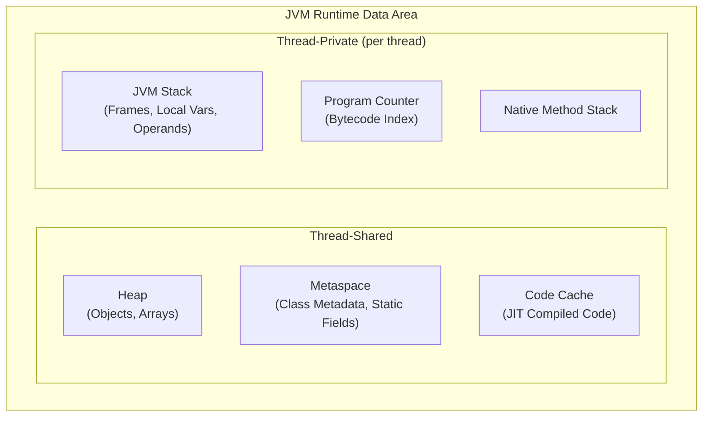

## JVM Architecture and Memory Model

Before understanding types and variables, you must understand where they live at runtime. The JVM
divides its runtime data area into several regions, each with distinct purposes and lifecycle rules.



### Stack vs Heap vs Metaspace

**JVM Stack** — Each thread has its own stack, divided into frames. Each method invocation pushes a
new frame containing local variables (including primitive values and object references) and an
operand stack. Local variables of primitive type are stored directly on the stack; reference-type
locals store a pointer to the heap. Stack memory is automatically reclaimed when a method returns.

**Heap** — All objects and arrays are allocated on the heap. This includes `String` objects, wrapper
instances (`Integer`, `Double`), and user-defined class instances. The heap is shared across all
threads and managed by the garbage collector. Heap allocations are relatively expensive compared to
stack allocations.

**Metaspace** (replaced PermGen in Java 8) — Stores class metadata (method bytecodes, field and
method definitions, constant pool entries), static fields, and runtime constant pool information.
Unlike PermGen, Metaspace uses native memory and can grow dynamically (bounded by
`-XX:MaxMetaspaceSize`).

:::info JLS Reference
[JLS §2.5](https://docs.oracle.com/javase/specs/jls/se21/html/jls-2.html#jls-2.5) defines the
runtime data areas.
[JLS §17.4](https://docs.oracle.com/javase/specs/jls/se21/html/jls-17.html#jls-17.4) specifies the
memory model, which governs how threads interact through shared memory.
:::

### Where Variables Live

```java
public class MemoryExample {
    private static long classCounter = 0;   // Metaspace (static field)

    private int instanceField;               // Heap (part of object)

    public void compute(int param) {         // param is on the caller's frame
        long local = param * 2L;             // local is on this frame's stack
        String s = "hello";                  // reference on stack; "hello" may be in String pool (heap)
        Integer boxed = local;               // reference on stack; Integer object on heap
    }
}
```

## Primitive Types

Java defines eight primitive types. They are not objects — they hold raw bit patterns and live
directly on the stack or within object layouts on the heap. Primitives have no methods, no identity
(only value equality), and cannot be `null`.

| Type      | Size (bits) | Size (bytes) | Default    | Range                          |
| --------- | ----------: | -----------: | ---------- | ------------------------------ |
| `byte`    |           8 |            1 | `0`        | -128 to 127                    |
| `short`   |          16 |            2 | `0`        | -32,768 to 32,767              |
| `int`     |          32 |            4 | `0`        | -2^31 to 2^31 - 1              |
| `long`    |          64 |            8 | `0L`       | -2^63 to 2^63 - 1              |
| `float`   |          32 |            4 | `0.0f`     | IEEE 754 binary32              |
| `double`  |          64 |            8 | `0.0`      | IEEE 754 binary64              |
| `char`    |          16 |            2 | `'\u0000'` | 0 to 65,535 (UTF-16 code unit) |
| `boolean` |           1 |            ~ | `false`    | `true` or `false`              |

:::info JLS Reference
[JLS §4.2](https://docs.oracle.com/javase/specs/jls/se21/html/jls-4.html#jls-4.2) defines primitive
types and their values.
[JLS §4.2.3](https://docs.oracle.com/javase/specs/jls/se21/html/jls-4.html#jls-4.2.3) specifies
floating-point types and IEEE 754 conformance.
:::

### Integral Types

Java's integral types are **two's complement** signed integers. The `byte`, `short`, `int`, and
`long` types use two's complement representation, meaning the most significant bit is the sign bit.
The `char` type is the only unsigned integral type — it represents a UTF-16 code unit.

```java
int maxInt = Integer.MAX_VALUE;          // 2147483647 (0x7FFFFFFF)
int minInt = Integer.MIN_VALUE;          // -2147483648 (0x80000000)

// Overflow wraps around silently (no exception)
int overflow = maxInt + 1;               // -2147483648
int underflow = minInt - 1;              // 2147483647

// Use Math.addExact etc. to detect overflow
try {
    int safe = Math.addExact(maxInt, 1); // throws ArithmeticException
} catch (ArithmeticException e) {
    // overflow detected
}
```

### IEEE 754 Floating-Point Types

`float` and `double` conform to [IEEE 754-2019](https://standards.ieee.org/ieee/754/6210/) binary
interchange format. Understanding the bit layout is essential for debugging numerical issues.

**`float` (binary32)**: 1 sign bit, 8 exponent bits (bias 127), 23 fraction bits.

**`double` (binary64)**: 1 sign bit, 11 exponent bits (bias 1023), 52 fraction bits.

```java
// Special values defined by IEEE 754
double posInf  = Double.POSITIVE_INFINITY;   // 0x7FF0000000000000
double negInf  = Double.NEGATIVE_INFINITY;   // 0xFFF0000000000000
double nan     = Double.NaN;                 // 0x7FF8000000000000

// NaN is contagious and never equals itself
System.out.println(Double.NaN == Double.NaN);  // false
System.out.println(Double.isNaN(Double.NaN));  // true

// Floating-point addition is not associative
double a = 1.0;
double b = 1.0e20;
double c = -1.0e20;
System.out.println((a + b) + c);  // 0.0
System.out.println(a + (b + c));  // 1.0

// Decimal fractions cannot be represented exactly in binary
System.out.println(0.1 + 0.2);     // 0.30000000000000004
System.out.println(0.1 + 0.2 == 0.3); // false
```

:::warning Never use `==` or `!=` to compare floating-point values. Use `Math.abs(a - b) < epsilon`
or `Double.compare(a, b)` instead. For monetary calculations, always use `BigDecimal`.
:::

```java
BigDecimal price = new BigDecimal("19.99");
BigDecimal tax = new BigDecimal("0.07");
BigDecimal total = price.multiply(price.add(BigDecimal.ONE).multiply(tax))
    .setScale(2, RoundingMode.HALF_UP);
```

### Design Decision: Why Java Has Both Primitives and Wrappers

The JVM provides primitives for **performance**. Primitive values are stored inline on the stack or
in object fields with no heap allocation, no indirection, and no object header overhead. A `double`
takes exactly 8 bytes; a `Double` object requires 16+ bytes (12-16 byte object header + 8 byte
field + padding) plus a heap pointer.

The wrappers exist for two reasons:

1. **Generics require reference types**. `List<int>` is illegal; you must write `List<Integer>`.
   This is a consequence of Java's type system — generics are implemented via **type erasure**
   ([JLS §4.6](https://docs.oracle.com/javase/specs/jls/se21/html/jls-4.html#jls-4.6)), where type
   parameters are replaced by their bounds (or `Object`) at compile time. Primitives cannot be
   substituted for `Object`.

2. **Collections and APIs designed for objects**. The Java Collections Framework (pre-generics) was
   built around `Object`, requiring boxing to store primitive values.

## Reference Types

A reference variable does not contain the object itself — it contains a **pointer** (or handle) to
an object on the heap. The JVM specification does not mandate a specific pointer representation; it
may be a direct pointer, an indirect handle, or a compressed oop (ordinary object pointer).

```java
String s = new String("hello");
// s is a reference (4 or 8 bytes on the stack)
// the actual String object is on the heap
// the char[] backing the String is also on the heap
```

Reference types include: classes, interfaces, arrays, enums, annotations, and (since Java 14
preview) records. All reference variables can be `null`, meaning they point to no object.

## Autoboxing and Unboxing

Autoboxing is the automatic conversion from a primitive type to its corresponding wrapper class.
Unboxing is the reverse. The compiler inserts calls to `Integer.valueOf()`, `Integer.intValue()`,
etc.

```java
// Explicit boxing (pre-Java 5)
Integer boxed = Integer.valueOf(42);

// Autoboxing (Java 5+)
Integer autoBoxed = 42;        // compiler inserts Integer.valueOf(42)

// Explicit unboxing
int primitive = autoBoxed.intValue();

// Autounboxing
int autoPrimitive = autoBoxed; // compiler inserts autoBoxed.intValue()
```

### The Integer Cache

`Integer.valueOf(int)` does not always create a new object. For values in the range `-128` to `127`
(inclusive), it returns a pre-allocated cached instance. This is mandated by
[JLS §5.1.7](https://docs.oracle.com/javase/specs/jls/se21/html/jls-5.html#jls-5.1.7), which
requires boxing of values in the range -128 to 127 to always produce identical objects.

```java
Integer a = 127;
Integer b = 127;
System.out.println(a == b);    // true  (cached, same object)

Integer c = 128;
Integer d = 128;
System.out.println(c == d);    // false (different objects)
System.out.println(c.equals(d)); // true  (same value)

// The cache boundary can be adjusted with -XX:AutoBoxCacheMax=<size>
```

:::warning **Always use `.equals()` to compare wrapper types.** Using `==` compares object identity,
not value. The cache makes `==` work for small values by coincidence, creating subtle bugs that only
appear in production with larger values.
:::

### Performance Implications of Autoboxing

```java
// DANGEROUS: hidden allocations in a loop
Long sum = 0L;                   // Long reference on stack
for (long i = 0; i < 1_000_000; i++) {
    sum += i;                    // unbox Long, add, autobox result -> allocates ~1M objects
}
// The above allocates approximately 1 million Long objects on the heap
// Use primitive long instead:
long primitiveSum = 0L;
for (long i = 0; i < 1_000_000; i++) {
    primitiveSum += i;           // no allocation, purely stack/register
}
```

### Design Decision: Why Autoboxing Is a Source of Bugs

Autoboxing was introduced to reduce verbosity, but it creates a false impression that primitives and
wrappers are interchangeable. They are not. The key problems are:

1. **`NullPointerException` from unboxing null**: Unboxing a `null` reference throws `NPE`, with no
   explicit null check in your source code.

```java
Integer maybeNull = null;
int value = maybeNull;  // NullPointerException — no visible dereference
```

2. **Identity confusion**: `==` compares identity for reference types but value for primitives.
   Autoboxing silently changes the semantics of `==`.

3. **Hidden performance costs**: Every autobox operation allocates a heap object (outside the cache
   range). In tight loops or performance-critical code, this creates significant GC pressure.

4. **Ambiguous overloading**: Method resolution behaves differently than expected when both
   primitive and wrapper overloads exist.

```java
void overloaded(int i)    { System.out.println("int"); }
void overloaded(Integer i) { System.out.println("Integer"); }

overloaded(42);     // prints "int"  — primitive is preferred
Integer boxed = 42;
overloaded(boxed);  // prints "Integer" — reference matches reference
```

:::danger Rule of thumb: use primitives everywhere unless you need `null` (to represent "no value")
or you are working with a generic API that requires reference types.
:::

## Strings

### Immutability

`String` objects are immutable — once created, their internal state cannot change. Every
"modification" operation creates a new `String` object.

```java
String original = "hello";
String modified = original.concat(" world");
System.out.println(original == modified);  // false — different objects
System.out.println(original);  // "hello" — unchanged
```

The `String` class is declared `final` and its internal `value` array is stored as a
`private final byte[]` (since Java 9, using compact strings encoding; prior to Java 9 it was
`char[]`).

### Design Decision: Why String Is Immutable

1. **Security**: String arguments are passed to `ClassLoader`, `FileInputStream`, `Runtime.exec()`,
   JDBC drivers, and many other sensitive APIs. Immutability prevents a caller from modifying the
   string after passing it, closing a class of security vulnerabilities.

2. **Thread safety**: Immutable objects are inherently thread-safe. No synchronization is needed
   when sharing strings across threads. This is critical because strings are the most shared data
   type in Java.

3. **Hash code caching**: The hash code of a `String` is computed lazily on first call to
   `hashCode()` and cached in a private field (`hash`). Since the string content never changes, the
   cached hash is always valid. This makes `HashMap` and `HashSet` lookups for string keys very
   efficient.

4. **String literal interning**: The JVM can safely share string literals across the entire
   application, knowing they will never be modified. This saves significant memory for applications
   that reuse common strings.

5. **Substring safety**: Prior to Java 7u6, `substring()` shared the underlying `char[]` with the
   original string, which could cause memory leaks. Immutable strings ensure that even this
   optimization was safe (the new string could not modify the shared array).

### The String Pool

The string pool (intern pool) is a special region of the heap that stores unique `String` instances.
When the JVM encounters a string literal, it checks the pool. If the string already exists, the
reference is returned; otherwise, the string is added to the pool.

```mermaid
graph LR
    subgraph String Pool ["String Pool (Heap)"]
        S1["\"hello\"<br/>0x100"]
        S2["\"world\"<br/>0x200"]
        S3["\"hello world\"<br/>0x300"]
    end

    L1["String a = \"hello\""] --> S1
    L2["String b = \"hello\""] --> S1
    L3["String c = \"world\""] --> S2
    L4["String d = a + \" \" + b"] --> S4["\"hello world\"<br/>0x400 (heap, NOT pooled)"]
    L5["String e = d.intern()"] --> S3
```

```java
// String literals are interned at class loading time
String a = "hello";
String b = "hello";
System.out.println(a == b);  // true — same object from the pool

// new String() always creates a new object on the heap
String c = new String("hello");
System.out.println(a == c);  // false — c is a different object

// intern() returns the pooled instance
String d = c.intern();
System.out.println(a == d);  // true — d points to the pooled "hello"

// Compile-time constant concatenation is interned
String e = "hel" + "lo";           // compiler folds this to "hello"
System.out.println(a == e);        // true

// Runtime concatenation is NOT interned
String part1 = "hel";
String f = part1 + "lo";           // StringBuilder is used at runtime
System.out.println(a == f);        // false
System.out.println(a.equals(f));   // true
```

:::info JLS Reference
[JLS §3.10.5](https://docs.oracle.com/javase/specs/jls/se21/html/jls-3.html#jls-3.10.5) defines
string literals.
[JLS §5.1.7](https://docs.oracle.com/javase/specs/jls/se21/html/jls-5.html#jls-5.1.7) specifies
boxing conversion, including the requirement that strings computed from constant expressions are
interned.
:::

### Design Decision: Why the String Pool Exists

The string pool exists to **reduce memory consumption** and **enable fast equality comparison via
reference identity**. In a typical Java application, string literals (class names, method names,
field names, string constants) make up a significant portion of the heap. Without the pool, every
occurrence of `"http"` across thousands of HTTP requests would allocate a separate object.

The pool also enables the `==` comparison for interned strings, which is an O(1) pointer comparison
versus O(n) character-by-character comparison for `String.equals()`. The JVM uses this internally —
class names, method descriptors, and string constants in the constant pool are all deduplicated via
interning.

### StringBuilder vs StringBuffer

| Aspect      |  `StringBuilder` (Java 5+)  |     `StringBuffer` (Java 1.0+)     |
| ----------- | :-------------------------: | :--------------------------------: |
| Thread-safe |             No              |  Yes (all methods `synchronized`)  |
| Performance | Faster (no synchronization) | Slower (lock acquisition overhead) |
| API         |   Same as `StringBuffer`    |      Same as `StringBuilder`       |

```java
// Prefer StringBuilder in single-threaded contexts
StringBuilder sb = new StringBuilder(64);  // specify initial capacity when known
sb.append("Hello").append(", ").append("World");
String result = sb.toString();

// StringBuffer is only needed when the same buffer is shared across threads
// (which is rare — typically you'd use a local variable)
```

:::warning **Never use `StringBuffer` in new code** unless you have a specific requirement for
thread-safe mutable string building (which is almost never). The synchronization overhead is
unnecessary in the vast majority of use cases, and `StringBuffer` is essentially a legacy class
retained for backward compatibility.
:::

## Arrays

### Array Basics

Arrays are objects in Java. They have a `length` field, can be `null`, and are allocated on the
heap. However, unlike regular objects, their structure is defined by the JVM specification, not by a
class file.

```java
int[] primitives = new int[10];       // zero-initialized: [0, 0, 0, ...]
String[] references = new String[5];  // null-initialized: [null, null, ...]

// Array initialization
int[] fib = {0, 1, 1, 2, 3, 5, 8, 13};

// Multidimensional arrays (arrays of arrays)
int[][] matrix = new int[3][4];       // 3 rows, 4 columns
int[][] jagged = {{1}, {1, 2}, {1, 2, 3}};  // jagged array
```

### Covariance

Java arrays are **covariant**: an array of a supertype reference can hold an array of a subtype
reference. This is a deliberate design decision (made for genericity before generics existed) but it
creates a type-safety hole.

```java
// Covariance allows this assignment
Number[] numbers = new Integer[10];    // compiles fine

// But the runtime checks will catch misuse
numbers[0] = 3.14;                     // ArrayStoreException at runtime!
// The compile-time type says "Number", but the runtime type says "Integer[]"
```

:::danger Array covariance breaks type safety. The JVM inserts an **array store check** at runtime
on every assignment to an array element to prevent type corruption. This check has a small but real
performance cost. Generic collections (`List<Integer>`) are **invariant**, which is type-safe at
compile time and requires no runtime checks.
:::

### Arrays vs ArrayList

| Aspect           | `int[]`                                     | `ArrayList<Integer>`                          |
| ---------------- | ------------------------------------------- | --------------------------------------------- |
| Element type     | Primitives or references                    | References only (boxing required)             |
| Size             | Fixed at creation                           | Dynamic (resizes internally)                  |
| Type safety      | Covariant (runtime checks)                  | Invariant (compile-time safe)                 |
| Memory overhead  | Minimal (object header + N \* element_size) | Object header + internal array + extra fields |
| Null elements    | For reference arrays only                   | Allowed                                       |
| Length query     | `array.length` (field)                      | `list.size()` (method call)                   |
| Generics support | Cannot use as generic type                  | Full generics support                         |

```java
// Primitive array — no boxing, cache-friendly, minimal overhead
int[] primitiveArray = {1, 2, 3, 4, 5};
int sum = 0;
for (int value : primitiveArray) {
    sum += value;  // no unboxing
}

// ArrayList requires boxing — each element is a heap object
ArrayList<Integer> boxed = new ArrayList<>();
boxed.add(1);  // autoboxing: Integer.valueOf(1)
boxed.add(2);  // autoboxing: Integer.valueOf(2)
```

## The `var` Keyword (Local Variable Type Inference)

Introduced in Java 10 ([JEP 286](https://openjdk.org/jeps/286)), `var` enables the compiler to infer
the type of local variables from the initializer. It does **not** make Java dynamically typed — the
inferred type is a concrete, compile-time type, and the variable cannot be reassigned to an
incompatible type.

```java
// Clear and beneficial uses of var
var list = new ArrayList<String>();    // inferred: ArrayList<String>
var stream = list.stream();            // inferred: Stream<String>
var entry = map.entrySet().iterator().next();  // inferred: Map.Entry<K,V>

// These are equivalent
var name = "Alice";       // inferred: String
String name2 = "Alice";   // explicit: String

// The inferred type is determined by the right-hand side
var number = 42;          // inferred: int (NOT long, NOT Integer)
var boxed = (Integer) 42; // inferred: Integer

// var cannot be used without an initializer
// var x;                  // compile error: cannot use 'var' on variable without initializer

// var cannot be used for fields, method parameters, or return types
// var is strictly for local variables with initializers
```

:::warning Do not use `var` when the type is not obvious from the right-hand side. The goal is
readability, not brevity. Prefer explicit types when the initializer is complex, when the type
carries important semantic information, or when the inferred type might be surprising.
:::

## Type Promotion and Casting

### Implicit Type Promotion (Widening)

When an operation involves two operands of different numeric types, the smaller type is **widened**
to the larger type. The widening conversion rules are defined in
[JLS §5.1.2](https://docs.oracle.com/javase/specs/jls/se21/html/jls-5.html#jls-5.1.2).

The widening promotion order is:

```
byte -> short -> int -> long -> float -> double
                ^
                |
               char
```

```java
int i = 42;
double d = i;              // int -> double (widening, no data loss)

long big = 1_000_000L;
float f = big;             // long -> float (widening, but may lose precision!)

// Binary numeric promotion
byte b = 10;
short s = 20;
// byte + short -> int + int -> int
int result = b + s;        // both promoted to int before addition

// char + int -> int + int -> int
char c = 'A';
int code = c + 1;          // code = 66
```

:::warning **Surprising widening**: `long` to `float` is a widening conversion per the JLS, but a
64-bit `long` has more precision than a 32-bit `float` (which has only 23 fraction bits). A large
`long` value will lose low-order bits when converted to `float`. This is technically legal but often
surprising.
:::

### Explicit Casting (Narrowing)

Narrowing conversions (e.g., `long` to `int`, `double` to `float`) may lose information and require
an explicit cast. The compiler enforces this to prevent accidental data loss.

```java
double pi = 3.14159;
int truncated = (int) pi;       // 3 — fractional part is discarded (not rounded)
int rounded = (int) Math.round(pi);  // 3 — use Math.round for actual rounding

long bigValue = 300_000_000_000L;
int narrowed = (int) bigValue;   // -647710720 — overflow, bits are truncated

// char is an unsigned 16-bit integer — you can cast between char and numeric types
char letter = 'A';
int letterCode = (int) letter;   // 65
char fromCode = (char) 66;       // 'B'
```

### Special Cases

```java
// Compound assignment operators include implicit narrowing
byte b = 1;
b += 1;    // equivalent to b = (byte)(b + 1); — the cast is implicit
// b = b + 1;  // compile error: b + 1 is int, cannot assign int to byte without cast

// Literal assignment to smaller types is allowed if the value fits
byte b2 = 127;     // OK — 127 fits in a byte
// byte b3 = 128;  // compile error — 128 does not fit in a byte
```

## The `final` Keyword

The `final` keyword restricts reassignment (for variables), overriding (for methods), and
subclassing (for classes). It does **not** make objects immutable — only the reference is immutable.

```java
// final local variable — cannot be reassigned after initialization
final int x = 10;
// x = 20;  // compile error: cannot assign a value to final variable x

// final reference — the reference cannot change, but the object can be mutated
final List<String> list = new ArrayList<>();
list.add("hello");       // OK — mutating the object
// list = new ArrayList<>();  // compile error — reassigning the reference

// blank final — initialized exactly once (in constructor or initializer block)
class Point {
    final int x;
    final int y;

    Point(int x, int y) {
        this.x = x;  // single assignment
        this.y = y;  // single assignment
    }
}

// final method — cannot be overridden by subclasses
class Base {
    final void validate() { /* ... */ }
}

// final class — cannot be extended
final class Configuration {
    // prevents subclassing, ensures the class's contract cannot be weakened
}
```

### Effectively Final

A variable is **effectively final** if it is never reassigned after initialization. The compiler
treats effectively final variables the same as explicitly `final` variables for the purpose of
lambda capture and anonymous class access.

```java
String captured = "hello";  // effectively final — never reassigned
Runnable r = () -> System.out.println(captured);  // OK — lambda captures effectively final var

// String notFinal = "hello";
// notFinal = "world";
// Runnable r2 = () -> System.out.println(notFinal);  // compile error — not effectively final
```

## `instanceof` Pattern Matching (Java 16+)

Pattern matching for `instanceof` ([JEP 394](https://openjdk.org/jeps/394), standardized in Java 16)
combines the type test, cast, and variable declaration into a single expression.

```java
// Before Java 16
if (obj instanceof String) {
    String s = (String) obj;
    System.out.println(s.length());
}

// Java 16+ — pattern matching
if (obj instanceof String s) {
    System.out.println(s.length());
    // s is in scope here — already cast and available
}

// s is NOT in scope here — the pattern variable is scoped to the true branch

// Pattern matching with conditions
if (obj instanceof String s && s.length() > 5) {
    System.out.println(s.toUpperCase());
}

// The pattern variable is in scope for the entire condition when
// the pattern match is guaranteed by short-circuit evaluation
if (obj instanceof String s && !s.isEmpty()) {
    // s is available here
}
```

:::info The scope rules for pattern variables are defined by the "conditional AND" short-circuit
semantics. If `obj instanceof String s` is `false`, the right side of `&&` is never evaluated, so
`s` cannot be used unsafely. The compiler verifies this using a concept called "flow analysis."
:::

## Records (Java 14+)

Records ([JEP 395](https://openjdk.org/jeps/395), standardized in Java 16) provide a compact syntax
for declaring classes that are transparent carriers of immutable data.

```java
public record Point(int x, int y) {}

// The compiler generates:
// - A final class with the given name
// - private final fields for each component
// - A public constructor with parameters matching the components
// - public accessor methods: x() and y() (NOT getX()/getY())
// - equals(), hashCode(), and toString() implementations
// - Implements java.lang.Record
```

```java
record Point(int x, int y) {
    // Compact constructor — validation without repeating field declarations
    public Point {
        if (x < 0 || y < 0) {
            throw new IllegalArgumentException("Coordinates must be non-negative");
        }
    }
}

// Usage
var p = new Point(3, 4);
System.out.println(p.x());        // 3 — accessor method, not field access
System.out.println(p);             // Point[x=3, y=4]

// Records are inherently immutable
// p.x(5);  // no setter exists

// Records provide value-based equality
var p2 = new Point(3, 4);
System.out.println(p.equals(p2));  // true — structural equality
System.out.println(p == p2);       // false — different objects

// Records can implement interfaces
record NamedPoint(int x, int y, String name) implements Comparable<NamedPoint> {
    @Override
    public int compareTo(NamedPoint other) {
        return this.name.compareTo(other.name);
    }
}
```

:::warning Records cannot extend other classes (they implicitly extend `java.lang.Record`). Their
fields are always `final`. Records are best suited for data carriers where immutability and
structural equality are desired. They are not a replacement for mutable domain objects or entities.
:::

## Sealed Classes (Java 17+)

Sealed classes ([JEP 409](https://openjdk.org/jeps/409), standardized in Java 17) restrict which
classes can extend or implement a given type. This enables the compiler to perform exhaustive
pattern matching over a closed type hierarchy.

```java
// sealed class — specifies exactly which subclasses are permitted
public sealed interface Shape
    permits Circle, Rectangle, Triangle {
    double area();
}

// Each permitted subclass must use one of: final, sealed, non-sealed
public final record Circle(double radius) implements Shape {
    public double area() { return Math.PI * radius * radius; }
}

public sealed record Rectangle(double width, double height) implements Shape
    permits FilledRectangle {
    public double area() { return width * height; }
}

public final record FilledRectangle(double width, double height, int color)
    extends Rectangle implements Shape {
    public double area() { return width * height; }
}

public non-sealed record Triangle(double base, double height) implements Shape {
    public double area() { return 0.5 * base * height; }
}
```

### Exhaustive Pattern Matching

Sealed classes shine when combined with pattern matching in `switch`:

```java
// Java 21+ — exhaustive switch with sealed class hierarchy
double computeArea(Shape shape) {
    return switch (shape) {
        case Circle c -> c.area();
        case Rectangle r -> r.area();
        case Triangle t -> t.area();
        // No default needed — the compiler knows all permitted subtypes
    };
}

// With pattern matching and guards (Java 21+)
String describe(Shape shape) {
    return switch (shape) {
        case Circle c when c.radius() > 10 -> "large circle";
        case Circle c -> "small circle";
        case Rectangle r -> "rectangle " + r.width() + "x" + r.height();
        case Triangle t -> "triangle";
    };
}
```

The three subclass modifiers enforce a clear contract:

- **`final`**: No further subclassing. The hierarchy terminates here.
- **`sealed`**: Further subclassing is allowed but restricted to a new `permits` list.
- **`non-sealed`**: The class reopens to unrestricted inheritance. The sealed hierarchy ends.

## Value Types (Preview)

Value types are a preview feature ([JEP 401](https://openjdk.org/jeps/401)) designed to combine the
performance characteristics of primitives with the abstraction capabilities of classes. They are
part of the Valhalla project.

### The Problem Value Types Solve

Consider the performance gap between primitives and objects:

```java
// Primitive — 8 bytes, no allocation, inline storage
double x = 3.14;

// Object — 16+ bytes header, 8 bytes field, heap allocation, indirection
ComplexNumber c = new ComplexNumber(3.14, 2.72);
// To get the real part: load reference -> load field -> (cache miss possible)
```

Arrays and generics with reference types incur pointer overhead, cache misses, and GC pressure.
Value types aim to provide user-defined types with the flat, inline layout of primitives.

### Value Type Semantics (Preview)

```java
// Value type declaration (syntax subject to change)
value class ComplexNumber {
    final double real;
    final double imag;

    ComplexNumber(double real, double imag) {
        this.real = real;
        this.imag = imag;
    }
}

// Unlike regular classes, value types:
// 1. Have no identity — two instances with the same fields are indistinguishable
// 2. Are stored inline (flat) in arrays and objects — no pointer indirection
// 3. Cannot be synchronized on (no monitor)
// 4. Cannot have mutable fields (or identity would be observable)
// 5. Cannot be used as lock objects

// Array of value types — flat layout, no per-element object headers
ComplexNumber[] points = new ComplexNumber[1000];
// Memory layout: [real0, imag0, real1, imag1, ...] — 16 bytes per element
// vs. reference array: [ptr0, ptr1, ...] + 1000 separate heap objects
```

:::info Value types are still a preview feature and the syntax is evolving. As of Java 23, the
feature is available behind `--enable-preview`. The exact syntax and semantics may change in future
releases. The core idea remains: providing user-defined types with inline layout and value-based
equality, eliminating the performance penalty of object identity.
:::

### Identity vs Value Semantics

```java
// Identity semantics (regular objects)
Integer a = new Integer(42);  // (deprecated constructor, illustrative)
Integer b = new Integer(42);
System.out.println(a == b);      // false — different objects, different identity
System.out.println(a.equals(b)); // true — same value

// Value semantics (primitives)
int x = 42;
int y = 42;
System.out.println(x == y);      // true — value comparison, no identity

// Value types will behave like primitives:
// ComplexNumber p1 = new ComplexNumber(3.0, 4.0);
// ComplexNumber p2 = new ComplexNumber(3.0, 4.0);
// p1 == p2  // true — value-based comparison
```

## Summary of Design Principles

The Java type system reflects a series of deliberate tradeoffs:

1. **Primitives exist for performance**. They provide zero-overhead, stack-allocable, cache-friendly
   values. The cost is that they cannot participate in generics or be `null`.

2. **Wrappers bridge the gap**. They enable primitives to work with object-oriented APIs (generics,
   collections) at the cost of allocation and indirection. Autoboxing makes this syntactically
   convenient but hides the cost and creates subtle bugs.

3. **String immutability trades mutability for safety**. The inability to modify strings eliminates
   entire categories of bugs (shared mutable state, security vulnerabilities) and enables critical
   optimizations (hash caching, interning, substring sharing).

4. **The string pool trades per-instance uniqueness for memory efficiency**. By deduplicating
   identical strings, the JVM reduces heap usage for one of the most common data types in Java
   applications.

5. **Type safety is enforced at different levels**. Generics enforce compile-time type safety; array
   covariance enforces runtime type safety via store checks. The trend in Java's evolution (records,
   sealed classes, pattern matching) is toward **moving more safety guarantees to compile time**.

6. **Value types aim to unify** the performance of primitives with the abstraction of classes,
   closing a gap that has existed since Java 1.0. They represent the most significant change to
   Java's type system since generics.
