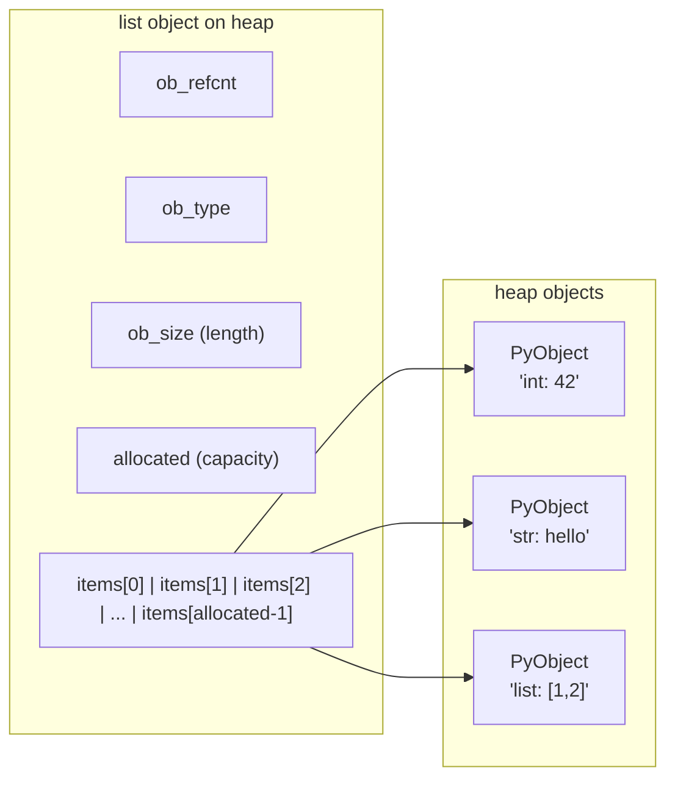
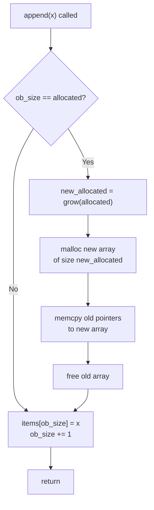
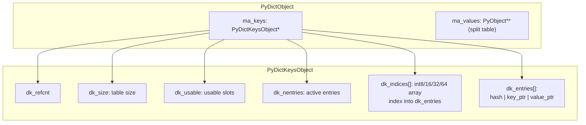
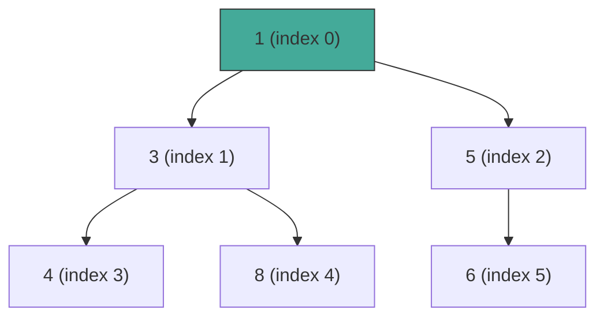
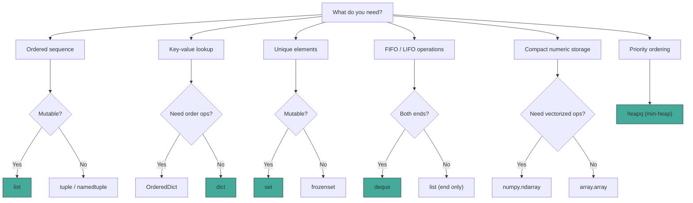

## Lists

Python lists are **ordered, mutable sequences** of arbitrary objects. They are the most frequently
used built-in container and serve as the default sequence type for most tasks.

### Internal Representation: Dynamic Arrays

CPython implements `list` as a **contiguous array of pointers** (specifically, a C array of
`PyObject*`). This is a critical design decision with direct consequences for performance
characteristics.



Each `items[i]` slot is a pointer to a heap-allocated `PyObject`. The list itself does not store the
objects inline -- it stores references. This means:

1. A list of three integers occupies three pointer slots (24 bytes on 64-bit) plus three separate
   heap allocations for the integer objects.
2. Appending to a list never copies the contained objects. Only pointers are moved.
3. A single object can appear in multiple lists simultaneously without duplication.

### Growth Strategy and Amortized O(1) Append

When `list.append()` runs and the internal array is full, CPython must allocate a new, larger array
and copy all existing pointers into it. The growth strategy determines how much larger the new array
is.



The growth formula (from CPython source, `Objects/listobject.c`) is:

```
new_allocated = (newsize >> 3) + (newsize < 9 ? 3 : 6)
```

Roughly, this means the new capacity is approximately `newsize + newsize/8 + 6`. This is a
**geometric growth** factor of about 1.125x (9/8), which is deliberately smaller than the 2x factor
used by many other languages. The Python developers chose this because:

- Lists are frequently used for temporary accumulations where the final size is not much larger than
  the initial size. A 2x factor wastes more memory in these cases.
- The smaller factor still guarantees amortized O(1) append.

**Amortized analysis.** Consider n appends to an initially empty list. A resize occurs when the list
hits sizes that trigger reallocation. The total number of pointer copies across all resizes is
bounded by a geometric series that converges to O(n). Therefore, the average cost per append is
O(1), even though any single append may cost O(n).

```python
import sys

lst = []
print(sys.getsizeof(lst))  # 56 bytes (empty list)

for i in range(10):
    lst.append(i)
    print(f"len={len(lst)}, sizeof={sys.getsizeof(lst)}")

# Output pattern on 64-bit CPython:
# len=0,  sizeof=56   (empty, 0 slots)
# len=1,  sizeof=88   (4 slots allocated)
# len=2,  sizeof=88   (4 slots)
# len=3,  sizeof=88   (4 slots)
# len=4,  sizeof=88   (4 slots, now full)
# len=5,  sizeof=120  (8 slots allocated -- grew)
# len=6,  sizeof=120  (8 slots)
# len=7,  sizeof=120  (8 slots)
# len=8,  sizeof=120  (8 slots, now full)
# len=9,  sizeof=184  (16 slots allocated -- grew)
# len=10, sizeof=184  (16 slots)
```

### Time Complexity of List Operations

| Operation              | Average Case | Worst Case | Notes                                   |
| ---------------------- | :----------: | :--------: | --------------------------------------- |
| `append(x)`            | O(1) amort.  |    O(n)    | Resize when capacity reached            |
| `pop()` (from end)     |     O(1)     |    O(1)    |                                         |
| `pop(i)` (from middle) |     O(n)     |    O(n)    | Shifts all elements after index i       |
| `insert(i, x)`         |     O(n)     |    O(n)    | Shifts all elements from index i onward |
| `del lst[i]`           |     O(n)     |    O(n)    | Same as pop from middle                 |
| `lst[i]`               |     O(1)     |    O(1)    | Direct pointer dereference              |
| `x in lst`             |     O(n)     |    O(n)    | Linear scan                             |
| `lst1 + lst2`          |    O(n+m)    |   O(n+m)   | Creates new list, copies all pointers   |
| `lst * n`              |   O(n\*k)    |  O(n\*k)   |                                         |
| `lst.sort()`           |  O(n log n)  | O(n log n) | Timsort                                 |
| `len(lst)`             |     O(1)     |    O(1)    | Stored in `ob_size`                     |
| `lst.clear()`          |     O(1)     |    O(1)    | Drops references, does not shrink array |

### List Methods

```python
lst = [3, 1, 4, 1, 5, 9]

# Mutation
lst.append(2)        # [3, 1, 4, 1, 5, 9, 2]
lst.extend([6, 5])   # [3, 1, 4, 1, 5, 9, 2, 6, 5]
lst.insert(0, 99)    # [99, 3, 1, 4, 1, 5, 9, 2, 6, 5]
lst.pop()            # 5, lst = [99, 3, 1, 4, 1, 5, 9, 2, 6]
lst.pop(0)           # 99, lst = [3, 1, 4, 1, 5, 9, 2, 6]
lst.remove(1)        # removes first 1, lst = [3, 4, 1, 5, 9, 2, 6]
lst.reverse()        # [6, 2, 9, 5, 1, 4, 3]
lst.sort()           # [1, 2, 3, 4, 5, 6, 9]
lst.clear()          # []

# Non-mutating
lst = [3, 1, 4, 1, 5]
lst.index(4)         # 2
lst.count(1)         # 2
lst.copy()           # shallow copy [3, 1, 4, 1, 5]
```

### Slicing

Slicing creates a **new list** containing copies of the pointer slots in the specified range. It
does not copy the referenced objects.

```python
lst = [0, 1, 2, 3, 4, 5, 6, 7, 8, 9]

# lst[start:stop:step]
lst[2:5]       # [2, 3, 4]
lst[:3]        # [0, 1, 2]
lst[7:]        # [7, 8, 9]
lst[::2]       # [0, 2, 4, 6, 8]
lst[::-1]      # [9, 8, 7, 6, 5, 4, 3, 2, 1, 0]
lst[1::2]      # [1, 3, 5, 7, 9]
lst[-3:]       # [7, 8, 9]
lst[-5:-2]     # [5, 6, 7]

# Slice assignment (modifies in place)
lst[2:5] = [20, 30, 40]  # [0, 1, 20, 30, 40, 5, 6, 7, 8, 9]
lst[1:1] = [10, 11]      # insert without replacing: [0, 10, 11, 1, 20, ...]
del lst[2:4]              # delete slice
```

Slicing has O(k) time complexity where k is the size of the slice. The step parameter is handled
internally by a loop that strides through the source array, so `lst[::2]` is O(n/2) = O(n).

### List Comprehensions

List comprehensions are both more concise and faster than equivalent `for` loops because they run at
C speed inside the CPython interpreter loop.

```python
# List comprehension
squares = [x**2 for x in range(10)]

# Equivalent for loop (slower -- Python bytecode per iteration)
squares = []
for x in range(10):
    squares.append(x**2)

# With condition
even_squares = [x**2 for x in range(10) if x % 2 == 0]

# Nested (flattening a matrix)
matrix = [[1, 2, 3], [4, 5, 6], [7, 8, 9]]
flat = [x for row in matrix for x in row]  # [1, 2, 3, 4, 5, 6, 7, 8, 9]
```

:::tip

Avoid using list comprehensions with side effects. They are for building lists, not for executing
actions. If the comprehension has no useful result, use a `for` loop instead.

:::

## Tuples

Tuples are **ordered, immutable sequences**. The immutability is their defining characteristic and
the source of their advantages.

### Immutability Mechanics

"Immutable" in Python means that the tuple's container (the array of pointers) cannot be modified
after creation. The pointers themselves cannot be added, removed, or reordered. However, if a
pointer refers to a mutable object (like a list), that inner object can still be mutated.

```python
t = (1, [2, 3], 4)
t[1].append(99)
print(t)  # (1, [2, 3, 99]) -- the tuple itself is unchanged, but the list inside it mutated
```

This is a consequence of Python's reference-based object model. Immutability applies to the
container, not to the referenced objects.

### Why Tuples Exist

1. **Hashability.** A tuple is hashable if all its elements are hashable. This makes tuples valid
   dictionary keys and set members. Lists cannot serve this purpose.
2. **Structural integrity.** When you pass a tuple to a function, the callee cannot modify its
   length or reassign its slots. This is a lightweight form of defensive programming.
3. **Performance.** Tuples have a smaller memory footprint than lists of the same length because
   they do not need to track over-allocation capacity. CPython also optimizes tuple creation for
   small tuples.

```python
import sys

print(sys.getsizeof((1, 2, 3)))   # 64 bytes
print(sys.getsizeof([1, 2, 3]))   # 88 bytes (includes over-allocation)
```

### Named Tuples

`collections.namedtuple` (and the modern `typing.NamedTuple`) provides tuples with named fields,
combining the immutability and lightweight footprint of tuples with the readability of attribute
access.

```python
from collections import namedtuple

Point = namedtuple("Point", ["x", "y"])
p = Point(3, 4)

print(p.x)           # 3
print(p.y)           # 4
print(p[0])          # 3 (index access still works)
print(p._asdict())   # {'x': 3, 'y': 4}
print(p._replace(x=10))  # Point(x=10, y=4) -- returns new tuple

# Typed version (preferred for new code)
from typing import NamedTuple

class Point(NamedTuple):
    x: float
    y: float
    def distance_to(self, other: "Point") -> float:
        return ((self.x - other.x)**2 + (self.y - other.y)**2) ** 0.5
```

### Structural Typing with Tuples

Tuples are the idiomatic Python representation for heterogeneous, fixed-length data -- records where
the position carries meaning. This is structural typing: the "shape" of the tuple (what types appear
at which positions) defines a type, without requiring a named class.

```python
# A common pattern: returning multiple values
def minmax(seq):
    return (min(seq), max(seq))

lo, hi = minmax([3, 1, 4, 1, 5, 9])

# Database rows as tuples
row = ("Alice", 30, "alice@example.com")
name, age, email = row  # unpacking
```

## Dictionaries

Dictionaries are Python's **mapping type** -- mutable, unordered (until Python 3.7 where insertion
order became guaranteed by the language spec), key-value pairs with O(1) average-case lookup.

### Hash Table Internals

CPython's `dict` is implemented as a **hash table using open addressing with linear probing**.
Understanding this implementation explains many behaviors that appear surprising.



The structure has two main parts:

1. **Indices array** (`dk_indices`): A compact array of signed integers that maps hash table
   positions to entry positions. The size of each integer is chosen based on the table size (int8
   for tables < 256, int16 for < 65536, int32 for < 2^31, int64 otherwise) to minimize memory usage.
2. **Entries array** (`dk_entries`): A dense array of `(hash, key, value)` triples. Only
   actually-used entries occupy space in this array -- it does not have empty slots.

This split design (compact indices + dense entries) was introduced in Python 3.6 (PEP 412) and
provides two major benefits:

- **Memory efficiency.** Small dictionaries use far less memory than the previous combined-table
  design because empty slots in the hash table are represented by sentinel bytes in the indices
  array rather than by empty `PyDictKeyEntry` structs.
- **Insertion order preservation.** Since entries are appended to the dense array in insertion
  order, iterating over `dk_entries` yields keys in the order they were inserted.

### Hashing and Collision Resolution

When you look up `d[key]`, CPython performs these steps:

1. Compute `hash(key)` -- calls the key's `__hash__` method.
2. Map the hash to a table position: `i = hash & (dk_size - 1)` (bitwise AND because the table size
   is always a power of 2).
3. Check `dk_indices[i]`. If it is `DKIX_EMPTY` (-1), the key is not in the dict. Done.
4. If it contains an index `idx`, look up `dk_entries[idx]`. Compare the stored hash with the
   computed hash (cheap integer comparison). If they differ, the slot is occupied by a different key
   -- go to step 5.
5. If the hashes match, compare the actual keys with `key == dk_entries[idx].key`. If they match,
   return the value. If not, go to step 6.
6. **Linear probing:** Check position `i+1`, `i+2`, etc. (wrapping around) until finding
   `DKIX_EMPTY` (not found) or a matching entry.

```python
# Demonstrating hash collisions and their resolution
# These two objects have different values but the same hash modulo table size
import sys

d = {}
for i in range(20):
    d[f"key_{i}"] = i

# Internal table size is 32 (next power of 2 above 20)
# Multiple keys may map to the same initial slot, resolved by linear probing
```

:::warning

If two objects have equal values (`a == b` is `True`), they **must** have the same hash
(`hash(a) == hash(b)`). If you define `__eq__` on a class, you must also define `__hash__`, or set
`__hash__ = None` to make the object unhashable (the default when `__eq__` is defined without
`__hash__` in Python 3).

:::

### Hash Table Resizing

The hash table maintains two thresholds:

- **2/3 full.** When `dk_nentries / dk_size > 2/3`, the table is resized. A new table of 2x or 4x
  the size is allocated, and all entries are reinserted. This is expensive (O(n)) but occurs
  infrequently due to geometric growth.
- **1/12 used.** When the table is mostly empty after deletions, it is shrunk to reduce memory
  usage.

### Time Complexity

| Operation        | Average Case | Worst Case | Notes                        |
| ---------------- | :----------: | :--------: | ---------------------------- |
| `d[key]`         |     O(1)     |    O(n)    | Worst case: all keys collide |
| `d[key] = value` |     O(1)     |    O(n)    | Includes possible resize     |
| `del d[key]`     |     O(1)     |    O(n)    |                              |
| `key in d`       |     O(1)     |    O(n)    |                              |
| `d.get(key)`     |     O(1)     |    O(n)    |                              |
| `len(d)`         |     O(1)     |    O(1)    | Stored in `ma_used`          |
| Iteration        |     O(n)     |    O(n)    | Visits every entry           |

The O(n) worst case occurs when all keys hash to the same slot, creating a single long probe chain.
This is rare with a good hash function but can be deliberately triggered by an attacker feeding
crafted keys to a server (hash DoS attack). Python 3.4+ randomizes the hash seed per process to
mitigate this.

### Dict Views

The `.keys()`, `.values()`, and `.items()` methods return **view objects** -- lightweight wrappers
that reflect the current state of the dictionary without copying data.

```python
d = {"a": 1, "b": 2, "c": 3}

keys = d.keys()
values = d.values()
items = d.items()

print("a" in keys)    # True (O(1) -- checks the dict, not the view)
print((1,) in values) # True (Python 3.10+)
print(("b", 2) in items)  # True

# Views reflect mutations
d["d"] = 4
print("d" in keys)    # True

# Set operations on keys/items views
d2 = {"b": 20, "e": 5}
print(keys & d2.keys())     # {'b'} -- intersection
print(keys | d2.keys())     # {'a', 'b', 'c', 'd', 'e'} -- union
print(keys - d2.keys())     # {'a', 'c', 'd'} -- difference
```

### Dict Comprehensions

```python
# Basic
squares = {x: x**2 for x in range(6)}
# {0: 0, 1: 1, 2: 4, 3: 9, 4: 16, 5: 25}

# With condition
even_squares = {x: x**2 for x in range(10) if x % 2 == 0}

# Inverting a dictionary
original = {"a": 1, "b": 2, "c": 3}
inverted = {v: k for k, v in original.items()}

# Flattening nested dicts
nested = {"a": {"x": 1}, "b": {"y": 2}}
flat = {f"{k}.{ik}": v for k, inner in nested.items() for ik, v in inner.items()}
```

### OrderedDict vs dict

Since Python 3.7, the language specification guarantees that built-in `dict` preserves insertion
order. `collections.OrderedDict` still exists because it provides additional functionality:

```python
from collections import OrderedDict

# OrderedDict-specific methods
od = OrderedDict([("a", 1), ("b", 2), ("c", 3)])

od.move_to_end("a")       # OrderedDict([('b', 2), ('c', 3), ('a', 1)])
od.move_to_end("a", last=False)  # OrderedDict([('a', 1), ('b', 2), ('c', 3)])

od.popitem(last=True)     # ('c', 3) -- removes and returns last
od.popitem(last=False)    # ('a', 1) -- removes and returns first

# Equality is order-sensitive for OrderedDict, order-insensitive for dict
od1 = OrderedDict([("a", 1), ("b", 2)])
od2 = OrderedDict([("b", 2), ("a", 1)])
print(od1 == od2)  # False (different insertion order)

d1 = {"a": 1, "b": 2}
d2 = {"b": 2, "a": 1}
print(d1 == d2)    # True (order does not matter)
```

:::info

Use plain `dict` unless you need `move_to_end` or `popitem(last=False)`. `dict` is slightly more
memory-efficient and faster for most operations.

:::

## Sets

Sets are **unordered collections of unique, hashable elements**. Internally, they use the same hash
table implementation as dictionaries, but each entry stores only a key (no value).

### Hash Set Internals

A `set` in CPython is essentially a `dict` without values. It uses the same `PySetObject` structure,
which contains:

- A hash table (indices array + entries array)
- Each entry stores only a `(hash, key)` pair instead of `(hash, key, value)`

The same collision resolution (open addressing with linear probing), resizing strategy (2/3 load
factor), and hash randomization apply.

```python
# Demonstrating set behavior
s = {3, 1, 4, 1, 5}  # {1, 3, 4, 5} -- duplicates removed

# O(1) membership test (vs O(n) for lists)
large_set = set(range(100000))
print(99999 in large_set)   # O(1)
print(99999 in list(range(100000)))  # O(n) -- much slower
```

### Set Operations

```python
a = {1, 2, 3, 4}
b = {3, 4, 5, 6}

a | b    # {1, 2, 3, 4, 5, 6} -- union
a & b    # {3, 4} -- intersection
a - b    # {1, 2} -- difference
a ^ b    # {1, 2, 5, 6} -- symmetric difference
a <= b   # False -- subset
a >= b   # False -- superset
a < b    # False -- proper subset

# In-place variants (mutate the left operand)
c = a.copy()
c |= b   # c is now {1, 2, 3, 4, 5, 6}
c &= b   # c is now {3, 4}
c -= b   # c is now set()
```

All set operations are O(len(a) + len(b)) for the basic cases, or O(len(a)) for the in-place
variants where the right operand can be iterated efficiently.

### frozenset

`frozenset` is an immutable version of `set`. Because it is immutable, it is hashable and can be
used as a dictionary key or as an element of another set.

```python
fs = frozenset([1, 2, 3])

# Can be used as dict keys
mapping = {frozenset([1, 2]): "first", frozenset([3, 4]): "second"}
print(mapping[frozenset([1, 2])])  # "first"

# Can be elements of other sets
set_of_sets = {frozenset([1, 2]), frozenset([2, 3]), frozenset([1, 3])}

# All set operations work (returning frozenset)
a = frozenset([1, 2, 3])
b = frozenset([2, 3, 4])
print(a & b)  # frozenset({2, 3})
```

### Set Comprehensions

```python
# Basic
squares_under_50 = {x**2 for x in range(8)}
# {0, 1, 4, 9, 16, 25, 36, 49}

# Extracting unique elements
words = ["the", "quick", "brown", "the", "fox"]
unique_lengths = {len(w) for w in words}
# {3, 5} -- 'the' is 3, 'quick' is 5, 'brown' is 5, 'fox' is 3

# Set comprehension for filtering
text = "hello world hello python"
unique_words = {word for word in text.split()}
# {'hello', 'world', 'python'}
```

## The `collections` Module

The `collections` module provides specialized container datatypes that supplement the built-in
types.

### Counter

`Counter` is a `dict` subclass for counting hashable objects. It maps elements to their counts and
provides methods for common multiset operations.

```python
from collections import Counter

# Counting from an iterable
c = Counter("abracadabra")
print(c)  # Counter({'a': 5, 'b': 2, 'r': 2, 'c': 1, 'd': 1})

# Counting with a mapping
c = Counter({"a": 3, "b": 1})

# Updating counts
c.update("aabbb")
c["a"] += 1

# Most common elements
print(c.most_common(2))  # [('a', 5), ('b', 3)]

# Arithmetic on counters (multiset operations)
c1 = Counter(a=3, b=1)
c2 = Counter(a=1, b=2)
print(c1 + c2)   # Counter({'a': 4, 'b': 3}) -- max(0, c1[x] + c2[x])
print(c1 - c2)   # Counter({'a': 2})         -- max(0, c1[x] - c2[x])
print(c1 & c2)   # Counter({'a': 1, 'b': 1}) -- min(c1[x], c2[x])
print(c1 | c2)   # Counter({'a': 3, 'b': 2}) -- max(c1[x], c2[x])

# Elements with positive counts as an iterator
print(list(Counter(a=3, b=0, c=-1).elements()))  # ['a', 'a', 'a']
```

:::tip

`Counter.most_common()` returns a list of `(element, count)` pairs sorted by count descending. Use
`c.most_common(n)` to get only the top n, which is more efficient than sorting the entire counter.

:::

### defaultdict

`defaultdict` is a `dict` subclass that calls a factory function to provide default values for
missing keys, eliminating the need for `if key in d` checks or `try/except KeyError`.

```python
from collections import defaultdict

# Grouping by key
words = ["apple", "banana", "apricot", "blueberry", "cherry"]
by_letter = defaultdict(list)
for word in words:
    by_letter[word[0]].append(word)
print(dict(by_letter))
# {'a': ['apple', 'apricot'], 'b': ['banana', 'blueberry'], 'c': ['cherry']}

# Counting (though Counter is better for this)
counts = defaultdict(int)
for word in words:
    counts[word[0]] += 1

# Nested dicts
nested = defaultdict(lambda: defaultdict(int))
nested["user1"]["page_views"] = 42
nested["user1"]["clicks"] = 7
```

The default factory is called with **no arguments**, so `list`, `int`, `set`, and `dict` all work
directly. For custom defaults, use a lambda or a named function.

:::warning

A common mistake is passing `dict` or `list` with parentheses as the factory: `defaultdict(dict())`.
This calls `dict()` once and passes the resulting empty dict as the factory. The correct form is
`defaultdict(dict)` or `defaultdict(list)` -- without parentheses.

:::

### deque

`deque` (double-ended queue) is implemented as a **doubly-linked list of fixed-size blocks**. It
provides O(1) append and pop from both ends, which makes it superior to lists for queue-like usage
patterns.

```python
from collections import deque

d = deque([1, 2, 3])

# O(1) operations on both ends
d.append(4)        # deque([1, 2, 3, 4])
d.appendleft(0)    # deque([0, 1, 2, 3, 4])
d.pop()            # 4, deque([0, 1, 2, 3])
d.popleft()        # 0, deque([1, 2, 3])

# Fixed-size deque (drops from opposite end when full)
d = deque(maxlen=3)
d.extend([1, 2, 3, 4, 5])
print(d)           # deque([3, 4, 5], maxlen=3)

# Rotation
d = deque([1, 2, 3, 4, 5])
d.rotate(2)        # deque([4, 5, 1, 2, 3])
d.rotate(-1)       # deque([5, 1, 2, 3, 4])
```

**Why `deque` instead of `list` for queues?** `list.pop(0)` is O(n) because it shifts every
remaining element one position to the left. `deque.popleft()` is O(1) because it simply adjusts a
pointer. For FIFO queues with frequent enqueue/dequeue, the difference is dramatic.

```python
import time
from collections import deque

# list as queue -- O(n) per dequeue
lst = list(range(100000))
start = time.perf_counter()
while lst:
    lst.pop(0)
print(f"list.pop(0): {time.perf_counter() - start:.4f}s")

# deque as queue -- O(1) per dequeue
d = deque(range(100000))
start = time.perf_counter()
while d:
    d.popleft()
print(f"deque.popleft(): {time.perf_counter() - start:.4f}s")
```

### ChainMap

`ChainMap` groups multiple dicts (or other mappings) into a single view. Lookups search the
underlying mappings successively. It is primarily useful for managing layered contexts (e.g.,
command-line arguments, environment variables, defaults).

```python
from collections import ChainMap

defaults = {"color": "red", "size": "medium"}
user_prefs = {"color": "blue"}
cli_args = {"size": "large"}

combined = ChainMap(cli_args, user_prefs, defaults)

print(combined["color"])  # "blue" -- found in user_prefs
print(combined["shape"])  # "circle" -- found in defaults (if it existed)
print(combined["size"])   # "large" -- found in cli_args

# Mutations affect the first mapping only
combined["style"] = "bold"  # added to cli_args, not to defaults
print(cli_args)  # {'size': 'large', 'style': 'bold'}

# The 'maps' attribute gives access to the underlying mappings
print(combined.maps)  # [{'size': 'large', 'style': 'bold'}, {'color': 'blue'}, {'color': 'red', 'size': 'medium'}]

# Creating a new ChainMap with a pushed context
new_context = combined.new_child({"color": "green"})
print(new_context["color"])  # "green"
```

:::info

`ChainMap` does not copy the underlying mappings -- it holds references to them. Changes to any
underlying dict are immediately visible through the `ChainMap`. Lookups are O(k) where k is the
number of mappings, since each mapping is checked in order.

:::

### namedtuple (Recap)

See the [Tuples section](#named-tuples) above for full details. In the context of `collections`,
`namedtuple` is the lightweight alternative to defining a full class when you need a simple data
carrier.

```python
from collections import namedtuple

Record = namedtuple("Record", ["id", "name", "value"])
records = [Record(1, "first", 10.0), Record(2, "second", 20.0)]

# Sorting by field
sorted(records, key=lambda r: r.value)

# Converting to/from dicts
Record(**{"id": 3, "name": "third", "value": 30.0})
r._asdict()  # OrderedDict or dict (Python 3.8+)
```

## The `array` Module

The `array` module provides compact, typed arrays for storing **numeric data**. Unlike lists, which
store pointers to arbitrary `PyObject` instances, `array.array` stores C-type values directly in a
contiguous buffer.

### array vs list for Numeric Data

```python
import array
import sys

# List: stores pointers to Python int objects
lst = [1, 2, 3, 4, 5]
print(sys.getsizeof(lst))  # 104 bytes (list object) + ~28 bytes per int object

# Array: stores raw C ints in a contiguous buffer
arr = array.array("i", [1, 2, 3, 4, 5])
print(sys.getsizeof(arr))  # 88 bytes (header + 5 * 4 bytes for the ints)
```

For one million integers:

```python
import sys
import array

lst = list(range(1000000))
arr = array.array("l", range(1000000))

print(sys.getsizeof(lst))  # ~8,000,056 bytes (8MB for pointers + 28 bytes per int object)
print(sys.getsizeof(arr))  # ~8,000,056 bytes (header + 8 bytes per element)
```

Wait -- that looks similar. But the critical difference is that the list also has one million
separate `int` objects on the heap, each consuming 28 bytes. The actual memory usage of the list is
roughly 8MB (pointers) + 28MB (int objects) = **36MB**, while the array is 8MB total. The difference
grows with the number of elements.

### Supported Type Codes

| Code | C Type         | Python Type | Size (bytes) |
| ---- | -------------- | ----------- | :----------: |
| `b`  | signed char    | int         |      1       |
| `B`  | unsigned char  | int         |      1       |
| `h`  | signed short   | int         |      2       |
| `H`  | unsigned short | int         |      2       |
| `i`  | signed int     | int         |      4       |
| `I`  | unsigned int   | int         |      4       |
| `l`  | signed long    | int         |     4/8      |
| `f`  | float          | float       |      4       |
| `d`  | double         | float       |      8       |

### When to Use array vs list vs numpy

- **`list`**: General-purpose, heterogeneous data. Use when you need to store objects of different
  types or when the list is small.
- **`array.array`**: Homogeneous numeric data where memory efficiency matters but you do not need
  NumPy's vectorized operations.
- **`numpy.ndarray`**: Large-scale numerical computation. NumPy provides vectorized operations,
  broadcasting, and linear algebra that `array` does not.

```python
import array

arr = array.array("d")       # empty array of doubles
arr.extend([1.0, 2.0, 3.0]) # append multiple values
arr.append(4.0)

# Supports the buffer protocol -- can be passed to C functions
# and consumed by numpy without copying
import numpy as np
np_arr = np.frombuffer(arr, dtype=np.float64)

# File I/O -- efficient binary read/write
arr.tofile("data.bin")              # writes raw bytes
arr2 = array.array("d")
arr2.fromfile(open("data.bin", "rb"), len(arr))  # reads raw bytes
```

## The `heapq` Module

The `heapq` module provides a **min-heap** implementation using a plain Python list. It does not
define a separate class -- instead, it provides functions that operate on a list, maintaining the
heap invariant.

### How It Works

A binary min-heap is stored in a list where, for any element at index `i`:

- Its children are at indices `2*i + 1` and `2*i + 2`
- Its parent is at index `(i - 1) // 2`
- The parent is always less than or equal to both children

This structure allows O(1) access to the minimum element and O(log n) insertion and extraction.



### Core Operations

```python
import heapq

# Building a heap
data = [5, 3, 8, 1, 4, 6]
heapq.heapify(data)        # O(n) -- transforms list in place
print(data)                # [1, 3, 6, 5, 4, 8]

# Push
heapq.heappush(data, 2)    # O(log n)
print(data)                # [1, 3, 2, 5, 4, 8, 6]

# Pop minimum
min_val = heapq.heappop(data)  # O(log n)
print(min_val)                 # 1

# Peek at minimum (without removing)
print(data[0])             # 2 (the smallest element)

# Push then pop (more efficient than separate heappush + heappop)
val = heapq.heappushpop(data, 0)   # pushes 0, pops smallest (0)
val = heapq.heapreplace(data, 7)   # pops smallest, pushes 7 (data must be non-empty)
```

### Time Complexity

| Operation            | Complexity | Notes                                   |
| -------------------- | :--------: | --------------------------------------- |
| `heapify(iterable)`  |    O(n)    | Builds heap from unordered list         |
| `heappush(heap, x)`  |  O(log n)  |                                         |
| `heappop(heap)`      |  O(log n)  | Removes and returns smallest            |
| `heappushpop(h, x)`  |  O(log n)  | More efficient than separate push + pop |
| `heapreplace(h, x)`  |  O(log n)  | Pop then push; heap must be non-empty   |
| `nsmallest(k, iter)` | O(n log k) | Uses a max-heap of size k               |
| `nlargest(k, iter)`  | O(n log k) | Uses a min-heap of size k               |

### Max-Heap and Priority Queue Patterns

Python's `heapq` only provides a min-heap. To get max-heap behavior, negate the values.

```python
import heapq

# Max-heap: negate values
data = [5, 3, 8, 1, 4]
max_heap = [-x for x in data]
heapq.heapify(max_heap)
largest = -heapq.heappop(max_heap)  # 8

# Priority queue with (priority, task) tuples
tasks = []
heapq.heappush(tasks, (2, "medium priority task"))
heapq.heappush(tasks, (1, "high priority task"))
heapq.heappush(tasks, (3, "low priority task"))

while tasks:
    priority, task = heapq.heappop(tasks)
    print(f"Executing: {task} (priority {priority})")

# Handling ties with a tiebreaker
import itertools

counter = itertools.count()  # 0, 1, 2, ...
tasks = []
heapq.heappush(tasks, (2, next(counter), "task A"))
heapq.heappush(tasks, (2, next(counter), "task B"))
heapq.heappush(tasks, (1, next(counter), "task C"))
```

:::warning

When using tuples as heap elements, comparison proceeds element-by-element. If the first elements
(priorities) are equal, Python compares the second elements. If the second elements are not
comparable (e.g., two different types), this raises `TypeError`. The tiebreaker pattern using an
`itertools.count()` counter avoids this problem entirely.

:::

### nsmallest and nlargest

For finding the k smallest or largest elements, `heapq.nsmallest(k, iterable)` and
`heapq.nlargest(k, iterable)` are more efficient than sorting the entire iterable when k is much
smaller than n.

```python
import heapq
import random

data = random.sample(range(1000000), 100000)

# O(n log k) -- efficient when k << n
top5 = heapq.nlargest(5, data)

# O(n log n) -- only efficient when k is close to n
top5_sorted = sorted(data, reverse=True)[:5]
```

When k is close to n, `sorted(iterable)[:k]` is actually faster than `heapq.nsmallest(k, iterable)`
because Timsort is highly optimized and the constant factors are lower. A good rule of thumb: use
`heapq` when k < n/1000.

## Choosing the Right Data Structure



| Need                        | Primary Choice | Alternative                |
| --------------------------- | -------------- | -------------------------- |
| Ordered, mutable sequence   | `list`         | `array.array`              |
| Ordered, immutable sequence | `tuple`        | `NamedTuple`               |
| Key-value mapping           | `dict`         | `defaultdict`              |
| Unique elements, mutable    | `set`          |                            |
| Unique elements, immutable  | `frozenset`    |                            |
| FIFO queue                  | `deque`        | `queue.Queue` (threaded)   |
| Stack (LIFO)                | `list`         | `deque`                    |
| Compact numeric storage     | `array.array`  | `numpy.ndarray`            |
| Priority queue              | `heapq`        | `PriorityQueue` (threaded) |
| Counting occurrences        | `Counter`      | `defaultdict(int)`         |
| Grouping by key             | `defaultdict`  | `itertools.groupby`        |
| Layered configuration       | `ChainMap`     |                            |
