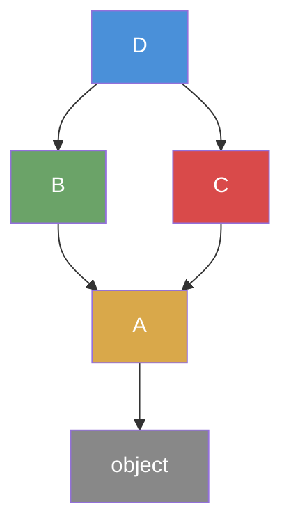
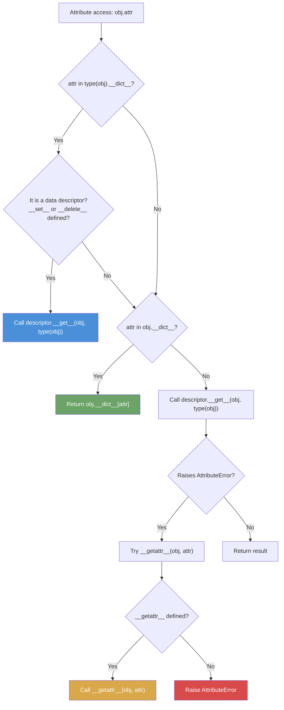

## Class Definition

In Python, a class is created with the `class` keyword. A class is itself an object -- an instance
of `type`. The body of a `class` statement executes at definition time (when the module is imported
or the function containing it is called), and the resulting namespace dictionary becomes the class's
`__dict__`.

```python
class Point:
    """A simple 2D point."""

    def __init__(self, x, y):
        self.x = x
        self.y = y

    def distance_to(self, other):
        return ((self.x - other.x) ** 2 + (self.y - other.y) ** 2) ** 0.5
```

The `class` statement does three things:

1. Creates a new namespace (a dictionary) for the class body.
2. Executes every top-level statement in that namespace -- assignments create class attributes,
   `def` statements create class methods, and even arbitrary expressions are evaluated.
3. Calls `type(name, bases, namespace)` to construct the class object, binding it to the class name
   in the enclosing scope.

```python
class Tracer:
    print("Class body is executing right now")

    def method(self):
        pass

# Output when the module loads: "Class body is executing right now"
```

This means class bodies are **not** inert declarations. They are executable code. This property is
the foundation of metaclasses, class decorators, and many advanced patterns.

## `__init__` and `self`

`__init__` is the **initializer**, not the constructor. The actual constructor is `__new__`, a class
method on `type` that allocates the instance. `__init__` receives the already-allocated instance and
populates it.

```python
class Demo:
    def __new__(cls, *args, **kwargs):
        print(f"__new__ called on {cls}")
        instance = super().__new__(cls)
        return instance

    def __init__(self, value):
        print(f"__init__ called on {self}")
        self.value = value
```

### Why `self` Instead of Implicit `this`

Python requires the instance to be passed explicitly as the first parameter of instance methods. The
parameter is conventionally named `self`, though the language does not enforce this name -- any
valid identifier works.

This is a deliberate design choice with several consequences:

1. **Explicit is better than implicit.** If `self` were implicit, a method's free variables would
   include an implicitly-bound name that shadows any outer variable with the same name. By making
   `self` an explicit parameter, the binding is always visible at the call site (even if the caller
   does not write it -- the interpreter inserts it automatically when using dotted access).

2. **Methods are just functions.** A method and a standalone function share the exact same calling
   convention. The only difference is that `obj.method(args)` is syntactic sugar for
   `type(obj).method(obj, args)`. This means you can pass methods as first-class objects, assign
   functions to class attributes to turn them into methods, and unbind methods from instances -- all
   without any special machinery.

3. **Uniformity with `cls`.** Class methods explicitly receive the class as their first parameter.
   Static methods receive nothing. All three cases follow the same rule: the first parameter is
   whatever the descriptor protocol provides. An implicit `this` would require a special case for
   every binding type.

```python
def standalone_func(self, x, y):
    return x + y

class Hijack:
    method = standalone_func

h = Hijack()
print(h.method(1, 2))  # 3 -- a plain function becomes a bound method
```

## Instance Variables vs Class Variables

**Instance variables** are stored in each object's `__dict__` and are set inside methods (typically
`__init__`). **Class variables** are stored in the class's `__dict__` and are shared across all
instances.

```python
class Dog:
    species = "Canis familiaris"

    def __init__(self, name):
        self.name = name

a = Dog("Rex")
b = Dog("Buster")

print(Dog.species)   # Canis familiaris
print(a.species)     # Canis familiaris (found on class)
print(a.name)        # Rex (found on instance)
```

Attribute lookup follows the chain: instance `__dict__` then class `__dict__` then base classes
(following the MRO). **Assignment to an attribute through an instance always sets it on the
instance**, never on the class.

```python
a.species = "Wolf"
print(a.species)     # Wolf (instance dict)
print(b.species)     # Canis familiaris (class dict)
print(Dog.species)   # Canis familiaris (unchanged)
```

:::danger

A common trap: mutable class variables are shared by reference. If you mutate (rather than reassign)
a class variable through an instance, the mutation is visible to all instances.

```python
class BadDefault:
    tags = []

    def add_tag(self, tag):
        self.tags.append(tag)  # mutates the shared list

a = BadDefault()
b = BadDefault()
a.add_tag("x")
print(b.tags)  # ['x'] -- surprise
```

Fix: assign the mutable in `__init__`.

:::

## Method Types

Python has three kinds of methods, distinguished by the decorators that wrap them.

### Instance Methods

The default. The descriptor wraps the function so that accessing it on an instance produces a bound
method with `self` pre-filled.

```python
class Counter:
    def __init__(self):
        self.count = 0

    def increment(self):
        self.count += 1
        return self
```

### Class Methods

`@classmethod` binds the first parameter to the class (not the instance). Used for alternative
constructors and methods that operate on the class rather than instances.

```python
class Date:
    def __init__(self, year, month, day):
        self.year = year
        self.month = month
        self.day = day

    @classmethod
    def from_iso(cls, iso_string):
        year, month, day = map(int, iso_string.split("-"))
        return cls(year, month, day)

    @classmethod
    def today(cls):
        import datetime
        t = datetime.date.today()
        return cls(t.year, t.month, t.day)

d = Date.from_iso("2025-06-04")
print(type(d).__name__)  # Date
```

The `cls` parameter ensures that subclass constructors return instances of the subclass, not the
base class. This is the primary advantage over static methods for factory patterns.

### Static Methods

`@staticmethod` wraps a function without binding any first parameter. It is a namespace tool -- a
way to attach utility functions to a class for organizational purposes.

```python
class Math:
    @staticmethod
    def clamp(value, lo, hi):
        return max(lo, min(value, hi))

    @staticmethod
    def lerp(a, b, t):
        return a + (b - a) * t
```

Static methods receive no implicit arguments. They cannot access `self` or `cls`. If a method does
not need either, making it static is a signal to readers and static analysis tools.

:::info

The distinction between class methods and static methods is more than cosmetic. A class method can
be overridden in a subclass and dispatch to the correct class via `cls`. A static method cannot --
it is a plain function that happens to live in a class namespace.

:::

## Properties: `@property`, Getters, and Setters

`@property` turns a method into a managed attribute. It is the Pythonic replacement for explicit
getter/setter methods. The key advantage: you can start with a plain attribute and promote it to a
property later without changing the public API.

```python
class Temperature:
    def __init__(self, celsius):
        self.celsius = celsius

    @property
    def fahrenheit(self):
        return self.celsius * 9 / 5 + 32

    @fahrenheit.setter
    def fahrenheit(self, value):
        self.celsius = (value - 32) * 5 / 9

    @fahrenheit.deleter
    def fahrenheit(self):
        raise AttributeError("Cannot delete fahrenheit")
```

Under the hood, `@property` creates a **descriptor** (discussed later) that intercepts attribute
access on the class. The property object has `fget`, `fset`, and `fdel` attributes corresponding to
the getter, setter, and deleter functions.

```python
t = Temperature(100)
print(t.fahrenheit)   # 212.0
t.fahrenheit = 32
print(t.celsius)      # 0.0
```

Properties with only a getter (no setter) are **read-only** from the perspective of external code.
Attempting to assign to them raises `AttributeError`. This is the standard way to create computed
attributes and enforce invariants.

```python
class Circle:
    def __init__(self, radius):
        self.radius = radius

    @property
    def area(self):
        import math
        return math.pi * self.radius ** 2

    @property
    def radius(self):
        return self._radius

    @radius.setter
    def radius(self, value):
        if value <= 0:
            raise ValueError("Radius must be positive")
        self._radius = value
```

## Inheritance

Python supports single and multiple inheritance. Every class implicitly inherits from `object` if no
base classes are specified.

```python
class Animal:
    def __init__(self, name):
        self.name = name

    def speak(self):
        raise NotImplementedError

class Dog(Animal):
    def speak(self):
        return f"{self.name} says Woof"

class Cat(Animal):
    def speak(self):
        return f"{self.name} says Meow"
```

### Method Resolution Order (MRO)

When you access an attribute on an instance, Python searches through the class hierarchy in a
specific order called the **Method Resolution Order**. You can inspect it with `ClassName.__mro__`
or `ClassName.mro()`.

```python
class A:
    def method(self):
        return "A"

class B(A):
    def method(self):
        return "B"

class C(A):
    def method(self):
        return "C"

class D(B, C):
    pass

print(D.__mro__)
# (<class 'D'>, <class 'B'>, <class 'C'>, <class 'A'>, <class 'object'>)
print(D().method())  # B
```

### Why C3 Linearization

Python 2.2 used a depth-first, left-to-right traversal for MRO. This produced unintuitive results
with diamond inheritance patterns and was inconsistent with monotonicity (a property requiring that
the order of base classes is preserved and that subclasses respect the order of their parents).

Python 2.3 adopted **C3 linearization**, an algorithm originally developed for Dylan. C3 satisfies
three constraints:

1. **Monotonicity:** If class A appears before class B in the linearization of C, then A appears
   before B in the linearization of every subclass of C.
2. **Consistent local precedence order:** If a class directly inherits from both B and C (in that
   order), then B appears before C in the linearization.
3. **Extended precedence graph (EPG) consistency:** The linearization must be consistent with the
   "is-a" relationships implied by the inheritance graph.

The algorithm works as follows. Given a class C with direct bases B1, B2, ..., Bn:

1. Start with the list L = [C] + merge(L(B1), L(B2), ..., L(Bn), [B1, B2, ..., Bn]).
2. The `merge` operation selects the first head of each list that is not in the tail of any other
   list, appends it to the result, and removes it from all lists.
3. If no valid head exists, the inheritance graph is inconsistent and Python refuses to create the
   class.

```python
# This raises TypeError: Cannot create a consistent method resolution order (MRO)
class X: pass
class Y(X): pass
class A(X, Y): pass  # X appears before Y in bases, but Y is a subclass of X
```



The MRO for `D` in this diamond is: `D -> B -> C -> A -> object`. The `super()` function (discussed
next) follows this order.

### `super()`

`super()` returns a proxy object that delegates method calls to the next class in the MRO. In Python
3, calling `super()` with no arguments inside a method automatically resolves the correct class and
instance.

```python
class Base:
    def __init__(self, value):
        self.value = value
        print(f"Base.__init__({value})")

class Middle(Base):
    def __init__(self, value):
        super().__init__(value + 1)
        print(f"Middle.__init__({value})")

class Top(Middle):
    def __init__(self, value):
        super().__init__(value + 1)
        print(f"Top.__init__({value})")

t = Top(1)
# Base.__init__(3)
# Middle.__init__(2)
# Top.__init__(1)
```

`super()` is critical for cooperative multiple inheritance. Each class in the chain calls `super()`
to ensure that every class's `__init__` is called exactly once, in MRO order. If a class calls a
parent's method directly (e.g., `Base.__init__(self, value)`), it breaks the chain and classes
further up the MRO may be skipped.

```python
class LoggingMixin:
    def __init__(self, *args, **kwargs):
        print(f"Initializing {type(self).__name__}")
        super().__init__(*args, **kwargs)

class BaseModel(LoggingMixin):
    def __init__(self, id=None):
        super().__init__()
        self.id = id

class User(BaseModel):
    def __init__(self, name, id=None):
        super().__init__(id=id)
        self.name = name

u = User("Alice")
# Initializing User (printed once, via LoggingMixin in MRO)
```

## Multiple Inheritance and Mixins

Python's multiple inheritance is powerful but demands discipline. The community convention is to use
**mixins** -- small, focused classes that provide a single piece of functionality and are designed
to be combined with other classes through inheritance.

A mixin should never be instantiated on its own. It should have no `__init__` (or a cooperative one
that calls `super().__init__()`), and it should not hold state. Its purpose is to provide methods
that a class can "mix in."

```python
class JsonMixin:
    def to_json(self):
        import json
        return json.dumps(self.__dict__)

class CsvMixin:
    def to_csv_row(self, fields):
        return ",".join(str(getattr(self, f, "")) for f in fields)

class User(JsonMixin, CsvMixin):
    def __init__(self, name, email):
        self.name = name
        self.email = email

u = User("Alice", "alice@example.com")
print(u.to_json())       # {"name": "Alice", "email": "alice@example.com"}
print(u.to_csv_row(["name", "email"]))  # Alice,alice@example.com
```

The convention for inheritance ordering is to list the primary base class last, and mixins before
it:

```python
class EnhancedUser(JsonMixin, CsvMixin, User):
    pass
```

This ordering ensures that mixin methods can override or wrap the primary class's methods, and that
`super()` calls propagate through the mixins before reaching the primary class.

:::danger

Avoid the "diamond of death" pattern where two mixins both call `super().__init__()` but the primary
class does not account for cooperative initialization. If you use mixins with `__init__`, every
class in the hierarchy must use `super().__init__()` and accept `*args, **kwargs` to pass through
arguments it does not need.

:::

## Abstract Base Classes

The `abc` (Abstract Base Classes) module provides a way to define interfaces that enforce a contract
on subclasses. A class with at least one abstract method cannot be instantiated directly.

```python
from abc import ABC, abstractmethod

class Shape(ABC):
    @abstractmethod
    def area(self):
        pass

    @abstractmethod
    def perimeter(self):
        pass

    def describe(self):
        return f"{type(self).__name__}: area={self.area():.2f}, perimeter={self.perimeter():.2f}"
```

Attempting to instantiate `Shape` directly raises `TypeError`. Subclasses must implement all
abstract methods before they can be instantiated.

```python
class Circle(Shape):
    def __init__(self, radius):
        self.radius = radius

    def area(self):
        import math
        return math.pi * self.radius ** 2

    def perimeter(self):
        import math
        return 2 * math.pi * self.radius

c = Circle(5)
print(c.describe())  # Circle: area=78.54, perimeter=31.42
```

### Abstract Properties and Class Methods

```python
from abc import ABC, abstractmethod

class Repository(ABC):
    @property
    @abstractmethod
    def connection_string(self):
        pass

    @classmethod
    @abstractmethod
    def create(cls, config):
        pass
```

### `__subclasshook__`

ABCs can register virtual subclasses using `register()`, or define a `__subclasshook__` that allows
any class satisfying a structural protocol to be considered a subclass without explicit
registration.

```python
from abc import ABC, abstractmethod

class Closeable(ABC):
    @abstractmethod
    def close(self):
        pass

    @classmethod
    def __subclasshook__(cls, C):
        if cls is Closeable:
            if any("close" in B.__dict__ for B in C.__mro__):
                return True
        return NotImplemented
```

With this hook, any class that defines a `close` method is considered a virtual subclass of
`Closeable`, even without inheriting from it. This enables structural typing alongside the nominal
typing of traditional inheritance.

## Dunder Methods

Dunder (double underscore) methods are Python's protocol for operator overloading and integration
with built-in functions. They are how user-defined classes participate in Python's data model.

### String Representation

```python
class Point:
    def __init__(self, x, y):
        self.x = x
        self.y = y

    def __repr__(self):
        return f"Point({self.x!r}, {self.y!r})"

    def __str__(self):
        return f"({self.x}, {self.y})"
```

`__repr__` is for developers -- it should be unambiguous and, ideally, produce a string that could
be passed to `eval()` to reconstruct the object. `__str__` is for end users -- it should be
readable. `__str__` falls back to `__repr__` if not defined.

### Equality and Hashing

```python
class Card:
    def __init__(self, rank, suit):
        self.rank = rank
        self.suit = suit

    def __eq__(self, other):
        if not isinstance(other, Card):
            return NotImplemented
        return (self.rank, self.suit) == (other.rank, other.suit)

    def __hash__(self):
        return hash((self.rank, self.suit))
```

Returning `NotImplemented` (not `False`) when the other operand has an incompatible type allows
Python to try the reflected operation on the other operand. Returning `False` would prevent this
fallback.

:::danger

If you define `__eq__`, Python sets `__hash__` to `None` by default. This makes instances unhashable
and unusable in sets or as dict keys. If you need hashability, you must define `__hash__`
explicitly. The invariant is: if `a == b`, then `hash(a) == hash(b)`. Violating this causes silent
data corruption in sets and dicts.

:::

### Container Protocol

```python
class Deck:
    def __init__(self):
        self._cards = []

    def __len__(self):
        return len(self._cards)

    def __getitem__(self, index):
        return self._cards[index]

    def __iter__(self):
        return iter(self._cards)

    def __contains__(self, card):
        return card in self._cards
```

Defining `__len__` and `__getitem__` makes your class work with `len()`, indexing, slicing, and
iteration (the `for` loop falls back to sequential integer indexing if `__iter__` is not defined).
Defining `__iter__` is preferred for custom iteration logic.

### Callable Objects

```python
class Multiplier:
    def __init__(self, factor):
        self.factor = factor

    def __call__(self, x):
        return x * self.factor

double = Multiplier(2)
triple = Multiplier(3)
print(double(5))  # 10
print(triple(5))  # 15
```

`__call__` makes instances behave like functions. This pattern is used extensively:
`functools.partial`, `threading.Thread` (which calls the target function), and many decorator
implementations rely on `__call__`.

### Context Managers

```python
class Timer:
    def __init__(self, name):
        self.name = name

    def __enter__(self):
        import time
        self.start = time.perf_counter()
        return self

    def __exit__(self, exc_type, exc_val, exc_tb):
        import time
        elapsed = time.perf_counter() - self.start
        print(f"{self.name}: {elapsed:.4f}s")
        return False

with Timer("query"):
    import time
    time.sleep(0.1)
# query: 0.1001s
```

`__enter__` is called when the `with` block is entered. Its return value is bound to the variable
after `as`. `__exit__` is called when the block exits, whether normally or via exception. If
`__exit__` returns `True`, the exception is suppressed. The `contextlib` module provides
`@contextmanager` for simpler cases where a function-based approach is cleaner.

## Dataclasses

The `@dataclass` decorator (Python 3.7+) automates the generation of `__init__`, `__repr__`, and
`__eq__` based on class-level type annotations. It eliminates boilerplate for classes that are
primarily containers for data.

```python
from dataclasses import dataclass

@dataclass
class Person:
    name: str
    age: int
    email: str = "unknown"

p = Person("Alice", 30)
print(p)  # Person(name='Alice', age=30, email='unknown')
print(p == Person("Alice", 30, "unknown"))  # True
```

### Configuration Options

```python
from dataclasses import dataclass, field

@dataclass(slots=True)
class Order:
    id: int
    items: list = field(default_factory=list)
    total: float = 0.0
    priority: bool = False
```

The `field()` function provides fine-grained control:

- `default_factory`: a zero-argument callable that produces the default value. **Always** use this
  for mutable defaults.
- `repr=False`: exclude from the generated `__repr__`.
- `compare=False`: exclude from `__eq__` and `__hash__`.
- `init=False`: do not include in the generated `__init__`.

### Frozen Dataclasses

```python
@dataclass(frozen=True)
class ImmutablePoint:
    x: float
    y: float

    def __hash__(self):
        return hash((self.x, self.y))
```

`frozen=True` makes instances immutable (assigning to attributes raises `FrozenInstanceError`) and
automatically generates `__hash__`. Frozen dataclasses are suitable as dict keys and set members.

### Why Dataclasses Alongside Named Tuples and `attrs`

Python has three overlapping mechanisms for data-holding classes. Each exists for different reasons:

| Feature     | `namedtuple` | `dataclass`        | `attrs` (third-party) |
| ----------- | ------------ | ------------------ | --------------------- |
| Mutable     | No           | Yes (configurable) | Yes (configurable)    |
| Typing      | Optional     | Built-in           | Built-in              |
| Inheritance | Limited      | Full               | Full                  |
| Validation  | None         | Manual             | Built-in              |
| Performance | Excellent    | Good               | Good                  |
| Stdlib      | Yes          | Yes (3.7+)         | No                    |

- **`namedtuple`** is the right choice when you need a lightweight, immutable, memory-efficient
  container with positional access. It is a tuple subclass, so it is compatible with APIs that
  expect tuples. Its limitation is that you cannot add methods meaningfully or use inheritance
  beyond the trivial case.
- **`dataclass`** is the right choice for mutable or immutable data containers that need methods,
  validation in `__post_init__`, inheritance, or `__slots__`. It integrates with the type annotation
  system and generates methods at class definition time.
- **`attrs`** predates `dataclass` and provides additional features: automatic validation via
  `@attr.ib(validator=...)`, automatic conversion, and more sophisticated configuration. `dataclass`
  was explicitly designed as a stdlib answer to the most common `attrs` use cases.

The design philosophy: `dataclass` does not try to replace `namedtuple` (which serves the tuple
compatibility use case) or `attrs` (which serves the heavy-weight validation use case). It occupies
the middle ground.

## `__slots__`

By default, every Python object stores its attributes in a per-instance dictionary (`__dict__`).
This provides maximum flexibility but has a memory cost: each empty `__dict__` consumes roughly
100-200 bytes of overhead, and dictionary operations have higher constant factors than attribute
access on a fixed-layout object.

`__slots__` replaces the per-instance dictionary with a fixed set of attribute names, stored in a
compact array. This reduces memory usage by 40-60% per instance and can improve attribute access
speed.

```python
class DensePoint:
    __slots__ = ("x", "y")

    def __init__(self, x, y):
        self.x = x
        self.y = y

p = DensePoint(1, 2)
print(p.x)  # 1
p.z = 3    # AttributeError: 'DensePoint' object has no attribute 'z'
```

:::danger

`__slots__` has significant limitations:

1. Instances cannot have attributes not listed in `__slots__` (no dynamic attribute assignment).
2. Each class in an inheritance hierarchy must define its own `__slots__`. If a base class omits
   `__slots__`, subclasses gain a `__dict__` regardless.
3. `__slots__` cannot contain `__dict__` or `__weakref__` unless you explicitly add them as strings
   (which re-enables those features).
4. Code that relies on `__dict__` (e.g., serialization, `vars()`, some ORMs) will break.

:::

```python
class Base:
    __slots__ = ("id",)

class Child(Base):
    __slots__ = ("name",)

class Grandchild(Child):
    __slots__ = ("age",)

g = Grandchild()
g.id = 1
g.name = "test"
g.age = 20
# No __dict__ -- memory efficient
```

## Descriptors

Descriptors are the underlying mechanism that makes properties, class methods, static methods, and
`super()` work. A descriptor is any object that implements at least one of `__get__`, `__set__`, or
`__delete__`.

- **Data descriptor:** defines `__get__` and at least one of `__set__` or `__delete__`. Data
  descriptors take priority over instance `__dict__` entries.
- **Non-data descriptor:** defines only `__get__`. Instance `__dict__` entries take priority over
  non-data descriptors.

This distinction is crucial. Functions are non-data descriptors, which is why you can shadow a class
method with an instance attribute. Properties are data descriptors, which is why they cannot be
shadowed by instance attributes.



### Implementing a Descriptor

```python
class Validated:
    def __init__(self, validator):
        self.validator = validator
        self.attr_name = None

    def __set_name__(self, owner, name):
        self.attr_name = f"_{name}"

    def __get__(self, obj, objtype=None):
        if obj is None:
            return self
        return getattr(obj, self.attr_name)

    def __set__(self, obj, value):
        self.validator(self.attr_name, value)
        setattr(obj, self.attr_name, value)

class Person:
    name = Validated(lambda attr, v: isinstance(v, str) and len(v) > 0
                     or print(f"{attr}: must be non-empty string"))
    age = Validated(lambda attr, v: isinstance(v, int) and v >= 0
                    or print(f"{attr}: must be non-negative integer"))

    def __init__(self, name, age):
        self.name = name
        self.age = age
```

`__set_name__` (Python 3.6+) is called by the metaclass when the class is created, giving the
descriptor knowledge of the attribute name it was assigned to. This eliminates the need to pass the
name as a string argument.

### How Functions Become Bound Methods

A plain function is a non-data descriptor. Its `__get__` method returns a bound method object when
accessed on an instance:

```python
class Demo:
    def method(self):
        pass

# Roughly equivalent to what function.__get__ does:
def function_get(func, obj, objtype=None):
    if obj is None:
        return func
    return lambda *args, **kwargs: func(obj, *args, **kwargs)
```

When you write `obj.method()`, Python:

1. Looks up `method` on `type(obj)`.
2. Finds a function (a non-data descriptor).
3. Calls `function.__get__(obj, type(obj))`, which returns a bound method.
4. Calls the bound method with the arguments you provided.

This is the complete explanation for why `self` is necessary: the descriptor protocol supplies the
instance, and the function's signature receives it.

### How `property` Works

`property` is a data descriptor:

```python
class Property:
    def __init__(self, fget=None, fset=None, fdel=None, doc=None):
        self.fget = fget
        self.fset = fset
        self.fdel = fdel
        self.__doc__ = doc

    def __get__(self, obj, objtype=None):
        if obj is None:
            return self
        if self.fget is None:
            raise AttributeError("unreadable attribute")
        return self.fget(obj)

    def __set__(self, obj, value):
        if self.fset is None:
            raise AttributeError("can't set attribute")
        self.fset(obj, value)

    def setter(self, fset):
        self.fset = fset
        return self
```

Because `property` defines `__set__`, it is a data descriptor and takes priority over instance
`__dict__`. This is why you cannot bypass a property setter by assigning directly to an instance
attribute -- the descriptor intercepts the assignment.

## Putting It All Together

```python
from dataclasses import dataclass, field
from abc import ABC, abstractmethod

class Validated(ABC):
    @abstractmethod
    def validate(self):
        pass

@dataclass(slots=True, eq=False)
class Account(Validated):
    owner: str
    balance: float = 0.0
    _transactions: list = field(default_factory=list)

    def deposit(self, amount):
        if amount <= 0:
            raise ValueError("Deposit must be positive")
        self.balance += amount
        self._transactions.append(("deposit", amount))

    def withdraw(self, amount):
        if amount <= 0:
            raise ValueError("Withdrawal must be positive")
        if amount > self.balance:
            raise ValueError("Insufficient funds")
        self.balance -= amount
        self._transactions.append(("withdrawal", amount))

    def validate(self):
        if not self.owner:
            raise ValueError("Owner is required")
        if self.balance < 0:
            raise ValueError("Balance cannot be negative")

    def __str__(self):
        return f"Account({self.owner}, balance={self.balance:.2f})"

    def __repr__(self):
        return f"Account(owner={self.owner!r}, balance={self.balance!r})"

    def __eq__(self, other):
        if not isinstance(other, Account):
            return NotImplemented
        return (self.owner, self.balance) == (other.owner, other.balance)

    def __hash__(self):
        return hash((self.owner, self.balance))

    def __len__(self):
        return len(self._transactions)

    def __iter__(self):
        return iter(self._transactions)

    def __getitem__(self, index):
        return self._transactions[index]
```

This class combines dataclasses (for boilerplate reduction), ABCs (for interface enforcement), slots
(for memory efficiency), and multiple dunder methods (for full Python data model integration). Each
of these mechanisms addresses a separate concern, and they compose without conflict.
