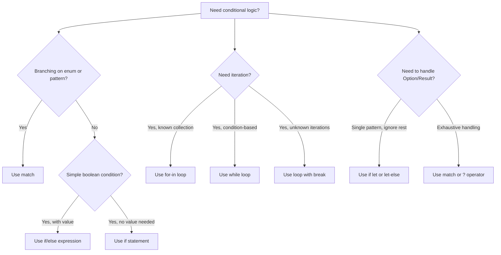

## `if` / `else`

Rust's `if` expression does not require parentheses around the condition, but braces around the body
are mandatory. Unlike C or Java, `if` is an expression — it returns a value and can be used inline:

```rust
let condition = true;
let number = if condition { 5 } else { 6 };
assert_eq!(number, 5);
```

Both branches must produce the same type. The compiler enforces this:

```rust
// ERROR: if and else have incompatible types
// let x = if true { 5 } else { "six" };
```

### `else if` Chains

```rust
let number = 6;

if number % 4 == 0 {
    println!("number is divisible by 4");
} else if number % 3 == 0 {
    println!("number is divisible by 3");
} else if number % 2 == 0 {
    println!("number is divisible by 2");
} else {
    println!("number is not divisible by 4, 3, or 2");
}
```

There is no ternary operator (`? :`). The `if` expression is the ternary.

### Conditional Assignment Patterns

Use `if` expressions for concise conditional initialization:

```rust
let port = std::env::var("PORT")
    .ok()
    .and_then(|s| s.parse::<u16>().ok())
    .unwrap_or(if cfg!(debug_assertions) { 3000 } else { 8080 });
```

### Blocks as Expressions

Every block in Rust is an expression. The last expression without a semicolon is the return value:

```rust
let x = {
    let a = 1;
    let b = 2;
    a + b  // no semicolon — this is the block's value
};
assert_eq!(x, 3);

let y = {
    let a = 1;
    let b = 2;
    a + b;  // semicolon — the block returns ()
};
assert_eq!(y, ());
```

This is not specific to `if` — it applies to `match` arms, `loop` bodies, function bodies, and any
braced block.

## `match` Expressions

`match` is Rust's most powerful control flow construct. It performs exhaustive pattern matching
against a value and executes the first matching arm.

```rust
enum Coin {
    Penny,
    Nickel,
    Dime,
    Quarter(String),
}

fn value_in_cents(coin: &Coin) -> u8 {
    match coin {
        Coin::Penny => 1,
        Coin::Nickel => 5,
        Coin::Dime => 10,
        Coin::Quarter(state) => {
            println!("state quarter from {}", state);
            25
        }
    }
}
```

### Exhaustiveness

The compiler verifies that every possible value is covered. Adding a new variant to an enum causes
every `match` on that enum to produce a compile error until updated:

```rust
enum Color { Red, Green, Blue }

fn color_name(c: Color) -> &'static str {
    match c {
        Color::Red => "red",
        Color::Green => "green",
        // Color::Blue => "blue",  // if you comment this out, compiler errors
        _ => "other",  // wildcard covers remaining variants
    }
}
```

The `_` wildcard matches anything and is useful when you do not need to handle specific cases. It
does not bind the value.

### Match Guards

Add an `if` condition to a match arm for additional filtering:

```rust
let num = Some(4);

match num {
    Some(x) if x % 2 == 0 => println!("even: {}", x),
    Some(x) => println!("odd: {}", x),
    None => println!("none"),
}
```

Match guards do not participate in exhaustiveness checking. The compiler cannot prove that a guard
will always match, so you may still need a catch-all arm.

### Variable Shadowing in Match Arms

Match arms introduce new scopes. Variables bound in one arm do not leak to others:

```rust
let x = 5;

match x {
    1 => println!("one"),
    2 => println!("two"),
    y => println!("something else: {}", y),
}
// y is not in scope here
```

### Match on References (Match Ergonomics)

Rust 2021 edition enables match ergonomics — the compiler automatically adds `&` when matching
through a reference:

```rust
let c = Coin::Penny;
let r: &Coin = &c;

match r {
    Coin::Penny => println!("penny"),   // auto-dereferenced
    Coin::Nickel => println!("nickel"),
    _ => {}
}
```

### Match as a Destructuring Tool

`match` is the primary mechanism for destructuring tuples, structs, and enums:

```rust
struct Point { x: f64, y: f64 }
let p = Point { x: 0.0, y: 7.0 };

match p {
    Point { x: 0.0, y } => println!("on y-axis at {}", y),
    Point { x, y: 0.0 } => println!("on x-axis at {}", x),
    Point { x, y } => println!("at ({}, {})", x, y),
}

let pair = (2, -2);
match pair {
    (0, y) => println!("x is zero, y is {}", y),
    (x, 0) => println!("x is {}, y is zero", x),
    _ => println!("neither is zero"),
}
```

### Or Patterns (Rust 1.53+)

Match multiple patterns with `|`:

```rust
let x = 1;

match x {
    1 | 2 => println!("one or two"),
    3..=5 => println!("three through five"),
    _ => println!("something else"),
}
```

### Guarding Against Variable Binding Conflicts

A match guard can reference variables from the enclosing scope. If the guard's variable name shadows
the pattern's binding, use `@` to bind and filter simultaneously:

```rust
let age = 15;

match age {
    n @ 1..=12 => println!("child: {}", n),
    n @ 13..=19 => println!("teenager: {}", n),
    n => println!("adult: {}", n),
}
```

## Loops

### `loop`

The `loop` keyword creates an infinite loop. Use `break` to exit:

```rust
let mut counter = 0;

let result = loop {
    counter += 1;

    if counter == 10 {
        break counter * 2;  // break can return a value
    }
};

assert_eq!(result, 20);
```

`loop` is the only loop that returns a value from `break`. `while` and `for` loops do not support
value-returning breaks (they return `()`).

### `while`

```rust
let mut number = 3;

while number != 0 {
    println!("{}!", number);
    number -= 1;
}
```

`while` evaluates the condition before each iteration. If the condition is false on the first check,
the body never executes.

### `for` — Iterator-Based Looping

`for` loops iterate over any type implementing `IntoIterator`. This includes arrays, vectors,
ranges, strings, hash maps, and any custom iterator:

```rust
// Array
let arr = [10, 20, 30, 40, 50];
for element in arr {
    println!("the value is: {}", element);
}

// Range
for number in 1..=5 {
    println!("{}", number);
}

// Reverse range
for number in (1..4).rev() {
    println!("{}!", number);
}

// With index
for (index, value) in arr.iter().enumerate() {
    println!("{}: {}", index, value);
}

// String characters
for ch in "hello".chars() {
    println!("{}", ch);
}
```

### Iterating Over References

`for item in &collection` borrows each element. `for item in &mut collection` borrows each element
mutably. `for item in collection` moves each element:

```rust
let mut v = vec![1, 2, 3, 4, 5];

// Borrow immutably
for item in &v {
    println!("{}", item);
}

// Borrow mutably
for item in &mut v {
    *item += 1;
}

// Move out (v is consumed)
for item in v {
    println!("{}", item);
}
// v is no longer usable here
```

### `for` Over Maps

```rust
use std::collections::HashMap;

let mut scores = HashMap::new();
scores.insert(String::from("Blue"), 10);
scores.insert(String::from("Red"), 50);

for (key, value) in &scores {
    println!("{}: {}", key, value);
}
```

HashMap iteration order is not guaranteed. If you need ordering, collect into a `BTreeMap` or sort
the entries.

## `break` and `continue`

### `break`

Exits the current loop immediately. In a `loop`, `break` can return a value:

```rust
let mut i = 0;
loop {
    i += 1;
    if i == 5 {
        break;
    }
}
assert_eq!(i, 5);
```

### `continue`

Skips the rest of the current iteration and moves to the next:

```rust
for number in 1..=10 {
    if number % 2 == 0 {
        continue;
    }
    println!("{}", number);
}
```

### Labeled `break` and `continue`

Labels allow breaking out of or continuing an outer loop from within a nested loop:

```rust
'outer: for x in 0..5 {
    for y in 0..5 {
        if x == 2 && y == 2 {
            break 'outer;  // breaks out of the outer loop
        }
        if y == 0 {
            continue 'outer;  // continues the outer loop
        }
        println!("x={}, y={}", x, y);
    }
}
```

Labels use a single quote prefix (`'outer:`) and are referenced with `break 'label` or
`continue 'label`.

### Labeled Loops Returning Values

A labeled `loop` can return a value via `break`:

```rust
let matrix = [[1, 2, 3], [4, 5, 6], [7, 8, 9]];

let found = 'search: loop {
    for row in &matrix {
        for &val in row {
            if val == 5 {
                break 'search val;  // returns 5 from the outer loop
            }
        }
    }
    panic!("not found");
};

assert_eq!(found, 5);
```

## `if let` and `while let`

### `if let`

`if let` is syntactic sugar for a `match` with a single arm of interest:

```rust
let some_value = Some(7);

if let Some(n) = some_value {
    println!("value is {}", n);
}
```

This is equivalent to:

```rust
match some_value {
    Some(n) => println!("value is {}", n),
    _ => {},
}
```

`if let` does not enforce exhaustiveness. Use it when you care about one pattern and want to ignore
the rest. The `else` block handles the non-matching case:

```rust
let some_value = Some(7);

if let Some(n) = some_value {
    println!("value is {}", n);
} else {
    println!("no value");
}
```

### `let-else` (Rust 1.65+)

`let-else` combines pattern matching with early return. The `else` block must diverge:

```rust
fn process(data: Option<Vec<i32>>) -> i32 {
    let Some(values) = data else {
        return 0;
    };
    values.iter().sum()
}

fn parse_or_default(s: &str) -> u64 {
    let Ok(n) = s.parse::<u64>() else {
        return 0;
    };
    n
}
```

The `else` block can contain `return`, `break`, `continue`, `panic!`, or another diverging
expression. It cannot simply be a non-diverging block.

### `while let`

`while let` repeatedly matches a pattern and runs the loop body until the pattern stops matching:

```rust
let mut stack = Vec::new();
stack.push(1);
stack.push(2);
stack.push(3);

while let Some(top) = stack.pop() {
    println!("{}", top);
}
// Prints: 3, 2, 1
```

`while let` is less common than `for` but useful when consuming values from an iterator with a
specific pattern.

## `match` Ergonomics in Depth

### Destructuring Nested Structures

```rust
enum Message {
    Hello { id: usize },
    Move { x: i32, y: i32 },
    Write(String),
    ChangeColor(u8, u8, u8),
}

let msg = Message::ChangeColor(255, 0, 128);

match msg {
    Message::ChangeColor(r, g, b) if r == 255 => {
        println!("pure red component: r={}, g={}, b={}", r, g, b);
    }
    Message::ChangeColor(r, g, b) => {
        println!("color: rgb({}, {}, {})", r, g, b);
    }
    Message::Write(text) => {
        println!("message: {}", text);
    }
    _ => {}
}
```

### Ignoring Values with `..`

Use `..` to ignore remaining fields in a struct or tuple:

```rust
struct Point3D { x: f64, y: f64, z: f64 }
let p = Point3D { x: 1.0, y: 2.0, z: 3.0 };

match p {
    Point3D { x, .. } => println!("x is {}", x),
}

let origin = (0, 0, 0);
match origin {
    (0, ..) => println!("x is zero"),
    _ => {}
}
```

### Binding with `ref` and `ref mut`

When destructuring, values are moved by default. Use `ref` to borrow and `ref mut` to borrow
mutably:

```rust
struct Person { name: String, age: u32 }
let person = Person {
    name: String::from("Alice"),
    age: 30,
};

// Move — person.name is no longer accessible
let Person { name, age } = person;
println!("{} is {}", name, age);

let person = Person {
    name: String::from("Bob"),
    age: 25,
};

// Borrow — person remains fully accessible
let Person { ref name, ref age } = person;
println!("{} is {}", name, age);
println!("{} is {}", person.name, person.age);
```

### Matching Literals and Constants

```rust
const MAX_POINTS: u32 = 100_000;

let points = 75_000;

match points {
    0 => println!("zero points"),
    MAX_POINTS => println!("max points"),
    1..=10_000 => println!("low points"),
    _ => println!("some points"),
}
```

### Matching Slices and Arrays

```rust
let arr = [1, 2, 3, 4, 5];

match arr {
    [first, second, ..] => {
        println!("first: {}, second: {}", first, second);
    }
    [] => {
        println!("empty array");
    }
}

// More specific slice matching
let slice = &[1, 2, 3, 4, 5];
match slice {
    [1, 2, rest @ ..] => println!("starts with 1,2, rest: {:?}", rest),
    [1, .., 5] => println!("starts with 1, ends with 5"),
    _ => println!("other"),
}
```

## Loop Expressions and Patterns

### Loop as an Expression

Since `loop` is an expression, it can be used in value context:

```rust
let mut count = 0;
let result = loop {
    count += 1;
    if count == 10 {
        break count;
    }
};
assert_eq!(result, 10);
```

### Early Exit from Nested Loops with Labels

Labels enable complex control flow in nested loops:

```rust
let mut matrix = [[1, 2, 3], [4, 5, 6], [7, 8, 9]];

'outer: for row in &mut matrix {
    for cell in row.iter_mut() {
        *cell *= 2;
        if *cell == 10 {
            break 'outer;
        }
    }
}
assert_eq!(matrix[0], [2, 4, 6]);
assert_eq!(matrix[1], [8, 10, 12]);
assert_eq!(matrix[2], [7, 8, 9]);
```

### `while` with Iterator

You can use `while let` with an iterator, though `for` is generally preferred:

```rust
let mut iter = vec![1, 2, 3].into_iter();

while let Some(value) = iter.next() {
    println!("{}", value);
}
```

### `loop` with `?` Operator

Use `loop` with `?` for retry patterns:

```rust
fn fetch_with_retry(url: &str, max_retries: usize) -> Result<String, reqwest::Error> {
    let mut retries = 0;
    loop {
        match reqwest::get(url) {
            Ok(response) => return Ok(response.text()?),
            Err(e) if retries < max_retries => {
                retries += 1;
                std::thread::sleep(std::time::Duration::from_secs(1));
                continue;
            }
            Err(e) => return Err(e),
        }
    }
}
```

## The `matches!` Macro

`matches!` is a concise way to check whether a value matches a pattern — it returns `bool`:

```rust
let x = Some(5);

assert!(matches!(x, Some(5)));
assert!(matches!(x, Some(_)));
assert!(!matches!(x, None));
assert!(matches!(x, Some(n) if n > 3));

// Useful in filter contexts
let numbers = vec![Some(1), None, Some(3), None, Some(5)];
let has_some = numbers.iter().any(|x| matches!(x, Some(_)));
assert!(has_some);
```

## Guard Expressions in Match Arms

Match guards enable conditional logic that depends on values outside the pattern:

```rust
struct Config {
    max_connections: u32,
    connection_timeout_ms: u64,
}

let config = Config {
    max_connections: 100,
    connection_timeout_ms: 5000,
};

match config.max_connections {
    n if n == 0 => println!("connections disabled"),
    n if n &lt; 10 => println!("low connection limit: {}", n),
    n if n &lt; 100 => println!("moderate connection limit: {}", n),
    n => println!("high connection limit: {}", n),
}
```

:::warning

Match guards can introduce subtle bugs. A guard that references a variable from the enclosing scope
that has the same name as a pattern binding will shadow the pattern binding:

```rust
let x = Some(5);
let y = 10;

match x {
    Some(x) if x < y => println!("less than {}: {}", y, x),
    Some(x) => println!("greater than or equal to {}: {}", y, x),
    None => {}
}
```

This works correctly because the guard's `x` refers to the pattern binding, not the outer `x`. But
if the guard references an outer variable with the same name, the outer variable takes precedence.

:::

## Control Flow in Error Handling

### `match` for Error Classification

```rust
use std::io;

fn read_file(path: &str) -> io::Result<String> {
    std::fs::read_to_string(path)
}

match read_file("config.toml") {
    Ok(content) => println!("config loaded: {} bytes", content.len()),
    Err(e) if e.kind() == io::ErrorKind::NotFound => {
        println!("config file not found, using defaults");
    }
    Err(e) if e.kind() == io::ErrorKind::PermissionDenied => {
        println!("permission denied: {}", e);
    }
    Err(e) => eprintln!("unexpected error: {}", e),
}
```

### `if let` for Single Error Handling

```rust
if let Err(e) = std::fs::create_dir("output") {
    if e.kind() == io::ErrorKind::AlreadyExists {
        println!("output directory already exists");
    } else {
        return Err(e);
    }
}
```

## `?` Operator and Control Flow

The `?` operator is syntactic sugar for early return on `Err` (or `None` for `Option`). It is the
idiomatic way to propagate errors:

```rust
use std::fs;
use std::io;

fn read_and_parse(path: &str) -> io::Result<Vec<i32>> {
    let content = fs::read_to_string(path)?;
    let numbers: Vec<i32> = content
        .lines()
        .filter(|line| !line.trim().is_empty())
        .map(|line| line.parse().map_err(|e| io::Error::new(io::ErrorKind::InvalidData, e)))
        .collect::<io::Result<Vec<i32>>>()?;
    Ok(numbers)
}
```

### `?` with Option

```rust
fn first_positive(nums: &[i32]) -> Option<i32> {
    let &n = nums.iter().find(|&&x| x > 0)?;
    Some(n * 2)
}

assert_eq!(first_positive(&[-1, -2, 3, 4]), Some(6));
assert_eq!(first_positive(&[-1, -2, -3]), None);
```

### `?` in `main`

```rust
fn main() -> Result<(), Box<dyn std::error::Error>> {
    let content = std::fs::read_to_string("config.toml")?;
    println!("config: {}", content);
    Ok(())
}
```

The `?` operator in `main` propagates errors to the runtime, which prints the error message and
exits with a non-zero status code.

## Iterators and Control Flow

### `loop` + `break` with Iterator Consumers

```rust
let data = vec![1, 2, 3, 4, 5, 6, 7, 8, 9, 10];

let first_gt_five = 'find: loop {
    for &val in &data {
        if val > 5 {
            break 'find val;
        }
    }
    panic!("should have found a value greater than 5");
};

assert_eq!(first_gt_five, 6);
```

### `for` with Early Termination

```rust
fn find_first_duplicate(data: &[i32]) -> Option<i32> {
    let mut seen = std::collections::HashSet::new();
    for &val in data {
        if seen.contains(&val) {
            return Some(val);
        }
        seen.insert(val);
    }
    None
}
```

### Collecting into `Result` from Iterator

```rust
let inputs = vec!["1", "2", "three", "4"];

// Stops at first error
let result: Result<Vec<i32>, _> = inputs
    .iter()
    .map(|s| s.parse::<i32>())
    .collect();

assert!(result.is_err());
```

## Early Return Patterns

### Guard Clauses

Move validation and early exits to the top of the function for readability:

```rust
fn process_user(id: u64, db: &Database) -> Result<User, AppError> {
    if id == 0 {
        return Err(AppError::InvalidInput("id cannot be zero".into()));
    }

    let user = db.get_user(id)?
        .ok_or(AppError::NotFound(format!("user {}", id)))?;

    if !user.is_active {
        return Err(AppError::InactiveUser(user.id));
    }

    Ok(user)
}
```

### `let-else` for Early Return

```rust
fn get_user_name(id: u64, db: &Database) -> Result<String, AppError> {
    let Some(user) = db.get_user(id)? else {
        return Err(AppError::NotFound(format!("user {}", id)));
    };

    if user.name.is_empty() {
        return Err(AppError::InvalidInput("user name is empty".into()));
    }

    Ok(user.name)
}
```

## Conditional Compilation in Control Flow

Use `#[cfg(...)]` attributes to include or exclude code at compile time:

```rust
#[cfg(target_os = "linux")]
fn platform_specific() {
    println!("running on linux");
}

#[cfg(not(target_os = "linux"))]
fn platform_specific() {
    println!("not running on linux");
}

#[cfg(debug_assertions)]
fn debug_only() {
    println!("this only runs in debug mode");
}

#[cfg(feature = "experimental")]
fn experimental_feature() {
    println!("experimental feature enabled");
}
```

## `return` as an Expression

`return` exits the current function. It is an expression of type `!` (never type), which coerces to
any type:

```rust
fn abs(x: i32) -> i32 {
    if x >= 0 {
        return x;
    }
    -x
}
```

Use `return` only for early exits. Omit the trailing `return` for the final expression — Rust
functions return the last expression automatically:

```rust
// Idiomatic — no trailing return
fn add(a: i32, b: i32) -> i32 {
    a + b
}

// Unidiomatic — explicit trailing return
fn add_verbose(a: i32, b: i32) -> i32 {
    return a + b;
}
```

## `panic!` and Unrecoverable Errors

`panic!` terminates the current thread (unwinding by default) and is for unrecoverable bugs:

```rust
fn divide(a: f64, b: f64) -> f64 {
    if b == 0.0 {
        panic!("division by zero: {} / {}", a, b);
    }
    a / b
}
```

### `unreachable!` and `todo!`

```rust
enum State {
    Active,
    Inactive,
}

fn state_name(state: State) -> &'static str {
    match state {
        State::Active => "active",
        State::Inactive => "inactive",
    }
}

// Tell the compiler this code path is impossible
fn process_state(state: State) {
    let name = match state {
        State::Active => "active",
        State::Inactive => "inactive",
    };
    println!("{}", name);
}

// Mark incomplete code
fn not_implemented() -> i32 {
    todo!()
}
```

`unreachable!` panics with a message indicating the code should never be reached. `todo!` is similar
but indicates the code is intentionally incomplete. Both are useful during development but should
not appear in production code.

## Common Pitfalls

1. **Using `if` without braces.** Rust requires braces around the body of `if`, `else`, `while`, and
   `for`. Unlike C, `if (x) return;` is invalid — you must write `if x { return; }`.

2. **Forgetting `match` exhaustiveness.** Adding a new enum variant without updating all `match`
   expressions is a compile error. This is a feature, not a bug — it prevents silent logic errors.
   Do not paper over it with `_ => {}` unless the variant genuinely does not matter.

3. **`if let` hiding missing arms.** `if let Some(x) = val` ignores the `None` case by default. If
   you need to handle both cases, use `match` or add an `else` block.

4. **Shadowing in match arms.** Pattern bindings in match arms shadow outer variables with the same
   name. This is intentional but can be confusing. Use distinct names if shadowing would be unclear.

5. **Match guards not participating in exhaustiveness.** The compiler cannot prove that a guard will
   always match, so `Some(x) if x > 0` does not cover all `Some` variants. You still need a
   catch-all arm.

6. **Using `loop` when `for` suffices.** `for` is preferred over `loop { ... next() }` because it is
   more idiomatic, handles iterator exhaustion automatically, and does not require manual `break`.

7. **Labeled breaks on the wrong loop.** `'outer: loop { loop { break 'outer; } }` breaks the outer
   loop. Forgetting the label breaks only the inner loop. Use labels intentionally and document
   complex nesting.

8. **Mutating through a `for` loop incorrectly.** `for item in &mut collection` requires `*item` to
   modify the value. Writing `item = new_value` rebinds the local variable without modifying the
   collection.

9. **Integer range off-by-one.** `1..5` produces `[1, 2, 3, 4]` (exclusive end). `1..=5` produces
   `[1, 2, 3, 4, 5]` (inclusive end). Mixing these up is a common source of bugs.

10. **Using `?` in `main` without proper error types.** `main` can return `Result<(), E>` where
    `E: Debug`. Use `Box<dyn Error>` for heterogeneous errors, or a specific error type for
    consistency. The runtime prints the `Debug` representation, so ensure your error type has a
    useful `Debug` impl.

## Control Flow Decision Guide


