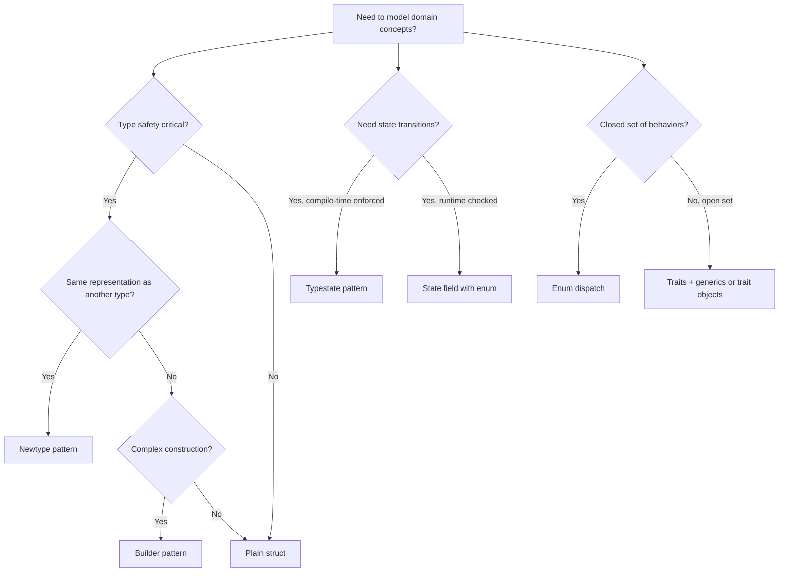

## Newtype Pattern

The newtype pattern wraps an existing type in a tuple struct, creating a distinct type with the same
memory representation. This provides type safety without runtime overhead — the compiler eliminates
the wrapper after optimization.

### Type Safety Through Wrapping

```rust
struct UserId(u64);
struct OrderId(u64);

fn get_user(id: UserId) -> String {
    format!("user_{}", id.0)
}

fn get_order(id: OrderId) -> String {
    format!("order_{}", id.0)
}

let uid = UserId(42);
let oid = OrderId(99);

get_user(uid);
get_order(oid);
// get_user(oid);  // ERROR: expected UserId, found OrderId
```

The newtype pattern prevents accidentally passing an `OrderId` where a `UserId` is expected. Both
are `u64` internally, but the compiler treats them as completely different types.

### Memory Layout

Newtypes have the same size and alignment as the wrapped type:

```rust
struct Millimeters(u32);
struct Meters(u32);

assert_eq!(std::mem::size_of::<Millimeters>(), 4);
assert_eq!(std::mem::size_of::<Meters>(), 4);
assert_eq!(std::mem::align_of::<Millimeters>(), 4);
```

### `impl Deref` for Transparent Access

Implementing `Deref` and `DerefMut` allows the newtype to behave like the wrapped type for method
calls and deref coercion:

```rust
use std::ops::Deref;

struct Wrapper(Vec<String>);

impl Deref for Wrapper {
    type Target = Vec<String>;
    fn deref(&self) -> &Self::Target {
        &self.0
    }
}

let w = Wrapper(vec![String::from("hello")]);
let len = w.len();  // calls Vec::len through deref coercion
assert_eq!(len, 1);
```

:::warning

`Deref` coercion can silently bypass the type safety that the newtype provides. If you implement
`Deref`, callers can use the newtype as if it were the inner type, potentially defeating the purpose
of the wrapper. Only implement `Deref` when you intentionally want this behavior.

:::

### Unit Conversion with Newtypes

```rust
struct Millimeters(u32);
struct Meters(u32);

impl Meters {
    fn to_millimeters(&self) -> Millimeters {
        Millimeters(self.0 * 1000)
    }
}

impl Millimeters {
    fn to_meters(self) -> Meters {
        Meters(self.0 / 1000)
    }
}

let distance = Meters(5);
let mm = distance.to_millimeters();
assert_eq!(mm.0, 5000);
```

### `#[repr(transparent)]`

The `transparent` representation guarantees that the newtype has the same layout as the inner type.
This is important for FFI:

```rust
#[repr(transparent)]
struct NonZeroU32(u32);

impl NonZeroU32 {
    fn new(value: u32) -> Option<Self> {
        if value != 0 {
            Some(NonZeroU32(value))
        } else {
            None
        }
    }

    fn get(&self) -> u32 {
        self.0
    }
}
```

## Builder Pattern

The builder pattern constructs complex objects step by step, enforcing required fields at compile
time when using the typestate pattern.

### Basic Builder

```rust
struct HttpRequest {
    method: String,
    url: String,
    headers: Vec<(String, String)>,
    body: Option<String>,
    timeout_ms: u64,
}

struct HttpRequestBuilder {
    method: String,
    url: Option<String>,
    headers: Vec<(String, String)>,
    body: Option<String>,
    timeout_ms: u64,
}

impl HttpRequestBuilder {
    fn new(method: &str) -> Self {
        HttpRequestBuilder {
            method: method.to_string(),
            url: None,
            headers: vec![],
            body: None,
            timeout_ms: 30_000,
        }
    }

    fn url(mut self, url: &str) -> Self {
        self.url = Some(url.to_string());
        self
    }

    fn header(mut self, key: &str, value: &str) -> Self {
        self.headers.push((key.to_string(), value.to_string()));
        self
    }

    fn body(mut self, body: &str) -> Self {
        self.body = Some(body.to_string());
        self
    }

    fn timeout(mut self, ms: u64) -> Self {
        self.timeout_ms = ms;
        self
    }

    fn build(self) -> Result<HttpRequest, String> {
        let url = self.url.ok_or("url is required")?;
        Ok(HttpRequest {
            method: self.method,
            url,
            headers: self.headers,
            body: self.body,
            timeout_ms: self.timeout_ms,
        })
    }
}

let request = HttpRequestBuilder::new("GET")
    .url("https://example.com/api")
    .header("Content-Type", "application/json")
    .header("Authorization", "Bearer token")
    .timeout(5000)
    .build()?;
```

### Typed Builder with `derive_builder`

```toml
[dependencies]
derive_builder = "0.20"
```

```rust
use derive_builder::Builder;

#[derive(Builder)]
struct Config {
    #[builder(default = "8080")]
    port: u16,

    #[builder(default = r#"String::from("localhost")"#)]
    host: String,

    #[builder(setter(into), default = "4")]
    workers: usize,

    database_url: String,
}

let config = ConfigBuilder::default()
    .database_url("postgres://localhost/mydb")
    .port(3000)
    .build()?;
```

## Typestate Pattern

The typestate pattern encodes state machines in the type system. Each state is a different type, and
state transitions are represented as methods that consume the current state and return the next
state. Invalid transitions are compile errors.

### State Machine Example

```rust
struct Unconfigured;
struct Configured { host: String, port: u16 }
struct Connected { host: String, port: u16, stream: std::net::TcpStream }
struct Authenticated { host: String, port: u16, stream: std::net::TcpStream, token: String }

struct Client<State> {
    state: State,
}

impl Client<Unconfigured> {
    fn new() -> Self {
        Client { state: Unconfigured }
    }

    fn configure(self, host: &str, port: u16) -> Client<Configured> {
        Client {
            state: Configured {
                host: host.to_string(),
                port,
            },
        }
    }
}

impl Client<Configured> {
    fn connect(self) -> Result<Client<Connected>, std::io::Error> {
        let stream = std::net::TcpStream::connect((self.state.host.as_str(), self.state.port))?;
        Ok(Client {
            state: Connected {
                host: self.state.host,
                port: self.state.port,
                stream,
            },
        })
    }
}

impl Client<Connected> {
    fn authenticate(self, username: &str, password: &str) -> Result<Client<Authenticated>, String> {
        let token = format!("token_for_{}", username);
        Ok(Client {
            state: Authenticated {
                host: self.state.host,
                port: self.state.port,
                stream: self.state.stream,
                token,
            },
        })
    }
}

impl Client<Authenticated> {
    fn send_request(&self, path: &str) -> String {
        format!("GET {} HTTP/1.1\nAuthorization: Bearer {}\nHost: {}\n",
            path, self.state.token, self.state.host)
    }
}

let client = Client::new()
    .configure("example.com", 443)
    .connect()?
    .authenticate("admin", "secret")?;

let request = client.send_request("/api/data");
```

The type system prevents calling `send_request` before `authenticate`, or `authenticate` before
`connect`. Each method consumes `self` and returns a new state, making the state transition
irreversible and type-safe.

### Compile-Time Enforcement

Attempting an invalid transition is a compile error:

```rust
let client = Client::new();
// client.send_request("/api");  // ERROR: method not found on Client<Unconfigured>
// client.authenticate("a", "b");  // ERROR: method not found on Client<Unconfigured>
```

## Enum Dispatch

Enum dispatch uses enums to implement polymorphism without trait objects, providing static dispatch
and better performance:

```rust
enum Shape {
    Circle { radius: f64 },
    Rectangle { width: f64, height: f64 },
    Triangle { base: f64, height: f64 },
}

impl Shape {
    fn area(&self) -> f64 {
        match self {
            Shape::Circle { radius } => std::f64::consts::PI * radius * radius,
            Shape::Rectangle { width, height } => width * height,
            Shape::Triangle { base, height } => 0.5 * base * height,
        }
    }
}
```

### Enum Dispatch vs Trait Objects

| Property           | Enum Dispatch               | Trait Objects (`dyn Trait`)  |
| ------------------ | --------------------------- | ---------------------------- |
| Dispatch mechanism | Static (branch table)       | Dynamic (vtable indirection) |
| Binary size        | One copy per variant        | Shared vtable                |
| Extensibility      | Closed (all variants known) | Open (any implementor)       |
| Performance        | Predictable, inlinable      | Indirect call, not inlinable |
| Type information   | Full at compile time        | Erased at runtime            |

### When to Use Each

Use **enum dispatch** when:

- The set of variants is known and closed
- Performance is critical (hot paths, game loops)
- You need to match on specific variants

Use **trait objects** when:

- The set of types is open (plugins, user-defined types)
- You need heterogeneous collections
- Binary size is more important than peak performance

## Zero-Sized Types (ZSTs)

Zero-sized types occupy no memory at runtime. They are useful as marker types, phantom types, and
for compile-time programming.

### Unit Structs

```rust
struct Marker;
struct Benchmark;

assert_eq!(std::mem::size_of::<Marker>(), 0);
assert_eq!(std::mem::size_of::<Benchmark>(), 0);
```

### PhantomData

`PhantomData<T>` is a zero-sized type that makes the compiler behave as if the struct contains a
`T`, even though it does not. This is useful for variance and drop check annotations:

```rust
use std::marker::PhantomData;

struct Id<T> {
    value: u64,
    _marker: PhantomData<T>,
}

let id: Id<String> = Id { value: 42, _marker: PhantomData };
let id2: Id<Vec<u8>> = Id { value: 43, _marker: PhantomData };

assert_eq!(std::mem::size_of::<Id<String>>(), 8);
assert_eq!(std::mem::size_of::<Id<Vec<u8>>>(), 8);
```

`PhantomData<T>` affects variance: `Id<T>` is covariant in `T` because `PhantomData<T>` is covariant
in `T`.

### ZST in Generics

ZSTs enable powerful generic programming patterns. A `Vec<()>` has zero per-element storage cost:

```rust
let v: Vec<()> = vec![(); 1_000_000];
assert_eq!(v.len(), 1_000_000);
// v occupies only the Vec metadata (24 bytes), no element storage
```

### `()` as a Default Type

The unit type `()` is a ZST and is used as a default or placeholder type:

```rust
fn process<T>(_: T) -> T {
    unimplemented!()
}

let result = process(());  // T = (), zero overhead
```

## Struct Update Syntax

Create a new struct from an existing one, overriding specific fields:

```rust
struct Point {
    x: f64,
    y: f64,
    z: f64,
}

let p1 = Point { x: 1.0, y: 2.0, z: 3.0 };
let p2 = Point { y: 5.0, ..p1 };
// p2.x == 1.0, p2.y == 5.0, p2.z == 3.0
```

Struct update syntax moves the remaining fields. After `..p1`, `p1` is partially moved:

```rust
let p1 = Point { x: 1.0, y: 2.0, z: 3.0 };
let p2 = Point { y: 5.0, ..p1 };
// println!("{:?}", p1);  // ERROR: p1 partially moved
println!("{}", p1.x);  // ERROR: x was moved into p2
```

:::warning

Struct update syntax moves non-`Copy` fields. If the struct contains `String`, `Vec`, or other
heap-allocated types, those are moved (not copied) into the new struct. After the spread, the
original struct is no longer usable in its entirety.

:::

## Destructuring

### Destructuring in `let` Bindings

```rust
struct Point { x: f64, y: f64 }
let p = Point { x: 1.0, y: 2.0 };
let Point { x, y } = p;
assert_eq!(x, 1.0);
assert_eq!(y, 2.0);

let Point { x: a, y: b } = p;
assert_eq!(a, 1.0);
assert_eq!(b, 2.0);

let Point { x, .. } = p;
assert_eq!(x, 1.0);
```

### Destructuring in Function Parameters

```rust
fn swap((mut x, mut y): (i32, i32)) -> (i32, i32) {
    std::mem::swap(&mut x, &mut y);
    (x, y)
}

assert_eq!(swap((1, 2)), (2, 1));
```

### Destructuring Enums in Function Parameters

```rust
enum Result<T, E> {
    Ok(T),
    Err(E),
}

fn unwrap_or<T, E>(result: Result<T, E>, default: T) -> T {
    match result {
        Result::Ok(value) => value,
        Result::Err(_) => default,
    }
}
```

## Tuple Structs as One-Field Wrappers

Tuple structs with a single field are the standard form of the newtype pattern:

```rust
struct Email(String);
struct PhoneNumber(String);

fn send_email(to: Email, body: &str) {
    println!("sending to {}: {}", to.0, body);
}

let email = Email(String::from("user@example.com"));
send_email(email, "hello");
// send_email(PhoneNumber(String::from("555-1234")), "hello");  // ERROR
```

### Deriving Traits on Newtypes

```rust
#[derive(Debug, Clone, PartialEq, Eq, Hash)]
struct UserId(u64);

#[derive(Debug, Clone, PartialEq, Eq, Hash)]
struct OrderId(u64);

let uid = UserId(42);
let oid = OrderId(42);
assert_ne!(uid, oid);  // different types, even though inner values are equal
```

## Marker Types

Marker types carry no data but encode information in the type system:

```rust
struct Kilometers;
struct Miles;

struct Distance<Unit>(f64, std::marker::PhantomData<Unit>);

fn add_km(a: Distance<Kilometers>, b: Distance<Kilometers>) -> Distance<Kilometers> {
    Distance(a.0 + b.0, PhantomData)
}

fn add_mi(a: Distance<Miles>, b: Distance<Miles>) -> Distance<Miles> {
    Distance(a.0 + b.0, PhantomData)
}
```

## Enums with Associated Data

Enums can carry different data payloads per variant, making them algebraic data types:

```rust
enum Expr {
    Literal(i64),
    Add(Box<Expr>, Box<Expr>),
    Mul(Box<Expr>, Box<Expr>),
    Var(String),
}

fn eval(expr: &Expr, env: &std::collections::HashMap<String, i64>) -> i64 {
    match expr {
        Expr::Literal(n) => *n,
        Expr::Add(l, r) => eval(l, env) + eval(r, env),
        Expr::Mul(l, r) => eval(l, env) * eval(r, env),
        Expr::Var(name) => env.get(name).copied().unwrap_or(0),
    }
}
```

### Recursive Enums Require Boxing

Without `Box`, recursive enums would be infinitely sized:

```rust
// This does NOT compile — infinite size
// enum Expr { Add(Expr, Expr) }

// Fix: Box the recursive variants
enum Expr {
    Add(Box<Expr>, Box<Expr>),  // pointer-sized (8 bytes)
}
```

## `#[non_exhaustive]` Enums

The `#[non_exhaustive]` attribute prevents downstream crates from constructing the enum or matching
exhaustively on it. This allows you to add variants in a semver-compatible way:

```rust
#[non_exhaustive]
pub enum ApiVersion {
    V1,
    V2,
    V3,
}

// In a downstream crate:
match version {
    ApiVersion::V1 => println!("v1"),
    ApiVersion::V2 => println!("v2"),
    _ => println!("unknown version"),  // required because of #[non_exhaustive]
}

// ApiVersion::V1  // ERROR: cannot construct variants of #[non_exhaustive] enum
```

## Advanced Enum Techniques

### Nested Enums

Enums can contain other enums, enabling expressive type hierarchies:

```rust
enum Value {
    Null,
    Bool(bool),
    Number(f64),
    String(String),
    Array(Vec<Value>),
    Object(Vec<(String, Value)>),
}

fn parse_value(input: &str) -> Value {
    if input == "null" {
        Value::Null
    } else if input == "true" {
        Value::Bool(true)
    } else if let Ok(n) = input.parse::<f64>() {
        Value::Number(n)
    } else {
        Value::String(input.to_string())
    }
}
```

### Enum Methods with State Transitions

```rust
enum ConnectionState {
    Disconnected,
    Connecting { addr: String, attempts: u32 },
    Connected { addr: String, stream: std::net::TcpStream },
    Failed { addr: String, error: String },
}

impl ConnectionState {
    fn connect(addr: &str) -> Self {
        ConnectionState::Connecting {
            addr: addr.to_string(),
            attempts: 1,
        }
    }

    fn retry(&mut self) {
        if let ConnectionState::Connecting { attempts, .. } = self {
            *attempts += 1;
        }
    }

    fn is_connected(&self) -> bool {
        matches!(self, ConnectionState::Connected { .. })
    }
}
```

### Enum Iteration

Enums do not implement `Iterator` by default. Use a helper to iterate over variants:

```rust
#[derive(Debug, Clone, Copy)]
enum Color {
    Red,
    Green,
    Blue,
}

impl Color {
    fn all() -> &'static [Color] {
        &[Color::Red, Color::Green, Color::Blue]
    }
}

for color in Color::all() {
    println!("{:?}", color);
}
```

For exhaustive iteration, use the `strum` crate's `EnumIter` derive macro:

```toml
[dependencies]
strum = "0.26"
strum_macros = "0.26"
```

```rust
use strum::IntoEnumIterator;
use strum_macros::EnumIter;

#[derive(EnumIter, Debug)]
enum Direction {
    North,
    East,
    South,
    West,
}

for dir in Direction::iter() {
    println!("{:?}", dir);
}
```

## Generic Structs with Trait Bounds

### Conditional Method Implementation

You can implement methods only for specific trait bounds:

```rust
struct Container<T> {
    data: T,
}

impl<T: std::fmt::Display> Container<T> {
    fn display(&self) {
        println!("{}", self.data);
    }
}

impl<T: std::fmt::Debug> Container<T> {
    fn debug(&self) {
        println!("{:?}", self.data);
    }
}

let c1 = Container { data: 42 };
c1.display();
c1.debug();

let c2 = Container { data: "hello" };
c2.display();
c2.debug();
```

## Struct Composition

### Composition Over Inheritance

Rust has no inheritance. Composition is the primary mechanism for code reuse:

```rust
struct Engine {
    horsepower: u32,
    fuel_type: String,
}

struct Wheels {
    count: u8,
    diameter_inches: u16,
}

struct Vehicle {
    engine: Engine,
    wheels: Wheels,
    make: String,
    model: String,
}

impl Vehicle {
    fn new(make: &str, model: &str, hp: u32, fuel: &str, wheel_count: u8, wheel_diameter: u16) -> Self {
        Vehicle {
            engine: Engine {
                horsepower: hp,
                fuel_type: fuel.to_string(),
            },
            wheels: Wheels {
                count: wheel_count,
                diameter_inches: wheel_diameter,
            },
            make: make.to_string(),
            model: model.to_string(),
        }
    }

    fn describe(&self) {
        println!("{} {} with {}hp {} engine and {}x{}\" wheels",
            self.make, self.model,
            self.engine.horsepower, self.engine.fuel_type,
            self.wheels.count, self.wheels.diameter_inches);
    }
}
```

### Delegation via `Deref`

```rust
use std::ops::Deref;

struct Inner {
    value: i32,
}

impl Inner {
    fn compute(&self) -> i32 {
        self.value * 2
    }
}

struct Outer {
    inner: Inner,
    extra: String,
}

impl Deref for Outer {
    type Target = Inner;
    fn deref(&self) -> &Self::Target {
        &self.inner
    }
}

let outer = Outer {
    inner: Inner { value: 21 },
    extra: String::from("metadata"),
};

assert_eq!(outer.compute(), 42);  // delegated via Deref
```

## Smart Pointer Patterns as Struct Wrappers

### `Box` for Recursive Types

```rust
enum Expr {
    Literal(i64),
    Add(Box<Expr>, Box<Expr>),
    Mul(Box<Expr>, Box<Expr>),
}

fn eval(expr: &Expr) -> i64 {
    match expr {
        Expr::Literal(n) => *n,
        Expr::Add(l, r) => eval(l) + eval(r),
        Expr::Mul(l, r) => eval(l) * eval(r),
    }
}

let expr = Expr::Add(
    Box::new(Expr::Literal(3)),
    Box::new(Expr::Mul(
        Box::new(Expr::Literal(4)),
        Box::new(Expr::Literal(5)),
    )),
);

assert_eq!(eval(&expr), 23);
```

### `Rc` for Shared Ownership

```rust
use std::rc::Rc;

struct Node {
    value: i32,
    children: Vec<Rc<Node>>,
}

let leaf = Rc::new(Node { value: 1, children: vec![] });
let branch = Rc::new(Node {
    value: 2,
    children: vec![Rc::clone(&leaf)],
});

assert_eq!(Rc::strong_count(&leaf), 2);
```

## Serde Integration Patterns

### Rename and Alias

```rust
use serde::{Serialize, Deserialize};

#[derive(Serialize, Deserialize)]
struct Config {
    #[serde(rename = "type")]
    config_type: String,

    #[serde(alias = "hostname")]
    host: String,

    #[serde(default = "default_port")]
    port: u16,
}

fn default_port() -> u16 { 8080 }
```

### Tagged Enums

```rust
use serde::{Serialize, Deserialize};

#[derive(Serialize, Deserialize)]
#[serde(tag = "type")]
enum Message {
    Request { id: u64, method: String },
    Response { id: u64, status: u16 },
    Error { id: u64, message: String },
}
```

## Common Pitfalls

1. **Newtype field access verbosity.** Accessing the inner value requires `.0`, which is not
   descriptive. Implement methods or `Deref` to provide a cleaner API, but be aware that `Deref`
   weakens type safety.

2. **Builder pattern forgetting required fields.** A basic builder that validates in `build()` only
   catches missing fields at runtime. Use the typestate pattern to enforce required fields at
   compile time.

3. **Enum size explosion.** An enum's size is the size of its largest variant plus the discriminant.
   If one variant is much larger than the others, box it: `Large(Box<String>)` instead of
   `Large(String)`.

4. **Typestate pattern and partial moves.** The typestate pattern consumes `self` in each
   transition. If you need to inspect the state before transitioning, clone or borrow the relevant
   fields before calling the transition method.

5. **`#[non_exhaustive]` on structs.** `#[non_exhaustive]` on a struct prevents downstream crates
   from constructing it and from fully destructuring it (the `..` pattern is required). Provide a
   constructor function to allow construction.

6. **`PhantomData` affecting drop order.** `PhantomData<T>` makes the compiler treat the struct as
   if it owns a `T`. If `T` has a destructor, the compiler will require the struct to live no longer
   than `T`. Use `PhantomData<*const T>` or `PhantomData<fn() -> T>` to change variance without
   affecting the drop check.

7. **Struct update syntax with mutable borrows.** `Struct { ..other }` moves fields. If `other` is
   borrowed, you cannot spread from it. Clone the struct first or use individual field copies.

8. **Overusing enum dispatch.** Enum dispatch requires all variants to be known at compile time. If
   you need extensibility (plugins, user-defined types), use trait objects or generics.

9. **ZST edge cases.** While ZSTs have zero size, they are not "no type." A function taking `()` as
   a parameter still has a calling convention. A `Vec<()>` still has length and capacity metadata.
   ZSTs are real types with real semantics.

10. **`repr(transparent)` with multiple fields.** `repr(transparent)` requires exactly one non-zero-
    sized field. If your wrapper has multiple fields, the compiler will reject it. Use a single
    field wrapper or a different `repr` attribute.

## Pattern Decision Guide


