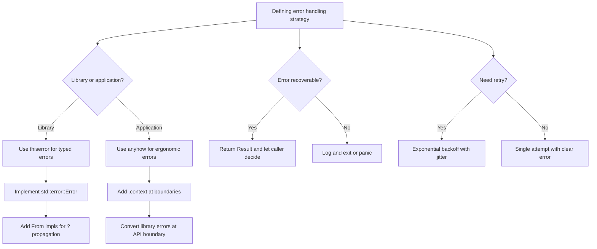

## Error Design Philosophy

Rust treats errors as values, not exceptions. This is a fundamental design choice: errors are not
special control flow mechanisms that can jump across function boundaries. They are ordinary values
that propagate through the type system via `Result<T, E>`. This makes error paths explicit and force
the programmer to handle them.

The core principle: **make error states unrepresentable where possible, and where they are
representable, make them unignorable.**

### Errors as Values vs Exceptions

In exception-based languages (Java, Python, C++), error handling is opt-in — you can ignore
exceptions and they propagate implicitly. In Rust, `Result` forces you to acknowledge errors at
every level of the call stack. The `?` operator makes propagation ergonomic, but the type system
still tracks the error type.

```rust
// Every error is visible in the type signature
fn read_config(path: &str) -> Result<Config, io::Error> { ... }
fn parse_config(content: &str) -> Result<Config, serde_json::Error> { ... }
fn validate_config(config: &Config) -> Result<(), ValidationError> { ... }
```

## Defining Error Types

### Enum-Based Error Types

The most common approach is an enum with a variant for each error category:

```rust
use std::fmt;

#[derive(Debug)]
enum AppError {
    Io(std::io::Error),
    Parse(std::num::ParseIntError),
    Validation(String),
    NotFound(String),
    PermissionDenied(String),
    Internal(String),
}

impl fmt::Display for AppError {
    fn fmt(&self, f: &mut fmt::Formatter) -> fmt::Result {
        match self {
            AppError::Io(e) => write!(f, "I/O error: {}", e),
            AppError::Parse(e) => write!(f, "parse error: {}", e),
            AppError::Validation(msg) => write!(f, "validation error: {}", msg),
            AppError::NotFound(msg) => write!(f, "not found: {}", msg),
            AppError::PermissionDenied(msg) => write!(f, "permission denied: {}", msg),
            AppError::Internal(msg) => write!(f, "internal error: {}", msg),
        }
    }
}

impl std::error::Error for AppError {
    fn source(&self) -> Option<&(dyn std::error::Error + 'static)> {
        match self {
            AppError::Io(e) => Some(e),
            AppError::Parse(e) => Some(e),
            _ => None,
        }
    }
}
```

### `From` Implementations for `?` Propagation

Each `From` implementation enables the `?` operator to automatically convert the source error type
into your error type:

```rust
impl From<std::io::Error> for AppError {
    fn from(e: std::io::Error) -> Self {
        AppError::Io(e)
    }
}

impl From<std::num::ParseIntError> for AppError {
    fn from(e: std::num::ParseIntError) -> Self {
        AppError::Parse(e)
    }
}

impl From<serde_json::Error> for AppError {
    fn from(e: serde_json::Error) -> Self {
        AppError::Parse(e)
    }
}
```

With these implementations, the `?` operator handles conversions automatically:

```rust
fn load_config(path: &str) -> Result<Config, AppError> {
    let content = std::fs::read_to_string(path)?;  // io::Error -> AppError::Io
    let config: Config = serde_json::from_str(&content)?;  // serde_json::Error -> AppError::Parse
    Ok(config)
}
```

## Error Chaining

### `std::error::Error::source()`

The `source()` method enables walking an error chain. Each error can optionally return a reference
to the underlying error that caused it:

```rust
use std::error::Error;
use std::fmt;

#[derive(Debug)]
struct DatabaseError {
    message: String,
    source: sqlx::Error,
}

impl fmt::Display for DatabaseError {
    fn fmt(&self, f: &mut fmt::Formatter) -> fmt::Result {
        write!(f, "{}: {}", self.message, self.source)
    }
}

impl Error for DatabaseError {
    fn source(&self) -> Option<&(dyn Error + 'static)> {
        Some(&self.source)
    }
}
```

Walking the chain:

```rust
fn print_error_chain(err: &dyn Error) {
    eprintln!("error: {}", err);
    let mut source = err.source();
    while let Some(cause) = source {
        eprintln!("  caused by: {}", cause);
        source = cause.source();
    }
}
```

### Backtrace Support (Rust 1.65+)

```rust
use std::backtrace::Backtrace;
use std::fmt;

#[derive(Debug)]
struct DetailedError {
    message: String,
    backtrace: Backtrace,
}

impl fmt::Display for DetailedError {
    fn fmt(&self, f: &mut fmt::Formatter) -> fmt::Result {
        write!(f, "{}\nBacktrace:\n{}", self.message, self.backtrace)
    }
}
```

`Backtrace::capture()` captures the current stack trace. It is available when `RUST_BACKTRACE=1` is
set. The backtrace is only captured if an environment variable enables it, so there is no overhead
in production by default.

## `thiserror` vs `anyhow` Decision Framework

### Use `thiserror` for Libraries

Libraries need precise, typed error types that callers can match on:

```rust
use thiserror::Error;

#[derive(Error, Debug)]
pub enum DatabaseError {
    #[error("connection failed: {0}")]
    Connection(#[from] sqlx::Error),

    #[error("query failed: {query}")]
    Query { query: String, #[source] source: sqlx::Error },

    #[error("row not found: table={table}, key={key}")]
    NotFound { table: String, key: String },

    #[error("timeout after {timeout_ms}ms")]
    Timeout { timeout_ms: u64 },
}
```

### Use `anyhow` for Applications

Applications need ergonomic error propagation with context, not precise error matching:

```rust
use anyhow::{Context, Result};

fn load_config(path: &str) -> Result<Config> {
    let content = std::fs::read_to_string(path)
        .with_context(|| format!("failed to read config file: {}", path))?;

    let config: Config = serde_json::from_str(&content)
        .context("failed to parse config as JSON")?;

    Ok(config)
}
```

### The Hybrid Approach

Use `thiserror` in library crates and `anyhow` in the application binary that consumes them:

```
my-project/
├── crates/
│   ├── core/         # uses thiserror for precise error types
│   │   └── src/
│   │       └── error.rs
│   └── cli/          # uses anyhow for ergonomic error handling
│       └── src/
│           └── main.rs
```

```rust
// crates/core/src/error.rs
use thiserror::Error;

#[derive(Error, Debug)]
pub enum CoreError {
    #[error("IO error: {0}")]
    Io(#[from] std::io::Error),
    #[error("parse error: {0}")]
    Parse(#[from] serde_json::Error),
}

// crates/cli/src/main.rs
use anyhow::Result;
use my_core::{Config, CoreError};

fn main() -> Result<()> {
    let config = load_config("config.toml")?;
    println!("config: {:?}", config);
    Ok(())
}

fn load_config(path: &str) -> Result<Config> {
    let content = std::fs::read_to_string(path)
        .map_err(|e| anyhow::anyhow!("failed to read {}: {}", path, e))?;
    let config: Config = serde_json::from_str(&content)?;
    Ok(config)
}
```

## Retry Patterns

### Exponential Backoff

```rust
use std::time::Duration;
use std::thread;

fn with_retry<F, T, E>(max_retries: usize, mut f: F) -> Result<T, E>
where
    F: FnMut() -> Result<T, E>,
    E: std::fmt::Debug,
{
    let mut attempt = 0;
    loop {
        match f() {
            Ok(value) => return Ok(value),
            Err(e) => {
                attempt += 1;
                if attempt >= max_retries {
                    return Err(e);
                }
                let delay = Duration::from_millis(100 * 2u64.pow(attempt as u32 - 1));
                thread::sleep(delay);
            }
        }
    }
}
```

### Retry with Specific Error Types

```rust
use std::io;

fn fetch_with_retry(url: &str, max_retries: usize) -> Result<String, io::Error> {
    let mut retries = 0;
    loop {
        match std::fs::read_to_string(url) {
            Ok(content) => return Ok(content),
            Err(e) if e.kind() == io::ErrorKind::NotFound => return Err(e),
            Err(e) => {
                retries += 1;
                if retries >= max_retries {
                    return Err(e);
                }
                let delay = std::time::Duration::from_millis(100 * (1 << retries));
                std::thread::sleep(delay);
            }
        }
    }
}
```

### Async Retry with `tokio`

```rust
use tokio::time::{sleep, Duration};

async fn async_retry<F, Fut, T, E>(
    max_retries: usize,
    f: F,
) -> Result<T, E>
where
    F: Fn() -> Fut,
    Fut: std::future::Future<Output = Result<T, E>>,
    E: std::fmt::Debug,
{
    let mut attempt = 0;
    loop {
        match f().await {
            Ok(value) => return Ok(value),
            Err(e) => {
                attempt += 1;
                if attempt >= max_retries {
                    return Err(e);
                }
                let delay = Duration::from_millis(100 * 2u64.pow(attempt as u32 - 1));
                sleep(delay).await;
            }
        }
    }
}
```

:::warning

Retry logic must be idempotent. If the operation has side effects (e.g., creating a database
record), retrying may create duplicates. Design your operations to be idempotent before adding retry
logic. Use idempotency keys for non-idempotent operations.

:::

## Graceful Degradation

### Fallback Values

```rust
fn load_config(path: &str) -> Config {
    std::fs::read_to_string(path)
        .ok()
        .and_then(|s| serde_json::from_str(&s).ok())
        .unwrap_or_else(|| Config::default())
}
```

### Partial Results

```rust
fn load_plugins(plugins: &[&str]) -> Vec<(&str, Result<Plugin, PluginError>)> {
    plugins
        .iter()
        .map(|&name| {
            let result = Plugin::load(name);
            (name, result)
        })
        .collect()
}

// Caller decides how to handle partial failures
let results = load_plugins(&["auth", "logging", "metrics"]);
for (name, result) in &results {
    match result {
        Ok(_) => println!("{} loaded successfully", name),
        Err(e) => eprintln!("{} failed to load: {}", name, e),
    }
}
```

### Circuit Breaker Pattern

```rust
use std::time::{Duration, Instant};
use std::sync::atomic::{AtomicBool, Ordering};
use std::sync::Mutex;

struct CircuitBreaker {
    failure_count: Mutex<usize>,
    last_failure: Mutex<Option<Instant>>,
    is_open: AtomicBool,
    failure_threshold: usize,
    reset_timeout: Duration,
}

impl CircuitBreaker {
    fn new(threshold: usize, timeout: Duration) -> Self {
        CircuitBreaker {
            failure_count: Mutex::new(0),
            last_failure: Mutex::new(None),
            is_open: AtomicBool::new(false),
            failure_threshold: threshold,
            reset_timeout: timeout,
        }
    }

    fn is_allowed(&self) -> bool {
        if !self.is_open.load(Ordering::Relaxed) {
            return true;
        }

        let last = *self.last_failure.lock().unwrap();
        if let Some(instant) = last {
            if instant.elapsed() > self.reset_timeout {
                self.is_open.store(false, Ordering::Relaxed);
                *self.failure_count.lock().unwrap() = 0;
                return true;
            }
        }

        false
    }

    fn record_success(&self) {
        *self.failure_count.lock().unwrap() = 0;
        self.is_open.store(false, Ordering::Relaxed);
    }

    fn record_failure(&self) {
        let mut count = self.failure_count.lock().unwrap();
        *count += 1;
        if *count >= self.failure_threshold {
            self.is_open.store(true, Ordering::Relaxed);
            *self.last_failure.lock().unwrap() = Some(Instant::now());
        }
    }
}
```

## Context Enrichment

### Adding Context with `anyhow`

```rust
use anyhow::{Context, Result};

fn process_file(path: &str) -> Result<Data> {
    let content = std::fs::read_to_string(path)
        .with_context(|| format!("failed to read file at path: {}", path))?;

    let parsed: Data = serde_json::from_str(&content)
        .context("file content is not valid JSON")?;

    let validated = validate(&parsed)
        .context("data validation failed")?;

    Ok(validated)
}
```

### Custom Context Types

```rust
use std::fmt;

#[derive(Debug)]
struct ContextError<E> {
    context: String,
    source: E,
}

impl<E: std::fmt::Display> fmt::Display for ContextError<E> {
    fn fmt(&self, f: &mut fmt::Formatter) -> fmt::Result {
        write!(f, "{}: {}", self.context, self.source)
    }
}

impl<E: std::error::Error + 'static> std::error::Error for ContextError<E> {
    fn source(&self) -> Option<&(dyn std::error::Error + 'static)> {
        Some(&self.source)
    }
}

trait ResultExt<T, E> {
    fn context(self, msg: &str) -> Result<T, ContextError<E>>;
}

impl<T, E> ResultExt<T, E> for Result<T, E>
where
    E: std::fmt::Display,
{
    fn context(self, msg: &str) -> Result<T, ContextError<E>> {
        self.map_err(|e| ContextError {
            context: msg.to_string(),
            source: e,
        })
    }
}
```

## Error Reporting

### `Display` vs `Debug` vs Custom

```rust
use std::fmt;

#[derive(Debug)]
struct ConfigError {
    field: String,
    reason: String,
    source: Option<std::io::Error>,
}

impl fmt::Display for ConfigError {
    fn fmt(&self, f: &mut fmt::Formatter) -> fmt::Result {
        write!(f, "config field '{}': {}", self.field, self.reason)
    }
}

impl std::error::Error for ConfigError {
    fn source(&self) -> Option<&(dyn std::error::Error + 'static)> {
        self.source.as_ref().map(|e| e as &dyn std::error::Error)
    }
}
```

- `Display`: Human-readable message for end users
- `Debug`: Structured information for developers and logging
- `source()`: Machine-readable error chain for programmatic handling

### Structured Error Reporting

```rust
fn report_error(err: &dyn std::error::Error) {
    eprintln!("Error: {}", err);
    if let Some(source) = err.source() {
        eprintln!("Caused by: {}", source);
    }
    eprintln!("Debug: {:?}", err);
}
```

## Testing Error Paths

### Unit Tests for Errors

```rust
#[cfg(test)]
mod tests {
    use super::*;

    #[test]
    fn test_config_not_found() {
        let result = load_config("/nonexistent/path.toml");
        assert!(result.is_err());
        let err = result.unwrap_err();
        assert!(err.to_string().contains("not found") || err.to_string().contains("No such file"));
    }

    #[test]
    fn test_invalid_json() {
        let result = parse_config("{invalid json");
        assert!(result.is_err());
    }

    #[test]
    fn test_validation_failure() {
        let config = Config { port: 0, host: String::new() };
        let result = validate(&config);
        assert!(result.is_err());
    }

    #[test]
    fn test_retry_eventually_succeeds() {
        let mut attempts = 0;
        let result = with_retry(3, || {
            attempts += 1;
            if attempts < 3 {
                Err("not ready")
            } else {
                Ok("success")
            }
        });
        assert_eq!(result, Ok("success"));
        assert_eq!(attempts, 3);
    }
}
```

### Property-Based Testing for Error Handling

```rust
#[cfg(test)]
mod tests {
    use proptest::prelude::*;

    proptest! {
        #[test]
        fn parse_never_panics(input in "[a-zA-Z0-9 ]{0,1000}") {
            let _ = serde_json::from_str::<serde_json::Value>(&input);
        }
    }
}
```

## Fatal vs Recoverable

### Fatal Errors

Fatal errors indicate that the program cannot continue. Use `panic!` or return an error that the
caller treats as fatal:

```rust
fn main() {
    let config = match load_config("config.toml") {
        Ok(c) => c,
        Err(e) => {
            eprintln!("FATAL: failed to load config: {}", e);
            std::process::exit(1);
        }
    };
}
```

### Recoverable Errors

Recoverable errors are expected failure modes that the program can handle:

```rust
fn handle_request(request: Request) -> Response {
    match process(request) {
        Ok(data) => Response::json(&data),
        Err(AppError::NotFound(msg)) => Response::not_found(&msg),
        Err(AppError::Validation(msg)) => Response::bad_request(&msg),
        Err(AppError::PermissionDenied(msg)) => Response::forbidden(&msg),
        Err(e) => {
            eprintln!("internal error: {}", e);
            Response::internal_error()
        }
    }
}
```

## Common Pitfalls

1. **Over-engineering error types in applications.** In a binary, you rarely need to match on
   specific error variants. Use `anyhow` with `.context()` and avoid large error enums unless you
   have a specific need.

2. **Under-engineering error types in libraries.** Library callers need to distinguish error kinds.
   A single `String` error type or `Box<dyn Error>` prevents callers from handling specific error
   cases. Use `thiserror` to define precise error enums.

3. **Swallowing errors with `let _ =`.** Silently discarding errors hides bugs. At minimum, log the
   error. Use `if let Err(e) = result { log::error!("operation failed: {}", e); }`.

4. **Error types that are not `Send + Sync`.** If your error type contains `Rc` or other
   non-thread-safe types, it cannot be used with `?` in async contexts. Ensure all error fields are
   `Send + Sync`.

5. **Not adding context to errors.** A bare `io::Error` tells you what went wrong but not where or
   why. Use `.context()` (anyhow) or `.map_err()` to add contextual information as errors propagate
   up the call stack.

6. **Retry without backoff.** Retrying immediately after failure can overwhelm the failing service.
   Always use exponential backoff with jitter to distribute retry attempts.

7. **Retry without idempotency.** If the retried operation has side effects, each retry may create
   duplicate side effects. Design operations to be idempotent before adding retry logic.

8. **Panicking in library code.** Libraries should never panic on expected failure modes. Return
   `Err` for invalid input, missing resources, and expected failures. Panics are for internal
   invariant violations only.

9. **`Box<dyn Error>` losing type information.** When you use `Box<dyn Error>` as the error type,
   the caller cannot match on specific variants. This is fine for applications but inappropriate for
   libraries.

10. **Not testing error paths.** Error paths are often less tested than success paths. Write
    explicit tests for each error variant, including edge cases and error chains. Use
    `#[should_panic]` for testing panic conditions and property-based testing for error handling
    robustness.

## Error Strategy Decision Guide



## Advanced Error Patterns

### Error Kind Classification

Organize errors by severity and recoverability:

```rust
use std::fmt;

#[derive(Debug)]
enum ErrorKind {
    Client { code: u16, message: String },
    Server { code: u16, message: String, retry_after: Option<u64> },
    Network { source: std::io::Error, retryable: bool },
    Validation { field: String, message: String },
    Internal { message: String, source: Option<Box<dyn std::error::Error>> },
}

impl ErrorKind {
    fn is_retryable(&self) -> bool {
        match self {
            ErrorKind::Client { .. } => false,
            ErrorKind::Server { retry_after: Some(_), .. } => true,
            ErrorKind::Server { code, .. } => *code >= 500,
            ErrorKind::Network { retryable, .. } => *retryable,
            ErrorKind::Validation { .. } => false,
            ErrorKind::Internal { .. } => false,
        }
    }

    fn user_message(&self) -> String {
        match self {
            ErrorKind::Client { message, .. } => message.clone(),
            ErrorKind::Server { message, .. } => message.clone(),
            ErrorKind::Network { .. } => "network error".to_string(),
            ErrorKind::Validation { message, .. } => message.clone(),
            ErrorKind::Internal { .. } => "internal error".to_string(),
        }
    }
}
```

### Error Reporting Middleware

For web services, implement error reporting as middleware:

```rust
use std::fmt;

#[derive(Debug)]
struct AppError {
    kind: ErrorKind,
    context: String,
    backtrace: Option<std::backtrace::Backtrace>,
}

impl fmt::Display for AppError {
    fn fmt(&self, f: &mut fmt::Formatter) -> fmt::Result {
        write!(f, "[{:?}] {}: {}", self.kind, self.context, self.kind.user_message())
    }
}

impl AppError {
    fn client_error(code: u16, message: &str, context: &str) -> Self {
        AppError {
            kind: ErrorKind::Client { code, message: message.to_string() },
            context: context.to_string(),
            backtrace: std::backtrace::Backtrace::capture().into(),
        }
    }

    fn http_status(&self) -> u16 {
        match &self.kind {
            ErrorKind::Client { code, .. } => *code,
            ErrorKind::Server { code, .. } => *code,
            ErrorKind::Network { .. } => 502,
            ErrorKind::Validation { .. } => 400,
            ErrorKind::Internal { .. } => 500,
        }
    }
}
```

### Error Metrics

Track error rates and types for observability:

```rust
use std::sync::atomic::{AtomicU64, Ordering};

struct ErrorMetrics {
    total_errors: AtomicU64,
    io_errors: AtomicU64,
    parse_errors: AtomicU64,
    validation_errors: AtomicU64,
    timeout_errors: AtomicU64,
}

impl ErrorMetrics {
    fn new() -> Self {
        ErrorMetrics {
            total_errors: AtomicU64::new(0),
            io_errors: AtomicU64::new(0),
            parse_errors: AtomicU64::new(0),
            validation_errors: AtomicU64::new(0),
            timeout_errors: AtomicU64::new(0),
        }
    }

    fn record(&self, error: &AppError) {
        self.total_errors.fetch_add(1, Ordering::Relaxed);
        match &error.kind {
            ErrorKind::Network { .. } => {
                self.io_errors.fetch_add(1, Ordering::Relaxed);
            }
            ErrorKind::Validation { .. } => {
                self.validation_errors.fetch_add(1, Ordering::Relaxed);
            }
            _ => {}
        }
    }

    fn snapshot(&self) -> ErrorMetricsSnapshot {
        ErrorMetricsSnapshot {
            total: self.total_errors.load(Ordering::Relaxed),
            io: self.io_errors.load(Ordering::Relaxed),
            parse: self.parse_errors.load(Ordering::Relaxed),
            validation: self.validation_errors.load(Ordering::Relaxed),
            timeout: self.timeout_errors.load(Ordering::Relaxed),
        }
    }
}

struct ErrorMetricsSnapshot {
    total: u64,
    io: u64,
    parse: u64,
    validation: u64,
    timeout: u64,
}
```

### Combining Multiple Errors

When an operation can produce multiple independent errors, collect them:

```rust
#[derive(Debug)]
struct MultiError {
    errors: Vec<Box<dyn std::error::Error + Send + Sync>>,
}

impl MultiError {
    fn new() -> Self {
        MultiError { errors: vec![] }
    }

    fn push<E: std::error::Error + Send + Sync + 'static>(&mut self, error: E) {
        self.errors.push(Box::new(error));
    }

    fn is_empty(&self) -> bool {
        self.errors.is_empty()
    }
}

impl std::fmt::Display for MultiError {
    fn fmt(&self, f: &mut fmt::Formatter) -> fmt::Result {
        for (i, err) in self.errors.iter().enumerate() {
            if i > 0 {
                write!(f, "\n")?;
            }
            write!(f, "{}. {}", i + 1, err)?;
        }
        Ok(())
    }
}

impl std::error::Error for MultiError {
    fn source(&self) -> Option<&(dyn std::error::Error + 'static)> {
        self.errors.first().map(|e| e.as_ref())
    }
}
```

### Error Conversion at Module Boundaries

Convert errors at module boundaries to maintain a clean internal API while providing rich errors at
the external boundary:

```rust
mod database {
    use thiserror::Error;

    #[derive(Error, Debug)]
    pub enum DbError {
        #[error("connection failed: {0}")]
        Connection(String),
        #[error("query error: {0}")]
        Query(String),
        #[error("not found: {table}/{key}")]
        NotFound { table: String, key: String },
    }

    pub fn get_user(id: u64) -> Result<User, DbError> {
        // ...
        Err(DbError::NotFound { table: "users".into(), key: id.to_string() })
    }
}

mod api {
    use anyhow::{Context, Result};

    pub fn handle_get_user(id: u64) -> Result<User> {
        crate::database::get_user(id)
            .map_err(|e| anyhow::anyhow!("database error for user {}: {}", id, e))
            .context("failed to handle get_user request")
    }
}
```

### Error Context Layers

Build up error context as errors propagate through layers:

```rust
fn process_order(order_id: u64) -> Result<Order> {
    let order = fetch_order(order_id)
        .context(format!("failed to fetch order {}", order_id))?;

    let validated = validate_order(&order)
        .context(format!("order {} failed validation", order_id))?;

    let payment = process_payment(&validated)
        .context(format!("payment processing failed for order {}", order_id))?;

    Ok(Order { validated, payment })
}
```

Each `.context()` call adds a layer to the error chain, making it easy to trace the error back to
its origin:

```
Error: payment processing failed for order 42

Caused by:
    0: order 42 failed validation
    1: invalid shipping address
```

### Structured Error Logging

```rust
fn log_error(error: &anyhow::Error) {
    log::error!(
        "error: {} | sources: {} | backtrace: {}",
        error,
        error.chain()
            .skip(1)
            .map(|e| e.to_string())
            .collect::<Vec<_>>()
            .join(", "),
        error.backtrace()
    );
}
```
