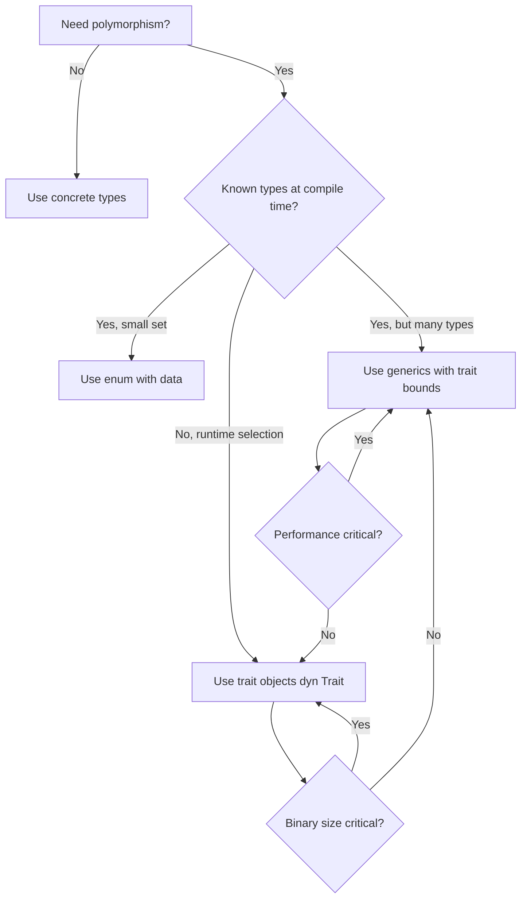

## Trait Definition and Implementation

Traits are Rust's answer to interfaces, type classes, and concepts. They define shared behavior that
types can implement. Unlike inheritance, traits are composable — a type can implement any number of
traits.

### Defining a Trait

```rust
trait Summary {
    fn summarize(&self) -> String;

    fn preview(&self) -> String {
        let full = self.summarize();
        if full.len() > 50 {
            format!("{}...", &full[..50])
        } else {
            full
        }
    }
}
```

`summarize` is a **required method** — every type implementing `Summary` must provide it. `preview`
is a **default method** — types can override it, but if they do not, the default implementation is
used.

### Implementing a Trait

```rust
struct Article {
    title: String,
    content: String,
}

impl Summary for Article {
    fn summarize(&self) -> String {
        format!("{}: {}", self.title, self.content)
    }
}

struct Tweet {
    username: String,
    text: String,
}

impl Summary for Tweet {
    fn summarize(&self) -> String {
        format!("@{}: {}", self.username, self.text)
    }
}
```

### Orphan Rule

You can only implement a trait for a type if either the trait or the type is defined in your crate.
You cannot implement `Display` for `Vec<T>` (both are from the standard library) in your own crate.
This prevents coherence issues — two crates could implement the same trait for the same type with
different behavior.

Workarounds:

- The **newtype pattern**: wrap `Vec<T>` in your own struct and implement the trait on the wrapper
- Local traits: define your own trait and implement it for `Vec<T>`

```rust
struct MyVec(Vec<i32>);

impl std::fmt::Display for MyVec {
    fn fmt(&self, f: &mut std::fmt::Formatter) -> std::fmt::Result {
        write!(f, "[{}]", self.0.iter().map(|n| n.to_string()).collect::<Vec<_>>().join(", "))
    }
}
```

## Default Methods

Default methods can call required methods, allowing the implementing type to provide a single method
and get additional behavior for free:

```rust
trait Processor {
    fn process(&self, data: &str) -> String;

    fn process_and_log(&self, data: &str) -> String {
        println!("processing: {}", data);
        let result = self.process(data);
        println!("result: {}", result);
        result
    }
}

struct ToUpper;

impl Processor for ToUpper {
    fn process(&self, data: &str) -> String {
        data.to_uppercase()
    }
}

let p = ToUpper;
p.process_and_log("hello");  // prints processing/result, returns "HELLO"
```

Default methods can also call other default methods:

```rust
trait Container {
    fn len(&self) -> usize;
    fn is_empty(&self) -> bool {
        self.len() == 0
    }
    fn is_non_empty(&self) -> bool {
        !self.is_empty()
    }
}
```

## Trait Bounds

Trait bounds constrain generic types to those that implement specific traits.

### Function Bounds

```rust
fn print_summary<T: Summary>(item: &T) {
    println!("{}", item.summarize());
}

// Equivalent with where clause (preferred for complex bounds)
fn print_summary<T>(item: &T)
where
    T: Summary,
{
    println!("{}", item.summarize());
}
```

### Multiple Bounds

```rust
fn compare_and_display<T: std::fmt::Display + PartialOrd>(a: T, b: T) {
    if a < b {
        println!("{} is less than {}", a, b);
    } else {
        println!("{} is >= {}", a, b);
    }
}

// With where clause (more readable for many bounds)
fn complex_function<T, U>(t: &T, u: &U)
where
    T: Display + Clone + Send + 'static,
    U: Iterator<Item = T> + Debug,
{
    // ...
}
```

### Bound with Lifetime

```rust
fn longest_with_announcement<'a, T>(x: &'a str, y: &'a str, ann: T) -> &'a str
where
    T: AsRef<str>,
{
    println!("announcement: {}", ann.as_ref());
    if x.len() > y.len() { x } else { y }
}
```

## Generics

### Generic Functions

```rust
fn largest<T: PartialOrd>(list: &[T]) -> &T {
    let mut largest = &list[0];
    for item in list.iter().skip(1) {
        if item > largest {
            largest = item;
        }
    }
    largest
}
```

### Generic Structs

```rust
struct Point<T> {
    x: T,
    y: T,
}

impl<T: std::ops::Add<Output = T> + Copy> Point<T> {
    fn sum(&self) -> T {
        self.x + self.y
    }
}

let int_point = Point { x: 1, y: 2 };
let float_point = Point { x: 1.0, y: 2.0 };
```

### Generic Enums

```rust
enum Option<T> {
    Some(T),
    None,
}

enum Result<T, E> {
    Ok(T),
    Err(E),
}
```

### Generic impl Blocks

You can implement methods conditionally based on trait bounds:

```rust
struct Wrapper<T>(T);

impl<T: Display> Wrapper<T> {
    fn display(&self) {
        println!("{}", self.0);
    }
}

impl<T: Debug> Wrapper<T> {
    fn debug(&self) {
        println!("{:?}", self.0);
    }
}
```

### Generic Enums with Methods

```rust
enum Maybe<T> {
    Just(T),
    Nothing,
}

impl<T> Maybe<T> {
    fn is_just(&self) -> bool {
        matches!(self, Maybe::Just(_))
    }

    fn is_nothing(&self) -> bool {
        matches!(self, Maybe::Nothing)
    }
}

impl<T: Clone> Maybe<T> {
    fn unwrap_or_clone(&self, default: T) -> T {
        match self {
            Maybe::Just(v) => v.clone(),
            Maybe::Nothing => default,
        }
    }
}
```

## Monomorphization

Rust performs **monomorphization** — the compiler generates a separate copy of each generic function
for every concrete type used. This happens at compile time and produces optimized, specialized code
with no runtime overhead.

```rust
fn id<T>(x: T) -> T { x }

fn main() {
    let a = id(42_i32);       // compiler generates: fn id_i32(x: i32) -> i32 { x }
    let b = id("hello");      // compiler generates: fn id_str(x: &str) -> &str { x }
    let c = id(3.14_f64);     // compiler generates: fn id_f64(x: f64) -> f64 { x }
}
```

The downside: monomorphization increases binary size (code bloat) because each type specialization
produces a separate copy of the function. In practice, this is rarely a problem because LLVM can
merge identical machine code after optimization. When code bloat is a concern (e.g., in embedded
systems), use dynamic dispatch via `dyn Trait` to share a single implementation.

### Comparing Static vs Dynamic Dispatch

```rust
// Static dispatch (monomorphized) — no vtable, inlinable
fn process<T: Display>(item: T) {
    println!("{}", item);
}

// Dynamic dispatch (vtable) — single copy, runtime lookup
fn process_dyn(item: &dyn Display) {
    println!("{}", item);
}
```

| Property       | Static Dispatch        | Dynamic Dispatch       |
| -------------- | ---------------------- | ---------------------- |
| Overhead       | None (after inlining)  | Vtable lookup per call |
| Binary size    | Larger (per type copy) | Smaller (single copy)  |
| Inlining       | Yes                    | No (indirect call)     |
| Flexibility    | Compile-time only      | Runtime polymorphism   |
| Cache behavior | Better (direct call)   | Worse (indirect call)  |

## Trait Objects

### `dyn Trait`

A trait object `&dyn Trait` or `Box<dyn Trait>` is a fat pointer: a pointer to the data plus a
pointer to the vtable. The vtable contains function pointers for each method in the trait.

```
┌─────────────────────────────────────────┐
│  &dyn Display                           │
│  ┌──────────────┬────────────────────┐  │
│  │  data ptr    │  vtable ptr        │  │
│  └──────┬───────┴────────┬───────────┘  │
│         │                │               │
│         ▼                ▼               │
│  ┌─────────────┐  ┌─────────────┐      │
│  │  String     │  │ vtable:     │      │
│  │  data       │  │  fmt() ─────┼──┐   │
│  └─────────────┘  │  ...        │  │   │
│                   └─────────────┘  │   │
│                                    ▼   │
│                          ┌────────────┐│
│                          │ Display::  ││
│                          │ fmt impl   ││
│                          └────────────┘│
└─────────────────────────────────────────┘
```

```rust
trait Animal {
    fn make_sound(&self);
}

struct Dog;
impl Animal for Dog {
    fn make_sound(&self) { println!("woof"); }
}

struct Cat;
impl Animal for Cat {
    fn make_sound(&self) { println!("meow"); }
}

let animals: Vec<Box<dyn Animal>> = vec![
    Box::new(Dog),
    Box::new(Cat),
];

for animal in &animals {
    animal.make_sound();
}
```

### Object Safety

Not all traits can be used as trait objects. A trait is **object safe** if:

1. It does not have any associated `const` or `fn` items with type parameters, generic methods, or
   methods that return `Self` (except `&Self`/`&mut Self`).
2. It does not have any associated `type` that uses `Self` in non-trivial ways.
3. All methods have a receiver (`&self`, `&mut self`, or `self`) — no associated functions.

```rust
// Object-safe
trait Display {
    fn fmt(&self, f: &mut std::fmt::Formatter) -> std::fmt::Result;
}

// NOT object-safe (generic method)
trait Container {
    fn get<T>(&self, index: usize) -> Option<&T>;  // generic parameter
}

// NOT object-safe (returns Self)
trait Clone {
    fn clone(&self) -> Self;  // Self in return position
}
```

The compiler error message explains why a trait is not object-safe when you try to use `dyn Trait`
with it.

### Trait Object Casting

You can upcast trait objects to supertraits:

```rust
trait Base {
    fn base_method(&self);
}

trait Derived: Base {
    fn derived_method(&self);
}

struct MyType;
impl Base for MyType {
    fn base_method(&self) { println!("base"); }
}
impl Derived for MyType {
    fn derived_method(&self) { println!("derived"); }
}

let derived: Box<dyn Derived> = Box::new(MyType);
let base: Box<dyn Base> = derived;  // upcast
```

## Blanket Implementations

A blanket implementation implements a trait for all types that satisfy certain bounds. This is one
of Rust's most powerful patterns:

```rust
impl<T: Display> ToString for T {
    fn to_string(&self) -> String {
        // ...
    }
}
```

This means every type implementing `Display` automatically gets `to_string()`. You never need to
implement `ToString` manually — just implement `Display`.

The standard library has many blanket implementations:

```rust
impl<T: Debug> Debug for &T { ... }
impl<T: Display> Display for &T { ... }
impl<T: Clone> Clone for &T { ... }
impl<T: ?Sized> Clone for Box<T> where T: Clone { ... }
impl<T, E> From<E> for Result<T, E> where T: From<E> { ... }
```

### Writing Your Own Blanket Implementations

```rust
trait ScalarOps: Copy + std::ops::Add<Output = Self> + std::ops::Mul<Output = Self> {
    fn squared(self) -> Self {
        self * self
    }

    fn sum_with(self, other: Self) -> Self {
        self + other
    }
}

// Blanket impl — every type that satisfies the bounds gets these methods
impl<T> ScalarOps for T
where
    T: Copy + std::ops::Add<Output = T> + std::ops::Mul<Output = T>,
{
}
```

## Marker Traits

Marker traits have no methods — they exist purely as compile-time markers of capabilities.

### `Send`

A type is `Send` if it is safe to transfer ownership to another thread. Most types are `Send` by
default. Types containing raw pointers, `Rc`, or non-thread-safe interior mutability are not `Send`.

### `Sync`

A type is `Sync` if it is safe to share references to it between threads (i.e., `&T` is `Send`).
Most types are `Sync` by default. `Rc<T>` is not `Sync` because cloning an `Rc` from multiple
threads would create a data race on the reference count.

### `Copy`

A type is `Copy` if it can be duplicated by a bitwise copy. It is automatically implemented for
types where all fields are `Copy`. Types with destructors (`Drop`) cannot be `Copy`.

### `Clone`

`Clone` explicitly defines how to create a deep copy. Unlike `Copy`, `Clone` may involve heap
allocation or other non-trivial operations.

### `Sized`

All generic type parameters have an implicit `Sized` bound by default. This means `fn foo<T>(x: T)`
requires `T` to have a known size at compile time. Use `T: ?Sized` to relax this:

```rust
fn print_len<T: ?Sized>(value: &T)
where
    T: Display,
{
    println!("{}", value);
}

print_len("hello");  // &str is ?Sized — works because we take a reference
```

`?Sized` is primarily used for trait objects (`dyn Trait` is `!Sized`) and for `[T]` slices (which
are dynamically sized).

## Supertraits

Supertraits define a dependency relationship between traits. A trait that requires another trait as
a supertrait can only be implemented for types that also implement the supertrait:

```rust
trait Animal {
    fn name(&self) -> &'static str;
}

trait Pet: Animal {
    fn owner(&self) -> &'static str;
}

struct Dog {
    owner_name: &'static str,
}

impl Animal for Dog {
    fn name(&self) -> &'static str { "dog" }
}

impl Pet for Dog {
    fn owner(&self) -> &'static str { self.owner_name }
}
```

The supertrait bound means any `Pet` can be used where an `Animal` is expected:

```rust
fn greet<T: Pet>(pet: &T) {
    println!("{} (owned by {})", pet.name(), pet.owner());
}
```

Multiple supertraits are specified with `+`:

```rust
trait AdvancedDisplay: Display + Debug {
    fn detailed_format(&self) -> String {
        format!("display: {}, debug: {:?}", self, self)
    }
}
```

## Associated Types

Associated types define a type that is determined by the implementing type. They are the primary
mechanism for output types in trait definitions:

```rust
trait Iterator {
    type Item;
    fn next(&mut self) -> Option<Self::Item>;
}

struct Counter {
    count: u32,
}

impl Iterator for Counter {
    type Item = u32;  // associated type — determined by the implementation

    fn next(&mut self) -> Option<Self::Item> {
        self.count += 1;
        if self.count < 6 {
            Some(self.count)
        } else {
            None
        }
    }
}
```

### Associated Types vs Generic Parameters

When should you use an associated type vs a generic parameter?

Use an **associated type** when:

- The implementing type determines the associated type uniquely
- There should be exactly one implementation per implementing type

Use a **generic parameter** when:

- The implementing type can implement the trait for multiple types
- The caller should choose the type parameter

```rust
// Associated type — one output type per implementor
trait Container {
    type Element;
    fn get(&self, index: usize) -> Option<&Self::Element>;
}

// Generic parameter — multiple implementations possible
trait Converter<T> {
    fn convert(&self) -> T;
}
```

### Associated Types with Bounds

```rust
trait Graph {
    type Node: Hash + Eq;
    type Edge;

    fn nodes(&self) -> Vec<Self::Node>;
    fn edges_from(&self, node: &Self::Node) -> Vec<Self::Edge>;
}
```

### Associated Constants

```rust
trait BaudRate {
    const DEFAULT: u32;
}

struct SerialPort;
impl BaudRate for SerialPort {
    const DEFAULT: u32 = 115200;
}

fn configure<T: BaudRate>() -> u32 {
    T::DEFAULT
}
```

## Const Generics

Const generics allow you to use constant values as generic parameters. This is particularly useful
for arrays and type-level programming:

```rust
struct Array<T, const N: usize> {
    data: [T; N],
}

impl<T, const N: usize> Array<T, N> {
    fn new() -> Self
    where
        T: Default,
    {
        Array {
            data: std::array::from_fn(|_| T::default()),
        }
    }

    fn len(&self) -> usize {
        N
    }
}

let arr: Array<i32, 10> = Array::new();
assert_eq!(arr.len(), 10);
```

### Const Generics with Expressions

```rust
struct Matrix<T, const ROWS: usize, const COLS: usize> {
    data: [[T; COLS]; ROWS],
}

impl<T: Default + Copy, const ROWS: usize, const COLS: usize> Matrix<T, ROWS, COLS> {
    fn identity() -> Self
    where
        T: std::ops::Add<Output = T>,
    {
        // ...
    }
}
```

### Const Generic Bounds

```rust
fn first<T, const N: usize>(arr: &[T; N]) -> Option<&T> {
    if N > 0 {
        Some(&arr[0])
    } else {
        None
    }
}
```

:::warning

Const generics with expressions (like `N > 0`) are evaluated at compile time but have limitations.
Not all operations are supported in const contexts. Check the Rust reference for the current
supported const operations.

:::

## Trait Aliases

Trait aliases (unstable, feature gate `trait_alias`) allow you to create a shorthand for complex
trait bounds:

```rust
#![feature(trait_alias)]

trait StringIterator = Iterator<Item = String>;

fn process<I: StringIterator>(iter: I) {
    for s in iter {
        println!("{}", s);
    }
}
```

As of Rust 1.85, trait aliases are not yet stable. The workaround is to define a new trait with the
same bounds and a blanket implementation, or to use a type alias on generic parameters.

## Newtype Pattern with Traits

The newtype pattern combined with traits is a powerful way to extend functionality without violating
the orphan rule:

```rust
struct Wrapper<T>(Vec<T>);

impl<T> Wrapper<T> {
    fn new() -> Self {
        Wrapper(Vec::new())
    }
}

impl<T: Display> Wrapper<T> {
    fn display_all(&self) {
        for item in &self.0 {
            println!("{}", item);
        }
    }
}

impl<T> Deref for Wrapper<T> {
    type Target = Vec<T>;
    fn deref(&self) -> &Self::Target {
        &self.0
    }
}

impl<T> DerefMut for Wrapper<T> {
    fn deref_mut(&mut self) -> &mut Self::Target {
        &mut self.0
    }
}
```

By implementing `Deref` and `DerefMut`, the `Wrapper` type gains access to all `Vec<T>` methods
through deref coercion. This means you get custom behavior (`display_all`) plus all of `Vec<T>`'s
methods.

## Trait Objects vs Generics: Decision Framework



## Advanced Trait Patterns

### Sealed Traits

Prevent external implementations of a trait by using the sealed trait pattern:

```rust
mod private {
    pub trait Sealed {}
}

pub trait MyTrait: private::Sealed {
    fn do_something(&self);
}

pub struct MyType;

impl private::Sealed for MyType {}

impl MyTrait for MyType {
    fn do_something(&self) {
        println!("doing something");
    }
}
```

Since `private::Sealed` is in a private module, external crates cannot implement it, and therefore
cannot implement `MyTrait`. This is the standard pattern for "private trait, public methods" in
library design.

### Extension Traits

Add methods to types you do not own (e.g., standard library types) without violating the orphan
rule:

```rust
trait StrExt {
    fn is_email(&self) -> bool;
}

impl StrExt for str {
    fn is_email(&self) -> bool {
        // Simplified email validation
        self.contains('@') && self.contains('.')
    }
}

"test@example.com".is_email();  // true
```

### Trait Inheritance Hierarchy

```rust
trait Read {
    fn read(&mut self, buf: &mut [u8]) -> std::io::Result<usize>;
}

trait Write {
    fn write(&mut self, buf: &[u8]) -> std::io::Result<usize>;
    fn flush(&mut self) -> std::io::Result<()>;
}

trait Seek: Write {
    fn seek(&mut self, pos: std::io::SeekFrom) -> std::io::Result<u64>;
}
```

### Fully Qualified Syntax

When multiple traits define a method with the same name, use fully qualified syntax to disambiguate:

```rust
trait Pilot {
    fn fly(&self);
}

trait Wizard {
    fn fly(&self);
}

struct Human;
impl Pilot for Human {
    fn fly(&self) { println!("flying a plane"); }
}
impl Wizard for Human {
    fn fly(&self) { println!("flying on a broomstick"); }
}

impl Human {
    fn fly(&self) { println!("just waving arms"); }
}

let person = Human;
person.fly();                       // Human::fly — inherent method takes priority
Pilot::fly(&person);               // Pilot::fly
Wizard::fly(&person);              // Wizard::fly
```

## Common Pitfalls

1. **Implementing `Clone` without considering `Copy`.** If all fields are `Copy`, you should also
   derive `Copy`. Forgetting `Copy` on a type that could be `Copy` forces callers to clone
   explicitly, which is unnecessary overhead and a code smell.

2. **Generic bounds that are too loose.** `fn foo<T>(x: T)` where `T` has no bounds means the
   function cannot do anything with `x` except move it. Always add the minimal set of bounds needed
   for the function's operations.

3. **Using `dyn Trait` when generics suffice.** Trait objects have runtime overhead (vtable lookup,
   inability to inline, indirect calls). Use generics by default and only reach for `dyn Trait` when
   you genuinely need runtime polymorphism (heterogeneous collections, plugin systems).

4. **Not understanding object safety.** Trying to create `Vec<dyn Iterator>` will fail because
   `Iterator` has a generic `Item` associated type. Use `Vec<Box<dyn Iterator<Item = i32>>>` or
   define a wrapper trait that is object-safe.

5. **Blanket impl conflicts.** You cannot implement a trait for all `T` if there is already a
   blanket impl that covers some `T`. For example, you cannot `impl Display for T` because there is
   already a blanket impl `impl<T: Display> ToString for T`. This is a coherence restriction.

6. **Associated type ambiguity.** If a trait has an associated type, you cannot call methods that
   depend on the associated type without the compiler being able to infer it. Use turbofish syntax
   or type annotations to resolve the ambiguity.

7. **Trait bound proliferation.** Adding trait bounds to generic functions makes them less flexible.
   Only add bounds that are actually needed by the function body. If a helper function needs a bound
   but the public API does not, split the function into a public wrapper and a private helper.

8. **Forgetting that `Sized` is the default.** `fn foo<T>(x: T)` implicitly requires `T: Sized`. If
   you want to accept dynamically sized types (like `str` or `[u8]`), use
   `fn foo<T: ?Sized>(x: &T)`.

9. **Overusing `impl Trait` in return position.** `fn foo() -> impl Display` is convenient but
   prevents the caller from knowing the concrete type. This makes it impossible to name the return
   type in generic contexts. Use `impl Trait` for simple cases; use a named type or a trait object
   when the caller needs type information.

10. **Confusing trait objects with generics in error handling.** `Box<dyn Error>` erases the error
    type, making it impossible for callers to match on specific error variants. In libraries, prefer
    concrete error types with `thiserror`. In applications, use `anyhow`.
