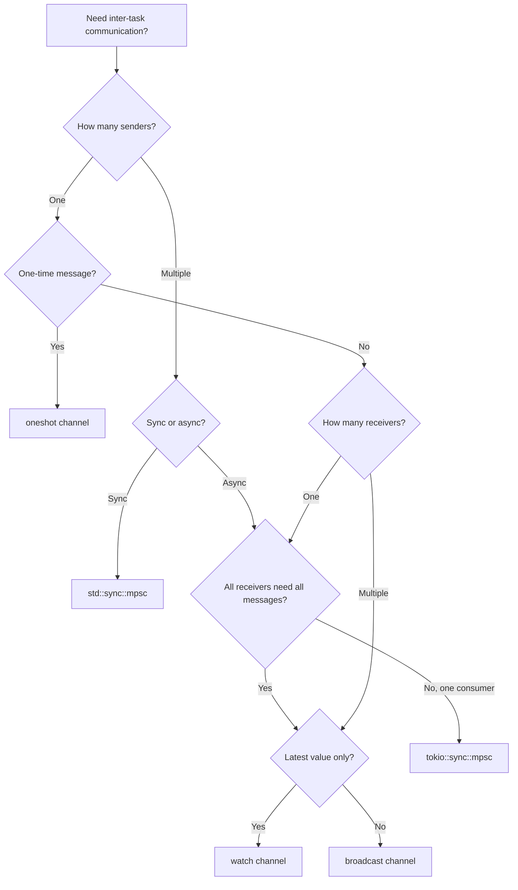

## Channel Fundamentals

Channels implement the actor model — concurrent tasks communicate by sending messages rather than
sharing memory. Rust provides several channel types, each optimized for different communication
patterns. The sender and receiver are separate endpoints; messages are moved from sender to
receiver, transferring ownership.

### Channel Categories

| Type                | Producers | Consumers | Buffering         | Use Case                 |
| ------------------- | --------- | --------- | ----------------- | ------------------------ |
| `std::sync::mpsc`   | Multiple  | Single    | Bounded/Unbounded | Simple work distribution |
| `tokio::sync::mpsc` | Multiple  | Single    | Bounded/Unbounded | Async work distribution  |
| `oneshot`           | Single    | Single    | None              | Single response          |
| `broadcast`         | Single    | Multiple  | Bounded           | Pub/sub notifications    |
| `watch`             | Single    | Multiple  | Single value      | Configuration updates    |

## `std::sync::mpsc`

The standard library's channel is synchronous (blocking) and designed for OS threads:

### Basic Usage

```rust
use std::sync::mpsc;
use std::thread;

let (tx, rx) = mpsc::channel();

thread::spawn(move || {
    let val = String::from("hello");
    tx.send(val).unwrap();
    // val is moved — no longer accessible here
});

let received = rx.recv().unwrap();
assert_eq!(received, "hello");
```

### Multiple Producers

Clone the sender to create multiple producers:

```rust
use std::sync::mpsc;
use std::thread;

let (tx, rx) = mpsc::channel();
let tx1 = tx.clone();

thread::spawn(move || {
    tx.send("from thread 1").unwrap();
});

thread::spawn(move || {
    tx1.send("from thread 2").unwrap();
});

drop(tx);

for received in rx {
    println!("got: {}", received);
}
```

When all senders are dropped, `recv()` returns `Err` and the iterator terminates.

### Bounded vs Unbounded

```rust
use std::sync::mpsc;

let (tx, rx) = mpsc::channel();          // unbounded — grows as needed
let (tx, rx) = mpsc::sync_channel(10);   // bounded — capacity 10
```

### Send and Recv Semantics

| Method                 | Blocking?                        | Returns                       |
| ---------------------- | -------------------------------- | ----------------------------- |
| `tx.send(val)`         | Yes (if bounded and full)        | `Result<(), SendError<T>>`    |
| `rx.recv()`            | Yes (if empty and senders exist) | `Result<T, RecvError>`        |
| `rx.try_recv()`        | No                               | `Result<T, TryRecvError>`     |
| `rx.recv_timeout(dur)` | Yes (with timeout)               | `Result<T, RecvTimeoutError>` |

## `tokio::sync::mpsc`

Tokio's async channel uses `.await` instead of blocking:

### Basic Usage

```rust
use tokio::sync::mpsc;

#[tokio::main]
async fn main() {
    let (tx, mut rx) = mpsc::channel(32);

    tokio::spawn(async move {
        tx.send("hello").await.unwrap();
    });

    while let Some(msg) = rx.recv().await {
        println!("{}", msg);
    }
}
```

### Bounded vs Unbounded

```rust
use tokio::sync::mpsc;

let (tx, rx) = mpsc::channel(32);       // bounded — capacity 32
let (tx, rx) = mpsc::unbounded_channel(); // unbounded — grows as needed
```

:::warning

Unbounded channels can cause memory exhaustion if producers send faster than consumers process.
Prefer bounded channels with an appropriate buffer size. If the buffer fills, backpressure naturally
slows producers.

:::

### Async Send Error Handling

```rust
use tokio::sync::mpsc;

#[tokio::main]
async fn main() {
    let (tx, mut rx) = mpsc::channel(1);

    tokio::spawn(async move {
        if let Err(e) = tx.send("message").await {
            eprintln!("send failed: receiver dropped: {}", e);
        }
    });
}
```

`tx.send()` returns `Err(SendError<T>)` when the receiver has been dropped. The error contains the
unsent value.

## Oneshot Channels

Oneshot channels send a single value from producer to consumer:

```rust
use tokio::sync::oneshot;

#[tokio::main]
async fn main() {
    let (tx, rx) = oneshot::channel();

    tokio::spawn(async move {
        let result = compute_value().await;
        let _ = tx.send(result);  // ignore send error if receiver dropped
    });

    match rx.await {
        Ok(value) => println!("got: {}", value),
        Err(_) => println!("sender dropped"),
    }
}
```

Oneshot channels are zero-cost — they use a single slot with no buffer. They are ideal for
request-response patterns where each request gets exactly one response.

### Oneshot as a Cancellation Token

```rust
use tokio::sync::oneshot;

#[tokio::main]
async fn main() {
    let (cancel_tx, cancel_rx) = oneshot::channel();

    tokio::spawn(async move {
        loop {
            tokio::select! {
                _ = cancel_rx => {
                    println!("cancelled");
                    return;
                }
                _ = tokio::time::sleep(Duration::from_secs(1)) => {
                    println!("working");
                }
            }
        }
    });

    tokio::time::sleep(Duration::from_millis(2500)).await;
    cancel_tx.send(()).unwrap();
}
```

## Broadcast Channels

Broadcast channels deliver each message to all active receivers:

```rust
use tokio::sync::broadcast;

#[tokio::main]
async fn main() {
    let (tx, _) = broadcast::channel(16);

    let mut rx1 = tx.subscribe();
    let mut rx2 = tx.subscribe();

    tokio::spawn(async move {
        while let Ok(msg) = rx1.recv().await {
            println!("receiver 1: {}", msg);
        }
    });

    tokio::spawn(async move {
        while let Ok(msg) = rx2.recv().await {
            println!("receiver 2: {}", msg);
        }
    });

    tx.send("hello").unwrap();
    tx.send("world").unwrap();

    tokio::time::sleep(Duration::from_millis(100)).await;
}
```

### Broadcast Semantics

- Each `subscribe()` creates a new receiver
- Receivers that lag behind (buffer full) receive `RecvError::Lagged(n)` indicating how many
  messages were skipped
- The sender does NOT wait for receivers — messages are fire-and-forget
- The buffer is per-channel, not per-receiver

```rust
use tokio::sync::broadcast;

let (tx, _) = broadcast::channel(2);

tx.send(1).unwrap();
tx.send(2).unwrap();
tx.send(3).unwrap();  // pushes out message 1

let mut rx = tx.subscribe();
assert_eq!(rx.recv().await.unwrap(), 2);  // message 1 was lagged
assert_eq!(rx.recv().await.unwrap(), 3);
```

## Watch Channels

Watch channels broadcast the latest value to all receivers. Unlike broadcast, watch retains only the
most recent value — there is no message queue:

```rust
use tokio::sync::watch;

#[tokio::main]
async fn main() {
    let (tx, rx) = watch::channel("initial");

    let mut rx1 = rx.clone();
    tokio::spawn(async move {
        loop {
            rx1.changed().await.unwrap();
            println!("watcher 1: {}", *rx1.borrow());
        }
    });

    let mut rx2 = rx.clone();
    tokio::spawn(async move {
        loop {
            rx2.changed().await.unwrap();
            println!("watcher 2: {}", *rx2.borrow());
        }
    });

    tx.send("update 1").unwrap();
    tx.send("update 2").unwrap();

    tokio::time::sleep(Duration::from_millis(100)).await;
}
```

### Watch vs Broadcast

| Property     | `watch`                | `broadcast`             |
| ------------ | ---------------------- | ----------------------- |
| Messages     | Single latest value    | All messages in a queue |
| Buffer       | 1 (always)             | Configurable            |
| Lag handling | No lag — always latest | `RecvError::Lagged`     |
| Use case     | Configuration updates  | Event streams, logs     |

## Channel Patterns

### Work Distribution

```rust
use tokio::sync::mpsc;

#[tokio::main]
async fn main() {
    let (tx, mut rx) = mpsc::channel(32);

    for i in 0..10 {
        let tx = tx.clone();
        tokio::spawn(async move {
            let result = process(i).await;
            tx.send(result).await.unwrap();
        });
    }

    drop(tx);

    let mut results = vec![];
    while let Some(result) = rx.recv().await {
        results.push(result);
    }
}
```

### Fan-Out / Fan-In

```rust
use tokio::sync::mpsc;

#[tokio::main]
async fn main() {
    let (in_tx, mut in_rx) = mpsc::channel(32);
    let (out_tx, mut out_rx) = mpsc::channel(32);

    let workers = 4;
    for _ in 0..workers {
        let mut in_rx = in_rx.resubscribe();
        let out_tx = out_tx.clone();
        tokio::spawn(async move {
            while let Some(work) = in_rx.recv().await {
                let result = process(work).await;
                out_tx.send(result).await.unwrap();
            }
        });
    }

    drop(out_tx);

    for i in 0..100 {
        in_tx.send(i).await.unwrap();
    }
    drop(in_tx);

    let mut results = vec![];
    while let Some(result) = out_rx.recv().await {
        results.push(result);
    }
}
```

### Backpressure

Bounded channels naturally provide backpressure — when the buffer is full, `send()` blocks (or
awaits) until the receiver consumes a message:

```rust
use tokio::sync::mpsc;

let (tx, mut rx) = mpsc::channel(4);

// Producer
tokio::spawn(async move {
    for i in 0..1000 {
        tx.send(i).await.unwrap();  // blocks when buffer is full
    }
});

// Consumer
while let Some(value) = rx.recv().await {
    process(value).await;
}
```

## Actor Model

The actor model encapsulates state in an actor that processes messages sequentially from a mailbox:

```rust
use tokio::sync::mpsc;

struct Actor {
    receiver: mpsc::Receiver<Message>,
    counter: usize,
}

enum Message {
    Increment,
    GetCount(tokio::sync::oneshot::Sender<usize>),
    Shutdown,
}

impl Actor {
    fn new(receiver: mpsc::Receiver<Message>) -> Self {
        Actor { receiver, counter: 0 }
    }

    async fn run(&mut self) {
        while let Some(msg) = self.receiver.recv().await {
            match msg {
                Message::Increment => {
                    self.counter += 1;
                }
                Message::GetCount(reply) => {
                    let _ = reply.send(self.counter);
                }
                Message::Shutdown => {
                    break;
                }
            }
        }
    }
}

struct ActorHandle {
    sender: mpsc::Sender<Message>,
}

impl ActorHandle {
    fn new() -> Self {
        let (tx, rx) = mpsc::channel(8);
        tokio::spawn(async move {
            let mut actor = Actor::new(rx);
            actor.run().await;
        });
        ActorHandle { sender: tx }
    }

    async fn increment(&self) {
        self.sender.send(Message::Increment).await.unwrap();
    }

    async fn get_count(&self) -> usize {
        let (reply_tx, reply_rx) = tokio::sync::oneshot::channel();
        self.sender.send(Message::GetCount(reply_tx)).await.unwrap();
        reply_rx.await.unwrap()
    }

    async fn shutdown(&self) {
        self.sender.send(Message::Shutdown).await.unwrap();
    }
}

#[tokio::main]
async fn main() {
    let actor = ActorHandle::new();

    actor.increment().await;
    actor.increment().await;
    actor.increment().await;

    let count = actor.get_count().await;
    assert_eq!(count, 3);

    actor.shutdown().await;
}
```

## `select!` with Channels

`select!` waits on multiple channel operations simultaneously:

```rust
use tokio::sync::mpsc;
use tokio::time::{sleep, Duration};

#[tokio::main]
async fn main() {
    let (tx1, mut rx1) = mpsc::channel(32);
    let (tx2, mut rx2) = mpsc::channel(32);

    tokio::spawn(async move {
        sleep(Duration::from_millis(100)).await;
        tx1.send("from channel 1").await.unwrap();
    });

    tokio::spawn(async move {
        sleep(Duration::from_millis(50)).await;
        tx2.send("from channel 2").await.unwrap();
    });

    tokio::select! {
        msg = rx1.recv() => println!("channel 1: {:?}", msg),
        msg = rx2.recv() => println!("channel 2: {:?}", msg),
    }
}
```

## Channel Error Handling

### `SendError`

`SendError` occurs when the receiver has been dropped:

```rust
use tokio::sync::mpsc;

let (tx, rx) = mpsc::channel(1);
drop(rx);

match tx.send("hello").await {
    Err(mpsc::error::SendError(msg)) => {
        println!("receiver dropped, message was: {}", msg);
    }
    Ok(()) => println!("sent"),
}
```

### `RecvError`

`RecvError` occurs when all senders have been dropped and the channel is empty:

```rust
use tokio::sync::mpsc;

let (tx, mut rx) = mpsc::channel(1);
drop(tx);

match rx.recv().await {
    Err(mpsc::error::RecvError) => println!("all senders dropped"),
    Ok(msg) => println!("received: {}", msg),
}
```

### `TryRecvError`

```rust
use tokio::sync::mpsc;

let (tx, mut rx) = mpsc::channel(1);
drop(tx);

match rx.try_recv() {
    Ok(msg) => println!("received: {}", msg),
    Err(mpsc::error::TryRecvError::Empty) => println!("channel empty"),
    Err(mpsc::error::TryRecvError::Disconnected) => println!("disconnected"),
}
```

## Channel Sizing and Performance

### Buffer Size Selection

| Buffer Size | Behavior                                          |
| ----------- | ------------------------------------------------- |
| 0           | Synchronous handoff — sender waits for receiver   |
| 1           | Minimal buffering — good for ping-pong            |
| 10-100      | General purpose — balances throughput and latency |
| 1000+       | High throughput — producers rarely block          |
| Unbounded   | No backpressure — risk of memory exhaustion       |

### Throughput Considerations

Bounded channels with larger buffers generally have higher throughput because senders block less
often. However, larger buffers increase memory usage and latency (messages sit in the buffer longer
before being processed).

```rust
// High-throughput scenario — large buffer
let (tx, rx) = mpsc::channel(10_000);

// Low-latency scenario — small buffer
let (tx, rx) = mpsc::channel(1);
```

### Channel Allocation

Each message sent through a channel is moved (not copied). For large messages, consider sending
`Arc<T>` to avoid expensive moves:

```rust
use std::sync::Arc;

let (tx, mut rx) = mpsc::channel(32);

let large_data = Arc::new(vec![0u8; 1_000_000]);
tx.send(Arc::clone(&large_data)).await.unwrap();
```

## Deadlocks with Channels

### Classic Deadlock Pattern

```rust
// DEADLOCK: both tasks wait for each other
let (tx1, mut rx1) = mpsc::channel(1);
let (tx2, mut rx2) = mpsc::channel(1);

// Task 1: sends to tx1, then waits on rx2
// Task 2: sends to tx2, then waits on rx1
// If both channels are bounded with capacity 1 and both tasks send before receiving, deadlock
```

### Prevention Strategies

1. Use unbounded channels if backpressure is not required
2. Ensure send and receive operations alternate (no circular dependencies)
3. Use `select!` with timeouts to break potential deadlocks
4. Use `try_send()` with backoff instead of blocking `send()`

## Common Pitfalls

1. **Forgetting to drop the sender.** The receiver's `recv()` loop never terminates if any sender is
   still alive. Drop all senders when done producing.

2. **Unbounded channels causing OOM.** Unbounded channels grow without limit if producers outpace
   consumers. Use bounded channels with appropriate buffer sizes.

3. **Blocking send in async code.** `std::sync::mpsc::Sender::send()` blocks the thread. Use
   `tokio::sync::mpsc::Sender::send().await` in async contexts.

4. **Broadcast receivers lagging.** If a broadcast receiver is too slow, messages are dropped and it
   receives `RecvError::Lagged`. Handle this error explicitly.

5. **Watch channels and initial values.** `watch::channel()` takes an initial value. The first
   `changed().await` returns immediately because the initial value counts as a "change." Use
   `rx.borrow()` to check the current value without waiting.

6. **Channel leaks.** If a task holding a channel sender panics without dropping it, the channel
   stays open. Use `scopeguard` or explicit `drop()` in cleanup code.

7. **Sending non-`Send` types across async channels.** `tokio::sync::mpsc` requires `T: Send`. Use
   `tokio::sync::mpsc::unbounded_channel()` for local channels within a single task, or wrap the
   type in `Arc`.

8. **Ignoring `SendError`.** `tx.send()` returns `Result`. If the receiver is dropped, the send
   fails. Ignoring this error silently loses messages.

9. **Using channels for fine-grained communication.** Channels have overhead (allocation, atomic
   operations, context switches). For very frequent communication between tasks, consider shared
   state with `Arc<Mutex<T>>` or atomics.

10. **Actor mailbox overflow.** If messages arrive faster than the actor processes them, the channel
    buffer fills up and senders block. Size the buffer appropriately and consider backpressure
    mechanisms.

## Channel Selection Guide



## Advanced Channel Patterns

### Request-Response with Oneshot

Combine `mpsc` for requests and `oneshot` for responses:

```rust
use tokio::sync::{mpsc, oneshot};

enum Request {
    GetData { key: String, respond: oneshot::Sender<Option<String>> },
    SetData { key: String, value: String, respond: oneshot::Sender<bool> },
}

struct KvStore {
    receiver: mpsc::Receiver<Request>,
    data: std::collections::HashMap<String, String>,
}

impl KvStore {
    fn new(receiver: mpsc::Receiver<Request>) -> Self {
        KvStore {
            receiver,
            data: std::collections::HashMap::new(),
        }
    }

    async fn run(&mut self) {
        while let Some(req) = self.receiver.recv().await {
            match req {
                Request::GetData { key, respond } => {
                    let _ = respond.send(self.data.get(&key).cloned());
                }
                Request::SetData { key, value, respond } => {
                    self.data.insert(key, value);
                    let _ = respond.send(true);
                }
            }
        }
    }
}

struct KvClient {
    sender: mpsc::Sender<Request>,
}

impl KvClient {
    fn new(sender: mpsc::Sender<Request>) -> Self {
        KvClient { sender }
    }

    async fn get(&self, key: &str) -> Option<String> {
        let (tx, rx) = oneshot::channel();
        self.sender.send(Request::GetData {
            key: key.to_string(),
            respond: tx,
        }).await.ok()?;
        rx.await.ok()?
    }

    async fn set(&self, key: &str, value: &str) -> bool {
        let (tx, rx) = oneshot::channel();
        self.sender.send(Request::SetData {
            key: key.to_string(),
            value: value.to_string(),
            respond: tx,
        }).await.ok()?;
        rx.await.unwrap_or(false)
    }
}
```

### Pipeline Pattern

Chain multiple stages, each consuming from one channel and producing to the next:

```rust
use tokio::sync::mpsc;

async fn pipeline() {
    let (input_tx, input_rx) = mpsc::channel(32);
    let (stage1_tx, stage1_rx) = mpsc::channel(32);
    let (stage2_tx, stage2_rx) = mpsc::channel(32);

    tokio::spawn(async move {
        for i in 0..100 {
            input_tx.send(i).await.unwrap();
        }
    });

    tokio::spawn(async move {
        while let Some(value) = input_rx.recv().await {
            stage1_tx.send(value * 2).await.unwrap();
        }
    });

    tokio::spawn(async move {
        while let Some(value) = stage1_rx.recv().await {
            stage2_tx.send(value + 1).await.unwrap();
        }
    });

    drop(stage2_tx);

    let mut results = vec![];
    while let Some(value) = stage2_rx.recv().await {
        results.push(value);
    }
}
```

### Channel Merging

Merge multiple channels into one:

```rust
use tokio::sync::mpsc;

async fn merge_channels() {
    let (out_tx, mut out_rx) = mpsc::channel(32);

    let mut inputs = vec![];
    for _ in 0..3 {
        let (tx, rx) = mpsc::channel(32);
        inputs.push(rx);
    }

    let mut handles = vec![];
    for mut rx in inputs {
        let out_tx = out_tx.clone();
        handles.push(tokio::spawn(async move {
            while let Some(value) = rx.recv().await {
                if out_tx.send(value).await.is_err() {
                    break;
                }
            }
        }));
    }

    drop(out_tx);

    while let Some(value) = out_rx.recv().await {
        println!("merged: {}", value);
    }
}
```

### Batching with Channels

Batch incoming messages before processing:

```rust
use tokio::sync::mpsc;
use tokio::time::{sleep, Duration};

async fn batch_processor() {
    let (tx, mut rx) = mpsc::channel(100);
    let batch_size = 10;
    let timeout = Duration::from_millis(100);

    tokio::spawn(async move {
        loop {
            let mut batch = vec![];

            tokio::select! {
                msg = rx.recv() => {
                    if let Some(value) = msg {
                        batch.push(value);
                    } else {
                        break;
                    }
                }
                _ = sleep(timeout) => {}
            }

            while batch.len() < batch_size {
                match rx.try_recv() {
                    Ok(value) => batch.push(value),
                    Err(_) => break,
                }
            }

            if !batch.is_empty() {
                process_batch(&batch).await;
            }
        }
    });
}

async fn process_batch(batch: &[i32]) {
    println!("processing batch of {} items", batch.len());
}
```

## Channel Error Recovery

### Reconnecting Senders

When a receiver drops and the sender detects it, you can create a new channel pair:

```rust
use tokio::sync::mpsc;

struct ReconnectableSender<T> {
    current_tx: Option<mpsc::Sender<T>>,
}

impl<T> ReconnectableSender<T> {
    fn new() -> Self {
        ReconnectableSender { current_tx: None }
    }

    fn connect(&mut self) -> mpsc::Receiver<T> {
        let (tx, rx) = mpsc::channel(32);
        self.current_tx = Some(tx);
        rx
    }

    async fn send(&mut self, value: T) -> Result<(), mpsc::error::SendError<T>> {
        match &self.current_tx {
            Some(tx) => tx.send(value).await,
            None => Err(mpsc::error::SendError(value)),
        }
    }
}
```

### Graceful Channel Shutdown

Use a dedicated shutdown signal to coordinate channel closure:

```rust
use tokio::sync::{mpsc, broadcast};

async fn graceful_shutdown() {
    let (work_tx, mut work_rx) = mpsc::channel(32);
    let (shutdown_tx, _) = broadcast::channel(1);
    let mut shutdown_rx = shutdown_tx.subscribe();

    let worker = tokio::spawn(async move {
        loop {
            tokio::select! {
                work = work_rx.recv() => {
                    if let Some(job) = work {
                        process(job).await;
                    } else {
                        break;
                    }
                }
                _ = shutdown_rx.recv() => {
                    println!("worker received shutdown signal");
                    break;
                }
            }
        }
        println!("worker finished");
    });

    work_tx.send(Job::Task("work item")).await.unwrap();

    shutdown_tx.send(()).unwrap();
    let _ = worker.await;
}
```

## Channels vs Shared State

### When to Use Channels

- Decoupling producer and consumer timing
- Work distribution across tasks
- Pipeline architectures
- Actor model patterns

### When to Use Shared State

- Simple flags or counters (use `AtomicBool`, `AtomicUsize`)
- Configuration that changes infrequently (use `Arc<RwLock<T>>` or `watch`)
- Data structures that need coordinated access (use `Arc<Mutex<T>>`)

### Hybrid Approach

Combine channels for task distribution with shared state for configuration:

```rust
use tokio::sync::{mpsc, watch};

async fn hybrid() {
    let (tx, mut rx) = mpsc::channel(32);
    let (config_tx, config_rx) = watch::channel(Config::default());

    tokio::spawn(async move {
        let config = config_rx.borrow().clone();
        while let Some(work) = rx.recv().await {
            process_with_config(work, &config).await;
        }
    });

    config_tx.send(Config { verbose: true }).unwrap();
}
```
