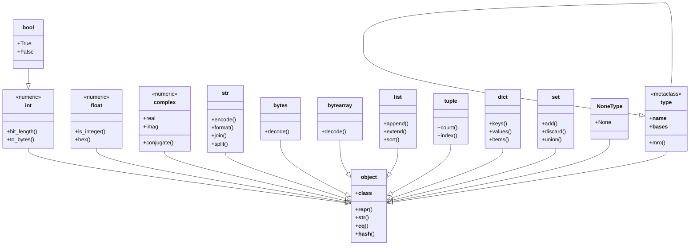

## Python's Type System

Python is **dynamically typed** and **strongly typed**. These two properties are frequently confused, so it is worth being precise about what they mean.

- **Dynamic typing:** Variables do not carry type annotations that the interpreter enforces at assignment. A name is bound to an object, and that object has a type. The same name can be rebound to an object of a completely different type at any time. Type checking happens at runtime, not at compile time.
- **Strong typing:** The interpreter does not perform implicit type coercions that could silently lose data. Operations between incompatible types raise `TypeError` rather than silently converting one operand to match the other.

```python
# Dynamic: the name 'x' is rebound to different types
x = 42           # int
x = "hello"      # str
x = [1, 2, 3]    # list

# Strong: these raise TypeError, not silent coercion
"hello" + 42     # TypeError: can only concatenate str (not "int") to str
[1, 2] + (3, 4)  # TypeError: can only concatenate list (not "tuple") to list
```

Compare this with JavaScript (weakly and dynamically typed), where `"5" + 3` silently produces `"53"`, or C (statically and weakly typed), where implicit conversions between `int` and `float` occur without warning.

### Why Dynamic Typing

Python's design prioritizes **developer velocity and flexibility** over static safety. Guido van Rossum designed Python for scripting, prototyping, and teaching -- domains where the overhead of type declarations is a genuine barrier. Dynamic typing enables:

- Rapid prototyping without ceremony
- Highly polymorphic code (duck typing)
- Metaprogramming and runtime introspection via `getattr`, `setattr`, `dir`, and `type`

The trade-off is that errors a compiler would catch in statically-typed languages surface at runtime. Python mitigates this with extensive testing culture and, since Python 3.5, optional static type checking via type hints (discussed later).

### Why Strong Typing

Strong typing prevents entire classes of bugs caused by silent data corruption. When `"2" * 3` produces `"222"` in Python, that is a deliberate, documented operation on the `str` type -- not an implicit coercion. The principle is that **surprising implicit behavior is more dangerous than explicit errors**.

:::info

Python does perform some coercions, but they are narrow and well-defined. For example, `bool` is a subclass of `int`, so `True + 1 == 2`. Numeric towers allow `int + float` because the `int` is promoted to `float`. These are the result of deliberate subtype relationships, not general-purpose coercion rules.

:::

## Type Hierarchy

Every object in Python is an instance of `object`. The built-in types form a hierarchy rooted at `object`, with `int`, `str`, and others as direct or indirect subclasses.



This hierarchy has immediate consequences. Because `bool` is a subclass of `int`, `isinstance(True, int)` returns `True`. Because `type` is a subclass of `object`, and `object` is an instance of `type`, the relationship is circular -- this is the metaclass mechanism.

## Numeric Types

Python provides a rich set of numeric types that differ from most languages in critical ways.

### `int`: Arbitrary-Precision Integers

Python integers have **no fixed bit width**. They are arbitrary-precision (bignum), limited only by available memory. There is no 32-bit or 64-bit overflow. This is a deliberate design choice that eliminates an entire class of bugs.

```python
# No overflow, ever
x = 2**1000
print(x)  # a 302-digit number

# Contrast with C where this would overflow
import sys
print(sys.maxsize)  # 2**63 - 1 on 64-bit systems (platform pointer size)
```

**Why arbitrary precision?** In scripting and scientific computing, integer overflow is a frequent source of silent, catastrophic errors. Python's target audience (non-systems-programmers) is less likely to think about bit widths. The cost is performance: big-integer arithmetic is slower than fixed-width register arithmetic. Python accepts this trade-off because correctness is prioritized over raw speed.

Internally, CPython represents integers as variable-length arrays of digits (base $2^{30}$ on 64-bit systems). Small integers in the range $[-5, 256]$ are **pre-allocated and interned** -- every reference to `256` points to the same object. This is an optimization that exploits the fact that small integers appear frequently.

```python
a = 256
b = 256
print(a is b)   # True (interned)

a = 257
b = 257
print(a is b)   # False (not interned)
```

:::warning

Do not rely on integer interning behavior. Use `==` for equality comparison, never `is`. The interning range is a CPython implementation detail, not a language guarantee.

:::

### `float`: IEEE 754 Double-Precision

Python's `float` is a C `double` -- IEEE 754 binary64, providing approximately 15-17 significant decimal digits and a range of roughly $\pm 1.8 \times 10^{308}$.

```python
# The classic floating-point precision issue
0.1 + 0.2 == 0.3       # False
0.1 + 0.2              # 0.30000000000000004

# Correct comparison
import math
math.isclose(0.1 + 0.2, 0.3)  # True
```

**Why not arbitrary-precision decimals?** Performance. IEEE 754 arithmetic is implemented in hardware on every modern CPU. A `float` addition is a single CPU instruction. Arbitrary-precision decimals would require software emulation, making all numeric computation orders of magnitude slower. The pragmatic choice is to use hardware floats by default and provide `decimal` and `fractions` modules for cases that require exact arithmetic.

:::tip

For financial calculations, use `decimal.Decimal` (exact decimal arithmetic) or `fractions.Fraction` (exact rational arithmetic). Never use `float` for money.

:::

### `complex`: Complex Numbers

Python has first-class support for complex numbers, which is unusual for a general-purpose language. This reflects Python's roots in scientific computing.

```python
z = 3 + 4j
print(z.real)        # 3.0
print(z.imag)        # 4.0
print(z.conjugate()) # (3-4j)
print(abs(z))        # 5.0 (magnitude)
```

### `decimal.Decimal`: Exact Decimal Arithmetic

The `decimal` module provides arbitrary-precision, base-10 arithmetic with configurable rounding. It is essential for financial calculations and any domain where binary floating-point representation errors are unacceptable.

```python
from decimal import Decimal, getcontext

# Exact decimal arithmetic
a = Decimal("0.1")
b = Decimal("0.2")
print(a + b == Decimal("0.3"))  # True

# Configurable precision
getcontext().prec = 50
print(Decimal(1) / Decimal(7))  # 0.14285714285714285714285714285714285714285714285714
```

**Critical detail:** Always construct `Decimal` from strings, not floats. `Decimal(0.1)` captures the already-corrupted binary floating-point representation. `Decimal("0.1")` creates the exact decimal value.

```python
from decimal import Decimal

print(Decimal(0.1))   # Decimal('0.1000000000000000055511151231257827021181583404541015625')
print(Decimal("0.1")) # Decimal('0.1')
```

### `fractions.Fraction`: Exact Rational Arithmetic

The `fractions` module stores numbers as exact numerator/denominator pairs. Arithmetic is performed exactly, with results automatically reduced to lowest terms.

```python
from fractions import Fraction

a = Fraction(1, 3)
b = Fraction(2, 3)
print(a + b)           # Fraction(1, 1)
print(Fraction(0.1))   # Fraction(3602879701896397, 36028797018963968)
print(Fraction("0.1")) # Fraction(1, 10)
```

As with `Decimal`, construct from strings when exactness matters.

### Numeric Tower

Python's numeric types participate in a coercion hierarchy. When two numeric types interact, the "smaller" type is promoted to the "larger" type:

```
bool -> int -> float -> complex
```

This means `1 + 2.5` promotes the `int` to `float`, and `1 + 2j` promotes the `int` to `complex`. `Decimal` and `Fraction` do not participate in this tower -- mixing them with `float` or `complex` raises `TypeError`.

## Strings

Python 3 strings are **Unicode strings** -- sequences of Unicode code points. This is a fundamental difference from Python 2, where the default string type was bytes.

### Immutability

Strings are immutable. Every operation that appears to modify a string actually creates a new one.

```python
s = "hello"
s_upper = s.upper()  # creates a new string, 's' is unchanged
print(s)             # "hello"
```

**Why are strings immutable?** Several deliberate reasons:

1. **Hashability.** Immutable objects can be hashed, which makes them usable as dictionary keys and set members. Mutable strings would require recalculating the hash on every modification, and would allow keys to change after insertion -- a source of subtle bugs.
2. **Interning and sharing.** The interpreter can safely share identical string objects across the program. This reduces memory usage and enables fast identity comparisons.
3. **Thread safety.** Immutable objects are inherently thread-safe. No lock is needed to read a string that another thread might be "modifying" (it cannot be).
4. **C API compatibility.** CPython's internal representation can store C strings directly when all characters are ASCII, avoiding per-character encoding overhead. This optimization is only safe because strings cannot change.

:::warning

String immutability means that concatenation in a loop is $O(n^2)$ because each concatenation copies the entire string. Use `''.join(iterable)` for linear-time concatenation.

```python
# O(n^2) -- creates a new string on each iteration
parts = []
for word in words:
    result += word  # copies the entire result each time

# O(n) -- builds the result in a list, joins once
result = ''.join(words)
```

:::

### Encoding: UTF-8 Under the Hood

Python source files are UTF-8 by default (PEP 3120). The internal representation of strings in CPython uses a flexible format:

- **Latin-1 (1 byte per character):** Used when all characters are in the range U+0000 to U+00FF.
- **UCS-2 (2 bytes per character):** Used when all characters are in the range U+0000 to U+FFFF but some exceed U+00FF.
- **UCS-4 (4 bytes per character):** Used when any character exceeds U+FFFF.

This is a CPython implementation detail (PEP 393, "Flexible String Representation") that optimizes the common case of ASCII-only strings to use 1 byte per character, while still supporting the full Unicode range without surrogate pairs.

```python
import sys

ascii_str = "hello"
latin1_str = "cafe\u00e9"
cjk_str = "\u4f60\u597d"
emoji_str = "\U0001f600"

print(sys.getsizeof(ascii_str))  # 50 bytes (1 byte/char + overhead)
print(sys.getsizeof(cjk_str))    # 82 bytes (4 bytes/char + overhead)
print(sys.getsizeof(emoji_str))  # 76 bytes (4 bytes/char + overhead)
```

### F-Strings (Formatted String Literals)

F-strings (PEP 498, Python 3.6+) are the preferred way to embed expressions in strings. They are evaluated at runtime, not at definition time.

```python
name = "World"
width = 20

# Basic interpolation
print(f"Hello, {name}!")

# Expressions
print(f"2 + 2 = {2 + 2}")

# Format specifications
pi = 3.14159265
print(f"Pi: {pi:.4f}")          # "Pi: 3.1416"
print(f"{'centered':^{width}}")  # "     centered      "

# Debugging (Python 3.8+)
x = 42
print(f"{x = }")                  # "x = 42"
print(f"{x * 2 = }")              # "x * 2 = 84"

# Date formatting
from datetime import datetime
now = datetime.now()
print(f"{now:%Y-%m-%d %H:%M}")    # "2025-06-04 10:00"
```

F-strings are faster than `%`-formatting or `str.format()` because the bytecode compiler parses the f-string into a sequence of `FORMAT_VALUE` opcodes at compile time, avoiding the overhead of parsing a format string at runtime.

### Key String Methods

```python
s = "  Hello, World!  "

# Whitespace
s.strip()      # "Hello, World!"
s.lstrip()     # "Hello, World!  "
s.rstrip()     # "  Hello, World!"

# Splitting and joining
"one,two,three".split(",")   # ["one", "two", "three"]
"-".join(["a", "b", "c"])    # "a-b-c"
"line1\nline2\nline3".splitlines()  # ["line1", "line2", "line3"]

# Searching
"hello world".find("world")  # 6
"hello world".index("world") # 6
"hello world".startswith("hello")  # True

# Transformation
"hello world".replace("world", "python")  # "hello python"
"hello world".title()   # "Hello World"
"hello world".capitalize()  # "Hello world"

# Classification (all return bool)
"123".isdigit()     # True
"abc".isalpha()     # True
"abc123".isalnum()  # True
"   ".isspace()     # True
"HELLO".isupper()   # True
```

:::tip

Prefer `str.startswith()` and `str.endswith()` over `str[:n] == prefix`. They are more readable and handle edge cases (empty strings, prefix longer than string) correctly.

:::

## Booleans

`bool` is a subclass of `int`. There are exactly two instances: `True` and `False`, which are the integer values 1 and 0 respectively.

```python
print(isinstance(True, int))   # True
print(True + True)             # 2
print(sum([True, False, True])) # 2
```

### Truthiness

In boolean contexts (`if`, `while`, `and`, `or`, `not`, `bool()`), Python applies a well-defined set of rules to determine the truth value of any object:

| Value                     | Truth Value | Reason                                           |
| ------------------------- | :---------: | ------------------------------------------------ |
| `None`                    |    False    | Explicit absence                                 |
| `False`                   |    False    | Boolean false                                    |
| Zero of any numeric type  |    False    | `0`, `0.0`, `0j`, `Decimal(0)`, `Fraction(0, 1)` |
| Empty sequence/collection |    False    | `""`, `()`, `[]`, `{}`, `set()`, `range(0)`      |
| Everything else           |    True     | Including objects with `__bool__` returning True |

This behavior is governed by two dunder methods on every object:

- `__bool__()`: Called first. Must return a `bool`.
- `__len__()`: Called if `__bool__` is not defined. Returns `True` if `__len__()` returns nonzero.

```python
class Container:
    def __init__(self, items):
        self.items = items

    def __len__(self):
        return len(self.items)

c = Container([])
if not c:
    print("empty")  # prints "empty"
```

### Short-Circuit Evaluation

The `and` and `or` operators do not return booleans -- they return one of their operands. This is a deliberate design choice that enables concise conditional expressions.

```python
# 'and' returns the first falsy value, or the last value if all are truthy
1 and 2 and 3      # 3
1 and 0 and 3      # 0
"" and "default"   # ""

# 'or' returns the first truthy value, or the last value if all are falsy
0 or 1 or 2        # 1
0 or "" or None    # None
"default" or None  # "default"
```

This behavior is the basis of common Python idioms:

```python
# Default value
name = user_input or "Anonymous"

# Guard clause for optional dependencies
result = expensive_computation() if preconditions_met() else None

# Chained fallbacks
config = os.environ.get("CONFIG_FILE") or default_path or "/etc/config.ini"
```

Short-circuit evaluation also means the right operand is not evaluated if the result is already determined by the left operand. This is critical for avoiding errors:

```python
# Safe attribute access
obj = None
if obj is not None and obj.attr:
    pass  # never raises AttributeError

# Using 'or' for default
value = None
result = value or compute_default()  # compute_default() IS called
result = value or 0                  # compute_default() is NOT called
```

## `None` and `NoneType`

`None` is the singleton instance of `NoneType`. It represents the absence of a value -- Python's equivalent of `null`, `nil`, or `NoneType` in other languages.

```python
print(type(None))    # <class 'NoneType'>
print(None is None)  # True (identity, not equality)
```

### Why `None` Is a Singleton

There is exactly one `None` object in any Python process. This is guaranteed by the language specification. The consequence is that identity comparison (`is`) is the correct way to check for `None`:

```python
# Correct
if x is None:
    pass

# Also works, but discouraged
if x is not None:
    pass

# Wrong -- can be overridden by __eq__
if x == None:
    pass
```

Using `is None` rather than `== None` is important because a custom class can override `__eq__` to return `True` when compared to `None`, which would be semantically incorrect. The `is` operator cannot be overridden.

### Default Argument Pitfall

The most common `None`-related bug involves mutable default arguments. Because default argument values are evaluated once at function definition time (not at call time), using a mutable default causes all calls to share the same object.

```python
# BUG: 'items' is created once and shared across all calls
def add_item(item, items=[]):
    items.append(item)
    return items

print(add_item("a"))  # ["a"]
print(add_item("b"))  # ["a", "b"]  -- the list persists!

# CORRECT: use None as sentinel
def add_item(item, items=None):
    if items is None:
        items = []
    items.append(item)
    return items

print(add_item("a"))  # ["a"]
print(add_item("b"))  # ["b"]  -- fresh list each time
```

:::warning

This is one of the most common bugs in Python code. Linters like `pylint` and `ruff` flag mutable default arguments. The pattern `def f(arg=None): if arg is None: arg = ...` is the standard solution.

:::

## Type Hints (PEP 484)

Python 3.5 introduced type hints via PEP 484, allowing optional static type annotations that external tools (mypy, pyright) can check without executing the code. Type hints do not affect runtime behavior -- they are completely ignored by the interpreter.

### Basic Syntax

```python
def greet(name: str) -> str:
    return f"Hello, {name}"

age: int = 25
names: list[str] = ["Alice", "Bob"]
mapping: dict[str, int] = {"Alice": 30, "Bob": 25}
optional: str | None = None
```

### The `typing` Module and Modern Alternatives

Since Python 3.9, built-in collections (`list`, `dict`, `set`, `tuple`) can be used directly in type annotations, replacing the `typing` module equivalents:

```python
# Python 3.9+ (preferred)
def process(items: list[str]) -> dict[str, int]:
    return {item: len(item) for item in items}

# Python 3.8 and earlier
from typing import List, Dict
def process(items: List[str]) -> Dict[str, int]:
    return {item: len(item) for item in items}
```

### `TypeVar` and Generic Functions

`TypeVar` enables writing generic functions where the relationship between input and output types must be preserved:

```python
from typing import TypeVar

T = TypeVar("T")

def first(items: list[T]) -> T:
    if not items:
        raise ValueError("empty list")
    return items[0]

# The type checker infers T = int from the argument
x: int = first([1, 2, 3])

# The type checker infers T = str from the argument
y: str = first(["a", "b", "c"])
```

A `TypeVar` can be **constrained** to a specific set of types:

```python
from typing import TypeVar

SupportsStr = TypeVar("SupportsStr", str, bytes)

def concat(a: SupportsStr, b: SupportsStr) -> SupportsStr:
    return a + b  # type checker knows + is valid for both str and bytes
```

Or **bounded** by a base type:

```python
from typing import TypeVar

class Animal:
    name: str

T = TypeVar("T", bound=Animal)

def get_name(obj: T) -> str:
    return obj.name  # type checker knows obj has .name
```

### `Protocol`: Structural Subtyping (PEP 544)

Python's type system supports both nominal typing (based on inheritance) and structural typing (based on shape). `Protocol` enables structural typing -- a type satisfies a protocol if it has the required attributes and methods, regardless of inheritance.

```python
from typing import Protocol

class SupportsClose(Protocol):
    def close(self) -> None: ...

class FileResource:
    def close(self) -> None:
        print("file closed")

class NetworkConnection:
    def close(self) -> None:
        print("connection closed")

class InvalidResource:
    pass

def shutdown(resource: SupportsClose) -> None:
    resource.close()

shutdown(FileResource())      # OK -- has .close()
shutdown(NetworkConnection()) # OK -- has .close()
shutdown(InvalidResource())   # type error -- no .close()
```

This is Python's formalization of duck typing. It allows type-checked code to remain as flexible as runtime duck typing while providing static guarantees.

### `Callable` and `Union`

```python
from typing import Callable

def apply(func: Callable[[int, int], int], a: int, b: int) -> int:
    return func(a, b)

apply(lambda x, y: x + y, 1, 2)  # OK
```

Union types have a concise syntax since Python 3.10:

```python
# Python 3.10+ (preferred)
def process(value: int | str | None) -> str:
    if isinstance(value, int):
        return str(value)
    if isinstance(value, str):
        return value
    return "default"

# Python 3.9 and earlier
from typing import Union
def process(value: Union[int, str, None]) -> str:
    ...
```

### `typing.cast`

When you know more about a type than the type checker does, use `cast` to assert the type without any runtime overhead:

```python
from typing import cast, Any

data: Any = get_external_data()
names: list[str] = cast(list[str], data)
```

`cast` is a no-op at runtime. It exists solely to communicate intent to the type checker.

## Type Checking with `mypy`

`mypy` is the reference static type checker for Python. It analyzes source code without executing it and reports type errors.

### Installation and Basic Usage

```bash
pip install mypy
mypy my_module.py
```

### Key `mypy` Flags

| Flag                       | Purpose                                                 |
| -------------------------- | ------------------------------------------------------- |
| `--strict`                 | Enable all optional checks                              |
| `--disallow-untyped-defs`  | Require type annotations on all function definitions    |
| `--no-implicit-optional`   | Do not treat `None` as compatible with untyped defaults |
| `--warn-return-any`        | Warn when a function returns `Any`                      |
| `--ignore-missing-imports` | Suppress errors for untyped third-party libraries       |

### Configuration (`pyproject.toml`)

```toml
[tool.mypy]
strict = true
ignore_missing_imports = true
python_version = "3.12"
```

### Stub Files (`.pyi`)

For third-party libraries without type hints, you can write stub files. A stub file has the same module path as the library but with a `.pyi` extension and contains only type signatures -- no implementations.

```python
# my_library.pyi
def process(data: list[int]) -> dict[str, int]: ...
def connect(host: str, port: int = 5432) -> Connection: ...
```

### Limitations of Type Checking

Type checkers are best-effort static analysis tools. They have inherent limitations:

1. **No runtime enforcement.** Type hints are annotations, not constraints. `mypy` catches errors at development time, but a misconfigured CI pipeline means errors can reach production.
2. **`Any` is infectious.** Once a value has type `Any`, it propagates through the entire call graph, effectively disabling type checking for anything that touches it.
3. **Dynamically dispatched code is hard to type.** `getattr`, `__getattr__`, and `**kwargs` defeat static analysis.
4. **Generics are erased at runtime.** `list[str]` and `list[int]` are both `list` at runtime. `isinstance(x, list[str])` raises a `TypeError`.

```python
# This raises TypeError at runtime -- generics are erased
isinstance([1, 2, 3], list[int])  # TypeError: isinstance() argument 2 cannot be a parameterized generic

# Use isinstance with the raw type
isinstance([1, 2, 3], list)  # True
```

## Variables and Assignment

### Assignment Is Binding, Not Declaration

In Python, `x = 5` does not declare a variable named `x` of type `int`. It creates a name `x` in the current scope and binds it to the object `5`. The name is an entry in the current namespace's dictionary; the object exists independently on the heap.

```python
a = [1, 2, 3]
b = a       # 'b' and 'a' point to the SAME list object
b.append(4)
print(a)    # [1, 2, 3, 4] -- 'a' sees the change
print(a is b)  # True
```

This is the most fundamental concept in Python's object model: **names are references to objects, not containers for values**. Understanding this eliminates the majority of beginner confusion about Python's behavior.

### Multiple Assignment and Unpacking

```python
# Tuple unpacking
x, y, z = 1, 2, 3

# Swap without a temporary variable
x, y = y, x  # the right side is evaluated first as a tuple

# Extended unpacking (Python 3+)
first, *rest = [1, 2, 3, 4, 5]
print(first)  # 1
print(rest)   # [2, 3, 4, 5]

head, *middle, tail = [1, 2, 3, 4, 5]
print(head)   # 1
print(middle) # [2, 3, 4]
print(tail)   # 5
```

### Augmented Assignment

Augmented assignment operators (`+=`, `-=`, `*=`, etc.) are syntactic sugar, but they are not always equivalent to the expanded form. The key difference is that `x += y` calls `__iadd__` if it exists, which allows in-place modification:

```python
a = [1, 2, 3]
b = a
a += [4]     # calls list.__iadd__, modifies 'a' in place
print(a is b)  # True -- same object

a = a + [5]  # calls list.__add__, creates a new list
print(a is b)  # False -- new object
```

For immutable types (`int`, `str`, `tuple`), there is no `__iadd__`, so `+=` is equivalent to `= +` -- it always creates a new object.

### Scope: LEGB Rule

Python resolves names using the **LEGB rule**, searching namespaces in this order:

1. **L**ocal -- the current function
2. **E**nclosing -- enclosing functions (for nested functions)
3. **G**lobal -- the module-level namespace
4. **B**uilt-in -- the `builtins` module (`print`, `len`, `range`, etc.)

```python
x = "global"

def outer():
    x = "enclosing"

    def inner():
        x = "local"
        print(x)  # "local"

    inner()
    print(x)      # "enclosing"

outer()
print(x)          # "global"
```

### The `global` and `nonlocal` Keywords

Assignment to a name inside a function creates a local variable by default, even if a name with the same spelling exists in an outer scope. Use `global` or `nonlocal` to override this.

```python
count = 0

def increment():
    global count    # refers to the module-level 'count'
    count += 1

def make_counter():
    count = 0

    def increment():
        nonlocal count  # refers to 'count' in the enclosing function
        count += 1
        return count

    return increment
```

:::warning

Overuse of `global` is a code smell. It creates hidden coupling between functions and makes code difficult to test and reason about. Prefer passing state explicitly through function parameters or using classes.

:::
