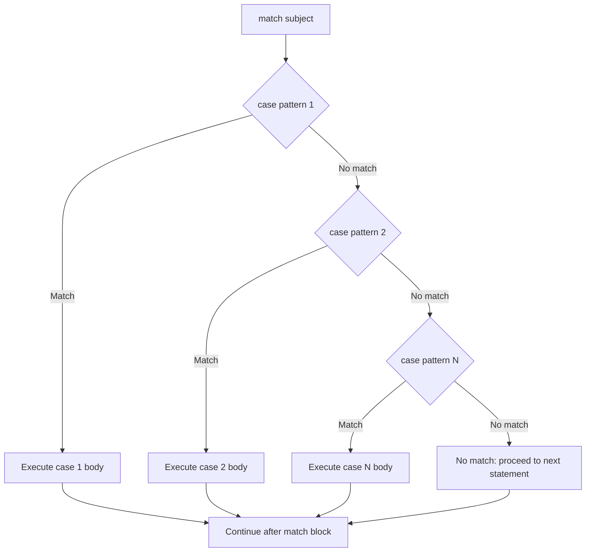
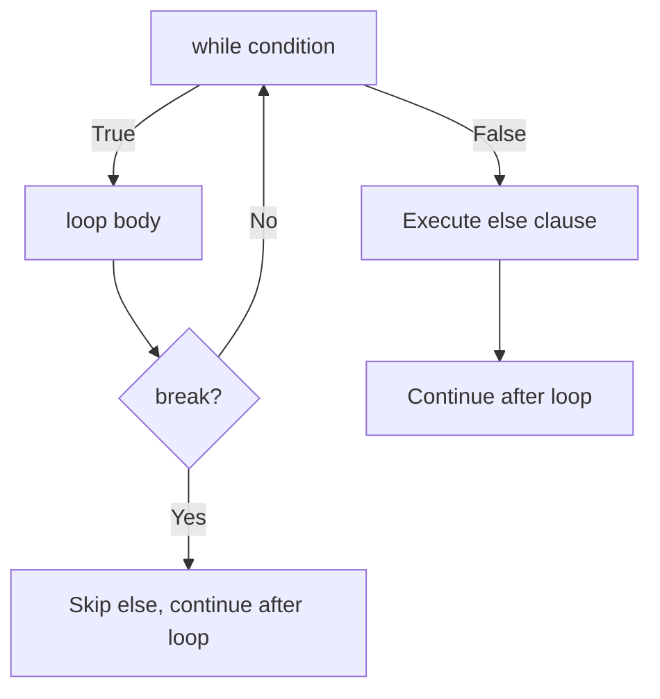
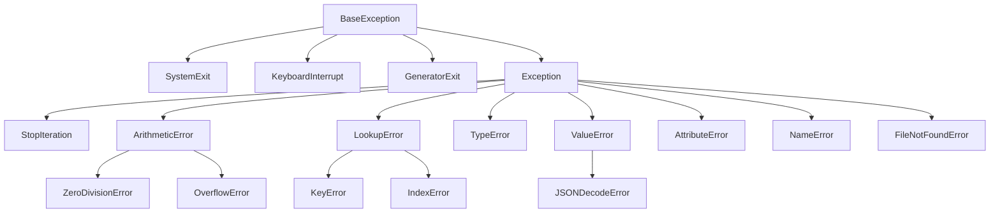
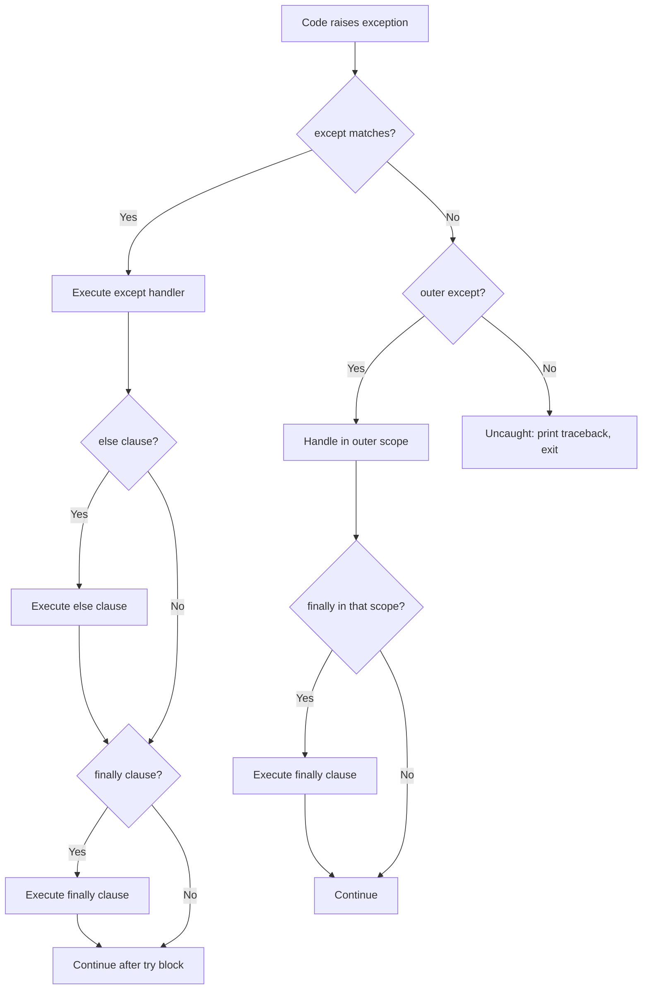

## Conditional Branching

### `if` / `elif` / `else`

Python's conditional statements are the most basic form of control flow. Unlike many languages, Python uses **indentation** rather than braces or keywords to delimit blocks.

```python
def classify_temperature(temp_celsius: float) -> str:
    if temp_celsius < 0:
        return "freezing"
    elif temp_celsius < 15:
        return "cold"
    elif temp_celsius < 25:
        return "comfortable"
    elif temp_celsius < 35:
        return "warm"
    else:
        return "hot"
```

The condition expression can be any Python object. Python evaluates its truthiness using the `__bool__()` protocol described in the previous chapter. There is no requirement that the condition be a boolean -- this is consistent with Python's broader philosophy of duck typing.

```python
# All of these are valid conditional expressions
if [1, 2, 3]:
    print("non-empty list is truthy")

if "":
    print("this never executes")

if not None:
    print("None is falsy, so not None is truthy")
```

### Why Indentation for Blocks

This is one of Python's most controversial design decisions and the source of the most frequent criticism from programmers coming from brace-delimited languages. The rationale is both philosophical and practical:

1. **Eliminates a class of bugs.** In C-style languages, mismatched braces are a persistent source of errors. The compiler cannot detect whether the indentation reflects the programmer's intent because the braces define the actual structure. Python makes the indentation the structure -- what you see is what the interpreter sees.

2. **Enforces a single canonical style.** Every Python program has consistent block structure. There is no debate over K&R versus Allman versus GNU indentation style because there is no choice. This reduces cognitive overhead in code reviews and eliminates formatting arguments.

3. **Reduces visual noise.** Braces, semicolons, and explicit block terminators are syntactic overhead that provides no semantic information beyond what indentation already conveys. Removing them makes code more compact without sacrificing readability.

4. **Historical precedent.** Guido van Rossum was influenced by ABC (a teaching language developed at CWI) and Haskell, both of which use indentation-based syntax. The choice was deliberate, not accidental.

The trade-off is sensitivity to whitespace. Mixing tabs and spaces, or inconsistent indentation, causes `IndentationError`. Python 3 disallows mixing tabs and spaces entirely within the same file. PEP 8 mandates 4 spaces per indentation level.

:::warning

Python 3 raises `TabError: inconsistent use of tabs and spaces in indentation` if a file mixes tabs and spaces. Configure your editor to insert 4 spaces on Tab. Most linters and formatters (`ruff`, `black`) enforce this automatically.

:::

### Conditional Expressions (Ternary)

Python provides a conditional expression (often called the ternary operator) with an ordering that reflects the English sentence structure:

```python
# Python's ternary: value_if_true IF condition ELSE value_if_false
status = "adult" if age >= 18 else "minor"

# Equivalent long-form
if age >= 18:
    status = "adult"
else:
    status = "minor"
```

Note the ordering: the value comes first, then the condition. This differs from C's `condition ? value_if_true : value_if_false`. The rationale is that in natural English, you state the assertion first ("it is an adult") and then qualify it ("if age >= 18, otherwise it is a minor").

Nested ternary expressions are technically possible but should be avoided:

```python
# Works but harms readability
label = "positive" if x > 0 else "negative" if x < 0 else "zero"

# Prefer a function with if/elif/else for multi-way branching
def sign(x: float) -> str:
    if x > 0:
        return "positive"
    elif x < 0:
        return "negative"
    return "zero"
```

## Structural Pattern Matching (`match` / `case`)

Python 3.10 introduced structural pattern matching via PEP 634. This is not a C-style `switch` statement -- it is a fundamentally more powerful construct that performs **destructuring** of data structures.

### Why Structural Pattern Matching, Not C-Style Switch

C's `switch` is essentially a multi-way `if/elif` chain with fall-through semantics. It compares a single value against compile-time constants. Python's `match/case` does something fundamentally different: it matches the **structure** of the subject against a pattern, binding names to matched sub-components.

The design was driven by several considerations:

1. **Python already has dictionary dispatch.** The use case for simple value-based switching is already well-served by dictionary dispatch: `{"a": func_a, "b": func_b}[key]()`. Adding a C-style switch would be redundant.

2. **Algebraic data types are increasingly common.** Python codebases increasingly use `dataclasses`, `NamedTuple`, and `TypedDict` to model structured data. Pattern matching provides a natural way to destructure these types.

3. **No fall-through.** Fall-through is the most error-prone feature of C's `switch`. Every `case` in Python's `match` is exclusive -- there is no way to accidentally fall through to the next case. This eliminates an entire class of bugs.

### Literal Patterns

```python
def http_status_text(code: int) -> str:
    match code:
        case 200:
            return "OK"
        case 404:
            return "Not Found"
        case 500:
            return "Internal Server Error"
        case _:
            return "Unknown"
```

The `_` is the wildcard pattern that matches anything. It is a common convention to place it last as the default case.

### Capture Patterns and Guards

Patterns can bind variables, and `if` guards add additional conditions:

```python
def describe_point(point: tuple[float, float]) -> str:
    match point:
        case (0, 0):
            return "origin"
        case (0, y):
            return f"on y-axis at y={y}"
        case (x, 0):
            return f"on x-axis at x={x}"
        case (x, y) if x == y:
            return f"on diagonal at ({x}, {y})"
        case (x, y) if x > 0 and y > 0:
            return f"first quadrant at ({x}, {y})"
        case (x, y):
            return f"at ({x}, {y})"
```

### Structural Patterns with Classes

Pattern matching works with class instances, matching by the constructor signature:

```python
from dataclasses import dataclass

@dataclass
class Circle:
    radius: float

@dataclass
class Rectangle:
    width: float
    height: float

@dataclass
class Triangle:
    base: float
    height: float

def area(shape: Circle | Rectangle | Triangle) -> float:
    match shape:
        case Circle(radius=r):
            return 3.14159 * r * r
        case Rectangle(width=w, height=h):
            return w * h
        case Triangle(base=b, height=h):
            return 0.5 * b * h
```

This destructuring works because the pattern matches the keyword arguments of the class constructor. For plain classes (not dataclasses), you need to implement `__match_args__` or use positional patterns:

```python
class Point:
    __match_args__ = ("x", "y")

    def __init__(self, x: float, y: float):
        self.x = x
        self.y = y

match point:
    case Point(x, y):
        print(f"point at ({x}, {y})")
```

### Nested Patterns and Mapping Patterns

```python
def process_config(config: dict) -> str:
    match config:
        case {"database": {"host": str(), "port": int()}}:
            return "valid database config"
        case {"database": {"host": str()}}:
            return "database config missing port"
        case {"cache": {"provider": "redis", **rest}}:
            return f"redis config with options: {rest}"
        case _:
            return "unknown config structure"
```

### Pattern Matching Flow



:::info

Pattern matching is exhaustive only if you provide a wildcard `_` case. Without it, no match simply means the `match` block is skipped entirely -- it does not raise an error. This differs from Rust's `match`, which requires exhaustiveness at compile time.

:::

## Loops

### `for` Loops and the Iterator Protocol

Python's `for` loop is fundamentally different from C's `for (init; condition; increment)` loop. It operates on **iterables** -- objects that implement the iterator protocol.

```python
# The 'for' loop is syntactic sugar for this:
for item in iterable:
    process(item)

# Which the interpreter expands to approximately:
iterator = iter(iterable)
while True:
    try:
        item = next(iterator)
    except StopIteration:
        break
    process(item)
```

This design means that Python's `for` loop can iterate over anything that produces values sequentially -- lists, strings, files, database cursors, generator functions, infinite sequences. The iterator protocol is the universal interface for sequential access in Python.

An object is iterable if it implements `__iter__()` (returning an iterator) or `__getitem__()` (for sequence-style access with integer indices starting at 0). An iterator is an object that implements `__next__()` (returning the next value) and raises `StopIteration` when exhausted.

### `range`

`range` produces an arithmetic sequence of integers. It is lazy -- it does not materialize the entire sequence in memory, regardless of the size.

```python
# range(stop)
for i in range(5):
    print(i)  # 0, 1, 2, 3, 4

# range(start, stop)
for i in range(2, 6):
    print(i)  # 2, 3, 4, 5

# range(start, stop, step)
for i in range(0, 10, 2):
    print(i)  # 0, 2, 4, 6, 8

# Negative step: count backwards
for i in range(5, 0, -1):
    print(i)  # 5, 4, 3, 2, 1

# range is a sequence type -- supports 'in' and 'len' in O(1)
print(5 in range(1000000))    # True, instant check
print(len(range(1000000)))    # 1000000
```

`range` objects implement the sequence protocol (`__contains__`, `__len__`, `__getitem__`) with $O(1)$ membership testing. `x in range(n)` does not iterate through the range -- it computes the answer directly.

### `enumerate`

`enumerate` wraps an iterable and yields `(index, value)` pairs. It is the Pythonic alternative to manual counter variables.

```python
words = ["apple", "banana", "cherry"]

# Unpythonic: manual counter
i = 0
for word in words:
    print(f"{i}: {word}")
    i += 1

# Pythonic: enumerate
for i, word in enumerate(words):
    print(f"{i}: {word}")

# Custom start index
for i, word in enumerate(words, start=1):
    print(f"{i}: {word}")  # 1: apple, 2: banana, ...
```

### `zip`

`zip` aggregates elements from multiple iterables into tuples. It stops at the shortest iterable.

```python
names = ["Alice", "Bob", "Charlie"]
scores = [95, 87, 92]
grades = ["A", "B+", "A-"]

for name, score, grade in zip(names, scores, grades):
    print(f"{name}: {score} ({grade})")

# zip produces tuples
print(list(zip(names, scores)))
# [("Alice", 95), ("Bob", 87), ("Charlie", 92)]

# zip_longest from itertools fills missing values
from itertools import zip_longest
print(list(zip_longest(names, scores, fillvalue="N/A")))
```

### `itertools`

The `itertools` module provides a collection of fast, memory-efficient tools for working with iterators. These are building blocks for functional-style programming.

```python
from itertools import chain, islice, cycle, repeat, takewhile, dropwhile, groupby, product, permutations, combinations

# chain: flatten iterables
print(list(chain([1, 2], [3, 4], [5, 6])))
# [1, 2, 3, 4, 5, 6]

# islice: slice an iterator
print(list(islice(range(100), 5, 10)))
# [5, 6, 7, 8, 9]

# cycle: infinite repetition
# for item in cycle(["A", "B", "C"]):
#     print(item)  # A, B, C, A, B, C, ...

# repeat: repeat a single value
print(list(repeat(42, 3)))
# [42, 42, 42]

# takewhile / dropwhile: conditional iteration
print(list(takewhile(lambda x: x < 5, range(10))))
# [0, 1, 2, 3, 4]
print(list(dropwhile(lambda x: x < 5, range(10))))
# [5, 6, 7, 8, 9]

# product: Cartesian product (nested loops as an iterator)
print(list(product([1, 2], ["a", "b"])))
# [(1, 'a'), (1, 'b'), (2, 'a'), (2, 'b')]

# permutations and combinations
print(list(permutations([1, 2, 3], 2)))
# [(1, 2), (1, 3), (2, 1), (2, 3), (3, 1), (3, 2)]
print(list(combinations([1, 2, 3, 4], 2)))
# [(1, 2), (1, 3), (1, 4), (2, 3), (2, 4), (3, 4)]
```

### `while` Loops

`while` loops repeat as long as a condition remains truthy. They are appropriate when the number of iterations is not known in advance.

```python
import random

def estimate_pi(trials: int) -> float:
    inside = 0
    for _ in range(trials):
        x, y = random.random(), random.random()
        if x * x + y * y <= 1.0:
            inside += 1
    return 4.0 * inside / trials

def converge_pi(target_error: float = 1e-5) -> float:
    estimate = 0.0
    trials = 0
    while True:
        trials += 1000
        new_estimate = estimate_pi(trials)
        if abs(new_estimate - estimate) < target_error and trials > 1000:
            return new_estimate
        estimate = new_estimate
```

:::warning

A `while True` loop with no `break` condition is an infinite loop. While occasionally intentional (server main loops, event loops), an accidental infinite loop freezes the program. Always ensure there is a reachable termination condition.

:::

### `break`, `continue`, and Loop `else`

Python loops support `break` (exit the loop immediately), `continue` (skip to the next iteration), and an `else` clause that executes only when the loop completes without hitting `break`.

```python
# break: exit the loop
def find_first_prime(numbers: list[int]) -> int | None:
    for n in numbers:
        if n < 2:
            continue
        for i in range(2, int(n**0.5) + 1):
            if n % i == 0:
                break  # not prime, try next number
        else:
            # This 'else' belongs to the inner 'for' loop.
            # It executes only if the loop completed without break.
            return n  # n is prime
    return None  # no prime found

# continue: skip current iteration
def process_positive(numbers: list[int]) -> list[int]:
    results = []
    for n in numbers:
        if n <= 0:
            continue
        results.append(n * 2)
    return results

# The else clause on while loops
def binary_search(sorted_list: list[int], target: int) -> int | None:
    low, high = 0, len(sorted_list) - 1
    while low <= high:
        mid = (low + high) // 2
        if sorted_list[mid] == target:
            return mid
        elif sorted_list[mid] < target:
            low = mid + 1
        else:
            high = mid - 1
    else:
        # Executes only when low > high (not found)
        return None
```

The loop `else` clause is one of Python's most misunderstood features. It is not analogous to the `else` in `if/else`. It executes when the loop condition becomes false (for `while`) or the iterable is exhausted (for `for`), but not when the loop is exited via `break`. The mental model is: the `else` clause is the "no break" clause.



## Comprehensions and Generator Expressions

### List Comprehensions

List comprehensions provide a concise syntax for creating lists from iterables. They are more readable and often faster than equivalent `for` loops with `append`.

```python
# Basic comprehension
squares = [x**2 for x in range(10)]
# [0, 1, 4, 9, 16, 25, 36, 49, 64, 81]

# With a condition (filter)
even_squares = [x**2 for x in range(10) if x % 2 == 0]
# [0, 4, 16, 36, 64]

# With transformation
labels = [f"item_{i}" for i in range(5)]
# ["item_0", "item_1", "item_2", "item_3", "item_4"]

# Nested comprehension (flattening a matrix)
matrix = [[1, 2, 3], [4, 5, 6], [7, 8, 9]]
flat = [element for row in matrix for element in row]
# [1, 2, 3, 4, 5, 6, 7, 8, 9]
```

The execution order of nested comprehensions follows the same left-to-right reading order as nested `for` loops. The first `for` is the outer loop, the second `for` is the inner loop.

:::warning

List comprehensions create the entire list in memory. For large datasets, prefer generator expressions. A comprehension over a billion-element range would consume all available memory.

:::

### Dict Comprehensions

```python
# Invert a dictionary
original = {"a": 1, "b": 2, "c": 3}
inverted = {v: k for k, v in original.items()}
# {1: "a", 2: "b", 3: "c"}

# Transform values
prices = {"apple": 1.2, "banana": 0.8, "cherry": 2.5}
with_tax = {item: round(price * 1.1, 2) for item, price in prices.items()}

# From two parallel iterables
keys = ["x", "y", "z"]
values = [10, 20, 30]
mapping = {k: v for k, v in zip(keys, values)}
```

### Set Comprehensions

```python
# Unique word lengths
words = ["hello", "world", "python", "code", "rust"]
lengths = {len(word) for word in words}
# {4, 5, 6}

# Remove duplicates while transforming
data = [1, 2, 2, 3, 3, 3, 4]
unique_squares = {x**2 for x in data}
# {1, 4, 9, 16}
```

### Generator Expressions

Generator expressions have the same syntax as list comprehensions but use parentheses instead of brackets. They produce values lazily, one at a time, and do not store the entire result in memory.

```python
# List comprehension: creates full list in memory
squares_list = [x**2 for x in range(1000000)]

# Generator expression: produces values on demand
squares_gen = (x**2 for x in range(1000000))

# Generator expressions are consumed by iteration
total = sum(x**2 for x in range(1000000))  # no intermediate list

# Passing a generator to functions that accept iterables
import math
max_root = max(math.sqrt(x) for x in range(100))

# Chaining generator expressions
result = (x for x in range(100) if x % 2 == 0)
result = (x * 2 for x in result)
result = (x + 1 for x in result)
print(list(result))  # [1, 5, 9, 13, ...]
```

:::tip

When a comprehension is the sole argument to a function, the enclosing parentheses can be omitted: `sum(x**2 for x in range(100))` is valid. The generator expression syntax `(x**2 for x in range(100))` is required in all other contexts.

:::

### Comprehension Scope

Comprehensions have their own local scope in Python 3. Variables assigned inside a comprehension do not leak into the enclosing scope (this was a change from Python 2, where list comprehensions leaked the loop variable).

```python
# Python 3: comprehension has its own scope
x = "before"
[x * 2 for x in range(5)]
print(x)  # "before" -- x is unchanged

# The iteration variable is local to the comprehension
result = [y for y in range(10)]
# 'y' does not exist here in Python 3
```

## The Walrus Operator (`:=`)

The assignment expression (walrus operator, PEP 572, Python 3.8+) allows you to assign a value to a variable as part of an expression. This eliminates the need for separate assignment statements in cases where you want to both use a value and give it a name.

```python
# Without walrus: two steps
data = get_data()
if data is not None:
    process(data)

# With walrus: one step
if (data := get_data()) is not None:
    process(data)

# Filtering with computation (avoiding double evaluation)
results = [y for x in data if (y := expensive_transform(x)) is not None]

# While loop with inline update
while chunk := file.read(8192):
    process(chunk)

# Reuse in multiple conditions
if (match := pattern.search(text)) and match.group(1).isdigit():
    number = int(match.group(1))
```

The walrus operator has lower precedence than most operators but higher than commas. Parentheses are required in comprehensions and `if`/`while` conditions.

:::warning

The walrus operator should be used sparingly. It improves clarity when it avoids redundant computation or awkward workarounds. It harms clarity when it makes a single line do too much. The guiding principle: use it when it eliminates a clear redundancy, not just to save a line.

:::

## Exception Handling

### `try` / `except` / `else` / `finally`

Python's exception handling mechanism is the primary error-handling idiom. Unlike return codes or error objects, exceptions decouple error detection from error handling -- the function that detects the error does not need to know how to handle it.

```python
def read_config(path: str) -> dict:
    try:
        with open(path) as f:
            return json.load(f)
    except FileNotFoundError:
        raise ConfigError(f"Config file not found: {path}")
    except json.JSONDecodeError as e:
        raise ConfigError(f"Invalid JSON in config file: {path}") from e
    else:
        # Executes only if no exception was raised
        # Useful for code that should only run on success
        log.info(f"Config loaded from {path}")
    finally:
        # Always executes, regardless of exceptions
        # Useful for cleanup that must happen no matter what
        pass
```

The four clauses have distinct roles:

| Clause    | Executes when                             | Purpose                                   |
| --------- | ----------------------------------------- | ----------------------------------------- |
| `except`  | The specified exception is raised         | Handle the error, recover, or re-raise    |
| `else`    | No exception is raised in the `try` block | Code that depends on the `try` succeeding |
| `finally` | Always, even if an exception is unhandled | Cleanup that must happen regardless       |

The `else` clause exists to prevent a subtle bug: catching an exception that was raised by the error-handling code itself, not by the code you intended to protect.

```python
# BUG: if json.load succeeds but log.info raises an exception,
# the except catches it, masking the real problem
try:
    data = json.load(f)
    log.info("loaded successfully")  # this is protected too
except json.JSONDecodeError:
    handle_error()

# CORRECT: the else clause separates success code from protected code
try:
    data = json.load(f)
except json.JSONDecodeError:
    handle_error()
else:
    log.info("loaded successfully")  # only runs if json.load succeeded
```

### Exception Hierarchy

All built-in exceptions inherit from `BaseException`. The hierarchy matters because `except` clauses catch the specified exception and all its subclasses.



:::warning

Never use a bare `except:` (which catches everything including `SystemExit` and `KeyboardInterrupt`) or `except Exception` without careful consideration. Catching too broadly masks real errors and makes debugging extremely difficult. Catch the most specific exception possible.

:::

### Custom Exceptions

```python
class AppError(Exception):
    """Base class for all application exceptions."""

class ConfigError(AppError):
    """Raised when configuration is invalid or missing."""

class NetworkError(AppError):
    """Raised when a network operation fails."""

class ValidationError(AppError):
    """Raised when input validation fails."""

    def __init__(self, field: str, message: str):
        self.field = field
        super().__init__(f"Validation failed for '{field}': {message}")
```

Custom exceptions should inherit from `Exception` (not `BaseException`). Group related exceptions under a common base class so callers can catch the entire category:

```python
try:
    result = perform_operation()
except ConfigError:
    initialize_defaults()
except NetworkError:
    retry_with_backoff()
except AppError as e:
    log.error(f"Unexpected application error: {e}")
    raise
```

### Exception Chaining (`raise ... from`)

Python 3 supports explicit exception chaining, which preserves the original cause when raising a new exception.

```python
def fetch_user(user_id: int) -> dict:
    try:
        response = requests.get(f"https://api.example.com/users/{user_id}")
        response.raise_for_status()
        return response.json()
    except requests.HTTPError as e:
        raise NetworkError(f"Failed to fetch user {user_id}") from e
    except requests.ConnectionError as e:
        raise NetworkError(f"Cannot connect to API") from e
```

The `from e` clause sets `__cause__` on the new exception, creating an explicit chain. The full traceback includes both the original and the wrapping exception, making diagnosis straightforward.

```python
# Explicit chaining: raise NewError from original_error
# __cause__ is set to original_error

# Implicit chaining: raise NewError inside an except block
# __context__ is set to the caught exception automatically

# Suppress chaining: raise NewError from None
# No __cause__ or __context__ is set
# Use this when the new exception is self-explanatory
```

### Exception Propagation Flow



### `assert`

Assertions are debugging aids that check conditions that should be true. They are not for data validation or error handling.

```python
def binary_search(arr: list[int], target: int) -> int:
    low, high = 0, len(arr) - 1
    while low <= high:
        mid = (low + high) // 2
        assert 0 <= mid < len(arr), f"mid={mid} out of bounds"
        if arr[mid] == target:
            return mid
        elif arr[mid] < target:
            low = mid + 1
        else:
            high = mid - 1
    return -1
```

:::warning

Assertions are stripped when Python runs with the `-O` (optimize) flag. Never use assertions for input validation or security checks. Use explicit `if/raise` for conditions that must be checked in production.

:::

## Context Managers

### The `with` Statement

Context managers manage resources that need explicit setup and teardown. The `with` statement guarantees that cleanup code runs regardless of whether the block succeeds or raises an exception.

```python
# File handling: the file is closed even if an exception occurs
with open("data.txt", "r") as f:
    content = f.read()
    process(content)
# f.close() is called automatically here

# Lock management: the lock is released even on exception
from threading import Lock
lock = Lock()

with lock:
    shared_resource.modify()
# lock.release() is called automatically here
```

The `with` statement calls `__enter__()` on the context manager when entering the block and `__exit__(exc_type, exc_val, exc_tb)` when leaving. The `__exit__` method receives the exception information if an exception was raised, allowing it to suppress the exception by returning `True`.

```python
class Timer:
    def __init__(self, name: str):
        self.name = name
        self.elapsed: float = 0.0

    def __enter__(self):
        self.start = time.perf_counter()
        return self

    def __exit__(self, exc_type, exc_val, exc_tb):
        self.elapsed = time.perf_counter() - self.start
        print(f"{self.name}: {self.elapsed:.4f}s")
        return False  # do not suppress exceptions

with Timer("data processing"):
    process_large_dataset()
```

### `contextlib`

The `contextlib` module provides utilities for creating and composing context managers.

#### `contextmanager` Decorator

The `@contextmanager` decorator turns a generator function into a context manager. The code before `yield` runs on entry, the code after `yield` runs on exit.

```python
from contextlib import contextmanager
import tempfile
import os

@contextmanager
def temporary_directory():
    """Create a temporary directory that is cleaned up on exit."""
    tmpdir = tempfile.mkdtemp()
    try:
        yield tmpdir
    finally:
        shutil.rmtree(tmpdir)

with temporary_directory() as tmpdir:
    # tmpdir exists and is usable
    write_files(tmpdir)
# tmpdir is deleted here, even if write_files raised an exception
```

#### `suppress`

`suppress` provides a cleaner way to ignore specific exceptions, replacing the common pattern of empty `except` blocks.

```python
from contextlib import suppress

# Instead of:
try:
    os.remove("temp_file.txt")
except FileNotFoundError:
    pass

# Use suppress:
with suppress(FileNotFoundError):
    os.remove("temp_file.txt")
```

#### `closing`

`closing` calls the `close()` method on any object that has one, ensuring cleanup.

```python
from contextlib import closing
import urllib.request

with closing(urllib.request.urlopen("https://example.com")) as response:
    data = response.read()
```

#### Multiple Context Managers

Python supports entering multiple context managers in a single `with` statement:

```python
with open("input.txt") as infile, open("output.txt", "w") as outfile:
    outfile.write(infile.read())

# For long lines, use parentheses
with (
    open("input.txt") as infile,
    open("output.txt", "w") as outfile,
    Timer("processing"),
):
    outfile.write(infile.read())
```

### Why Context Managers Instead of RAII

Languages like C++ use RAII (Resource Acquisition Is Initialization) -- destructors run automatically when objects go out of scope. Python does not use RAII because:

1. **Garbage collection is non-deterministic.** Python uses reference counting with a cycle-detecting garbage collector. Objects are not destroyed at a predictable time. An object's `__del__` method (Python's equivalent of a destructor) may run long after the object becomes unreachable, or not at all if it is part of a reference cycle.

2. **Explicit is better than implicit.** The `with` statement makes resource acquisition and release visible in the code structure. A reader can see exactly where resources are managed without tracing object lifetimes.

3. **Exceptions require explicit handling.** RAII destructors cannot distinguish between normal scope exit and exception-propagated scope exit without additional machinery. The `__exit__` method receives exception information directly.

```python
# This is unreliable -- __del__ may run much later, or not at all
class UnreliableCleanup:
    def __del__(self):
        self.close()  # may never be called if part of a reference cycle

# This is reliable -- cleanup happens at a well-defined point
class ReliableCleanup:
    def __enter__(self):
        self.open()
        return self

    def __exit__(self, *args):
        self.close()
```

:::tip

Always use `with` statements for file I/O, database connections, network sockets, locks, and any other resource that requires explicit cleanup. Never rely on `__del__` or the garbage collector for resource management.

:::
