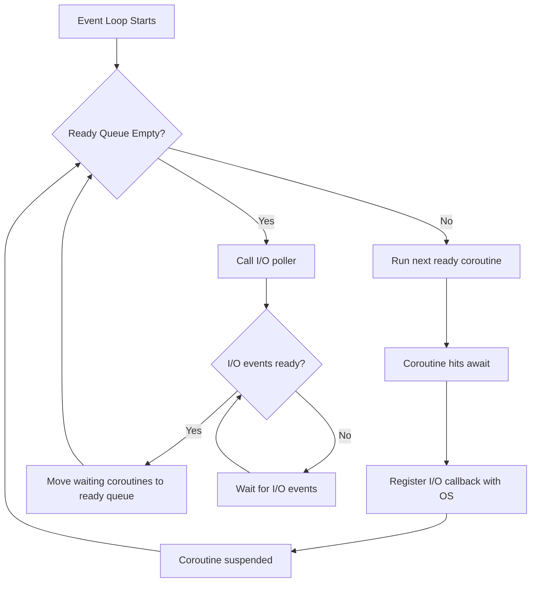
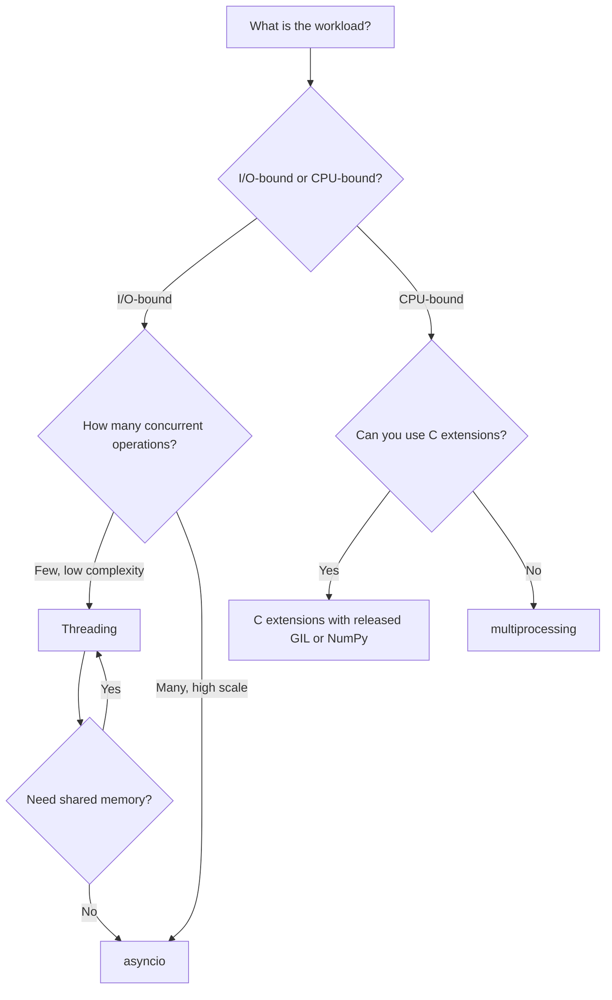

## The Problem: Concurrency in a Single-Threaded Interpreter

Python is, at its core, a sequential language. Statements execute one after another in a single thread of control. Yet real programs must deal with I/O latency (network requests, file reads, database queries), parallelizable computation, and responsive user interfaces. The question is not whether you need concurrency but **which concurrency model** fits your problem.

Python provides three distinct concurrency mechanisms, each with different trade-offs:

1. **`asyncio`** -- cooperative multitasking within a single thread via coroutines.
2. **`threading`** -- OS-level threads managed by the operating system, subject to the GIL.
3. **`multiprocessing`** -- separate OS processes with independent GILs and memory spaces.

Choosing between them requires understanding the Global Interpreter Lock, the nature of your workload (I/O-bound vs CPU-bound), and the cost model of each approach. The sections below build from the lowest level (the GIL) upward through threading, multiprocessing, and finally asyncio, so the design decisions behind each layer are clear.

## The Global Interpreter Lock (GIL)

### What the GIL Is

The GIL is a mutex that protects access to Python objects in CPython. Only the thread that holds the GIL is allowed to execute Python bytecode. This means that even on a multi-core machine, **only one thread executes Python code at any given instant**.

```python
import threading

counter = 0

def increment():
    global counter
    for _ in range(1_000_000):
        counter += 1

t1 = threading.Thread(target=increment)
t2 = threading.Thread(target=increment)
t1.start()
t2.start()
t1.join()
t2.join()

print(counter)  # Almost certainly NOT 2_000_000
```

The `counter += 1` operation compiles to multiple bytecode instructions: load `counter`, load `1`, add them, store the result. The GIL can switch between threads between any two of these instructions, producing a lost update.

### Why the GIL Exists

The GIL is not a design oversight. It is a deliberate trade-off that solves a specific problem: **CPython's memory management is not thread-safe**.

CPython uses reference counting as its primary garbage collection strategy. Every object carries a `ob_refcnt` field. When you assign an object to a new name, the reference count is incremented. When a name goes out of scope, it is decremented. If the count hits zero, the object is deallocated immediately.

This is fast and deterministic, but it means every operation on a Python object potentially mutates its reference count. If two threads simultaneously manipulated the same object's reference count, the count could become inconsistent, leading to double-frees or use-after-free bugs.

The GIL eliminates this class of bugs entirely by ensuring that only one thread executes Python bytecode at a time. Reference count mutations are serialized without any per-object locking overhead.

A second motivation: the GIL simplifies the implementation of C extension modules. Extension authors can manipulate Python objects without writing thread-safe code, because the GIL guarantees exclusive access. This decision, made in 1991, is a major reason the CPython extension ecosystem is so large.

### When the GIL Is Not a Problem

The GIL is released during I/O operations (reading from sockets, writing to files, waiting on locks) and during certain C extension calls (notably NumPy, which releases the GIL during heavy computation). This means threads can make concurrent I/O calls:

```python
import threading
import urllib.request

urls = [f"https://httpbin.org/get?id={i}" for i in range(10)]

def fetch(url):
    data = urllib.request.urlopen(url).read()
    print(f"Fetched {len(data)} bytes from {url}")

threads = [threading.Thread(target=fetch, args=(u,)) for u in urls]
for t in threads:
    t.start()
for t in threads:
    t.join()
```

Each thread blocks on `urlopen`, releasing the GIL. Other threads run during that wait. The GIL is a problem only for **CPU-bound** work that stays in pure Python code.

### When the GIL Is a Problem

Any computation that stays in Python bytecode (loops, numeric computation without NumPy, string processing, parsing) will run on a single core regardless of how many threads you spawn. Adding threads to a CPU-bound workload can actually make it **slower** due to GIL acquisition overhead and context switching.

### How to Work Around the GIL

| Strategy                        | Mechanism                                 | Use Case                             |
| ------------------------------- | ----------------------------------------- | ------------------------------------ |
| `multiprocessing`               | Separate processes, each with its own GIL | CPU-bound Python work                |
| C extensions                    | Release the GIL during heavy computation  | NumPy, SciPy, pandas                 |
| `asyncio`                       | Single-threaded cooperative multitasking  | I/O-bound work with many connections |
| Cython / `nogil`                | Compile to C, optionally release the GIL  | Performance-critical loops           |
| PEP 703 (free-threaded CPython) | Remove the GIL entirely                   | Python 3.13+ experimental builds     |

## Threading

### `threading.Thread`

The `threading` module provides OS-level threads. Each `Thread` object wraps a POSIX thread (Linux/macOS) or Windows thread. Threads share the same memory space, which is both powerful (shared data structures, zero-copy communication) and dangerous (data races, deadlocks).

```python
import threading

def worker(name, count):
    for i in range(count):
        print(f"[{name}] {i}")

t = threading.Thread(target=worker, args=("A", 3), daemon=True)
t.start()
t.join()  # Block until the thread finishes
```

### Synchronization Primitives

Because threads share memory, you need explicit synchronization to prevent data races. The `threading` module provides several primitives:

#### `Lock` and `RLock`

A `Lock` is a mutual exclusion primitive. Only one thread can hold the lock at a time. `RLock` (reentrant lock) allows the **same thread** to acquire it multiple times without deadlocking, which is useful when a method calls another method that also needs the lock.

```python
import threading

lock = threading.Lock()
counter = 0

def safe_increment():
    global counter
    with lock:
        local = counter
        local += 1
        counter = local

threads = [threading.Thread(target=safe_increment) for _ in range(100)]
for t in threads:
    t.start()
for t in threads:
    t.join()

print(counter)  # 100
```

#### `Semaphore`

A `Semaphore` controls access to a finite resource. A `Semaphore(n)` allows up to `n` threads to acquire it simultaneously.

```python
import threading

semaphore = threading.Semaphore(3)

def access_resource(thread_id):
    with semaphore:
        print(f"Thread {thread_id} acquired the semaphore")
        threading.Event().wait(1.0)  # Simulate work
        print(f"Thread {thread_id} releasing the semaphore")

for i in range(10):
    threading.Thread(target=access_resource, args=(i,), daemon=True).start()
```

#### `Event`

An `Event` is a simple signaling mechanism. One thread sets the event; other threads wait for it.

```python
import threading

event = threading.Event()

def waiter():
    print("Waiting for signal...")
    event.wait()
    print("Signal received, proceeding")

def setter():
    import time
    time.sleep(2)
    event.set()

threading.Thread(target=waiter, daemon=True).start()
threading.Thread(target=setter, daemon=True).start()
```

#### `Condition`

A `Condition` combines a lock with a wait/notify mechanism. It is useful when threads need to wait for a specific state change:

```python
import threading

buffer = []
buffer_lock = threading.Condition()

def producer():
    for i in range(5):
        with buffer_lock:
            buffer.append(i)
            print(f"Produced {i}")
            buffer_lock.notify()
        import time
        time.sleep(0.5)

def consumer():
    while True:
        with buffer_lock:
            buffer_lock.wait_for(lambda: len(buffer) > 0)
            item = buffer.pop(0)
            print(f"Consumed {item}")

threading.Thread(target=consumer, daemon=True).start()
threading.Thread(target=producer, daemon=True).start()
```

### When to Use Threading

Use threading when:

- Your workload is **I/O-bound** (network calls, file I/O, database queries).
- You need shared memory with low communication overhead.
- You are integrating with C extensions that release the GIL.

Do not use threading for CPU-bound Python work. You will not gain parallelism, and the GIL contention may slow things down.

## Multiprocessing

### `multiprocessing.Process`

The `multiprocessing` module creates separate OS processes, each with its own Python interpreter and GIL. This gives true parallelism for CPU-bound work at the cost of inter-process communication overhead.

```python
import multiprocessing

def compute_square(n):
    return n * n

if __name__ == "__main__":
    with multiprocessing.Pool(processes=4) as pool:
        results = pool.map(compute_square, range(10))
    print(results)  # [0, 1, 4, 9, 16, 25, 36, 49, 64, 81]
```

### Inter-Process Communication

Processes do not share memory. The `multiprocessing` module provides several IPC mechanisms:

#### `Queue`

A `multiprocessing.Queue` is a thread- and process-safe FIFO queue implemented with pipes and locks:

```python
import multiprocessing

def worker(queue):
    for i in range(5):
        queue.put(i * i)

if __name__ == "__main__":
    q = multiprocessing.Queue()
    p = multiprocessing.Process(target=worker, args=(q,))
    p.start()

    for _ in range(5):
        print(q.get())

    p.join()
```

#### `Pipe`

A `Pipe` creates a pair of connection objects for two-way communication between two processes:

```python
import multiprocessing

def sender(conn):
    conn.send("hello from child")
    conn.close()

if __name__ == "__main__":
    parent_conn, child_conn = multiprocessing.Pipe()
    p = multiprocessing.Process(target=sender, args=(child_conn,))
    p.start()
    print(parent_conn.recv())  # "hello from child"
    p.join()
```

#### Shared Memory

The `multiprocessing.shared_memory` module (Python 3.8+) provides `SharedMemory` for sharing data between processes without serialization:

```python
from multiprocessing import Process, shared_memory

def writer():
    shm = shared_memory.SharedMemory(name="my_shm")
    shm.buf[:11] = b"hello world"
    shm.close()

def reader():
    shm = shared_memory.SharedMemory(name="my_shm")
    print(bytes(shm.buf[:11]))  # b'hello world'
    shm.close()
    shm.unlink()

if __name__ == "__main__":
    shm = shared_memory.SharedMemory(create=True, size=11, name="my_shm")
    p1 = Process(target=writer)
    p2 = Process(target=reader)
    p1.start()
    p1.join()
    p2.start()
    p2.join()
```

### When to Use Multiprocessing

Use multiprocessing when:

- Your workload is **CPU-bound** and must run in pure Python.
- You need to bypass the GIL entirely.
- The communication overhead between processes is acceptable relative to the computation time.

Do not use multiprocessing for lightweight I/O-bound tasks. The process creation overhead (~10-50ms per process) and IPC serialization cost dwarf the benefit for short-lived, I/O-dominated workloads.

## `concurrent.futures`

The `concurrent.futures` module provides a high-level interface for running callables asynchronously using threads or processes. It abstracts away the underlying pool management and returns `Future` objects that represent pending results.

### `ThreadPoolExecutor`

```python
from concurrent.futures import ThreadPoolExecutor, as_completed
import urllib.request

urls = [f"https://httpbin.org/get?id={i}" for i in range(5)]

def fetch(url):
    return urllib.request.urlopen(url, timeout=10).read()

with ThreadPoolExecutor(max_workers=3) as executor:
    future_to_url = {executor.submit(fetch, url): url for url in urls}
    for future in as_completed(future_to_url):
        url = future_to_url[future]
        data = future.result()
        print(f"{url}: {len(data)} bytes")
```

### `ProcessPoolExecutor`

```python
from concurrent.futures import ProcessPoolExecutor

def factorize(n):
    factors = []
    d = 2
    while d * d <= n:
        while n % d == 0:
            factors.append(d)
            n //= d
        d += 1
    if n > 1:
        factors.append(n)
    return factors

numbers = [2**20 - 1, 2**25 - 1, 2**30 - 1, 2**31 - 1]

with ProcessPoolExecutor(max_workers=4) as executor:
    results = dict(zip(numbers, executor.map(factorize, numbers)))

for n, factors in results.items():
    print(f"{n} = {' * '.join(map(str, factors))}")
```

### `concurrent.futures` vs Raw `threading` / `multiprocessing`

`concurrent.futures` is almost always preferable to raw thread/process management because:

- It manages the pool lifecycle (creation, reuse, cleanup).
- It provides `Future` objects with `.result()`, `.exception()`, `.cancel()`, and `.add_done_callback()`.
- It integrates with `as_completed()` for processing results as they arrive.
- The context manager (`with` statement) ensures clean shutdown.

Use raw `threading` / `multiprocessing` only when you need fine-grained control over thread/process lifecycle, custom synchronization patterns, or long-lived background workers.

## `asyncio`: Cooperative Multitasking

### Why `asyncio` Exists Alongside Threading

Thread-based concurrency has inherent costs even when the GIL is not a problem:

1. **Memory overhead.** Each OS thread requires a stack (typically 1-8 MB). 10,000 threads = 10-80 GB of virtual memory. The OS scheduler must manage all of them.

2. **Context switch cost.** Switching between OS threads involves a kernel-mode transition, saving and restoring register state, and TLB flushes. This costs ~1-10 microseconds per switch.

3. **Synchronization complexity.** Shared mutable state requires locks, which introduce deadlocks, priority inversion, and other hard-to-debug issues.

4. **Scaling ceiling.** The C10K problem: handling 10,000+ concurrent connections with threads is impractical on most systems.

`asyncio` solves these problems by using **coroutines** -- functions that can suspend and resume voluntarily. There is only one thread and one OS-level context. "Context switching" between coroutines is a Python-level function call that costs ~100 nanoseconds, orders of magnitude cheaper than an OS thread switch.

The trade-off: coroutines are **cooperative**, meaning they must explicitly yield control. A long-running CPU-bound computation will block the entire event loop. `asyncio` is not a replacement for threading or multiprocessing; it is a specialized tool for I/O-bound concurrency at scale.

### Coroutines: `async def` and `await`

A coroutine is defined with `async def` and can use `await` to suspend execution until an awaitable completes:

```python
import asyncio

async def fetch_data(delay: float) -> str:
    await asyncio.sleep(delay)
    return f"data after {delay}s"

async def main():
    result = await fetch_data(1.0)
    print(result)

asyncio.run(main())
```

The `await` keyword does three things:

1. Suspends the current coroutine.
2. Returns control to the event loop.
3. Registers a callback so the coroutine resumes when the awaited operation completes.

Critically, `await` can only be used inside an `async def` function. This is enforced by the compiler. You cannot `await` in a regular function, and you cannot mix synchronous and asynchronous code accidentally.

### The Event Loop

The event loop is the central scheduler in `asyncio`. It maintains two queues:

1. **Ready queue.** Coroutines that are ready to run (their awaited operation has completed).
2. **I/O poller.** A system call (`epoll` on Linux, `kqueue` on macOS, `IOCP` on Windows) that monitors file descriptors for readability/writability.



When a coroutine awaits an I/O operation, the event loop registers the corresponding file descriptor with the OS poller and moves to the next ready coroutine. When the OS reports the descriptor is ready, the event loop places the waiting coroutine back in the ready queue. This is how thousands of I/O-bound operations run concurrently on a single thread.

### `asyncio.run()`

`asyncio.run()` is the entry point. It creates a new event loop, runs the passed coroutine to completion, and closes the loop:

```python
import asyncio

async def main():
    print("hello")
    await asyncio.sleep(1)
    print("world")

asyncio.run(main())
```

You must call `asyncio.run()` exactly once per program. It manages the lifecycle of the event loop, sets up signal handlers, and ensures cleanup. Calling `asyncio.run()` inside an already-running loop raises a `RuntimeError`.

### `asyncio.create_task()`

`create_task()` schedules a coroutine to run **concurrently** with the current coroutine. It returns a `Task` object immediately without waiting for the coroutine to finish:

```python
import asyncio

async def countdown(name: str, seconds: int):
    for i in range(seconds, 0, -1):
        print(f"{name}: {i}")
        await asyncio.sleep(1)
    print(f"{name}: done")

async def main():
    task1 = asyncio.create_task(countdown("A", 3))
    task2 = asyncio.create_task(countdown("B", 3))

    await task1
    await task2

asyncio.run(main())
```

Without `create_task()`, you would have to `await countdown("A", 3)` and then `await countdown("B", 3)`, which would run them sequentially. `create_task()` enables concurrent execution.

### `asyncio.gather()`

`gather()` runs multiple awaitables concurrently and collects their results:

```python
import asyncio

async def fetch(url: str) -> str:
    await asyncio.sleep(1)
    return f"response from {url}"

async def main():
    urls = ["https://a.com", "https://b.com", "https://c.com"]
    results = await asyncio.gather(*(fetch(u) for u in urls))
    print(results)

asyncio.run(main())
```

By default, `gather()` returns results in the order the awaitables were passed, not the order they completed. Use `return_exceptions=True` to prevent one failure from cancelling the others:

```python
async def main():
    results = await asyncio.gather(
        fetch("https://a.com"),
        fetch("https://invalid"),
        fetch("https://c.com"),
        return_exceptions=True,
    )
    for r in results:
        if isinstance(r, Exception):
            print(f"Failed: {r}")
        else:
            print(f"Success: {r}")
```

### `asyncio.wait()`

`wait()` provides more control than `gather()`. It returns two sets: completed and pending tasks, and supports multiple wait strategies:

```python
import asyncio

async def compute(n: int) -> int:
    await asyncio.sleep(n)
    return n

async def main():
    tasks = [asyncio.create_task(compute(i)) for i in range(1, 6)]

    done, pending = await asyncio.wait(
        tasks,
        return_when=asyncio.FIRST_COMPLETED,
    )
    print(f"First completed: {done.pop().result()}")

    done2, pending2 = await asyncio.wait(
        pending,
        return_when=asyncio.ALL_COMPLETED,
    )
    print(f"Remaining: {[t.result() for t in done2]}")

asyncio.run(main())
```

The `return_when` parameter accepts three strategies:

- `asyncio.ALL_COMPLETED` (default): wait for all tasks.
- `asyncio.FIRST_COMPLETED`: return when any task finishes.
- `asyncio.FIRST_EXCEPTION`: return when any task raises, or all complete successfully.

### `asyncio.TaskGroup` (Python 3.11+)

`TaskGroup` provides structured concurrency. All tasks created within the group are awaited when the group exits. If any task raises an exception, all remaining tasks are cancelled:

```python
import asyncio

async def fetch_user(user_id: int) -> dict:
    await asyncio.sleep(0.5)
    return {"id": user_id, "name": f"user_{user_id}"}

async def fetch_orders(user_id: int) -> list:
    await asyncio.sleep(0.3)
    return [{"id": 1, "user_id": user_id}]

async def main():
    async with asyncio.TaskGroup() as tg:
        user_task = tg.create_task(fetch_user(1))
        orders_task = tg.create_task(fetch_orders(1))

    user = user_task.result()
    orders = orders_task.result()
    print(user, orders)

asyncio.run(main())
```

`TaskGroup` is preferable to `gather()` for new code because it enforces cancellation semantics: if one task fails, the others are not silently abandoned. With `gather()`, failed tasks are replaced by exceptions in the result list, but other tasks continue running in the background.

### Async Context Managers

An async context manager uses `async with` and defines `__aenter__` and `__aexit__` coroutines:

```python
import asyncio

class AsyncTimer:
    def __init__(self, name: str):
        self.name = name
        self.elapsed = 0.0

    async def __aenter__(self):
        self._start = asyncio.get_event_loop().time()
        return self

    async def __aexit__(self, exc_type, exc_val, exc_tb):
        self.elapsed = asyncio.get_event_loop().time() - self._start
        print(f"[{self.name}] {self.elapsed:.3f}s")
        return False

async def main():
    async with AsyncTimer("fetch"):
        await asyncio.sleep(1)

asyncio.run(main())
```

The `@asynccontextmanager` decorator from `contextlib` provides a generator-based alternative:

```python
from contextlib import asynccontextmanager
import asyncio

@asynccontextmanager
async def managed_resource():
    print("Acquiring resource")
    await asyncio.sleep(0.1)
    try:
        yield {"data": 42}
    finally:
        print("Releasing resource")

async def main():
    async with managed_resource() as resource:
        print(f"Using resource: {resource}")

asyncio.run(main())
```

### Async Iterators

An async iterator defines `__aiter__` and `__anext__` and is consumed with `async for`:

```python
import asyncio

class AsyncRange:
    def __init__(self, start: int, stop: int, delay: float = 0.1):
        self.start = start
        self.stop = stop
        self.delay = delay

    def __aiter__(self):
        self.current = self.start
        return self

    async def __anext__(self) -> int:
        if self.current >= self.stop:
            raise StopAsyncIteration
        await asyncio.sleep(self.delay)
        value = self.current
        self.current += 1
        return value

async def main():
    async for value in AsyncRange(0, 5):
        print(value)

asyncio.run(main())
```

The `@async_generator` pattern (using `async yield`) is available via `@async_generator` from the `async_generator` package, but native async generators are supported directly in Python 3.6+:

```python
import asyncio

async def async_count(limit: int):
    for i in range(limit):
        await asyncio.sleep(0.1)
        yield i

async def main():
    async for value in async_count(5):
        print(value)

asyncio.run(main())
```

## `aiohttp`: Async HTTP Client and Server

### HTTP Client

`aiohttp` provides an `AsyncSession` for making concurrent HTTP requests. Unlike `urllib.request`, it does not block the event loop:

```python
import asyncio
import aiohttp

async def fetch(session: aiohttp.ClientSession, url: str) -> dict:
    async with session.get(url) as response:
        response.raise_for_status()
        return await response.json()

async def main():
    urls = [
        "https://jsonplaceholder.typicode.com/posts/1",
        "https://jsonplaceholder.typicode.com/posts/2",
        "https://jsonplaceholder.typicode.com/posts/3",
    ]

    async with aiohttp.ClientSession() as session:
        tasks = [fetch(session, url) for url in urls]
        results = await asyncio.gather(*tasks)

    for r in results:
        print(r["title"])

asyncio.run(main())
```

Using a single `ClientSession` is critical. Each session manages a connection pool internally. Creating a new session per request defeats connection pooling and can exhaust file descriptors.

### HTTP Server

```python
from aiohttp import web
import asyncio

async def handle_index(request: web.Request) -> web.Response:
    return web.Response(text="Hello, world")

async def handle_items(request: web.Request) -> web.Response:
    name = request.match_info.get("name", "unknown")
    await asyncio.sleep(0.1)
    return web.json_response({"name": name})

app = web.Application()
app.router.add_get("/", handle_index)
app.router.add_get("/items/{name}", handle_items)

if __name__ == "__main__":
    web.run_app(app, port=8080)
```

## Choosing the Right Concurrency Model



| Dimension            | `asyncio`                          | `threading`                       | `multiprocessing`                 |
| -------------------- | ---------------------------------- | --------------------------------- | --------------------------------- |
| Parallelism          | No (single thread)                 | No (GIL)                          | Yes (separate processes)          |
| Best for             | Many I/O-bound tasks               | Few I/O-bound tasks, shared state | CPU-bound computation             |
| Memory per unit      | ~1 KB (coroutine frame)            | ~1-8 MB (thread stack)            | ~10-50 MB (process + interpreter) |
| Communication        | `await` (zero-copy, cooperative)   | Shared memory (needs locks)       | IPC (serialization required)      |
| Scaling limit        | Tens of thousands of coroutines    | Hundreds of threads               | Dozens of processes               |
| Debugging difficulty | Moderate (implicit state machines) | Hard (race conditions)            | Moderate (IPC issues)             |
| Cancellation         | Built-in (`Task.cancel()`)         | Manual (requires flag or event)   | Manual (requires IPC signal)      |

### Decision Framework

1. **Start with `asyncio`** if your workload is primarily I/O-bound (HTTP requests, database queries, WebSocket connections). It scales to thousands of concurrent operations with minimal memory overhead. The `aiohttp`, `asyncpg`, `aioredis`, and `httpx` libraries provide async interfaces for most common I/O operations.

2. **Use `threading`** when you need to call blocking synchronous code from an async program (via `asyncio.to_thread()`), when you need shared mutable state with low-latency communication, or when you are wrapping a C library that is not async-aware.

3. **Use `multiprocessing`** (or `ProcessPoolExecutor`) when you have CPU-bound work that cannot be offloaded to a C extension. The serialization cost of sending data between processes means this is only worthwhile for computation that takes significantly longer than the IPC overhead.

4. **Combine them.** The most robust servers use all three: `asyncio` for the I/O event loop, `asyncio.to_thread()` for occasional blocking calls, and `ProcessPoolExecutor` for CPU-bound request handlers:

```python
import asyncio
from concurrent.futures import ProcessPoolExecutor

def heavy_computation(data: bytes) -> dict:
    import hashlib
    return {"sha256": hashlib.sha256(data).hexdigest()}

async def handler(body: bytes) -> dict:
    loop = asyncio.get_running_loop()
    with ProcessPoolExecutor() as pool:
        result = await loop.run_in_executor(pool, heavy_computation, body)
    return result

async def main():
    body = b"some large payload" * 10000
    result = await handler(body)
    print(result)

asyncio.run(main())
```

## Common Pitfalls

### Blocking the Event Loop

The single most common mistake in asyncio code is calling a blocking function inside a coroutine. This freezes the entire event loop, preventing any other coroutine from making progress:

```python
import asyncio
import time

async def bad():
    time.sleep(2)  # BLOCKS the entire event loop for 2 seconds

async def good():
    await asyncio.sleep(2)  # Yields control back to the event loop

async def main():
    asyncio.create_task(bad())
    asyncio.create_task(good())

asyncio.run(main())
```

Use `asyncio.to_thread()` to run blocking functions in a worker thread without freezing the event loop:

```python
import asyncio
import time

async def main():
    result = await asyncio.to_thread(time.sleep, 2)
    print("Done")

asyncio.run(main())
```

### Forgetting to `await`

Calling an async function without `await` does not execute it. It returns a coroutine object, which is silently discarded:

```python
import asyncio

async def fetch():
    await asyncio.sleep(1)
    return "data"

async def main():
    fetch()  # BUG: coroutine created but never awaited
    # Nothing happens -- no error, no data

asyncio.run(main())
```

### `asyncio.run()` Called Multiple Times

`asyncio.run()` creates and closes an event loop. You cannot nest it:

```python
import asyncio

async def inner():
    asyncio.run(some_coroutine())  # RuntimeError: no running event loop

async def outer():
    await inner()

asyncio.run(outer())
```

### Fire-and-Forget Tasks Without Reference

Creating a task without keeping a reference can lead to silent failures:

```python
import asyncio

async def work():
    raise ValueError("oops")

async def main():
    asyncio.create_task(work())  # Exception is never observed
    await asyncio.sleep(1)       # Task is garbage collected, exception logged as "Task exception was never retrieved"

asyncio.run(main())
```

Keep a reference to the task and await it, or use `TaskGroup` which handles this automatically.

## Summary

Python provides three concurrency mechanisms because no single model is optimal for all workloads. The GIL makes threading unsuitable for CPU-bound parallelism but acceptable for I/O-bound concurrency. `asyncio` avoids the memory and scheduling overhead of threads by using cooperative coroutines, scaling to orders of magnitude more concurrent operations. `multiprocessing` provides true parallelism at the cost of inter-process communication overhead. The practical approach is to use `asyncio` as the default for I/O-bound work, `ProcessPoolExecutor` for CPU-bound bursts, and `asyncio.to_thread()` as a bridge between the two worlds.
