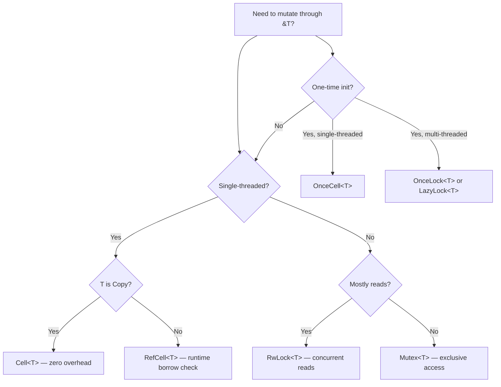

## The Shared Reference Contract

Rust's borrowing rules state that a shared reference (`&T`) is immutable — you cannot modify the
data through it. This is a compile-time guarantee that prevents data races and enables safe
concurrency. However, there are legitimate cases where you need to mutate data through a shared
reference. Interior mutability types provide this capability while maintaining safety guarantees.

The core tension: `&T` promises the caller that the data will not change, but sometimes the data
needs to change in response to operations that only have a shared reference available. Interior
mutability resolves this by moving the mutation check from compile time to runtime (for
single-threaded types) or by using synchronization primitives (for multi-threaded types).

## `UnsafeCell<T>` — The Primitive

`UnsafeCell<T>` is the foundation of all interior mutability in Rust. It is the only type in the
standard library that allows you to obtain a mutable reference to its interior through a shared
reference. All other interior mutability types (`Cell`, `RefCell`, `Mutex`, `RwLock`) are built on
top of `UnsafeCell`.

```rust
use std::cell::UnsafeCell;

struct Counter {
    value: UnsafeCell<i32>,
}

impl Counter {
    fn new(value: i32) -> Self {
        Counter {
            value: UnsafeCell::new(value),
        }
    }

    fn increment(&self) {
        unsafe {
            *self.value.get() += 1;
        }
    }

    fn get(&self) -> i32 {
        unsafe { *self.value.get() }
    }
}
```

:::danger

Accessing `UnsafeCell` requires `unsafe` because the compiler cannot verify that you are not
creating two mutable references to the same data simultaneously. You are responsible for maintaining
the aliasing invariant. Violating this is undefined behavior.

:::

### Why `UnsafeCell` Exists

The compiler assumes that `&T` never allows mutation. `UnsafeCell` is the escape hatch that tells
the compiler "I will manage the aliasing rules myself." Without `UnsafeCell`, it would be impossible
to implement `Cell`, `RefCell`, `Mutex`, or any other interior mutability type.

### `UnsafeCell` and `Sync`

Types containing `UnsafeCell` are not `Sync` by default. If you want to make a type containing
`UnsafeCell` thread-safe, you must implement `Sync` manually with `unsafe impl Sync`:

```rust
use std::cell::UnsafeCell;
use std::sync::atomic::{AtomicIsize, Ordering};

struct AtomicCounter {
    value: UnsafeCell<i64>,
}

unsafe impl Sync for AtomicCounter {}

impl AtomicCounter {
    fn new(value: i64) -> Self {
        AtomicCounter {
            value: UnsafeCell::new(value),
        }
    }
}
```

This is only sound if you can prove that all accesses to the interior are properly synchronized
(e.g., via atomics, locks, or platform-specific memory barriers).

## `Cell<T>` — Copy-Based Interior Mutability

`Cell<T>` provides interior mutability for `Copy` types. The value is stored inline (no heap
allocation), and you can only access it by copying:

```rust
use std::cell::Cell;

let counter = Cell::new(0);
counter.set(42);
assert_eq!(counter.get(), 42);

counter.set(counter.get() + 1);
assert_eq!(counter.get(), 43);
```

### `Cell` API

| Method           | Description                                        |
| ---------------- | -------------------------------------------------- |
| `new(value)`     | Creates a new `Cell` containing `value`            |
| `get()`          | Returns a copy of the value (requires `T: Copy`)   |
| `set(value)`     | Replaces the interior value                        |
| `replace(value)` | Replaces and returns the old value (any `T`)       |
| `take()`         | Replaces with `Default::default()` and returns old |
| `into_inner()`   | Consumes the `Cell` and returns the inner value    |

### `Cell` with Non-Copy Types

`Cell` works with non-`Copy` types for `set`, `replace`, and `take`, but not `get`:

```rust
use std::cell::Cell;

let cell = Cell::new(String::from("hello"));

// cell.get();  // ERROR: String does not implement Copy

let old = cell.replace(String::from("world"));
assert_eq!(old, "hello");
assert_eq!(cell.take(), "world");
assert_eq!(cell.take(), "");  // String::default()
```

### `Cell` Use Cases

**1. Reference Counting:**

`Rc` uses `Cell` internally for the reference count:

```rust
use std::cell::Cell;
use std::rc::Rc;

let a = Rc::new(Cell::new(42));
let b = Rc::clone(&a);
let c = Rc::clone(&a);

assert_eq!(Rc::strong_count(&a), 3);
a.set(100);
assert_eq!(b.get(), 100);
```

**2. Mutable Flags in Immutable Contexts:**

```rust
use std::cell::Cell;

struct Logger {
    level: Cell<log::Level>,
}

impl Logger {
    fn new(level: log::Level) -> Self {
        Logger { level: Cell::new(level) }
    }

    fn set_level(&self, level: log::Level) {
        self.level.set(level);
    }

    fn get_level(&self) -> log::Level {
        self.level.get()
    }
}
```

**3. Interior Mutation in Closures:**

```rust
use std::cell::Cell;

fn count_calls() -> impl Fn() -> usize {
    let counter = Cell::new(0);
    move || {
        let n = counter.get() + 1;
        counter.set(n);
        n
    }
}

let f = count_calls();
assert_eq!(f(), 1);
assert_eq!(f(), 2);
assert_eq!(f(), 3);
```

### `Cell` Performance

`Cell` has zero overhead beyond the inline storage. There is no reference counting, no runtime
borrow checking, and no heap allocation. The compiler typically inlines all `Cell` operations.

## `RefCell<T>` — Reference-Based Interior Mutability

`RefCell<T>` provides interior mutability for any type `T`. It tracks borrows at runtime using a
reference count and panics if the borrowing rules are violated:

```rust
use std::cell::RefCell;

let data = RefCell::new(vec![1, 2, 3]);

let borrow1 = data.borrow();
let borrow2 = data.borrow();
assert_eq!(*borrow1, vec![1, 2, 3]);
assert_eq!(*borrow2, vec![1, 2, 3]);

// data.borrow_mut();  // PANIC: already borrowed immutably

drop(borrow1);
drop(borrow2);
let mut borrow3 = data.borrow_mut();
borrow3.push(4);
assert_eq!(*borrow3, vec![1, 2, 3, 4]);
```

### `RefCell` API

| Method             | Returns          | Description                                    |
| ------------------ | ---------------- | ---------------------------------------------- |
| `new(value)`       | `RefCell<T>`     | Creates a new `RefCell`                        |
| `borrow()`         | `Ref<T>`         | Immutable borrow, panics if mutably borrowed   |
| `borrow_mut()`     | `RefMut<T>`      | Mutable borrow, panics if any borrow exists    |
| `try_borrow()`     | `Result<Ref>`    | Non-panicking immutable borrow                 |
| `try_borrow_mut()` | `Result<RefMut>` | Non-panicking mutable borrow                   |
| `into_inner()`     | `T`              | Consumes the `RefCell` and returns inner value |

### `Ref` and `RefMut` Guards

`Ref<T>` and `RefMut<T>` are RAII guards that track the borrow. When the guard is dropped, the
borrow count is decremented:

```rust
use std::cell::RefCell;

let data = RefCell::new(String::from("hello"));

{
    let mut guard = data.borrow_mut();
    guard.push_str(", world");
}  // guard dropped here, borrow_mut count decremented

let guard = data.borrow();
assert_eq!(*guard, "hello, world");
```

### `RefCell` Borrow Tracking

`RefCell` maintains two counters:

```
┌──────────────────────────────┐
│  RefCell<T>                  │
│  ┌────────────┬────────────┐ │
│  │ borrow_count │ borrow_mut │ │
│  │    (usize)  │  (bool)    │ │
│  └────────────┴────────────┘ │
│                              │
│  borrow_count > 0: can borrow immutably   │
│  borrow_count == 0 && !borrow_mut: can borrow mutably │
│  borrow_mut: cannot borrow at all         │
└──────────────────────────────────────────┘
```

### `RefCell` in Structs

```rust
use std::cell::RefCell;

struct Graph<'a> {
    nodes: Vec<Node<'a>>,
}

struct Node<'a> {
    value: i32,
    neighbors: RefCell<Vec<&'a Node<'a>>>,
}

fn build_graph() {
    let a = Node { value: 1, neighbors: RefCell::new(vec![]) };
    let b = Node { value: 2, neighbors: RefCell::new(vec![]) };
    let c = Node { value: 3, neighbors: RefCell::new(vec![]) };

    a.neighbors.borrow_mut().push(&b);
    a.neighbors.borrow_mut().push(&c);
    b.neighbors.borrow_mut().push(&a);
    c.neighbors.borrow_mut().push(&a);

    assert_eq!(a.neighbors.borrow().len(), 2);
    assert_eq!(b.neighbors.borrow().len(), 1);
}
```

### `RefCell` Error Handling

Use `try_borrow` and `try_borrow_mut` to handle borrow conflicts gracefully:

```rust
use std::cell::{RefCell, BorrowMutError};

let data = RefCell::new(vec![1, 2, 3]);

{
    let _guard = data.borrow();
    match data.try_borrow_mut() {
        Ok(mut guard) => {
            guard.push(4);
        }
        Err(BorrowMutError { .. }) => {
            eprintln!("cannot borrow mutably — already borrowed immutably");
        }
    }
}
```

## Thread-Safe Interior Mutability

### `Mutex<T>`

`Mutex<T>` provides mutual exclusion for interior mutability across threads. Only one thread can
access the data at a time:

```rust
use std::sync::{Arc, Mutex};
use std::thread;

let counter = Arc::new(Mutex::new(0));
let mut handles = vec![];

for _ in 0..10 {
    let counter = Arc::clone(&counter);
    handles.push(thread::spawn(move || {
        let mut num = counter.lock().unwrap();
        *num += 1;
    }));
}

for handle in handles {
    handle.join().unwrap();
}

assert_eq!(*counter.lock().unwrap(), 10);
```

### `Mutex` vs `RefCell`

| Property      | `RefCell<T>`         | `Mutex<T>`                |
| ------------- | -------------------- | ------------------------- |
| Thread safety | Single-threaded only | Multi-threaded            |
| Borrow check  | Runtime (panic)      | Runtime (blocking)        |
| Overhead      | Minimal (counters)   | System call on contention |
| Poisoning     | No                   | Yes (panic while locked)  |
| `Send + Sync` | Neither              | Both (when `T: Send`)     |

### `RwLock<T>`

`RwLock<T>` allows multiple concurrent readers or a single exclusive writer:

```rust
use std::sync::RwLock;

let lock = RwLock::new(5);

{
    let r1 = lock.read().unwrap();
    let r2 = lock.read().unwrap();
    assert_eq!(*r1, *r2);
}

{
    let mut w = lock.write().unwrap();
    *w += 1;
}
```

### When to Use Which

```
Need interior mutability?
│
├── Single-threaded?
│   ├── Copy types only? → Cell<T>
│   └── Any type? → RefCell<T>
│
└── Multi-threaded?
    ├── Mostly writes? → Mutex<T>
    ├── Mostly reads? → RwLock<T>
    └── One-time init? → OnceLock<T> / LazyLock<T>
```

## `OnceCell<T>` and `LazyLock<T>`

### `OnceCell<T>` (Stable since Rust 1.70)

`OnceCell` stores a value that is initialized at most once. It is useful for lazy initialization and
for storing values that are set during construction:

```rust
use std::cell::OnceCell;

struct Config {
    database_url: OnceCell<String>,
}

impl Config {
    fn new() -> Self {
        Config {
            database_url: OnceCell::new(),
        }
    }

    fn set_database_url(&self, url: String) -> Result<(), String> {
        self.database_url.set(url).map_err(|_| "already set".to_string())
    }

    fn get_database_url(&self) -> Option<&String> {
        self.database_url.get()
    }
}
```

### `LazyLock<T>` (Stable since Rust 1.80)

`LazyLock` initializes the value on first access using a closure:

```rust
use std::sync::LazyLock;
use std::collections::HashMap;

static GLOBAL_CONFIG: LazyLock<HashMap<String, String>> = LazyLock::new(|| {
    let mut m = HashMap::new();
    m.insert("port".to_string(), "8080".to_string());
    m.insert("host".to_string(), "localhost".to_string());
    m
});

fn main() {
    let port = GLOBAL_CONFIG.get("port").unwrap();
    assert_eq!(port, "8080");
}
```

`LazyLock` is thread-safe — the initialization closure runs exactly once, even if multiple threads
access the value concurrently.

## `OnceCell` vs `OnceLock` vs `LazyLock`

| Type          | Thread-safe | Lazy init | Set once |
| ------------- | ----------- | --------- | -------- |
| `OnceCell<T>` | No          | No        | Yes      |
| `OnceLock<T>` | Yes         | No        | Yes      |
| `LazyLock<T>` | Yes         | Yes       | Yes      |

Use `OnceCell` in single-threaded contexts, `OnceLock` for thread-safe one-time initialization with
manual set, and `LazyLock` for thread-safe lazy initialization with a closure.

## Interior Mutability Patterns

### Observer Pattern

```rust
use std::cell::RefCell;
use std::rc::{Rc, Weak};

struct EventSource {
    listeners: RefCell<Vec<Weak<dyn Fn(i32)>>>,
}

impl EventSource {
    fn new() -> Self {
        EventSource {
            listeners: RefCell::new(vec![]),
        }
    }

    fn subscribe(&self, listener: Weak<dyn Fn(i32)>) {
        self.listeners.borrow_mut().push(listener);
    }

    fn emit(&self, value: i32) {
        let mut listeners = self.listeners.borrow_mut();
        listeners.retain(|weak| {
            if let Some(listener) = weak.upgrade() {
                listener(value);
                true
            } else {
                false
            }
        });
    }
}
```

### Graph Structures

Graphs with back-references require interior mutability because nodes reference each other in
cycles:

```rust
use std::cell::RefCell;
use std::rc::{Rc, Weak};

struct Node {
    value: i32,
    children: RefCell<Vec<Rc<Node>>>,
    parent: RefCell<Weak<Node>>,
}

impl Node {
    fn new(value: i32) -> Rc<Self> {
        Rc::new(Node {
            value,
            children: RefCell::new(vec![]),
            parent: RefCell::new(Weak::new()),
        })
    }

    fn add_child(parent: &Rc<Node>, child: Rc<Node>) {
        child.parent.borrow_mut().set(Rc::downgrade(parent));
        parent.children.borrow_mut().push(child);
    }
}
```

### Memoization

```rust
use std::cell::RefCell;
use std::collections::HashMap;

struct Memoizer<F>
where
    F: Fn(u64) -> u64,
{
    f: F,
    cache: RefCell<HashMap<u64, u64>>,
}

impl<F> Memoizer<F>
where
    F: Fn(u64) -> u64,
{
    fn new(f: F) -> Self {
        Memoizer {
            f,
            cache: RefCell::new(HashMap::new()),
        }
    }

    fn call(&self, arg: u64) -> u64 {
        if let Some(&result) = self.cache.borrow().get(&arg) {
            return result;
        }
        let result = (self.f)(arg);
        self.cache.borrow_mut().insert(arg, result);
        result
    }
}
```

## Performance Implications

### `Cell` Overhead

`Cell` has zero runtime overhead. All operations compile to direct memory access. The value is
stored inline within the `Cell`, which itself has the same size as `T`.

```rust
assert_eq!(std::mem::size_of::<Cell<u64>>(), 8);
assert_eq!(std::mem::size_of::<Cell<[u8; 1024]>>(), 1024);
```

### `RefCell` Overhead

`RefCell` stores the value inline plus a borrow counter (typically 2 bytes on 64-bit). Each
`borrow()` and `borrow_mut()` increments or decrements the counter. `try_borrow` variants have the
same cost but return `Result` instead of panicking.

```rust
assert_eq!(std::mem::size_of::<RefCell<u64>>(), 16);  // 8 bytes value + overhead
```

### `Mutex` Overhead

`Mutex` has a system-level overhead: on Linux, it uses `pthread_mutex_t` (40 bytes). Locking is a
system call on contention and a single atomic operation when uncontended. `Mutex` always allocates
the value on the heap (it uses `alloc::sys::Exclusive::new` internally in some cases).

```rust
assert_eq!(std::mem::size_of::<Mutex<u64>>(), 40);  // platform-dependent
```

### `RwLock` Overhead

`RwLock` is larger than `Mutex` (48 bytes on Linux) because it must track multiple readers. Read
locks are cheaper than write locks but still involve atomic operations. Write locks are comparable
to `Mutex` locks.

## `Cell` vs `RefCell` Decision Guide

Use `Cell<T>` when:

- `T` is `Copy` and you only need simple get/set semantics
- You do not need to hold a reference to the interior value
- Performance is critical and you want zero overhead

Use `RefCell<T>` when:

- `T` is not `Copy` (e.g., `String`, `Vec`, custom structs)
- You need to borrow the interior value (read or write) through a guard
- You need dynamic borrow checking with error handling

Use `Mutex<T>` when:

- Multiple threads need access to the data
- The critical section may be held across `.await` points (use `tokio::sync::Mutex`)
- You need poisoning semantics (detecting panics in critical sections)

## Common Pitfalls

1. **`RefCell` panics in production.** `borrow_mut()` panics if there is an outstanding immutable
   borrow. In a long-running service, this crashes the process. Use `try_borrow_mut()` and handle
   the error, or restructure your code to avoid overlapping borrows.

2. **Using `RefCell` across threads.** `RefCell` is not `Send` or `Sync`. The compiler prevents
   cross-thread use, but if you bypass this with `unsafe`, you will have data races. Use `Mutex` or
   `RwLock` for multi-threaded interior mutability.

3. **Holding `Ref` guards too long.** A `Ref` or `RefMut` guard keeps the borrow active until it is
   dropped. If you store the guard in a struct or return it from a function, the borrow persists,
   potentially causing later `borrow_mut()` calls to panic. Drop guards as soon as possible.

4. **`Mutex` poisoning causing cascading failures.** If one thread panics while holding a `Mutex`,
   the mutex becomes poisoned. Subsequent `lock()` calls return `Err`. Use
   `lock().unwrap_or_else(|e| e.into_inner())` if you want to recover from poisoning, but be aware
   that the data may be in an inconsistent state.

5. **Using `std::sync::Mutex` in async code.** A `std::sync::Mutex` blocks the OS thread while held.
   If held across an `.await` point, it blocks all other async tasks on that thread. Use
   `tokio::sync::Mutex` for async contexts, or restructure to drop the lock before awaiting.

6. **`Cell` with non-Copy types and `get()`.** `Cell::get()` requires `T: Copy`. For non-Copy types,
   use `borrow()` on a `RefCell` or `replace()`/`take()` on a `Cell`.

7. **Forgetting that `UnsafeCell` requires `unsafe`.** Direct access to `UnsafeCell::get()` returns
   a raw pointer. Dereferencing it requires `unsafe` and you must maintain the aliasing invariant
   manually. Prefer `Cell` or `RefCell` unless you are building a custom synchronization primitive.

8. **Overusing interior mutability.** Interior mutability should be a deliberate design choice, not
   a default. If you find yourself wrapping everything in `RefCell`, consider restructuring your
   ownership model. Interior mutability hides mutation from the type system, making code harder to
   reason about.

9. **`LazyLock` initialization panics.** If the initialization closure panics, the `LazyLock` enters
   a poisoned state and all subsequent accesses panic. Guard against initialization failures if the
   closure can fail.

10. **Deadlocks with `Mutex` and `RwLock`.** Acquiring locks in inconsistent order across threads
    causes deadlocks. Always define and follow a lock ordering protocol. Use `try_lock()` with
    backoff for lock acquisition that can fail gracefully.

## Interior Mutability and the Drop Order

### Dropping `RefCell` with Active Borrows

When a `RefCell` is dropped while a `Ref` or `RefMut` guard exists, the guard keeps the borrow alive
until it is dropped. This means the `RefCell`'s destructor runs after the guard is dropped:

```rust
use std::cell::RefCell;

let cell = RefCell::new(vec![1, 2, 3]);
let guard = cell.borrow();

// guard is still active — cell's data is borrowed
// When cell is dropped, the borrow is still tracked
// But since guard holds a reference to cell's data, the drop order is:
// 1. guard is dropped (borrow count decremented)
// 2. cell is dropped (data deallocated)
drop(cell);  // ERROR: cannot move out of borrowed content
```

### Interior Mutability in Drop Implementations

```rust
use std::cell::RefCell;

struct SharedCounter {
    count: RefCell<usize>,
    name: String,
}

impl SharedCounter {
    fn new(name: &str) -> Self {
        SharedCounter {
            count: RefCell::new(0),
            name: name.to_string(),
        }
    }

    fn increment(&self) {
        *self.count.borrow_mut() += 1;
    }
}

impl Drop for SharedCounter {
    fn drop(&mut self) {
        // Safe to access count during drop — no other borrows can exist
        // because we have &mut self
        let final_count = *self.count.borrow();
        println!("{} was incremented {} times", self.name, final_count);
    }
}
```

## Comparison: All Interior Mutability Types

```rust
use std::cell::{Cell, OnceCell, RefCell};
use std::sync::{LazyLock, Mutex, OnceLock, RwLock};

// Cell: Copy types, zero overhead
let cell = Cell::new(42);
cell.set(cell.get() + 1);

// RefCell: Any type, runtime borrow checking
let refcell = RefCell::new(vec![1, 2, 3]);
let mut guard = refcell.borrow_mut();
guard.push(4);
drop(guard);

// OnceCell: Single-threaded one-time init
let once = OnceCell::new();
once.set("initialized".to_string());
assert_eq!(once.get(), Some(&"initialized".to_string()));

// OnceLock: Thread-safe one-time init
let lock = OnceLock::new();
let _ = lock.set(42);
assert_eq!(*lock.get().unwrap(), 42);

// LazyLock: Thread-safe lazy init with closure
static CONFIG: LazyLock<String> = LazyLock::new(|| {
    std::fs::read_to_string("config.toml").unwrap_or_default()
});

// Mutex: Thread-safe exclusive access
let mutex = Mutex::new(vec![1, 2, 3]);
let mut guard = mutex.lock().unwrap();
guard.push(4);
drop(guard);

// RwLock: Thread-safe multiple readers or one writer
let rwlock = RwLock::new(vec![1, 2, 3]);
{
    let read1 = rwlock.read().unwrap();
    let read2 = rwlock.read().unwrap();
}
{
    let mut write = rwlock.write().unwrap();
    write.push(4);
}
```

## Interior Mutability with `Arc`

### `Arc<Cell<T>>`

Thread-safe interior mutability for `Copy` types:

```rust
use std::sync::Arc;
use std::cell::Cell;

let counter = Arc::new(Cell::new(0));

let c1 = Arc::clone(&counter);
let c2 = Arc::clone(&counter);

c1.set(c1.get() + 1);
c2.set(c2.get() + 1);

assert_eq!(counter.get(), 2);
```

:::warning

`Cell<T>` is `Send + Sync` when `T: Send + Copy`. This means `Arc<Cell<T>>` can be shared across
threads, but you must ensure that concurrent `get` and `set` operations do not cause data races. For
`Copy` types, `Cell` uses atomic-like semantics on most platforms, but this is not guaranteed by the
language specification.

:::

### `Arc<RefCell<T>>` — Not Thread-Safe

`RefCell` is not `Sync`, so `Arc<RefCell<T>>` cannot be shared across threads:

```rust
use std::sync::Arc;
use std::cell::RefCell;

let data = Arc::new(RefCell::new(vec![1, 2, 3]));
// std::thread::spawn(move || {
//     data.borrow_mut().push(4);  // ERROR: RefCell is not Send
// });
```

### `Arc<Mutex<T>>` — Thread-Safe Interior Mutability

```rust
use std::sync::Arc;
use std::sync::Mutex;

let data = Arc::new(Mutex::new(vec![1, 2, 3]));

let d1 = Arc::clone(&data);
let d2 = Arc::clone(&data);

let h1 = std::thread::spawn(move || {
    let mut guard = d1.lock().unwrap();
    guard.push(4);
});

let h2 = std::thread::spawn(move || {
    let mut guard = d2.lock().unwrap();
    guard.push(5);
});

h1.join().unwrap();
h2.join().unwrap();

assert_eq!(*data.lock().unwrap(), vec![1, 2, 3, 4, 5]);
```

## Interior Mutability and Serde

Serde's `Deserialize` often requires interior mutability because deserializers need to mutate their
state during parsing:

```rust
use std::cell::RefCell;
use serde::Deserialize;

#[derive(Deserialize)]
struct Config {
    #[serde(default)]
    debug: bool,
    #[serde(default = "default_port")]
    port: u16,
}

fn default_port() -> u16 { 8080 }
```

Serde uses `Cell` and `RefCell` internally for tracking state during deserialization. This is one of
the reasons why `RefCell` is common in Rust codebases that do heavy serialization.

## Interior Mutability in Testing

### Test Counters

```rust
use std::cell::Cell;

#[cfg(test)]
mod tests {
    use super::*;

    #[test]
    fn test_with_counter() {
        let call_count = Cell::new(0);

        let incrementer = || {
            call_count.set(call_count.get() + 1);
            call_count.get()
        };

        assert_eq!(incrementer(), 1);
        assert_eq!(incrementer(), 2);
        assert_eq!(incrementer(), 3);
        assert_eq!(call_count.get(), 3);
    }
}
```

### Shared Test State

```rust
use std::cell::RefCell;

#[cfg(test)]
mod tests {
    use super::*;

    struct TestState {
        values: RefCell<Vec<i32>>,
    }

    impl TestState {
        fn new() -> Self {
            TestState {
                values: RefCell::new(vec![]),
            }
        }

        fn push(&self, value: i32) {
            self.values.borrow_mut().push(value);
        }

        fn snapshot(&self) -> Vec<i32> {
            self.values.borrow().clone()
        }
    }
}
```

## Interior Mutability Overview


