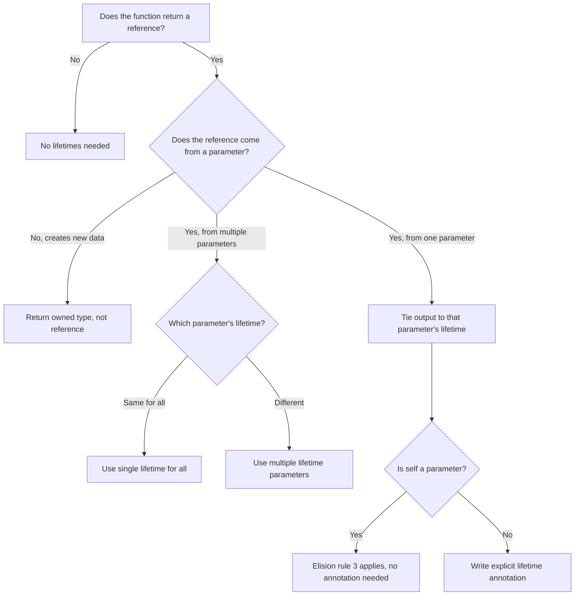

## Why Lifetimes Exist

Rust's borrow checker must ensure that every reference is valid for its entire use. Without lifetime
annotations, the compiler cannot prove that a reference outlives the scope in which it is used. This
prevents dangling references — references to memory that has been freed or invalidated.

Consider the canonical dangling reference attempt:

```rust
fn dangle() -> &String {
    let s = String::from("hello");
    &s
}
```

The compiler rejects this because `s` is dropped at the end of `dangle`, but the function promises
to return a reference. The returned reference would point to freed memory. Lifetimes are the
mechanism by which the compiler tracks and enforces this constraint.

Every reference in Rust has a lifetime — a region of code during which the reference is valid. In
most cases, the compiler infers lifetimes automatically. Explicit annotations are needed when the
relationship between input and output lifetimes is ambiguous.

## Lifetime Annotation Syntax

Lifetimes use a leading apostrophe followed by a name. By convention, `'a` is the first lifetime,
`'b` the second, and so on. The name is purely a compile-time label — it has no runtime
representation.

```rust
fn longest<'a>(x: &'a str, y: &'a str) -> &'a str {
    if x.len() > y.len { x } else { y }
}
```

This signature says: "there exists some lifetime `'a` such that both `x` and `y` live at least as
long as `'a`, and the returned reference also lives at least as long as `'a`." The caller chooses
the concrete lifetime, constrained by the actual lifetimes of the arguments.

```rust
let result;
let s1 = String::from("long string");
{
    let s2 = String::from("xyz");
    result = longest(s1.as_str(), s2.as_str());
    println!("longest: {}", result);
}
// result is valid here because its lifetime is bounded by s1's lifetime
```

### Multiple Lifetime Parameters

Functions can have multiple independent lifetime parameters:

```rust
fn first<'a, 'b>(x: &'a str, _y: &'b str) -> &'a str {
    x
}
```

The return type's lifetime is tied only to `'a`. The compiler does not require `'a` and `'b` to have
any relationship — they are independent.

## Function Lifetimes

### Input Lifetime Binding

The relationship between input and output lifetimes determines how references flow through a
function:

```rust
// Output lives as long as x
fn first_word<'a>(text: &'a str) -> &'a str {
    let end = text.find(' ').unwrap_or(text.len());
    &text[..end]
}

// Output lives as long as the shorter of x and y
fn longest<'a>(x: &'a str, y: &'a str) -> &'a str {
    if x.len() > y.len() { x } else { y }
}

// Output lives as long as x, ignoring y's lifetime
fn first<'a, 'b>(x: &'a str, _y: &'b str) -> &'a str {
    x
}
```

### Static Lifetime

`'static` means the reference lives for the entire duration of the program. All string literals have
`'static` lifetime because they are embedded in the binary:

```rust
let s: &'static str = "hello";
let s: &str = "hello";  // &'static is inferred for literals
```

:::warning

Do not annotate function parameters with `'static` unless the function truly requires a `'static`
reference. Adding `'static` constraints reduces the function's flexibility — callers can no longer
pass locally-owned string slices. The compiler may suggest `'static` when it cannot infer a shorter
lifetime, but this is often a sign that the function signature needs redesign.

:::

```rust
// Overly restrictive
fn print(s: &'static str) {
    println!("{}", s);
}

// More flexible
fn print(s: &str) {
    println!("{}", s);
}
```

## Struct Lifetimes

When a struct holds a reference, you must annotate the reference's lifetime:

```rust
struct Excerpt<'a> {
    part: &'a str,
}

let novel = String::from("Call me Ishmael. Some years ago...");
let first_sentence;

{
    let words = novel.as_str();
    let i = words.find('.').unwrap();
    first_sentence = Excerpt { part: &words[..i] };
}
// first_sentence is valid here because its lifetime is bounded by novel's lifetime
```

### Multiple Lifetime Parameters in Structs

```rust
struct Pair<'a, 'b> {
    first: &'a str,
    second: &'b str,
}

let s1 = String::from("hello");
let s2 = String::from("world");
let pair = Pair {
    first: &s1,
    second: &s2,
};
```

### Lifetime Bounds on Struct Definitions

When a struct has a lifetime parameter and also holds a type that references that lifetime, you may
need a lifetime bound:

```rust
struct Container<'a, T: 'a> {
    value: &'a T,
}
```

The bound `T: 'a` says "T must outlive `'a`." This is automatically added in many cases by the
compiler, but you may need to write it explicitly for complex generic constraints.

## Method Lifetimes

### The First Parameter Elision Rule

When implementing methods on a struct with a lifetime parameter, the compiler automatically assigns
`&self`'s lifetime to all output lifetime parameters (elision rule 3). This means you rarely need
explicit lifetime annotations on methods:

```rust
impl<'a> Excerpt<'a> {
    // No explicit lifetime needed — elision rule 3 applies
    fn level(&self) -> i32 {
        3
    }

    // Return lifetime is tied to self's lifetime
    fn announce_and_return(&self, announcement: &str) -> &str {
        println!("attention: {}", announcement);
        self.part
    }

    // Multiple lifetimes — explicit annotations needed
    fn compare<'b>(&self, other: &'b str) -> bool {
        self.part.len() == other.len()
    }
}
```

### Static Methods

Static methods (no `self` parameter) require explicit lifetime annotations:

```rust
impl<'a> Excerpt<'a> {
    fn from_parts(part: &'a str) -> Self {
        Excerpt { part }
    }
}
```

## Lifetime Elision Rules

The compiler applies three rules to infer lifetimes. If after applying all three rules, the compiler
still cannot determine lifetimes, it errors.

### Rule 1: Each Reference Gets Its Own Lifetime

Every parameter that is a reference gets its own lifetime parameter:

```rust
fn foo(x: &str)           →  fn foo<'a>(x: &'a str)
fn foo(x: &str, y: &str)  →  fn foo<'a, 'b>(x: &'a str, y: &'b str)
fn foo(x: &i32, y: &mut i32)  →  fn foo<'a, 'b>(x: &'a i32, y: &'b mut i32)
```

### Rule 2: Single Input Lifetime

If there is exactly one input lifetime parameter, that lifetime is assigned to all output
parameters:

```rust
fn foo(x: &str) -> &str    →  fn foo<'a>(x: &'a str) -> &'a str
fn foo(x: &str) -> (&str, &str)  →  fn foo<'a>(x: &'a str) -> (&'a str, &'a str)
```

### Rule 3: `&self` or `&mut self` Lifetime

If there are multiple input lifetime parameters but one of them is `&self` or `&mut self`, the
lifetime of `self` is assigned to all output parameters:

```rust
impl Foo {
    fn method(&self, x: &str) -> &str  →  fn method<'a, 'b>(&'a self, x: &'b str) -> &'a str
    fn method(&mut self) -> &str       →  fn method<'a>(&'a mut self) -> &'a str
}
```

### When Elision Fails

```rust
// This does NOT compile — two input lifetimes, no self, ambiguous output
fn merge(x: &str, y: &str) -> &str {
    if x.len() > y.len() { x } else { y }
}

// Fix: add explicit lifetime annotations
fn merge<'a>(x: &'a str, y: &'a str) -> &'a str {
    if x.len() > y.len() { x } else { y }
}
```

## Lifetime Bounds

Lifetimes can have bounds, just like type parameters. The syntax `'a: 'b` means "a outlives b" — the
reference with lifetime `'a` must live at least as long as `'b`:

```rust
// 'a must outlive 'b
fn print<'a, 'b: 'a>(x: &'b str, y: &'a str) {
    println!("{} {}", x, y);
}
```

This is useful when you need to ensure that one reference is valid for at least as long as another.
It is common in structs that hold references with different lifetimes:

```rust
struct Context<'a, 'b: 'a> {
    parent: &'a str,
    child: &'b str,
}
```

### Lifetime Bounds with Trait Objects

```rust
trait Processor {
    type Output;
    fn process(&self) -> Self::Output;
}

fn run<'a, T>(processor: &'a dyn Processor<Output = T>) -> T
where
    T: 'a,
{
    processor.process()
}
```

The `T: 'a` bound ensures that `T` does not contain references shorter than `'a`. This is necessary
because the trait object might reference data with lifetime `'a`.

## Lifetime Variance

Variance determines whether a longer lifetime can be substituted for a shorter one. This is critical
for writing correct generic code.

### Covariance

`&'a T` is covariant in `'a`. If `'long: 'short`, then `&'long T` can be used where `&'short T` is
expected. This is safe because a longer-lived reference is a subtype of a shorter-lived one when you
only read through it:

```rust
fn takes_short<'a>(r: &'a str) {}

let long: &'static str = "hello";
takes_short(long);  // OK — 'static can be shortened to 'a
```

### Contravariance

Function types are contravariant in their argument lifetimes. If `'short: 'long`, then a function
expecting a `'long` reference can be used where a function expecting a `'short` reference is needed:

```rust
fn apply<'a, F>(f: F, arg: &'a str)
where
    F: Fn(&'a str),
{
    f(arg);
}
```

### Invariance

`&mut T` is invariant in both `'a` and `T`. You cannot substitute a `&'long mut T` where a
`&'short mut T` is expected. This prevents soundness issues where a mutable reference to a
shorter-lived value could be used to write a longer-lived reference, extending its validity beyond
its scope:

```rust
fn takes_short_mut<'a>(r: &'a mut i32) {
    *r = 42;
}

let mut x: i32 = 1;
let r: &'static mut i32 = unsafe { &mut *Box::into_raw(Box::new(x)) };
// takes_short_mut(r);  // ERROR — &'static mut i32 is invariant
```

### Variance Summary

| Type             | Variance in `'a` | Variance in `T` |
| ---------------- | ---------------- | --------------- |
| `&'a T`          | Covariant        | Covariant       |
| `&'a mut T`      | Invariant        | Invariant       |
| `Box&lt;T&gt;`   | —                | Covariant       |
| `Cell&lt;T&gt;`  | —                | Invariant       |
| `fn(&'a T) -> R` | Contravariant    | Contravariant   |
| `fn(T) -> &'a R` | Covariant        | Covariant       |

### Variance and Unsafe Code

Violating variance assumptions in unsafe code causes undefined behavior. If you store a `&'long T`
in a position that the compiler believes holds a `&'short T`, the short reference may be used after
the long reference's referent is freed:

```rust
use std::cell::Cell;

struct Holder<'a> {
    value: Cell<&'a str>,
}

fn variance_bug<'a, 'b: 'a>(holder: &Holder<'b>) {
    let short: &'a str = &String::from("short-lived");
    // This is SOUND because Cell is invariant in T.
    // If Holder used a covariant type, this would be unsound.
}
```

## Higher-Ranked Trait Bounds (HRTBs)

HRTBs express constraints on lifetimes that are universally quantified. The syntax `for<'a>` means
"for all lifetimes 'a":

```rust
fn apply<F>(f: F)
where
    F: for<'a> Fn(&'a str) -> &'a str,
{
    let s = String::from("hello");
    let result = f(&s);
    println!("{}", result);
}

apply(|s| s);
```

The closure must work with any lifetime `'a`, not just a specific one. This is more restrictive than
specifying a single lifetime because the closure cannot capture references with a specific lifetime.

### HRTBs with Trait Objects

```rust
// A function that accepts any closure that works with any string lifetime
fn call_with_any_str<F: for<'a> Fn(&'a str) -> bool>(f: F) {
    let s1 = String::from("hello");
    let s2 = "world";
    assert!(f(&s1));
    assert!(f(s2));
}
```

### `for<'a>` in Practice

HRTBs appear most commonly in trait bounds for functions that accept callbacks:

```rust
fn map_values<K, V1, V2, F>(map: &HashMap<K, V1>, f: F) -> HashMap<K, V2>
where
    K: Eq + Hash + Clone,
    F: Fn(&V1) -> V2,
{
    map.iter().map(|(k, v)| (k.clone(), f(v))).collect()
}
```

## Lifetime Subtyping

Lifetime subtyping means `'long: 'short` (long outlives short). A longer lifetime is a subtype of a
shorter one. This is used implicitly by the compiler when checking borrow validity:

```rust
fn subtyping_example() {
    let x = 42;
    let r1: &'static i32 = &x;  // ERROR: x does not live for 'static
    let r2: &'_ i32 = &x;      // OK: compiler infers an appropriate lifetime
}
```

The compiler performs subtyping during borrow checking. If a function expects `&'a T` and you pass
`&'b T` where `'b: 'a`, the compiler accepts it because a longer-lived reference satisfies a
shorter-lived requirement.

## Common Lifetime Patterns

### The Self-Referential Struct Problem

Rust cannot express structs that hold references to their own fields in safe code. The struct and
its field share the same lifetime, but the borrow checker treats them as independent:

```rust
// This does NOT compile:
struct SelfRef {
    data: String,
    pointer: &str,  // what lifetime?
}
```

Solutions include:

**Index-based approach** (most common):

```rust
struct Graph {
    nodes: Vec<Node>,
}

struct Node {
    value: i32,
    edges: Vec<usize>,
}
```

**Arena allocation** (via crates like `bumpalo` or `typed-arena`):

```rust
use bumpalo::Bump;

let arena = Bump::new();
let a = arena.alloc("hello");
let b = arena.alloc("world");
// a and b have the same lifetime — cross-references are valid
```

**Pin-based approach** for self-referential async state machines:

```rust
use std::pin::Pin;
use std::marker::PhantomPinned;

struct SelfReferential {
    data: String,
    pointer: *const String,
    _marker: PhantomPinned,
}

impl SelfReferential {
    fn new(data: String) -> Self {
        Self {
            data,
            pointer: std::ptr::null(),
            _marker: PhantomPinned,
        }
    }

    fn init(self: Pin<&mut Self>) {
        let self_ptr: *const String = &self.data;
        // SAFETY: the struct is pinned, so data will not move
        unsafe {
            let this = self.get_unchecked_mut();
            this.pointer = self_ptr;
        }
    }
}
```

### Returning References from Functions

The safest pattern is to have the output lifetime match exactly one input lifetime:

```rust
fn first_word<'a>(text: &'a str) -> &'a str {
    match text.find(' ') {
        Some(i) => &text[..i],
        None => text,
    }
}
```

### Lifetime Parameters in Trait Definitions

```rust
trait Transformer<'a> {
    type Output;
    fn transform(&self, input: &'a str) -> Self::Output;
}

struct ToUpper;

impl<'a> Transformer<'a> for ToUpper {
    type Output = String;
    fn transform(&self, input: &'a str) -> String {
        input.to_uppercase()
    }
}
```

### Zero-Cost Lifetime Abstractions

Lifetimes have zero runtime cost. They are purely compile-time annotations. The compiler erases all
lifetime information before code generation. A `&'a T` and a `&'b T` produce identical machine code
— the lifetimes exist only for the borrow checker's verification.

## Lifetime Parameters in Enums

Enums that hold references also require lifetime annotations:

```rust
enum StrOrInt<'a> {
    Str(&'a str),
    Int(i32),
}

let s = StrOrInt::Str("hello");
let n = StrOrInt::Int(42);

match s {
    StrOrInt::Str(text) => println!("text: {}", text),
    StrOrInt::Int(val) => println!("number: {}", val),
}
```

## The Drop Checker and Lifetimes

The borrow checker also verifies that structs are dropped before the data they reference. The drop
checker can be overly conservative:

```rust
struct Context<'a> {
    data: &'a str,
    callback: Box<dyn Fn()>,
}

// The compiler must ensure that Context is dropped before data
// This is automatic for simple cases
```

If your struct contains a raw pointer that does not actually reference the lifetime parameter, you
can use `#[may_dangle]` (unsafe) to relax the drop check. This is advanced and should be used only
when you can prove safety manually.

## Lifetime Bounds with `impl Trait`

When using `impl Trait` in return position, lifetimes are inferred:

```rust
fn get_parts(s: &str) -> impl Iterator<Item = &str> {
    s.split_whitespace()
}
```

The compiler infers the appropriate lifetime for the returned iterator. If the inference is
ambiguous, you may need to write it explicitly:

```rust
fn get_parts<'a>(s: &'a str) -> impl Iterator<Item = &'a str> + 'a {
    s.split_whitespace()
}
```

## Common Pitfalls

1. **Over-annotating with `'static`.** The compiler suggests `'static` when it cannot infer a
   shorter lifetime. Adding `'static` often reduces API flexibility. Instead, redesign the function
   to take an explicit lifetime parameter or restructure ownership.

2. **Confusing lifetime names with actual lifetimes.** `'a` and `'b` are just labels. Two functions
   using `'a` in their signatures do not share a lifetime — the compiler resolves each independently
   at each call site.

3. **Fighting the borrow checker with clones.** Cloning to satisfy lifetime constraints often
   indicates a design issue. Consider whether you can restructure ownership, use indices instead of
   references, or redesign the data flow.

4. **Not understanding variance.** Misunderstanding covariance and invariance leads to subtle
   soundness bugs in generic code. If you are writing unsafe code that involves lifetimes, verify
   variance carefully.

5. **Self-referential structs without Pin.** Attempting to create a struct that references its own
   fields will not compile in safe Rust. Use indices, arena allocation, or `Pin` for
   self-referential patterns.

6. **Lifetime elision hiding complexity.** Elision rules make simple cases ergonomic, but can
   obscure lifetime relationships in complex functions. When debugging lifetime errors, write out
   the fully explicit lifetimes to understand what the compiler is doing.

7. **Ignoring the `T: 'a` bound.** When a generic type `T` might contain references, the compiler
   may require `T: 'a` to ensure that `T` does not contain references shorter than `'a`. This is
   especially common with trait objects and `Box<dyn Trait>`.

8. **Assuming lifetimes affect runtime.** Lifetimes are erased at compile time. They have zero
   runtime cost. A reference with a `'static` lifetime is not "better" or "more efficient" than one
   with a shorter lifetime.

9. **Using `unsafe` to extend lifetimes.** Transmuting a shorter-lived reference to a longer-lived
   one is undefined behavior. No amount of `unsafe` can make a dangling reference valid. If the
   borrow checker rejects your code, the solution is restructuring, not bypassing.

10. **Multiple lifetime parameters when one suffices.** If all references in a function can share a
    single lifetime, use one lifetime parameter. Multiple lifetime parameters are needed only when
    references have genuinely independent lifetimes.

## Lifetime Parameters in Closures

Closures can capture references, and the compiler infers lifetimes for those captures. However, the
lifetime rules for closures are different from functions because closures capture their environment:

```rust
fn make_closure<'a>() -> Box<dyn Fn(&'a str) -> usize> {
    Box::new(|s: &str| s.len())
}
```

The closure's return type is inferred from its body. When stored in a trait object, the lifetime
must be explicitly specified. This is because the trait object has an implicit lifetime bound:

```rust
fn make_closure<'a>() -> Box<dyn Fn(&'a str) -> usize + 'a> {
    Box::new(|s: &str| s.len())
}
```

### Lifetime Bounds on Closures

When a closure captures a reference, the closure's type carries a lifetime bound. This affects where
the closure can be stored and used:

```rust
fn with_callback<'a, F>(data: &'a str, callback: F)
where
    F: Fn(&'a str),
{
    callback(data);
}

let s = String::from("hello");
with_callback(&s, |data| {
    println!("callback received: {}", data);
});
```

## Lifetime Relationships in Data Structures

### Trees with Lifetime Parameters

```rust
struct TreeNode<'a> {
    value: &'a str,
    left: Option<Box<TreeNode<'a>>>,
    right: Option<Box<TreeNode<'a>>>,
}

fn build_tree<'a>(values: &'a [&'a str]) -> Option<Box<TreeNode<'a>>> {
    if values.is_empty() {
        return None;
    }

    let mid = values.len() / 2;
    Some(Box::new(TreeNode {
        value: values[mid],
        left: build_tree(&values[..mid]),
        right: build_tree(&values[mid + 1..]),
    }))
}

let data = vec!["alpha", "bravo", "charlie", "delta", "echo"];
let tree = build_tree(&data);
```

### Linked Lists with Lifetimes

Linked lists in Rust are notoriously difficult because each node references the next node. The
simplest approach uses indices instead of references:

```rust
struct LinkedList<T> {
    nodes: Vec<Node<T>>,
    head: Option<usize>,
}

struct Node<T> {
    value: T,
    next: Option<usize>,
}

impl<T> LinkedList<T> {
    fn new() -> Self {
        LinkedList {
            nodes: Vec::new(),
            head: None,
        }
    }

    fn push_front(&mut self, value: T) {
        let new_index = self.nodes.len();
        let old_head = self.head;
        self.nodes.push(Node { value, next: old_head });
        self.head = Some(new_index);
    }
}
```

## Lifetimes and Trait Bounds

### `T: 'a` in Practice

The bound `T: 'a` means "T does not contain any references with a lifetime shorter than 'a." This is
automatically added by the compiler in many cases but may be needed explicitly:

```rust
struct Wrapper<'a, T> {
    data: &'a T,
}

// The compiler adds T: 'a automatically here
fn get_wrapper<'a, T: 'a>(data: &'a T) -> Wrapper<'a, T> {
    Wrapper { data }
}
```

When `T` contains references, the compiler must ensure those references are valid for the lifetime
`'a`. Without `T: 'a`, the compiler cannot verify this:

```rust
struct RefWrapper<'a, T: 'a> {
    inner: &'a T,
}

// This works because String has no references (String: 'static)
let s = String::from("hello");
let w = RefWrapper { inner: &s };

// This also works — the lifetime of the reference is shorter than 'a
let r = &s;
let w = RefWrapper { inner: r };
```

### Lifetime Bounds with `where` Clauses

```rust
fn serialize<'a, T>(value: &'a T) -> String
where
    T: 'a + std::fmt::Display,
{
    value.to_string()
}
```

## Lifetimes in Deserializers

Deserializers that return borrowed data require lifetime annotations on the output type:

```rust
struct SimpleParser<'a> {
    input: &'a str,
    pos: usize,
}

impl<'a> SimpleParser<'a> {
    fn new(input: &'a str) -> Self {
        SimpleParser { input, pos: 0 }
    }

    fn next_word(&mut self) -> Option<&'a str> {
        let remaining = &self.input[self.pos..];
        let end = remaining.find(char::is_whitespace)?;
        let word = &remaining[..end];
        self.pos += end;
        Some(word)
    }
}
```

The returned `&'a str` borrows from the parser's `input` field, which has lifetime `'a`. This means
the returned slices are valid as long as the parser's input is valid — zero-copy parsing.

## `impl Trait` and Lifetimes

### RPITIT with Lifetimes

Return position impl trait in traits (RPITIT) interacts with lifetimes:

```rust
trait Iterable<'a> {
    type Item;
    type Iter: Iterator<Item = Self::Item>;
    fn iter(&'a self) -> Self::Iter;
}

struct MySlice<'a, T>(&'a [T]);

impl<'a, T: Clone + 'a> Iterable<'a> for MySlice<'a, T> {
    type Item = T;
    type Iter = std::iter::Cloned<std::slice::Iter<'a, T>>;

    fn iter(&'a self) -> Self::Iter {
        self.0.iter().cloned()
    }
}
```

### Opaque Return Types with Lifetime Bounds

```rust
fn process<'a>(data: &'a str) -> impl Iterator<Item = &'a str> + 'a {
    data.split_whitespace()
}
```

The `+ 'a` bound on the return type tells the compiler that the returned iterator may contain
references with lifetime `'a`. Without this bound, the compiler may not be able to infer the correct
lifetime.

## Lifetime Interactions with `Cow`

`Cow` (Clone on Write) has a lifetime parameter that determines whether it borrows or owns:

```rust
use std::borrow::Cow;

fn process<'a>(input: &'a str) -> Cow<'a, str> {
    if input.contains("bad") {
        Cow::Owned(input.replace("bad", "good"))
    } else {
        Cow::Borrowed(input)
    }
}

let borrowed = process("hello world");
assert!(matches!(borrowed, Cow::Borrowed(_)));

let owned = process("hello bad world");
assert!(matches!(owned, Cow::Owned(_)));
```

`Cow<'a, str>` is either `&'a str` (borrowed, no allocation) or `String` (owned, allocated). The
lifetime `'a` applies only to the borrowed variant. When the function returns `Cow::Borrowed`, no
allocation occurs.

## Lifetimes in Async Contexts

### Lifetimes Across `.await` Points

Holding a reference across an `.await` point is an error because the future may be moved or dropped
between yields:

```rust
// This does NOT compile
async fn broken() {
    let data = String::from("hello");
    let slice = &data[..];
    some_async_function().await;
    println!("{}", slice);  // ERROR: data may have been moved
}
```

The fix is to ensure the borrowed data outlives the `.await`:

```rust
async fn fixed() {
    let data = String::from("hello");
    let len = data.len();  // Copy the value, not a reference
    some_async_function().await;
    println!("{}", len);  // OK — len is a usize, not a reference
}
```

### `Send` Bounds and Lifetimes

Async functions that capture references must satisfy `'static` lifetime bounds when spawned on
multi-threaded runtimes:

```rust
// This does NOT compile
async fn broken() {
    let data = String::from("hello");
    let borrowed = &data;
    tokio::spawn(async move {
        println!("{}", borrowed);  // ERROR: borrowed may not live long enough
    });
}

// Fix: move ownership into the spawned task
async fn fixed() {
    let data = String::from("hello");
    tokio::spawn(async move {
        println!("{}", data);  // OK — data is moved into the task
    });
}
```

## Lifetime Decision Flow


