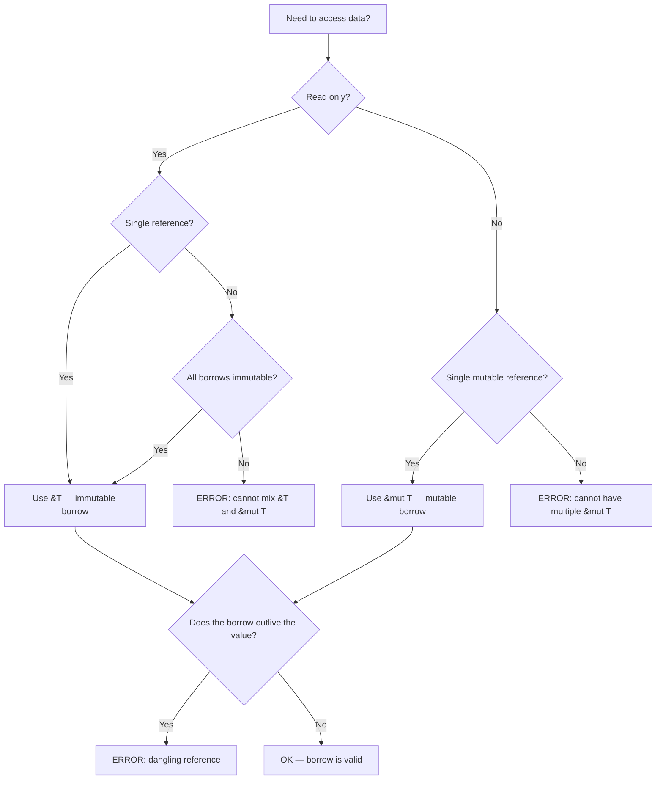

## The Ownership Rules

Rust's memory management rests on three rules enforced at compile time:

1. Each value in Rust has a single **owner**.
2. When the owner goes out of scope, the value is **dropped** (memory is freed).
3. There can be **zero or more immutable references** (`&T`) OR **exactly one mutable reference**
   (`&mut T`) to a value at any point in its lifetime.

These rules are checked by the borrow checker, which operates on MIR (Mid-level Intermediate
Representation). The borrow checker does not exist at runtime — there is zero overhead for ownership
tracking in the compiled binary.

```rust
fn main() {
    let s1 = String::from("hello");
    let s2 = s1;  // s1 is MOVED to s2 — s1 is no longer valid
    // println!("{}", s1);  // ERROR: value borrowed after move
    println!("{}", s2);     // OK — s2 owns the data
}
```

The move is a compile-time transfer of ownership. No memory is copied — only the pointer, length,
and capacity (24 bytes for `String` on 64-bit) are copied. The original binding is invalidated.

## Move Semantics

### What Moves and What Copies

Types are divided into two categories based on whether assignment copies or moves:

| Category     | Examples                                                                   | Behavior                       |
| ------------ | -------------------------------------------------------------------------- | ------------------------------ |
| `Copy` types | `i32`, `f64`, `bool`, `char`, `(i32, i32)`, `&T`                           | Assignment copies the value    |
| Move types   | `String`, `Vec<T>`, `Box<T>`, `File`, user-defined structs (unless `Copy`) | Assignment transfers ownership |

A type implements `Copy` if and only if every bit pattern of its memory representation is a valid
value. This is why types containing heap pointers (like `String`) cannot be `Copy` — a bitwise copy
would create two owners of the same heap allocation.

### The `Copy` Trait

```rust
#[derive(Copy, Clone)]
struct Point {
    x: f64,
    y: f64,
}

let p1 = Point { x: 1.0, y: 2.0 };
let p2 = p1;  // p1 is COPIED — both p1 and p2 are valid
println!("{} {}", p1.x, p2.y);  // OK
```

`Copy` requires `Clone` and is a marker trait with no methods. The compiler automatically implements
`Copy` for types where all fields are `Copy`.

Types that cannot be `Copy`:

- Any type with a `Drop` implementation (destructor)
- Any type containing a heap pointer (`String`, `Vec`, `Box`)
- Any type containing a mutable reference (`&mut T`)

### Partial Moves

Structs can be partially moved — individual fields can be moved out while other fields remain valid:

```rust
struct Person {
    name: String,
    age: u32,
}

let person = Person {
    name: String::from("Alice"),
    age: 30,
};

let name = person.name;  // name is moved out of person
// println!("{:?}", person);  // ERROR: person partially moved
println!("{}", person.age);   // OK — age is Copy, was never moved
```

After a partial move, the struct itself is no longer usable as a whole, but its `Copy` fields remain
accessible.

### Moves in Function Calls

Function arguments are moved by default:

```rust
fn takes_ownership(s: String) {
    println!("{}", s);
}  // s is dropped here

fn main() {
    let s = String::from("hello");
    takes_ownership(s);
    // println!("{}", s);  // ERROR: s was moved
}
```

To avoid the move, pass a reference:

```rust
fn borrows(s: &String) {
    println!("{}", s);
}

fn main() {
    let s = String::from("hello");
    borrows(&s);
    println!("{}", s);  // OK — s was borrowed, not moved
}
```

### Return Values Move Ownership

Functions transfer ownership to the caller via return values:

```rust
fn creates_ownership() -> String {
    String::from("hello")  // ownership moves to caller
}

fn takes_and_gives(s: String) -> String {
    s  // ownership moves back to caller
}
```

## References and Borrowing

### Immutable References

An immutable reference `&T` allows reading but not modifying the referenced data. You can create any
number of immutable references simultaneously:

```rust
let s = String::from("hello");

let r1 = &s;
let r2 = &s;
let r3 = &s;
println!("{} {} {}", r1, r2, r3);  // OK — multiple immutable borrows
```

### Mutable References

A mutable reference `&mut T` allows reading and modifying. Only one mutable reference can exist at a
time, and no immutable references can coexist with a mutable one:

```rust
let mut s = String::from("hello");

let r1 = &mut s;
// let r2 = &mut s;  // ERROR: cannot borrow as mutable more than once
r1.push_str(", world");
println!("{}", r1);
```

This is the core rule that prevents data races at compile time. The NLL (Non-Lexical Lifetimes)
borrow checker understands that `r1` is no longer in use after its last usage point, not just at the
end of the lexical scope:

```rust
let mut s = String::from("hello");

let r1 = &s;       // immutable borrow starts
println!("{}", r1); // r1 used here
// r1's borrow ends here (NLL)

let r2 = &mut s;   // OK — r1 is no longer in scope
r2.push_str(", world");
println!("{}", r2);
```

### Dangling Reference Prevention

The borrow checker guarantees that references always point to valid data. This is one of Rust's most
important safety guarantees:

```rust
fn dangle() -> &String {
    let s = String::from("hello");
    &s  // ERROR: s is created inside this function and will be dropped
}      // the reference would point to freed memory

fn no_dangle() -> String {
    let s = String::from("hello");
    s  // OK — ownership is transferred to the caller
}
```

The compiler error is: `missing lifetime specifier` — it is telling you that it cannot prove the
reference will outlive its referent.

### Reference Rules Summary

```
At any given lifetime scope for a value:

  ┌──────────────────────────────────────┐
  │  &T   &T   &T    (many immutable)    │  ✓
  │  &mut T           (one mutable)      │  ✓
  │  &T   &mut T      (mixed)            │  ✗
  │  &mut T  &mut T   (multiple mutable) │  ✗
  └──────────────────────────────────────┘
```

## Lifetimes

Lifetimes are Rust's way of tracking how long a reference is valid. Every reference has a lifetime,
but in most cases the compiler can infer it (lifetime elision rules). Explicit lifetime annotations
are needed when the compiler cannot determine the relationship between input and output lifetimes.

### Lifetime Annotation Syntax

Lifetimes are denoted with a leading apostrophe. By convention, `'a` is the first lifetime, `'b` the
second, etc.

```rust
fn longest<'a>(x: &'a str, y: &'a str) -> &'a str {
    if x.len() > y.len() {
        x
    } else {
        y
    }
}
```

The annotation `<'a>` says: "there exists some lifetime `'a` such that both `x` and `y` live at
least as long as `'a`, and the return value also lives at least as long as `'a`." The caller gets to
choose what `'a` is, constrained by the actual lifetimes of the arguments.

### Lifetime Elision Rules

The compiler applies three rules to elide (omit) lifetime annotations. If after applying all three
rules, the compiler still cannot determine lifetimes, it errors.

**Rule 1:** Each parameter that is a reference gets its own lifetime parameter.

```rust
fn foo(x: &str)           →  fn foo<'a>(x: &'a str)
fn foo(x: &str, y: &str)  →  fn foo<'a, 'b>(x: &'a str, y: &'b str)
```

**Rule 2:** If there is exactly one input lifetime parameter, that lifetime is assigned to all
output parameters.

```rust
fn foo(x: &str) -> &str    →  fn foo<'a>(x: &'a str) -> &'a str
```

**Rule 3:** If there are multiple input lifetime parameters but one of them is `&self` or
`&mut self`, the lifetime of `self` is assigned to all output parameters.

```rust
impl Foo {
    fn method(&self, x: &str) -> &str  →  fn method<'a, 'b>(&'a self, x: &'b str) -> &'a str
}
```

### Lifetime Bounds

Lifetimes can have bounds, just like type parameters:

```rust
// 'a must outlive 'b — the reference x must live at least as long as 'b
fn print<'a, 'b: 'a>(x: &'b str, y: &'a str) {
    println!("{} {}", x, y);
}
```

This is useful when a struct holds a reference and you need to ensure the struct does not outlive
the referent.

### Struct Lifetimes

When a struct holds a reference, you must annotate its lifetime:

```rust
struct Excerpt<'a> {
    part: &'a str,
}

let novel = String::from("Call me Ishmael. Some years ago...");
let first_sentence;
{
    let words = novel.as_str();
    let i = words.find('.').unwrap();
    first_sentence = Excerpt { part: &words[..i] };
    // Excerpt<'a> where 'a is the lifetime of words
}
// first_sentence is invalid here — words was dropped
```

### Function Lifetimes

Lifetimes in function signatures establish relationships between input and output references. The
compiler does not change the actual lifetimes — it only verifies that the constraints are satisfied.

```rust
// The returned reference lives as long as the shorter of the two inputs
fn longest<'a>(x: &'a str, y: &'a str) -> &'a str {
    if x.len() > y.len() { x } else { y }
}

// The returned reference lives as long as x only
fn first<'a, 'b>(x: &'a str, _y: &'b str) -> &'a str {
    x
}
```

### `'static` Lifetime

`'static` means the reference lives for the entire duration of the program. All string literals have
`'static` lifetime:

```rust
let s: &'static str = "hello";  // embedded in the binary
```

:::warning

Do not annotate everything with `'static` as a shortcut. The compiler will suggest `'static` when it
cannot infer a shorter lifetime, but adding `'static` constraints reduces the function's
flexibility. A function taking `&'static str` cannot accept locally-owned `String` references, only
string literals and values explicitly annotated with `'static`.

:::

### Lifetime Variance

Lifetimes are covariant in their position. Given `'a: 'b` (a outlives b), `&'a T` is a subtype of
`&'b T`. This means a longer-lived reference can be used where a shorter-lived one is expected.

For `&mut T`, lifetimes are **invariant** — you cannot substitute a `&'a mut T` where a `&'b mut T`
is expected, even if `'a: 'b`. This prevents soundness issues with mutable aliasing.

```rust
fn mutate<'a>(r: &'a mut i32) {
    *r = 42;
}

let mut x: i32 = 1;
let r: &'static mut i32 = &mut x;  // ERROR: expected 'static, got shorter lifetime
```

## Interior Mutability

The borrow checker's rule "either many immutable or one mutable" is strict. Sometimes you need to
mutate data through a shared reference. Interior mutability types provide this capability safely.

### `Cell<T>`

`Cell<T>` provides copy-based interior mutability for `Copy` types. It stores the value inline (no
heap allocation) and provides `get()` (returns a copy) and `set()` (replaces the value):

```rust
use std::cell::Cell;

let counter = Cell::new(0);
counter.set(counter.get() + 1);
assert_eq!(counter.get(), 1);
```

`Cell<T>` does not allow borrowing the inner value — you can only copy it out or replace it. This
means there is no risk of creating a dangling reference to the interior.

### `RefCell<T>`

`RefCell<T>` provides reference-based interior mutability for any type. It tracks borrows at runtime
with a reference count and panics if the borrowing rules are violated:

```rust
use std::cell::RefCell;

let data = RefCell::new(vec![1, 2, 3]);

let borrow1 = data.borrow();      // immutable borrow (Ref&lt;Vec&lt;i32&gt;&gt;)
let borrow2 = data.borrow();      // OK — multiple immutable borrows

// let borrow3 = data.borrow_mut();  // PANIC: already borrowed immutably
drop(borrow1);
drop(borrow2);
let borrow3 = data.borrow_mut();  // OK — all previous borrows dropped
borrow3.push(4);
```

:::warning

`RefCell` enforces the borrow rules at **runtime**, not compile time. A `borrow_mut()` while an
immutable borrow is active will panic. This trades compile-time safety for runtime flexibility. Use
`try_borrow()` and `try_borrow_mut()` to get `Result` instead of panicking.

:::

### `RefCell` Use Cases

1. **Graph data structures** where nodes need to reference each other (cycles prevent compile-time
   borrow checking).
2. **Mocking in tests** where you need to mutate internal state through a shared reference.
3. **Builder patterns** where the builder is shared across multiple configuration steps.

```rust
use std::cell::RefCell;

struct Node<'a> {
    value: i32,
    neighbors: RefCell&lt;Vec&lt;&'a Node&lt;'a&gt;&gt;&gt;,
}

let a = Node { value: 1, neighbors: RefCell::new(vec![]) };
let b = Node { value: 2, neighbors: RefCell::new(vec![]) };

a.neighbors.borrow_mut().push(&b);
b.neighbors.borrow_mut().push(&a);
```

### `UnsafeCell<T>`

`UnsafeCell<T>` is the primitive underlying both `Cell` and `RefCell`. It is the only type in Rust
that allows safe code to obtain a mutable reference to its interior through a shared reference.
Using `UnsafeCell` directly requires `unsafe` code and is the foundation for all interior mutability
abstractions.

```rust
use std::cell::UnsafeCell;

struct Counter {
    value: UnsafeCell<i32>,
}

unsafe impl Sync for Counter {}  // YOU must verify this is safe

impl Counter {
    fn new(value: i32) -> Self {
        Counter { value: UnsafeCell::new(value) }
    }

    fn increment(&self) {
        unsafe {
            *self.value.get() += 1;
        }
    }
}
```

:::danger

Implementing `Sync` for a type containing `UnsafeCell` without proper synchronization is undefined
behavior. Only do this if you can prove that mutation is properly synchronized (e.g., via atomics or
platform-specific memory barriers).

:::

## `Rc` and `Arc`

### `Rc<T>` — Reference Counted

`Rc<T>` enables multiple ownership of the same data via reference counting. It is single-threaded —
the compiler will prevent you from sending an `Rc` across thread boundaries.

```rust
use std::rc::Rc;

let a = Rc::new(String::from("hello"));
let b = Rc::clone(&a);  // increments ref count (NOT a deep clone)
let c = Rc::clone(&a);  // ref count is now 3

assert_eq!(Rc::strong_count(&a), 3);
println!("{}", a);  // OK — all three bindings are valid
```

When the last `Rc` is dropped, the inner value is deallocated. `Rc` is not `Send` or `Sync`, so the
compiler prevents sharing it between threads.

### `Rc` with `RefCell`

`Rc<RefCell<T>>` is the idiomatic pattern for shared mutable ownership in single-threaded contexts:

```rust
use std::rc::Rc;
use std::cell::RefCell;

let data = Rc::new(RefCell::new(vec![1, 2, 3]));
let data2 = Rc::clone(&data);

data.borrow_mut().push(4);
assert_eq!(data2.borrow().len(), 4);
```

### `Arc<T>` — Atomic Reference Counted

`Arc<T>` is the thread-safe equivalent of `Rc<T>`. It uses atomic operations for reference counting,
making it `Send` and `Sync`. `Arc` is the foundation of shared ownership in concurrent Rust.

```rust
use std::sync::Arc;
use std::thread;

let data = Arc::new(vec![1, 2, 3]);
let data2 = Arc::clone(&data);

let handle = thread::spawn(move || {
    println!("len: {}", data2.len());
});

handle.join().unwrap();
println!("len: {}", data.len());
```

### `Arc` with `Mutex`

`Arc<Mutex<T>>` is the standard pattern for shared mutable state across threads:

```rust
use std::sync::{Arc, Mutex};
use std::thread;

let counter = Arc::new(Mutex::new(0));
let mut handles = vec![];

for _ in 0..10 {
    let counter = Arc::clone(&counter);
    handles.push(thread::spawn(move || {
        let mut num = counter.lock().unwrap();
        *num += 1;
    }));
}

for handle in handles {
    handle.join().unwrap();
}

assert_eq!(*counter.lock().unwrap(), 10);
```

### `Weak<T>`

Both `Rc` and `Arc` support weak references via `Weak<T>`. A `Weak` does not increment the strong
reference count and does not prevent the value from being dropped. This prevents reference cycles
(which would cause memory leaks):

```rust
use std::rc::{Rc, Weak};
use std::cell::RefCell;

struct Node {
    value: i32,
    parent: RefCell<Weak<Node>>,
    children: RefCell<Vec<Rc<Node>>>,
}

let parent = Rc::new(Node {
    value: 1,
    parent: RefCell::new(Weak::new()),
    children: RefCell::new(vec![]),
});

let child = Rc::new(Node {
    value: 2,
    parent: RefCell::new(Rc::downgrade(&parent)),
    children: RefCell::new(vec![]),
});

parent.children.borrow_mut().push(Rc::clone(&child));

// When parent and child go out of scope, both are dropped.
// The Weak reference in child.parent does not prevent this.
```

## Borrowing in Loops

Loops are a common source of borrow checker errors. The key issue is that the borrow must not
outlive the value being borrowed:

```rust
let mut v = vec![1, 2, 3, 4, 5];

// This works — we borrow the vector immutably for the iteration
for item in &v {
    println!("{}", item);
}

// This works — we borrow the vector mutably, but each item is borrowed
// for a single iteration
for item in &mut v {
    *item += 1;
}
```

### The Classic Loop Borrow Problem

```rust
let mut v = vec![String::from("a"), String::from("b")];

// This pattern is tricky:
let first = &v[0];
v.push(String::from("c"));  // ERROR: immutable borrow of v (first) conflicts
                             // with mutable borrow (push)
println!("{}", first);
```

The problem: `push` may reallocate the vector's buffer, invalidating all existing references. The
borrow checker conservatively rejects this because it cannot prove (at compile time) that `push`
will not reallocate.

### Fixing Loop Borrow Issues

```rust
// Fix 1: Drop the borrow before mutation
let mut v = vec![String::from("a"), String::from("b")];
let first = v[0].clone();
v.push(String::from("c"));
println!("{}", first);

// Fix 2: Use indices instead of references
let mut v = vec![1, 2, 3, 4, 5];
for i in 0..v.len() {
    v[i] += 1;
}

// Fix 3: Collect into a new vector
let v = vec![1, 2, 3, 4, 5];
let v2: Vec<i32> = v.iter().map(|&x| x + 1).collect();
```

## Reborrows

When you have a mutable reference and you pass it to a function, Rust performs an implicit
"reborrow." The mutable reference is temporarily borrowed, and the callee receives a new mutable
reference with a potentially shorter lifetime:

```rust
fn push(item: &mut String) {
    item.push_str(" world");
}

let mut s = String::from("hello");
let r = &mut s;

push(r);       // reborrow: r is temporarily borrowed by push
println!("{}", r);  // OK — the reborrow ended, r is valid again
```

Without reborrows, the above code would fail because `push(r)` would move `r`, making it unusable
afterward. The reborrow mechanism makes `&mut` references behave more ergonomically.

### Explicit Reborrows

You can create an explicit reborrow with `&mut *r`:

```rust
fn push(item: &mut String) {
    item.push_str(" world");
}

let mut s = String::from("hello");
let r: &mut String = &mut s;

let r2: &mut String = &mut *r;  // explicit reborrow
push(r2);
// r2 is no longer usable here (it was moved into push)
// But r is still valid because the reborrow from r has ended
println!("{}", r);
```

## Borrow Checker Evolution

### Lexical Lifetimes (pre-Rust 2018)

The original borrow checker tied borrows to lexical scopes. A borrow lived until the end of the
scope in which it was created, regardless of actual usage:

```rust
fn main() {
    let mut x = 1;
    let r = &x;
    println!("{}", r);
    // In lexical lifetimes: r's borrow extends to the end of main()
    // let y = &mut x;  // ERROR with lexical lifetimes (even though r is unused)
}
```

### Non-Lexical Lifetimes (NLL, Rust 2018+)

NLL analyzes the control flow graph to determine when a reference is last used. The borrow ends at
the last usage point, not at the end of the lexical scope:

```rust
fn main() {
    let mut x = 1;
    let r = &x;
    println!("{}", r);
    // NLL: r's borrow ends here (last use)
    let y = &mut x;  // OK with NLL
    *y = 2;
}
```

### Polonius (Future)

Polonius is the next-generation borrow checker, named after the character from Hamlet ("I have of
late, but wherefore I know not, lost all my mirth"). It uses a dataflow analysis approach that is
both more precise and easier to reason about than NLL. As of Rust 1.85, Polonius is available as an
experimental feature (`-Zpolonius`) and is expected to become the default in a future edition.

Polonius enables patterns that NLL rejects, such as:

```rust
// This pattern is rejected by NLL but accepted by Polonius:
fn filter_map(vec: &mut Vec<i32>) {
    let last = vec.iter().last();
    if let Some(&item) = last {
        vec.retain(|&x| x != item);
    }
}
```

## Common Pitfalls

1. **Fighting the borrow checker with `clone()`.** While `clone()` works, it often indicates a
   design problem. Before cloning, consider: can you restructure ownership? Can you use indices
   instead of references? Can you borrow for a shorter lifetime? Clone is correct when you genuinely
   need a second independent copy of the data.

2. **Self-referential structs.** Rust cannot express structs that hold references to their own
   fields because the lifetime of the reference and the lifetime of the struct are the same. Use
   indices instead, or crates like `pin-project` and `owning-ref` for self-referential patterns.

3. **`RefCell` panics in production.** `RefCell::borrow_mut()` panics at runtime if there is an
   outstanding immutable borrow. In a long-running service, this can bring down the process. Use
   `try_borrow_mut()` and handle the error, or restructure your code to avoid the need for
   `RefCell`.

4. **`Rc` reference cycles.** If two `Rc` values reference each other, neither will ever be dropped.
   Use `Weak<T>` to break cycles. Profile your application with tools like `valgrind` or `heaptrack`
   to detect reference cycle leaks.

5. **Borrowing across await points.** Holding a reference across an `.await` point is an error
   because the future may be dropped or moved between yields, invalidating the reference.
   Restructure the code to drop the borrow before awaiting.

6. **Ignoring lifetime variance.** Lifetimes are covariant in output position and invariant in
   mutable reference position. Misunderstanding this leads to subtle soundness bugs when writing
   generic code over lifetimes. The compiler errors in these cases are often confusing.

7. **Using `unsafe` to bypass the borrow checker.** `unsafe` lets you create raw pointers and
   convert them to references, but you are now responsible for maintaining all borrow checker
   invariants manually. A single violation (e.g., creating two mutable references to the same data)
   is undefined behavior, even if it appears to work.

8. **Over-borrowing in closures.** Closures capture variables by the least-permissive mode needed.
   `&x` for immutable access, `&mut x` for mutable access, `x` for ownership. A closure that
   modifies a captured variable will capture it by `&mut`, preventing any other borrow of the same
   variable while the closure exists. Use `move` closures to transfer ownership into the closure and
   avoid borrow conflicts.

9. **Confusing `'a` lifetime names with actual lifetimes.** The name `'a` is just a placeholder. The
   compiler substitutes the actual lifetime at each call site. Two functions using `'a` in their
   signatures do not necessarily share the same lifetime — the compiler resolves each independently.

10. **Not understanding NLL.** If the borrow checker rejects your code, check whether the borrow is
    actually needed past the point where the compiler thinks it ends. Often, adding an explicit
    block scope `{}` or dropping a reference early fixes the issue without restructuring.

## Borrow Checker Decision Flow



## Lifetime Bounds in Generics

Lifetimes interact with generics in ways that can be subtle. When a generic type parameter is
bounded by a lifetime, it constrains which concrete types can be used:

```rust
// T must outlive 'a — T must be a type that can be borrowed for 'a
fn process<'a, T: 'a>(value: &'a T) -> &'a T {
    value
}

// Without the T: 'a bound, this would not compile
// because the compiler cannot prove T is valid for 'a
```

This bound is automatically added in many cases (lifetime elision), but you may need to write it
explicitly when working with trait objects or complex generic constraints:

```rust
trait Processor {
    type Output;
    fn process(&self) -> Self::Output;
}

// This requires T: 'a because the trait object might reference data with lifetime 'a
fn run<'a, T>(processor: &'a dyn Processor<Output = T>) -> T
where
    T: 'a,
{
    processor.process()
}
```

## Higher-Rank Trait Bounds (HRTBs)

Higher-rank trait bounds express constraints on lifetimes that are universally quantified (forall).
The most common use is with `Fn` traits:

```rust
// This function accepts a closure that works with ANY lifetime 'a
fn apply<F>(f: F)
where
    F: for<'a> Fn(&'a str) -> &'a str,
{
    let s = String::from("hello");
    let result = f(&s);
    println!("{}", result);
}
```

The `for<'a>` syntax means "for all lifetimes 'a." The closure must be valid regardless of what
lifetime `'a` the caller chooses. This is a more restrictive bound than specifying a single lifetime
because the closure cannot capture references with a specific lifetime.

HRTBs are also used in the standard library for `Iterator::find`:

```rust
impl<I: Iterator> Iterator for I {
    fn find<P>(&mut self, predicate: P) -> Option<Self::Item>
    where
        P: FnMut(&Self::Item) -> bool,
    {
        // The predicate must accept references with the lifetime of self
    }
}
```

## Struct Self-References

One of the most common borrow checker challenges is creating structs that reference their own
fields. This is fundamentally impossible in safe Rust because the struct and its field share the
same lifetime, but the borrow checker treats them as independent:

```rust
// This does NOT compile:
struct SelfRef {
    data: String,
    pointer: &str,  // what lifetime? The struct's own lifetime?
}

fn main() {
    let s = SelfRef {
        data: String::from("hello"),
        pointer: &String::from("hello"),  // dangling reference
    };
}
```

### Solutions

**Index-based approach** (most common):

```rust
struct Graph {
    nodes: Vec<Node>,
}

struct Node {
    value: i32,
    edges: Vec<usize>,  // indices into the graph's nodes Vec
}
```

**Arena allocation** (via crates like `typed-arena` or `bumpalo`):

```rust
use bumpalo::Bump;

let arena = Bump::new();
let a = arena.alloc("hello");
let b = arena.alloc("world");
// a and b have the same lifetime — references between them are valid
```

**Pin-based approach** for async state machines:

```rust
use std::pin::Pin;

struct SelfReferential {
    data: String,
    // The pointer is valid as long as the struct is pinned
}
```

## Lifetime Variance in Practice

Understanding variance is critical when writing generic code over lifetimes. Variance determines
whether a longer lifetime can be substituted for a shorter one.

### Covariance (Read-Only Contexts)

`&'a T` is covariant in `'a`. If `'long: 'short` (long outlives short), then `&'long T` can be used
where `&'short T` is expected. This is safe because a longer-lived reference is a subtype of a
shorter-lived one when you only read through it.

```rust
fn takes_short<'a>(r: &'a str) {}

let long: &'static str = "hello";
takes_short(long);  // OK — 'static can be shortened to 'a
```

### Invariance (Mutable Contexts)

`&'a mut T` is invariant in `'a`. You cannot substitute a longer-lived `&'long mut T` where a
`&'short mut T` is expected. This prevents soundness issues where a mutable reference to a
shorter-lived value could be used to write a longer-lived reference, extending its lifetime beyond
its valid scope.

```rust
fn takes_short_mut<'a>(r: &'a mut i32) {}

let mut x: i32 = 42;
let r: &'static mut i32 = unsafe { &mut *Box::into_raw(Box::new(x)) };
// takes_short_mut(r);  // ERROR — &'static mut i32 cannot be shortened to &'a mut i32
```

### Function Types and Variance

`fn(&'a T) -> &'a T` is contravariant in the argument lifetime and covariant in the return lifetime.
This means you can pass a function expecting a shorter lifetime where a function expecting a longer
lifetime is needed (because it accepts a superset of lifetimes).

## The Drop Checker

The borrow checker also enforces drop order correctness. When a struct contains a reference, the
compiler must ensure that the struct does not outlive the referenced data, even during destruction:

```rust
struct Context<'a> {
    data: &'a str,
}

// The compiler ensures that Context is dropped before the data it references
// This is automatic — you do not need to write anything special
```

The drop checker can be overly conservative. If your struct contains a raw pointer that does not
actually reference the lifetime parameter, you can use the `#[may_dangle]` attribute (unsafe) to
relax the drop check. This is advanced and should be used only when you can prove safety manually.
