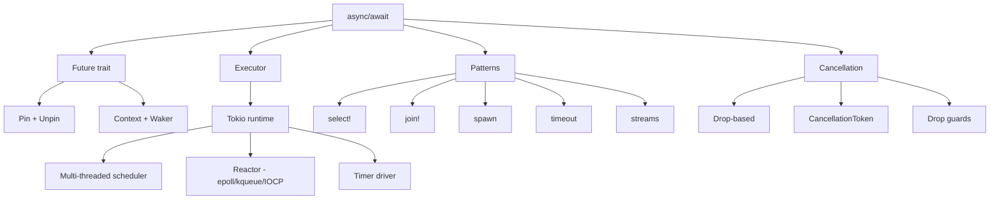

## The Future Trait

The `Future` trait is the foundation of async programming in Rust. It represents a value that may
become available at some point in the future:

```rust
pub trait Future {
    type Output;
    fn poll(self: Pin<&mut Self>, cx: &mut Context<'_>) -> Poll<Self::Output>;
}

pub enum Poll<T> {
    Ready(T),
    Pending,
}
```

A future does not do anything on its own. It must be polled by an executor. Each call to `poll`
either returns `Ready(value)` if the computation is complete, or `Pending` if it needs more time.
When returning `Pending`, the future registers the current `Waker` with the reactor, so the executor
knows to poll it again when progress can be made.

### `Context` and `Waker`

`Context` provides access to the `Waker`, which is used to notify the executor that a future should
be polled again:

```rust
pub struct Context<'a> {
    waker: &'a Waker,
}

impl Waker {
    fn wake(self: &Self);
    fn wake_by_ref(self: &Self);
}
```

When a future returns `Pending`, the executor records that the future is waiting. When the
underlying I/O operation completes (e.g., a socket becomes readable), the reactor calls
`waker.wake()`, which schedules the future for re-polling.

### Polling Model

```
Executor                    Future                    Reactor
   │                          │                          │
   ├── poll() ──────────────► │                          │
   │                          │                          │
   │                     check state                      │
   │                     (not ready)                     │
   │                          │                          │
   │  ◄── Pending ────────────┤                          │
   │                          │                          │
   │                          ├── register waker ──────► │
   │                          │                          │
   │                          │                    I/O event
   │                          │                          │
   │                          │  ◄── wake() ────────────┤
   │                          │                          │
   ├── poll() ──────────────► │                          │
   │                          │                          │
   │                     check state                      │
   │                     (ready)                         │
   │                          │                          │
   │  ◄── Ready(value) ───────┤                          │
   │                          │                          │
```

## How `async fn` Desugars

An `async fn` compiles into a state machine. Each `.await` point becomes a state transition. The
compiler generates an anonymous enum type for the state machine:

```rust
async fn fetch_data(url: &str) -> Result<String, Error> {
    let response = reqwest::get(url).await?;
    let body = response.text().await?;
    Ok(body)
}
```

This roughly desugars to:

```rust
enum FetchDataFuture<'a> {
    State0 { url: &'a str },
    State1 { future: reqwest::ResponseFuture },
    State2 { response: reqwest::Response, future: reqwest::BodyFuture },
    Resolved,
}

impl<'a> Future for FetchDataFuture<'a> {
    type Output = Result<String, Error>;

    fn poll(self: Pin<&mut Self>, cx: &mut Context<'_>) -> Poll<Self::Output> {
        loop {
            match self.get_mut() {
                State0 { url } => {
                    let future = reqwest::get(url);
                    *self = State1 { future };
                }
                State1 { future } => {
                    match Pin::new(future).poll(cx) {
                        Poll::Ready(Ok(response)) => {
                            let body_future = response.text();
                            *self = State2 { response, future: body_future };
                        }
                        Poll::Ready(Err(e)) => {
                            *self = Resolved;
                            return Poll::Ready(Err(e));
                        }
                        Poll::Pending => return Poll::Pending,
                    }
                }
                State2 { future, .. } => {
                    match Pin::new(future).poll(cx) {
                        Poll::Ready(Ok(body)) => {
                            *self = Resolved;
                            return Poll::Ready(Ok(body));
                        }
                        Poll::Ready(Err(e)) => {
                            *self = Resolved;
                            return Poll::Ready(Err(e));
                        }
                        Poll::Pending => return Poll::Pending,
                    }
                }
                Resolved => panic!("polled after completion"),
            }
        }
    }
}
```

The key insight: each `.await` is a yield point where control returns to the executor. The future's
state is saved across yield points so execution can resume from where it left off.

## Pin and Unpin

### Why Pin Exists

The compiler-generated state machine for async blocks can contain self-referential data — a field
that points to another field within the same struct. If the struct were moved, the pointer would
become invalid. `Pin` prevents the wrapped value from being moved after it has been pinned.

```rust
use std::pin::Pin;
use std::marker::PhantomPinned;

struct SelfReferential {
    data: String,
    pointer: *const String,
    _marker: PhantomPinned,
}

impl SelfReferential {
    fn new(data: String) -> Self {
        SelfReferential {
            data,
            pointer: std::ptr::null(),
            _marker: PhantomPinned,
        }
    }
}
```

### `Pin<P>` API

| Method         | Description                                            |
| -------------- | ------------------------------------------------------ |
| `new(pointer)` | Creates a `Pin` from a pointer (requires `Unpin`)      |
| `as_ref()`     | Returns `Pin<&T>`                                      |
| `as_mut()`     | Returns `Pin<&mut T>` (requires `Unpin`)               |
| `get_ref()`    | Returns `&T`                                           |
| `get_mut()`    | Returns `&mut T` (requires `Unpin`)                    |
| `into_inner()` | Unwraps and returns the inner value (requires `Unpin`) |

### `Unpin`

Most types are `Unpin` — they can be safely moved even when pinned. Types that are self-referential
(like the compiler-generated state machine for async blocks) are `!Unpin`:

```rust
// Most types are Unpin
let x = 42;
let mut pinned = Box::pin(x);
let _ = pinned.as_mut().get_mut();  // OK: i32 is Unpin

// Self-referential types are !Unpin
let mut pinned = Box::pin(SelfReferential::new(String::from("hello")));
// pinned.as_mut().get_mut();  // ERROR: SelfReferential is !Unpin
```

### Pin Projection

`pin-project` is the standard crate for safely accessing fields of pinned structs:

```toml
[dependencies]
pin-project = "1"
```

```rust
use pin_project::pin_project;

#[pin_project]
struct MyFuture {
    #[pin]
    inner: SomeFuture,
    extra_data: String,
}

impl Future for MyFuture {
    type Output = ();

    fn poll(self: Pin<&mut Self>, cx: &mut Context<'_>) -> Poll<Self::Output> {
        let this = self.project();
        this.inner.poll(cx)
    }
}
```

## Executor Model

### Tokio Executor

Tokio uses a multi-threaded work-stealing scheduler:

```
┌─────────────────────────────────────────┐
│  Tokio Runtime                          │
│  ┌─────────┐  ┌─────────┐  ┌─────────┐ │
│  │ Worker 1│  │ Worker 2│  │ Worker N│ │
│  │ ┌─────┐ │  │ ┌─────┐ │  │ ┌─────┐ │ │
│  │ │Local│ │  │ │Local│ │  │ │Local│ │ │
│  │ │Queue│ │  │ │Queue│ │  │ │Queue│ │ │
│  │ └──┬──┘ │  │ └──┬──┘ │  │ └──┬──┘ │ │
│  │    │    │  │    │    │  │    │    │ │
│  │    ▼    │  │    ▼    │  │    ▼    │ │
│  │ ┌─────┐ │  │ ┌─────┐ │  │ ┌─────┐ │ │
│  │ │Tasks│ │  │ │Tasks│ │  │ │Tasks│ │ │
│  │ └─────┘ │  │ └─────┘ │  │ └─────┘ │ │
│  └─────────┘  └─────────┘  └─────────┘ │
│       ▲                               │
│       │  work stealing                  │
│       └─────────────────────────────── │
│  ┌──────────────────────────────────┐  │
│  │  Reactor (epoll/kqueue/IOCP)    │  │
│  │  Timer, I/O Driver               │  │
│  └──────────────────────────────────┘  │
└─────────────────────────────────────────┘
```

Each worker thread has a local deque of tasks. When a worker exhausts its local queue, it steals
tasks from other workers' queues. This provides automatic load balancing.

### Task Scheduling

```rust
#[tokio::main]
async fn main() {
    let handle1 = tokio::spawn(async {
        tokio::time::sleep(Duration::from_millis(100)).await;
        "task 1"
    });

    let handle2 = tokio::spawn(async {
        tokio::time::sleep(Duration::from_millis(50)).await;
        "task 2"
    });

    assert_eq!(handle2.await.unwrap(), "task 2");
    assert_eq!(handle1.await.unwrap(), "task 1");
}
```

`tokio::spawn` creates a new task (not an OS thread). Tasks are cooperatively scheduled — they yield
control at `.await` points.

## Async I/O

### Under the Hood: `epoll`/`kqueue`/`IOCP`

Tokio's reactor maps to the OS's native async I/O mechanism:

| Platform | Mechanism | Description                             |
| -------- | --------- | --------------------------------------- |
| Linux    | `epoll`   | Event notification for file descriptors |
| macOS    | `kqueue`  | Event notification for file descriptors |
| Windows  | IOCP      | I/O Completion Ports                    |
| FreeBSD  | `kqueue`  | Event notification for file descriptors |

The reactor registers file descriptors with the OS and receives notifications when they become
readable, writable, or error. When a notification arrives, the reactor wakes the corresponding
future.

### Async File I/O

File I/O on most platforms is not natively async. Tokio uses a thread pool for file operations:

```rust
use tokio::fs;

async fn read_file(path: &str) -> Result<String, io::Error> {
    let content = fs::read_to_string(path).await?;
    Ok(content)
}
```

On Linux with `io_uring`, file I/O can be truly async, but `io_uring` support in tokio is still
evolving.

### Async Networking

Networking I/O is natively async on all platforms:

```rust
use tokio::net::TcpListener;

#[tokio::main]
async fn main() -> Result<(), Box<dyn std::error::Error>> {
    let listener = TcpListener::bind("0.0.0.0:8080").await?;

    loop {
        let (socket, addr) = listener.accept().await?;
        tokio::spawn(async move {
            // handle connection
        });
    }
}
```

## Cancellation

### Drop-Based Cancellation

In Rust, dropping a future cancels it. There is no explicit cancellation token — if you drop the
`JoinHandle`, the task continues running but its result is ignored:

```rust
let handle = tokio::spawn(async {
    loop {
        tokio::time::sleep(Duration::from_secs(1)).await;
        println!("still running");
    }
});

tokio::time::sleep(Duration::from_millis(500)).await;
drop(handle);
// The task is NOT cancelled — it continues running in the background
```

To truly cancel a task, use `tokio::select!` with a cancellation signal or `CancellationToken`:

```rust
use tokio_util::sync::CancellationToken;

let token = CancellationToken::new();
let cloned_token = token.clone();

let handle = tokio::spawn(async move {
    loop {
        tokio::select! {
            _ = cloned_token.cancelled() => {
                println!("cancelled");
                return;
            }
            _ = tokio::time::sleep(Duration::from_secs(1)) => {
                println!("tick");
            }
        }
    }
});

token.cancel();
handle.await?;
```

### Cancellation Safety

Some async operations are cancellation-safe and some are not. An operation is cancellation-safe if
dropping it at any await point leaves the system in a consistent state:

- **Cancellation-safe:** Reading from a channel, accepting a TCP connection
- **Not cancellation-safe:** Writing to a channel (message may be partially sent), holding a lock
  across await points

The tokio documentation marks each function with its cancellation safety category.

### Drop Guards

Drop guards ensure cleanup runs even when a future is cancelled:

```rust
struct DropGuard {
    resource_id: String,
}

impl Drop for DropGuard {
    fn drop(&mut self) {
        eprintln!("cleaning up resource: {}", self.resource_id);
    }
}

async fn with_cleanup(resource_id: &str) {
    let _guard = DropGuard {
        resource_id: resource_id.to_string(),
    };

    do_work().await;
    // _guard dropped here — cleanup runs
}
```

## Async Patterns

### `select!`

Wait on multiple futures and handle the first one to complete:

```rust
use tokio::sync::mpsc;
use tokio::time::{sleep, Duration};

#[tokio::main]
async fn main() {
    let (tx, mut rx) = mpsc::channel(32);

    tokio::spawn(async move {
        sleep(Duration::from_millis(100)).await;
        tx.send("delayed message").await.unwrap();
    });

    tokio::select! {
        msg = rx.recv() => {
            println!("received: {:?}", msg);
        }
        _ = sleep(Duration::from_millis(50)) => {
            println!("timeout");
        }
    }
}
```

:::warning

`select!` drops all non-selected futures. If you need to retry a branch, restructure your code to
loop and recreate the future.

:::

### `join!`

Run multiple futures concurrently and wait for all of them:

```rust
use tokio::time::{sleep, Duration};

#[tokio::main]
async fn main() {
    let (a, b) = tokio::join!(
        async { sleep(Duration::from_millis(100)).await; 1 },
        async { sleep(Duration::from_millis(50)).await; 2 },
    );

    assert_eq!(a, 1);
    assert_eq!(b, 2);
}
```

`join!` runs all futures concurrently, unlike sequential `.await` which runs one at a time.

### `spawn`

Spawn a task on the async runtime:

```rust
#[tokio::main]
async fn main() {
    let handle = tokio::spawn(async {
        expensive_computation().await
    });

    let result = handle.await?;
}
```

### `timeout`

Apply a timeout to any future:

```rust
use tokio::time::{timeout, Duration};

async fn fetch_with_timeout(url: &str) -> Result<String, reqwest::Error> {
    timeout(Duration::from_secs(10), reqwest::get(url))
        .await
        .map_err(|_| reqwest::Error::from(std::io::Error::new(
            std::io::ErrorKind::TimedOut,
            "request timed out",
        )))?
        .await?
        .text()
        .await
}
```

### Streams

Streams are the async equivalent of iterators — they produce a sequence of values over time:

```rust
use tokio_stream::StreamExt;

#[tokio::main]
async fn main() {
    let mut stream = tokio_stream::iter(vec![1, 2, 3, 4, 5]);

    while let Some(value) = stream.next().await {
        println!("{}", value);
    }
}
```

## Async Traits

### The Problem with `async fn` in Traits

Historically, you could not write `async fn` in trait definitions because the compiler could not
generate the correct future type:

```rust
// This did NOT work before Rust 1.75
// trait AsyncProcessor {
//     async fn process(&self, data: &str) -> String;
// }
```

### RPITIT (Return Position Impl Trait in Traits, Rust 1.75+)

Rust 1.75 stabilized async functions in traits:

```rust
trait AsyncProcessor {
    async fn process(&self, data: &str) -> String;
}

struct MyProcessor;

impl AsyncProcessor for MyProcessor {
    async fn process(&self, data: &str) -> String {
        data.to_uppercase()
    }
}
```

### `async-trait` Crate (Fallback)

For older Rust versions or for traits that need to be object-safe:

```toml
[dependencies]
async-trait = "0.1"
```

```rust
use async_trait::async_trait;

#[async_trait]
trait AsyncProcessor {
    async fn process(&self, data: &str) -> String;
}

#[async_trait]
impl AsyncProcessor for MyProcessor {
    async fn process(&self, data: &str) -> String {
        data.to_uppercase()
    }
}
```

`async-trait` works by boxing the future (`Box<dyn Future<Output = T> + Send>`), which adds heap
allocation overhead. RPITIT avoids this overhead.

## `Send` Bounds on Futures

A future must be `Send` to be spawned on tokio's multi-threaded runtime. If a future captures a
non-`Send` type, spawning fails:

```rust
use std::rc::Rc;

#[tokio::main]
async fn main() {
    let rc = Rc::new(42);
    // tokio::spawn(async move {
    //     println!("{}", rc);
    // });  // ERROR: Rc is not Send
}
```

Common non-`Send` types:

- `Rc<T>` — use `Arc<T>` instead
- `&RefCell<T>` — use `Arc<Mutex<T>>` or `Arc<tokio::sync::Mutex<T>>`
- `*const T` / `*mut T` — raw pointers are not `Send` by default

## Common Pitfalls

1. **Blocking the async executor.** Calling `std::thread::sleep`, `std::fs::read_to_string`, or any
   blocking operation inside an async task blocks the entire OS thread. Use `tokio::time::sleep`,
   `tokio::fs`, or `tokio::task::spawn_blocking`.

2. **Holding locks across `.await`.** Holding a `std::sync::Mutex` across an `.await` blocks the
   thread even while the future is suspended. Use `tokio::sync::Mutex` for async contexts, or drop
   the lock before awaiting.

3. **`select!` dropping futures.** When `select!` completes, all non-selected branches are dropped.
   If you need to retry a branch, restructure your code to loop and recreate the future.

4. **Async recursion without `Box::pin`.** Async functions that call themselves create
   infinitely-sized futures. Use `Box::pin` to break the cycle:

   ```rust
   fn read_frames(stream: &mut TcpStream) -> Pin<Box<dyn Future<Output = Result<()>> + Send + '_>> {
       Box::pin(async move {
           // recursive async
       })
   }
   ```

5. **Not using `spawn_blocking` for CPU-intensive work.** CPU-bound work (encryption, compression,
   parsing) should run on a dedicated blocking thread pool, not on the async executor.

6. **Ignoring `JoinHandle` errors.** If a spawned task panics, `handle.await` returns `Err`. Always
   handle the error or use a supervision mechanism.

7. **`tokio::sync::Mutex` vs `std::sync::Mutex`.** `tokio::sync::Mutex` is designed for async
   contexts — its `lock()` method returns a future. `std::sync::Mutex` blocks the thread. Use
   `tokio::sync::Mutex` when the critical section contains `.await`, and `std::sync::Mutex` when the
   critical section is short and synchronous.

8. **Forgetting `move` in spawned tasks.** `tokio::spawn(async { ... })` captures variables by
   reference by default. If the captured variable's lifetime is shorter than the task, you get a
   compile error. Use `tokio::spawn(async move { ... })` to transfer ownership.

9. **Task starvation.** A task that never yields (no `.await` in a loop) prevents other tasks on the
   same worker thread from running. Insert `.await` points in long-running loops using
   `tokio::task::yield_now().await`.

10. **Async testing.** Use `#[tokio::test]` instead of `#[test]` for async test functions. Use
    `#[tokio::test(flavor = "multi_thread")]` for tests that need multi-threaded runtime.

## Async Concept Map



## Async Trait Objects

### `dyn Future`

When you need to store or return futures of different types, use `Pin<Box<dyn Future>>`:

```rust
use std::future::Future;
use std::pin::Pin;

type BoxFuture<T, E> = Pin<Box<dyn Future<Output = Result<T, E>> + Send>>;

fn make_async_operation(kind: &str) -> BoxFuture<String, String> {
    match kind {
        "fast" => Box::pin(async {
            tokio::time::sleep(Duration::from_millis(10)).await;
            Ok("fast result".to_string())
        }),
        "slow" => Box::pin(async {
            tokio::time::sleep(Duration::from_millis(100)).await;
            Ok("slow result".to_string())
        }),
        _ => Box::pin(async {
            Err("unknown operation".to_string())
        }),
    }
}
```

### Future Combinators

The `FutureExt` trait provides combinators for chaining and transforming futures:

```rust
use std::future::Future;
use std::time::Duration;

async fn with_timeout<T, E>(future: impl Future<Output = Result<T, E>>, dur: Duration) -> Result<T, E> {
    tokio::time::timeout(dur, future)
        .await
        .map_err(|_| panic!("timeout"))?  // convert timeout error
}
```

## Async I/O Deep Dive

### TCP Server with Graceful Shutdown

```rust
use tokio::net::TcpListener;
use tokio::sync::broadcast;
use tokio::signal;

async fn run_server() -> Result<(), Box<dyn std::error::Error>> {
    let listener = TcpListener::bind("0.0.0.0:8080").await?;
    let (shutdown_tx, _) = broadcast::channel(1);

    loop {
        tokio::select! {
            result = listener.accept() => {
                let (socket, addr) = result?;
                let shutdown = shutdown_tx.subscribe();
                tokio::spawn(async move {
                    handle_connection(socket, shutdown).await;
                });
            }
            _ = signal::ctrl_c() => {
                println!("shutting down...");
                shutdown_tx.send(())?;
                break;
            }
        }
    }

    Ok(())
}
```

### Async File Operations

```rust
use tokio::fs;
use tokio::io::AsyncWriteExt;

async fn write_log(path: &str, message: &str) -> Result<(), std::io::Error> {
    let mut file = fs::OpenOptions::new()
        .create(true)
        .append(true)
        .open(path)
        .await?;

    let timestamp = chrono::Utc::now().to_rfc3339();
    file.write_all(format!("[{}] {}\n", timestamp, message).as_bytes()).await?;

    Ok(())
}
```

### Async Read/Write Traits

```rust
use tokio::io::{AsyncRead, AsyncWrite, AsyncBufReadExt, AsyncBufRead};

async fn read_lines(reader: impl AsyncBufRead + Unpin) -> Result<Vec<String>, std::io::Error> {
    let mut lines = vec![];
    let mut buf_reader = tokio::io::BufReader::new(reader);
    loop {
        let mut line = String::new();
        let bytes_read = buf_reader.read_line(&mut line).await?;
        if bytes_read == 0 {
            break;
        }
        lines.push(line.trim_end().to_string());
    }
    Ok(lines)
}
```

## Async Debugging

### `tokio-console`

`tokio-console` provides real-time task inspection:

```toml
[dependencies]
tokio = { version = "1", features = ["tracing"] }
console-subscriber = "0.4"
```

```rust
#[tokio::main]
async fn main() {
    console_subscriber::init();

    tokio::spawn(async {
        tokio::time::sleep(Duration::from_secs(1)).await;
    });
}
```

### Tracing Async Spans

```rust
use tracing::{instrument, info};

#[instrument]
async fn fetch_user(id: u64) -> Result<User, Error> {
    info!("fetching user");
    let user = db::get_user(id).await?;
    info!("user fetched");
    Ok(user)
}
```

The `#[instrument]` attribute creates a span that captures the function's arguments and measures
execution time.

### Inspecting Future State

```rust
use std::task::{Context, Poll, RawWaker, RawWakerVTable, Waker};

fn noop_waker() -> Waker {
    fn noop_clone(_: *const ()) -> RawWaker {
        noop_raw_waker()
    }
    fn noop(_: *const ()) {}

    let vtable = &RawWakerVTable::new(noop_clone, noop, noop, noop);
    RawWaker::new(std::ptr::null(), vtable).into()
}

fn poll_once<T>(future: &mut std::pin::Pin<&mut impl Future<Output = T>>) -> Option<T> {
    let waker = noop_waker();
    let mut cx = Context::from_waker(&waker);
    match future.as_mut().poll(&mut cx) {
        Poll::Ready(val) => Some(val),
        Poll::Pending => None,
    }
}
```

## Async Performance Considerations

### Task Sizing

Tokio tasks are lightweight (a few hundred bytes), but creating millions of tasks has overhead.
Batch work into larger tasks when possible:

```rust
// Less efficient — one task per item
for item in items {
    tokio::spawn(process(item));
}

// More efficient — batch processing
tokio::spawn(async move {
    for item in items {
        process(item).await;
    }
});
```

### Buffer Sizing for Channels

Async channels with too-small buffers cause excessive wakeups. Channels with too-large buffers waste
memory. Benchmark to find the right size:

```rust
// Start with a reasonable default
let (tx, rx) = tokio::sync::mpsc::channel(128);

// Adjust based on profiling
```

### Avoiding allocations in Hot Paths

```rust
// Bad — allocates a new String for each message
async fn send_message(tx: &mpsc::Sender<String>, msg: &str) {
    tx.send(msg.to_string()).await.unwrap();
}

// Better — use Arc to share the allocation
async fn send_message(tx: &mpsc::Sender<Arc<String>>, msg: Arc<String>) {
    tx.send(msg).await.unwrap();
}
```
