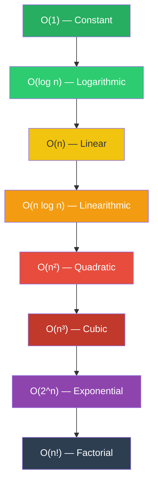
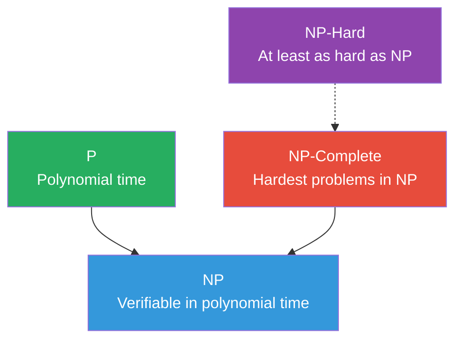

## Why Complexity Analysis Matters

A system that handles 1,000 requests per second at USD 10,000 per month in compute costs is
fundamentally different from one that handles 10 requests per second at the same cost. The
difference is almost always algorithmic: the data structure, the traversal strategy, the caching
policy. Before you optimise constants, before you add hardware, before you profile — understand the
asymptotic behaviour of your algorithm.

Complexity analysis gives you a language for reasoning about how an algorithm scales. It abstracts
away machine-specific details (clock speed, cache size, instruction set) and lets you compare
algorithms on their mathematical properties. This is not academic; it is the difference between a
query that completes in 10 milliseconds and one that takes 10 minutes when the dataset grows from
10,000 to 10,000,000 rows.

## Asymptotic Notation

### Big-O: Upper Bound

$O(g(n))$ is the set of all functions $f(n)$ for which there exist positive constants $c$ and $n_0$
such that:

$$0 \le f(n) \le c \cdot g(n) \quad \mathrm{for all } n \ge n_0$$

Big-O provides an **upper bound** on the growth rate of a function. Saying $f(n) = O(n^2)$ means
that $f(n)$ grows no faster than $n^2$ (up to a constant factor), for sufficiently large $n$.

```python
# Example: nested loop is O(n^2)
def print_all_pairs(arr):
    for i in range(len(arr)):          # O(n)
        for j in range(len(arr)):      # O(n)
            print(arr[i], arr[j])      # O(1)
# Total: O(n) * O(n) * O(1) = O(n^2)
```

### Big-Omega: Lower Bound

$\Omega(g(n))$ is the set of all functions $f(n)$ for which there exist positive constants $c$ and
$n_0$ such that:

$$0 \le c \cdot g(n) \le f(n) \quad \mathrm{for all } n \ge n_0$$

Big-Omega provides a **lower bound**. If an algorithm is $\Omega(n \log n)$, it means no matter how
clever your implementation, the algorithm will take at least $c \cdot n \log n$ steps for large $n$.

### Big-Theta: Tight Bound

$\Theta(g(n))$ is the intersection: $f(n) \in \Theta(g(n))$ if and only if $f(n) \in O(g(n))$ and
$f(n) \in \Omega(g(n))$. This is the **tight bound** — the function grows at exactly the same rate
as $g(n)$, up to constant factors.

$$0 \le c_1 \cdot g(n) \le f(n) \le c_2 \cdot g(n) \quad \mathrm{for all } n \ge n_0$$

:::info

In practice, most engineers use Big-O to mean Big-Theta. This is technically imprecise but
conventionally understood. When someone says "merge sort is $O(n \log n)$," they usually mean it is
$\Theta(n \log n)$. Be aware of the distinction when reading academic papers.

:::

### Little-o and Little-omega

$f(n) = o(g(n))$ means $f(n)$ grows strictly slower than $g(n)$:

$$\lim_{n \to \infty} \frac{f(n)}{g(n)} = 0$$

Similarly, $f(n) = \omega(g(n))$ means $f(n)$ grows strictly faster. These are strict versions of
Big-O and Big-Omega respectively — they exclude the equality case.

| Notation       | Meaning                                      | Intuition          |
| -------------- | -------------------------------------------- | ------------------ |
| $O(g(n))$      | $f(n) \le c \cdot g(n)$                      | At most this fast  |
| $\Omega(g(n))$ | $f(n) \ge c \cdot g(n)$                      | At least this fast |
| $\Theta(g(n))$ | $c_1 \cdot g(n) \le f(n) \le c_2 \cdot g(n)$ | Exactly this fast  |
| $o(g(n))$      | $f(n) / g(n) \to 0$                          | Strictly slower    |
| $\omega(g(n))$ | $f(n) / g(n) \to \infty$                     | Strictly faster    |

## Common Complexity Classes



| Class         | Name         | Example                     | Practical at $n = 10^6$                |
| ------------- | ------------ | --------------------------- | -------------------------------------- |
| $O(1)$        | Constant     | Hash table lookup           | Instantaneous                          |
| $O(\log n)$   | Logarithmic  | Binary search               | ~20 operations                         |
| $O(n)$        | Linear       | Single pass through array   | 1,000,000 operations                   |
| $O(n \log n)$ | Linearithmic | Merge sort                  | ~20,000,000 operations                 |
| $O(n^2)$      | Quadratic    | Bubble sort                 | $10^{12}$ operations (infeasible)      |
| $O(n^3)$      | Cubic        | Naive matrix multiplication | $10^{18}$ operations (infeasible)      |
| $O(2^n)$      | Exponential  | Subset enumeration          | $10^{301,029}$ operations (impossible) |
| $O(n!)$       | Factorial    | Permutation generation      | Beyond astronomical                    |

### What "Practical" Actually Means

The "practical at $n = 10^6$" column assumes roughly $10^9$ operations per second (a single modern
core). In reality:

- A cache miss costs ~100 cycles, so $O(n)$ with poor cache locality can be slower than
  $O(n \log n)$ with good locality.
- Parallelism changes the equation: $O(n \log n)$ on 32 cores is effectively $O(n \log n / 32)$.
- I/O dominates for large datasets: $O(n)$ with 10 GB of random reads from disk is far slower than
  $O(n \log n)$ with sequential reads.

:::warning

Asymptotic analysis tells you how an algorithm scales, not how fast it is for a specific input size.
A well-optimised $O(n^2)$ algorithm can outperform a naive $O(n \log n)$ algorithm for small $n$ or
with favourable cache behaviour. Always benchmark.

:::

## Formal Manipulation Rules

### Sum Rule

If $f_1(n) = O(g_1(n))$ and $f_2(n) = O(g_2(n))$, then $f_1(n) + f_2(n) = O(\max(g_1(n),
g_2(n)))$.

This is why we drop lower-order terms: $O(n^2 + n \log n + 3n) = O(n^2)$ because $n^2$ dominates.

### Product Rule

If $f_1(n) = O(g_1(n))$ and $f_2(n) = O(g_2(n))$, then
$f_1(n) \cdot f_2(n) = O(g_1(n) \cdot
g_2(n))$.

### Polynomial Rule

For any constant $k$, $O(n^k)$ dominates $O(n^j)$ when $k \gt j$.

### Logarithmic Rule

For any constants $a, b \gt 1$: $\log_a n = \log_b n / \log_b a = O(\log n)$. The base of the
logarithm does not matter in Big-O notation because changing base only introduces a constant factor.

### Exponential vs Polynomial

For any constants $k$ and $c \gt 1$: $n^k = o(c^n)$. Polynomials are always asymptotically dominated
by exponentials. This is the fundamental boundary between tractable and intractable problems.

## The Master Theorem

The Master Theorem provides a closed-form solution for recurrences of the form:

$$T(n) = a \cdot T(n/b) + f(n)$$

where $a \ge 1$ and $b \gt 1$. Let $c_{crit} = \log_b a$ (the critical exponent).

### Case 1: Work Dominated by Leaves

If $f(n) = O(n^{c_{crit} - \epsilon})$ for some $\epsilon \gt 0$, then
$T(n) = \Theta(n^{c_{crit}})$.

The recursive work at the leaves dominates the combine step.

**Example:** $T(n) = 8T(n/2) + O(n)$

- $a = 8$, $b = 2$, so $c_{crit} = \log_2 8 = 3$
- $f(n) = O(n) = O(n^{3-2})$, so $\epsilon = 2$
- $T(n) = \Theta(n^3)$

### Case 2: Work Equal Across Levels

If $f(n) = \Theta(n^{c_{crit}} \log^k n)$ for some $k \ge 0$, then
$T(n) = \Theta(n^{c_{crit}} \log^{k+1} n)$.

The work is the same at each level of the recursion tree.

**Example:** $T(n) = 2T(n/2) + O(n)$

- $a = 2$, $b = 2$, so $c_{crit} = \log_2 2 = 1$
- $f(n) = O(n) = \Theta(n^1 \log^0 n)$, so $k = 0$
- $T(n) = \Theta(n \log n)$ — this is merge sort

### Case 3: Work Dominated by Root

If $f(n) = \Omega(n^{c_{crit} + \epsilon})$ for some $\epsilon \gt 0$, and
$a \cdot f(n/b) \le
c \cdot f(n)$ for some $c \lt 1$ and all sufficiently large $n$ (regularity
condition), then $T(n)
= \Theta(f(n))$.

The combine step dominates the recursive work.

**Example:** $T(n) = 2T(n/2) + O(n^2)$

- $a = 2$, $b = 2$, so $c_{crit} = 1$
- $f(n) = O(n^2) = \Omega(n^{1+1})$, so $\epsilon = 1$
- Regularity: $2 \cdot (n/2)^2 = n^2/2 \le 0.5 \cdot n^2$ — satisfied
- $T(n) = \Theta(n^2)$

```python
def master_theorem(a, b, f_case):
    """
    Apply the Master Theorem for T(n) = a*T(n/b) + f(n).
    c_crit = log_b(a)
    """
    import math
    c_crit = math.log(a, b)
    if f_case == 1:  # f(n) = O(n^{c_crit - eps})
        return f"Theta(n^{c_crit})"
    elif f_case == 2:  # f(n) = Theta(n^{c_crit})
        return f"Theta(n^{c_crit} * log n)"
    elif f_case == 3:  # f(n) = Omega(n^{c_crit + eps})
        return "Theta(f(n))"

# Merge sort: a=2, b=2, f(n)=O(n), Case 2
print(master_theorem(2, 2, 2))  # Theta(n^1.0 * log n)
```

### Limitations of the Master Theorem

The Master Theorem does not apply when:

- $f(n)$ is not a simple polynomial or polylogarithmic function
- $a$ or $b$ are not constants
- The subproblems are not all of size $n/b$ (e.g., $T(n) = T(n/3) + T(2n/3) + O(n)$)
- The recurrence is not of the form $aT(n/b) + f(n)$

For these cases, use the recursion tree method or the Akra-Bazzi theorem (a generalisation that
handles subproblems of different sizes).

## Best, Worst, and Average Case

An algorithm's complexity can vary depending on the input. Quicksort runs in $O(n \log n)$ on
average but $O(n^2)$ in the worst case. Linear search is $O(1)$ in the best case (element is first)
and $O(n)$ in the worst case.

| Case         | Definition                                   | When it matters                         |
| ------------ | -------------------------------------------- | --------------------------------------- |
| Best case    | Minimum over all inputs of size $n$          | Rarely useful in practice               |
| Average case | Expected value over a distribution of inputs | Useful when input distribution is known |
| Worst case   | Maximum over all inputs of size $n$          | The standard for guarantees             |

### Why Worst Case is the Default

In systems engineering, worst-case guarantees matter because:

1. **Adversarial inputs exist** — attackers can craft inputs that trigger worst-case behaviour (hash
   collision denial-of-service, regex backtracking)
2. **Tail latency is critical** — p99 latency is dominated by worst-case behaviour, not average
3. **Real-time constraints** — a system that usually responds in 1ms but occasionally takes 10s is
   often worse than one that always responds in 5ms

:::info

Hash table worst-case $O(n)$ operations are what made the HashDoS attack possible. An attacker sends
requests with keys that all hash to the same bucket, turning $O(1)$ lookups into $O(n)$ lookups and
causing CPU exhaustion. This is why many languages (Python, Rust, Go) now use hash randomisation.

:::

## Amortised Analysis

Amortised analysis gives a tighter bound for a sequence of operations when individual operations may
be expensive but the expensive operations are rare enough that the total cost is bounded.

### Aggregate Method

Compute the total cost of $n$ operations and divide by $n$.

**Dynamic array (e.g., Python `list`, C++ `std::vector`):**

- Append is $O(1)$ when there is capacity, $O(n)$ when resizing is needed
- Resizing doubles the capacity: after growing from $k$ to $2k$, the next $k$ appends are $O(1)$
- Total cost for $n$ appends: $1 + 1 + \cdots + 1 + n + 1 + 1 + \cdots$ where the $n$ cost occurs at
  sizes $1, 2, 4, 8, \ldots$
- Total: $n + 1 + 2 + 4 + \cdots + n = n + 2n - 1 = 3n - 1$
- Amortised cost per operation: $O(1)$

### Accounting (Banker's) Method

Assign an **amortised cost** to each operation. The amortised cost must be at least the actual cost.
The surplus accumulates as **credit** that pays for future expensive operations.

For dynamic array append:

- Assign amortised cost of 3 per append (actual cost is 1 when no resize, $k+1$ when resizing from
  $k$)
- When no resize: spend 1, save 2 as credit (1 for the slot, 1 for future resizing)
- When resizing from $k$ to $2k$: the $k$ items already have 1 credit each from previous inserts,
  providing $k$ credit to pay for the $k$ copies
- Credit never goes negative, so the amortised bound is valid

### Potential (Physicist's) Method

Define a **potential function** $\Phi$ on the data structure state. The amortised cost of operation
$i$ is:

$$\hat{c}_i = c_i + \Phi(D_i) - \Phi(D_{i-1})$$

where $c_i$ is the actual cost and $\Phi(D_i)$ is the potential after the operation.

For a dynamic array with size $n$ and capacity $m$:

$$\Phi(D) = 2n - m$$

- After an $O(1)$ insert (no resize): $\Phi$ increases by 2, amortised cost = $1 + 2 = 3$
- After a resize from $m$ to $2m$: $\Phi$ goes from $2m - m = m$ to $2m - 2m = 0$, a drop of $m$
- Amortised cost = $m + 0 - m = 0$ (the actual cost of $m$ is fully paid by the potential drop)

Total amortised cost: $O(1)$ per operation.

```python
class DynamicArray:
    def __init__(self):
        self.data = [0] * 1  # initial capacity = 1
        self.size = 0
        self.capacity = 1

    def append(self, value):
        if self.size == self.capacity:
            # Resize: O(capacity) work, but amortised O(1)
            new_data = [0] * (self.capacity * 2)
            for i in range(self.size):
                new_data[i] = self.data[i]
            self.data = new_data
            self.capacity *= 2
        self.data[self.size] = value
        self.size += 1

    # Amortised O(1) per append over n operations
    # Total: n inserts + sum of resize costs = n + 1 + 2 + 4 + ... + n = 3n
```

## Space Complexity

Space complexity measures the additional memory an algorithm uses beyond the input. Like time
complexity, it is expressed in asymptotic notation.

| Algorithm                | Time              | Space           | Notes                            |
| ------------------------ | ----------------- | --------------- | -------------------------------- |
| In-place quicksort       | $O(n \log n)$ avg | $O(\log n)$     | Stack depth for recursion        |
| Merge sort               | $O(n \log n)$     | $O(n)$          | Auxiliary array                  |
| Heap sort                | $O(n \log n)$     | $O(1)$          | True in-place                    |
| DFS                      | $O(V + E)$        | $O(V)$          | Recursion stack / explicit stack |
| BFS                      | $O(V + E)$        | $O(V)$          | Queue for frontier               |
| Dynamic programming (2D) | Varies            | $O(n \cdot m)$  | Full table                       |
| DP with rolling array    | Same time         | $O(\min(n, m))$ | Space-optimised                  |

### Space-Time Trade-offs

Many algorithms can trade space for time or vice versa:

- **Memoisation** trades $O(n)$ space for exponential-to-polynomial time reduction
- **Bloom filters** trade a small false positive rate for massive space savings (membership testing)
- **Suffix arrays** trade construction time for less space than suffix trees
- **Counting sort** trades $O(k)$ space (where $k$ is the range of values) for $O(n)$ time

## Lower Bounds

A lower bound is a proof that no algorithm in a given model of computation can do better than a
certain complexity.

### Comparison-Based Sorting Lower Bound

Any comparison-based sorting algorithm requires $\Omega(n \log n)$ comparisons in the worst case.

**Proof sketch (decision tree argument):**

- A comparison-based sort can be modelled as a binary decision tree
- Each internal node represents a comparison, each leaf represents a permutation
- There are $n!$ possible permutations of $n$ elements
- A binary tree of height $h$ has at most $2^h$ leaves
- Therefore: $2^h \ge n!$, so $h \ge \log_2(n!) = \Omega(n \log n)$ (by Stirling's approximation)

This is why non-comparison sorts (counting sort, radix sort) can beat $O(n \log n)$ — they do not
compare elements pairwise, so the decision tree argument does not apply.

### Element Uniqueness Lower Bound

Determining whether all elements in an array are distinct requires $\Omega(n \log n)$ time in the
comparison model. This follows from the sorting lower bound (sort, then check adjacent elements).

### Searching Lower Bounds

- Unordered array: $\Omega(n)$ comparisons (must examine every element in the worst case)
- Sorted array: $O(\log n)$ with binary search, and this is optimal for comparison-based search

## NP-Completeness

### Decision Problems

A decision problem is one whose answer is yes or no. Examples: "Does this graph have a Hamiltonian
cycle?" "Is there a subset of these numbers that sums to $k$?"

Optimisation problems can often be reduced to decision problems: "What is the shortest tour?"
becomes "Is there a tour of length at most $k$?" (binary search on $k$).

### P, NP, and NP-Completeness

| Class           | Definition                                         | Example Problems                          |
| --------------- | -------------------------------------------------- | ----------------------------------------- |
| **P**           | Solvable in polynomial time                        | Sorting, shortest path, MST               |
| **NP**          | Verifiable in polynomial time                      | SAT, travelling salesman, graph colouring |
| **NP-Complete** | In NP, and every NP problem reduces to it          | SAT, 3-SAT, vertex cover                  |
| **NP-Hard**     | At least as hard as NP-complete (may not be in NP) | Halting problem, TSP optimisation         |



### Reductions

A problem $A$ **reduces to** problem $B$ (written $A \le_p B$) if an algorithm for $B$ can be used
to solve $A$ in polynomial time. If $A$ is NP-complete and $A \le_p B$, then $B$ is also NP-hard. If
$B$ is also in NP, then $B$ is NP-complete.

**Cook-Levin Theorem:** SAT (Boolean satisfiability) is NP-complete. Every other NP-complete problem
is proven NP-complete by reducing from a known NP-complete problem.

### Common NP-Complete Problems

| Problem             | Input                           | Question                                 | Practical Significance               |
| ------------------- | ------------------------------- | ---------------------------------------- | ------------------------------------ |
| SAT                 | Boolean formula                 | Is there a satisfying assignment?        | Basis for all NP-completeness proofs |
| 3-SAT               | 3-CNF formula                   | Is there a satisfying assignment?        | Circuit design, scheduling           |
| Vertex Cover        | Graph $G$, integer $k$          | Is there a vertex cover of size $\le k$? | Network monitoring                   |
| Travelling Salesman | Graph with weights, integer $k$ | Is there a tour of length $\le k$?       | Logistics, routing                   |
| Subset Sum          | Set of integers, target $t$     | Is there a subset summing to $t$?        | Knapsack variants                    |
| Graph Colouring     | Graph $G$, integer $k$          | Can $G$ be coloured with $k$ colours?    | Register allocation, scheduling      |
| Clique              | Graph $G$, integer $k$          | Does $G$ contain a clique of size $k$?   | Social network analysis              |

### Dealing with NP-Hardness in Practice

When you encounter an NP-hard problem:

1. **Restrict the input** — Many NP-hard problems become polynomial on restricted inputs (e.g., TSP
   on a tree, graph colouring on a bipartite graph)
2. **Approximation algorithms** — Find a solution within a guaranteed factor of optimal (e.g.,
   2-approx for vertex cover, 1.5-approx for metric TSP with Christofides' algorithm)
3. **Heuristics** — Greedy algorithms, local search, simulated annealing, genetic algorithms. No
   guarantees, but often work well in practice
4. **Fixed-parameter tractability** — If the problem is NP-hard but polynomial for fixed parameter
   $k$, use FPT algorithms (e.g., vertex cover is $O(2^k \cdot n)$)
5. **SAT solvers** — For many combinatorial problems, encoding as SAT and using a modern solver
   (CDCL-based) is surprisingly effective

## Practical Considerations

### Cache Behaviour

Asymptotic analysis ignores the memory hierarchy. In practice, cache effects dominate:

- **Sequential access** (arrays): prefetcher-friendly, ~1 ns per access from L1 cache
- **Random access** (linked lists): cache-unfriendly, ~100 ns per miss to main memory
- **B-trees vs binary trees**: B-trees are designed for disk/cache-line-sized blocks, reducing the
  number of cache misses per operation by a factor of $\log_2 B$ where $B$ is the block size

A linked list traversal that is $O(n)$ in theory can be 10-100x slower than an array traversal that
is also $O(n)$, because the array has spatial locality.

### Constant Factors

Big-O hides constant factors. $O(n)$ with a constant of 1000 is slower than $O(n \log n)$ with a
constant of 1 for $n \lt 2^{1000}$. In practice, the constants matter enormously:

- Radix sort has $O(n \cdot k)$ time but small constants and excellent cache behaviour, making it
  faster than comparison sort for integers in practice
- Insertion sort is $O(n^2)$ but has tiny constants and is adaptive, making it the fastest sort for
  $n \lt 50$ or nearly-sorted data

### Branch Prediction

Modern CPUs deeply pipeline instructions and speculate on branch outcomes. A branch that is
unpredictable can cost 15-20 cycles per misprediction. Algorithms with unpredictable branching
patterns (e.g., quicksort on adversarial data, binary search on random data) suffer significantly.

Conditional moves (`cmov` instructions) and branchless implementations can eliminate misprediction
penalties for small inner loops:

```python
# Branchless max (conceptual — actual implementation uses cmov)
def branchless_max(a, b):
    # mask = (a - b) >> 31  (sign bit: 1 if a < b, 0 otherwise)
    # result = a ^ ((a ^ b) & mask)
    return a if a >= b else b
```

## Common Pitfalls

### 1. Confusing Big-O with Big-Theta

Saying "this algorithm is $O(1)$" when you mean $\Theta(1)$ is imprecise. Technically, every
algorithm is $O(2^n)$ because $O$ is only an upper bound. If you claim $O(1)$, you should be
prepared to justify it as a tight bound.

### 2. Ignoring the Input Distribution

Worst-case analysis is essential for guarantees, but average-case analysis matters for real
performance. Quicksort is $O(n^2)$ worst case but $O(n \log n)$ average case with a small constant —
this is why it is the default sort in most standard libraries (with introsort fallback).

### 3. Forgetting About Space

An $O(n)$ time algorithm that uses $O(n^2)$ space is often worse than an $O(n \log n)$ algorithm
that uses $O(1)$ space. Memory is not infinite, and allocation is not free.

### 4. Misapplying the Master Theorem

The Master Theorem requires the recurrence to be of the exact form $T(n) = aT(n/b) + f(n)$. If your
subproblems are of different sizes (e.g., quicksort's $T(n) = T(k) + T(n-k-1) + O(n)$), you need a
different analysis technique.

### 5. Assuming Lower Bounds Cannot Be Beaten

The $O(n \log n)$ sorting lower bound only applies to comparison-based sorts. Counting sort, radix
sort, and bucket sort all beat this bound by using additional information about the input (integer
keys, bounded range, uniform distribution). Similarly, the element uniqueness lower bound is
$\Omega(n \log n)$ only in the comparison model.

### 6. Analysing the Wrong Operation

When analysing complexity, focus on the operation that scales with input size. A hash table has
$O(1)$ average-case lookup, but if your keys are strings and the hash function scans each character,
the actual cost is $O(k)$ where $k$ is the key length. If $k$ grows with $n$ (e.g., storing all
substrings), the "constant-time" lookup is not actually constant.

### 7. Ignoring Amortisation in Latency-Sensitive Systems

Amortised $O(1)$ means the average over many operations is constant. Individual operations can still
be $O(n)$. In a latency-sensitive system (real-time trading, game loop, audio processing), a single
$O(n)$ operation can cause a deadline miss even if the amortised cost is fine. Use data structures
with worst-case guarantees (e.g., std::deque instead of std::vector with occasional reallocation)
for real-time contexts.

### 8. Dropping Constants That Actually Matter

Big-O notation hides constants, but constants matter in practice. An $O(n)$ algorithm with a
constant of 10,000 is slower than an $O(n \log n)$ algorithm with a constant of 1 for any $n$ that
fits in memory. When comparing two algorithms with the same Big-O complexity, benchmark with
realistic data sizes. The constant factors include: number of memory accesses (cache misses
dominate), number of branches (mispredictions cost 15-20 cycles each), and allocation count (heap
allocations are orders of magnitude slower than stack allocations).

## Advanced Topics

### Recursion Tree Method

When the Master Theorem does not apply (e.g., unequal subproblem sizes), use the recursion tree
method. Draw the recursion tree, compute the work at each level, and sum across all levels.

**Example:** $T(n) = T(n/3) + T(2n/3) + O(n)$

The recursion tree has:

- Level 0: work $O(n)$, 1 node of size $n$
- Level 1: work $O(n/3) + O(2n/3) = O(n)$, 2 nodes
- Level 2: work $O(n/9) + O(2n/9) + O(2n/9) + O(4n/9) = O(n)$, 4 nodes
- ...
- Each level does $O(n)$ total work
- The tree height is $\log_{3/2} n$ (the longest root-to-leaf path goes by the 2/3 branch)
- Total: $O(n \log n)$

### Akra-Bazzi Theorem

The Akra-Bazzi theorem generalises the Master Theorem for recurrences of the form:

$$T(x) = \sum_{i=1}^{k} a_i T(b_i x + h_i(x)) + f(x)$$

where $a_i \gt 0$, $0 \lt b_i \lt 1$, and $h_i(x) = O(x / \log^2 x)$. Find $p$ such that
$\sum_{i=1}^{k} a_i b_i^p = 1$. Then:

$$T(x) = \Theta\left(x^p \left(1 + \int_1^x \frac{f(u)}{u^{p+1}} du\right)\right)$$

This handles cases like $T(n) = T(n/3) + T(2n/3) + O(n)$ where the subproblem sizes are not equal.

### Probabilistic Analysis

For algorithms whose running time depends on the input distribution (e.g., quicksort), probabilistic
analysis gives expected running time over a random input. Quicksort with random pivot selection has
expected $O(n \log n)$ comparisons, but the expected number of comparisons can be computed exactly:

$$E[\mathrm{comparisons}] = 2(n+1)H_n - 4n \approx 1.386 n \log_2 n$$

where $H_n = \sum_{i=1}^{n} 1/i$ is the $n$-th harmonic number. The constant $1.386$ is about 39%
more comparisons than the information-theoretic minimum of $n \log_2 n$, which is remarkably close
to optimal for a comparison sort.

### Smoothed Analysis

Worst-case analysis can be too pessimistic for algorithms that perform well on typical inputs but
badly on adversarial ones. Smoothed analysis (Spielman and Teng, 2004) measures expected performance
under small random perturbations of the input. It explains why the simplex method for linear
programming is efficient in practice despite having exponential worst-case complexity: the
adversarial inputs that trigger exponential behaviour are unstable under small perturbations.

### Competitive Analysis (Online Algorithms)

For online algorithms (where future input is unknown), competitive analysis compares the algorithm's
performance to the optimal offline algorithm. An algorithm is $c$-competitive if its cost is at most
$c$ times the optimal cost for every input sequence.

| Online Problem   | Algorithm               | Competitive Ratio            |
| ---------------- | ----------------------- | ---------------------------- |
| Paging (caching) | LRU                     | $k$ (where $k$ = cache size) |
| Paging (caching) | FIFO                    | $k$                          |
| K-server         | Work function algorithm | $2k - 1$                     |
| Load balancing   | Greedy                  | $O(\log n)$                  |
| Ski rental       | Buy after $n$ rentals   | 2                            |

### I/O Complexity and External Memory Model

When data does not fit in memory, the cost model changes. The external memory model (Aggarwal and
Vitter, 1988) counts:

- **I/O operations:** transferring a block of size $B$ between memory and disk
- **Memory size:** $M$ words available in internal memory
- **Disk size:** $N$ words on disk

| Algorithm     | Internal Memory    | External Memory (I/Os)          |
| ------------- | ------------------ | ------------------------------- |
| Scanning      | $O(N)$ time        | $O(N/B)$ I/Os                   |
| Sorting       | $O(N \log N)$ time | $O((N/B) \log_{M/B}(N/B))$ I/Os |
| BST search    | $O(\log N)$ time   | $O(\log_B N)$ I/Os              |
| B-tree search | $O(\log N)$ time   | $O(\log_B N)$ I/Os              |

The gap between internal and external memory complexity is why B-trees exist: a binary tree search
does $O(\log_2 N)$ I/Os (one per level), while a B-tree search does $O(\log_B N)$ I/Os. For
$N =
10^9$ and $B = 100$, binary tree needs ~30 I/Os while B-tree needs ~5 I/Os — a 6x improvement.

### Amortised Analysis: Splay Trees

Splay trees are self-adjusting BSTs with no explicit balance information. Every access is followed
by a "splay" operation that moves the accessed node to the root using a sequence of rotations. The
amortised cost of each operation is $O(\log n)$, proven using the potential method.

The potential function for splay trees is:

$$\Phi(T) = \sum_{v \in T} \log_2(\mathrm{size}(v))$$

where `size(v)` is the number of nodes in the subtree rooted at `v`. The potential is always
non-negative and is $O(n \log n)$ for an $n$-node tree.

**Key properties:**

- No balance information stored — simpler implementation
- Access pattern adapts to workload — frequently accessed nodes move near the root
- Static optimality theorem: splay trees perform within a constant factor of the optimal static tree
  for any access sequence
- Working set theorem: if an item is accessed $t$ times and there are $l$ distinct items accessed
  since its last access, the amortised cost is $O(\log l + \log t)$

:::tip

Splay trees are an excellent choice when access patterns are non-uniform. In file systems, web
caches, and database buffer pools, a small set of hot items dominates access. Splay trees
automatically adapt to this pattern without any tuning parameters.

:::

## Solving Recurrences: A Systematic Approach

When you encounter a recurrence that does not fit the Master Theorem, follow this systematic
approach:

### Step 1: Draw the Recursion Tree

Map out the recursive structure. At each level, record the number of subproblems and the size and
cost of each subproblem.

### Step 2: Compute Per-Level Work

Sum the work across all subproblems at each level. Check if the work is increasing, decreasing, or
constant across levels.

### Step 3: Sum Across All Levels

Use geometric series formulas or other summation techniques to compute the total work.

### Step 4: Verify with Substitution

Use induction to verify your answer. This catches errors in the tree analysis.

**Example: $T(n) = 2T(n/2) + n \log n$**

The Master Theorem does not directly apply because $f(n) = n \log n$ is not of the form
$n^c \log^k n$ for the critical exponent (Case 2 requires the same exponent as $c_{crit}$, but
$\log n$ is not a power of $n$).

Recursion tree:

- Level 0: 1 node, cost $n \log n$
- Level 1: 2 nodes, cost $2 \cdot (n/2) \log(n/2) = n (\log n - 1)$
- Level 2: 4 nodes, cost $4 \cdot (n/4) \log(n/4) = n (\log n - 2)$
- Level $k$: $2^k$ nodes, cost $n (\log n - k)$
- Last level: $\log n$ levels, $n$ nodes of size 1, cost $n$

Total:
$\sum_{k=0}^{\log n - 1} n(\log n - k) + n = n \sum_{j=1}^{\log n} j + n = n \cdot
\frac{\log n (\log n + 1)}{2} + n = O(n \log^2 n)$

## Complexity of Recursive Algorithms

### Multiple Recursive Calls

When an algorithm makes multiple recursive calls of different sizes, the analysis requires summing
the costs of all calls.

**Example:** $T(n) = T(n/3) + T(2n/3) + cn$

The recursion tree has $\log_{3/2} n$ levels (the longest path goes by the 2/3 branch). Each level
does $cn$ work. Total: $O(n \log n)$.

### Recursive Algorithms with Reduction

Some algorithms reduce the problem size by a constant rather than a factor.

**Example:** Binary search — $T(n) = T(n/2) + O(1)$

This is a degenerate case of the Master Theorem with $a = 1$, $b = 2$: $c_{crit} = \log_2 1 = 0$,
$f(n) = O(1) = O(n^0)$, so Case 2 gives $T(n) = O(\log n)$.

**Example:** Euclidean GCD — $T(a, b) = T(b, a \bmod b) + O(1)$

The Euclidean GCD terminates in $O(\log \min(a, b))$ steps. This follows from Lamé's theorem: the
number of steps is at most 5 times the number of digits in the smaller number.

### Divide and Conquer with Uneven Split

```python
def linear_selection(arr, k):
    """
    Select the k-th smallest element (0-indexed) using median-of-medians.
    Worst case: O(n)
    """
    if len(arr) <= 5:
        return sorted(arr)[k]

    # Divide into groups of 5, find median of each
    medians = []
    for i in range(0, len(arr), 5):
        group = arr[i:i + 5]
        medians.append(sorted(group)[len(group) // 2])

    # Recursively find median of medians
    pivot = linear_selection(medians, len(medians) // 2)

    # Partition around pivot
    low = [x for x in arr if x < pivot]
    high = [x for x in arr if x > pivot]
    equal = [x for x in arr if x == pivot]

    if k < len(low):
        return linear_selection(low, k)
    elif k < len(low) + len(equal):
        return pivot
    else:
        return linear_selection(high, k - len(low) - len(equal))
```

The median-of-medians guarantees that at least 30% of elements are in each partition, giving the
recurrence $T(n) \le T(n/5) + T(7n/10) + O(n) = O(n)$ by the Master Theorem (Case 3). This is the
algorithm that proves selection (finding the $k$-th smallest) can be done in linear worst-case time.

## Complexity in Practice: Profiling

Asymptotic analysis tells you how an algorithm scales, but profiling tells you where time is
actually spent. In production systems, use both:

1. **Benchmark with representative data:** Synthetic benchmarks miss cache effects, branch
   prediction patterns, and I/O behaviour. Use production traces or realistic synthetic data.
2. **Profile before optimising:** Use `cProfile`, `perf`, or `VTune` to identify the actual
   bottleneck. The bottleneck is often not where you expect it.
3. **Measure, don't guess:** A single cache miss (100 ns) is worth ~300 integer operations. An L1
   cache hit (1 ns) is 100x faster than a main memory access (100 ns). These differences dwarf the
   constant factors that Big-O hides.
4. **Consider the full pipeline:** An algorithm with better asymptotic complexity but worse cache
   behaviour may be slower in practice. Radix sort ($O(nk)$) is often faster than quicksort
   ($O(n \log n)$) for integers because it accesses memory sequentially.

```python
import timeit

def benchmark_sorts():
    """Benchmark different sorting approaches on realistic data."""
    import random
    n = 1_000_000
    data = [random.randint(0, 10**6) for _ in range(n)]

    timsort_time = timeit.timeit(lambda: sorted(data), number=1)
    print(f"TimSort: {timsort_time:.3f}s")

    # Compare with insertion sort for small data
    small_data = [random.randint(0, 1000) for _ in range(100)]
    isort_time = timeit.timeit(lambda: insertion_sort(small_data[:]), number=1000)
    msort_time = timeit.timeit(lambda: sorted(small_data[:]), number=1000)
    print(f"Insertion sort (100 elements, 1000 runs): {isort_time:.3f}s")
    print(f"TimSort (100 elements, 1000 runs): {msort_time:.3f}s")
```

:::warning

Microbenchmarks are misleading. A sort that benchmarks 10% faster on random data may be 50% slower
on the actual production workload due to access patterns, data distribution, and interaction with
other system components. Always benchmark with realistic data and in a realistic environment.

:::
