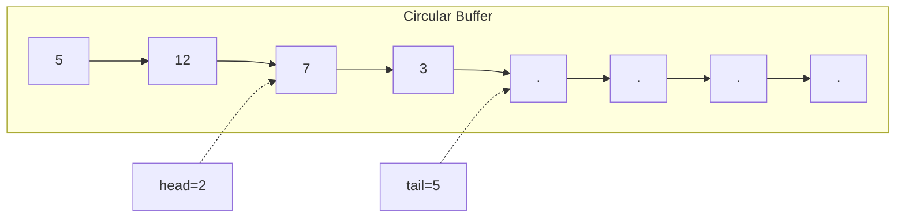
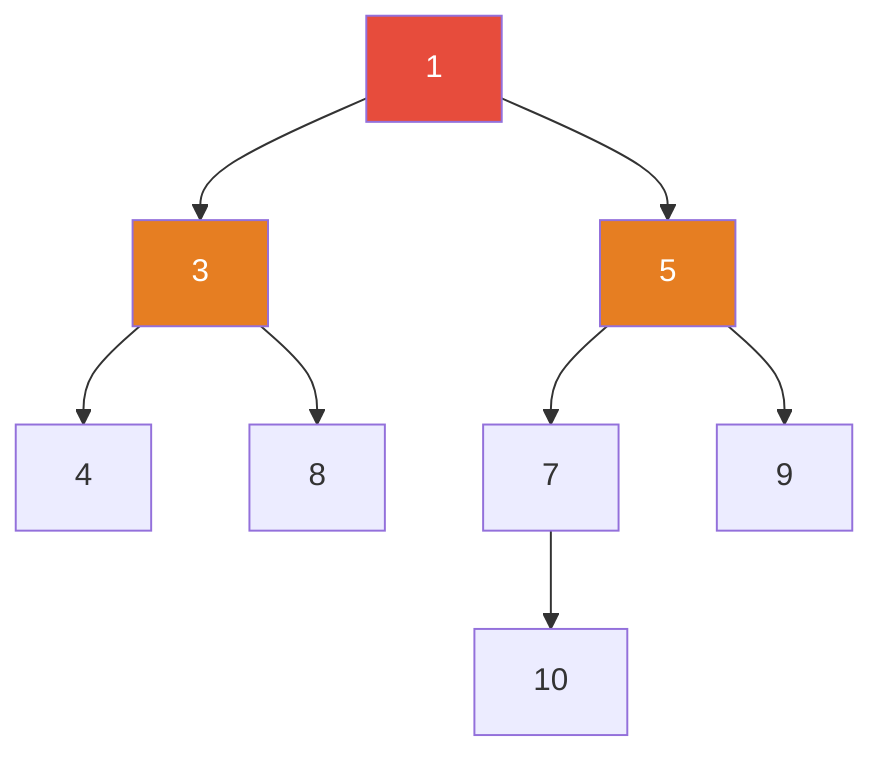

## Deque ADT

A deque (double-ended queue) is a linear collection that supports insertion and removal at both
ends. It generalises both stacks (LIFO) and queues (FIFO).

### Operations

| Operation       | Description          | Array-backed | Linked-list |
| --------------- | -------------------- | ------------ | ----------- |
| `push_front(x)` | Insert at front      | $O(1)$       | $O(1)$      |
| `push_back(x)`  | Insert at back       | $O(1)$       | $O(1)$      |
| `pop_front()`   | Remove from front    | $O(1)$       | $O(1)$      |
| `pop_back()`    | Remove from back     | $O(1)$       | $O(1)$      |
| `front()`       | Access front element | $O(1)$       | $O(1)$      |
| `back()`        | Access back element  | $O(1)$       | $O(1)$      |
| `is_empty()`    | Check if empty       | $O(1)$       | $O(1)$      |
| `size()`        | Number of elements   | $O(1)$       | $O(1)$      |

### Circular Buffer Implementation

A circular buffer (ring buffer) implements a deque using a fixed-size array with two indices (head
and tail) that wrap around.

```python
class CircularBufferDeque:
    """
    Deque using a circular buffer (dynamic array).
    Time: O(1) amortised for all operations
    Space: O(n)
    """
    def __init__(self, capacity=16):
        self.capacity = capacity
        self.data = [None] * capacity
        self.head = 0
        self.tail = 0
        self.size = 0

    def push_front(self, value):
        if self.size == self.capacity:
            self._resize()
        self.head = (self.head - 1) % self.capacity
        self.data[self.head] = value
        self.size += 1

    def push_back(self, value):
        if self.size == self.capacity:
            self._resize()
        self.data[self.tail] = value
        self.tail = (self.tail + 1) % self.capacity
        self.size += 1

    def pop_front(self):
        if self.size == 0:
            raise IndexError("pop from empty deque")
        value = self.data[self.head]
        self.head = (self.head + 1) % self.capacity
        self.size -= 1
        return value

    def pop_back(self):
        if self.size == 0:
            raise IndexError("pop from empty deque")
        self.tail = (self.tail - 1) % self.capacity
        value = self.data[self.tail]
        self.size -= 1
        return value

    def front(self):
        if self.size == 0:
            raise IndexError("front of empty deque")
        return self.data[self.head]

    def back(self):
        if self.size == 0:
            raise IndexError("back of empty deque")
        return self.data[(self.tail - 1) % self.capacity]

    def _resize(self):
        new_data = [None] * (self.capacity * 2)
        for i in range(self.size):
            new_data[i] = self.data[(self.head + i) % self.capacity]
        self.data = new_data
        self.head = 0
        self.tail = self.size
        self.capacity *= 2
```



### Doubly-Linked List Implementation

```python
class DequeNode:
    __slots__ = ('val', 'prev', 'next')
    def __init__(self, val):
        self.val = val
        self.prev = None
        self.next = None

class LinkedListDeque:
    """
    Deque using a doubly-linked list with sentinel nodes.
    Time: O(1) for all operations
    Space: O(n) — one node per element plus two sentinels
    """
    def __init__(self):
        self.sentinel = DequeNode(None)
        self.sentinel.prev = self.sentinel
        self.sentinel.next = self.sentinel
        self.size = 0

    def push_front(self, value):
        node = DequeNode(value)
        node.next = self.sentinel.next
        node.prev = self.sentinel
        self.sentinel.next.prev = node
        self.sentinel.next = node
        self.size += 1

    def push_back(self, value):
        node = DequeNode(value)
        node.prev = self.sentinel.prev
        node.next = self.sentinel
        self.sentinel.prev.next = node
        self.sentinel.prev = node
        self.size += 1

    def pop_front(self):
        if self.size == 0:
            raise IndexError("pop from empty deque")
        node = self.sentinel.next
        node.next.prev = self.sentinel
        self.sentinel.next = node.next
        self.size -= 1
        return node.val

    def pop_back(self):
        if self.size == 0:
            raise IndexError("pop from empty deque")
        node = self.sentinel.prev
        node.prev.next = self.sentinel
        self.sentinel.prev = node.prev
        self.size -= 1
        return node.val
```

### Standard Library Support

| Language | Type                | Implementation  | Notes                        |
| -------- | ------------------- | --------------- | ---------------------------- |
| Python   | `collections.deque` | Circular buffer | $O(1)$ all operations        |
| C++      | `std::deque`        | Segmented array | $O(1)$ all operations        |
| Java     | `ArrayDeque`        | Circular buffer | $O(1)$ all operations        |
| Rust     | `VecDeque`          | Ring buffer     | $O(1)$ all operations        |
| Go       | None (use slice)    | N/A             | Manual implementation needed |

:::info

Python's `collections.deque` is implemented as a doubly-linked list of fixed-size blocks (default
block size is 64 elements). This gives $O(1)$ amortised operations with good cache locality — much
better than a naive linked list but slightly worse than a pure circular buffer for sequential
access.

:::

## Priority Queue ADT

A priority queue supports inserting elements with associated priorities and extracting the element
with the highest (or lowest) priority.

### Operations

| Operation            | Description                       | Binary Heap | Binomial Heap | Fibonacci Heap     |
| -------------------- | --------------------------------- | ----------- | ------------- | ------------------ |
| `insert(x)`          | Insert element with priority      | $O(\log n)$ | $O(\log n)$   | $O(1)$ amort.      |
| `extract_min()`      | Remove and return minimum element | $O(\log n)$ | $O(\log n)$   | $O(\log n)$ amort. |
| `decrease_key(x, k)` | Decrease priority of element x    | $O(\log n)$ | $O(\log n)$   | $O(1)$ amort.      |
| `find_min()`         | Return minimum without removing   | $O(1)$      | $O(1)$        | $O(1)$             |
| `delete(x)`          | Remove arbitrary element          | $O(\log n)$ | $O(\log n)$   | $O(\log n)$ amort. |
| `merge(q1, q2)`      | Merge two priority queues         | $O(n)$      | $O(\log n)$   | $O(1)$ amort.      |

## Binary Heap

A binary heap is a complete binary tree that satisfies the heap property: each node is smaller than
(min-heap) or greater than (max-heap) its children.

### Array Representation

For a node at index $i$ (0-based):

| Relationship | Formula                       |
| ------------ | ----------------------------- |
| Parent       | $\lfloor (i - 1) / 2 \rfloor$ |
| Left child   | $2i + 1$                      |
| Right child  | $2i + 2$                      |



Array: `[1, 3, 5, 4, 8, 7, 9, 10]`

### Heapify (Sift Down)

Given an arbitrary array, rearrange it into a valid heap.

```python
def heapify(arr):
    """
    Build a max-heap from an unsorted array.
    Time: O(n) — NOT O(n log n). See proof below.
    Space: O(1) in-place
    """
    n = len(arr)

    def sift_down(i, size):
        while True:
            largest = i
            left = 2 * i + 1
            right = 2 * i + 2
            if left < size and arr[left] > arr[largest]:
                largest = left
            if right < size and arr[right] > arr[largest]:
                largest = right
            if largest == i:
                break
            arr[i], arr[largest] = arr[largest], arr[i]
            i = largest

    # Start from the last non-leaf node and work up
    for i in range(n // 2 - 1, -1, -1):
        sift_down(i, n)
    return arr
```

:::tip

**Why `heapify` is $O(n)$, not $O(n \log n)$**: The cost of sifting down a node at height $h$ is
$O(h)$. There are at most $\lceil n / 2^{h+1} \rceil$ nodes at height $h$. The total cost is
$\sum_{h=0}^{\lfloor \log n \rfloor} \lceil n / 2^{h+1} \rceil \cdot O(h) = O(n \sum_{h=0}^{\infty} h / 2^{h}) = O(n)$.
The key insight is that most nodes are near the bottom of the tree and require little or no sifting.

:::

### Insert and Extract-Min

```python
class MinHeap:
    """
    Min-heap with insert, extract-min, and decrease-key.
    Time: O(log n) per insert/extract, O(1) for peek.
    Space: O(n)
    """
    def __init__(self):
        self.heap = []

    def peek(self):
        if not self.heap:
            raise IndexError("peek from empty heap")
        return self.heap[0]

    def insert(self, value):
        self.heap.append(value)
        self._sift_up(len(self.heap) - 1)

    def extract_min(self):
        if not self.heap:
            raise IndexError("extract from empty heap")
        if len(self.heap) == 1:
            return self.heap.pop()
        min_val = self.heap[0]
        self.heap[0] = self.heap.pop()
        self._sift_down(0)
        return min_val

    def decrease_key(self, index, new_value):
        if new_value > self.heap[index]:
            raise ValueError("new value must be smaller")
        self.heap[index] = new_value
        self._sift_up(index)

    def _sift_up(self, i):
        while i > 0:
            parent = (i - 1) // 2
            if self.heap[i] >= self.heap[parent]:
                break
            self.heap[i], self.heap[parent] = self.heap[parent], self.heap[i]
            i = parent

    def _sift_down(self, i):
        n = len(self.heap)
        while True:
            smallest = i
            left = 2 * i + 1
            right = 2 * i + 2
            if left < n and self.heap[left] < self.heap[smallest]:
                smallest = left
            if right < n and self.heap[right] < self.heap[smallest]:
                smallest = right
            if smallest == i:
                break
            self.heap[i], self.heap[smallest] = self.heap[smallest], self.heap[i]
            i = smallest
```

### Heap Sort

```python
def heap_sort(arr):
    """
    In-place heap sort.
    Time: O(n log n) worst case
    Space: O(1)
    Not stable.
    """
    n = len(arr)

    def sift_down(i, size):
        while True:
            largest = i
            left = 2 * i + 1
            right = 2 * i + 2
            if left < size and arr[left] > arr[largest]:
                largest = left
            if right < size and arr[right] > arr[largest]:
                largest = right
            if largest == i:
                break
            arr[i], arr[largest] = arr[largest], arr[i]
            i = largest

    heapify(arr)
    for i in range(n - 1, 0, -1):
        arr[0], arr[i] = arr[i], arr[0]
        sift_down(0, i)
    return arr
```

### d-ary Heaps

A d-ary heap is a generalisation where each node has up to $d$ children. For a node at index $i$
(0-based):

| Relationship | Formula                                 |
| ------------ | --------------------------------------- |
| Parent       | $\lfloor (i - 1) / d \rfloor$           |
| Child $j$    | $d \cdot i + j + 1$ for $0 \le j \lt d$ |

| Metric         | Binary ($d=2$)  | 4-ary ($d=4$)   | Choice of $d$                               |
| -------------- | --------------- | --------------- | ------------------------------------------- |
| Height         | $O(\log_2 n)$   | $O(\log_4 n)$   | $d = E/V + 1$ optimises Dijkstra            |
| Sift-down cost | $O(d \log_d n)$ | $O(d \log_d n)$ | Larger $d$ = fewer levels but more compares |
| Sift-up cost   | $O(\log_d n)$   | $O(\log_d n)$   | Smaller $d$ = cheaper sift-up               |

For Dijkstra's algorithm on sparse graphs ($E = O(V)$), $d = 2$ is optimal. For dense graphs
($E = O(V^2)$), $d \approx V/2$ gives the best performance because sift-down is called more often
than sift-up.

## Binomial Heap

A binomial heap is a collection of binomial trees that supports efficient merge. It is the basis for
the Fibonacci heap.

### Binomial Trees

A binomial tree $B_k$ is defined recursively:

- $B_0$ is a single node
- $B_k$ is formed by linking two $B_{k-1}$ trees: one becomes the leftmost child of the other's root

Properties of $B_k$:

| Property         | Value                           |
| ---------------- | ------------------------------- |
| Number of nodes  | $2^k$                           |
| Height           | $k$                             |
| Root degree      | $k$                             |
| Children of root | $B_{k-1}, B_{k-2}, \ldots, B_0$ |

### Merge Operation

```python
class BinomialNode:
    def __init__(self, key):
        self.key = key
        self.degree = 0
        self.parent = None
        self.child = None
        self.sibling = None

class BinomialHeap:
    """
    Binomial heap: merge-able priority queue.
    Insert: O(log n) worst case
    Extract-min: O(log n) worst case
    Merge: O(log n) worst case
    Decrease-key: O(log n)
    """
    def __init__(self):
        self.head = None

    def _merge_roots(self, h1, h2):
        """Merge two root lists sorted by degree. O(log n)."""
        if h1 is None:
            return h2
        if h2 is None:
            return h1
        if h1.degree <= h2.degree:
            result = h1
            h1 = h1.sibling
        else:
            result = h2
            h2 = h2.sibling
        tail = result
        while h1 and h2:
            if h1.degree <= h2.degree:
                tail.sibling = h1
                h1 = h1.sibling
            else:
                tail.sibling = h2
                h2 = h2.sibling
            tail = tail.sibling
        tail.sibling = h1 if h1 else h2
        return result

    def _link(self, y, z):
        """Make y a child of z. y.key >= z.key."""
        y.parent = z
        y.sibling = z.child
        z.child = y
        z.degree += 1

    def _union(self, h):
        """Merge and consolidate. O(log n)."""
        self.head = self._merge_roots(self.head, h.head)
        if self.head is None:
            return
        prev = None
        curr = self.head
        next_node = curr.sibling
        while next_node:
            if (curr.degree != next_node.degree) or \
               (next_node.sibling and next_node.sibling.degree == curr.degree):
                prev = curr
                curr = next_node
            elif curr.key <= next_node.key:
                curr.sibling = next_node.sibling
                self._link(next_node, curr)
            else:
                if prev is None:
                    self.head = next_node
                else:
                    prev.sibling = next_node
                self._link(curr, next_node)
                curr = next_node
            next_node = curr.sibling

    def insert(self, key):
        new_heap = BinomialHeap()
        new_heap.head = BinomialNode(key)
        self._union(new_heap)

    def extract_min(self):
        min_node = self.head
        min_prev = None
        curr = self.head
        prev = None
        while curr:
            if curr.key < min_node.key:
                min_node = curr
                min_prev = prev
            prev = curr
            curr = curr.sibling
        if min_prev:
            min_prev.sibling = min_node.sibling
        else:
            self.head = min_node.sibling
        child = min_node.child
        child_heap = BinomialHeap()
        reversed_list = None
        while child:
            next_child = child.sibling
            child.sibling = reversed_list
            child.parent = None
            reversed_list = child
            child = next_child
        child_heap.head = reversed_list
        self._union(child_heap)
        return min_node.key
```

## Fibonacci Heap

A Fibonacci heap is a collection of min-heap-ordered trees that supports amortised $O(1)$ insert and
decrease-key, making it asymptotically optimal for algorithms like Dijkstra's and Prim's.

### Key Insight: Lazy Merging

Unlike binomial heaps, Fibonacci heaps do not consolidate trees on every operation. Instead, they
perform consolidation only during `extract_min`. This laziness is what gives amortised $O(1)$ for
`insert` and `decrease_key`.

### Operations

| Operation    | Amortised Time | Worst Case  | Mechanism                                  |
| ------------ | -------------- | ----------- | ------------------------------------------ |
| Insert       | $O(1)$         | $O(1)$      | Add tree to root list                      |
| Find-min     | $O(1)$         | $O(1)$      | Pointer to minimum root                    |
| Extract-min  | $O(\log n)$    | $O(n)$      | Consolidate trees during extraction        |
| Decrease-key | $O(1)$         | $O(\log n)$ | Cut and cascade if parent marked           |
| Delete       | $O(\log n)$    | $O(n)$      | Decrease-key to $-\infty$ then extract-min |
| Merge        | $O(1)$         | $O(1)$      | Concatenate root lists                     |

### Marking and Cascading Cuts

When a node loses its first child, it is marked. When it loses a second child, it is cut from its
parent and added to the root list. This cascading ensures the tree structure does not degrade too
badly — the degree of any node is bounded by $O(\log_\phi n)$ where $\phi = (1 + \sqrt{5}) / 2$.

```python
class FibNode:
    def __init__(self, key):
        self.key = key
        self.degree = 0
        self.parent = None
        self.child = None
        self.left = self
        self.right = self
        self.mark = False

class FibonacciHeap:
    """
    Fibonacci heap with amortised O(1) insert and decrease-key.
    Insert: O(1) amortised
    Extract-min: O(log n) amortised
    Decrease-key: O(1) amortised
    Merge: O(1)
    """
    def __init__(self):
        self.min_node = None
        self.total_nodes = 0

    def insert(self, key):
        node = FibNode(key)
        if self.min_node is None:
            self.min_node = node
        else:
            self._add_to_root_list(node)
            if node.key < self.min_node.key:
                self.min_node = node
        self.total_nodes += 1

    def _add_to_root_list(self, node):
        node.left = self.min_node
        node.right = self.min_node.right
        self.min_node.right.left = node
        self.min_node.right = node

    def extract_min(self):
        z = self.min_node
        if z is not None:
            child = z.child
            while child:
                next_child = child.right
                self._add_to_root_list(child)
                child.parent = None
                child = next_child
            z.left.right = z.right
            z.right.left = z.left
            if z == z.right:
                self.min_node = None
            else:
                self.min_node = z.right
                self._consolidate()
            self.total_nodes -= 1
        return z.key if z else None

    def _consolidate(self):
        import math
        max_degree = int(math.log(self.total_nodes) / math.log((1 + math.sqrt(5)) / 2)) + 1
        degree_to_tree = [None] * (max_degree + 1)
        roots = []
        curr = self.min_node
        if curr:
            start = curr
            while True:
                roots.append(curr)
                curr = curr.right
                if curr == start:
                    break
        for w in roots:
            x = w
            d = x.degree
            while degree_to_tree[d]:
                y = degree_to_tree[d]
                if x.key > y.key:
                    x, y = y, x
                self._link(y, x)
                degree_to_tree[d] = None
                d += 1
            degree_to_tree[d] = x
        self.min_node = None
        for tree in degree_to_tree:
            if tree:
                if self.min_node is None or tree.key < self.min_node.key:
                    self.min_node = tree

    def _link(self, y, x):
        y.left.right = y.right
        y.right.left = y.left
        y.parent = x
        if x.child is None:
            x.child = y
            y.left = y
            y.right = y
        else:
            y.left = x.child
            y.right = x.child.right
            x.child.right.left = y
            x.child.right = y
        x.degree += 1
        y.mark = False

    def decrease_key(self, node, new_key):
        if new_key > node.key:
            raise ValueError("new key is greater than current key")
        node.key = new_key
        parent = node.parent
        if parent and node.key < parent.key:
            self._cut(node, parent)
            self._cascading_cut(parent)
        if node.key < self.min_node.key:
            self.min_node = node

    def _cut(self, x, y):
        if y.child == x:
            y.child = x.right
        if y.child == x:
            y.child = None
        x.left.right = x.right
        x.right.left = x.left
        y.degree -= 1
        self._add_to_root_list(x)
        x.parent = None
        x.mark = False

    def _cascading_cut(self, y):
        while y.parent:
            if not y.mark:
                y.mark = True
                break
            else:
                parent = y.parent
                self._cut(y, parent)
                y = parent
```

### When to Use Fibonacci Heaps

Fibonacci heaps have high constant factors (due to the complex pointer manipulation and lazy
structure). They are asymptotically better than binary heaps only when `decrease_key` is called many
times relative to `extract_min`. In practice:

| Algorithm         | Binary Heap Time  | Fibonacci Heap Time | Practical Winner |
| ----------------- | ----------------- | ------------------- | ---------------- |
| Dijkstra (sparse) | $O((V+E) \log V)$ | $O(V \log V + E)$   | Binary heap      |
| Dijkstra (dense)  | $O(V^2 \log V)$   | $O(V^2)$            | Fibonacci heap   |
| Prim (sparse)     | $O((V+E) \log V)$ | $O(V \log V + E)$   | Binary heap      |
| Prim (dense)      | $O(V^2 \log V)$   | $O(V^2)$            | Fibonacci heap   |

:::warning

Fibonacci heaps are primarily of theoretical interest. The constant factors are so large that binary
heaps (or 4-ary heaps) are almost always faster in practice. Pairing heaps are a simpler alternative
that achieves the same amortised bounds for most operations.

:::

## Pairing Heap

A pairing heap is a simplified alternative to Fibonacci heaps. It is a self-adjusting heap that
supports all operations in amortised $O(\log n)$ except insert and find-min which are $O(1)$. The
decrease-key operation is conjectured to be $O(1)$ amortised, but this has only been proven for
special cases.

```python
class PairingNode:
    def __init__(self, key):
        self.key = key
        self.child = None
        self.sibling = None

class PairingHeap:
    """
    Pairing heap — simpler Fibonacci heap alternative.
    Insert: O(1) amortised
    Find-min: O(1)
    Extract-min: O(log n) amortised
    Merge: O(1)
    Decrease-key: O(log n) amortised (O(1) conjectured)
    """
    def __init__(self):
        self.root = None

    def insert(self, key):
        node = PairingNode(key)
        self.root = self._merge(self.root, node)

    def find_min(self):
        if self.root is None:
            raise IndexError("empty heap")
        return self.root.key

    def _merge(self, h1, h2):
        if h1 is None:
            return h2
        if h2 is None:
            return h1
        if h1.key > h2.key:
            h1, h2 = h2, h1
        h2.sibling = h1.child
        h1.child = h2
        return h1

    def extract_min(self):
        if self.root is None:
            raise IndexError("empty heap")
        min_key = self.root.key
        child = self.root.child
        if child is not None:
            self.root = self._two_pass_merge(child)
        else:
            self.root = None
        return min_key

    def _two_pass_merge(self, first):
        if first is None or first.sibling is None:
            return first
        pairs = []
        while first and first.sibling:
            next_pair = first.sibling.sibling
            pairs.append(self._merge(first, first.sibling))
            first = next_pair
        if first:
            pairs.append(first)
        result = pairs[-1]
        for i in range(len(pairs) - 2, -1, -1):
            result = self._merge(result, pairs[i])
        return result

    def merge(self, other):
        self.root = self._merge(self.root, other.root)
```

## Applications

### Dijkstra's Algorithm with Priority Queue

```python
import heapq

def dijkstra_pq(graph, source):
    """
    Dijkstra using binary heap priority queue.
    Time: O((V + E) log V)
    Space: O(V)
    """
    dist = {v: float('inf') for v in graph}
    dist[source] = 0
    prev = {v: None for v in graph}
    visited = set()
    pq = [(0, source)]

    while pq:
        d, u = heapq.heappop(pq)
        if u in visited:
            continue
        visited.add(u)
        for v, w in graph[u]:
            if v not in visited:
                new_dist = d + w
                if new_dist < dist[v]:
                    dist[v] = new_dist
                    prev[v] = u
                    heapq.heappush(pq, (new_dist, v))

    return dist, prev
```

### Huffman Coding

```python
import heapq
from collections import Counter

def huffman_codes(text):
    """
    Build Huffman codes from character frequencies.
    Time: O(n log n) where n = number of unique characters
    Space: O(n)
    """
    freq = Counter(text)
    heap = [(count, i, char) for i, (char, count) in enumerate(freq.items())]
    heapq.heapify(heap)

    parent = {}
    counter = len(heap)

    while len(heap) > 1:
        left_count, _, left_node = heapq.heappop(heap)
        right_count, _, right_node = heapq.heappop(heap)
        merged = (left_count + right_count, counter)
        counter += 1
        parent[left_node] = merged
        parent[right_node] = merged
        heapq.heappush(heap, (merged[0], merged[1], merged))

    codes = {}
    for char in freq:
        code = []
        node = char
        while node in parent:
            merged = parent[node]
            code.append('0' if parent[node][0] == merged[0] and \
                isinstance(node, str) and left_count else '1')
            node = merged
        codes[char] = ''.join(reversed(code)) if code else '0'

    return codes
```

### Merge K Sorted Lists

```python
import heapq

def merge_k_sorted(lists):
    """
    Merge k sorted lists using a min-heap.
    Time: O(N log k) where N = total elements, k = number of lists
    Space: O(k) for the heap
    """
    heap = []
    for i, lst in enumerate(lists):
        if lst:
            heapq.heappush(heap, (lst[0], i, 0))

    result = []
    while heap:
        val, list_idx, elem_idx = heapq.heappop(heap)
        result.append(val)
        if elem_idx + 1 < len(lists[list_idx]):
            next_val = lists[list_idx][elem_idx + 1]
            heapq.heappush(heap, (next_val, list_idx, elem_idx + 1))

    return result
```

### Event Simulation

```python
import heapq

class EventSimulation:
    """
    Discrete event simulation using a priority queue.
    Time: O(E log E) where E = number of events
    """
    def __init__(self):
        self.clock = 0.0
        self.events = []

    def schedule(self, time_delta, event_fn, *args):
        event_time = self.clock + time_delta
        heapq.heappush(self.events, (event_time, event_fn, args))

    def run(self):
        while self.events:
            event_time, event_fn, args = heapq.heappop(self.events)
            self.clock = event_time
            event_fn(*args)
```

### Standard Library Reference

**Python `heapq`:**

```python
import heapq

heap = []
heapq.heappush(heap, 5)
heapq.heappush(heap, 2)
heapq.heappush(heap, 8)
min_val = heapq.heappop(heap)  # 2

# heapify existing list
arr = [5, 2, 8, 1, 9]
heapq.heapify(arr)

# n largest / smallest
heapq.nlargest(3, arr)
heapq.nsmallest(3, arr)

# Merge sorted iterables
merged = heapq.merge([1, 3, 5], [2, 4, 6])
```

**C++ `std::priority_queue`:**

```cpp
#include <queue>
#include <vector>

// Max-heap (default)
std::priority_queue<int> max_pq;
max_pq.push(5);
max_pq.push(2);
int top = max_pq.top();  // 5

// Min-heap
std::priority_queue<int, std::vector<int>, std::greater<int>> min_pq;

// Custom comparator
auto cmp = [](const pair<int,int>& a, const pair<int,int>& b) {
    return a.second > b.second;
};
std::priority_queue<pair<int,int>, vector<pair<int,int>>, decltype(cmp)> pq(cmp);
```

:::info

Python's `heapq` is a **min-heap**. For a max-heap, negate the values: push `(-x, x)` and pop
`(-neg_x, x)`. C++ `std::priority_queue` is a **max-heap** by default; use `std::greater` for a
min-heap.

:::

## Common Pitfalls

### 1. Using the Wrong Heap Type

Python's `heapq` is a min-heap, while C++ `std::priority_queue` is a max-heap by default. Forgetting
this leads to extracting the wrong element. Always verify the heap property before using it in an
algorithm.

### 2. Modifying Heap Elements In-Place

Binary heaps do not support efficient `decrease_key` in their standard library implementations.
Modifying an element's priority in-place and calling `heapify` is $O(n)$. If you need efficient
`decrease_key`, use a Fibonacci heap or a custom heap with a position map.

### 3. Integer Overflow in Priority Values

If priorities are computed as sums or products of other values, they can overflow 32-bit integers.
In competitive programming and systems code, use 64-bit integers. In Python, this is not an issue.

### 4. Dijkstra with Negative Weights

Dijkstra's algorithm requires non-negative edge weights. If the graph has negative weights, use
Bellman-Ford ($O(VE)$) instead. A common mistake is to shift all weights to be positive (adding a
constant to each edge), which changes the shortest paths.

### 5. forgetting to Handle Ties in Priority Queue

When two elements have the same priority, the order of extraction depends on the tie-breaking rule.
In Python, if the second element of the heap tuple is not comparable, you get a `TypeError`. Always
include a unique identifier as a tiebreaker: `(priority, counter, data)`.

### 6. Using `heapq.nlargest` on Small k

`heapq.nlargest(k, iterable)` is $O(n \log k)$, but for small $k$ (e.g., $k = 1$), it is faster than
sorting ($O(n \log n)$). However, if $k$ is close to $n$, sorting is faster. The threshold is
approximately $k = n / 1000$.

### 7. Circular Buffer Off-by-One in Deque Implementation

When implementing a circular buffer, the most common bugs are: (1) confusing full and empty states
(both occur when `head == tail`), (2) incorrect modular arithmetic when resizing, and (3) forgetting
to handle the wrap-around when iterating. Using a separate `size` counter (rather than inferring it
from `head` and `tail`) avoids the full/empty ambiguity.

### 8. Fibonacci Heap Degree Bound

The degree bound $D(n) = O(\log_\phi n)$ for Fibonacci heaps depends on the cascading cut mechanism
working correctly. If you forget to mark a node when cutting its child, the degree can grow
unbounded, and the amortised bounds break down.
