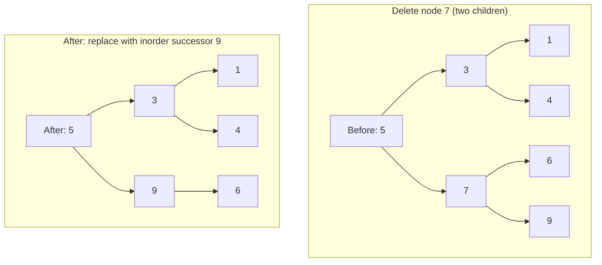
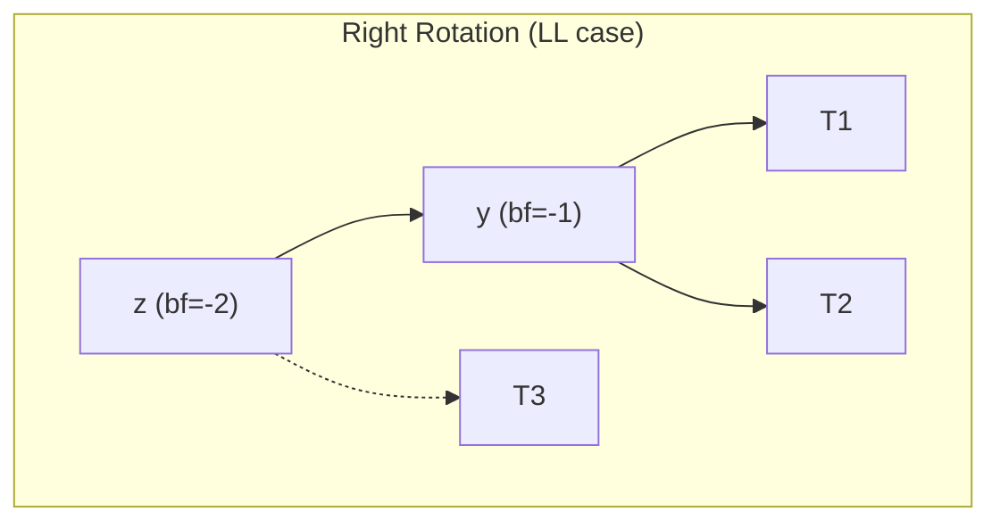
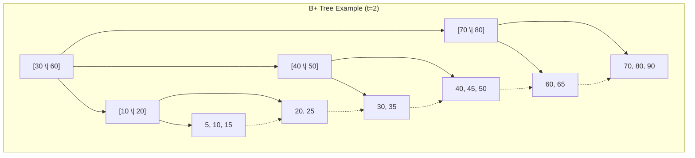
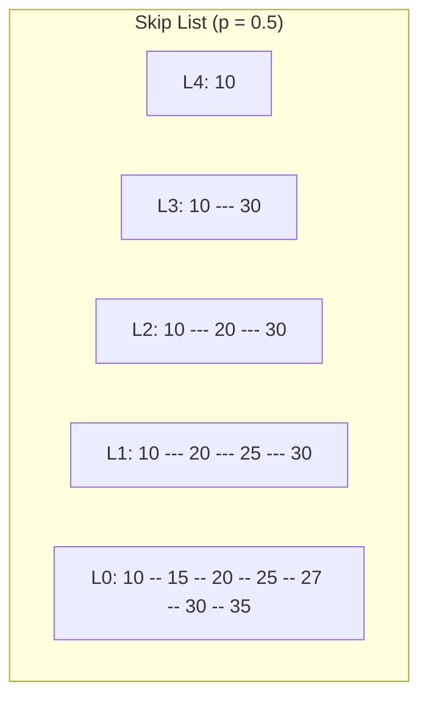

## Binary Search Tree Fundamentals

A binary search tree (BST) is a binary tree where every node satisfies the **BST property**: for any
node with key $k$, all keys in its left subtree are strictly less than $k$, and all keys in its
right subtree are strictly greater than $k$.

### Node Definition

```python
class BSTNode:
    def __init__(self, key, val=None):
        self.key = key
        self.val = val
        self.left = None
        self.right = None
        self.parent = None
```

### Search

```python
def bst_search(root, key):
    """
    Search for key in BST.
    Time: O(h) where h = tree height
    Best case (balanced): O(log n)
    Worst case (degenerate): O(n)
    """
    curr = root
    while curr:
        if key == curr.key:
            return curr
        elif key < curr.key:
            curr = curr.left
        else:
            curr = curr.right
    return None
```

### Insert

```python
def bst_insert(root, key, val=None):
    """
    Insert key into BST. Returns new root.
    Time: O(h)
    """
    if root is None:
        return BSTNode(key, val)
    if key < root.key:
        root.left = bst_insert(root.left, key, val)
        root.left.parent = root
    elif key > root.key:
        root.right = bst_insert(root.right, key, val)
        root.right.parent = root
    return root
```

### Delete — Three Cases

```python
def bst_delete(root, key):
    """
    Delete key from BST. Returns new root.
    Time: O(h)
    """
    if root is None:
        return None

    if key < root.key:
        root.left = bst_delete(root.left, key)
    elif key > root.key:
        root.right = bst_delete(root.right, key)
    else:
        # Case 1: No children (leaf)
        if root.left is None and root.right is None:
            return None
        # Case 2: One child
        if root.left is None:
            return root.right
        if root.right is None:
            return root.left
        # Case 3: Two children — replace with inorder successor
        successor = bst_min(root.right)
        root.key = successor.key
        root.val = successor.val
        root.right = bst_delete(root.right, successor.key)

    return root

def bst_min(node):
    """Find minimum key node. O(h)."""
    while node.left:
        node = node.left
    return node
```



### BST Height

| Shape      | Height               | Search/Insert/Delete |
| ---------- | -------------------- | -------------------- |
| Balanced   | $O(\log n)$          | $O(\log n)$          |
| Degenerate | $O(n)$               | $O(n)$               |
| Random     | $O(\log n)$ expected | $O(\log n)$ expected |

For $n$ distinct keys inserted in random order, the expected height of a BST is approximately
$2 \ln n \approx 1.39 \log_2 n$. This is only about 39% taller than a perfectly balanced tree, but
the worst case (sorted input) gives height $n$.

### Traversals

```python
def inorder(root):
    """Left -> Root -> Right. Yields sorted order for BST. O(n)."""
    if root:
        yield from inorder(root.left)
        yield root.key
        yield from inorder(root.right)

def preorder(root):
    """Root -> Left -> Right. O(n)."""
    if root:
        yield root.key
        yield from preorder(root.left)
        yield from preorder(root.right)

def postorder(root):
    """Left -> Right -> Root. O(n)."""
    if root:
        yield from postorder(root.left)
        yield from postorder(root.right)
        yield root.key

def level_order(root):
    """Breadth-first traversal. O(n)."""
    from collections import deque
    if root is None:
        return
    q = deque([root])
    while q:
        node = q.popleft()
        yield node.key
        if node.left:
            q.append(node.left)
        if node.right:
            q.append(node.right)
```

### Successor and Predecessor

```python
def bst_successor(node):
    """
    Find inorder successor of node.
    Time: O(h)
    """
    if node.right:
        return bst_min(node.right)
    parent = node.parent
    while parent and node == parent.right:
        node = parent
        parent = parent.parent
    return parent

def bst_predecessor(node):
    """
    Find inorder predecessor of node.
    Time: O(h)
    """
    if node.left:
        curr = node.left
        while curr.right:
            curr = curr.right
        return curr
    parent = node.parent
    while parent and node == parent.left:
        node = parent
        parent = parent.parent
    return parent
```

## AVL Trees

An AVL tree (Adelson-Velsky and Landis, 1962) is a self-balancing BST where the **balance factor**
of every node is in $\{-1, 0, 1\}$. The balance factor is the height of the right subtree minus the
height of the left subtree.

### Balance Factor

$$\mathrm{bf}(v) = \mathrm{height}(v.\mathrm{right}) - \mathrm{height}(v.\mathrm{left})$$

After every insertion or deletion, we walk back up from the modified node to the root, rebalancing
as needed. The balance factor must be in $\{-1, 0, 1\}$ for every node.

### Rotations



**LL (Left-Left) Case**: Right rotation on $z$.

```
     z                y
    / \              / \
   y   T3    =>    T1   z
  / \                  / \
 T1  T2              T2   T3
```

**RR (Right-Right) Case**: Left rotation on $z$.

```
   z                  y
  / \                / \
 T1   y      =>     z   T3
     / \           / \
    T2  T3       T1  T2
```

**LR (Left-Right) Case**: Left rotation on $y$, then right rotation on $z$.

```
     z                z                x
    / \              / \              / \
   y   T3   =>     x   T3   =>     y   z
  / \              / \              / \ / \
 T1   x           y  T2           T1 T2 T3 T4
     / \         / \
    T2  T3      T1  T2
```

**RL (Right-Left) Case**: Right rotation on $y$, then left rotation on $z$.

```
   z                z                  x
  / \              / \                / \
 T1   y    =>    T1   x      =>     z   y
     / \             / \            / \ / \
    x   T4         T2   y         T1 T2 T3 T4
   / \                  / \
  T2  T3              T3  T4
```

### Implementation

```python
class AVLNode:
    def __init__(self, key, val=None):
        self.key = key
        self.val = val
        self.left = None
        self.right = None
        self.height = 1

class AVLTree:
    """
    AVL tree: self-balancing BST.
    Search: O(log n) worst case
    Insert: O(log n) worst case (at most 2 rotations)
    Delete: O(log n) worst case (at most O(log n) rotations)
    Space: O(n)
    """
    def _height(self, node):
        return node.height if node else 0

    def _balance_factor(self, node):
        if node is None:
            return 0
        return self._height(node.right) - self._height(node.left)

    def _update_height(self, node):
        node.height = 1 + max(self._height(node.left), self._height(node.right))

    def _rotate_right(self, z):
        y = z.left
        T3 = y.right
        y.right = z
        z.left = T3
        self._update_height(z)
        self._update_height(y)
        return y

    def _rotate_left(self, z):
        y = z.right
        T2 = y.left
        y.left = z
        z.right = T2
        self._update_height(z)
        self._update_height(y)
        return y

    def _rebalance(self, node):
        self._update_height(node)
        bf = self._balance_factor(node)

        if bf > 1:
            if self._balance_factor(node.right) < 0:
                node.right = self._rotate_right(node.right)
            return self._rotate_left(node)
        if bf < -1:
            if self._balance_factor(node.left) > 0:
                node.left = self._rotate_left(node.left)
            return self._rotate_right(node)

        return node

    def insert(self, root, key, val=None):
        if root is None:
            return AVLNode(key, val)
        if key < root.key:
            root.left = self.insert(root.left, key, val)
        elif key > root.key:
            root.right = self.insert(root.right, key, val)
        return self._rebalance(root)

    def delete(self, root, key):
        if root is None:
            return None
        if key < root.key:
            root.left = self.delete(root.left, key)
        elif key > root.key:
            root.right = self.delete(root.right, key)
        else:
            if root.left is None:
                return root.right
            if root.right is None:
                return root.left
            successor = root.right
            while successor.left:
                successor = successor.left
            root.key = successor.key
            root.val = successor.val
            root.right = self.delete(root.right, successor.key)
        return self._rebalance(root)

    def search(self, root, key):
        curr = root
        while curr:
            if key == curr.key:
                return curr
            elif key < curr.key:
                curr = curr.left
            else:
                curr = curr.right
        return None
```

### Complexity Proof

An AVL tree with $n$ nodes has height at most $1.44 \log_2(n+2) - 1.328$. Proof sketch: the minimum
number of nodes in an AVL tree of height $h$ is $N(h) = N(h-1) + N(h-2) + 1$ with $N(0) = 1$,
$N(1) = 2$. This is closely related to the Fibonacci sequence, giving $N(h) = F_{h+3} - 1$. Since
$F_k \approx \phi^k / \sqrt{5}$, we get $h \le c \log_\phi(n)$ for some constant $c$.

| Operation | Worst Case  | Rotations per Insert | Rotations per Delete |
| --------- | ----------- | -------------------- | -------------------- |
| Search    | $O(\log n)$ | 0                    | 0                    |
| Insert    | $O(\log n)$ | $\le 2$              | 0                    |
| Delete    | $O(\log n)$ | 0                    | $O(\log n)$          |

:::info

Insertion requires at most 1 rotation (single or double). Deletion may require up to $O(\log n)$
rotations in the worst case, because a deletion can increase the height difference at each ancestor
along the path to the root.

:::

## Red-Black Trees

A red-black tree is a self-balancing BST where each node has a colour (red or black) and satisfies
five invariants. It provides the same $O(\log n)$ worst-case guarantees as AVL trees but with fewer
rotations on insertion (at most 2) and deletion (at most 3).

### Properties

1. Every node is either red or black
2. The root is black
3. Every leaf (NIL) is black
4. If a node is red, both its children are black (no two reds in a row)
5. For each node, all paths from the node to descendant NIL nodes contain the same number of black
   nodes (black-height)

### Black-Height Lemma

The black-height of a node is the number of black nodes on any path from that node to a NIL leaf
(not counting the node itself). By property 5, this is well-defined. A red-black tree with $n$
internal nodes has height at most $2 \log_2(n+1)$.

**Proof sketch**: the shortest path from root to leaf has only black nodes (length = bh), and the
longest has alternating red-black (length = 2 \cdot bh). Since at least half the nodes on any
root-to-leaf path are black, the height $h \le 2 \cdot \mathrm{bh}$. A tree with black-height $b$ has
at least $2^b - 1$ internal nodes, so $n \ge 2^{h/2} - 1$, giving $h \le 2 \log_2(n+1)$.

### Node Definition

```python
RED = True
BLACK = False

class RBNode:
    def __init__(self, key, val=None, colour=RED):
        self.key = key
        self.val = val
        self.left = None
        self.right = None
        self.parent = None
        self.colour = colour

NIL = RBNode(key=None, colour=BLACK)
NIL.left = NIL
NIL.right = NIL
```

### Rotations

```python
def rb_rotate_left(tree, x):
    y = x.right
    x.right = y.left
    if y.left != NIL:
        y.left.parent = x
    y.parent = x.parent
    if x.parent is None:
        tree.root = y
    elif x == x.parent.left:
        x.parent.left = y
    else:
        x.parent.right = y
    y.left = x
    x.parent = y

def rb_rotate_right(tree, y):
    x = y.left
    y.left = x.right
    if x.right != NIL:
        x.right.parent = y
    x.parent = y.parent
    if y.parent is None:
        tree.root = x
    elif y == y.parent.right:
        y.parent.right = x
    else:
        y.parent.left = x
    x.right = y
    y.parent = x
```

### Insertion with Recolouring

```python
class RBTree:
    def __init__(self):
        self.root = NIL

    def insert(self, key, val=None):
        new_node = RBNode(key, val)
        new_node.left = NIL
        new_node.right = NIL
        parent = None
        curr = self.root
        while curr != NIL:
            parent = curr
            if key < curr.key:
                curr = curr.left
            elif key > curr.key:
                curr = curr.right
            else:
                curr.val = val
                return
        new_node.parent = parent
        if parent is None:
            self.root = new_node
        elif key < parent.key:
            parent.left = new_node
        else:
            parent.right = new_node
        self._insert_fixup(new_node)

    def _insert_fixup(self, z):
        while z.parent and z.parent.colour == RED:
            if z.parent == z.parent.parent.left:
                y = z.parent.parent.right
                if y.colour == RED:
                    z.parent.colour = BLACK
                    y.colour = BLACK
                    z.parent.parent.colour = RED
                    z = z.parent.parent
                else:
                    if z == z.parent.right:
                        z = z.parent
                        rb_rotate_left(self, z)
                    z.parent.colour = BLACK
                    z.parent.parent.colour = RED
                    rb_rotate_right(self, z.parent.parent)
            else:
                y = z.parent.parent.left
                if y.colour == RED:
                    z.parent.colour = BLACK
                    y.colour = BLACK
                    z.parent.parent.colour = RED
                    z = z.parent.parent
                else:
                    if z == z.parent.left:
                        z = z.parent
                        rb_rotate_right(self, z)
                    z.parent.colour = BLACK
                    z.parent.parent.colour = RED
                    rb_rotate_left(self, z.parent.parent)
        self.root.colour = BLACK
```

### AVL vs Red-Black Trees

| Property             | AVL Tree                | Red-Black Tree               |
| -------------------- | ----------------------- | ---------------------------- |
| Height bound         | $\le 1.44 \log_2 n$     | $\le 2 \log_2(n+1)$          |
| Strictly balanced    | Yes (bf in {-1,0,1})    | No (allows more slack)       |
| Search               | Faster (shorter tree)   | Slightly slower              |
| Insert rotations     | $\le 2$                 | $\le 2$                      |
| Delete rotations     | $O(\log n)$             | $\le 3$                      |
| Insert performance   | Slightly slower         | Slightly faster              |
| Delete performance   | Slower (more rotations) | Faster                       |
| Standard library use | `std::map` (GCC)        | Java `TreeMap`, Linux kernel |

:::tip

Use AVL trees when lookups dominate (databases, dictionaries). Use red-black trees when insertions
and deletions are frequent (scheduler, event queues). In practice, the performance difference is
small for most workloads.

:::

## B-Trees

B-trees are balanced search trees designed for systems that read and write large blocks of data
(disk pages). They minimise the number of disk I/O operations by keeping the tree shallow with wide
nodes.

### Motivation

A binary tree with 1 million keys has height $\approx 20$. If each node is on a different disk page,
a lookup requires 20 disk seeks (each costing ~10ms on HDD). A B-tree of order $m = 100$ has height
$\le 3$ for the same data, requiring only 3 disk seeks.

### Structure

A B-tree of minimum degree $t \ge 2$ has these properties:

1. Every node has at most $2t - 1$ keys
2. Every non-root node has at least $t - 1$ keys
3. The root has at least 1 key
4. A non-leaf node with $k$ keys has $k + 1$ children
5. All leaves are at the same depth

| Parameter         | Value              |
| ----------------- | ------------------ |
| Max keys per node | $2t - 1$           |
| Min keys per node | $t - 1$ (non-root) |
| Max children      | $2t$               |
| Min children      | $t$ (non-root)     |
| Height            | $O(\log_t n)$      |

### Search

```python
def btree_search(node, key):
    """
    Search in B-tree node. Returns (node, index) or (None, -1).
    Time: O(t) per node, O(t log_t n) total
    """
    i = 0
    while i < len(node.keys) and key > node.keys[i]:
        i += 1
    if i < len(node.keys) and key == node.keys[i]:
        return (node, i)
    if node.is_leaf:
        return (None, -1)
    return btree_search(node.children[i], key)
```

### Insert with Split

```python
class BTreeNode:
    def __init__(self, leaf=True):
        self.keys = []
        self.children = []
        self.leaf = leaf

class BTree:
    """
    B-tree with minimum degree t.
    Search: O(t log_t n)
    Insert: O(t log_t n) — at most O(log_t n) splits
    Delete: O(t log_t n)
    Space: O(n)
    """
    def __init__(self, t=2):
        self.root = BTreeNode(leaf=True)
        self.t = t

    def insert(self, key):
        root = self.root
        if len(root.keys) == 2 * self.t - 1:
            new_root = BTreeNode(leaf=False)
            new_root.children.append(self.root)
            self.root = new_root
            self._split_child(new_root, 0)
            self._insert_nonfull(new_root, key)
        else:
            self._insert_nonfull(root, key)

    def _split_child(self, parent, i):
        t = self.t
        child = parent.children[i]
        new_node = BTreeNode(leaf=child.leaf)
        mid_key = child.keys[t - 1]

        new_node.keys = child.keys[t:2*t-1]
        child.keys = child.keys[:t-1]

        if not child.leaf:
            new_node.children = child.children[t:2*t]
            child.children = child.children[:t]

        parent.keys.insert(i, mid_key)
        parent.children.insert(i + 1, new_node)

    def _insert_nonfull(self, node, key):
        i = len(node.keys) - 1
        if node.leaf:
            node.keys.append(None)
            while i >= 0 and key < node.keys[i]:
                node.keys[i + 1] = node.keys[i]
                i -= 1
            node.keys[i + 1] = key
        else:
            while i >= 0 and key < node.keys[i]:
                i -= 1
            i += 1
            if len(node.children[i].keys) == 2 * self.t - 1:
                self._split_child(node, i)
                if key > node.keys[i]:
                    i += 1
            self._insert_nonfull(node.children[i], key)
```

## B+ Trees

A B+ tree is a variant of the B-tree used in database systems and file systems. All data is stored
in the leaf nodes, and internal nodes contain only keys for navigation.

### Differences from B-Trees

| Property        | B-Tree               | B+ Tree                     |
| --------------- | -------------------- | --------------------------- |
| Data storage    | Every node           | Leaf nodes only             |
| Internal nodes  | Keys + data pointers | Keys + child pointers only  |
| Leaf linkage    | None                 | Linked list (next pointers) |
| Key duplication | No                   | Keys duplicated in leaves   |
| Range queries   | Requires traversal   | Sequential scan of leaves   |



### Range Queries

The linked list of leaf nodes makes range queries efficient. To find all keys in range $[a, b]$:

1. Search for $a$ — this gives the starting leaf
2. Follow the leaf links until the key exceeds $b$

```python
def bplus_range_query(tree, low, high):
    """
    Range query on B+ tree.
    Time: O(t log_t n + k) where k = number of results
    """
    leaf, start_idx = bplus_search(tree.root, low)
    result = []
    current = leaf
    while current:
        for i in range(start_idx, len(current.keys)):
            if current.keys[i] > high:
                return result
            result.append((current.keys[i], current.values[i]))
        current = current.next_leaf
        start_idx = 0
    return result
```

:::info

B+ trees are the standard index structure in relational databases (PostgreSQL, MySQL InnoDB,
Oracle). PostgreSQL uses B+ trees as the default index type. MySQL InnoDB uses a variant where the
leaf pages form a doubly-linked list, enabling both forward and backward scans.

:::

## Splay Trees

A splay tree is a self-adjusting BST that has no explicit balance information. Instead, it moves the
most recently accessed node to the root using a series of rotations called a **splay operation**.

### Splay Operation

The splay operation brings a node $x$ to the root using one of three cases:

1. **Zig** (parent is root): single rotation
2. **Zig-zig** (x and parent are both left children or both right children): rotate parent, then x
3. **Zig-zag** (x is left child, parent is right child, or vice versa): rotate x twice

```python
class SplayNode:
    def __init__(self, key):
        self.key = key
        self.left = None
        self.right = None

class SplayTree:
    """
    Splay tree: self-adjusting BST with amortised O(log n) per operation.
    No explicit balance info needed.
    """
    def __init__(self):
        self.root = None

    def _rotate_right(self, x):
        y = x.left
        x.left = y.right
        y.right = x
        return y

    def _rotate_left(self, x):
        y = x.right
        x.right = y.left
        y.left = x
        return y

    def _splay(self, root, key):
        if root is None or root.key == key:
            return root
        if key < root.key:
            if root.left is None:
                return root
            if key < root.left.key:
                root.left.left = self._splay(root.left.left, key)
                root = self._rotate_right(root)
            elif key > root.left.key:
                root.left.right = self._splay(root.left.right, key)
                if root.left.right:
                    root.left = self._rotate_left(root.left)
            if root.left:
                root = self._rotate_right(root)
            return root
        else:
            if root.right is None:
                return root
            if key > root.right.key:
                root.right.right = self._splay(root.right.right, key)
                root = self._rotate_left(root)
            elif key < root.right.key:
                root.right.left = self._splay(root.right.left, key)
                if root.right.left:
                    root.right = self._rotate_right(root.right)
            if root.right:
                root = self._rotate_left(root)
            return root

    def search(self, key):
        self.root = self._splay(self.root, key)
        if self.root and self.root.key == key:
            return self.root
        return None

    def insert(self, key):
        if self.root is None:
            self.root = SplayNode(key)
            return
        self.root = self._splay(self.root, key)
        if self.root.key == key:
            return
        new_node = SplayNode(key)
        if key < self.root.key:
            new_node.right = self.root
            new_node.left = self.root.left
            self.root.left = None
        else:
            new_node.left = self.root
            new_node.right = self.root.right
            self.root.right = None
        self.root = new_node
```

### Amortised Analysis

The splay operation has amortised cost $O(\log n)$ using the **potential method**. Define the
potential of node $x$ with rank $r(x) = \lfloor \log_2(\mathrm{size}(x)) \rfloor$. The amortised cost
of a splay is bounded by $1 + 3(r(\mathrm{root}) - r(x)) = O(\log n)$.

The **access lemma** states that the amortised cost of splaying node $x$ is at most
$3(\log_2 n - \log_2(\mathrm{size}(x))) + 1$, which means frequently accessed nodes move toward the
root and become cheaper to access.

### Static Optimality Theorem

For any sequence of $m$ accesses on a splay tree with $n$ nodes, the total access time is
$O(m \log n + \mathrm{OPT})$ where OPT is the optimal access time using any static binary search tree.
This means splay trees are within a constant factor of optimal for any access pattern.

## Treaps

A treap (tree + heap) is a BST ordered by key with heap ordering on randomly assigned priorities.
Each node has a key and a priority; the BST property holds for keys, and the min-heap property holds
for priorities.

```python
import random

class TreapNode:
    def __init__(self, key, priority=None):
        self.key = key
        self.priority = priority if priority is not None else random.random()
        self.left = None
        self.right = None

class Treap:
    """
    Randomised BST (treap).
    Expected height: O(log n)
    Search: O(log n) expected
    Insert: O(log n) expected (rotations only)
    Delete: O(log n) expected (rotations only)
    """
    def __init__(self):
        self.root = None

    def _rotate_right(self, y):
        x = y.left
        y.left = x.right
        x.right = y
        return x

    def _rotate_left(self, x):
        y = x.right
        x.right = y.left
        y.left = x
        return y

    def insert(self, root, key):
        if root is None:
            return TreapNode(key)
        if key < root.key:
            root.left = self.insert(root.left, key)
            if root.left.priority < root.priority:
                root = self._rotate_right(root)
        elif key > root.key:
            root.right = self.insert(root.right, key)
            if root.right.priority < root.priority:
                root = self._rotate_left(root)
        return root

    def delete(self, root, key):
        if root is None:
            return None
        if key < root.key:
            root.left = self.delete(root.left, key)
        elif key > root.key:
            root.right = self.delete(root.right, key)
        else:
            if root.left is None:
                return root.right
            if root.right is None:
                return root.left
            if root.left.priority < root.right.priority:
                root = self._rotate_right(root)
                root.right = self.delete(root.right, key)
            else:
                root = self._rotate_left(root)
                root.left = self.delete(root.left, key)
        return root
```

:::info

The expected height of a treap is $O(\log n)$ because the random priorities make the treap
equivalent to a randomly built BST. The expected depth of any node is at most
$2 \ln n \approx 1.39 \log_2 n$. Treaps are simpler to implement than AVL or red-black trees.

:::

## Skip Lists

A skip list is a probabilistic alternative to balanced BSTs. It consists of multiple levels of
linked lists, where each higher level is a sparser "express lane" for the level below.

### Structure

- Level 0: a sorted linked list containing all elements
- Level $k$: contains each element from level $k-1$ with probability $p$ (typically $p = 1/2$)
- The maximum level is $O(\log n)$ with high probability



### Implementation

```python
import random

class SkipListNode:
    def __init__(self, key, level):
        self.key = key
        self.forward = [None] * (level + 1)

class SkipList:
    """
    Skip list: probabilistic sorted structure.
    Search: O(log n) expected
    Insert: O(log n) expected
    Delete: O(log n) expected
    Space: O(n) expected
    """
    MAX_LEVEL = 16
    P = 0.5

    def __init__(self):
        self.header = SkipListNode(float('-inf'), self.MAX_LEVEL)
        self.level = 0

    def _random_level(self):
        lvl = 0
        while random.random() < self.P and lvl < self.MAX_LEVEL:
            lvl += 1
        return lvl

    def search(self, key):
        curr = self.header
        for i in range(self.level, -1, -1):
            while curr.forward[i] and curr.forward[i].key < key:
                curr = curr.forward[i]
        curr = curr.forward[0]
        return curr if curr and curr.key == key else None

    def insert(self, key):
        update = [None] * (self.MAX_LEVEL + 1)
        curr = self.header
        for i in range(self.level, -1, -1):
            while curr.forward[i] and curr.forward[i].key < key:
                curr = curr.forward[i]
            update[i] = curr

        curr = curr.forward[0]
        if curr and curr.key == key:
            return

        new_level = self._random_level()
        if new_level > self.level:
            for i in range(self.level + 1, new_level + 1):
                update[i] = self.header
            self.level = new_level

        new_node = SkipListNode(key, new_level)
        for i in range(new_level + 1):
            new_node.forward[i] = update[i].forward[i]
            update[i].forward[i] = new_node

    def delete(self, key):
        update = [None] * (self.MAX_LEVEL + 1)
        curr = self.header
        for i in range(self.level, -1, -1):
            while curr.forward[i] and curr.forward[i].key < key:
                curr = curr.forward[i]
            update[i] = curr

        curr = curr.forward[0]
        if not curr or curr.key != key:
            return

        for i in range(self.level + 1):
            if update[i].forward[i] != curr:
                break
            update[i].forward[i] = curr.forward[i]

        while self.level > 0 and self.header.forward[self.level] is None:
            self.level -= 1
```

### Skip List vs Balanced Tree

| Property          | Skip List              | Balanced Tree            |
| ----------------- | ---------------------- | ------------------------ |
| Search            | $O(\log n)$ expected   | $O(\log n)$ worst        |
| Insert            | $O(\log n)$ expected   | $O(\log n)$ worst        |
| Concurrent access | Easy (lock-free)       | Hard (needs rebalancing) |
| Implementation    | Simple                 | Complex (rotations)      |
| Memory            | $O(n \log n)$ expected | $O(n)$                   |
| Cache performance | Poor (pointer chasing) | Moderate                 |

Skip lists are used in Redis (for sorted sets), Apache Lucene, and LevelDB's memtable. Their
simplicity and lock-friendliness make them popular in concurrent systems.

## Common Pitfalls

### 1. BST Degeneration with Sorted Input

Inserting sorted data into a basic BST creates a degenerate tree (essentially a linked list) with
$O(n)$ height. Always use a self-balancing variant (AVL, red-black, treap, splay) unless you are
certain the input is random. Most standard library map implementations already use balanced trees.

### 2. Incorrect AVL Rotation Cases

The most common bug in AVL tree implementations is applying the wrong rotation case. LL and RR are
single rotations; LR and RL are double rotations. The balance factor of the child determines which
case applies. A balance factor of -2 with a left child balance factor of +1 is LR (not LL).

### 3. Red-Black Tree NIL Sentinels

Forgetting to use NIL sentinel nodes (or using `None` instead) is a common source of bugs. All leaf
positions in a red-black tree must be NIL nodes (black), and every real node's children that are not
real nodes must point to NIL. Using `None` breaks the black-height invariant and causes null pointer
errors during rotation.

### 4. B-Tree Node Size Selection

Choosing the node size requires understanding the hardware. On a disk-based system, the node size
should match the disk block size (typically 4 KB). In memory, larger nodes may benefit from cache
line effects. A node that fits in a single cache line (64 bytes) enables single-instruction
comparisons for the entire node.

### 5. Splay Tree Worst Case

While splay trees have $O(\log n)$ amortised performance, individual operations can take $O(n)$
time. If you need strict worst-case guarantees, use AVL or red-black trees instead. Splay trees are
also not suitable for real-time systems where latency spikes are unacceptable.

### 6. Treap Priority Collisions

If two nodes have the same priority, the treap property is violated. Use 64-bit random priorities
(collision probability $\approx 10^{-19}$) or a deterministic tiebreaker (e.g., compare keys when
priorities are equal). In competitive programming, 32-bit random priorities are usually sufficient.

### 7. Skip List Memory Overhead

A skip list with probability $p = 0.5$ uses approximately $2n$ pointers on average (each element
appears in level $i$ with probability $1/2^i$, so expected pointers per element is
$\sum_{i=0}^{\infty} 1/2^i = 2$). This is more than a balanced tree (which uses $n$ pointers). For
memory-constrained applications, use a lower probability (e.g., $p = 1/4$) at the cost of slower
lookups.

### 8. Modifying Tree During Iteration

When iterating over a BST (inorder, preorder, etc.), modifying the tree structure (inserting,
deleting, or rotating nodes) can cause the iterator to visit nodes incorrectly or loop forever.
Either collect all nodes into a list first, or use a concurrent data structure that supports safe
iteration.
