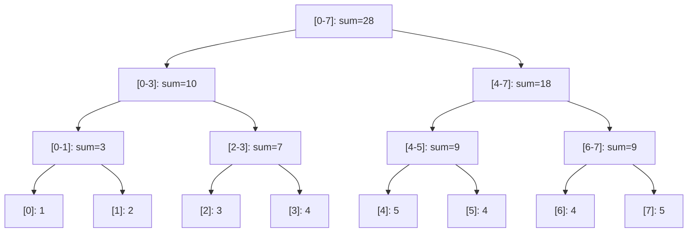

## Segment Tree

A segment tree is a binary tree data structure for storing information about intervals or segments.
It allows efficient range queries and point updates.

### Range Sum Query

```python
class SegmentTree:
    """
    Segment tree for range sum queries with point updates.
    Build: O(n)
    Point update: O(log n)
    Range query: O(log n)
    Space: O(4n)
    """
    def __init__(self, data):
        self.n = len(data)
        self.tree = [0] * (4 * self.n)
        self._build(data, 0, 0, self.n - 1)

    def _build(self, data, node, start, end):
        if start == end:
            self.tree[node] = data[start]
        else:
            mid = (start + end) // 2
            self._build(data, 2 * node + 1, start, mid)
            self._build(data, 2 * node + 2, mid + 1, end)
            self.tree[node] = self.tree[2 * node + 1] + self.tree[2 * node + 2]

    def update(self, idx, value):
        self._update(0, 0, self.n - 1, idx, value)

    def _update(self, node, start, end, idx, value):
        if start == end:
            self.tree[node] = value
        else:
            mid = (start + end) // 2
            if idx <= mid:
                self._update(2 * node + 1, start, mid, idx, value)
            else:
                self._update(2 * node + 2, mid + 1, end, idx, value)
            self.tree[node] = self.tree[2 * node + 1] + self.tree[2 * node + 2]

    def query(self, left, right):
        return self._query(0, 0, self.n - 1, left, right)

    def _query(self, node, start, end, left, right):
        if right < start or end < left:
            return 0
        if left <= start and end <= right:
            return self.tree[node]
        mid = (start + end) // 2
        left_sum = self._query(2 * node + 1, start, mid, left, right)
        right_sum = self._query(2 * node + 2, mid + 1, end, left, right)
        return left_sum + right_sum
```

### Range Min/Max Query

```python
class SegmentTreeMin:
    """
    Segment tree for range minimum queries with point updates.
    Build: O(n)
    Point update: O(log n)
    Range query: O(log n)
    Space: O(4n)
    """
    def __init__(self, data, neutral=float('inf')):
        self.n = len(data)
        self.neutral = neutral
        self.tree = [neutral] * (4 * self.n)
        self._build(data, 0, 0, self.n - 1)

    def _build(self, data, node, start, end):
        if start == end:
            self.tree[node] = data[start]
        else:
            mid = (start + end) // 2
            self._build(data, 2 * node + 1, start, mid)
            self._build(data, 2 * node + 2, mid + 1, end)
            self.tree[node] = min(self.tree[2 * node + 1], self.tree[2 * node + 2])

    def query(self, left, right):
        return self._query(0, 0, self.n - 1, left, right)

    def _query(self, node, start, end, left, right):
        if right < start or end < left:
            return self.neutral
        if left <= start and end <= right:
            return self.tree[node]
        mid = (start + end) // 2
        return min(
            self._query(2 * node + 1, start, mid, left, right),
            self._query(2 * node + 2, mid + 1, end, left, right)
        )

    def update(self, idx, value):
        self._update(0, 0, self.n - 1, idx, value)

    def _update(self, node, start, end, idx, value):
        if start == end:
            self.tree[node] = value
        else:
            mid = (start + end) // 2
            if idx <= mid:
                self._update(2 * node + 1, start, mid, idx, value)
            else:
                self._update(2 * node + 2, mid + 1, end, idx, value)
            self.tree[node] = min(self.tree[2 * node + 1], self.tree[2 * node + 2])
```

### Lazy Propagation

Lazy propagation allows efficient range updates by deferring updates to child nodes until they are
needed.

```python
class LazySegmentTree:
    """
    Segment tree with lazy propagation for range sum queries
    with range add updates.
    Build: O(n)
    Point update: O(log n)
    Range update: O(log n)
    Range query: O(log n)
    Space: O(4n)
    """
    def __init__(self, data):
        self.n = len(data)
        self.tree = [0] * (4 * self.n)
        self.lazy = [0] * (4 * self.n)
        self._build(data, 0, 0, self.n - 1)

    def _build(self, data, node, start, end):
        if start == end:
            self.tree[node] = data[start]
        else:
            mid = (start + end) // 2
            self._build(data, 2 * node + 1, start, mid)
            self._build(data, 2 * node + 2, mid + 1, end)
            self.tree[node] = self.tree[2 * node + 1] + self.tree[2 * node + 2]

    def _push_down(self, node, start, end):
        if self.lazy[node] != 0:
            mid = (start + end) // 2
            left_len = mid - start + 1
            right_len = end - mid
            self.tree[2 * node + 1] += self.lazy[node] * left_len
            self.lazy[2 * node + 1] += self.lazy[node]
            self.tree[2 * node + 2] += self.lazy[node] * right_len
            self.lazy[2 * node + 2] += self.lazy[node]
            self.lazy[node] = 0

    def range_update(self, left, right, value):
        self._range_update(0, 0, self.n - 1, left, right, value)

    def _range_update(self, node, start, end, left, right, value):
        if right < start or end < left:
            return
        if left <= start and end <= right:
            self.tree[node] += value * (end - start + 1)
            self.lazy[node] += value
            return
        self._push_down(node, start, end)
        mid = (start + end) // 2
        self._range_update(2 * node + 1, start, mid, left, right, value)
        self._range_update(2 * node + 2, mid + 1, end, left, right, value)
        self.tree[node] = self.tree[2 * node + 1] + self.tree[2 * node + 2]

    def range_query(self, left, right):
        return self._range_query(0, 0, self.n - 1, left, right)

    def _range_query(self, node, start, end, left, right):
        if right < start or end < left:
            return 0
        if left <= start and end <= right:
            return self.tree[node]
        self._push_down(node, start, end)
        mid = (start + end) // 2
        return (self._range_query(2 * node + 1, start, mid, left, right) +
                self._range_query(2 * node + 2, mid + 1, end, left, right))
```

### Iterative Segment Tree

```python
class IterativeSegmentTree:
    """
    Iterative segment tree — faster in practice due to no recursion overhead.
    Build: O(n)
    Point update: O(log n)
    Range query: O(log n)
    Space: O(2n)
    """
    def __init__(self, data):
        self.n = len(data)
        self.size = 1
        while self.size < self.n:
            self.size <<= 1
        self.tree = [0] * (2 * self.size)
        for i in range(self.n):
            self.tree[self.size + i] = data[i]
        for i in range(self.size - 1, 0, -1):
            self.tree[i] = self.tree[2 * i] + self.tree[2 * i + 1]

    def update(self, idx, value):
        idx += self.size
        self.tree[idx] = value
        idx >>= 1
        while idx >= 1:
            self.tree[idx] = self.tree[2 * idx] + self.tree[2 * idx + 1]
            idx >>= 1

    def query(self, left, right):
        left += self.size
        right += self.size
        result = 0
        while left <= right:
            if left % 2 == 1:
                result += self.tree[left]
                left += 1
            if right % 2 == 0:
                result += self.tree[right]
                right -= 1
            left >>= 1
            right >>= 1
        return result
```



## Fenwick Tree (Binary Indexed Tree)

A Fenwick tree (BIT) supports point updates and prefix sum queries in $O(\log n)$ time with less
memory and simpler code than a segment tree.

### How It Works

Each node at index $i$ stores the sum of a range of length `i & (-i)` (the lowest set bit of $i$).
This allows prefix sum queries by "climbing up" the tree and point updates by "adding" to all
relevant ranges.

```python
class FenwickTree:
    """
    Fenwick tree (Binary Indexed Tree) for prefix sums.
    Build: O(n log n) or O(n) with bulk construction
    Point update: O(log n)
    Prefix sum: O(log n)
    Range sum: O(log n) (two prefix sums)
    Space: O(n)
    """
    def __init__(self, n):
        self.n = n
        self.tree = [0] * (n + 1)

    def update(self, idx, delta):
        """Add delta to element at index idx (1-based). O(log n)."""
        idx += 1
        while idx <= self.n:
            self.tree[idx] += delta
            idx += idx & (-idx)

    def prefix_sum(self, idx):
        """Sum of elements [0, idx] (0-based). O(log n)."""
        idx += 1
        result = 0
        while idx > 0:
            result += self.tree[idx]
            idx -= idx & (-idx)
        return result

    def range_sum(self, left, right):
        """Sum of elements [left, right] (0-based). O(log n)."""
        return self.prefix_sum(right) - (self.prefix_sum(left - 1) if left > 0 else 0)

    def build(self, data):
        """Build from array in O(n)."""
        for i, val in enumerate(data):
            self.tree[i + 1] = val
        for i in range(1, self.n + 1):
            parent = i + (i & (-i))
            if parent <= self.n:
                self.tree[parent] += self.tree[i]
```

### Range Update + Point Query

```python
class FenwickTreeRangeUpdate:
    """
    Fenwick tree for range updates and point queries.
    Range update: O(log n)
    Point query: O(log n)
    Space: O(n)
    """
    def __init__(self, n):
        self.n = n
        self.tree = [0] * (n + 1)

    def range_add(self, left, right, delta):
        """Add delta to all elements in [left, right] (0-based)."""
        self._update(left, delta)
        self._update(right + 1, -delta)

    def _update(self, idx, delta):
        idx += 1
        while idx <= self.n:
            self.tree[idx] += delta
            idx += idx & (-idx)

    def point_query(self, idx):
        """Get value at index idx (0-based)."""
        idx += 1
        result = 0
        while idx > 0:
            result += self.tree[idx]
            idx -= idx & (-idx)
        return result
```

### 2D Fenwick Tree

```python
class FenwickTree2D:
    """
    2D Fenwick tree for prefix sums on a grid.
    Point update: O(log^2 n)
    Prefix sum: O(log^2 n)
    Space: O(n^2)
    """
    def __init__(self, rows, cols):
        self.rows = rows
        self.cols = cols
        self.tree = [[0] * (cols + 1) for _ in range(rows + 1)]

    def update(self, row, col, delta):
        r = row + 1
        while r <= self.rows:
            c = col + 1
            while c <= self.cols:
                self.tree[r][c] += delta
                c += c & (-c)
            r += r & (-r)

    def prefix_sum(self, row, col):
        result = 0
        r = row + 1
        while r > 0:
            c = col + 1
            while c > 0:
                result += self.tree[r][c]
                c -= c & (-c)
            r -= r & (-r)
        return result

    def range_sum(self, r1, c1, r2, c2):
        return (self.prefix_sum(r2, c2) - self.prefix_sum(r1 - 1, c2) -
                self.prefix_sum(r2, c1 - 1) + self.prefix_sum(r1 - 1, c1 - 1))
```

:::info

Fenwick trees are simpler and faster than segment trees for point updates and prefix sum queries.
Segment trees are more flexible: they support range min/max/gcd queries and range updates with lazy
propagation, which Fenwick trees cannot do (or do with more complexity). Choose based on your query
type.

:::

## Sparse Table

A sparse table answers range minimum queries (RMQ) in $O(1)$ time after $O(n \log n)$ preprocessing.
It cannot handle updates.

### Construction

```python
import math

class SparseTable:
    """
    Sparse table for Range Minimum Queries.
    Build: O(n log n)
    Query: O(1)
    Space: O(n log n)
    No updates supported.
    """
    def __init__(self, data):
        self.n = len(data)
        self.log = [0] * (self.n + 1)
        for i in range(2, self.n + 1):
            self.log[i] = self.log[i // 2] + 1
        self.k = self.log[self.n] + 1
        self.table = [[0] * self.n for _ in range(self.k)]
        self.table[0] = data[:]
        for j in range(1, self.k):
            for i in range(self.n - (1 << j) + 1):
                self.table[j][i] = min(
                    self.table[j - 1][i],
                    self.table[j - 1][i + (1 << (j - 1))]
                )

    def query(self, left, right):
        """RMQ on [left, right] in O(1)."""
        length = right - left + 1
        j = self.log[length]
        return min(self.table[j][left], self.table[j][right - (1 << j) + 1])
```

### Overlapping vs Non-Overlapping

The sparse table uses overlapping ranges for idempotent operations (min, max, gcd, bitwise AND/OR).
For non-idempotent operations (sum, product), use the non-overlapping variant with $O(\log n)$ query
time.

## Disjoint Set Union (Union-Find)

The disjoint set union (DSU) data structure maintains a partition of elements into disjoint sets,
supporting efficient union and find operations.

### With Path Compression and Union by Rank

```python
class DSU:
    """
    Disjoint Set Union with path compression and union by rank.
    Find: O(alpha(n)) amortised (inverse Ackermann)
    Union: O(alpha(n)) amortised
    Space: O(n)
    alpha(n) <= 4 for all practical n.
    """
    def __init__(self, n):
        self.parent = list(range(n))
        self.rank = [0] * n
        self.size = [1] * n

    def find(self, x):
        if self.parent[x] != x:
            self.parent[x] = self.find(self.parent[x])
        return self.parent[x]

    def union(self, x, y):
        px, py = self.find(x), self.find(y)
        if px == py:
            return False
        if self.rank[px] < self.rank[py]:
            px, py = py, px
        self.parent[py] = px
        self.size[px] += self.size[py]
        if self.rank[px] == self.rank[py]:
            self.rank[px] += 1
        return True

    def connected(self, x, y):
        return self.find(x) == self.find(y)

    def get_size(self, x):
        return self.size[self.find(x)]
```

### Offline Queries

DSU is powerful for offline queries where the connectivity of a graph changes over time (edges are
added in a specific order). Process edges in reverse order.

```python
def offline_connectivity(n, edges, queries):
    """
    Answer connectivity queries offline.
    edges: list of (u, v, time) — edge added at given time
    queries: list of (time, u, v) — connectivity query at given time
    Time: O((E + Q) * alpha(n))
    """
    dsu = DSU(n)
    results = [None] * len(queries)
    query_map = {}
    for i, (time, u, v) in enumerate(queries):
        if time not in query_map:
            query_map[time] = []
        query_map[time].append((i, u, v))

    edge_idx = 0
    sorted_edges = sorted(edges, key=lambda x: x[2])
    sorted_times = sorted(query_map.keys())

    for time in sorted_times:
        while edge_idx < len(sorted_edges) and sorted_edges[edge_idx][2] <= time:
            u, v, _ = sorted_edges[edge_idx]
            dsu.union(u, v)
            edge_idx += 1
        for i, u, v in query_map[time]:
            results[i] = dsu.connected(u, v)

    return results
```

### DSU on Tree (Sack)

DSU on tree is a technique for answering queries on subtrees efficiently. It processes subtrees from
smallest to largest, reusing the DSU structure.

```python
def dsu_on_tree(n, adj, queries):
    """
    Answer subtree queries using DSU on tree (small-to-large).
    Time: O(n log n) for most query types
    Space: O(n)
    queries: list of (node, query_type)
    """
    subtree_size = [0] * n
    big_child = [-1] * n
    parent = [0] * n
    order = []
    stack = [(0, True)]

    while stack:
        node, is_first_visit = stack.pop()
        if is_first_visit:
            stack.append((node, False))
            for child in adj[node]:
                if child != parent[node]:
                    parent[child] = node
                    stack.append((child, True))
        else:
            order.append(node)
            subtree_size[node] = 1
            for child in adj[node]:
                if child != parent[node]:
                    subtree_size[node] += subtree_size[child]
                    if big_child[node] == -1 or subtree_size[child] > subtree_size[big_child[node]]:
                        big_child[node] = child

    results = {}
    counter = {}

    def add_subtree(node, delta):
        counter[node] = counter.get(node, 0) + delta
        for child in adj[node]:
            if child != parent[node]:
                add_subtree(child, delta)

    def dfs(node, keep):
        for child in adj[node]:
            if child != parent[node] and child != big_child[node]:
                dfs(child, False)
        if big_child[node] != -1:
            dfs(big_child[node], True)
        for child in adj[node]:
            if child != parent[node] and child != big_child[node]:
                add_subtree(child, 1)
        counter[node] = counter.get(node, 0) + 1
        results[node] = len(counter)
        if not keep:
            add_subtree(node, -1)

    dfs(0, True)
    return results
```

## Lowest Common Ancestor (LCA)

### Binary Lifting

Precompute $2^k$-th ancestors for each node, allowing LCA queries in $O(\log n)$.

```python
class LCABinaryLifting:
    """
    LCA using binary lifting.
    Preprocess: O(n log n)
    Query: O(log n)
    Space: O(n log n)
    """
    def __init__(self, n, adj, root=0):
        self.n = n
        self.log = n.bit_length()
        self.up = [[-1] * n for _ in range(self.log)]
        self.depth = [0] * n
        self._bfs(adj, root)

    def _bfs(self, adj, root):
        from collections import deque
        q = deque([root])
        self.up[0][root] = root
        while q:
            u = q.popleft()
            for v in adj[u]:
                if v != self.up[0][u]:
                    self.up[0][v] = u
                    self.depth[v] = self.depth[u] + 1
                    q.append(v)
        for k in range(1, self.log):
            for v in range(self.n):
                if self.up[k - 1][v] != -1:
                    self.up[k][v] = self.up[k - 1][self.up[k - 1][v]]

    def lca(self, u, v):
        if self.depth[u] < self.depth[v]:
            u, v = v, u
        diff = self.depth[u] - self.depth[v]
        for k in range(self.log):
            if diff & (1 << k):
                u = self.up[k][u]
        if u == v:
            return u
        for k in range(self.log - 1, -1, -1):
            if self.up[k][u] != self.up[k][v]:
                u = self.up[k][u]
                v = self.up[k][v]
        return self.up[0][u]

    def distance(self, u, v):
        ancestor = self.lca(u, v)
        return self.depth[u] + self.depth[v] - 2 * self.depth[ancestor]

    def kth_ancestor(self, u, k):
        for bit in range(self.log):
            if k & (1 << bit):
                u = self.up[bit][u]
                if u == -1:
                    return -1
        return u
```

### Euler Tour + RMQ

```python
class LCAEulerTour:
    """
    LCA using Euler tour + sparse table RMQ.
    Preprocess: O(n log n)
    Query: O(1)
    Space: O(n log n)
    """
    def __init__(self, n, adj, root=0):
        self.euler = []
        self.depth_euler = []
        self.first = [-1] * n
        self._dfs(adj, root, -1, 0)
        self.st = SparseTable(self.depth_euler)

    def _dfs(self, adj, node, parent, depth):
        self.first[node] = len(self.euler)
        self.euler.append(node)
        self.depth_euler.append(depth)
        for child in adj[node]:
            if child != parent:
                self._dfs(adj, child, node, depth + 1)
                self.euler.append(node)
                self.depth_euler.append(depth)

    def lca(self, u, v):
        if self.first[u] > self.first[v]:
            u, v = v, u
        idx = self.st.query(self.first[u], self.first[v])
        return self.euler[idx]
```

## Heavy-Light Decomposition

Heavy-light decomposition splits a tree into paths to support efficient path queries.

```python
class HLD:
    """
    Heavy-Light Decomposition for path queries on trees.
    Preprocess: O(n)
    Path query: O(log^2 n) with segment tree
    Point update: O(log^2 n)
    Space: O(n)
    """
    def __init__(self, n, adj, values, root=0):
        self.n = n
        self.adj = adj
        self.size = [0] * n
        self.parent = [0] * n
        self.depth = [0] * n
        self.head = [0] * n
        self.pos = [0] * n
        self.current_pos = 0
        self._decompose(root, -1)
        self.seg = SegmentTree(self._reorder(values))

    def _decompose(self, root, parent):
        from collections import deque
        stack = [(root, parent, True)]
        order = []
        while stack:
            node, par, is_first = stack.pop()
            if is_first:
                self.parent[node] = par
                order.append(node)
                stack.append((node, par, False))
                children = [c for c in self.adj[node] if c != par]
                for child in reversed(children):
                    stack.append((child, node, True))
            else:
                self.size[node] = 1
                for child in self.adj[node]:
                    if child != par:
                        self.size[node] += self.size[child]

        self.head[root] = root
        self._dfs_hld(root, root)

    def _dfs_hld(self, node, h):
        self.head[node] = h
        self.pos[node] = self.current_pos
        self.current_pos += 1
        heavy = -1
        max_size = 0
        for child in self.adj[node]:
            if child != self.parent[node] and self.size[child] > max_size:
                max_size = self.size[child]
                heavy = child
        if heavy != -1:
            self._dfs_hld(heavy, h)
        for child in self.adj[node]:
            if child != self.parent[node] and child != heavy:
                self._dfs_hld(child, child)

    def _reorder(self, values):
        reordered = [0] * self.n
        for i in range(self.n):
            reordered[self.pos[i]] = values[i]
        return reordered

    def path_query(self, u, v):
        result = 0
        while self.head[u] != self.head[v]:
            if self.depth[self.head[u]] < self.depth[self.head[v]]:
                u, v = v, u
            result += self.seg.query(self.pos[self.head[u]], self.pos[u])
            u = self.parent[self.head[u]]
        if self.depth[u] > self.depth[v]:
            u, v = v, u
        result += self.seg.query(self.pos[u], self.pos[v])
        return result
```

## Merge Sort Tree

A merge sort tree stores sorted subarrays at each segment tree node, enabling range queries with
arbitrary functions (e.g., count elements less than $k$ in a range).

```python
class MergeSortTree:
    """
    Merge sort tree for range queries on sorted arrays.
    Build: O(n log n)
    Query (count less than k): O(log^2 n)
    Space: O(n log n)
    """
    def __init__(self, data):
        self.n = len(data)
        self.size = 1
        while self.size < self.n:
            self.size <<= 1
        self.tree = [[] for _ in range(2 * self.size)]
        for i in range(self.n):
            self.tree[self.size + i] = [data[i]]
        for i in range(self.size - 1, 0, -1):
            self.tree[i] = self._merge(self.tree[2 * i], self.tree[2 * i + 1])

    def _merge(self, a, b):
        result = []
        i = j = 0
        while i < len(a) and j < len(b):
            if a[i] <= b[j]:
                result.append(a[i])
                i += 1
            else:
                result.append(b[j])
                j += 1
        result.extend(a[i:])
        result.extend(b[j:])
        return result

    def count_less_than(self, left, right, k):
        """Count elements in [left, right] that are less than k. O(log^2 n)."""
        left += self.size
        right += self.size
        count = 0
        import bisect
        while left <= right:
            if left % 2 == 1:
                count += bisect.bisect_left(self.tree[left], k)
                left += 1
            if right % 2 == 0:
                count += bisect.bisect_left(self.tree[right], k)
                right -= 1
            left >>= 1
            right >>= 1
        return count
```

## Persistent Segment Tree

A persistent data structure preserves all previous versions. The persistent segment tree creates new
nodes only on the path that is modified, sharing unchanged subtrees with the previous version.

```python
class PersistentSegmentTree:
    """
    Persistent segment tree for range sum queries.
    Update: O(log n) — creates new version
    Query on any version: O(log n)
    Space: O(n log n) for n updates
    """
    def __init__(self, data):
        self.n = len(data)
        self.roots = [None]
        self.nodes = []
        self.roots[0] = self._build(data, 0, self.n - 1)

    def _new_node(self, left, right, value):
        self.nodes.append([left, right, value])
        return len(self.nodes) - 1

    def _build(self, data, start, end):
        if start == end:
            return self._new_node(-1, -1, data[start])
        mid = (start + end) // 2
        left = self._build(data, start, mid)
        right = self._build(data, mid + 1, end)
        return self._new_node(left, right, self.nodes[left][2] + self.nodes[right][2])

    def update(self, version, idx, delta):
        new_root = self._update(self.roots[version], 0, self.n - 1, idx, delta)
        self.roots.append(new_root)
        return len(self.roots) - 1

    def _update(self, node, start, end, idx, delta):
        if start == end:
            return self._new_node(-1, -1, self.nodes[node][2] + delta)
        mid = (start + end) // 2
        if idx <= mid:
            left = self._update(self.nodes[node][0], start, mid, idx, delta)
            right = self.nodes[node][1]
        else:
            left = self.nodes[node][0]
            right = self._update(self.nodes[node][1], mid + 1, end, idx, delta)
        return self._new_node(left, right, self.nodes[left][2] + self.nodes[right][2])

    def query(self, version, left, right):
        return self._query(self.roots[version], 0, self.n - 1, left, right)

    def _query(self, node, start, end, left, right):
        if right < start or end < left:
            return 0
        if left <= start and end <= right:
            return self.nodes[node][2]
        mid = (start + end) // 2
        return (self._query(self.nodes[node][0], start, mid, left, right) +
                self._query(self.nodes[node][1], mid + 1, end, left, right))
```

## Mo's Algorithm

Mo's algorithm answers offline range queries on an array by sorting queries in a special order and
processing them with a sliding window.

```python
def mos_algorithm(arr, queries):
    """
    Mo's algorithm for offline range queries.
    Time: O((n + q) * sqrt(n) * cost_per_add_remove)
    Space: O(n + q)
    queries: list of (left, right, index)
    Returns: results in original query order
    """
    import math
    n = len(arr)
    block_size = int(math.sqrt(n)) + 1

    sorted_queries = sorted(queries, key=lambda x: (
        x[0] // block_size,
        x[1] if (x[0] // block_size) % 2 == 0 else -x[1]
    ))

    curr_left = 0
    curr_right = -1
    freq = {}
    distinct = 0
    results = [0] * len(queries)

    for left, right, idx in sorted_queries:
        while curr_left > left:
            curr_left -= 1
            freq[arr[curr_left]] = freq.get(arr[curr_left], 0) + 1
            if freq[arr[curr_left]] == 1:
                distinct += 1
        while curr_right < right:
            curr_right += 1
            freq[arr[curr_right]] = freq.get(arr[curr_right], 0) + 1
            if freq[arr[curr_right]] == 1:
                distinct += 1
        while curr_left < left:
            freq[arr[curr_left]] -= 1
            if freq[arr[curr_left]] == 0:
                distinct -= 1
            curr_left += 1
        while curr_right > right:
            freq[arr[curr_right]] -= 1
            if freq[arr[curr_right]] == 0:
                distinct -= 1
            curr_right -= 1
        results[idx] = distinct

    return results
```

:::tip

Mo's algorithm with Hilbert curve ordering achieves $O(n \sqrt{q})$ regardless of the number of
blocks, compared to the standard $O((n+q)\sqrt{n})$. The Hilbert curve maps 2D coordinates to 1D in
a way that preserves locality better than block-based sorting.

:::

## Comparison Table

| Data Structure          | Build         | Query                   | Update         | Notes                                         |
| ----------------------- | ------------- | ----------------------- | -------------- | --------------------------------------------- |
| Segment tree            | $O(n)$        | $O(\log n)$             | $O(\log n)$    | Flexible, lazy propagation                    |
| Fenwick tree            | $O(n)$        | $O(\log n)$             | $O(\log n)$    | Simpler, prefix sums only                     |
| Sparse table            | $O(n \log n)$ | $O(1)$                  | N/A            | Static, no updates                            |
| DSU                     | $O(n)$        | $O(\alpha(n))$          | $O(\alpha(n))$ | Union-find only                               |
| LCA (binary lifting)    | $O(n \log n)$ | $O(\log n)$             | N/A            | Static tree                                   |
| LCA (Euler + RMQ)       | $O(n \log n)$ | $O(1)$                  | N/A            | Static tree                                   |
| HLD + segment tree      | $O(n)$        | $O(\log^2 n)$           | $O(\log^2 n)$  | Path queries on tree                          |
| Merge sort tree         | $O(n \log n)$ | $O(\log^2 n)$           | N/A            | Static, sorted subarrays                      |
| Persistent segment tree | $O(n \log n)$ | $O(\log n)$             | $O(\log n)$    | Version history, $O(\log n)$ space per update |
| Mo's algorithm          | N/A           | $O(\sqrt{n})$ amortised | N/A            | Offline only                                  |

## Common Pitfalls

### 1. Segment Tree Indexing

The most common bug in segment tree implementations is incorrect indexing. The children of node `i`
are `2*i+1` and `2*i+2` (0-based). For iterative segment trees, the leaf nodes start at index `size`
(the next power of 2). Off-by-one errors in the query boundaries are also extremely common — always
test with single-element queries and full-range queries.

### 2. Fenwick Tree 1-based vs 0-based

Fenwick trees are inherently 1-based. If your array is 0-based, you must add 1 to all indices
internally. Forgetting this offset produces incorrect results. The `update` function should accept
0-based indices and convert internally.

### 3. Lazy Propagation Not Pushed Down

When querying a node in a lazy segment tree, you must push down any pending lazy values to its
children before recursing. Forgetting to push down results in stale values being used. The push-down
order matters: parent must be pushed before children are queried.

### 4. Sparse Table Cannot Handle Updates

Sparse tables are static — they cannot handle point updates or range updates. If you need updates,
use a segment tree or Fenwick tree. Attempting to "update" a sparse table by recomputing affected
entries is $O(n \log n)$ per update, which defeats the purpose.

### 5. DSU Path Compression Without Union by Rank

Path compression alone gives $O(\log n)$ amortised per operation. Union by rank alone gives
$O(\log n)$ amortised. Together, they give $O(\alpha(n))$ amortised where $\alpha$ is the inverse
Ackermann function. Always use both.

### 6. HLD Query Edge Cases

In HLD, when querying a path, the loop condition `head[u] != head[v]` must handle the case where one
node is an ancestor of the other. After the loop, `u` and `v` are on the same heavy path, and the
remaining query is a simple segment tree range query. Forgetting the final segment query produces
incorrect results.

### 7. Mo's Algorithm Block Size

The optimal block size for Mo's algorithm is $\sqrt{n}$ for most query types. However, if the
add/remove operation is expensive, a larger block size may be better. The "Hilbert order" variant of
Mo's algorithm does not require choosing a block size and achieves better theoretical bounds.

### 8. Persistent Segment Tree Memory

Each update in a persistent segment tree creates $O(\log n)$ new nodes. After $n$ updates, the total
number of nodes is $O(n \log n)$. If you are creating many versions, pre-allocate the node array to
avoid frequent memory allocations. In Python, using a list of tuples or a flat array is more
memory-efficient than a list of objects.
