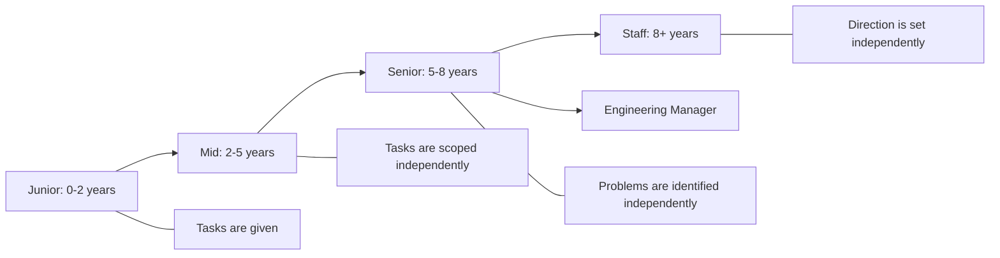

## Systems Engineering Career Paths

### SRE (Site Reliability Engineering)

SRE sits at the intersection of software engineering and operations. The role was formalized by
Google and has since become one of the most in-demand roles in tech.

**Core competencies:**

- Service Level Objectives (SLOs) and error budgets
- Incident management and post-mortems
- Capacity planning and performance engineering
- Automation (Infrastructure as Code, CI/CD)
- Monitoring, alerting, and observability
- System design for reliability and scalability

**Day-to-day work:**

- Writing code to automate operational tasks
- Designing and maintaining monitoring systems
- Responding to incidents and performing root cause analysis
- Reviewing system designs for reliability risks
- Participating in on-call rotations

### Platform Engineering

Platform engineering builds internal developer platforms that abstract infrastructure complexity:

- **Platform as a Product:** The platform team treats developers as customers.
- **Self-service infrastructure:** Developers provision resources without filing tickets.
- **Golden paths:** Opinionated, pre-configured stacks that are secure, compliant, and
  production-ready.

**Key skills:**

- Kubernetes and container orchestration
- Infrastructure as Code (Terraform, Pulumi)
- Service mesh and API gateway design
- Developer experience (DX) design
- Cost optimization and FinOps

### Infrastructure Engineering

Infrastructure engineers design, build, and operate the physical and virtual infrastructure that
supports applications:

- Network design (data center, WAN, cloud interconnects)
- Storage systems (SAN, NAS, object storage, databases)
- Compute platforms (bare metal, VMs, containers)
- Security infrastructure (firewalls, WAF, IAM, PKI)
- Data center operations (power, cooling, rack management)

### Database Engineering

Database engineers specialize in data storage, retrieval, and optimization:

- Relational databases (PostgreSQL, MySQL, CockroachDB)
- NoSQL databases (MongoDB, Cassandra, DynamoDB)
- Time-series databases (InfluxDB, TimescaleDB, Prometheus)
- Search engines (Elasticsearch, OpenSearch)
- Data modeling, query optimization, and replication

### Security Engineering

Security engineers protect systems from threats:

- Application security (code review, penetration testing)
- Infrastructure security (network segmentation, hardening, compliance)
- Cloud security (IAM policies, encryption, audit logging)
- Incident response and forensics
- Security architecture and threat modeling

---

## Interview Preparation

### System Design Interviews

System design interviews evaluate your ability to design scalable, reliable systems. The interviewer
gives you a high-level requirement (e.g., "Design a URL shortener") and expects you to work through
the design from requirements to implementation.

**Framework:**

1. **Clarify requirements.** Functional (what must it do?) and non-functional (scale, latency,
   availability, consistency).
2. **Estimate scale.** How many users? How many requests per second? How much data?
3. **Define the API.** Key endpoints, data models, and contracts.
4. **Design the high-level architecture.** Components, data flow, and communication patterns.
5. **Deep-dive into 2–3 components.** Choose the most interesting or complex parts.
6. **Address non-functional requirements.** Caching, partitioning, replication, failover.
7. **Discuss trade-offs.** Every design decision has trade-offs. Explain them.

**Common system design topics:**

- Distributed key-value store
- URL shortener
- Chat system
- News feed
- File storage (like S3)
- Search engine
- Notification system
- Rate limiter

### Coding Interviews

For systems engineering roles, coding interviews focus on practical programming skills:

- **Data structures:** Arrays, hash maps, trees, graphs, heaps, tries
- **Algorithms:** BFS/DFS, binary search, sorting, dynamic programming, two pointers, sliding window
- **Concurrency:** Mutexes, channels, thread pools, producer-consumer
- **Networking:** Socket programming, HTTP parsing, TCP implementation

**Preparation resources:**

- LeetCode (focus on medium difficulty, 100–200 problems)
- "Designing Data-Intensive Applications" by Martin Kleppmann (essential reading)
- "System Design Interview" by Alex Xu
- Grokking the System Design Interview

### Behavioral Interviews (STAR Method)

The STAR method structures your answers:

| Component     | Description           | Example                                                                                                     |
| ------------- | --------------------- | ----------------------------------------------------------------------------------------------------------- |
| **S**ituation | Set the context       | "We were running a database with 500 GB of data on a single node."                                          |
| **T**ask      | What you needed to do | "I was tasked with migrating to a sharded setup to handle 10x growth."                                      |
| **A**ction    | What you did          | "I designed a consistent hashing scheme, implemented the sharding layer in Go, and ran a canary migration." |
| **R**esult    | What happened         | "The migration completed in 2 weeks with zero downtime. Query latency improved by 60%."                     |

**Common behavioral questions:**

- Tell me about a time you dealt with a production incident.
- Describe a conflict with a colleague and how you resolved it.
- Tell me about a time you made a technical decision that turned out to be wrong.
- Describe a system you designed that you are proud of.
- Tell me about a time you had to learn a new technology quickly.

---

## Resume and CV Best Practices

### Structure

```markdown
# Your Name

email@example.com | github.com/yourusername | linkedin.com/in/yourusername

## Summary

2-3 sentences describing who you are, what you do, and what you are looking for.

## Experience

### Senior Systems Engineer — Company (2022–Present)

- Achieved X by doing Y, resulting in Z (quantify everything)
- Led the migration from X to Y, reducing costs by 40%
- Designed and built a monitoring system that reduced MTTR from 4 hours to 30 minutes

### Systems Engineer — Company (2019–2022)

- Managed a fleet of 200+ Linux servers across 3 data centers
- Automated infrastructure provisioning with Terraform, reducing deployment time from days to hours

## Skills

- **Languages:** Go, Python, Bash, Rust
- **Infrastructure:** Kubernetes, Terraform, AWS, ZFS, Linux
- **Databases:** PostgreSQL, Redis, Prometheus
- **Tools:** Git, Docker, CI/CD, Prometheus, Grafana

## Education

B.S. Computer Science — University (2019)
```

### Key Principles

1. **Quantify everything.** "Managed servers" is weak. "Managed 200+ production servers across 3
   data centers with 99.99% uptime" is strong.
2. **Lead with impact.** What did you achieve, not what you were responsible for.
3. **Tailor to the role.** Emphasize the skills and experience most relevant to the position.
4. **One page for early career, two pages maximum for experienced.** Recruiters spend an average of
   7.4 seconds on an initial resume scan.
5. **Use action verbs.** Designed, built, deployed, optimized, automated, reduced, increased,
   migrated.

---

## Networking

### Conferences and Meetups

| Conference  | Focus                        | Location            |
| ----------- | ---------------------------- | ------------------- |
| KubeCon     | Cloud native, Kubernetes     | Rotating global     |
| SREcon      | Site reliability engineering | Rotating global     |
| LISA        | Systems administration       | Rotating (USENIX)   |
| DevOps Days | DevOps culture and practices | Global, many cities |
| Ceph Day    | Distributed storage          | Various             |
| LinuxCon    | Linux kernel and ecosystem   | Rotating            |

### Online Communities

- **Reddit:** r/sysadmin, r/devops, r/sre, r/kubernetes, r/homelab
- **Discord:** Kubernetes, Terraform, CNCF, various language-specific servers
- **Slack:** Kubernetes, Cloud Native, DevOps
- **Mailing lists:** LKML (Linux Kernel), OpenZFS, distro-specific lists

### Building Professional Relationships

1. **Contribute to open source.** Your code speaks louder than your resume.
2. **Write and publish.** Blog posts, technical talks, and documentation build your reputation.
3. **Attend events.** Even virtual conferences provide networking opportunities.
4. **Be helpful.** Answer questions on Stack Overflow, GitHub issues, and community forums.
5. **Maintain relationships.** Follow up with people you meet. Offer help when you can.

---

## Salary Negotiation

### Principles

1. **Know your market value.** Use Levels.fyi, Glassdoor, Blind, and industry salary surveys to
   research compensation for your role, location, and experience level.
2. **Never give a number first.** If asked for your salary expectations, defer: "I am open to a
   competitive offer based on the responsibilities of the role. What is the budget for this
   position?"
3. **Negotiate the total package.** Salary is one component. Consider equity, signing bonus, annual
   bonus, relocation, remote work allowance, and vacation.
4. **Be willing to walk away.** The best negotiation leverage is having alternatives. Continue
   interviewing until you have multiple offers.
5. **Get everything in writing.** Verbal promises are not enforceable. Ensure the offer letter
   includes all negotiated terms.

### Compensation Structure

| Component             | Negotiable | Typical Range                 |
| --------------------- | ---------- | ----------------------------- |
| Base salary           | Yes        | 70–80% of total compensation  |
| Equity (RSUs/options) | Sometimes  | 10–25% of total               |
| Signing bonus         | Yes        | 5–15% of base, often one-time |
| Annual bonus          | Sometimes  | 5–20% of base                 |
| Relocation            | Yes        | If applicable                 |
| Title                 | Yes        | May affect future comp        |

---

## Startups vs. Big Tech

| Factor            | Startup                            | Big Tech                           |
| ----------------- | ---------------------------------- | ---------------------------------- |
| Scope             | Broad (wear many hats)             | Narrow (deep specialization)       |
| Impact            | Direct, visible                    | Indirect, distributed              |
| Learning          | Fast, breadth-heavy                | Structured, depth-focused          |
| Stability         | Lower                              | Higher                             |
| Compensation      | Lower base, higher equity upside   | Higher base, predictable equity    |
| Career growth     | Title inflation, but fewer mentors | Clear ladder, extensive mentorship |
| Work-life balance | Often poor                         | Varies (some teams are good)       |

**Recommendation:** Start in big tech if possible to learn best practices, then move to a startup
for broader experience — or vice versa. The ideal path depends on your risk tolerance, career goals,
and life stage.

---

## Remote Work

### Making Remote Work Effective

1. **Create a dedicated workspace.** A separate room is ideal. A dedicated desk with a door you can
   close is the minimum.
2. **Maintain a routine.** Start work at the same time, take breaks at the same time, end work at
   the same time. The lack of commute makes boundaries blurry — enforce them.
3. **Over-communicate.** In a remote setting, nobody can see what you are working on. Write detailed
   status updates, document your decisions, and communicate proactively.
4. **Invest in equipment.** A good monitor, keyboard, webcam, microphone, and chair pay for
   themselves in productivity and comfort.
5. **Socialize intentionally.** Remote work can be isolating. Schedule virtual coffee chats,
   participate in team social events, and maintain non-work relationships.

---

## Continuous Learning

### Certifications

| Certification                                     | Provider                     | Focus                 | Difficulty | Industry Recognition |
| ------------------------------------------------- | ---------------------------- | --------------------- | ---------- | -------------------- |
| AWS Solutions Architect (Professional)            | Amazon                       | Cloud architecture    | High       | Very High            |
| GCP Professional Cloud Architect                  | Google                       | Cloud architecture    | High       | High                 |
| CKAD (Certified Kubernetes Application Developer) | CNCF                         | Kubernetes apps       | Moderate   | High                 |
| CKA (Certified Kubernetes Administrator)          | CNCF                         | Kubernetes admin      | Moderate   | High                 |
| RHCE (Red Hat Certified Engineer)                 | Red Hat                      | Linux administration  | Moderate   | High                 |
| LPIC-2                                            | Linux Professional Institute | Linux engineering     | Moderate   | Moderate             |
| CompTIA Security+                                 | CompTIA                      | Security fundamentals | Low        | Moderate             |
| OCP (Oracle Certified Professional)               | Oracle                       | Oracle database       | High       | High                 |

Certifications are most valuable early in your career (they signal baseline knowledge to recruiters)
or when transitioning to a new domain. They are less valuable than demonstrated experience.

### Technical Blogging

Blogging forces you to clarify your understanding and builds your professional brand:

- **Platform:** Personal blog (Hugo, Astro), Dev.to, Hashnode, Medium
- **Topics:** Deep dives into problems you solved, tutorials for tools you use, opinion pieces on
  industry trends
- **Frequency:** 1–2 posts per month is sustainable
- **Quality over quantity.** One well-researched, technically accurate post is worth more than four
  shallow listicles.

### Mentorship

- **Find a mentor.** A senior engineer who has the career you want. Ask for 30-minute conversations
  monthly. Come with specific questions.
- **Be a mentor.** Teaching is the best way to learn. Mentoring junior engineers reinforces your own
  knowledge and develops leadership skills.
- **Seek feedback.** Regularly ask your manager and peers: "What is one thing I could do differently
  to be more effective?"

---

## Career Progression

### Individual Contributor (IC) Track

```
Junior Engineer → Mid Engineer → Senior Engineer → Staff Engineer → Principal Engineer → Distinguished Engineer → Fellow
```

IC progression is measured by:

- **Scope of impact:** A junior engineer impacts a team; a staff engineer impacts an organization.
- **Technical depth:** Deeper expertise in specific domains.
- **Autonomy:** Less direction needed from management.
- **Mentorship:** Teaching and guiding more junior engineers.
- **Influence:** Shaping technical direction through design reviews, RFCs, and architectural
  decisions.

### Management Track

```
Senior Engineer → Tech Lead → Engineering Manager → Director → VP of Engineering → CTO
```

The transition to management is a career change, not a promotion. You trade technical depth for
breadth:

- **People management:** Hiring, performance reviews, career development, conflict resolution.
- **Project management:** Planning, prioritization, stakeholder management.
- **Strategic planning:** Setting technical direction, budgeting, headcount planning.

**Before becoming a manager, consider:**

- Do you enjoy helping others grow more than solving technical problems yourself?
- Are you comfortable with less hands-on coding?
- Can you handle the emotional labor of managing people?

### T-Shaped Skills

A T-shaped engineer has deep expertise in one area (the vertical bar) and broad knowledge across
many areas (the horizontal bar). Systems engineers should aim for:

- **Deep:** One specialization (e.g., distributed storage, networking, Kubernetes, security)
- **Broad:** Working knowledge of Linux, networking, databases, containers, CI/CD, monitoring,
  programming (at least one language), and cloud platforms

---

## Common Pitfalls

### Staying Too Long in One Role

Comfort is the enemy of growth. If you have been in the same role for 3+ years and are no longer
learning, it is time to move on — either to a new team, a new company, or a new domain.

### Neglecting Soft Skills

Technical skills get you the job; soft skills get you promoted. Communication, collaboration,
mentoring, and influence are all more important at senior levels than the ability to write code.

### Not Negotiating

Accepting the first offer without negotiation leaves money on the table. The difference between a
negotiated and non-negotiated offer can be 10–20% of total compensation, compounded over years.

### Chasing Titles Over Skills

A "Senior" title at one company may not equate to "Senior" at another. Focus on building skills and
delivering impact — the title will follow. Conversely, do not accept a title demotion when changing
companies without a compelling reason (e.g., transitioning to a much larger company).

### Ignoring Work-Life Balance

Burnout is not a badge of honor. Chronic overwork reduces cognitive performance, increases error
rates, and shortens your career. Set boundaries, take vacations, and invest in your health. A
40-year career requires sustainable pacing.

## SRE Career Path Deep Dive

### SRE Daily Responsibilities

| Activity    | Time Allocation | Description                                |
| ----------- | --------------- | ------------------------------------------ |
| On-call     | 20–30%          | Incident response, paging, post-mortems    |
| Engineering | 40–50%          | Writing automation, improving reliability  |
| Design      | 10–15%          | System architecture, capacity planning     |
| Reviews     | 10–15%          | Code review, design review, runbook review |

### SRE Skills Progression

**Junior SRE (0–2 years):**

- Follow established runbooks for incident response
- Write basic automation scripts (Python, Bash)
- Participate in on-call rotations with a mentor
- Learn monitoring tools (Prometheus, Grafana)
- Write post-mortems with guidance

**Mid-level SRE (2–5 years):**

- Improve existing monitoring and alerting
- Design and implement new services with reliability in mind
- Lead incident response and write post-mortems independently
- Contribute to SLO definition and tracking
- Mentor junior SREs

**Senior SRE (5+ years):**

- Define SLOs and error budgets for services
- Design multi-service distributed systems
- Lead cross-team reliability initiatives
- Influence organizational reliability culture
- Mentor mid-level SREs

**Staff+ SRE (8+ years):**

- Set reliability strategy across the organization
- Make build-vs-buy decisions for reliability tooling
- Influence industry practices (conference talks, blog posts)
- Build and lead SRE teams

### SRE Interview Questions

**System Design:**

- "Design a URL shortening service that handles 100K RPS with 99.99% availability."
- "Design a real-time analytics pipeline that processes 1M events per second."
- "Design a key-value store with strong consistency."

**Coding:**

- Implement a distributed rate limiter in Go.
- Write a load balancer that uses least-connections algorithm.
- Implement a consistent hash ring with virtual nodes.

**Behavioral:**

- "Tell me about a time you were on-call and received multiple pages simultaneously."
- "How do you balance reliability with feature velocity?"

## Platform Engineering Deep Dive

### Platform Engineering vs. DevOps vs. SRE

| Aspect   | DevOps                | SRE                | Platform Engineering                    |
| -------- | --------------------- | ------------------ | --------------------------------------- |
| Focus    | CI/CD pipelines       | Reliability        | Developer experience                    |
| Customer | Operations team       | Product team       | Development team                        |
| Output   | Deployment automation | SLOs, monitoring   | Internal developer platform             |
| Metric   | Deployment frequency  | Error budget, MTTR | Developer satisfaction, deployment time |
| Scope    | Single application    | All services       | All developers                          |

### Platform Engineering Skills

1. **Kubernetes expertise:** Deep knowledge of Kubernetes architecture, operators, and custom
   controllers.
2. **Infrastructure as Code:** Terraform, Pulumi, Crossplane for provisioning.
3. **Developer experience design:** CLI tools, documentation, templates, onboarding flows.
4. **Security integration:** RBAC, secrets management, network policies, compliance.
5. **Cost optimization:** FinOps, resource right-sizing, reserved instances.

## Interview Preparation Deep Dive

### System Design Framework

Use this framework for any system design question:

1. **Requirements gathering:** Functional, non-functional, scale, constraints.
2. **Capacity estimation:** Users, RPS, data volume, storage.
3. **High-level design:** Components, data flow, communication patterns.
4. **Deep dive 1:** Database selection, schema design, indexing strategy.
5. **Deep dive 2:** Caching strategy, CDN, cache invalidation.
6. **Deep dive 3:** Message queue, async processing, event sourcing.
7. **Reliability:** Redundancy, failover, monitoring, alerting.
8. **Security:** Authentication, authorization, encryption, rate limiting.
9. **Scalability:** Horizontal scaling, sharding, load balancing.
10. **Trade-offs:** Discuss what you would do differently with more time/resources.

### Coding Interview Preparation

For systems engineering roles, focus on:

- **Data structures:** Hash maps, trees, heaps, graphs, linked lists.
- **Algorithms:** BFS/DFS, binary search, two pointers, sliding window, topological sort.
- **Concurrency:** Mutexes, channels, thread pools, read-write locks, wait groups.
- **Networking:** TCP/UDP, HTTP/HTTPS, REST vs. gRPC, DNS.
- **Distributed systems:** Consensus (Raft, Paxos), CAP theorem, vector clocks.

### STAR Method Examples

**Situation:** "Our production database was experiencing 5-second latency spikes every 15 minutes."

**Task:** "I was responsible for diagnosing and fixing the issue."

**Action:** "I correlated the spikes with the backup schedule using Prometheus metrics. The backup
was saturating the I/O bandwidth. I proposed and implemented incremental backups with WAL archiving,
reducing the I/O impact by 90%."

**Result:** "Database latency dropped to a consistent 2 ms p99. The backup still completes within
the maintenance window."

## Salary Negotiation Deep Dive

### Researching Market Rates

| Source           | URL           | Accuracy                           |
| ---------------- | ------------- | ---------------------------------- |
| Levels.fyi       | levels.fyi    | High (self-reported, verified)     |
| Glassdoor        | glassdoor.com | Medium (self-reported, unverified) |
| Blind            | teamblind.com | High (verified employees)          |
| BuiltIn          | builtin.com   | Medium                             |
| Industry surveys | Various       | Medium                             |

### Negotiation Tactics

1. **Defer to the recruiter.** Let them name the number first.
2. **Anchor high.** Based on your research, state a range that starts above your target.
3. **Justify with data.** "Based on my research and the scope of the role, I'm targeting a base
   salary of $X. Here are the data points I used..."
4. **Negotiate the total package.** Salary + equity + signing bonus + annual bonus + benefits.
5. **Use competing offers.** If you have multiple offers, use them as leverage.
6. **Be willing to walk away.** The best leverage is the ability to say no.

### Equity Evaluation

| Component                     | How to Evaluate                  | Risk                            |
| ----------------------------- | -------------------------------- | ------------------------------- |
| RSUs (Restricted Stock Units) | Number of shares x current price | Price can go down               |
| Stock options                 | Strike price vs. exercise price  | May never be in the money       |
| Vesting schedule              | 4-year cliff vs. graded vesting  | Company may not survive 4 years |
| Liquidity                     | Public vs. private company       | Private equity is illiquid      |

## Continuous Learning Paths

### Certification Roadmaps

**Cloud (AWS):**

1. AWS Cloud Practitioner (foundational)
2. AWS Solutions Architect Associate
3. AWS Solutions Architect Professional
4. AWS DevOps Engineer Professional

**Cloud (GCP):**

1. Google Cloud Digital Leader
2. Google Associate Cloud Engineer
3. Google Professional Cloud Architect
4. Google Professional DevOps Engineer

**Kubernetes (CNCF):**

1. CKA (Certified Kubernetes Administrator)
2. CKAD (Certified Kubernetes Application Developer)
3. CKS (Certified Kubernetes Security Specialist)

**Linux:**

1. CompTIA Linux+ (LPIC-1 equivalent)
2. LPIC-2
3. RHCE (Red Hat Certified Engineer)

### Building Expertise (T-Shaped Skills)

**Depth (vertical bar):** Choose one specialization and develop deep expertise:

- Distributed systems
- Network engineering
- Database engineering
- Security engineering
- Container orchestration

**Breadth (horizontal bar):** Develop working knowledge across all areas:

- Linux administration
- Networking (TCP/IP, HTTP, DNS, TLS)
- Databases (SQL, NoSQL, time-series)
- Containers (Docker, Kubernetes)
- CI/CD (GitHub Actions, Jenkins, GitLab CI)
- Monitoring (Prometheus, Grafana, ELK)
- Security (TLS, RBAC, firewalls, OWASP)
- Scripting (Python, Bash, Go)

### Technical Blogging Strategy

1. **Write about what you learn.** A blog post is the best way to solidify understanding.
2. **Publish regularly.** 1–2 posts per month is sustainable.
3. **Cross-post to platforms.** Dev.to, Hashnode, and Medium for reach.
4. **Include code examples.** Readers want to see how to do it, not just read about it.
5. **Be honest about what you don't know.** Transparency builds credibility.

## Career Transitions

### IC to Management

Before making the transition:

1. **Are you motivated by technical or people problems?** Management is about people.
2. **Can you handle the emotional labor?** Managing people is emotionally draining.
3. **Do you have mentorship experience?** If not, start mentoring now.
4. **Are you prepared for less coding?** Managers write less code and attend more meetings.
5. **Have you discussed with your manager?** They can provide guidance and opportunities.

### Startup to Big Tech

| Factor               | Startup                | Big Tech            |
| -------------------- | ---------------------- | ------------------- |
| Role breadth         | Very broad             | Narrow              |
| Impact visibility    | High                   | Low                 |
| Compensation ceiling | Higher (equity upside) | Lower (predictable) |
| Stability            | Lower                  | Higher              |
| Learning             | Fast, breadth-heavy    | Slow, depth-focused |
| Brand recognition    | Low                    | High                |
| Resume value         | Project-based          | Company-based       |

### Remote Work Best Practices

1. **Over-communicate in writing.** In remote settings, if it is not written down, it did not
   happen.
2. **Maintain visible availability.** Update your calendar, status, and Slack presence.
3. **Async by default.** Default to written communication; use meetings only when necessary.
4. **Document everything.** Runbooks, ADRs, and READMEs are more important in remote teams.
5. **Invest in social interaction.** Virtual coffee chats and team events prevent isolation.

## Common Pitfalls (Extended)

### The Title Inflation Trap

A "Senior" title at a 10-person startup is not equivalent to "Senior" at Google. Focus on building
skills and delivering impact, not collecting titles. Your portfolio and demonstrated ability matter
more than titles when switching companies.

### Not Building a Professional Network Before You Need It

Networking is most effective when done proactively, not reactively. Start attending meetups,
contributing to open source, and building professional relationships before you need a job referral.
A network built under pressure is obvious and less effective.

### Stagnating at One Company

Staying at one company for 5+ years can be valuable for depth, but it limits exposure to different
approaches, technologies, and team dynamics. If you have been at the same company for 5+ years and
are no longer learning, it may be time to move on.

## SRE Daily Responsibilities

Understanding what Site Reliability Engineering (SRE) looks like day-to-day helps you decide whether
it is the right career path and prepare accordingly.

### A Typical SRE Day

| Time Block            | Activity                                                   | Percentage of Day |
| --------------------- | ---------------------------------------------------------- | ----------------- |
| Morning (1-2h)        | Incident review, triage overnight alerts, check dashboards | 15%               |
| Mid-morning (2-3h)    | Project work (infrastructure code, automation)             | 30%               |
| Afternoon (1-2h)      | Code reviews, design reviews, meetings                     | 20%               |
| Late afternoon (1-2h) | On-call preparation, runbook updates, documentation        | 15%               |
| Ad-hoc (variable)     | Incident response, debugging production issues             | 20%               |

### SRE vs DevOps vs Platform Engineering

| Dimension    | SRE                               | DevOps                           | Platform Engineering               |
| ------------ | --------------------------------- | -------------------------------- | ---------------------------------- |
| Origin       | Google (2003)                     | Cultural movement (2009)         | Evolution of DevOps (2020+)        |
| Focus        | Reliability, SLAs, toil reduction | Collaboration, automation, CI/CD | Developer experience, self-service |
| Error budget | Explicit (SLI/SLO/SLA)            | Implicit                         | Team-specific                      |
| On-call      | Yes, primary responsibility       | Shared with dev teams            | Rarely (focus on building)         |
| Key skills   | Capacity planning, postmortems    | Automation, monitoring           | API design, developer portals      |
| Career path  | Senior SRE, Staff SRE, Principal  | DevOps Engineer, Lead            | Platform Engineer, Architect       |

### Key SRE Skills to Develop

1. **SLI/SLO/SLA design:** Define measurable reliability targets and build alerting around them.
2. **Incident management:** Lead incident response, write blameless postmortems, drive action items.
3. **Capacity planning:** Forecast resource needs based on growth trends and seasonal patterns.
4. **Toil identification and reduction:** Automate repetitive operational tasks.
5. **Progressive rollouts:** Implement canary deploys, feature flags, and automated rollbacks.

## Skills Progression Framework

### Junior to Senior to Staff



### Competency Matrix

| Competency      | Junior                       | Mid                                  | Senior                                | Staff                                   |
| --------------- | ---------------------------- | ------------------------------------ | ------------------------------------- | --------------------------------------- |
| Technical scope | Single component             | Multiple components                  | System-wide                           | Organization-wide                       |
| Problem solving | Given a bug, fix it          | Given an error, diagnose root cause  | Given a symptom, identify the problem | Given a trend, prevent the problem      |
| Communication   | Updates status when asked    | Proactively communicates blockers    | Drives cross-team alignment           | Influences org-wide technical direction |
| Mentorship      | Receives mentorship          | Mentors juniors on technical tasks   | Mentors mid-level engineers on career | Mentors senior engineers and leads      |
| Decision making | Follows established patterns | Evaluates options within known space | Makes architectural decisions         | Makes strategic technology bets         |

### Demonstrating Seniority Without Title

You do not need a senior title to demonstrate senior-level skills. Evidence includes:

- **Writing design documents** for features before implementing them.
- **Identifying and fixing systemic issues** (e.g., "every deploy breaks staging because...")
- **Mentoring teammates** through code reviews and pair programming.
- **Improving team processes** (e.g., setting up CI, writing runbooks, creating onboarding docs).
- **Communicating trade-offs clearly** in discussions with product and management.

## Interview Preparation Deep Dive

### Systems Design Interview Framework

Most systems design interviews for infrastructure roles follow this structure:

1. **Clarify requirements (5 min):** Ask about scale, latency requirements, consistency needs, and
   budget constraints.
2. **Define scope (2 min):** Agree on what is in scope and what is out of scope.
3. **High-level design (10 min):** Draw the major components and their interactions.
4. **Deep dive (20 min):** Pick 2-3 components and design them in detail. Discuss data models, APIs,
   and failure modes.
5. **Wrap-up (5 min):** Summarize, discuss trade-offs, and mention what you would improve with more
   time.

### Common Systems Design Questions

- Design a distributed key-value store.
- Design a monitoring system that handles 1 million metrics per second.
- Design a CI/CD pipeline for a monorepo with 500 microservices.
- Design a configuration management system for 10,000 servers.
- Design a rate limiter for an API gateway.

### Behavioral Interview Preparation (STAR Method)

Structure answers using **Situation, Task, Action, Result**:

- **Situation:** Set the context. "We had a production outage affecting 5% of users."
- **Task:** Define your responsibility. "I was the on-call engineer responsible for triage."
- **Action:** Describe what you did. "I identified the root cause as a misconfigured connection
  pool, implemented a fix, and updated the runbook to prevent recurrence."
- **Result:** Quantify the outcome. "Restored service in 23 minutes. The updated runbook reduced
  mean time to resolution for similar incidents from 45 to 15 minutes."

### Salary Negotiation Deep Dive

#### Know Your Market Value

Research compensation for your role, level, and location before any negotiation:

- **Levels.fyi:** Aggregated salary data by company and level.
- **Glassdoor:** Self-reported salaries, useful for smaller companies.
- **Blind:** Anonymous salary discussions, higher variance but honest.
- **Recruiter outreach:** If recruiters are contacting you, note the salary ranges they mention.

#### Negotiation Tactics

1. **Never accept the first offer.** There is almost always room. A polite "I was expecting
   something closer to $X based on my research" is standard.
2. **Negotiate total compensation, not just base salary.** Equity, signing bonus, annual bonus, and
   benefits can be negotiated independently.
3. **Use competing offers.** "I have another offer at $Y. Can you match it?" is effective and
   expected.
4. **Delay salary discussion until you have an offer.** Do not provide salary expectations early. "I
   would like to learn more about the role before discussing compensation" is acceptable.
5. **Get everything in writing.** Verbal promises about future raises, title changes, or equity
   refreshes are not enforceable.

#### Evaluating Equity

```bash
# Calculate the value of stock options
# Inputs:
SHARES=10000
STRIKE_PRICE=2.50
CURRENT_PRICE=15.00
VESTING_YEARS=4
CLIFF_MONTHS=12
ANNUAL_REFRESH=0.10  # 10% annual refresh

# Current value (if fully vested)
TOTAL_VALUE=$(echo "$SHARES * ($CURRENT_PRICE - $STRIKE_PRICE)" | bc)
echo "Total equity value: \$$TOTAL_VALUE"

# Per-year value (ignoring refresh)
YEARLY_VALUE=$(echo "$TOTAL_VALUE / $VESTING_YEARS" | bc)
echo "Per-year equity value: \$$YEARLY_VALUE"

# Consider: strike price, vesting schedule, tax implications, liquidity
# RSUs are simpler (no strike price, taxed as income at vest)
# Options have more upside but more complexity
```

## Certification Roadmaps

Certifications can accelerate career progression, particularly when transitioning between companies
or domains. They are not a substitute for experience, but they signal commitment and provide
structured learning paths.

### Linux and Infrastructure

| Certification | Issuer                       | Difficulty   | Value                  |
| ------------- | ---------------------------- | ------------ | ---------------------- |
| LPIC-1        | Linux Professional Institute | Beginner     | Foundation             |
| LPIC-2        | Linux Professional Institute | Intermediate | Operations roles       |
| RHCSA         | Red Hat                      | Intermediate | Enterprise Linux roles |
| RHCE          | Red Hat                      | Advanced     | Senior Linux roles     |
| LFCS          | Linux Foundation             | Intermediate | Cloud-native roles     |
| CKA           | CNCF/Kubernetes              | Intermediate | Kubernetes admin       |
| CKAD          | CNCF/Kubernetes              | Intermediate | Kubernetes developer   |
| CKS           | CNCF/Kubernetes              | Advanced     | Kubernetes security    |

### Cloud

| Certification                     | Issuer    | Difficulty   | Value                  |
| --------------------------------- | --------- | ------------ | ---------------------- |
| AWS Solutions Architect Associate | Amazon    | Intermediate | Cloud roles            |
| AWS DevOps Engineer Professional  | Amazon    | Advanced     | AWS-specific DevOps    |
| GCP Cloud Engineer                | Google    | Intermediate | GCP roles              |
| Azure Administrator               | Microsoft | Intermediate | Enterprise/Azure roles |
| Terraform Associate               | HashiCorp | Intermediate | IaC roles              |

### Study Approach

1. **Use official study guides** as the primary resource.
2. **Hands-on practice is non-negotiable.** Set up a lab environment and practice every objective.
3. **Take practice exams** to identify weak areas. Aim for 80%+ on practice exams before scheduling.
4. **Space your study over 4-8 weeks.** Cramming does not work for certification exams that test
   practical skills.

## T-Shaped Skills Development

A T-shaped professional has deep expertise in one area (the vertical bar) and broad knowledge across
many areas (the horizontal bar). This combination is particularly valuable in systems engineering,
where deep specialization must be balanced with the ability to understand and work with adjacent
systems.

### Building the Vertical (Deep Expertise)

Pick one domain and go deeper than most people:

- **Storage:** ZFS internals, filesystem design, distributed storage systems (Ceph, MinIO).
- **Networking:** TCP/IP stack, BGP, SDN, service mesh architecture.
- **Compute:** CPU microarchitecture, container runtimes, virtualization (KVM, Firecracker).
- **Observability:** Distributed tracing, metrics pipelines, anomaly detection.
- **Security:** Cryptography, PKI, zero-trust architecture, compliance frameworks.

### Building the Horizontal (Broad Knowledge)

For each area outside your deep expertise, aim for "conversational competence":

- You can explain what the technology does and when to use it.
- You can read and understand documentation and configuration.
- You can collaborate effectively with specialists in that area.
- You can make informed decisions about when to use it vs. alternatives.

### Skills Inventory Exercise

List every technology you have worked with and rate yourself honestly:

```
Technology       | Depth | Breadth | Last Used
-----------------|-------|---------|----------
Linux            | 5/5   | 5/5     | Today
Kubernetes       | 4/5   | 4/5     | This week
PostgreSQL       | 4/5   | 3/5     | Last month
Networking       | 3/5   | 4/5     | Last month
Go               | 3/5   | 2/5     | Last quarter
Rust             | 2/5   | 1/5     | Last year
```

Review this inventory quarterly. Identify gaps between where you are and where you want to be.

## Career Transitions

### Systems Engineering to Cloud Architecture

This is the most common career transition for senior systems engineers. Key steps:

1. **Get hands-on cloud experience.** Deploy and manage real workloads on AWS/GCP/Azure. A personal
   project with real traffic is more convincing than any certification.
2. **Study for one cloud certification.** AWS SA Associate or GCP Cloud Engineer provides structured
   learning and a recognizable credential.
3. **Learn Infrastructure as Code.** Terraform and Pulumi are table stakes for cloud architecture
   roles.
4. **Understand cost modeling.** Cloud architects must justify infrastructure spending. Learn to
   calculate TCO and optimize for cost.

### Systems Engineering to Engineering Management

Not all senior engineers should become managers. Before making this transition:

- **Try it first.** Lead a small project or mentor a team of 2-3 people before committing.
- **Understand the trade-off.** You will write less code and spend more time in meetings, 1:1s, and
  planning. Some people find this deeply rewarding; others find it frustrating.
- **Read "The Manager's Path" by Camille Fournier.** It is the best guide for this specific
  transition.
- **Talk to engineering managers.** Ask them what their day-to-day is like and what surprised them
  about the role.

### Systems Engineering to Security

Security engineering is a high-demand specialization for systems engineers. Transition path:

1. **Study the fundamentals:** Cryptography, network security, authentication protocols.
2. **Practice offensive security:** CTF competitions, Hack The Box, TryHackMe.
3. **Pursue certifications:** CompTIA Security+, OSCP, CISSP (requires 5 years experience).
4. **Contribute to security tooling:** Open-source security tools welcome contributions and provide
   visible expertise.

### The Non-Linear Career

Your career does not have to follow a straight line. Some of the most effective senior engineers
have backgrounds in customer support, technical writing, QA, or IT operations. Diverse experience
provides perspective that purely technical career paths lack. The most important thing is to keep
learning and keep building things.
