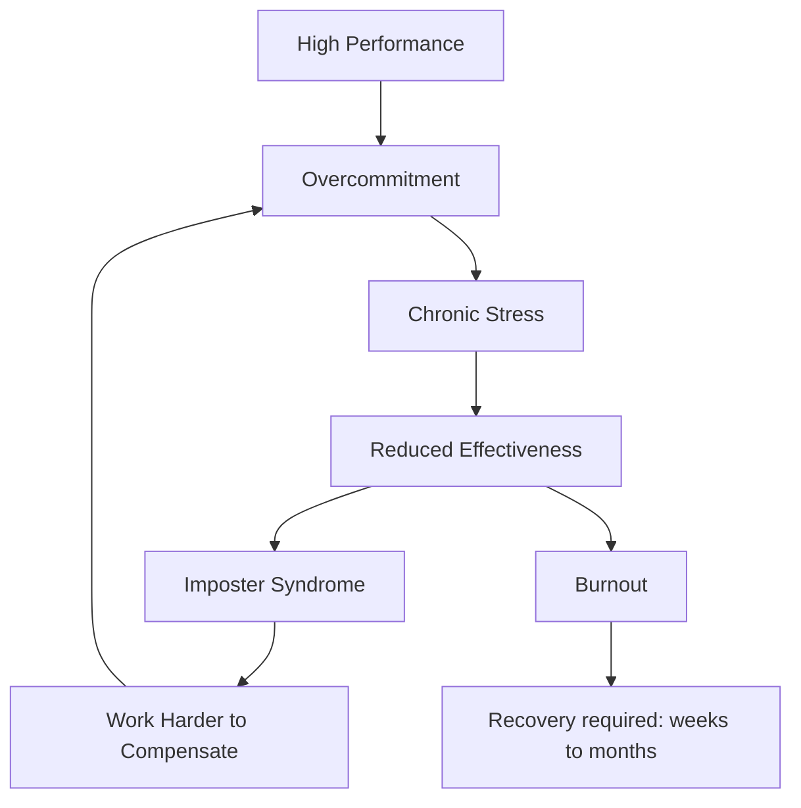

## Time Management

### The Pomodoro Technique

The Pomodoro Technique breaks work into 25-minute focused intervals (pomodoros) separated by
5-minute breaks, with a longer 15–30 minute break every 4 pomodoros. This structure:

1. Creates a sense of urgency — 25 minutes is short enough to maintain focus
2. Prevents burnout — regular breaks maintain cognitive performance
3. Makes work measurable — you can count pomodoros to estimate task size
4. Reduces context switching — commit to one task per pomodoro

**Implementation for developers:**

- Use a terminal timer: `pomotodo`, `tomato`, or `tmux` timer plugin
- During a pomodoro: code, debug, write tests, read documentation. One task.
- During a break: stand up, stretch, look away from the screen. Do not context-switch to a different
  task.
- If interrupted, abandon the pomodoro and start a new one. A broken pomodoro does not count.

### Time Blocking

Time blocking assigns specific time slots to specific tasks. This prevents the reactive mode where
you spend the entire day responding to Slack messages and pull request reviews.

**Daily template for a systems engineer:**

| Time Block  | Activity                              | Duration |
| ----------- | ------------------------------------- | -------- |
| 8:00–9:00   | Planning, email, Slack triage         | 60 min   |
| 9:00–11:30  | Deep work (coding, debugging, design) | 150 min  |
| 11:30–12:00 | Code review, team communication       | 30 min   |
| 12:00–13:00 | Lunch                                 | 60 min   |
| 13:00–15:00 | Deep work (continued)                 | 120 min  |
| 15:00–15:30 | Break, walk                           | 30 min   |
| 15:30–17:00 | Meetings, documentation, planning     | 90 min   |

### Deep Work

Cal Newport's concept of "Deep Work" — cognitively demanding tasks performed in a state of
distraction-free concentration — is the most valuable skill for a knowledge worker.

**Rules for deep work:**

1. Schedule deep work blocks in advance. Treat them as non-negotiable appointments.
2. Eliminate all notifications during deep work. Phone on silent, notification-free desktop.
3. Work in a consistent environment (same desk, same time) to build a ritual.
4. Have a clear objective for each deep work session (not just "work on the project").
5. Track deep work hours weekly. Aim for 3–4 hours per day minimum.

---

## Note-Taking Systems

### Zettelkasten

The Zettelkasten (slip-box) method, developed by sociologist Niklas Luhmann, organizes knowledge as
a network of atomic notes:

1. **Literature notes:** Brief summaries of what you read (one per source).
2. **Permanent notes:** Atomic ideas written in your own words, each with a unique identifier.
3. **Structure notes:** Maps of related permanent notes (index, topic overview).
4. **Reference notes:** The original source material.

Each permanent note should contain exactly one idea, written as if it will be read by someone else.
Link notes to related notes using bidirectional links. Over time, the network of notes surfaces
unexpected connections and generates new insights.

### PARA Method

Tiago Forte's PARA method organizes digital information into four categories:

| Category  | Description                   | Lifespan   |
| --------- | ----------------------------- | ---------- |
| Projects  | Active goals with a deadline  | Short-term |
| Areas     | Ongoing responsibilities      | Long-term  |
| Resources | Topics of interest            | Ongoing    |
| Archives  | Inactive items from the above | Reference  |

Apply PARA to your note-taking system, file system, and task management. The key insight is that
everything is either active (Projects, Areas) or reference (Resources, Archives).

### Second Brain

A "second brain" is an external system for capturing, organizing, and retrieving information. The
tool matters less than the system. Options include:

| Tool     | Strengths                                         | Best For                       |
| -------- | ------------------------------------------------- | ------------------------------ |
| Obsidian | Local-first, bidirectional links, plugins         | Zettelkasten, technical notes  |
| Logseq   | Outliner-based, daily journals, graph view        | Daily notes, meeting notes     |
| Notion   | Database-backed, collaboration, templates         | Team wikis, project management |
| Org-mode | Emacs-native, literate programming, TODO tracking | Emacs users, developers        |
| Joplin   | Open source, Markdown, E2EE                       | Privacy-focused users          |

---

## Learning Strategies

### Spaced Repetition

Spaced repetition exploits the spacing effect — information is retained better when review is spaced
over increasing intervals. Tools like Anki automate this process.

For technical learning, create flashcards for:

- Command-line flags and options
- API signatures and parameters
- System architecture diagrams (as cloze deletions)
- Error codes and their meanings
- Configuration options and their effects

### The Feynman Technique

Named after Richard Feynman, this technique tests understanding by explaining a concept in simple
terms:

1. Choose a concept to learn.
2. Explain it as if teaching someone with no background in the topic.
3. Identify gaps in your explanation — these are areas you do not fully understand.
4. Go back to the source material and fill the gaps.
5. Simplify your explanation further. Use analogies.

This is particularly effective for systems engineering topics (ZFS architecture, TCP/IP handshake,
memory management) where the ability to explain the concept clearly indicates genuine understanding.

### Deliberate Practice

Deliberate practice for software engineering means:

1. **Define a specific skill to improve** (e.g., debugging kernel panics, writing SQL queries,
   designing REST APIs).
2. **Break the skill into components** and practice each component individually.
3. **Get immediate feedback** — use linters, type checkers, code review, and benchmarks.
4. **Push beyond your comfort zone** — attempt problems slightly harder than your current ability.
5. **Maintain focused practice sessions** — 60–90 minutes of concentrated effort is more effective
   than 4 hours of distracted work.

---

## Documentation Habits

### README-First Development

Write the README before writing the code. The README defines:

1. What the project does (one paragraph)
2. Why it exists (problem statement)
3. How to install and run it
4. How to configure it
5. How to test it
6. How to contribute

A clear README forces you to think about the user experience and API design before committing to
implementation.

### Architecture Decision Records (ADRs)

ADRs document significant architectural decisions:

```markdown
# ADR-001: Use PostgreSQL instead of MySQL

## Status

Accepted

## Context

We need a relational database for the application. PostgreSQL and MySQL are both viable options.

## Decision

We will use PostgreSQL because it provides:

- Better JSON support (JSONB type with indexing)
- Advanced indexing (GIN, GiST, BRIN)
- Extension ecosystem (PostGIS, pgvector)
- Better compliance with SQL standards

## Consequences

- Team needs PostgreSQL expertise (training required)
- AWS RDS PostgreSQL is slightly more expensive than MySQL
- JSONB queries are significantly faster than MySQL's JSON
```

ADRs provide a decision trail that prevents revisiting the same debate repeatedly and helps new team
members understand why the system is designed the way it is.

### Runbooks

A runbook documents operational procedures for common and critical tasks:

- How to deploy the application
- How to roll back a deployment
- How to respond to an alert (e.g., "database connection pool exhausted")
- How to scale the system up or down
- How to recover from a disaster

Runbooks reduce incident response time and prevent knowledge silos.

---

## Communication

### Technical Writing Principles

1. **Lead with the conclusion.** State the most important information first, then provide context.
   Busy engineers skim. If the conclusion is buried in paragraph 4, it will be missed.
2. **Use precise language.** "The API is slow" is vague. "The `/users` endpoint has a p99 latency of
   2.3 seconds, exceeding our 500 ms SLO" is actionable.
3. **Include evidence.** Claims should be supported by data, logs, or reproducible steps.
4. **Structure for scanning.** Use headings, bullet points, tables, and code blocks. Dense
   paragraphs are hard to parse.
5. **Know your audience.** An RFC for the backend team reads differently from a status update for
   the VP of Engineering.

### Code Review Best Practices

**For reviewers:**

- Review for correctness, not style (automate style with linters).
- Explain why something is wrong, not just what is wrong.
- Distinguish blocking issues from suggestions ("Nit: consider using `const`" vs. "Bug: off-by-one
  error in loop").
- Approve promptly. A PR sitting in review for 3 days is a bottleneck.

**For authors:**

- Keep PRs small (under 400 lines of meaningful change). Large PRs are harder to review and more
  likely to have bugs.
- Write a clear PR description: what changed, why, how to test, screenshots if applicable.
- Self-review before requesting review. Run lint, typecheck, and tests.
- Respond to feedback promptly and iterate.

---

## Health

### Ergonomics

- **Monitor height:** Top of the screen at or slightly below eye level. Use a monitor arm or laptop
  stand.
- **Keyboard and mouse:** Elbows at 90 degrees, wrists neutral (not bent up or down). Consider a
  split keyboard (Kinesis, ErgoDox) if you experience wrist pain.
- **Chair:** Lumbar support, feet flat on the floor, thighs parallel to the ground.
- **Desk height:** Forearms should be parallel to the floor when typing.
- **Lighting:** Avoid screen glare. Use bias lighting (light behind the monitor) to reduce eye
  strain.

### Eye Strain Prevention

The 20-20-20 rule: every 20 minutes, look at something 20 feet away for 20 seconds. This relaxes the
ciliary muscles that focus the lens for near vision.

Additional measures:

- Use a dark theme in your editor and terminal (reduces luminance).
- Match screen brightness to ambient light.
- Increase font size — 13–16 pt for body text, 12–14 pt for code.
- Use a blue light filter in the evening (f.lux, Night Shift, or the monitor's built-in filter).

### RSI Prevention

Repetitive Strain Injury is the most common occupational hazard for software engineers:

- Take breaks every 30–60 minutes (the Pomodoro technique helps).
- Stretch your wrists, shoulders, and neck during breaks.
- Use keyboard shortcuts to reduce mouse usage.
- If you feel pain, stop and rest. RSI is easier to prevent than to treat.
- Consider voice-to-text (Whisper, macOS Dictation) for non-coding writing tasks.

### Exercise

Regular exercise improves cognitive function, mood, and energy levels:

- **Minimum:** 150 minutes of moderate aerobic activity per week (30 minutes, 5 days).
- **Strength training:** 2–3 sessions per week. Upper body strength is particularly important for
  preventing posture-related pain.
- **Walking:** Even a 15-minute walk after lunch improves afternoon cognitive performance.

---

## Focus Tools

### Notification Management

Notifications are the enemy of deep work. Manage them aggressively:

1. **Disable all push notifications** on your phone except calls and SMS from specific contacts.
2. **Use Do Not Disturb** during deep work blocks (macOS Focus, Windows Focus Assist).
3. **Batch email and Slack checks** to 2–3 scheduled times per day, not continuous.
4. **Use status messages** ("In deep work until 11:30") to set expectations.
5. **Turn off notification badges** on Slack and email apps.

### Website Blockers

For periods when you need maximum focus:

- **Cold Turkey** (Windows): Blocks websites and applications completely.
- **Freedom** (cross-platform): Blocks distracting websites across all devices.
- **LeechBlock** (browser extension): Blocks specific sites during scheduled times.

---

## Building a Learning Curriculum

### Approach

1. **Assess your current skills** honestly. What are your strengths and gaps?
2. **Define your target role** (SRE, platform engineer, backend developer) and identify the skills
   required.
3. **Prioritize based on leverage.** What skill, if improved, would have the biggest impact on your
   effectiveness?
4. **Allocate learning time** — 5–10 hours per week, scheduled in your calendar.
5. **Use a mix of resources:** books for depth, video courses for breadth, hands-on projects for
   retention.

### Reading Technical Papers

For systems engineering, key papers to read:

- Google's "Borg, Omega, and Kubernetes" papers
- Amazon's "Dynamo" paper
- Raft consensus paper (Ongaro and Ousterhout)
- MapReduce (Dean and Ghemawat)
- The ZFS paper (Bonwick and Moore)

Use a paper reading strategy:

1. Read the abstract, introduction, and conclusion first.
2. Skim the figures and tables.
3. Read the methodology and results in detail.
4. Write a summary note (Feynman technique).

---

## Avoiding Burnout

### Warning Signs

- Dreading work in the morning
- Decreasing code quality despite normal effort
- Cynicism about projects and colleagues
- Physical symptoms (insomnia, headaches, irritability)
- Inability to concentrate despite adequate sleep

### Mitigation Strategies

1. **Set boundaries.** Work hours are work hours. After hours, disconnect.
2. **Take real vacations.** Not "working from the beach." Actual time off.
3. **Exercise regularly.** Physical activity is the most effective burnout prevention tool.
4. **Talk to someone.** A manager, mentor, or therapist. Burnout thrives in isolation.
5. **Rotate responsibilities.** If you are stuck on the same project for 18 months, request a
   rotation or a side project.

---

## Common Pitfalls

### Context Switching

Every context switch (Slack message, email ping, quick question) has a cognitive cost. Research
estimates it takes 10–25 minutes to fully refocus after an interruption. Three interruptions per
hour can consume 50% of your productive time. Defend your deep work time aggressively.

### The "I Will Learn It Later" Trap

There is no later. If something is worth learning, schedule it now. The half-life of technical
knowledge is short, and the skills you defer learning today will be more expensive to learn tomorrow
when you actually need them.

### Note-Taking Without Reviewing

Capturing information without reviewing it is not learning — it is hoarding. Schedule weekly review
sessions where you revisit your notes, reorganize them, and identify gaps. Spaced repetition tools
like Anki automate the review process.

### Measuring Productivity by Hours

Hours spent at the keyboard is a poor proxy for productivity. A focused 4-hour deep work session
produces more output than 8 hours of distracted, reactive work. Measure outcomes (code shipped, bugs
fixed, designs completed) not input (hours, lines of code, commits).

## Advanced Time Management Techniques

### The Eisenhower Matrix

Dwight Eisenhower's decision matrix categorizes tasks by urgency and importance:

|                   | Urgent                                  | Not Urgent                              |
| ----------------- | --------------------------------------- | --------------------------------------- |
| **Important**     | Do (crises, deadlines)                  | Schedule (strategic planning, learning) |
| **Not Important** | Delegate (interruptions, some meetings) | Eliminate (time wasters, busywork)      |

Most knowledge workers spend the majority of their time on urgent-not-important tasks (responding to
Slack, attending unnecessary meetings). The goal is to shift time toward important-not-urgent tasks
(deep work, learning, planning).

### Time Blocking with Calendars

Implement time blocking using your calendar:

1. **Block 2–4 hours of deep work** every morning. Do not allow meetings during this time.
2. **Batch meetings** into afternoons (1–3 PM). Do not schedule meetings before 11 AM.
3. **Block administrative tasks** (email, Slack, code review) into specific 30-minute windows.
4. **Block learning time** (reading, courses, experimentation) at least once per week.
5. **Block buffer time** between meetings (5–10 minutes) to prevent back-to-back meetings.

### The Two-Minute Rule

From David Allen's "Getting Things Done":

If a task takes less than two minutes, do it immediately. Do not add it to your todo list, your
calendar, or your project management tool. The overhead of tracking a two-minute task exceeds the
time it takes to just do it.

This rule prevents small tasks from accumulating and becoming mental clutter.

## Advanced Note-Taking Techniques

### Atomic Notes

The core unit in Zettelkasten is the atomic note — a single idea expressed in your own words. Rules
for atomic notes:

1. **One idea per note.** If a note covers two ideas, split it.
2. **Write in your own words.** Do not copy-paste from sources. Paraphrasing forces understanding.
3. **Include context.** Why does this matter? How does it relate to what you already know?
4. **Link to related notes.** Create bidirectional links using `[[note-id]]` syntax.
5. **Add source references.** Link back to the original material.

### Link Types in Knowledge Graphs

| Link Type      | Syntax                       | Purpose                                |
| -------------- | ---------------------------- | -------------------------------------- |
| Unidirectional | `[[note-id]]`                | Simple reference                       |
| Bidirectional  | Automatic in Obsidian/Logseq | Creates connections in both directions |
| Contextual     | `[[note-id#section]]`        | Reference to a specific section        |
| Embed          | `![[note-id]]`               | Transclude content inline              |
| Tag            | `#tag`                       | Categorization                         |

### Building a Second Brain Workflow

1. **Capture:** When you encounter useful information, capture it immediately. Use a quick note app,
   email draft, or voice memo. Do not rely on memory.
2. **Organize:** Process your captures weekly. Move them to the appropriate PARA category.
3. **Distill:** Transform raw captures into atomic notes written in your own words.
4. **Connect:** Link related notes together. Look for patterns and insights.
5. **Express:** Use your notes to create output (blog posts, documentation, presentations).

## Advanced Learning Strategies

### Spaced Repetition with Anki

For technical learning, create Anki decks with:

- **Basic cards:** Front/back for factual recall (command flags, API parameters).
- **Cloze deletion cards:** "The MESI protocol states: [cache line] is in Modified state when
  [condition]."
- **Image occlusion cards:** Label diagrams (CPU architecture, network stack, ZFS pool layout).

**Anki configuration for technical learning:**

- **New cards per day:** 10–20
- **Reviews per day:** 50–100 (increases over time)
- **Interval modifier:** 1.20 (aggressive spacing for faster learning)
- **Maximum interval:** 365 days

### Deliberate Practice for Programming

Structure your practice sessions:

1. **Choose a specific skill** (e.g., "writing concurrent Go code").
2. **Find a problem at the edge of your ability** (not too easy, not impossible).
3. **Work on it for 60–90 minutes** without distractions.
4. **Get feedback immediately** (run tests, use a linter, ask a reviewer).
5. **Reflect on what you learned** (what worked, what didn't, what to practice next).

**Practice resources:**

- **LeetCode:** Algorithmic problem solving (medium difficulty).
- **Exercism:** Language-specific practice with mentor mode.
- **CodeWars:** Short challenges with community solutions.
- **Advent of Code:** Annual programming puzzles (December).
- **Project Euler:** Mathematical/computational problems.

### Technical Book Reading Strategy

Reading a technical book cover-to-cover is inefficient. Use this approach:

1. **Scan the table of contents.** Identify the 3–5 chapters most relevant to your goals.
2. **Read those chapters first, in depth.** Take notes, write code, build examples.
3. **Skim the remaining chapters.** Understand the high-level concepts without diving into details.
4. **Apply what you learned.** Build a small project that uses the concepts.
5. **Teach what you learned.** Write a blog post or give a talk.

## Communication for Systems Engineers

### Writing Effective Runbooks

A good runbook follows this structure:

1. **Title:** Clear, searchable, descriptive.
2. **Symptoms:** What does the user see? What alerts fire?
3. **Diagnosis:** Step-by-step instructions to identify the root cause.
4. **Resolution:** Step-by-step instructions to fix the issue.
5. **Verification:** How to confirm the fix worked.
6. **Prevention:** How to prevent recurrence.
7. **Escalation:** When to escalate and to whom.

### Writing Architecture Decision Records (ADRs)

ADR template:

```markdown
# ADR-NNN: [Title]

## Status

[Proposed | Accepted | Deprecated | Superseded by ADR-NNN]

## Context

[Why are we making this decision? What is the problem?]

## Decision

[What did we decide?]

## Consequences

[What are the positive and negative outcomes?]
```

## Health and Ergonomics Deep Dive

### Monitor Setup

The ideal monitor setup for long coding sessions:

| Configuration                | Recommendation                                         |
| ---------------------------- | ------------------------------------------------------ |
| Primary monitor              | 27–32 inch, 4K, IPS, 60 Hz+                            |
| Secondary monitor (optional) | Same as primary, rotated 90° for documentation         |
| Monitor distance             | 50–70 cm (20–28 inches) from eyes                      |
| Monitor height               | Top of screen at or slightly below eye level           |
| Monitor arm                  | Adjustable height, tilt, and rotation                  |
| Brightness                   | Match ambient light (use bias lighting behind monitor) |

### Keyboard Ergonomics

For preventing RSI:

1. **Split keyboards** (Kinesis, ErgoDox) reduce ulnar deviation.
2. **Low-actuation-force switches** (35–45 g) reduce finger strain.
3. **Wrist rests** for the keyboard and mouse.
4. **Keyboard tray** to maintain neutral wrist position (not bent up or down).
5. **Take breaks** every 30–60 minutes (Pomodoro technique).

### Exercise for Desk Workers

A simple routine for desk workers (15 minutes, no equipment):

1. **Neck rolls:** 10 rotations in each direction (1 minute).
2. **Shoulder shrugs:** 15 shrugs with 5-second hold (2 minutes).
3. **Cat-cow stretches:** 10 repetitions (1 minute).
4. **Wrist circles:** 10 rotations in each direction per wrist (2 minutes).
5. **Standing desk alternating:** Stand for 30 minutes, sit for 60 minutes.
6. **Walking breaks:** 5-minute walk every 90 minutes.
7. **Eye exercises:** 20-20-20 rule plus eye rolling (1 minute).

## Building a Learning Curriculum

### Monthly Learning Plan Template

| Week   | Topic            | Resource                   | Output            |
| ------ | ---------------- | -------------------------- | ----------------- |
| Week 1 | ZFS architecture | Documentation + blog posts | Lab setup         |
| Week 2 | ZFS in practice  | TrueNAS setup              | Pool design doc   |
| Week 3 | ZFS performance  | ARC tuning guide           | Benchmark results |
| Week 4 | ZFS recovery     | Scrub/repair procedures    | Runbook           |

### Quarterly Review

Every quarter, review your learning:

1. What skills did I plan to learn?
2. What did I actually learn?
3. What gaps remain?
4. What should I focus on next quarter?
5. What resources were most effective?

## Burnout Prevention Strategies

### Energy Management vs. Time Management

Time management assumes all hours are equal. Energy management recognizes that your cognitive
capacity varies throughout the day and week:

- **Peak hours:** Schedule deep work during your most productive hours (usually morning).
- **Low-energy hours:** Schedule administrative tasks, meetings, and email during low-energy periods
  (usually after lunch).
- **Recovery:** Schedule rest and recreation as non-negotiable calendar events.

### The Three-Day Test

If you dread going to work for three consecutive days, you are experiencing burnout. Take action:

1. Talk to your manager about workload.
2. Take vacation time (at least one full week, disconnected from work).
3. Consider a role change (team, project, or company).
4. Seek professional support if needed.

### Sustainable Productivity

Long-term productivity comes from:

1. **Consistency over intensity.** 4 hours of focused work every day beats 12 hours of unfocused
   work followed by burnout.
2. **Rest is productive.** Sleep, exercise, and leisure activities recharge your cognitive
   batteries.
3. **Boundaries protect you.** Working 80-hour weeks produces less output than 50-hour weeks over
   the long term due to diminishing returns and error correction.

## Common Pitfalls (Extended)

### The Productivity Porn Trap

Reading about productivity without actually being productive is a form of procrastination. Reading
"7 Habits of Highly Effective People" for the fourth time does not make you more effective.
Implement one idea from the book and track the results.

### Over-Tooling

Using 20 different productivity apps creates more overhead than the productivity gains. Consolidate
to a minimal toolset:

- Calendar (time blocking)
- Task list (todo tracking)
- Notes (knowledge management)
- Editor/IDE (writing code)

Everything else is noise.

### Ignoring Physical Health

No productivity technique compensates for chronic sleep deprivation, poor nutrition, or lack of
exercise. Physical health is the foundation of cognitive performance. Invest in sleep (7–9 hours),
movement (150+ minutes per week), and nutrition before optimizing your workflow.

## Advanced Time Blocking Techniques

Basic time blocking assigns tasks to calendar blocks. Advanced time blocking incorporates energy
levels, task dependencies, and context switching costs to create a realistic and sustainable
schedule.

### Energy-Aware Scheduling

Track your cognitive energy levels for one week using a simple scale (1-5) at 2-hour intervals. Most
engineers find a consistent pattern:

```
Time    Energy    Best Activity Type
06-08   2/5       Routine tasks, email, planning
08-10   4/5       Deep work, complex debugging, architecture
10-12   5/5       Peak creative work, difficult problem-solving
12-13   2/5       Lunch, social, light reading
13-15   3/5       Meetings, code review, documentation
15-17   3/5       Implementation, testing, minor features
17-19   2/5       Admin, planning for tomorrow, learning
```

Map your most cognitively demanding tasks to your peak energy windows. Use the lowest-energy periods
for meetings and administrative work that does not require deep concentration.

### The Two-Session Day

Split your workday into two distinct sessions with a clear break between them. Each session has one
primary deep work task:

- **Morning session (3-4 hours):** One focused task. No context switching. Close email, Slack, and
  notification channels.
- **Break (1-2 hours):** Walk, exercise, lunch, non-screen activities.
- **Afternoon session (3-4 hours):** One different focused task, or meetings/collaborative work.

This structure naturally limits context switching to twice per day instead of the 5-10 times that
most engineers experience with an unstructured schedule.

### Batch Processing for Shallow Work

Batch all shallow tasks (email, Slack responses, PR reviews, CI triage) into specific blocks:

```bash
# Example schedule with batched shallow work
# 08:00-12:00  Deep work (no interruptions)
# 12:00-13:00  Lunch
# 13:00-13:30  Email batch
# 13:30-14:00  Slack batch
# 14:00-14:30  PR review batch
# 14:30-18:00  Deep work or meetings
```

The key insight is that every context switch has a cost. Research consistently shows that resuming
an interrupted task takes 10-25 minutes of re-orientation time. Batching reduces the number of
switches from potentially dozens per day to two or three.

## The Cornell Method for Technical Notes

The Cornell note-taking system divides each page into three sections: a narrow left column for
cues/questions, a wide right column for notes, and a bottom section for a summary. For technical
work, adapt this as follows:

```
+------------------+----------------------------------------+
| CUE / QUESTION   | NOTES                                  |
| (2-3 words)      | (detailed technical content)           |
|                  |                                        |
| Why O_DIRECT?    | Bypasses page cache, reduces memory     |
|                  | pressure for large sequential reads.    |
|                  | Required for direct I/O to raw devices. |
|                  | Kernel requirement: aligned buffers.    |
|                  |                                        |
| Tradeoff?        | Loses double-caching benefit. Must      |
|                  | handle caching in userspace if needed.  |
|                  |                                        |
+------------------+----------------------------------------+
| SUMMARY: O_DIRECT is used when you need to control caching     |
| yourself, such as in databases. It requires aligned buffers    |
| and bypasses the kernel page cache.                             |
+---------------------------------------------------------------+
```

### Applying Cornell to Learning

After a learning session (reading documentation, watching a talk, debugging an issue):

1. **Take notes** in the right column during the session. Do not filter or organize yet.
2. **Write cues** in the left column immediately after. These should be questions that the notes
   answer.
3. **Write a summary** at the bottom. If you cannot summarize in 2-3 sentences, you did not
   understand the material well enough.
4. **Test yourself** later by covering the right column and answering the cue questions.

## Zettelkasten for Technical Knowledge

The Zettelkasten (slip-box) method is a note-taking system designed to facilitate emergent insights
through linkages between ideas. For engineers, it is particularly effective for building a knowledge
graph of debugging solutions, design patterns, and architecture decisions.

### Atomic Notes

Each note should contain exactly one idea. This makes notes reusable and linkable:

```markdown
---
id: 20240101-01
tags: [linux, networking, troubleshooting]
---

# TCP TIME_WAIT Accumulation

## Observation

High TIME_WAIT count (thousands) on web servers handling many short-lived connections.

## Root Cause

TCP connection termination leaves the socket in TIME_WAIT for 2\*MSL (60-120 seconds) to prevent
delayed segment reassembly attacks.

## Solutions

- `net.ipv4.tcp_tw_reuse = 1` (safe for client connections)
- `net.ipv4.tcp_fin_timeout = 15` (reduce from default 60)
- Connection pooling at the application layer
- SO_REUSEADDR socket option

## Related

- [[20240101-02]] TCP connection pooling in Go
- [[20231215-03]] HTTP/2 connection multiplexing
```

### Link Types

Use typed links to distinguish different relationships:

| Link Type                  | Meaning                                 | Example             |
| -------------------------- | --------------------------------------- | ------------------- |
| `[[note-id]]`              | General reference                       | Related concept     |
| `[[note-id\|supersedes]]`  | This note replaces an older note        | Updated approach    |
| `[[note-id\|contradicts]]` | Opposite or conflicting idea            | Alternative view    |
| `[[note-id\|example-of]]`  | Concrete example of an abstract concept | Implementation      |
| `[[note-id\|causes]]`      | Causal relationship                     | Root cause analysis |

### Tools for Zettelkasten

- **Obsidian:** Local-first, markdown-based, excellent graph visualization. Free for personal use.
- **Logseq:** Open-source, outliner-based, supports both daily notes and permanent notes.
- **Neuron:** Haskell-based, designed specifically for Zettelkasten. Generates a static site from
  your notes.
- **Plain markdown + grep:** The simplest approach. Use a flat directory of markdown files and
  `grep` or `ripgrep` for search. Surprisingly effective for small-to-medium collections.

## The Feynman Technique for Technical Skills

The Feynman technique, named after physicist Richard Feynman, is a method for identifying gaps in
understanding by attempting to explain a concept in simple terms.

### Four Steps

1. **Choose a concept:** Pick something you recently learned or think you understand.
2. **Explain it simply:** Write or speak an explanation as if teaching a junior engineer. Use plain
   language. Avoid jargon unless you can define it immediately.
3. **Identify gaps:** When you struggle to explain something simply, you have found a gap in your
   understanding. Go back to the source material.
4. **Simplify and use analogies:** Refine the explanation until a non-expert could follow it.

### Example: Explaining ZFS Copy-on-Write

**Gap-filled explanation:**

"ZFS never overwrites data in place. When you modify a file, ZFS writes the new data to a new
location on disk and updates the metadata to point to the new location. The old data stays on disk
until the snapshot that references it is destroyed.

Think of it like a version control system for your entire filesystem. Every change creates a new
'commit.' Old commits stay around until you explicitly delete them. This means you can always
recover previous versions of any file, but it also means that modifying a file takes up new space
instead of reusing the old space."

If you cannot explain the difference between CoW and redirect-on-write, or you cannot explain why
CoW benefits snapshots but can cause write amplification, you have identified knowledge gaps.

## Anki for Retention of Technical Knowledge

Spaced repetition is the most effective technique for long-term memorization. Anki is a free,
open-source flashcard application that implements spaced repetition using an algorithm that
schedules reviews at increasing intervals.

### Creating Effective Anki Cards

**Bad card (too vague):**

> Front: What is TCP? Back: Transmission Control Protocol

**Good card (specific, actionable):**

> Front: What is the default TCP congestion control algorithm in Linux 5.x? Back: CUBIC. Replaced
> BIC (Binary Increase Congestion control) in Linux 2.6.19. Uses a cubic function for window growth,
> providing better performance on high-bandwidth, high-latency networks compared to Reno's linear
> growth.

### Card Types for Engineers

| Card Type  | Use Case             | Example                                                                               |
| ---------- | -------------------- | ------------------------------------------------------------------------------------- |
| Definition | Core concepts        | "What is the difference between throughput and bandwidth?"                            |
| Diagnostic | Troubleshooting      | "A process shows as 'D' state in ps. What does this mean and what are common causes?" |
| Command    | CLI reference        | "What zfs command shows the deduplication ratio for a pool?"                          |
| Comparison | Technology decisions | "What are the trade-offs between ext4 and XFS for a database workload?"               |
| Threshold  | Performance tuning   | "At what CPU steal time percentage should you investigate noisy neighbors?"           |

### Integration with Learning Workflow

```bash
# Add cards programmatically from notes (using Anki's import format)
cat > /tmp/anki-import.txt << 'CARDS'
What is the maximum supported file size in ext4?;16TB (with 4K blocks);systems::filesystems
What zpool property controls the minimum number of replicas?;copies (1-3);systems::zfs
Which Linux kernel parameter controls the maximum number of open files?;fs.file-max;systems::kernel
CARDS

# Import into Anki
anki --import /tmp/anki-import.txt --deck "Systems Engineering"
```

## Burnout Prevention

Burnout in systems engineering is common because the role involves constant context switching,
on-call responsibilities, and the stress of managing production systems where failures are visible
and impactful.

### The Burnout Cycle



The cycle is self-reinforcing. The key intervention point is **overcommitment**: saying yes to every
project, every on-call shift, and every request.

### Practical Safeguards

- **Hard limit on on-call frequency:** Maximum one week per month. More than this leads to chronic
  sleep disruption.
- **No-code weekends:** At minimum, one full weekend per month with no work-related coding or
  infrastructure work.
- **Exercise as non-negotiable:** Schedule it like a meeting. 30 minutes of moderate exercise three
  times per week is the minimum effective dose for cognitive health.
- **Annual unplug:** Take at least one consecutive week off per year where you do not check work
  email or Slack.

## Sustainable Productivity Metrics

Avoid measuring productivity in terms of hours worked or lines of code. These are vanity metrics
that encourage presenteeism over effectiveness.

### Better Metrics

| Metric                         | How to Measure                    | Why It Matters                           |
| ------------------------------ | --------------------------------- | ---------------------------------------- |
| Sprint goal completion rate    | Goals completed / Goals committed | Measures planning accuracy and execution |
| Mean time to resolve incidents | Average resolution time           | Measures operational effectiveness       |
| Review turnaround time         | Average time to review a PR       | Measures team velocity                   |
| Documentation coverage         | % of systems with runbooks        | Measures operational maturity            |
| Learning hours per week        | Time spent on deliberate learning | Measures long-term investment            |

### Tracking Without Micromanagement

Use a personal weekly review (30 minutes every Friday):

1. What did I accomplish this week?
2. What blocked me?
3. What will I focus on next week?
4. What did I learn?

Keep this private. The purpose is self-reflection, not reporting to management. Over time, you will
develop an intuitive sense of your sustainable output rate, which helps with realistic estimation
and commitment management.
