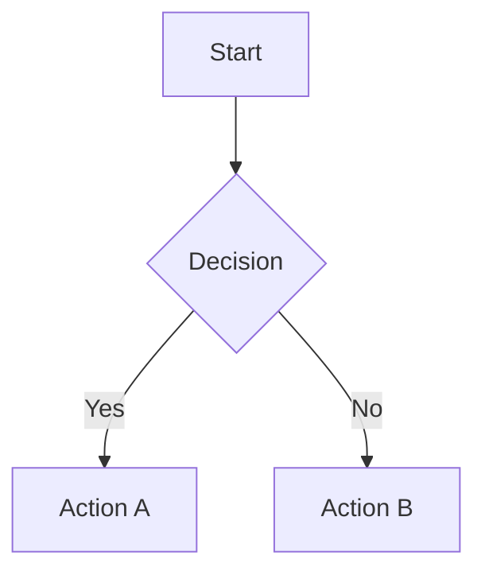

## Remark Common Plugins

### Remark Grid Table

~~Usage of
[root remark-grid-table](https://github.com/zestedesavoir/zmarkdown/tree/HEAD/packages/remark-grid-tables#readme)
Is discouraged with Docusaurus, use
[Adobe remark-gridtables](https://github.com/adobe/remark-gridtables) instead.~~ Remark Grid tables
Seems to be broken at the moment, the following does not seem to work:

````
+----+----+
| A  | B  |
+----+----+
| 1  | 2  |
+----+----+


+-------------------+------+
| Table Headings    | Here |
+--------+----------+------+
| Sub    | Headings | Too  |
+========+=================+
| cell   | column spanning |
| spans  +---------:+------+
| rows   |   normal | cell |
+---v----+:---------------:+
|        | cells can be    |
|        | *formatted*     |
|        | **paragraphs**  |
|        | ```             |
| multi  | and contain     |
| line   | blocks          |
| cells  | ```             |
+========+=========:+======+
| footer |    cells |      |
+--------+----------+------+
````

### Code Snippets

```cpp file=../../../../static/code/eg_codeSnippet.cpp start=start_here end=end_here

```

### Math

Using remark math with rehype Katex, equations written in LaTeX can be rendered, however LaTeX
Packages cannot be included.

$$
\frac{\partial \rho}{\partial t} + \frac{\partial(\rho u_{i})}{\partial x_{i}} = 0
$$

### Admonitions

Docusaurus supports admonition callouts using triple-colon syntax:

```md
:::note This is a note block. :::

:::tip This is a tip block. :::

:::warning This is a warning block. :::

:::danger This is a danger block. :::
```

Custom titles are supported: `:::info[Custom Title]`

### Tables

Standard markdown tables use pipe-delimited rows with a header separator:

| Feature   | Supported | Notes                                         |
| --------- | --------- | --------------------------------------------- |
| Basic     | Yes       | Pipe-delimited with `---` separator           |
| Alignment | Yes       | `:---`, `:---:`, `---:` for left/center/right |
| Colspan   | No        | Not supported in standard markdown; use HTML  |

### Nested Lists and Checklists

```md
1. First item
   - Sub-item with a nested point
     - Further nesting
2. Second item
   - [ ] Unfinished task
   - [x] Completed task
```

### Mermaid Diagrams

Docusaurus renders Mermaid diagrams inside fenced code blocks tagged with `mermaid`:

````md

````

Supported diagram types include flowcharts, sequence diagrams, class diagrams, state diagrams, Gantt
charts, pie charts, and git graphs.

### Details / Collapsible Sections

```md
<details>
  <summary>Click to expand</summary>
  Hidden content here.
</details>
```

### Tabs Component

The tabs UI is provided via Docusaurus theme imports:

```md
import Tabs from '@theme/Tabs'; import TabItem from '@theme/TabItem';

<Tabs>
  <TabItem value="option-a" label="Option A">Content for A</TabItem>
  <TabItem value="option-b" label="Option B">Content for B</TabItem>
</Tabs>
```

Group tabs across the page with a shared `groupId` prop.

### Inline HTML

Docusaurus allows raw HTML when markdown constructs are insufficient. Common uses include styled
`<div>` containers, `<iframe>` embeds, and `<details>` elements. Keep HTML usage minimal to maintain
portability across renderers.

## Common Pitfalls

1. Memorising content without understanding the underlying principles — this leads to poor
   application in unfamiliar contexts.

2. Focusing only on content knowledge without developing exam technique and question-answering
   skills.

3. Not practising with past papers or exercises under timed conditions.

4. Ignoring feedback from marked work and failing to address recurring weaknesses.

### Additional Math Examples

Inline math: $E = mc^2$ and $\nabla \times \mathbf{E} = -\frac{\partial \mathbf{B}}{\partial t}$.

Block math with aligned equations:

$$\begin{aligned} \nabla \cdot \mathbf{E} &= \frac{\rho}{\varepsilon_0} \\ \nabla \cdot \mathbf{B} &= 0 \end{aligned}$$

## Summary

The key principles covered in this topic are linked in the sub-pages above. Focus on understanding
the definitions, applying the formulas or frameworks, and evaluating strengths and limitations of
each approach.

## Worked Examples

Worked examples demonstrating the application of key concepts are covered in the detailed sub-pages
linked above.
