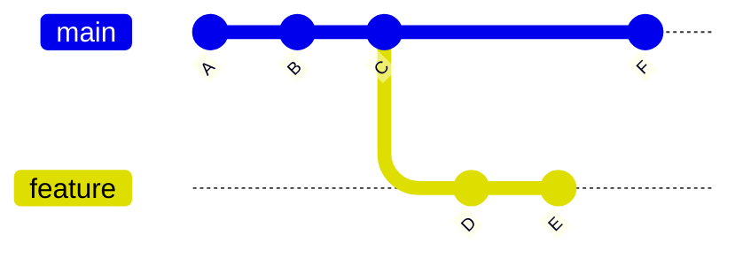
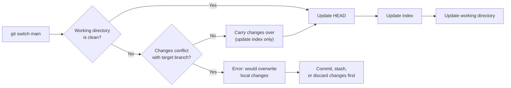

## Why Branching Matters

Branching is the mechanism that enables **parallel development** — multiple developers (or a single developer working on multiple features) can modify the codebase independently, then integrate their changes. Git's branching model is one of its defining strengths: branches are cheap ($O(1)$ creation), fast to switch, and designed to be created and deleted frequently.

This contrasts sharply with older VCS where branching was an expensive operation that involved copying the entire directory tree (CVS) or was mediated by a central server (early SVN).

## Branch Internals

A branch in Git is nothing more than a **40-byte text file** containing a SHA-1 hash. Creating a branch does not copy any files or objects — it writes a single reference:

```bash
$ git branch feature-auth
# Equivalent to: echo $(git rev-parse HEAD) > .git/refs/heads/feature-auth
```

This means:

- Creating 1,000 branches costs the same as creating 1 (a few microseconds).
- Deleting a branch does not delete any commits — it only removes the reference.
- A commit can be reachable from multiple branches simultaneously.



In the graph above:

- `main` points to commit `F`.
- `feature` points to commit `E`.
- Commits `A`, `B`, `C` are shared by both branches — no duplication.
- Commit `D` and `E` are only reachable from `feature`.
- Commit `F` is only reachable from `main`.

## Creating and Managing Branches

### Creating Branches

```bash
# Create a branch from HEAD (does not switch to it)
$ git branch feature-auth

# Create and switch in one step
$ git switch -c feature-auth

# Create a branch from a specific commit
$ git branch release-1.0 a3f2b1c

# Create a branch from a remote-tracking branch
$ git switch -c feature-auth origin/feature-auth
```

### Listing and Inspecting Branches

```bash
# List local branches
$ git branch

# List all branches (local + remote-tracking)
$ git branch -a

# List branches with their last commit
$ git branch -v

# Show which branches contain a specific commit
$ git branch --contains a3f2b1c

# Show merged branches (branches whose commits are all in HEAD)
$ git branch --merged

# Show unmerged branches (branches with commits not in HEAD)
$ git branch --no-merged
```

### Switching Branches

Git provides two commands for switching branches. `git switch` is the modern command (Git 2.23+); `git checkout` is the legacy command that serves double duty (switch branches and restore files).

```bash
# Modern (recommended)
$ git switch main

# Legacy (still widely used)
$ git checkout main
```

### What Happens During a Branch Switch

When you run `git switch main`, Git performs the following:

1. **Validate**: Check that the working directory is clean (or that changes can be carried over).
2. **Update HEAD**: Write `ref: refs/heads/main` to `.git/HEAD`.
3. **Update the index**: Load the tree object pointed to by `main` into the index.
4. **Update the working directory**: Compare the new index with the current working directory, and add, modify, or delete files as needed.



If you have uncommitted changes that **do not conflict** with the target branch, Git carries them over. If they **do conflict**, Git refuses to switch:

```
error: Your local changes to the following files would be overwritten by checkout:
    src/main.c
Please commit your changes or stash them before you switch branches.
Aborting
```

### Force Switching

If you want to discard local changes and switch anyway:

```bash
$ git switch -f main
# Discards all uncommitted changes in the working directory and index
```

:::warning

`git switch -f` is **destructive** — it discards all uncommitted changes. Use `git stash` first if you want to preserve them.

:::

## Deleting Branches

```bash
# Delete a branch (only if fully merged into HEAD)
$ git branch -d feature-auth

# Force delete (even if not merged)
$ git branch -D feature-auth

# Delete a remote branch
$ git push origin --delete feature-auth
# Or: git push origin :feature-auth
```

### Safe Deletion Rules

- `git branch -d` refuses to delete a branch if it contains commits not reachable from any other branch. This prevents accidental loss of work.
- `git branch -D` bypasses this check.
- Even after deletion, commits are still in the object store and recoverable via the reflog for 90 days (default).

## Branch Naming Conventions

Consistent branch naming is essential for project hygiene. Common conventions:

| Pattern                          | Purpose                                            |
| -------------------------------- | -------------------------------------------------- |
| `main`, `master`                 | Production-ready code                              |
| `staging`                        | Pre-production integration branch                  |
| `develop`                        | Active development (Git Flow)                      |
| `feature/<ticket>-<description>` | Feature development (e.g., `feature/PROJ-42-auth`) |
| `bugfix/<ticket>-<description>`  | Bug fixes                                          |
| `hotfix/<description>`           | Urgent production fixes                            |
| `release/<version>`              | Release preparation                                |
| `experiment/<description>`       | Experimental work                                  |

:::tip

Configure `git config --global push.default current` to ensure `git push` always pushes the current branch to a remote branch with the same name. This prevents accidental pushes to the wrong branch.

:::

## Tracking Branches

A **tracking branch** is a local branch that has a direct relationship with a remote branch. When you clone a repository, Git automatically creates a tracking branch for the default remote branch:

```bash
# Set up tracking (automatically done by git clone)
$ git branch --set-upstream-to=origin/main main

# Or when creating the branch
$ git switch -c feature origin/feature

# Check tracking status
$ git branch -vv
  feature  a3f2b1c [origin/feature] Add login page
* main     b7e9d4f [origin/main] Merge pull request #12
```

When a branch has an upstream tracking reference, Git can automatically:

- Determine the correct remote for `git push` and `git pull`.
- Show ahead/behind counts in `git status` and `git branch -vv`.
- Enable `git pull` without arguments.

```bash
# git status with tracking information
On branch main
Your branch is ahead of 'origin/main' by 3 commits.
  (use "git push" to publish your local commits)
```

## Renaming Branches

```bash
# Rename current branch
$ git branch -m new-name

# Rename a specific branch
$ git branch -m old-name new-name

# Rename the corresponding remote branch
$ git push origin -u new-name
$ git push origin --delete old-name
```

## Detached HEAD (Revisited)

Detached HEAD occurs when `HEAD` points directly to a commit rather than a branch reference. This happens when you:

- Check out a specific commit hash: `git checkout a3f2b1c`
- Check out a tag: `git checkout v1.0`
- Check out a remote branch without creating a local tracking branch: `git checkout origin/feature`

```mermaid
gitGraph
    commit id: "A"
    commit id: "B"
    commit id: "C"
    commit id: "D"
    checkout B
    commit id: "E (orphaned!)"
    commit id: "F (orphaned!)"
```

### Recovering from Detached HEAD

```bash
# While in detached HEAD
$ git branch save-my-work  # Save current position

# After accidentally switching away
$ git reflog               # Find the commit hash
$ git branch save-my-work HEAD@{3}  # Create branch from lost commit
```

## Common Pitfalls

### 1. Forgetting to Switch Branches

```bash
# You intended to work on a feature, but forgot to switch
$ echo "new code" >> file.txt
$ git add file.txt
$ git commit -m "Add new feature"
# Oops — committed to main instead of feature-auth
```

**Recovery**:

```bash
# Create a branch at the current commit
$ git branch feature-auth
# Reset main back one commit
$ git reset HEAD~1
# Switch to the feature branch
$ git switch feature-auth
```

### 2. Creating Branches from Stale Bases

```bash
# main has advanced since you created feature-auth
$ git switch main
$ git pull   # main is now at commit F
$ git switch feature-auth
# feature-auth is still based on commit C (3 commits behind)
```

This leads to merge conflicts when you eventually merge. To rebase your feature on the latest main:

```bash
$ git rebase main
```

See [Rebasing](./03-rebasing.md) for the full treatment.

### 3. Accumulating Merged Branches

Over time, merged branches clutter `git branch` output. Clean them up regularly:

```bash
# Delete all branches merged into main
$ git branch --merged main | grep -v "^\*\|  main" | xargs -r git branch -d

# Delete all remote branches that no longer exist on the remote
$ git fetch --prune
```
